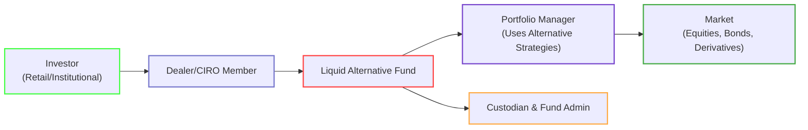

## 13.3 Liquid Alternative Funds (Alternative Mutual Funds)

Liquid Alternative Funds—often simply called “liquid alts”—are one of the fastest-growing segments within the Canadian investment landscape. They aim to merge traditional hedge-fund-like strategies with the daily liquidity and regulatory oversight of conventional mutual funds. Many people call them “Alternative Mutual Funds” or “Alt Funds” in Canada. This evolution allows a broader pool of investors, including retail clients who might otherwise never dip their toes into the complexities of hedge funds, to take advantage of advanced trading strategies such as short selling and derivatives-based hedging.

But before we dive into the nuts and bolts, I have to share a personal anecdote. Years ago, I found myself at a financial conference, listening to a hedge fund manager bragging about a sophisticated arbitrage strategy he used. I remember wondering: “Why aren't typical retail investors able to access these kinds of sophisticated moves?” Then, over the past several years, regulators in Canada rolled out guidelines that allowed precisely this—hedge fund strategies brought into the public realm…with conditions. Aha! So Liquid Alts answered my earlier question.

Below, we’ll unpack the concept of Liquid Alternative Funds, their regulatory environment, and best practices when incorporating them into clients’ portfolios.

---

### Understanding the Basics of Liquid Alternative Funds

Liquid Alternative Funds are a special category of investment products that incorporate “alternative” strategies—like short selling, using leverage, and extensive derivatives—that historically were mostly reserved for hedge funds. The key distinction is that Liquid Alts must abide by a stricter regulatory regime (in Canada, primarily National Instrument (NI) 81-102) to ensure they can be bought and sold daily (daily liquidity) and that they maintain transparent disclosure of assets, fees, and investment strategies for shareholders. Because of these regulatory protections, these funds look and feel more like typical mutual funds from a client’s perspective than a hedge fund in an offshore jurisdiction.

But everything with an upside typically comes with some trade-offs. These funds do charge higher fees, often reflecting the specialized expertise needed to run them. They also have permissible risk exposures that exceed those of vanilla mutual funds, which means the potential for higher volatility is very real.

#### Hedge Funds vs. Liquid Alts: Key Differences

1. **Regulatory Framework**: Hedge funds are typically not available to the general public and can operate under significantly looser restrictions (including high leverage). Liquid Alts, on the other hand, must comply with mutual fund regulations.
2. **Liquidity**: Hedge funds might restrict redemptions, have “lock-up” periods, or require notice before withdrawals. Liquid Alts must offer daily liquidity—investors can buy or redeem on any business day, just like you would with a typical mutual fund.
3. **Minimum Investments**: Hedge funds often require high minimum investments, sometimes in the hundreds of thousands. Liquid Alts, being open to retail investors, may require quite modest minimums—sometimes as low as a few hundred or a few thousand dollars.
4. **Transparency**: Hedge funds generally don’t divulge all their positions to investors. Liquid Alts must be more transparent and are subject to ongoing prospectus and financial reporting requirements.
5. **Fee Structure**: Hedge funds can charge performance-based fees (e.g., “2 and 20” model). While Liquid Alts may sometimes include performance fees, they’re often structured more akin to mutual funds, though with a somewhat higher management expense ratio (MER) than plain-vanilla funds.

#### Why Choose Liquid Alts?

Liquid Alts can potentially widen the investment arsenal available to retail clients. For instance, a Liquid Alt may:
- Use short selling to profit in down or sideways markets.
- Employ derivatives for hedging or leverage to amplify returns (though leverage can also amplify losses).
- Implement “market neutral” or “long/short” strategies designed to reduce correlation with mainstream asset classes.

All of this can be quite appealing to an investor looking for diversification, potential downside protection, or enhanced returns. But a big caveat remains: higher complexity often means higher risk and higher fees. Ensuring that Liquid Alts suit a client’s holistic investment goals and risk tolerance is paramount.

---

### Regulatory Framework in Canada

In Canada, Liquid Alternative Funds are governed primarily by National Instrument 81-102 (Investment Funds). Under NI 81-102, these Alternative Mutual Funds (or “Alt Funds”) can employ certain strategies that exceed the normal limits permitted for traditional mutual funds, such as:

- **Short Selling**: Liquid Alts can short up to 50% of their net asset value.
- **Leverage**: The “Aggregate Exposure Limit” typically allows up to 300% of the fund’s net asset value (NAV). This 3:1 ratio means if a fund has $1 million in assets, it can borrow or gain synthetic exposures (via derivatives) up to an additional $2 million.
- **Derivatives**: Allowed for both hedging and non-hedging (speculative) strategies, subject to notional limits.

All these strategies must be clearly laid out in the fund’s offering documents, providing investors with insight into exactly how the portfolio manager aims to capture returns and mitigate risk.

#### The Role of CIRO

Canada’s national self-regulatory organization, the Canadian Investment Regulatory Organization (CIRO), oversees both investment dealers and mutual fund dealers as of January 1, 2023. CIRO is also responsible for market integrity on equity and debt markets. If you’re curious about official bulletins, compliance notices, or rule amendments related to alternative mutual funds, you can find them at [https://www.ciro.ca](https://www.ciro.ca). Previously, the Mutual Fund Dealers Association of Canada (MFDA) and the Investment Industry Regulatory Organization of Canada (IIROC) would have each issued their own bulletins—but since their amalgamation into CIRO, these updates are now centralized.

#### Compliance Requirements

Because Liquid Alternative Funds are more complex than standard mutual funds, compliance professionals and advisors need to stay on top of additional due diligence, including:

- KYC (Know Your Client) verification to ensure the fund fits the client’s risk tolerance and objectives.
- Disclosures regarding the use of leverage, derivatives, or short selling.
- Enhanced supervision to confirm the fund’s portfolio managers are operating within NI 81-102 guidelines.

---

### Common Strategies Employed by Alternative Mutual Funds

Let’s delve a bit deeper into strategies that Liquid Alts typically use:

1. **Long/Short Equity**: The fund goes long on certain securities while also taking short positions in others, aiming to profit from the difference in performance. For example, the fund might be long on a technology company it believes is undervalued, while shorting another it deems overvalued—potentially making money regardless of the overall market direction.
2. **Market Neutral**: A technique where the fund aims for zero net exposure to the broader market—balancing its long and short positions so that overall market movements have minimal impact.
3. **Global Macro**: Strategies that rely on macroeconomic views, frequently using derivatives or currency positions to capture opportunities or hedge risks across global markets.
4. **Credit Arbitrage**: Targeting mispriced credits or spreads, potentially using derivatives to go long on one bond while shorting another. The idea is to capture a spread that might correct over time.
5. **Managed Futures & CTA (Commodity Trading Advisor) Strategies**: These rely heavily on futures contracts, trading commodities, indices, or currencies based on systematic or discretionary methods.

#### Example Case – Market Neutral Strategy

Let’s say a hypothetical Alternative Mutual Fund called Eagle Eye Market Neutral Fund invests in the Canadian equity market. The fund manager strongly believes that certain renewable energy utilities are undervalued, so the fund builds long positions in these stocks. At the same time, the manager identifies a few overhyped tech companies trading at extremely high price-to-earnings multiples, so the fund initiates short positions in those. The net effect? If the overall market goes up or down, the fund is designed to remain relatively insulated. Gains from the undervalued “long” stocks and the “short” overvalued stocks, if all goes according to plan, net out a positive return. But, of course, no strategy is foolproof; a manager’s views can be wrong, leading to losses on either side.

---

### Risks and Benefits of Liquid Alts

Liquid Alts, while brimming with potential, do come with cautionary notes.

#### Benefits

- **Diversification**: Because they frequently have lower correlation to traditional asset classes, they can help smooth a portfolio’s returns over time.
- **Downside Protection**: Techniques like short-selling can potentially help hedge market declines.
- **Enhanced Return Potential**: Skillful use of leverage or sophisticated derivatives may bolster returns over the long haul.
- **Managed Risk**: Despite advanced strategies, the regulator-imposed guidelines prevent “wild risk,” requiring frequent disclosures and set maximum leverage.

#### Risks

- **Leverage Amplification**: Using borrowed capital can magnify losses as well as gains. 
- **Complexity**: These strategies might be harder for investors (or even advisors) to fully understand, particularly in periods of market stress.
- **Higher Fees**: Management expense ratios (MERs) for Liquid Alts can be noticeably steeper compared to typical mutual funds.
- **Regulatory Limits**: While regulation can help protect investors, it may also reduce the full range of tools some managers can use, resulting in complex strategies still conforming to certain constraints.

Like in any situation—diving in with eyes wide open is crucial.

---

### Practical Example: Using a Liquid Alt in an Investor’s Portfolio

Let’s consider John, a 45-year-old pharmacist with a moderately aggressive risk profile. John’s investment portfolio is primarily in standard mutual funds—60% equity, 40% fixed income. He’s concerned about potential equity market downturns but still wants to grow his investments. Suppose his advisor proposes adding a Liquid Alt that uses a long/short strategy focusing on global equity markets.

John invests 10% of his total portfolio in this Liquid Alt fund. Over the next year, the markets become choppy, but his Liquid Alt fund manages to navigate the turbulence by shorting certain overvalued segments and protecting John’s portfolio from the worst of the downturn. Was it perfect? No. John still experiences some volatility, but the new addition hedges part of his portfolio risk, at the cost of higher fees. Had the fund manager’s calls been off, John might have underperformed, but at least the daily liquidity feature would allow him to exit more rapidly than if he were locked into a traditional hedge fund.

---

### Diagramming the Structure of a Liquid Alternative Fund

Below is a simplified Mermaid diagram illustrating the relationship between key participants in a Liquid Alt structure:

1. The investor places orders through a dealer, which is a member of CIRO.  
2. The dealer transmits these orders to the Liquid Alt fund.  
3. The fund is structured under mutual fund rules, providing daily liquidity.  
4. The portfolio manager executes alternative strategies, potentially using shorts, derivatives, leverage, etc.  
5. Cash and securities are held with a custodian, while a separate fund administrator handles recordkeeping.  

---

### Key Regulatory Documents & Resources

- **National Instrument 81-102 (Investment Funds)**: Sets the framework for mutual funds and alternative mutual funds in Canada, specifying permissible leverage and derivatives usage.  
- **CIRO Bulletins**: Official updates and guidance on compliance matters, including the rules around marketing, disclosure, and distribution of Liquid Alts.  
- **Fund Prospectuses & Fund Facts**: Each Liquid Alt publishes a prospectus and simplified “Fund Facts” document, detailing strategy, fees, and risks.  
- **AIMA (Alternative Investment Management Association)**: Offers educational and research materials on hedge funds, managed futures, and liquid alternatives.  
- **Investment Industry Publications**: The Globe and Mail, Investment Executive, and other Canadian financial media often cover market developments and new product offerings in the Liquid Alt space.

---

### Considerations for Advisors: Aligning Suitability with Client Needs

Advisors wanting to recommend Liquid Alts must ensure that they’re playing by the KYC and suitability rules (see Chapter 4: Getting to Know the Client, and Chapter 17: Mutual Fund Dealer Regulation for deeper references). These steps apply especially to alternative strategies:

1. **Risk Tolerance**: If a client is highly risk-averse, adding a leveraged alternative fund may not be advisable—even if the manager’s skill is top-notch.  
2. **Time Horizon**: Some Liquid Alts employ strategies that might be more volatile in the short run. Ensure the client’s timeline can handle fluctuations.  
3. **Diversification Benefits**: Evaluate how the addition of a Liquid Alt interacts with the rest of the client’s portfolio. If the client’s portfolio is already using alternate asset classes or derivatives, another Liquid Alt might be redundant or overly complex.  
4. **Cost-Benefit Analysis**: Factor in higher fees and see whether the potential outperformance (or diversification) justifies the additional cost.

As we mention repeatedly in finance, there’s no free lunch. Liquid Alts can serve as a potent tool in many portfolios, but only when utilized thoughtfully.

---

### Best Practices and Common Pitfalls

#### Best Practices

- **Thorough Due Diligence**: Understand a fund’s strategy, historical performance, risk measures, and total fees.  
- **Ongoing Monitoring**: Because strategies in these funds can shift quickly, keep an eye on monthly or quarterly updates to see if the manager’s approach or risk profile changes.  
- **Transparent Communication**: Clients must be informed of the potential for greater volatility and higher fees. This fosters trust and reduces surprises if the fund experiences a rough period.

#### Common Pitfalls

- **Misunderstanding Leverage**: Some advisors and investors underestimate leverage’s effects in periods of market turmoil. Make sure you model “worst-case” scenarios.  
- **Overconcentration**: Even the most robust Liquid Alt should seldom dominate a portfolio. Position sizing is critical.  
- **Fee Overload**: Combining multiple higher-cost funds can eat into returns. Evaluate whether you’re layering too many expensive strategies on top of each other.  
- **Inadequate Liquidity Management**: Yes, Liquid Alts must provide daily liquidity. But the strategies within the fund might involve instruments that are not always as liquid in extreme conditions. The fund manager’s ability to provide daily redemption might be stressed in certain market situations.

---

### Tools & Techniques for Analysis

Evaluating Liquid Alts often calls for more nuanced data than you might use for a plain-vanilla mutual fund. Here are a few categories of metrics to consider:

1. **Volatility Measures**: Standard deviation, Value-at-Risk (VaR).  
2. **Downside Risk Indicators**: Maximum drawdown or Sortino ratio.  
3. **Exposure Analysis**: Beta to equity/bond markets, net sector exposures.  
4. **Risk-Adjusted Performance**: Sharpe ratio or the Treynor ratio.  
5. **Correlation Metrics**: Evaluate how the Liquid Alt’s returns move relative to equities, bonds, and other assets in the portfolio.

A well-run Liquid Alt should, in theory, deliver some diversification benefits, so keep an eye on correlation. If it’s too high with the rest of your portfolio, the “alternative” aspect might be negligible.

---

### Embracing Liquid Alts: Key Takeaways

- Liquid Alternative Funds merge alternative strategies with the familiar structure of mutual funds, allowing daily liquidity and robust regulatory oversight.  
- They can deploy sophisticated strategies like short selling, derivatives, and leverage—subject to defined limits, mainly through NI 81-102.  
- They’re typically more expensive than standard mutual funds and can pose heightened risk (especially in volatile markets).  
- Suitability—matching client risk tolerance and objectives—remains of utmost importance.  
- Ongoing monitoring is crucial, as alternative strategies can rapidly shift or encounter periods of drawdown that might surprise the unprepared.  
- CIRO bulletins and the prospectus documents are your guide to compliance and transparency.

Overall, Liquid Alts can be a more approachable entry into the “alternative” investing space for everyday investors. They are not a one-size-fits-all solution; they require careful evaluation, good communication with clients, and a firm grasp of the potential rewards and pitfalls. In short, Liquid Alts can be like adding a turbocharger to a car: exciting, but you’d better know how to handle the extra horsepower.

---

### Additional Resources

• [CIRO Website](https://www.ciro.ca) – For the latest bulletins, rule updates, and compliance guidelines around Alternative Mutual Funds and other investment products.  
• [National Instrument 81-102](https://www.osc.ca/en/securities-law/instruments-rules-policies/8/81-102) – Detailed regulations governing Alternative Mutual Funds (link to the Ontario Securities Commission website).  
• [AIMA](https://www.aima.org/) – The Alternative Investment Management Association’s resources, including primers on hedge funds, managed futures, and liquid alternatives.  
• [Investment Executive](https://www.investmentexecutive.com/) – Articles and commentaries on liquid alt adoption in Canada.  
• The Globe and Mail – Business sections often carry updated news, commentary, and analyses on funds employing alternative strategies.  

---

## Master the Basics of Liquid Alternative Funds: 10-Question Quiz



### Liquid Alternative Funds (also known as Alternative Mutual Funds) primarily differ from hedge funds in which of the following ways?

- [x] They are regulated under the rules governing mutual funds, providing daily liquidity.  
- [ ] They have higher leverage capacities and far fewer disclosure requirements.  
- [ ] They require extremely large minimum investments, limiting most retail access.  
- [ ] They only invest in private equity deals.  

> **Explanation:** Liquid Alts comply with Canadian mutual fund regulations (NI 81-102) and must offer daily liquidity, making them more accessible to retail investors than traditional hedge funds.

### Which document primarily governs the use of leverage and derivatives for Liquid Alternative Funds in Canada?

- [x] National Instrument 81-102 (Investment Funds)  
- [ ] The Canada Pension Plan Act  
- [ ] The Bank Act  
- [ ] National Policy 58-201  

> **Explanation:** National Instrument 81-102 sets out the rules on leverage, short-selling, and other investment parameters for Alternative Mutual Funds in Canada.

### Why might an investor consider adding a Liquid Alt to their portfolio?

- [x] To potentially reduce portfolio volatility through lower correlation with traditional asset classes.  
- [ ] To eliminate all risk from their investing activities.  
- [ ] To avoid all regulatory oversight.  
- [ ] Because Liquid Alts are always cheaper than traditional mutual funds.  

> **Explanation:** By using strategies like short-selling and derivatives, Liquid Alts can provide diversification benefits. However, they do not eliminate all risk and often have higher fees due to complexity.

### Which of these strategies is commonly employed by Liquid Alternative Funds?

- [x] Long/Short Equity  
- [ ] Buy-and-forget GIC style  
- [ ] Guaranteed high returns with no market exposure  
- [ ] Zero disclosure investing  

> **Explanation:** Liquid Alts often use long/short equity or similar hedge-fund-like strategies (market neutral, managed futures, etc.). They must fully disclose these in their fund documents.

### An advisor proposing a Liquid Alt to a client primarily uses "suitability" to ensure:

- [x] The fund’s risk level aligns with the client’s profile.  
- [ ] The fund always outperforms the market.  
- [x] The client understands potential volatility and higher fees.  
- [ ] The fund is the only product sold to the client.  

> **Explanation:** Suitability requires matching a product’s risk and objectives with the client’s risk tolerance and goals. In describing a Liquid Alt, the advisor should highlight complexities and higher costs.

### In Canada, oversight for mutual fund dealers recommending Liquid Alts is now provided by:

- [x] The Canadian Investment Regulatory Organization (CIRO)  
- [ ] The Mutual Fund Dealers Association (MFDA), as of now  
- [ ] The Investment Industry Regulatory Organization of Canada (IIROC)  
- [ ] The Federal Reserve Board  

> **Explanation:** As of January 1, 2023, the MFDA and IIROC amalgamated into the new self-regulatory organization, CIRO, which oversees both mutual fund dealers and investment dealers.

### One of the key advantages of Liquid Alternative Funds over traditional hedge funds is:

- [x] Daily liquidity for investors.  
- [ ] Unlimited use of leverage without regulatory limits.  
- [x] More rigorous reporting and transparency requirements.  
- [ ] Complete immunity to market volatility.  

> **Explanation:** Unlike many hedge funds, Liquid Alts must offer daily liquidity and comply with stricter reporting rules. However, they remain subject to market fluctuations.

### A Long/Short Equity Liquid Alt typically tries to:

- [x] Combine long positions in expected winners with short positions in expected losers.  
- [ ] Only invest in high-dividend-paying stocks for passive income.  
- [ ] Invest purely in government bonds.  
- [ ] Avoid short selling entirely.  

> **Explanation:** Long/Short Equity strategies are designed to maximize returns by being long on securities projected to outperform and short on those likely to underperform, potentially hedging market risk.

### Which is a potential risk of using leverage in a Liquid Alt?

- [x] Amplified losses in the event of adverse market movements.  
- [ ] Guaranteed double returns with zero downside.  
- [ ] No requirement to repay borrowed capital.  
- [ ] Elimination of portfolio diversification.  

> **Explanation:** Leverage can magnify both gains and losses. If the market moves against a leveraged position, losses can be significantly larger than the initial investment.

### True or False: Liquid Alternative Funds are prohibited from using derivatives in Canada.

- [x] False  
- [ ] True  

> **Explanation:** Liquid Alts are allowed to use derivatives for both hedging and non-hedging (speculative) purposes, subject to specific regulatory rules outlined in NI 81-102.


