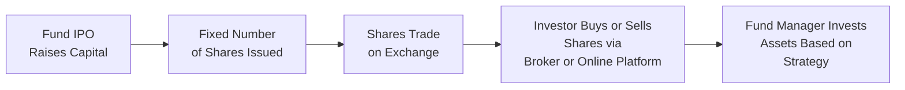
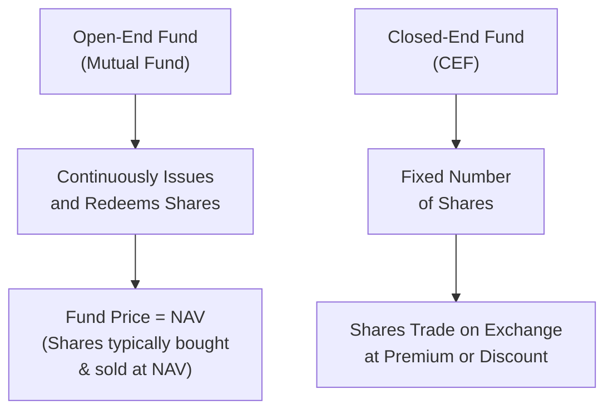

## 13.4 Closed-End Funds

When I first heard about closed-end funds (CEFs), I honestly pictured a door firmly shut, with only a handful of folks who got to buy tickets early on. It’s funny how the name alone can make these funds seem exclusive or difficult to access. But in reality, CEFs are simply investment funds with a fixed number of shares that trade on an exchange, just like stocks. They differ from open-end mutual funds in major ways—especially the fact that they don’t expand and contract every time investors purchase or redeem shares. Instead, they do one big raise of capital, often through an Initial Public Offering (IPO), and after that, the shares trade on an exchange. Let’s unpack how these funds function, why they can trade at a premium or discount to their Net Asset Value (NAV), and why you might feel intrigued (or maybe cautious) about adding them to a portfolio.

### Understanding the Basic Structure of a Closed-End Fund

A CEF is launched by an investment management company that raises a fixed amount of capital during its IPO. Once that money is raised, it typically does not expand or shrink just because of market sentiment. So, if you’ve got 10 million shares created in that initial offering, that’s what the manager has to work with—no more, no less. This structure contrasts with open-end mutual funds, which issue (or redeem) units continually.

A quick personal story: A few years back, a friend of mine was super excited about a new equity CEF focusing on infrastructure projects. He bought shares soon after the IPO, telling me that he liked the fund’s “buy-and-hold” approach and how it might invest in assets that aren’t super liquid—like certain private placements or niche real estate plays. And that’s one of the big draws to closed-end funds: Because they’re not forced to meet daily redemptions, they can hold less liquid or more specialized assets without worrying about a cash crunch when investors want out.

If you’ve never visualized how a CEF is structured, here’s a simple diagram:

In this diagram, you see how the initial capital raise becomes the pool of money the manager uses to invest in various securities. Investors who missed out on the IPO buy shares from existing shareholders on the exchange. Because of this, the share price is set by the market, not just by whatever the Net Asset Value is.

### NAV, Premiums, and Discounts

The Net Asset Value (NAV) of a CEF is calculated just like for other funds: it’s the total value of the fund’s assets minus liabilities, divided by the number of shares outstanding. That’s typically done at least once a day. But here’s the twist: The share price in the market might be higher or lower than that per-share NAV. If the share price is higher, we say the fund trades at a premium to NAV. If the share price is cheaper, the fund trades at a discount.

Why the difference? Well, supply and demand can drive the actual price. If investors love the fund’s strategy, or if the manager has an amazing track record, buyers might be willing to pay a little extra compared to the NAV. On the flip side, if the market doesn’t think the assets are fairly valued, or if liquidity is tight (few people trading), the fund can drift into discount territory.

It’s kind of like shopping for a rare collectible. Even if the recommended retail price is, say, $100, people might pay $120 if they perceive its value or significance as higher or if there just aren’t many sellers. Conversely, if folks aren’t that excited—or if the item isn’t well understood—someone might snag it at $80. Closed-end funds operate similarly in terms of pricing elasticity.

### Buy-and-Hold Strategy Benefits

Because a CEF manager isn’t dealing with daily subscriptions and redemptions from investors, they can deploy the fund’s capital into assets that might take time to mature or that are not as straightforward to buy and sell quickly. This can mean:

• Investing in niche markets, such as frontier economies, microcap stocks, or thinly traded debt instruments.  
• Holding private placements or convertible bonds that might be less liquid but offer higher potential returns (or more stable yields).  
• Minimizing turnover by waiting out the day-to-day volatility.  

This can be tremendously beneficial to managers who prioritize a consistent, long-term approach. They don’t have to scramble to find cash to meet redemptions if there’s a broad market sell-off, as open-end mutual funds often must do.

### Distributions: Interest, Dividends, and Return of Capital

Closed-end funds may distribute income to shareholders, which can include interest payments, dividends, and even a return of capital (ROC). That last phrase, “return of capital,” basically means giving you back some of the money you originally invested. It’s not necessarily a bad thing—sometimes it’s strategically used to maintain stable distributions. But it can reduce your cost base, so if you’re not aware of it, you might misunderstand your fund’s total return.

Distributions can happen monthly, quarterly, or annually. And not all distributions are the same:

• Interest from bonds and fixed-income securities.  
• Dividends from equity holdings.  
• Potential capital gains if the fund sells assets at appreciated values.  
• Return of capital, which can keep a distribution consistent even during low-income periods.  

If you ever notice distributions that exceed the fund’s actual income, that’s often a sign you’re receiving some portion of your own capital back. Some investors love consistent cash flow, though it can be a double-edged sword if they misread it as pure profit.

### Trading and Liquidity Considerations

Shares of a CEF are generally listed on stock exchanges like the Toronto Stock Exchange (TSX) or the NEO Exchange, meaning you can buy or sell them through a brokerage account just like any other publicly listed equity. However, the liquidity of a specific CEF can be a big question mark. If trading volume is low, the bid-ask spreads can widen, so you might end up selling at a discount if you need out quickly. Similarly, you might experience difficulty entering a position at a desirable price if few sellers are around.

Nowadays, online brokerage platforms provide volumes data, so you can typically see how heavily traded a particular CEF is. Just be aware that if daily volume is in the hundreds of shares, you might be stuck for a while if you want to transact a larger position.

### Suitability and Portfolio Context

Before jumping in, it’s wise to examine how a closed-end fund fits into your broader portfolio. Here are a few questions to consider:

• Does this CEF’s strategy complement my existing holdings, or am I duplicating the same exposures?  
• Am I comfortable with the potential discount or premium dynamics? (Yes, we love a discount, but we can also see that discount widen, leading to short- or medium-term paper losses.)  
• Am I okay with lower liquidity and the possibility of not being able to exit fast?  
• Do I understand the composition of the distributions and the tax implications, particularly if there’s a return of capital?  

On a personal level, I once owned a global equity CEF specializing in emerging markets. It used leverage to enhance returns. That was awesome during a bull run, but when the markets turned sour, the discount to NAV didn’t just widen a little—it absolutely ballooned, and folks who sold ended up realizing bigger losses than the underlying holdings might have implied. So, it’s definitely not something to jump into blindly.

### Comparing Open-End Funds and Closed-End Funds

Sometimes, pictures can clarify important distinctions between two structures. Here’s a simplified diagram showing open-end vs. closed-end funds:

Open-end funds always transact at or very close to their NAV. The total number of shares fluctuates daily based on subscriptions and redemptions. Meanwhile, CEFs have a stable share count. Investors who want in or out must do so on the secondary market, where they might pay more (premium) or less (discount) than the underlying holdings suggest.

### Tax Considerations in Canada

Now, let’s talk taxes. In Canada, distributions from CEFs can be composed of different types of income:

• Dividends from Canadian companies often benefit from the dividend tax credit.  
• Interest income is taxed as regular income (i.e., your marginal tax rate).  
• Capital gains distributions are taxed at 50% of your marginal rate.  
• Return of capital is not immediately taxable, but it reduces your Adjusted Cost Base (ACB) for the shares.  

Your ultimate tax bill depends on what those distributions look like and whether you hold the fund in a non-registered account, a Tax-Free Savings Account (TFSA), or a Registered Retirement Savings Plan (RRSP). For official guidelines, do keep an eye on Canada Revenue Agency (CRA) bulletins and updates. And if you want to geek out on reading official documentation, you can find the fund’s distribution policy in its prospectus on SEDAR+ (https://www.sedarplus.ca/).

### Regulatory Considerations and CIRO Oversight

The Canadian Investment Regulatory Organization (CIRO) is now the single self-regulatory body that oversees investment dealers and mutual fund dealers in Canada. Here’s how it connects to closed-end funds:

• Although CEFs are not “mutual funds” in the open-end sense, advisors and dealers dealing in them must still register and abide by CIRO rules (previously enforced by the former IIROC and MFDA, which amalgamated into CIRO).  
• CEFs must meet listing requirements on the TSX or other recognized exchanges, which include transparency on financials, investment objectives, and governance.  
• When dealing with clients, advisors must ensure they’re recommending or selling closed-end funds suitably, in line with the Know Your Client (KYC) rule and the product’s risk profile.  
• If a dealer offering these products becomes insolvent, the Canadian Investor Protection Fund (CIPF) provides protection for client assets, subject to coverage limits and conditions.  

You may also want to look into the OSFI (Office of the Superintendent of Financial Institutions), which oversees federally regulated financial institutions, though their direct involvement with closed-end fund rules is more indirect compared to CIRO’s role in regulating the dealers themselves.

### Potential for Leverage

Many closed-end funds make additional use of leverage—borrowing against the fund’s assets to purchase more securities. While this can ramp up returns in bull markets, it naturally does the same for losses when things reverse. If a fund is leveraged, you’ll likely see disclaimers in the prospectus or marketing materials, and you might also see higher volatility in the fund’s trading price.

In extreme market downturns, leveraged closed-end funds can drop a lot more quickly than their unleveraged counterparts, potentially widening the discount on top of an already falling NAV. So if you stumble upon a closed-end fund that looks like it’s significantly undervalued compared to its NAV, double-check whether leverage or illiquid holdings are partly behind that. Sometimes that “bargain” is actually a sign of higher perceived risk, not just a hidden gem.

### Best Practices

• Research the fund’s strategy thoroughly: Make sure you understand whether it invests in high-yield bonds, small-cap equities, real estate, or any specialized sector.  
• Monitor premiums/discounts over time: Historical data can reveal whether the fund tends to trade at a consistent discount or if that discount has historically narrowed or widened.  
• Check the distribution policy: Clarify how frequently distributions are made and whether return of capital is included.  
• Analyze liquidity: Look at average trading volume and the bid-ask spread. Decide if you’re comfortable with that level of liquidity.  
• Evaluate performance beyond short-term market fluctuations: Because managers often employ a buy-and-hold strategy with less liquid assets, performance evaluation might need a longer timeframe.  

### Common Pitfalls and Challenges

• Assuming a persistent discount will magically close: Discounts can remain for years, sometimes for the life of the fund.  
• Overlooking high management fees: Some CEFs can have higher fees than open-end funds, especially niche or specialized ones.  
• Failing to account for leverage risk: A 10% drop in the underlying asset can feel a lot worse if your CEF is levered up.  
• Misreading distributions: If return of capital is overlooked, you might think you’re earning a high yield, but you might actually be getting your own money back.  
• Lack of diversification: Some CEFs are very specific in focus (e.g., a single sector or narrow geography). That can be great if you want targeted exposure, but watch for overall portfolio balance.

### Real-World Case Example

Let’s imagine you’re analyzing the fictitious Maple Infrastructure Closed-End Fund (MIC). This fund raises $300 million in an IPO, at $10 per share, so there are 30 million shares outstanding. A year later, the fund’s NAV (calculated nightly) stands around $10.25 per share based on the value of the infrastructure assets. But lately, the market price is $9.70. That’s a discount of $0.55 per share, or roughly 5.4% below NAV.

Why might that discount exist?  
• Maybe the fund invests in some big, illiquid infrastructure projects that the market is skeptical about.  
• Perhaps the distribution yield is lower than some competing funds in the space, making it less appealing to income-focused investors.  
• Or the market just hasn’t warmed up to it, and it’s not widely covered by analysts or the press.  

Now, if that discount looks significant to you, you might think, “Hey, I can snag assets at a ‘bargain’.” But you’d want to check if that discount has historically existed. If it’s been around for many months, maybe it’s reflective of real concerns about the underlying assets, not just a short-term inefficiency.

Then, if media coverage or the manager’s performance improves, the discount might narrow, and you’d benefit from both the underlying NAV increase and the share price catching up closer to it. But that’s an “if.” The risk is that the discount stays or even widens if conditions get worse.

### Additional Resources and References

• Toronto Stock Exchange (TSX) and NEO Exchange: Check listing requirements, daily trading volumes, and quotes for closed-end funds.  
• SEDAR+ (https://www.sedarplus.ca/): Read closed-end fund prospectuses, annual reports, and financial statements.  
• CIRO (https://www.ciro.ca): Review the most up-to-date regulations and guidelines on offerings, disclosures, and suitability requirements.  
• “Canadian Closed-End Funds & ETFs” – Industry publications that analyze market trends, discount/premium statistics, and performance data.  
• Open-source financial tools like Yahoo Finance, Google Finance, or TMX Money can help track price movements, discounts, and yields in real time.

### Putting It All Together

Closed-end funds can be a fascinating corner of the investment world. With their ability to hold a broader range of assets, their sometimes-attractive distributions, and their potential to trade at a discount (or premium), they offer investors something different than an ordinary mutual fund or ETF might. But they’re not always suitable for every investor. The nuance of discount/premium dynamics, liquidity limitations, and potential leverage risk can make them more complicated to grasp. Still, once you understand their structure—and especially if you’re the type to hold long-term or want specialized exposures—a closed-end fund can be a compelling addition to your portfolio.

And don’t forget the overall rule of thumb: Do your homework, ask questions, read the prospectus on SEDAR+, and weigh how any single investment fits with your broader goals, risk tolerance, and time horizon. In the right hands, a closed-end fund can be a neat puzzle piece completing the mosaic of financial products in a well-diversified portfolio.

## Closed-End Funds in Canada: Tips, Strategies & Common Pitfalls – Knowledge Quiz



### What is a fundamental characteristic that differentiates closed-end funds (CEFs) from open-end mutual funds?

- [x] CEFs issue a fixed number of shares that trade on an exchange.  
- [ ] CEFs repricing automatically at the NAV at the end of each trading day.  
- [ ] CEFs exclusively hold private equity investments.  
- [ ] CEFs typically disallow the use of leverage.  

> **Explanation:** Unlike open-end mutual funds, which continuously issue and redeem shares at their NAV, closed-end funds have a fixed share count and trade on an exchange like stocks.

---

### Which of the following statements best explains why a CEF might trade at a premium or discount to its Net Asset Value (NAV)?

- [ ] CEFs are legally required to trade at exactly the NAV.  
- [x] Market supply and demand for shares can result in deviations from NAV.  
- [ ] CEF managers target a specific share price above the NAV.  
- [ ] Regulatory rules prohibit them from trading below NAV.  

> **Explanation:** Because the shares are traded on an exchange, buying and selling pressures can push the price above (premium) or below (discount) the fund’s NAV.

---

### Which distribution type involves returning an investor’s principal rather than just profits or income?

- [ ] Capital gains distribution.  
- [ ] Interest income distribution.  
- [x] Return of capital (ROC).  
- [ ] Qualified dividend.  

> **Explanation:** Return of capital is when part of the distribution payment comes from your initial principal, not from gains or income.

---

### How does the fixed share structure of CEFs benefit managers in implementing a buy-and-hold strategy?

- [x] They do not face the pressure of daily redemptions that force asset sales.  
- [ ] They have unlimited freedom to issue new shares anytime.  
- [ ] They can easily switch to an open-end structure on short notice.  
- [ ] They are incentivized by regulators to hold illiquid assets.  

> **Explanation:** Since shares are not continually created or redeemed, the fund manager is free to hold less liquid or specialized assets without worrying about forced redemptions.

---

### Which factor might cause a closed-end fund to exhibit low liquidity on an exchange?

- [x] Relatively small daily trading volume in its shares.  
- [ ] Permanent alignment of the share price with NAV.  
- [x] Limited interest or market awareness of the fund.  
- [ ] Large-scale advertising campaigns in mainstream media.  

> **Explanation:** Liquidity depends on how frequently and in what volume shares are traded. A niche or less popular fund can have thin trading, making it harder to buy or sell shares at a fair price.

---

### When evaluating the potential risks of a closed-end fund, which of the following is a key consideration?

- [ ] The fund’s daily creation and redemption feature.  
- [x] The presence of leverage in the fund’s structure.  
- [ ] The guaranteed liquidity of the fund’s shares.  
- [ ] The elimination of discount dynamics.  

> **Explanation:** Leverage can amplify both gains and losses, making it a crucial factor to investigate when assessing the risk profile of a closed-end fund.

---

### Why might an investor find it challenging to exit a position in a closed-end fund?

- [ ] All closed-end funds have lock-up periods.  
- [x] Low trading volumes can lead to wide bid-ask spreads and difficulty finding buyers.  
- [ ] CEFs never allow selling.  
- [ ] The NAV is recalculated only once a year.  

> **Explanation:** If a fund has thin trading volume, it can be difficult to sell shares efficiently, and the transaction costs (via wider bid-ask spreads) can be higher.

---

### What is one reason a CEF might distribute more than its actual income?

- [ ] Funds are legally prohibited from distributing any form of interest or dividends.  
- [x] The fund anticipates future gains and temporarily pays out a return of capital.  
- [ ] The price of the fund is at a large premium.  
- [ ] The management wants to reduce the NAV intentionally.  

> **Explanation:** A fund may choose to include a portion of principal with its distributions (i.e., return of capital) to maintain consistent payouts, even if its income in a given period is lower.

---

### Where can investors find official CEF disclosures and prospectuses in Canada?

- [ ] The CEF’s internal website only.  
- [ ] The Canadian Investor Protection Fund (CIPF) portal.  
- [ ] Private financial blogs and social media sites.  
- [x] The SEDAR+ website.  

> **Explanation:** In Canada, SEDAR+ (www.sedarplus.ca) is the official repository for securities-related documentation, including fund prospectuses and financial statements.

---

### Is it possible for a discount to the NAV to persist indefinitely for a closed-end fund?

- [x] True  
- [ ] False  

> **Explanation:** Some CEFs trade at a discount to NAV for extended periods or even permanently, depending on market sentiment, liquidity, and the fund’s overall attractiveness.


