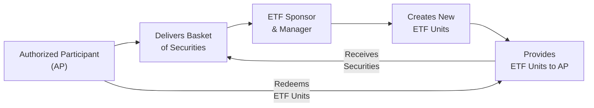

## 13.5 Exchange-Traded Funds (ETFs)

Exchange-Traded Funds (ETFs) have become a mainstay in modern investing—some might even call them the “rock stars” of portfolio management. Picture it this way: you’re getting some of the benefits of mutual funds, such as diversification and professional management, but then you also get to trade throughout the day like you would with individual stocks. It’s a bit like having your cake and eating it too, right?

But wait—don’t let the hype fool you into thinking ETFs are magically risk-free. As with any investment product, there are key mechanics, costs, risks, and regulations to consider. My friend once told me: “I heard ETFs are cheap, so I bought a ton of them.” That’s, well, one strategy, but not exactly recommended without a deeper understanding. So let’s roll up our sleeves and see what’s really going on under the hood of ETFs, especially in the Canadian context—where they’re regulated, how they’re created, and what pitfalls might lurk behind that glossy surface.

---

### What Are ETFs?

An ETF is fundamentally an investment fund that trades on an exchange (in Canada, this would be on the Toronto Stock Exchange (TSX), for example). Many ETFs track a market index—like the S&P/TSX Composite—even though there are also actively managed ETFs and factor-based (“smart beta”) funds. You can generally buy and sell ETFs through your brokerage account during market hours, much like an ordinary equity security.

Because ETFs are easy to trade and often have relatively low management fees (compared to most actively managed mutual funds), they’ve attracted a huge following. They cater to a wide range of investors—from beginners who just want broad market exposure, to sophisticated portfolio managers implementing advanced tactical strategies. 

Before diving into their more subtle features, it’s useful to recall that their design helps ensure each ETF’s market price approximates the net asset value (NAV) of its underlying holdings. We’ll dig further into that soon.

---

### How ETFs Combine Mutual Funds and Stocks

Let’s do a quick refresher from elsewhere in this book:

• Mutual funds, as discussed especially in Chapters 10 through 12, pool money from many investors and invest in a diversified portfolio of securities. However, they’re typically bought or redeemed at the end-of-day net asset value (NAV).  
• Stocks trade on exchanges, with prices fluctuating moment by moment, so you can buy or sell them in real time during trading hours.  

ETFs blend these concepts:  
• You get diversification (like a mutual fund) because an ETF holds multiple assets—be it equities, bonds, commodities, or other instruments.  
• You can trade all day long on an exchange, so transparency and flexibility are enhanced.  

This dual nature is one of the prime reasons ETFs have exploded in popularity.

---

### Types of ETFs

There’s an ever-expanding universe of ETFs. Here are some you’re likely to come across:

• Broad Market ETFs: Track large, diversified indices such as the S&P 500 or the S&P/TSX 60.  
• Sector-Specific ETFs: Focus on a particular sector—like technology, energy, or healthcare.  
• Bond ETFs: Hold fixed-income instruments, illustrated in Chapter 7.2 and 7.3, but trade like an equity.  
• Commodity ETFs: Grant exposure to commodities such as gold or oil without having to store physical assets in your garage.  
• Factor-Based (Smart Beta) ETFs: Track indexes constructed around specific “factors” like value, momentum, or low volatility.  
• Leveraged and Inverse ETFs: Use derivatives and borrowing to amplify or invert the returns of an underlying index—a topic that demands extra caution because of the complex risk profile.  
• Active ETFs: Managed by portfolio managers who aim to generate alpha (outperformance vs. an index), rather than merely track it.  

Generally, the choice depends on your investment objectives, risk tolerance (as we covered extensively in Chapter 4.5), and market outlook.

Below is a simple table highlighting these ETF types and some key considerations:

| ETF Type             | Objective                                              | Risks                                                                  | Cost Level                | Typical Uses                                       |
|----------------------|--------------------------------------------------------|-------------------------------------------------------------------------|---------------------------|-----------------------------------------------------|
| Broad Market         | Track entire indexes (e.g., S&P/TSX 60)               | Market risk, tracking error                                            | Usually low               | Core portfolio holding                               |
| Sector-Specific      | Track industry niches (e.g., tech, energy)            | Sector concentration risk, tracking error                               | Low to moderate           | Tactical allocations                                |
| Bond                 | Provide fixed-income exposure                          | Interest rate risk, credit risk, liquidity                              | Low to moderate           | Diversification, stable income                     |
| Commodity            | Track commodity prices (e.g., gold, oil)              | Commodity price volatility, storage/futures complexities               | Moderate                  | Diversification, inflation hedge                    |
| Factor-Based (Smart Beta) | Target factors (e.g., value, momentum)           | Misalignment of model, factor cycles, tracking error                    | Ranges from low to higher | Enhanced returns, factor tilts                      |
| Leveraged & Inverse  | Multiply or invert underlying index returns           | High market risk, tracking error, compounding risk over time            | Often higher              | Short-term tactical trading                         |
| Active               | Outperform a benchmark via manager allocation         | Manager risk, higher fees, style drift, tracking risk                   | Often higher than index   | Seeking alpha or specialized expertise              |

---

### The Creation/Redemption Mechanism

Now let’s talk about the unique engine that keeps ETF prices generally in line with their underlying net asset values: the creation/redemption mechanism. Imagine an ETF’s market price trades too high above its NAV. In that scenario, authorized participants (often large financial institutions) spot an arbitrage opportunity. They can deliver the underlying basket of securities to the ETF manager in exchange for newly created ETF shares, and then sell these shares on the market for a profit—pushing the ETF price back down toward its NAV.

Conversely, if the ETF price falls below NAV, an authorized participant can buy up the ETF shares cheaply on the market and redeem them with the ETF manager in exchange for the underlying securities, then sell those securities for a profit. This process effectively “redeems” shares from the market. Thus, an ETF’s market price is tethered to its NAV by a self-correcting mechanism.

Below is a simplified diagram showing how this creation/redemption mechanism works:

This mechanism, combined with competitive market forces, tends to keep the ETF trading price aligned with the value of its holdings. 

---

### Institutional Players: Authorized Participants (APs)

You might ask: “Who are these authorized participants anyway?” APs are typically large financial institutions—banks or investment dealers—that have contractual arrangements with ETF providers. They can create or redeem shares in large blocks (called creation units). They deliver (or receive) the basket of underlying securities to the ETF provider in exchange for newly minted (or retired) ETF shares. 

• This activity supports liquidity because APs can add or reduce the supply of ETF shares in the market.  
• It also helps correct temporary pricing discrepancies between the ETF’s market price and the aggregated value of its underlying assets.

Given the critical role APs play, they must be well-capitalized and have consistent access to large pools of the underlying securities. 

---

### Fees and Expenses

Whenever you invest in ETFs, it’s crucial to understand costs:

• Management Expense Ratio (MER): This covers the management fee, operational expenses, and other administrative costs.  
• Bid-Ask Spread: The difference between the price you’d pay (ask) and the price you’d receive (bid) if you sold immediately. Less-liquid ETFs tend to have larger spreads, which can nudge up overall trading costs.  
• Trading Commissions: Buying an ETF can incur the same trading commission as stocks, unless you have a commission-free arrangement.  

ETFs have historically marketed themselves as cheaper alternatives to many mutual funds, and that’s often true for broad index-tracking ETFs. Still, do not assume all ETFs are cheap. For instance, specialized or actively managed ETFs might have higher MERs. Some factor-based products can also command higher fees because they involve more elaborate portfolio construction methodologies.

---

### Liquidity and Market Depth

A common misconception is that you should judge ETF liquidity only by its trading volume. Actually, an ETF’s real liquidity is also tied to the liquidity of its underlying assets. A heavily traded equity ETF with liquid underlying stock positions might have a tight bid-ask spread and ample volume. Meanwhile, an ETF that holds niche or illiquid holdings—like certain high-yield bonds or emerging-market equities—might show relatively low trading liquidity and wider bid-ask spreads.

In Canada, the liquidity of an ETF is further influenced by whether it’s cross-listed in other markets or if it has multiple market makers. CIRO (the Canadian Investment Regulatory Organization) exercises oversight of dealers who facilitate ETF trading to ensure fair practices. (Recall that CIRO is the national self-regulatory body that replaced the old MFDA and IIROC in 2023.)

---

### Regulatory Framework in Canada

Canadian ETFs are subject to rules under National Instrument 81-102, which also governs mutual funds. Key documents like the Fund Facts (or ETF Facts) are mandated disclosures, giving investors a standardized overview of the fund’s investment objective, strategies, fees, past performance, and risks. CIRO enforces compliance requirements for dealers offering ETFs, ensuring they observe proper Know Your Client (KYC) and suitability guidelines—especially relevant for levered or more complex ETFs.

Here are some highlights:

• National Instrument 81-102 outlines constraints on leverage, concentration limits, and investment strategies for many ETFs.  
• Prospectus disclosures are required before an ETF can be offered—these details can be found easily on SEDAR+ (System for Electronic Document Analysis and Retrieval Plus).  
• “Fund Facts” or “ETF Facts” documents are plain-language summaries that highlight key info in a few pages, so investors can quickly gauge the product’s nature and costs.  

For more in-depth discussions on the Canadian securities regulatory framework, revisit Chapter 2.5 and Chapter 17, which cover mutual fund dealer regulations and other compliance considerations.

---

### Practical Example: Buying an ETF in Canada

Let’s say Sandra wants broad equity market exposure in Canada, so she chooses a TSX-listed ETF tracking the S&P/TSX 60 Index. She logs into her online brokerage, types in the ETF ticker symbol, and places a buy order. Because the ETF trades like a stock, she instantly sees a bid-ask price. After reviewing the bid-ask spread, she goes with a limit order near the current ask price to mitigate slippage. 

Over time, if the ETF’s holdings appreciate, Sandra’s ETF units should generally reflect that upward movement—minus fees and tracking error. If at some point the ETF’s price significantly deviates from the underlying index, authorized participants can jump in to create or redeem shares, nudging the price back on track.  

---

### Factor-Based (Smart Beta) and Active Strategies

Many investors get intrigued by factor-based (smart beta) ETFs. These ETFs try to capture returns correlated with specific “factors” like value (stocks trading cheaply relative to fundamentals) or momentum (stocks with strong recent price performance). While they might offer higher upside compared to broad-market ETFs, remember that these factors can underperform for seasons. So if you decide to invest in a value-oriented “smart beta” ETF, you have to be ready to weather times when the market is in love with growth stocks instead.

Active ETFs, meanwhile, seek to outperform a particular benchmark. That’s appealing, especially if you believe in the skill of a specific fund manager. But higher fees and the possibility of underperformance are real variables you should weigh. The manager could blow past the benchmark in a good year, only to lag significantly in the next.

---

### Common Pitfalls and Best Practices

• Overtrading: The ability to trade ETFs all day is a blessing and a curse. Some investors get too excited by intraday price movements, racking up needless commissions or short-term capital gains.  
• Failing to Understand Leverage: Leveraged and inverse ETFs reset exposure daily, which can lead to unexpected results over longer periods due to compounding effects.  
• Ignoring Tracking Error: ETFs aim to replicate the performance of an index (unless actively managed), but minor differences—like fees, cash drag, or sampling—can cause tracking error. That’s usually small for broad index ETFs, but you should verify anyway.  
• Overlooking Spread Costs: Thinly traded ETFs or those with illiquid holdings can have wide spreads, eroding returns if you buy or sell frequently.  
• Inadequate Due Diligence: Just because it’s “an ETF” doesn’t mean it’s a safe bet. Always check the ETF’s underlying holdings, risk level, and fees.  

More robust insights into risk assessment can be found in Chapter 8 (especially 8.4 How to Measure Risk) and Chapter 5 on Behavioural Finance for how emotional biases can wreak havoc on rational decision-making.

---

### Case Study: Rising Commodity Prices and a Thematic ETF

A real-world scenario: Suppose John, an active trader, thinks gold prices will surge due to global economic uncertainty (maybe he’s read up on the business cycle phases in Chapter 3.3). He decides to buy a gold commodity ETF on the TSX. The product invests primarily in gold bullion. Because the ETF trades like a stock, he can quickly get in or out whenever the price moves.

But what if industrial demand for gold unexpectedly sags? If gold prices plunge, John’s ETF shares will probably follow suit. And if the bid-ask spread widens during a volatile market, he might pay extra in transaction costs. This is a good illustration of how an ETF can provide easy exposure to a theme but doesn’t shield you from the underlying asset’s inherent risks.

---

### Incorporating ETFs into a Portfolio

Earlier in Chapter 8, we introduced the concept of portfolio construction and the significance of asset allocation. ETFs can be an efficient vehicle to establish a well-diversified base. They often serve as core holdings to capture broad market returns, while letting you add specialized funds to reflect personal views or meet targeted goals (like an ESG-themed ETF, for instance).

• Strategic Asset Allocation Approach: You might pick a few broad-based ETFs—one for Canadian equity, one for U.S. equity, one for global equity, and one for bonds—and hold them for the long term.  
• Tactical Adjustments: If you anticipate higher volatility, you might shift a modest portion to a low-volatility factor ETF or a short-term bond ETF for stability.  

Keep your financial plan in mind (Chapter 4.2 covers the financial planning approach). Suitability is tantamount, so align every position in your portfolio with your time horizon, objectives, and risk tolerance.

---

### Tax Considerations

For Canadian investors, an ETF’s tax implications can vary based on where it’s held (registered vs. non-registered accounts) and the kind of distributions it pays out (dividends vs. interest vs. capital gains). While we covered many relevant points in Chapter 6, below are a couple of reminders:

• Capital Gains: Realized gains from trading in a non-registered account are taxed at 50% of your marginal rate.  
• Distributions: ETFs may distribute income, dividends, or capital gains. Canadian dividends get the dividend tax credit if the fund invests in Canadian equities.  
• Foreign Withholding Taxes: If an ETF invests in U.S. equities, you might face withholding taxes on dividends unless it’s structured in a tax-efficient manner.  

Being mindful of tax efficiency can significantly influence your total return.

---

### Canadian Resources and Further Reading

Interested in digging deeper? Below are some valuable sources:

• CIRO: The Canadian Investment Regulatory Organization that oversees dealer practices. (https://www.ciro.ca)  
• National Instrument 81-102: Governs Canadian mutual funds and ETFs. You can find the official text on the Canadian Securities Administrators (CSA) website.  
• SEDAR+: The go-to for official filings, including ETF prospectuses and continuous disclosure documents.  
• Fund Facts / ETF Facts: A concise document that outlines fees, objectives, performance, and crucial risk factors—obligatory reading before investing.  
• Morningstar, Refinitiv Lipper, and other research platforms: Provide performance data, analytics, and compare risk metrics across dozens of ETFs.  
• CFA Program Curriculum: Contains comprehensive material on ETF structures, mechanics, and their role in investment portfolios.

---

### Quick Glossary

• **Bid-Ask Spread**: The gap between the highest price a buyer is willing to pay (bid) and the lowest price a seller is willing to accept (ask). Wide spreads increase your cost of buying or selling.  
• **Creation/Redemption Mechanism**: The process allowing ETFs to issue and redeem shares in large blocks (creation units) so that ETF price remains close to NAV.  
• **Authorized Participant (AP)**: A large financial institution that handles the creation and redemption of ETF shares by delivering or receiving underlying securities when necessary.  
• **Active ETF**: An ETF managed by a professional with a mandate to beat, not just track, a benchmark.  
• **Factor-Based ETF (Smart Beta)**: An ETF emphasizing specific “factors” such as value, momentum, or low volatility, instead of replicating the broad market.  
• **Low-Cost Fund**: Any fund (ETF or mutual) offering minimal management fees or total expense ratios, which is especially relevant for cost-sensitive investors.

---

### Final Thoughts

ETFs have radically transformed how people invest. Their intraday liquidity, relative cost-effectiveness, and vast variety of themes and strategies are undeniably appealing. Yet, as we’ve discussed, “ETF” is not a catch-all synonym for “safe” or “always cheap.” Key decisions must revolve around what’s under the hood—be that the index methodology, the portfolio manager’s strategy, the level of leverage used, or the liquidity of the constituent securities.

At the end of the day, it pays to do your homework: check fees, evaluate tracking error, read the ETF Facts, and ensure any product you pick aligns with your personal financial and risk profile (Chapter 4.5 and 8.1 provide deeper context on risk-return concepts). If done thoughtfully, ETFs can be a cornerstone of your investment approach, offering a cost-effective and flexible path toward building a portfolio you feel confident about.

Just remember: read that prospectus, watch out for hidden costs, and don’t forget the emotional side of trading. Or as my old finance professor liked to say: “Watch your head in the clouds, and your wallet on the ground.” Good luck with your ETF journey!

---

## Quiz: Exchange-Traded Funds (ETFs)



### What is one primary reason that ETFs are often considered low-cost investment products?

- [x] They typically incur lower management fees compared to many active mutual funds.
- [ ] They are exempt from all taxes in Canada.
- [ ] They never distribute capital gains.
- [ ] They provide guaranteed returns.

> **Explanation:** Many ETFs—particularly broad-market ones—have generally lower management fees than actively managed mutual funds. However, “low-cost” doesn’t mean “no-cost.” Additionally, they can still distribute capital gains and are not inherently tax-exempt.

### Which key market participant helps keep an ETF’s trading price close to its net asset value (NAV)?

- [x] Authorized Participants (APs)
- [ ] Retail investors
- [ ] Securities regulators
- [ ] Stockbrokers only

> **Explanation:** Authorized Participants create or redeem units in large blocks, arbitraging away significant price discrepancies between the ETF’s market price and its NAV.

### Which document must Canadian ETF providers produce that summarizes fees, objectives, past performance, and risk factors in a few pages?

- [x] ETF Facts
- [ ] Annual Information Form (AIF)
- [ ] Simplified Prospectus
- [ ] Management Information Circular

> **Explanation:** Canadian securities regulations require an ETF Facts document, offering a concise overview of an ETF. The “Fund Facts” document serves a similar function for mutual funds.

### If an ETF holds illiquid underlying securities, what impact might you expect on trading?

- [x] Wider bid-ask spreads and lower secondary market liquidity
- [ ] Completely stagnant prices for the ETF
- [ ] Guaranteed improvement in trading volume
- [ ] No effect on the ETF’s trading characteristics

> **Explanation:** Illiquid underlying securities often translate to wider bid-ask spreads, making it costlier to enter or exit the ETF.

### An investor interested in targeting stocks with strong recent price trends might consider which type of ETF?

- [x] Factor-based (Smart Beta) ETF focused on momentum
- [ ] A leveraged ETF that magnifies the underlying index return
- [x] A factor-based (Smart Beta) ETF with low-volatility focus
- [ ] A broad-market ETF

> **Explanation:** Factor-based ETFs allow investors to capture returns associated with specific attributes like momentum or low volatility. If recent price trends are the key driver, a momentum-focused smart beta ETF might be used.

### Which governing instrument in Canada sets out specific parameters for ETFs regarding concentration limits, leverage, and investment restrictions?

- [x] National Instrument 81-102
- [ ] National Instrument 45-106
- [ ] Basel III
- [ ] International Accounting Standard (IAS) 16

> **Explanation:** National Instrument 81-102 imposes restrictions and guidelines for mutual funds and ETFs in Canada, including rules around concentration, leverage, and investment strategies.

### What is the best explanation of tracking error in the context of ETFs?

- [x] The difference in performance between the ETF and its benchmark index
- [ ] The fee charged for purchasing an ETF
- [x] A measure of the underlying stock’s volatility
- [ ] The difference between an ETF’s highest and lowest daily share price

> **Explanation:** Tracking error represents how closely (or not) an ETF’s returns match those of its target index or benchmark, factoring in fees, sampling, and other issues.

### Why might some investors overtrade ETFs?

- [x] ETFs can be bought and sold intraday, tempting frequent trades.
- [ ] ETF trades have no cost.
- [ ] The ETF price changes only monthly, so there’s no intraday data.
- [ ] ETFs are government-backed, guaranteeing no losses.

> **Explanation:** Because ETFs can be traded throughout the day like individual stocks, some investors may be tempted to “time the market,” incurring excessive trading costs.

### Which factor most directly influences the liquidity of an ETF?

- [x] The liquidity of the securities held by the ETF
- [ ] Composition of the board of directors
- [ ] The brand name of the ETF provider
- [ ] The stock exchange’s absolute trading volume across all securities

> **Explanation:** An ETF’s liquidity is tied to the liquidity of its underlying holdings. If the underlying assets are illiquid, the ETF itself tends to have wider spreads and lower liquidity.

### An investor who holds an ETF in a taxable account might face which tax implications?

- [x] True
- [ ] False

> **Explanation:** Like other investments, ETFs in a taxable (non-registered) account can distribute taxable dividends, interest, or capital gains. Gains from selling the ETF are also partially taxable at an investor’s marginal rate.


