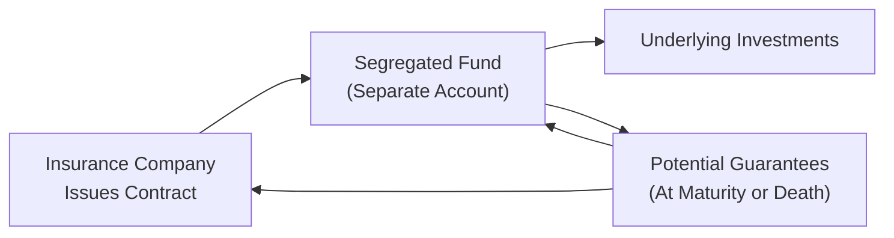

## 13.6 Segregated Funds

Segregated funds, often called “seg funds,” are a bit like the quiet cousin of mutual funds—similar in how money is invested but with a few interesting twists that come from their status as insurance contracts. Perhaps you’ve heard a friend say, “I love the peace of mind those guarantees bring,” and wondered what on earth they were talking about. Well, that’s the beauty of segregated funds: they offer the potential for market-driven growth and the reassurance of insurance protection. So, let’s walk through the nuts and bolts of how they work, why some investors are drawn to them, and what key features you ought to keep in mind.

### The Basics of Segregated Funds
A segregated fund is an insurance contract that invests in an underlying pool of assets—similar to a mutual fund’s structure. Here’s the crucial difference, though: when you put money into a segregated fund, you’re actually buying a contract from an insurance company, rather than units or shares in an investment fund. The assets are held separately (or “segregated”) from the insurance company’s general assets. This separation ensures that, in the event the insurer faces insolvency, the funds remain distinct and policyholders’ contracts gain certain protective benefits.

And—just in case you’re curious—the insurance company’s obligations to you are backed by that insurance contract. In Canada, organizations like Assuris (https://assuris.ca) provide additional safeguards for policyholders in case the insurance provider itself encounters serious financial trouble.

### Key Differentiators from Mutual Funds
If you flip back to earlier sections of this course (like Chapter 10 on The Modern Mutual Fund), you’ll see that mutual funds and segregated funds share many similarities: both invest in diversified portfolios of securities, both can allow you to pick from various asset classes (equities, bonds, money market instruments, and so on), and both charge management fees. Yet, there are notable differences that set segregated funds apart:

• Insurance Contract: You’re entering into a legal insurance agreement that comes with special features, including maturity and death benefit guarantees.  
• Potential Creditor Protection: Because these are insurance contracts, proceeds may bypass creditors entirely—something especially valuable for business owners concerned about liability or bankruptcy.  
• Maturity Guarantees: After a specified period (often 10 years), some percentage—typically 75% to 100%—of your principal is guaranteed, even if the fund’s underlying markets perform poorly.  
• Death Benefit Guarantees: If you pass away before the contract matures, a minimum percentage of your principal will be paid to your beneficiaries, regardless of market losses.  
• Higher Fees: All those guarantees and extra bells and whistles can mean steeper Management Expense Ratios (MERs) than you’d find with plain-vanilla mutual funds.

### Why “Segregated”?
The term “segregated” highlights how the assets underlying these contracts are kept separate from the insurance company’s general account. This is different from some insurance products where “general account” funds blend with the insurer’s overall assets. By law, segregated fund assets must remain distinct and cannot be used to satisfy the insurer’s general liabilities. This structural separation is a huge plus for policyholders, ensuring your money is ring-fenced from the insurer’s other lines of business.

### Structure of a Segregated Fund Contract

It sometimes helps to visualize how these contracts fit together. The diagram below shows an overview of typical relationships and flows in a segregated fund.

• The Insurance Company (A) issues the segregated fund contract.  
• The Segregated Fund (B) is a separate account composed of various underlying investments (C).  
• You, the Client or Policyholder (D), provide premiums (or contributions).  
• The contract details the maturity and death benefit guarantees that ultimately flow back to you or your beneficiaries.

### Maturity and Death Benefit Guarantees
Now, let’s talk about what often makes segregated funds such a comfortable fit for certain investors: guarantees.

• Maturity Guarantee: Typically set at 75% or 100% of your original investment—depending on the fund series and contractual terms—this guarantee kicks in after the contract’s maturity period, often 10 years from your initial deposit. If you hold the policy for that required period, then no matter how the underlying investments performed, you’re guaranteed at least the designated portion of your invested principal (less any withdrawals).  

• Death Benefit Guarantee: If the annuitant (the person upon whose life the contract is based) dies before maturity, a specified percentage of the original investment (often 100%) will be paid out to the named beneficiary. In many cases, your beneficiaries can receive more if the market value is higher than the guaranteed amount. But if the markets really tank, they’ll still get the guaranteed sum.

These guarantees can be a soothing safety net, especially for those worried about their estate or about outliving their capital. But keep in mind that any payouts are contingent on the insurance company’s ability to meet its obligations. That’s why it’s advisable to place segregated funds with a reputable insurer—and remember that Assuris offers additional, though limited, protection if your insurer fails.

### Reset Features
Some segregated funds have a “reset” feature, which basically lets you lock in market gains to increase your guaranteed amount. Suppose you buy a contract that guarantees 75% of your initial principal, but halfway through your holding period, the investment portion rises 25%. If you have the ability to “reset,” you can raise the guaranteed base to the new, higher market value—though the maturity date or the 10-year clock might reset in turn. Resets can be a powerful tool for capturing gains during bull markets while preserving a certain downside cushion.

### Creditor Protection
Creditor protection is a perk you won’t typically see with mutual funds. As these are insurance contracts, certain provincial insurance legislation may extend protection against seizure by creditors if you’ve properly named a beneficiary (often an immediate family member). This is especially appealing if you’re a small business owner or a professional at risk of lawsuits. But heads up: creditor protection can vary by province and depends on the specifics of how you’ve structured the beneficiary designations and applicable legislation. If you suspect your personal or professional circumstances could lead to claims by creditors, it’s best to consult a qualified lawyer or other advisor to ensure you’ve set things up correctly.

### Potential Estate Planning Advantages
Because segregated funds are insurance contracts, there are also estate-planning perks:

• Bypassing Probate: When you name a beneficiary on a segregated fund contract, proceeds may pass directly to that individual without going through the often lengthy and costly probate process.  
• Privacy: In many provinces, insurance payouts remain private, in contrast to typical estate distributions that can become public record once probated.

### Fees and MERs
Alright, so the big question: “What’s this going to cost me?” Segregated funds typically charge higher fees than mutual funds, often due to:

• The Cost of Guarantees: Guaranteeing principal is no small feat—the insurance provider must underwrite that risk.  
• The Insurance Fee Component: Insurance companies build in costs tied to mortality charges, policy administration, and so on.  
• Overall Management Expenses: Like mutual funds, segregated funds have professional portfolio managers. Management fees, advisor compensation, and operating expenses also get factored into the overall MER.

As a result, you might see MERs for segregated funds sitting a bit (or sometimes quite a bit) higher than a comparable mutual fund investing in the same underlying portfolio. If cost is your primary concern, seg funds might appear pricey. But if the insurance benefits or creditor protection is invaluable to you, that difference might be worth it.

### Suitability Considerations
Investors can be drawn to segregated funds for a bunch of reasons—maybe your neighbor wants to safeguard her estate from the uncertainties of stock market volatility, or a family friend who’s an entrepreneur is anxious about lawsuits. Yet, these well-intentioned features don’t automatically justify the higher MERs for everyone.

In deciding if a segregated fund is a good fit:

• Do you need a maturity or death benefit guarantee? Are you comfortable with paying extra for it?  
• How important is creditor protection in your situation?  
• Are you looking to bypass probate and keep some financial details private?  
• Do you plan on holding the contract until maturity, typically 10 years? If not, those guarantee features might not fully apply to you.  
• Are you dual-licensed (if you’re an advisor)? Are you aware of CIRO guidelines for distributing both insurance-based and mutual fund products?

It’s wise to have a conversation with a licensed insurance professional—like a dual-licensed mutual fund representative—who can delve deeper into your personal needs. CIRO (the Canadian Investment Regulatory Organization, https://www.ciro.ca) provides guidance on how representatives who carry both securities and insurance licenses must disclose fees, risks, and product suitability to investors.

### Regulatory Framework and Oversight
In Canada, segregated funds are governed primarily by provincial insurance regulators, not securities commissions. For example, in Ontario, the Financial Services Regulatory Authority (FSRA) oversees life insurance and other insurance-related products. These regulators define how the insurance contracts must be structured, what disclosures must be given to clients, and how guarantees need to be funded. 

Unlike a mutual fund, segregated funds are issued by an insurance company rather than a mutual fund dealer. That said, many financial advisors are “dual-licensed”—they can offer both mutual funds through a CIRO-regulated firm and segregated funds through an insurance license. Advisors need to ensure they’re meeting both sets of regulations.

To further protect consumers, there’s also Assuris (https://assuris.ca), a not-for-profit organization that ensures policyholders receive protection if their life insurance company fails. Assuris isn’t exactly the same as the Canadian Investor Protection Fund (CIPF) you might recall from earlier chapters. CIPF now provides coverage for clients of CIRO member firms dealing in securities. Meanwhile, Assuris covers eligible policies issued by insurance companies (including segregated funds).

### Common Pitfalls and Challenges
Any time you have a product with strong selling features, it’s easy to get starry-eyed. But there are a few pitfalls to remember:

• Early Withdrawals: If you pull out money before the contract matures, you’ll likely forfeit part (or all) of the maturity guarantee.  
• High Fees: An investor may not realize how those fees add up over several years. A decent portion of their return might go toward paying for those guarantee features.  
• Complex Features: The assurance of a guaranteed principal might lead some investors to ignore the underlying asset mix or performance. A guarantee isn’t free from limitations. If you want good results, you still need to pay attention to how the fund invests.  
• Suitability Issues: Some folks might buy a segregated fund only for creditor or estate planning reasons without fully understanding how the product invests. That mismatch can cause friction if the underlying portfolio is too risky or too conservative for their long-term objectives.

### Practical Example
Let’s imagine you’re a small business owner—say, you run a local bakery. You’re worried about potential liability claims because, well, people can sue over the smallest mishap if they suspect negligence. You also like the idea of securing your family’s financial well-being if something unexpected happens.

You talk to a dual-licensed advisor who suggests a segregated fund contract with a 75% maturity guarantee and a 100% death benefit guarantee. The funds are invested in a balanced portfolio with a moderate risk profile. The big draws for you:

1. You could benefit from creditor protection, provided the beneficiary is properly named (often a spouse or child).  
2. If you pass away before the contract matures, your beneficiary will receive at least the amount you initially invested (assuming no early withdrawals)—potentially even more if the market has performed well.  
3. After 10 years or at the contract’s maturity date, you’d be guaranteed at least 75% of your principal if you hold until that time.  

Of course, you pay an MER that’s nearly 0.5% higher than a similar mutual fund with no insurance guarantee. But since you see value in the downside protection and estate-planning perks, you decide the higher cost is worth it. That’s the essence of segregated fund suitability in action: balancing the comfort of insurance coverage with the real cost of those benefits.

### Tips, Best Practices, and Strategies
• Compare the MERs: Check how much higher the fees are compared to a similar mutual fund. Make sure the extra cost is justified by the insurance benefits you actually want.  
• Review the Maturity Terms: Know exactly how long you need to hold the contract to get the full maturity guarantee—and how partial redemptions or transfers might affect it.  
• Check for Reset Opportunities: If your contract offers them, be sure to track the market value and reset at advantageous times if it makes sense.  
• Reassess Beneficiaries: Keep your beneficiary designations current, especially when you experience big life changes (like marriage, divorce, or the birth of a child).  
• Stay Informed: For the latest guidance, refer to CIRO (https://www.ciro.ca) regarding dual licensing, and consult your provincial regulator for insurance oversight.  

### Glossary of Key Segregated Fund Terms
• Insurance Contract: A legal agreement in which one party (the insurer) agrees to compensate for certain losses or events (death, maturity at a certain date, etc.) in exchange for premiums.  
• Maturity Guarantee: A promise to return a specific percentage (often 75% or 100%) of the principal at the fund’s maturity date if you meet the holding requirement.  
• Death Benefit Guarantee: A guarantee to pay your beneficiary a certain percentage (often 100%) of the original investment if the annuitant passes away before maturity.  
• Creditor Protection: Under certain laws, validly designated beneficiaries may shield the contract’s assets from claim by creditors of the policyowner.  
• Reset Feature: An option allowing the policyholder to lock in a new (higher) guarantee level if the fund’s market value rises above the initially guaranteed amount.  
• Annuitant: The person on whose life the insurance contract’s guarantees (particularly death benefits) are based.  
• Beneficiary: The individual(s) designated to receive contract proceeds upon the death of the annuitant.

### Additional Resources
• Provincial Insurance Regulators: e.g., Financial Services Regulatory Authority of Ontario (FSRA) for Ontario residents.  
• Assuris (https://assuris.ca): Canada’s not-for-profit organization that protects policyholders if their life insurance company fails.  
• CIRO (https://www.ciro.ca): The Canadian Investment Regulatory Organization, overseeing investment dealers, mutual fund dealers, and market integrity on Canadian marketplaces. The go-to resource for dual-licensed advisors and compliance requirements.  
• Segregated Funds in Canada: Industry whitepapers and detailed product brochures from various Canadian insurance providers.  

Segregated funds can be a savvy choice for investors seeking both growth potential and extra insurance-based protection. They do tend to come with higher fees, and their benefits hinge on your openness to a long-term holding period. If your personal or business circumstances warrant creditor protection, estate planning advantages, or the comfort of those maturity guarantees, segregated funds might just be the piece of the puzzle you’ve been missing.

---

## Test Your Knowledge: Segregated Funds and Insurance Guarantees Quiz



### Which statement best describes a “segregated fund”?

- [x] An insurance contract where the underlying assets are held separately from the insurer’s general assets.  
- [ ] A guaranteed annuity that pays a fixed amount for life.  
- [ ] A type of mutual fund sold only by an investment dealer.  
- [ ] A high-interest savings vehicle for business owners.  

> **Explanation:** A segregated fund is distinct because it is an insurance contract. Its assets are “segregated” from the insurer’s general funds, providing unique guarantees to policyholders.  

### What is the primary reason segregated funds often have higher fees than mutual funds?

- [ ] They must comply with both federal and international banking regulations.  
- [x] They provide insurance guarantees, which increase costs.  
- [ ] They are traded on an exchange, leading to additional transaction fees.  
- [ ] They are exclusively managed by government-appointed boards.  

> **Explanation:** Segregated funds come with maturity and death benefit guarantees, and the insurer bears underwriting risk. These features add to the product’s overall costs.  

### Which of the following is NOT a typical benefit of segregated funds?

- [ ] Creditor protection  
- [x] Guaranteed unlimited returns on your principal  
- [ ] Bypassing probate  
- [ ] Potential death benefit guarantee  

> **Explanation:** Segregated funds cannot guarantee “unlimited returns.” While they may guarantee a portion of your principal, market performance is not guaranteed beyond that.  

### In a segregated fund, who actually owns the underlying investments?

- [ ] The policyholder directly holds each security.  
- [ ] The federal government holds them in trust.  
- [x] The insurance company holds them within a separate (segregated) account.  
- [ ] Shared ownership resides with other policyholders.  

> **Explanation:** With segregated funds, the policyholder owns an insurance contract, while the insurer maintains the underlying assets in a separate account.  

### When might you lose some or all of the maturity guarantee in a segregated fund?

- [x] If you withdraw your investment before the contract’s maturity date.  
- [ ] If you name a beneficiary under the policy.  
- [x] If you transfer funds to another insurance product before maturity.  
- [ ] If the insurance company is financially stable.  

> **Explanation:** Early withdrawals or transfers can reduce or eliminate your entitlement to the maturity guarantee because the guarantee typically applies only if you hold the contract until maturity.  

### Which regulatory body primarily oversees segregated funds in Canada?

- [x] Provincial insurance regulators  
- [ ] CIRO only  
- [ ] The Canadian Revenue Agency (CRA)  
- [ ] The federal Office of the Superintendent of Financial Institutions (OSFI)  

> **Explanation:** While CIRO regulates securities dealers, segregated funds themselves fall under provincial insurance regulators.  

### Which feature allows policyholders to lock in market gains in certain segregated fund contracts?

- [x] The reset feature  
- [ ] The annuitant clause  
- [x] The indefinite rollover option  
- [ ] Guaranteed lifetime withdrawal benefit  

> **Explanation:** The “reset feature” enables policyholders to update the base guaranteed amount if the investment value rises, though maturity periods may also reset.  

### Creditor protection in segregated funds typically depends on which factor?

- [x] Properly naming beneficiaries under the insurance contract  
- [ ] Filing annual insurance claims  
- [ ] Holding the contract in a specific type of margin account  
- [ ] Making monthly resets within the fund  

> **Explanation:** Creditor protection generally hinges on the policy’s valid beneficiary designation within the parameters of provincial insurance legislation.  

### Which organization in Canada provides protection to policyholders if their life insurance company, issuing the segregated fund, fails?

- [x] Assuris  
- [ ] CIPF  
- [ ] CIRO  
- [ ] The federal Department of Finance  

> **Explanation:** Assuris is the not-for-profit entity that protects policyholders in case a life insurance company becomes insolvent. CIPF, by contrast, deals with securities accounts of CIRO member dealers.  

### Segregated funds can help bypass probate because:

- [x] They are insurance contracts, so they can pay directly to a named beneficiary.  
- [ ] The provincial government offers a universal probate exemption to all insurance products.  
- [ ] They must be held jointly with right of survivorship.  
- [ ] They are registered only in the annuitant’s name.  

> **Explanation:** As insurance contracts, segregated fund proceeds can go directly to the named beneficiary, typically avoiding the probate process.  


