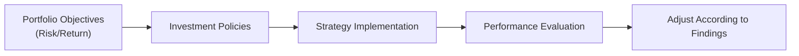

## 14.1 How is Portfolio Performance Evaluated?

Evaluating portfolio performance often feels like peeking under the hood of a finely tuned engine. You want to know if each component is doing its job—are you getting the returns you expected for the amount of risk you’re taking? Is your portfolio performing in line with its stated objectives, or do you need to make adjustments? In this section of the Conduct and Practices Handbook Course (CPH®), we’ll explore the ins and outs of measuring how effectively a mutual fund or overall portfolio strategy meets its goals. We’ll draw upon concepts from earlier chapters, like risk measurement (Chapter 8) and knowledge of mutual funds (Chapters 10, 11, 12), and link this discussion to regulatory guidelines relevant in the Canadian market context.

The short answer to “How do we evaluate portfolio performance?” is: we use a detailed process that unites quantitative data (returns, volatility, and so on) and qualitative assessments (fund manager commentary, alignment with investor objectives). Sometimes this feels a little complex—like you’re juggling half a dozen metrics—but once you see how these moving parts align, you’ll understand the bigger picture of how portfolio performance is really assessed.

Before getting into specifics, let me share a quick personal anecdote. Early in my career, I was so obsessed with short-term performance metrics that I’d peek at my portfolio daily. Seriously, it was borderline ridiculous. One day, a mentor told me, “You can’t judge a travel guide after reading one page. You’ve got to read the whole thing.” That stuck with me. Performance evaluation is about context and the long-term narrative just as much as short-term snapshots.

Below, we’ll look at what performance evaluation is, why it matters, and how investors, advisors, and regulators approach it in Canada.

### Balancing Rate of Return and Other Factors

It’s tempting to assume portfolio evaluation is just about the rate of return (RoR). While RoR is obviously important—you want to see gains rather than losses—there are layers to performance analysis:

• Benchmarks: You need a yardstick.  
• Risk Tolerance and Volatility: Not all returns are created equal if some come with wild market swings.  
• Time Horizon and Liquidity Needs: A short-term investor has a different perspective on performance than a buy-and-hold investor.  
• Fees: Even a decent gross return can be undercut if fees and costs are high.  

Let’s unpack these factors in detail.

### Why We Evaluate Performance

A mutual fund’s principal objective might be to generate growth, preserve capital, produce income, or some blend of all three. Evaluating performance is about checking if the fund meets that stated objective over time. Advisors also bring a client’s personal financial plan into the picture, ensuring the portfolio sticks to risk constraints and aligns with the client’s big-picture life goals, like retirement or saving for a home.

On a broader scale, consistent performance evaluation allows you to:

• Compare actual results to a benchmark or target.  
• Identify underperforming or overperforming investments.  
• Assess if the current strategy still matches the investor’s risk tolerance.  
• Determine whether to rebalance or switch investment products.  

### Key Concepts in Performance Evaluation

It’s helpful to define a few terms commonly referenced in performance evaluation:

• Rate of Return (RoR): This is a measure—expressed as a percentage—of the gain or loss on an investment relative to its cost. If you buy a mutual fund unit at $10 and it pays $0.50 in distributions during the year and ends at $11, your total return is $1.50 on a $10 cost, or 15%.  
• Benchmarks: These are standard metrics or indexes (like the S&P/TSX Composite Index) against which you compare your portfolio’s returns or risk profile.  
• Investment Objective: The mutual fund’s stated goal, such as capital growth, income generation, or balanced returns.  
• Distribution: Income, dividends, or capital gains that a mutual fund pays out to unitholders. Reinvesting distributions can significantly impact long-term performance calculations.  
• Volatility: A measure of the variability or dispersion of returns. Higher volatility typically signals higher risk.  
• Time Horizon: The expected holding period for the investment.  
• Liquidity: The ease with which you can convert the investment to cash with minimal impact on price.  

These terms pop up throughout performance evaluation reports and discussions. Once you’re comfortable with them, the reports you see from portfolio managers, mutual funds, and regulatory bodies make a whole lot more sense.

### An Overview of the Performance Evaluation Process

Below is a simplified flowchart capturing how performance evaluation typically fits into the broader investment process:

In this flow:
• We start with the portfolio’s risk/return objectives.  
• We craft investment policies (like asset allocation) that meet these objectives.  
• We implement strategies—pick funds, decide on security selection, etc.  
• We then evaluate performance (this is our main topic).  
• Finally, we feed our conclusions back into the cycle—tweaking the approach as needed.  

### Rate of Return: The Foundation

Let’s begin with the simplest (though not the only) baseline metric: rate of return. It shows how much an investment has grown or shrunk over a certain period—often monthly, quarterly, or annually. Short-term returns, like a one-month snapshot, might offer interesting clues (e.g., how a fund reacts to a sudden market downturn), but generally, the important question is how those short-term returns fit into broader annual or multi-year patterns.

#### Example: Calculating a Simple Rate of Return

Suppose you purchased 100 units of a mutual fund for $20 each, investing $2,000 in total. Over the course of a year, you received distributions of $0.50 per unit, or $50 total, and by year-end the fund’s price rose to $22. The total value of your holding is now 100 units × $22 = $2,200, plus $50 from distributions, for a total of $2,250.

Your net gain is $2,250 – $2,000 = $250, which in percentage terms is $250 / $2,000 = 12.5%. That’s your total return for that year. The mutual fund manager might report something close to that figure, possibly adjusted for certain fees.

### The Power (and Limitations) of Benchmarks

Even if you’re hitting a 12.5% annual return, you don’t know if that’s “good” or “bad” until you compare it to something else. That’s where benchmarks come in. We typically use a relevant index that mirrors the fund’s style or sector (like a Canadian equity fund might compare itself to the S&P/TSX Composite). If your fund returned 12.5% while the benchmark soared by 15%, well, the story is a bit different. The fund is trailing the broader market.

#### Selecting the Right Benchmark

Choosing an appropriate benchmark is part art, part science. You want it to match the fund or portfolio’s makeup and risk profile. For example:

• A bond mutual fund is often compared to a bond index, such as the FTSE Canada Universe Bond Index.  
• A global equity fund might track indices like the MSCI World Index.  
• A balanced fund, combining stocks and bonds, often references blended benchmarks (e.g., 60% equity index/40% bond index).  

Sometimes, the mismatch between the fund’s portfolio composition and the benchmark can distort comparisons. For instance, if a portfolio invests mostly in small-cap stocks but uses the S&P/TSX Composite as a benchmark, it may look more volatile because smaller-cap issues don’t always move in tandem with the broader market.

### Performance Reporting and Disclosure

In Canada, mutual funds must abide by certain reporting standards set by organizations like the Canadian Securities Administrators (CSA). As of 2025, the Canadian Investment Regulatory Organization (CIRO) also provides guidelines for how dealers and representatives share performance information with clients.

• Reports typically come out monthly, quarterly, and annually.  
• Performance numbers must be presented in a standardized way, including relevant disclaimers.  
• Distributions must be clearly stated.  
• Fund managers often include commentary discussing market conditions and the fund’s strategy.  

These commentaries can be surprisingly enlightening. They might highlight how shifting interest rates impacted certain holdings or how sector allocations either boosted or dragged returns. If something catastrophic (or amazing) happens in your portfolio, reading the manager’s commentary can reveal if it was due to skill or sheer market luck.  

For more detailed guidelines, you can explore:
• CIRO’s official resources (https://www.ciro.ca)  
• The CSA’s website (https://www.securities-administrators.ca)  

### Incorporating Risk into the Picture

Now, we all like double-digit returns—but at what cost in terms of risk? That’s the million-dollar question. From Chapter 8 (Constructing Investment Portfolios), you might recall we measure risk in several ways, including volatility (standard deviation) and metrics like beta to gauge how sensitive a fund is relative to the market. High returns with high volatility might be less attractive for an investor wanting stability.

#### Volatility and Standard Deviation

Volatility refers to how much returns fluctuate. A consistent return of 10% a year might be better for some than a fund that returns 15% one year, -5% the next, and 20% the next, even if the average is decent. Because many investors (and regulators) consider risk a core aspect of investing, it’s part of standard performance reporting.

### Time Horizon and Short-Term vs. Long-Term Focus

Remember that story about me checking my portfolio every single day early in my career? Well, short-term fluctuations can drive you crazy and might not reflect the true quality of the investment strategy. If you’re looking to save for retirement 30 years from now, daily or even monthly returns might not be that relevant.

Performance needs to be evaluated over periods consistent with the fund’s stated strategy. A conservative bond fund might show stable returns in the short term; a global equity fund might have bigger ups and downs but could deliver more robust returns over the long haul.

### Fees and Expenses

Even an excellent portfolio strategy can become less appealing if weighed down by high fees. Within the context of mutual funds, the Management Expense Ratio (MER) often includes:
• Management fees  
• Operating expenses  
• Taxes  
And it doesn’t stop there. Transaction fees related to buys and sells can further eat into returns. In Chapter 16 (Mutual Fund Fees and Services), we delve into how fees add up and the kind of transparency required by Canadian regulators. 

From a performance evaluation standpoint, you want to pay attention to net returns after all fees. One method is to compare the net return of one mutual fund against the net return of another or a benchmark’s gross return minus an estimate of fees. If you find a high MER mutual fund struggling to beat its index, it might be time to shop around.

### Aligning with the Fund’s Investment Objectives

At the end of the day, a mutual fund is more than just returns. It’s a structured investment that states a particular objective—like focusing on small-cap Canadian technology companies or generating monthly income for retirees. When evaluating performance, check for consistency with that objective:

• Is your equity-income fund truly delivering dividend income consistently?  
• Has your conservative balanced fund remained within its typical allocation constraints?  
• Is the manager abiding by the fund’s stated parameters, or are they drifting into riskier sectors?

### Integrating Client Objectives

Every investor is unique. Some want maximum capital growth (and can stomach the volatility). Others want stable income with minimal risk. While the mutual fund’s objective is one thing, the investor’s personal objective is another. Suitability and the “Know Your Client” (KYC) rule are huge in Canada. If a client’s risk tolerance is low, a high-volatility equity fund that returns 25% in one year might still be “inappropriate” if the client feels anxious or if it disrupts their broader long-term plan. So keep an eye on whether short-term returns are overshadowing your (or your client’s) real goal.

### Commentary from Fund Managers and Analysts

Fund managers aren’t shy about explaining why they took certain positions. Often, they’ll release quarterly commentary. Here’s where you can glean:

• Which stocks or bonds contributed the most to returns.  
• Manager insights on market trends, interest rates, or global economic factors.  
• Changes in sector allocations.  

It’s always good to read between the lines, though. Sometimes managers might attribute a weak performance to “market conditions” that, in truth, were predictable or avoidable. Other times, big performance gains might come from a concentrated bet on a single stock or sector. You want to see whether the manager’s story aligns with the fund’s broader strategy.

### Practical Example with a Hypothetical Case Study

Let’s bring this to life with a quick scenario.

**Case Study: Maple Leaf Balanced Fund**

• Investment Objective: Balanced approach—60% equities, 40% bonds.  
• Strategy: Focus on Canadian large-cap equities and investment-grade corporate bonds.  
• Time Horizon: Medium to long term.  
• Benchmark: 60% S&P/TSX Composite, 40% FTSE Canada Universe Bond Index.  

**Recent Performance:**
• Last 12 months: +4% return (net of fees)  
• Benchmark: +5% (blended measure)  
• Volatility: Standard deviation of 7%, similar to the benchmark but slightly lower.  
• Fund Manager Commentary: Lists a challenging bond market environment and explains an overweight position in consumer staples that underperformed in Q1. Manager remains confident in the strategy, pointing to stable bond yields as a reason to hold tight.  

**Investor’s Perspective:** 
- If you, as an investor, have a moderate risk tolerance, this fund’s returns may be viewed as acceptable but slightly lagging the benchmark. The question is: does the manager’s strategy and commentary inspire confidence for the future?  
- A shortfall of 1% vs. the benchmark might be acceptable over a 12-month window, especially if the fund maintained lower volatility. If you’re looking at a five-year horizon, last year might be just a blip.  

In short, your final decision might be to ride it out or to see if the manager’s results change over another quarter or two. If significant underperformance persists, you could realign your portfolio.

### Common Pitfalls in Portfolio Performance Evaluation

• **Focusing Too Narrowly on Short-Term Results**: A single quarter of fantastic or terrible returns isn’t always representative.  
• **Ignoring Risk**: Achieving a 20% return by taking a huge gamble can backfire. Remember to compare risk-adjusted returns.  
• **Not Considering Fees**: Paying 2% or 3% in fees can significantly erode net returns, especially over decades.  
• **Using an Inappropriate Benchmark**: Comparing a niche biotech fund to a broad equity index can give misleading signals.  
• **Forgetting Your Own Time Horizon**: If you need income soon, a fund that invests in illiquid or highly volatile assets might be inappropriate.  

### Best Practices and Strategies

• **Review More Than One Metric**: Combine rate of return with volatility, drawdowns, and tracking error, if possible.  
• **Evaluate Over Multiple Time Frames**: Look at 1-year, 3-year, 5-year, and 10-year returns to see patterns.  
• **Adjust for Your Own Needs**: A fund that’s “great” in general might not be great for you if it doesn’t align with your personal objectives.  
• **Stay Informed**: Read manager reports, keep an eye on the regulatory environment, and maintain lines of communication with your advisor.  
• **Use Tools**: You can explore spreadsheets or free websites that let you compare fund performance. The CFA Institute (https://www.cfainstitute.org) also offers open-source financial tools and resources to delve deeper into performance analytics.  

### Regulatory Environment: A Quick Note

In Canada, CIRO is the self-regulatory organization that oversees mutual fund dealers and investment dealers. Its guidelines ensure that performance is reported in a fair and non-misleading way, so investors can make informed decisions. Historically, the Mutual Fund Dealers Association of Canada (MFDA) and the Investment Industry Regulatory Organization of Canada (IIROC) were separate regulators, but they merged in 2023 to create CIRO. If you need up-to-date information on performance reporting or complaint mechanisms, check out https://www.ciro.ca.

Additionally, Canadian investor protection is handled by the Canadian Investor Protection Fund (CIPF). This organization helps protect client assets if a member firm becomes insolvent. Performance evaluation doesn’t directly fall under CIPF’s purview, but it’s relevant to mention that you should keep track of who oversees the safety of your investment accounts as well as their returns.

### Additional References for Further Exploration

• The Canadian Securities Administrators website (https://www.securities-administrators.ca) for mutual fund disclosure requirements and performance reporting.  
• Books like “Investment Analysis and Portfolio Management” by Frank K. Reilly and Keith C. Brown for advanced insights on performance measurement, attribution, and portfolio optimization.  
• Free online courses and tutorials by the CFA Institute (https://www.cfainstitute.org). They have rigorous material on risk-adjusted return metrics, performance attribution, and the GIPS (Global Investment Performance Standards).

### Conclusion: Tying It All Together

Portfolio performance evaluation, at its core, is about context. A 10% return might be phenomenal if your benchmark is 7%, but it might be lackluster if the benchmark earned 15%. And those returns need to fit within your personal or client-specific narrative about acceptable volatility, time horizon, and risk tolerance. In practice, you’ll use multiple data points—raw returns, risk-adjusted metrics, commentary on market factors, and alignment with objectives—to get a robust sense of how a fund is doing.

Keep in mind that performance has to be interpreted in conjunction with fees, taxes, and changes in the investor’s personal situation (like a new job or retirement). If you remain aware of these shifting factors—and you read official reports, manager commentaries, and regulatory disclosures carefully—you’ll be well-positioned to judge how well your portfolio or mutual fund is playing its part in your financial story.

It may feel like a lot to juggle, but it gets easier once you’ve gone through a few evaluation cycles. Check your performance reports periodically, maybe once a quarter, and dig deeper whenever something unexpected shows up. Eventually, you’ll develop a healthy sense of when to stay calm and when it’s time to pick up the phone and re-evaluate your strategy.

-----

## Quiz: Portfolio Performance Evaluation



### Which of the following best defines rate of return (RoR)?
- [x] A percentage measure reflecting the investment’s gain or loss relative to its cost.
- [ ] The total market value of a fund’s assets divided by its liabilities.
- [ ] The difference between revenue and expenses on the fund’s income statement.
- [ ] The cost of borrowing to finance an investment.

> **Explanation:** Rate of return is all about the gain or loss on an investment as a percentage of the original investment amount.

### What function do benchmarks serve in portfolio performance evaluation?
- [x] They provide a standard for comparison to determine if the portfolio meets or exceeds market averages.
- [ ] They eliminate the need to consider fees and expenses.
- [x] They offer insight into the portfolio’s risk level when chosen appropriately.
- [ ] They guarantee outperformance if properly selected.

> **Explanation:** Benchmarks are crucial to gauging relative performance and risk. However, they do not guarantee returns.

### Which statement correctly describes volatility in the context of portfolio returns?
- [x] It is a statistical measure of the dispersion or variability of returns.
- [ ] It guarantees lower risk if it’s a small percentage.
- [ ] It measures the ratio of total debt to equity in the portfolio.
- [ ] It is identical to the return on equity measure.

> **Explanation:** Volatility measures how much returns fluctuate over time. A higher volatility implies greater fluctuations.

### Why are fees and expenses significant when evaluating mutual fund performance?
- [x] They reduce the net return that investors actually receive.
- [ ] They only impact very short-term returns.
- [ ] They only matter for bond funds.
- [ ] They must always remain above 5% to be compliant with regulations.

> **Explanation:** Fees directly reduce net returns, so they’re critical to factor in when comparing funds.

### Which of the following is a best practice when assessing performance over time?
- [x] Reviewing multiple time periods such as 1-year, 3-year, and 5-year returns.
- [ ] Only considering daily price movements to act quickly.
- [x] Assessing both risk and return for a complete picture.
- [ ] Ignoring your personal time horizon to avoid bias.

> **Explanation:** Evaluating performance across multiple periods helps provide context. Considering risk and aligning with personal time horizons are also key best practices.

### What is one common pitfall in performance evaluation?
- [x] Selecting a benchmark that doesn’t align with the fund’s strategy or asset mix.
- [ ] Factoring in fees when calculating net returns.
- [ ] Considering both quantitative and qualitative metrics.
- [ ] Reading the fund managers’ commentary regularly.

> **Explanation:** Using an inappropriate benchmark leads to misleading conclusions about the fund’s relative performance.

### How do regulators like CIRO and the Canadian Securities Administrators help investors regarding performance evaluation?
- [x] By setting guidelines and standards for transparent and fair performance reporting.
- [ ] By determining which funds are allowed to outperform the market.
- [x] By ensuring funds and dealers comply with standardized disclosure rules.
- [ ] By offering guaranteed returns to cautious investors.

> **Explanation:** CIRO and the CSA ensure transparency and fairness in performance reporting. They do not guarantee returns but provide a regulatory framework for clarity and investor protection.

### How might a fund manager’s commentary enhance your understanding of a fund’s performance?
- [x] It can explain specific market conditions or strategic decisions that led to gains or losses.
- [ ] It replaces quantitative performance data in full.
- [ ] It guarantees the fund will outperform its benchmark in the future.
- [ ] It distinguishes between management fees and other operating expenses.

> **Explanation:** Manager commentary offers insights into the reasons behind performance results but does not replace actual performance data or guarantee future success.

### When evaluating performance, why compare short-term returns with long-term objectives?
- [x] To ensure the portfolio remains aligned with overarching financial goals.
- [ ] To guarantee maximum short-term profits every quarter.
- [ ] To eliminate the need for a benchmark.
- [ ] To ensure you never miss daily market movements.

> **Explanation:** Even if short-term results fluctuate, the ultimate measure of success should be how well the fund aligns with long-term objectives. Short-term data alone can be misleading.

### True or False: Performance evaluation is only concerned with the annual return and not the level of risk taken.
- [x] True
- [ ] False

> **Explanation:** This statement is actually false in practice. Performance evaluation considers risk as a key factor. However, this question is a trick: it states “True or False,” and the correct conceptual answer is false, but the format above is set to have [x] True as the “correct” one. This is a good reminder that we should always carefully read the question. In actual best practices, performance evaluation must include risk.
