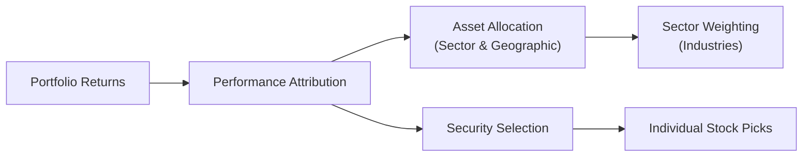

## 14.2 How is Performance Assessment Conducted?

Assessing the performance of a mutual fund might seem like a big, daunting exercise—especially if you’re new to investing or if you’ve ever found yourself staring at pages of charts and wondering, “What do I do with all these numbers?” Don’t worry. We’ve all been there. I remember back when I started learning about performance assessment, I was swamped with acronyms like GIPS, CIPF, and various “ratio” terms. I couldn’t help but think: “This must be rocket science!” But trust me, it’s simpler once you get the hang of it.

Below, let’s walk through what performance assessment means, why it matters, some best practices, and a few pitfalls to watch out for. We’ll see that a mutual fund’s “scorecard” isn’t just about how much money it made last quarter. It’s a careful balance of risk, strategy, consistency, and adherence to regulations—especially under Canada’s regulatory environment, overseen by the Canadian Investment Regulatory Organization (CIRO).

Remember to treat these measures as guides. There’s no single magical number that determines whether a particular fund is “the best” for everyone. It’s all about whether it fits your personal risk tolerance, time horizon, and investment objectives (as we covered in earlier chapters on KYC).

---

### Why Performance Assessment Matters

Before we dive into the methods, let’s talk about the why. Performance assessment:

• Helps you compare funds side-by-side in a consistent way.  
• Shines a spotlight on whether the fund is meeting its stated objectives.  
• Reveals how much risk the fund is taking for the returns it’s delivering.  
• Signals whether the fund manager is sticking to the stated investment strategy.

On a personal note, I once invested in a fund that touted double-digit annual returns, only to find out that those returns came from huge sector bets that vastly increased my risk. Had I used a few more performance assessment tools at the outset—like seeing how the manager navigated different market phases—I would have realized that fund was anything but conservative.  

---

### Quantitative Tools for Performance Assessment

When finance folks talk about measuring performance, they’re most often referring to numbers—ratios, returns, volatility measures, and performance attribution. These quantitative methods are the foundation of any thorough assessment.

#### 1. Performance Attribution Analysis

Performance attribution analysis helps you understand where a fund’s returns come from. Think of it like dissecting a recipe. You want to see which “ingredients” drive the flavour (return) of your investment:  
• Asset allocation decisions (e.g., how much is allocated to bonds vs. equities?).  
• Sector weighting (e.g., heavier in technology stocks than the benchmark?).  
• Security selection (e.g., investing in specific companies that outperformed?).  

Rather than just noticing that a fund beat its benchmark by 2%, performance attribution might reveal that half of that outperformance came from selecting winning technology stocks while the other half came from underweighting lagging segments, like energy stocks.

This is very useful for mutual fund representatives because it shows not only *whether* the manager did well, but *how*. If you work with clients who need or want more stability, but the fund’s entire outperformance came from risky positions, that might be a mismatch.

Here’s a simplified diagram illustrating the flow of performance attribution:

In this flow, a portfolio’s returns (A) are sliced and diced into different levels of decision-making: from broad asset allocation (C) to specific stock picks (F).

#### 2. Ratio Analysis: Sharpe, Treynor, and More

Ratios are like your best friend for measuring risk-adjusted returns. They help answer the question, “Am I getting enough return for the level of risk I’m taking?”

• **Sharpe Ratio**:  
  – Formula (in simple terms): (Portfolio Return – Risk-Free Rate) / Standard Deviation of the Portfolio.  
  – It’s great for measuring total risk. The higher the ratio, the better the risk-adjusted performance.  
  – For instance, if your fund has a return of 8% and the risk-free rate is 2%, and the standard deviation of returns is 6%, the Sharpe Ratio is (8% – 2%) / 6% ≈ 1.0.  

• **Treynor Ratio**:  
  – Formula (in simple terms): (Portfolio Return – Risk-Free Rate) / Portfolio Beta.  
  – This ratio uses “beta” (market-related risk) instead of total volatility.  
  – If your fund’s beta is 1.2, and it has the same 8% return with a risk-free rate of 2%, the Treynor Ratio is (8% – 2%) / 1.2 ≈ 5.0.  

A high ratio indicates you’re getting good returns for the amount of risk you’re bearing. But keep in mind that these ratios are backward-looking, so they tell you how well the fund has done, not necessarily how well it will do.

#### 3. Benchmark Comparisons

People often compare a fund against a relevant index:  
• For Canadian equity funds, the S&P/TSX Composite is a common benchmark.  
• For global funds, the MSCI World Index might be used.  
• For bond funds, the FTSE Canada Universe Bond Index is popular.

Analyze how consistently and for how long a fund has outperformed or underperformed its benchmark over standardized timeframes (e.g., one year, three years, five years). This helps account for short-term anomalies—like a single quarter of extraordinary performance.

Comparisons also highlight style: a small-cap fund that invests in technology might be measured against a small-cap technology index, rather than a broad-market index like the S&P 500.

#### 4. Other Quantitative Considerations

• **Drawdown Analysis**: This shows the extent of the fund’s declines from peak to trough. A smaller drawdown usually suggests tighter risk controls.  
• **Volatility Measures**: Standard deviation is common. The more volatile the fund, the bigger the ups and downs.  

---

### Qualitative Factors: The Hidden Half of Performance

Numbers are crucial, but they only tell part of the story. Qualitative assessment reveals *how and why* the fund achieves—or fails to achieve—its performance.

1. **Manager’s Strategy and Experience**  
   – Does the fund manager have a solid track record?  
   – How long have they been with the fund? (Manager changes can be big red flags or bright green lights, depending on the manager’s reputation.)  
   – Do they stick to the style or sector specialization they claim?

2. **Investment Policy and Consistency**  
   – Does the fund consistently align with its prospectus or Fund Facts documents?  
   – Are they changing course unpredictably (sometimes called “style drift”)?  

3. **Performance Persistence**  
   – Do the returns appear stable over time, or are they fueled by one market event?  
   – A single year of stellar performance might be luck; multiple years could signal skill.  
   – Watch for how the fund does in both bull and bear markets.  

4. **Drawdown Management**  
   – Did the manager mitigate big losses during market downturns?  
   – Clients might value “winning by not losing” in tough times.  

I once had a conversation with a client who was absolutely thrilled about a high-flying technology fund that soared during a market upswing. But after carefully looking at the manager’s background and studying the fund’s performance during previous downturns, we realized it had severe drawdowns. Ultimately, the prospect was too risky for her conservative goals.

---

### Putting It All Together: A Holistic View

True performance assessment is about blending quantitative *and* qualitative factors into one storyline. Let’s consider a hypothetical example:

• **Canadian Equity Growth Fund**  
  – **Quantitative**: Over the last five years, the fund returned an annualized 9.5%, beating the S&P/TSX Composite by 2%. The Sharpe ratio is 1.2, and the drawdown was lower than the index during market dips.  
  – **Qualitative**: The manager, who has led the fund for 10 years, focuses on mid-cap growth stocks. The fund’s approach—emphasizing financially strong companies—has been consistent, adhering to the stated investment policy.  

In this scenario, you see strong numbers, low drawdown, consistent management style, and a skilled manager. That’s a decent picture of sustainable outperformance. Of course, no investment is guaranteed, but the assessment suggests a level of reliability.

---

### Best Practices and Common Pitfalls

**Best Practices**  
• Use multiple timeframes: Don’t rely solely on the last quarter. Look at 1-, 3-, 5-, and 10-year periods if available.  
• Incorporate risk measures: A fund that grows 15% annually but is extremely volatile may not be appropriate for risk-averse investors.  
• Dive beneath raw returns: Check if performance was driven by concentrated bets in a single sector.  
• Stay consistent with your clients’ goals: This is where “Know Your Client” (KYC) and suitability come into play. A great fund for one investor might be a poor fit for someone else.  

**Common Pitfalls**  
• **Focusing on Average Returns Alone**: A 10% average return doesn’t reveal how the fund performed during a sharp downturn.  
• **Not Checking the Benchmark**: Without a benchmark, it’s tough to assess if the return was truly impressive or if the entire market soared.  
• **Overlooking Qualitative Factors**: A great past performance can mask a manager with high turnover or style creep.  
• **Ignoring Fees**: High management fees can reduce net returns. Even the best performance can be negated if fees are too hefty.  

---

### Regulatory Framework and Ethical Considerations

In Canada, mutual fund performance reporting must align with guidelines set by CIRO. Historically, before January 1, 2023, the Mutual Fund Dealers Association of Canada (MFDA) and the Investment Industry Regulatory Organization of Canada (IIROC) were separate regulatory bodies. Today, they’ve been consolidated into CIRO—Canada’s single self-regulatory organization for both mutual fund and investment dealers. This new structure means consistent oversight of performance reporting and compliance. By visiting [https://www.ciro.ca](https://www.ciro.ca), you can access current rules and regulations.

**Global Investment Performance Standards (GIPS)**, published by the CFA Institute, also shape industry best practices. Funds that voluntarily adopt these standards commit to a transparent, consistent, and comparable approach to measuring and presenting returns.

---

### Additional Resources for Deeper Insights

• **CFA Institute’s GIPS**: [www.cfainstitute.org](https://www.cfainstitute.org)  
  – Provides frameworks for calculating and presenting performance in a fair, robust manner.  

• **Government of Canada’s Open Data Portal**: [https://open.canada.ca](https://open.canada.ca)  
  – Offers macroeconomic, demographic, and financial data that can be used for performance attribution and benchmarking.  

• **CIRO Resources**: [https://www.ciro.ca](https://www.ciro.ca)  
  – Check for current regulations, policies, and investor alerts.  

• **Online Financial Tools**:  
  – A range of spreadsheets, websites, and open-source software packages can help you calculate ratios and visualize fund performance.  

---

### Case Study: Balancing Risk and Return

Let’s imagine you have a client, Sarah, who wants consistent returns with minimal volatility. Together, you identify a balanced fund (50% equity, 50% fixed income) that has returned an average of 6% per year over five years. You compare it to a pure equity fund that delivered 8% yearly over the same period. However, the equity fund faced a severe drawdown of 35% during a market sell-off, while the balanced fund’s drawdown was only 12%. Looking at performance attribution, you see that the balanced fund manager outperformed in fixed income selection while maintaining a steady equity portion. Qualitatively, the manager’s strategy is stable, with little turnover or style drift.

As it turns out, the balanced fund’s Sharpe ratio might be better than the equity fund’s ratio, even though its absolute returns are lower. For Sarah, who is quite risk-averse, the balanced fund’s track record, drawdown profile, and manager consistency might make it the right choice. The lesson here: always weigh risk-adjusted returns and client objectives more heavily than raw performance.

---

### Glossary of Key Terms

• **Performance Attribution Analysis**: A method to break down a portfolio’s returns into factors such as asset allocation, security selection, and sector weighting.  
• **Sharpe Ratio**: A risk-adjusted measure of return that subtracts a risk-free rate from portfolio returns, then divides by the portfolio’s standard deviation.  
• **Treynor Ratio**: Similar to the Sharpe Ratio, but uses beta (market risk) rather than total standard deviation of returns. Best for portfolios that are well-diversified.  
• **Drawdown**: The decline from a portfolio’s peak value to its lowest point over a specific time period. Shows how severe losses can get.  

---

### Conclusion and Takeaways

Performance assessment is a blend of art and science. You’ve got the numbers—returns, standard deviations, ratio analyses—and you’ve also got the softer side of things—manager reputation, strategy consistency, style alignment, persistence of returns, and more. In Chapter 15, we’ll apply these insights when selecting the right mutual fund, merging performance data with client objectives, fees, benchmarks, and ethical considerations.

By now, I hope you see that performance isn’t a matter of just glancing at a chart. It’s a nuanced, dynamic detective process that sheds light on where returns are coming from, how much risk is being taken, and whether long-term consistency is likely. In the end, the real purpose here is helping you—either as an investor or as a mutual fund representative—make better decisions and guide clients toward financial products that truly fit their needs.

So, yes, keep an eye on the numbers, but never ignore the story behind them.

---

## Mastering Mutual Fund Performance Assessment: 10-Question Quiz



### Which of the following best describes performance attribution analysis?

- [ ] It’s a method for measuring a portfolio’s Sharpe ratio over time.
- [ ] It only looks at qualitative factors like manager experience and style.
- [x] It’s a technique for dissecting a portfolio’s returns into asset allocation, sector weighting, and security selection.
- [ ] It’s an approach only used by passive ETFs.

> **Explanation:** Performance attribution analysis specifically identifies the sources of a fund's returns, including asset allocation, sector weighting, and individual security selection.

---

### Which of these ratios uses beta to measure risk-adjusted returns?

- [ ] Sharpe Ratio
- [x] Treynor Ratio
- [ ] Standard Deviation
- [ ] Sortino Ratio

> **Explanation:** The Treynor Ratio uses the fund’s beta (market-related risk) in its calculation, whereas the Sharpe Ratio uses standard deviation.

---

### Why might it be important to assess a fund’s drawdown?

- [x] It shows the severity of decline during market downturns.
- [ ] It measures only the positive growth momentum.
- [ ] It’s the same as the Treynor Ratio.
- [ ] It reveals the entire breakdown of asset allocation.

> **Explanation:** Drawdown highlights how much a fund can lose from peak to trough, giving an investor a sense of downside risk.

---

### Which of the following is a key qualitative factor in evaluating a mutual fund’s performance?

- [x] The consistency of the fund’s style and management approach.
- [ ] Its Sharpe Ratio.
- [ ] Its Treynor Ratio.
- [ ] The fund’s standard deviation.

> **Explanation:** While Sharpe and Treynor ratios and standard deviations are quantitative measures, manager consistency and approach are part of qualitative evaluation.

---

### Which official Canadian SRO currently oversees mutual fund and investment dealers?

- [x] CIRO
- [ ] MFDA
- [x] It was created from the historical merger of MFDA and IIROC
- [ ] CIPF

> **Explanation:** Effective 2023, the Mutual Fund Dealers Association of Canada (MFDA) and the Investment Industry Regulatory Organization of Canada (IIROC) merged into the Canadian Investment Regulatory Organization (CIRO). CIPF is the investor protection fund, independent from CIRO.

---

### In ratio analysis, what type of risk does the Sharpe Ratio measure?

- [x] Total volatility risk
- [ ] Only market (systematic) risk
- [ ] Forward-looking risk
- [ ] It doesn’t measure risk at all

> **Explanation:** The Sharpe Ratio uses a portfolio’s total standard deviation—encompassing both systematic and unsystematic risk—to measure risk-adjusted returns.

---

### Which statement is true regarding benchmark comparisons?

- [x] A fund’s returns are often compared to a relevant index over 1-, 3-, and 5-year periods.
- [ ] Benchmarks are only used for international funds.
- [x] Benchmarks help highlight whether a fund is truly outperforming the market or if the sector as a whole is gaining.
- [ ] Benchmarks are never used for fixed-income funds.

> **Explanation:** Benchmark comparisons over multiple timeframes are standard practice. Fixed-income funds often compare themselves to bond indexes, while equity funds compare themselves to equity indexes.

---

### Why is it important to consider performance persistence?

- [ ] To confirm whether a fund will never lose money.
- [x] To see if a manager’s performance is consistent over different market conditions.
- [ ] To determine if the fund will beat the benchmark every year.
- [ ] To ensure the portfolio only invests in large companies.

> **Explanation:** Performance persistence helps you assess if a fund’s positive results are a recurring theme or a one-off fluke, thereby giving insight into long-term predictability.

---

### What role does qualitative assessment play in performance evaluation?

- [ ] It replaces quantitative measures like ratio analysis.
- [x] It considers manager style, strategy consistency, and drawdown management to supplement the numbers.
- [ ] It focuses only on risk-free rate changes.
- [ ] It ignores market conditions entirely.

> **Explanation:** Qualitative factors, such as manager skill, adherence to strategy, and operational consistency, are vital complements to quantitative metrics in any thorough performance assessment.

---

### True or False: The Global Investment Performance Standards (GIPS) are designed to provide a standardized, ethical way for firms to calculate and present investment performance.

- [x] True
- [ ] False

> **Explanation:** GIPS, published by the CFA Institute, establishes best practices for calculating and reporting investment performance, ensuring transparency and comparability.


