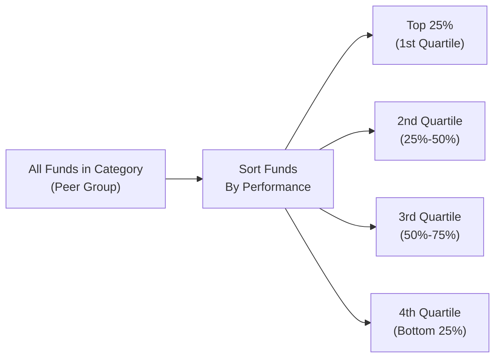

## 14.4 How is Quartile Ranking Used?

Sometimes when I’m chatting with neighbors about mutual funds—usually over a mug of coffee—they’ll bring up the concept of “quartile ranking” and ask how it helps them quickly decide if a fund is any good. To be honest, I used to find it a bit, well, tricky, especially if you aren’t a financial professional swimming in these waters every day. But once you grasp the basics, quartile rankings can be super helpful in demystifying a pile of performance data.

In a nutshell, quartile rankings segment funds in a particular category (or peer group) based on performance metrics. Picture the entire category of, say, Canadian Equity Funds. If we line them up from the highest performer to the lowest, quartile ranking divides that lineup into four neat segments:  
• 1st Quartile: Top 25% of performers  
• 2nd Quartile: Next 25%  
• 3rd Quartile: Following 25%  
• 4th Quartile: Bottom 25%  

As you might guess, 1st quartile is where you’d typically hope to find your fund. Seeing a fund in the 1st quartile can give you a little jolt of excitement—“Yes, it’s doing better than 75% of its peers!” But as we’ll see, there’s more to the story than these neat little slices.

Below, we’ll unravel how quartile rankings are calculated, why they’re popular among investors, what they reveal (and what they might hide), plus how to use them effectively when you’re choosing or evaluating a mutual fund. Along the way, I’ll share a personal story or two and show you a few diagrams to bring it all home.

---

### A Quick Refresher on Performance Categories

Before we talk specifically about quartile rankings, it’s helpful to recall that funds are divided into peer groups based on factors like:  
• Investment objective (e.g., Canadian Equity, Global Equity, Fixed Income, etc.)  
• Strategy (e.g., growth vs. value)  
• Risk profile (e.g., low volatility vs. high volatility)  

Regulators such as the Canadian Securities Administrators (CSA) require mutual funds to provide standardized categorizations. Industry entities—like the Investment Funds Institute of Canada (IFIC)—also publish guidelines to align fund categories. Even though your fund might proudly say “Canadian Equity,” it must go into the right bucket so it can be fairly compared to others using a similar approach.

It’s only within these clearly defined “buckets” that we conduct a quartile ranking. Comparing a Canadian Equity mutual fund to a Specialized Technology mutual fund might be apples-to-oranges, so well-defined categories help ensure the ranking is meaningful.

---

### How Quartile Ranking Works

Quartile ranking is basically a statistical slicing of the performance distribution. Let’s break it down:

• Step 1 – Identify the Peer Group. We gather a set of funds that share the same category.  
• Step 2 – Sort by Performance. Typically, analysts look at total returns (sometimes for 1-year, 3-year, 5-year horizons, etc.) and put them in descending order, from best to worst.  
• Step 3 – Cut the List into Four. The top 25% are in the 1st quartile, the next 25% in the 2nd quartile, and so on.

You’ll often see quartile rankings displayed in a small table or a line of text stating something like: “1–Year Quartile Rank: 2” or “3–Year Quartile Rank: 1”. That means the fund is, respectively, in the 2nd quartile for 1-year returns and 1st quartile for 3-year returns, within its category.

Below is a simple Mermaid diagram illustrating how funds are sorted and segmented into quartiles:

And that’s the gist—four layers, neat and tidy.

---

### Why This Ranking Is Popular

Many folks, from professional advisors to casual investors, love quartile rankings because:

• They’re easy to interpret. Who doesn’t like a simple 1st, 2nd, 3rd, or 4th label?  
• They provide an at-a-glance snapshot. If your mind starts to spin when you see a 10-page performance report, a quick look at quartile ranking can help you zero in on how your fund stacks up.  
• They’re widely available. Many official “Fund Fact” documents, mandated and standardized by CSA regulations, now include quartile rank data for multiple time periods. So you don’t have to scour obscure websites to find the info.

Picture this: you come across a Canadian Bond Fund whose 3-year quartile ranking is 1 (top 25%). Immediately, you know it’s been outperforming or at least near the top compared to the other Canadian Bond Funds in that same time frame.

---

### Real-World Anecdote: My Aunt’s “Top-Quartile” Surprise

Let me share a little story. A few years ago, my aunt was all excited because her Balanced Fund was in the 1st quartile for the last year. She bragged at a family gathering—yes, we talk about investing at Sunday dinners—that her fund was beating 75% of its peers. The next year, she saw that the fund had dropped into the 4th quartile for a trailing one-year period. She was, well, not thrilled.

This scenario highlights something crucial: quartile rankings are snapshots. The top performers in one period are not guaranteed to remain at the top in the next period. It’s more of a revolving door than a stable VIP list. Overreliance on these point-in-time measurements can lead to a false sense of security, which is why we say there’s no guarantee of performance persistence.

---

### Advantages of Quartile Ranking

Despite the cautionary tale, quartile ranking has plenty of advantages:

Easy to Digest  
• The biggest strength is simplicity. Investors with minimal time (or minimal patience) for complex data can glimpse quartile rankings and quickly see how their fund is doing.

Common Language Among Advisors  
• Advisors often point to quartile rankings when summarizing a fund’s “standing in its class.” It’s a convenient reference when discussing performance with clients.

Broad Peer Group Comparison  
• By placing a fund in context with all its peers, quartile ranking gives a sense of relative performance—whether it’s truly at the front of the pack or just around the middle.

Visual Add-Ons  
• Many rating sites and financial portals illustrate quartile ranks with color-coded charts. It can be comforting or alarming at a glance, but at least you know where your fund stands.

---

### Limitations and Pitfalls

Of course, no single ranking method is perfect. Quartile rankings can be misleading if viewed in isolation or if you overlook the following:

Performance Persistence  
• Funds in the 1st quartile today might drift into the 3rd or 4th quartile tomorrow. Past outperformance doesn’t automatically stick around.

Differences in Fund Strategy  
• Two funds in the same category might still employ vastly different strategies—think of one focusing on small-cap growth stocks and another focusing on large-cap blue chips. They might be ranked together, but is it really apples to apples?

Point-in-Time Measurement  
• Because quartile rankings are typically calculated with historical returns, market volatility can drastically change the picture from one quarter (or year) to the next.

Exclusion of Risk Adjustments  
• A top-quartile return might come with significantly higher risk. Quartile ranking often does not factor in risk measures like standard deviation or volatility, so be sure to consider risk-adjusted performance metrics as well.

Survivorship Bias  
• Funds that perform poorly may shut down or merge into other funds, potentially skewing the data in some older performance records.

Despite these challenges, quartile ranking remains a handy starting point. Think of it as a quick snapshot that says, “Here’s how I stack up to everyone else right now.”

---

### Using Quartile Rankings in Practice

So how do we use quartile rankings effectively? Let’s walk through a common scenario:

1. Identify Your Category:  
   Suppose you’re looking at Canadian Equity Funds. Make sure everything you’re comparing is in that same category per CSA guidelines.

2. Look Across Multiple Time Frames:  
   Check classification for short-term (1-year), mid-term (3-year), and long-term (5 or 10-year) performance. Sometimes a fund that’s strong over 5 years might have had a rough year.

3. Consider Risk Measures:  
   Are you comfortable with a fund’s volatility or concentration? Even if it’s in the 1st quartile for returns, take a look at risk metrics like standard deviation, beta, or Sharpe ratio, if accessible.

4. Check Fund Facts and Prospectuses:  
   The mandated Fund Facts (per CSA rules) will typically highlight past performance, fees, and sometimes a quartile rank or category average. This helps anchor your analysis so you don’t rely on marketing materials alone.

5. Evaluate the Fund Manager’s Style & Strategy:  
   A manager focusing heavily on a particular sector, for instance, could ride that wave to top-quartile performance in bull markets, but might sink in leaner times. Understanding the philosophy behind the numbers is crucial.

6. Revisit Performance Persistence:  
   If you’re noticing that a fund hops from top 25% to bottom 25%, try investigating what drives that volatility. Is it a strategic shift by the fund manager or a normal reflection of its style?

---

### Small Case Study: Growth Fund ABC

Here’s a short hypothetical to bring these concepts to life:

• Growth Fund ABC invests primarily in mid-cap Canadian growth stocks.  
• Over the last 12 months, it soared in performance thanks to a healthy bull trend in mid-cap growth stocks. In the Canadian Equity – Growth category, it landed in the 1st quartile.  
• However, its 3-year quartile rank is 3, and its 5-year quartile rank is 4.  
• By digging deeper, you find that in previous periods of volatility, it struggled and lagged behind broader market returns.

Would you invest in Fund ABC? It might have short-term success, but you also can’t ignore the longer-term inconsistency. Quartile ranking is telling you: “Yes, it’s in the top 25% right now,” but also, “Historically, it’s not consistently at the top.”  

A best practice is to check how Fund ABC performed during tough market conditions. You might also weigh fees, the fund manager’s track record, and the relative risk. Maybe you decide to incorporate it into a diversified portfolio—but only if you can stomach some bumps and bruises.

---

### A Note on Canadian Regulatory Environment

When it comes to mutual funds and their performance data, you’ll see references to agencies like the Canadian Securities Administrators (CSA). These regulators mandate comprehensive disclosure, including performance data, in Fund Facts and simplified prospectuses. You might also encounter the Canadian Investment Regulatory Organization (CIRO)—the national self-regulatory body overseeing investment dealers and mutual fund dealers. Historically, there were two separate self-regulatory organizations, the Mutual Fund Dealers Association of Canada (MFDA) and the Investment Industry Regulatory Organization of Canada (IIROC), but these were amalgamated into CIRO on January 1, 2023.

From a practical standpoint, CIRO-registered dealers must ensure that the funds they recommend, whether top-quartile or otherwise, are suitable for each client’s risk profile and objectives. If you have any confusion about the mutual fund selection process or how quartile rankings fit into your overall strategy, your CIRO-registered advisor can offer guidance. For official information about the SRO framework, you can visit the CIRO website at:  
• https://www.ciro.ca

---

### A Word on Investor Protection

Just a quick aside: Since January 1, 2023, the Canadian Investor Protection Fund (CIPF) became the sole investor protection fund in Canada after merging with the MFDA IPC. CIPF guards your account in the event your member firm (under CIRO oversight) becomes insolvent. While this doesn’t affect quartile ranking information directly, it’s useful peace of mind when venturing into the world of mutual funds.

---

### Incorporating Quartile Ranking into a Broader Evaluation Process

Quartile ranking is just one piece of the puzzle. Here’s a simple mental checklist for anyone looking at a fund’s track record:

• Look at the quartile rank. Great, you see where it stands among peers.  
• Compare total returns over several time horizons. Patterns might emerge—consistent or erratic?  
• Assess the risk/return trade-off. A top-quartile fund might have taken huge swings to get there.  
• Read the manager commentary. Are they explaining consistent strategies or responding to short-term market chatter?  
• Review fees, management expense ratio (MER), and trading costs. Even a top performer can see investor returns eroded by high fees.  
• Stay aware of external factors—market cycles, interest rates, inflation, currency fluctuations, etc.  

This well-rounded approach ensures you don’t fall into the trap of picking a “1st quartile” fund only to discover that label might be fleeting or doesn’t reflect your risk tolerance.

---

### Additional Observations on Performance Persistence

Performance persistence is a hotly debated topic in academic finance. Some studies suggest that certain top funds continue outperformance, possibly due to skilled management, while others argue that it’s largely chance or random market factors. Observing quartile rank transitions over sessions—like reviewing how many 1st-quartile funds remain in the 1st quartile over consecutive periods—can give you insight into how “sticky” the success is. However, consistent outperformance is notoriously difficult in competitive markets.

---

### Best Practices and Common Pitfalls

Below are a few straightforward tips for navigating quartile rankings:

• Don’t Chase Yesterday’s Winners. Jumping from one top-ranked fund to another might rack up trading costs and leave you exposed to short-term market changes.  
• Beware of Narrow Peer Categories. If the category is too narrow, a top-quartile rank might just mean it did better than 10 funds in a small niche.  
• Watch Out for Mergers and Closures. Some funds with poor performance get merged into better-performing counterparts, which can affect the historical quartile data.  
• Maintain a Long-Term Perspective. Regularly check 3-year and 5-year quartile ranks instead of focusing solely on the latest 1-year figure.  

---

### Practical Example: Using Quartile Ranking in a Portfolio Review

Imagine you have a balanced portfolio that includes a Canadian Equity Fund, a Global Equity Fund, and a Canadian Fixed Income Fund. Every quarter, you sit down with your CIRO-registered advisor to review how each fund is doing:

1. You see your Global Equity Fund is in the 2nd quartile for the 1-year period, down from the 1st quartile last quarter.  
2. You notice the Canadian Equity Fund is 3rd quartile for 1-year but 2nd quartile for 3-year performance.  
3. Your Canadian Fixed Income Fund is in the 1st quartile for 1-year returns, but it has a slightly higher MER than other fixed-income funds.

You might decide to keep a close watch on that Canadian Equity Fund over the coming months: is the 3rd quartile position for the 1-year results a sign of changing management style, or is it just the market environment? Of course, you and your advisor will also consider fees, risk levels, and how each fund fits your long-term goals.

---

### Incorporating Tools and Resources

Besides scanning Fund Facts or talking to your advisor, you can explore open-source tools like R or Python libraries for data analytics if you’re a numbers geek. Some third-party websites also publish updated quartile ranks. Just make sure you’re accessing reputable, up-to-date information (for instance, courtesy of major fund data providers or from the fund company itself). If you ever question the data’s accuracy, cross-check with official documents on the fund’s website or filings on CSA’s portal.

For additional reading on performance patterns and quartile transitions, consider exploring research published by the Investment Funds Institute of Canada (IFIC) or any in-depth CSA bulletins relating to fund performance disclosures. Publications by academic finance journals often discuss performance persistence, though their language can get a bit thick with statistics.

---

### Conclusion

Quartile ranking is one of those tools that can initially seem a bit fancy, but it’s actually quite simple in concept. We line up funds, slice them into four groups, and voilà—we know who’s on top and who’s lagging. It’s a favorite reference for advisors and investors who need a quick gauge of relative performance, and it’s widely used across the Canadian market (and beyond) to evaluate mutual funds in the same category.

That said, analyzing a quartile rank should hardly be the end of your investment journey. It doesn’t reveal the “why” behind the numbers, nor does it guarantee the fund will remain a top performer. By blending quartile rank data with an understanding of risk, fees, management style, and your own investing objectives, you can make far more informed decisions. In other words, quartile ranking is a handy snapshot—but an entire photo album is better for thorough understanding.

If you take one key lesson from all this, let it be: “Context is king.” A 1st-quartile label is exciting, but always check the bigger picture. And if you need more official guidance, consult with a CIRO-registered advisor or explore the substantial resources hosted by the CSA, CIRO, and CIPF. With a bit of due diligence, quartile rankings can serve as a quick reference point on your journey to building a resilient, goal-aligned portfolio.

---

## Test Your Knowledge: Quartile Ranking and Mutual Fund Performance



### Which of the following best describes quartile ranking for mutual funds?

- [x] It's a method of dividing funds in a category into four groups based on performance.
- [ ] It's a guaranteed predictor of future performance for top funds.
- [ ] It's a required risk rating for all funds in Canada.
- [ ] It's only relevant for equity funds.

> **Explanation:** Quartile ranking groups funds in a peer category into four segments from top 25% to bottom 25%, based on performance measurements. It does not guarantee future performance, nor is it strictly a risk measure.

### Which statement is TRUE about top-quartile funds?

- [x] They are simply funds in the top 25% of performers during the relevant measurement period.
- [ ] They have the highest management fees.
- [ ] They will remain top performers in future periods.
- [ ] They are always categorized by reference to the fund manager’s style.

> **Explanation:** A “top-quartile” fund is one placed in the top 25% of its category for a given time period. There is no guarantee it remains there and the ranking doesn’t necessarily reflect fees or manager style.

### Why should investors look at multiple time frames (1-year, 3-year, 5-year) when considering a fund’s quartile ranking?

- [x] To spot consistency or changes in performance over different periods.
- [ ] To avoid paying higher management fees.
- [ ] To ensure the fund is only compared to global funds.
- [ ] To eliminate the impact of daily fluctuations entirely.

> **Explanation:** Different time frames can reveal whether the fund has consistent, long-term superior performance or is only momentarily in the top quartile.  

### Which factor is NOT typically reflected in quartile ranking?

- [x] The level of risk taken by the fund to achieve its returns.
- [ ] How quickly the fund manager can react to market changes.
- [ ] The percentage of funds beaten by the top-quartile performers.
- [ ] The simple sorting of funds in a peer group by total returns.

> **Explanation:** Quartile ranking is based mostly on performance data and does not adjust for risk or volatility. 

### Which statement about performance persistence is accurate?

- [x] Past top-quartile performance does not guarantee the fund will stay in the top quartile.
- [ ] Once a fund has been placed in the top quartile, it must stay there for at least a year.
- [x] Studies show that persistence in top-quartile performance is not always reliable.
- [ ] Funds in the bottom quartile cannot improve their ranking in future periods.

> **Explanation:** Quartile rankings can fluctuate; no permanent or guaranteed rank exists. Research generally indicates that predicting whether a fund will remain in the top quartile is challenging.

### What is the main reason quartile rankings are popular among advisors and investors?

- [x] They provide a quick, easy-to-understand snapshot of a fund’s relative performance.
- [ ] They are approved by CIRO as the only suitable method of ranking a fund.
- [ ] They incorporate advanced risk-adjusted models like the Sharpe ratio.
- [ ] They are free from any biases in data collection.

> **Explanation:** Quartile rankings are widely used because they’re simple, widely recognized, and easy to grasp, but they do not incorporate risk or complexity.

### When might quartile ranking be misleading?

- [x] When a fund’s risk profile is significantly higher or lower than peers, creating skewed returns.
- [ ] When a fund consistently outperforms for more than a decade.
- [x] When the peer category is too narrow or too broad.
- [ ] When a fund uses disclaimers about returns in its prospectus.

> **Explanation:** Quartile rankings can be misleading if risk is not considered or if the peer group is not sufficiently comparable.  

### Which of the following is recommended as a best practice when using quartile rankings?

- [x] Compare funds specializing in the same category and strategy.
- [ ] Only look at the most recent one-year number to make decisions quickly.
- [ ] Ignore fund facts as long as you have the quartile ranking.
- [ ] Rely solely on the management’s marketing materials for data.

> **Explanation:** A best practice is to compare funds within the same category, review multiple time frames, and consult official documents like Fund Facts to ensure accuracy.

### How can you confirm that the quartile ranking data you are viewing is accurate?

- [x] Cross-check with official sources like the fund’s website, CSA filings, or recognized financial data providers.
- [ ] Only rely on a single third-party website for all data.
- [ ] Check the fund manager’s Twitter timeline.
- [ ] Only use free spreadsheets found on online forums.

> **Explanation:** Reliable and official sources ensure accuracy and consistency in performance data.  

### Quartile ranking is typically best viewed as:

- [x] A point-in-time snapshot that complements a broader analysis.
- [ ] The single most important factor in deciding to buy or sell a fund.
- [ ] A measure of how closely the fund management adheres to an index.
- [ ] Evidence of guaranteed future returns in hedge funds.

> **Explanation:** Quartile ranking is simply one tool among many. It’s most effective when supplemented by deeper analysis of risk, fees, and long-term strategy.


