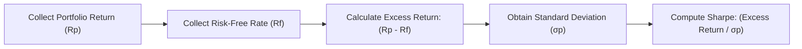
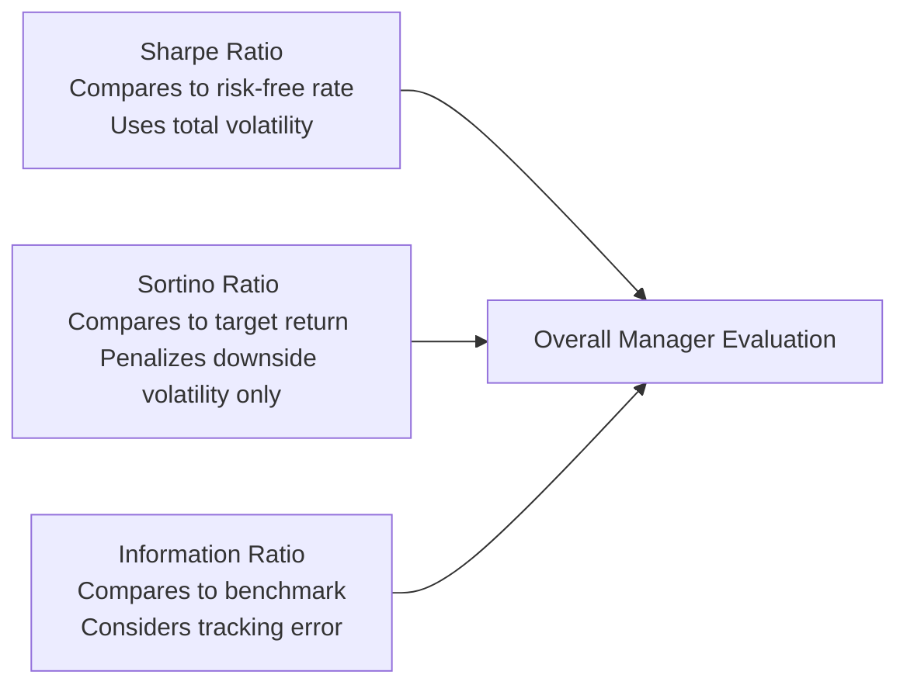

## 14.5 Risk-Adjusted Performance Measures

So, let’s talk about risk-adjusted performance measures. You know, it can feel like a puzzle sometimes. You’re looking at a stellar mutual fund that boasts high returns, and part of you might be going, “Wow! This fund is amazing!” But then there’s that little voice saying, “Hold on—how much risk are they taking?” That’s where risk-adjusted performance measures come into play.

Risk-adjusted metrics go beyond just the raw returns you see on paper. They incorporate how much volatility or market risk a fund must bear to achieve those returns. In other words, they provide some context. Are these fantastic returns coming from well-managed strategies—or from reckless risk-taking?

Below, we’ll deep-dive into three popular risk-adjusted measures: the Sharpe Ratio, the Sortino Ratio, and the Information Ratio. Each of these ratios tells a different piece of the story about a portfolio’s performance relative to its risk exposure. Understanding these measures can help you guide clients toward better investment decisions—so let’s dig in.

---

### Why Risk-Adjusted Performance Measures Matter

Imagine you have two funds, both returning 8% per year. Fund A invests in a stable mix of government bonds and high-quality equities; it has pretty low volatility. Fund B invests in super-speculative, small-cap stocks that can vigorously swing up and down from one day to the next. If you looked only at the raw return, you’d see both at 8%—equal, right? Well, not really.

• Fund A’s manager might be skillfully juggling risks to deliver steady growth.  
• Fund B’s manager might be making large bets that could either yield big gains or big losses.  

So, a risk-adjusted viewpoint lets us see beyond raw returns into how much "stress" the portfolio is enduring to produce that 8%. This is important when you’re matching your client's needs, time horizon, and risk tolerance (see Chapter 4: Getting to Know the Client). It’s also crucial for regulatory considerations because CIRO expects advisors to recommend suitable investments aligned with each client's risk appetite and objectives.

---

### Sharpe Ratio: A Quick Refresher

The Sharpe Ratio is the “classic” risk-adjusted performance measure. If you’ve been around the block a few times in financial circles, you’ve probably heard about Bill Sharpe’s famous invention. The idea is straightforward:  
• How much extra return did the portfolio generate, above the risk-free rate?  
• How much risk (in terms of standard deviation) did the portfolio take to achieve that extra return?  

Mathematically, you might see it expressed as:


\text{Sharpe Ratio} = \frac{(R_p - R_f)}{\sigma_p}


Where:  
• \\( R_p \\) is the portfolio return.  
• \\( R_f \\) is the risk-free rate (e.g., from short-term Government of Canada T-Bills).  
• \\( \sigma_p \\) is the standard deviation of the portfolio’s returns.  

In plain English: The Sharpe Ratio indicates how many “units” of return you got for each “unit” of risk. The bigger the number, the more efficiently the portfolio uses risk to produce returns.

#### Quick Example (Sharpe Ratio)
Let’s say, over a 12-month period:  
• A mutual fund yields 10%.  
• The risk-free rate is 2%.  
• The standard deviation of the mutual fund’s returns is 5%.  

Then, the Sharpe Ratio would be:  

\frac{(10\% - 2\%)}{5\%} = \frac{8\%}{5\%} = 1.6


A ratio of 1.6 is typically considered good, though the interpretation depends on your benchmarking context. A Sharpe Ratio above 1 is often seen as decent, above 2 as very good, and above 3 as excellent—although real-world comparisons are rarely this simple.

##### Visual Overview

Below is a mermaid diagram that shows how the Sharpe Ratio is calculated in a simple step-by-step flow:

From a risk-management perspective, Sharpe does a good job capturing total volatility (both upside and downside). But sometimes we only care about downward movements because, let’s be honest, upward “volatility” usually makes investors happy. That’s where the Sortino Ratio comes in.

---

### Sortino Ratio: Emphasizing Downside Risk

Sometimes, you’re in a conversation with a friend, and they excitedly confess they actually don’t mind “volatility” if it’s all happening in the positive direction. The Sortino Ratio is made for that scenario. It refines the Sharpe Ratio by penalizing only the harmful volatility: the downside deviation. It effectively treats upside volatility as a good thing rather than a “risk” factor.

Formally, its calculation looks like this:


\text{Sortino Ratio} = \frac{(R_p - R_t)}{\sigma_{down}}


Where:  
• \\( R_p \\) is the actual portfolio return.  
• \\( R_t \\) is the target or minimal acceptable return (sometimes the risk-free rate, or 0%, or another threshold).  
• \\( \sigma_{down} \\) is the standard deviation of negative returns (often referred to as downside deviation).

A higher Sortino Ratio means the portfolio is generating more return per unit of “bad” volatility. This can be particularly relevant for clients who are focused on capital preservation or who have a lower tolerance for drawdowns.

#### Imagining a Sortino Example
Let’s say a fund also returns 10% in a year. The minimal acceptable return (your target) is 3%.  
• In that same period, the fund’s downside standard deviation is 4%.  
• The Sortino Ratio is:  

\frac{(10\% - 3\%)}{4\%} = \frac{7\%}{4\%} = 1.75


Because you measure only the bad volatility, you might see that the fund is less risky (on the downside) than what a standard-deviation-based measure might suggest. Typically, if you compare a Sharpe Ratio of a fund with its Sortino Ratio, the Sortino Ratio might be higher if the fund experiences fewer or smaller negative swings.

---

### Information Ratio: Benchmark-Focused Analysis

Now let’s shift gears to the Information Ratio, which takes a slightly different approach. Rather than comparing returns to a risk-free rate, it compares a fund’s performance relative to a chosen benchmark, such as the S&P/TSX Composite for Canadian equities or some relevant index for a specific asset class (bond, global equity, etc.). It factors in the “tracking error,” which is the volatility of the difference between the fund’s returns and the benchmark’s returns.


\text{Information Ratio} = \frac{(R_p - R_b)}{\text{Tracking Error}}


Where:  
• \\( R_p \\) is the portfolio return.  
• \\( R_b \\) is the benchmark return.  
• The denominator is the standard deviation of \\((R_p - R_b)\\).

#### Why It Matters
The Information Ratio is quite popular with managers who aim to beat a specific index. It’s basically telling you how effectively the manager “earns” that outperformance (i.e., the active return) per unit of active risk (tracking error). The higher the ratio, the better the manager is at generating excess returns relative to the incremental risk they take versus the benchmark.

#### Quick Tracking Error Note
Tracking error is a big deal in the mutual fund and ETF space because it’s a measure of how closely a fund follows or deviates from a chosen benchmark. A higher tracking error can mean the fund manager is taking large bets that stray from the index composition. That could be good if the bets pay off—or relatively bad if they flop.  

---

### Comparing and Interpreting Risk Measures

Your next logical question might be, “When do I use each ratio?” Well:

• **Sharpe Ratio**: Best for assessing the efficiency of risk-taking without worrying about whether volatility is positive or negative. Good for an all-around measure.  
• **Sortino Ratio**: Helpful when you or your client emphasizes downside protection and cares more about negative volatility than positive volatility.  
• **Information Ratio**: Key if the fund is intended to beat a specific benchmark consistently, capturing how much “active risk” the manager is taking and whether that translates into outperformance.

If a fund consistently shows high values in all three, it indicates the manager is likely balancing risk and returns quite effectively. On the other hand, if a fund’s performance is strong but primarily in bull runs, you might see a decent Sharpe but a less attractive Sortino if it has large drawdowns. Or, if the fund deviates significantly from its benchmark and yields no real outperformance, the Information Ratio will look pretty weak.

##### Diagram: Comparison of Ratios

In this simple diagram, each measure leads you to a different vantage point, but all feed into your final assessment of the manager’s performance.

---

### Practical Illustrations and Case Studies

Let’s see a fictional scenario to make this real. Suppose you have two Canadian equity funds:

• **Maple Leaf Growth Fund (MLGF)**:  
  - Annual Return: 12%  
  - Standard Deviation: 10%  
  - Downside Deviation: 6%  
  - Benchmark Return: 10%  
  - Tracking Error vs. Benchmark: 4%  
  - Risk-Free Rate: 2%  

• **Prairie Value Fund (PVF)**:  
  - Annual Return: 12%  
  - Standard Deviation: 15%  
  - Downside Deviation: 9%  
  - Benchmark Return: 10%  
  - Tracking Error vs. Benchmark: 8%  
  - Risk-Free Rate: 2%  

#### Calculations for MLGF

• **Sharpe Ratio** = (12% - 2%) / 10% = 10%/10% = 1.0  
• **Sortino Ratio** = (12% - 2%) / 6% = 10%/6% ≈ 1.67  
• **Information Ratio** = (12% - 10%) / 4% = 2%/4% = 0.5  

#### Calculations for PVF

• **Sharpe Ratio** = (12% - 2%) / 15% = 10%/15% ≈ 0.67  
• **Sortino Ratio** = (12% - 2%) / 9% = 10%/9% ≈ 1.11  
• **Information Ratio** = (12% - 10%) / 8% = 2%/8% = 0.25  

In this quick example, both funds have the same absolute return (12%), but MLGF has better Sharpe and Sortino Ratios, meaning it uses risk more efficiently. MLGF also has a higher Information Ratio, although neither is particularly high. The difference suggests MLGF is more skillful at delivering alpha relative to the benchmark without racking up an unwieldy level of active risk.

If you’re an investor who’s comfortable with standard fluctuation but wants to keep drawdowns in check, you might favor MLGF. On the flip side, if you’re chasing absolute returns and you don’t mind large swings, maybe you would consider PVF (though it doesn’t look as compelling in this data set).

---

### Regulatory Emphasis and Standards

Now, you might be wondering, “Is risk-adjusted performance measurement just a nice-to-have, or is it required?” While regulators like CIRO (the Canadian Investment Regulatory Organization) don’t mandate a specific ratio in every client disclosure, they do require representatives to ensure that recommended products align with the client’s risk tolerance and goals. Demonstrating that you’ve considered risk-adjusted factors is a strong nod toward fulfilling your obligations under the Know Your Client (KYC) and suitability requirements.

Additionally, global frameworks such as the Global Investment Performance Standards (GIPS) by the CFA Institute strongly encourage disclosures of risk metrics when presenting performance to ensure transparency and comparability. Any manager aiming for best practices in the industry is likely to incorporate risk-adjusted metrics into their presentations or client reports.

---

### Additional Tools and Resources

In today’s digital landscape, you don’t have to whip out a calculator or a spreadsheet for every data point. Several resources and open-source tools can help:

• **Portfolio Visualizer** (portfoliovisualizer.com) – This platform provides portfolio backtesting and automatically calculates various risk metrics like Sharpe, Sortino, and Information Ratios.  
• **GIPS** (Standards by the CFA Institute) – Visit the CFA Institute’s website for guidelines on fair presentation of performance data.  
• **CIRO** (https://www.ciro.ca) – Canada’s national self-regulatory organization publishes rules, guidelines, and resources that can assist in framing why suitable risk management and performance representation are critical.  
• **Spreadsheet Software** – Tools like Microsoft Excel or Google Sheets can easily compute these ratios once you have the underlying return and risk data.  

In my experience, pulling data from multiple sources and cross-verifying helps ensure accuracy. Also, open data sets—like Yahoo Finance or official market data providers—allow you to compute your own benchmarks, track your own returns, and then generate risk metrics with a bit of Excel wizardry.

---

### Best Practices and Pitfalls

Best practices for risk-adjusted performance analysis often center on consistency, clarity, and context:

• **Use consistent data periods** – Compare funds over the same time frames to avoid skewing results.  
• **Pick a relevant benchmark** – Don’t measure a global equity fund against a Canadian bond index. Keep it apples-to-apples.  
• **Look at multiple metrics** – A single ratio doesn’t tell the whole story. Combine Sharpe/Sortino with the Information Ratio (and maybe more) for a holistic view.  
• **Consider the macro environment** – In times of extreme market volatility (think 2008 or early 2020), these measures can fluctuate wildly. Look at both short-term and long-term trends.  
• **Beware of data mining** – Sometimes managers pick a period that makes their performance look amazing but fails to show the big picture.

One common pitfall is over-focusing on a single measure. For instance, if you see a stratospheric Sharpe Ratio, maybe the manager is employing a niche strategy that has worked well so far but might be risky in a market regime shift. Another pitfall is ignoring the absolute returns in favor of the ratio—sometimes you want to see a healthy mix of both.

Additionally, metrics like the Sortino Ratio rely on a threshold or minimal acceptable return that can be a bit subjective. If a manager picks a target return that’s artificially low, the fund’s ratio can look artificially high. So always understand the inputs behind any metric.

---

### Conclusion

Risk-adjusted performance measures are essential tools for getting a nuanced view of how a mutual fund (or any investment) is actually performing relative to the risk it takes on. By exploring the Sharpe Ratio, Sortino Ratio, and Information Ratio, you gain multiple lenses for evaluating not only the returns themselves but also the path a fund takes to get there.

And that path matters, especially in a regulatory environment where CIRO emphasizes prudent client advice and ensuring investments align with each client’s profile. Whether you’re an up-and-coming mutual fund representative or a seasoned pro, integrating risk-adjusted measures into your due diligence processes is a mark of good professionalism—and, honestly, it just makes sense.

Remember: you can always refine and expand your toolbox with additional metrics like the Treynor Ratio, Jensen’s Alpha, Beta, and more (topics that might come up in advanced courses). But at the end of the day, the principle remains: high returns with reckless risk-taking often end in tears; well-structured strategies that produce sustainable risk-adjusted returns signal skillful portfolio management.

---

## Top 10 Risk-Adjusted Performance Measures Quiz



### Which key concept do risk-adjusted performance measures emphasize?

- [x] Balancing returns with the volatility undertaken to achieve them.
- [ ] Focusing strictly on the highest possible returns.
- [ ] Selecting only funds with zero volatility.
- [ ] Matching returns to a fixed rate.

> **Explanation:** Risk-adjusted performance measures look beyond raw returns by taking into account the volatility (risk) a fund experiences while delivering those returns.

### Which ratio uses standard deviation of total returns to measure risk-adjusted performance?

- [x] Sharpe Ratio
- [ ] Sortino Ratio
- [ ] Information Ratio
- [ ] Alpha

> **Explanation:** The Sharpe Ratio uses total standard deviation to evaluate how effectively a portfolio generates excess returns over the risk-free rate.

### Which ratio specifically targets downside deviation rather than overall volatility?

- [ ] Sharpe Ratio
- [x] Sortino Ratio
- [ ] Information Ratio
- [ ] Beta

> **Explanation:** The Sortino Ratio focuses on downside risk, ignoring upside volatility, and hence is ideal for investors mainly concerned with capital preservation during market dips.

### In the Information Ratio formula, what does the denominator represent?

- [ ] The risk-free rate
- [x] The standard deviation of the difference between the portfolio’s returns and the benchmark’s returns
- [ ] The difference between upside and downside returns
- [ ] The minimal acceptable return

> **Explanation:** The Information Ratio’s denominator is the tracking error, defined as the standard deviation of the fund’s excess returns relative to the benchmark.

### When is using the Sortino Ratio more appropriate than the Sharpe Ratio?

- [x] When an investor is mostly concerned about negative fluctuations
- [ ] When an investor wants to measure performance strictly against a benchmark
- [x] When an investor doesn’t mind upward volatility but wants to avoid large drawdowns
- [ ] When an investor wants a measure that uses total standard deviation

> **Explanation:** The Sortino Ratio is ideal for investors who want to focus on negative fluctuations only. That’s why it penalizes only downside volatility.

### Why might two funds with identical raw returns have different Sharpe Ratios?

- [x] Because they could have different levels of volatility
- [ ] Because they have identical levels of risk
- [ ] Because they report returns in different currencies
- [ ] Because they use the same benchmark

> **Explanation:** Sharpe Ratio factors in volatility. Even if they both produce 8%, one might have greater fluctuations in returns than the other, yielding a lower Sharpe.

### Which measure is particularly useful for evaluating an actively managed fund against its chosen benchmark?

- [ ] Sharpe Ratio
- [ ] Sortino Ratio
- [x] Information Ratio
- [ ] Treynor Ratio

> **Explanation:** The Information Ratio is specifically designed to evaluate how well a manager generates excess return (over the benchmark) per unit of tracking error.

### What is one potential pitfall of focusing on a single risk-adjusted performance measure?

- [x] It may not provide a complete picture of different risk dimensions
- [ ] It always guarantees correct evaluation of a fund
- [ ] It is internationally prohibited by GIPS
- [ ] CIRO mandates using only one ratio

> **Explanation:** No single ratio captures all aspects of risk and return. A combination of measures yields a more comprehensive view.

### How does tracking error affect the Information Ratio?

- [x] A higher tracking error reduces the Information Ratio unless excess returns are also higher
- [ ] A higher tracking error improves the Information Ratio
- [ ] It doesn’t affect the Information Ratio at all
- [ ] It’s only relevant for the Sharpe Ratio

> **Explanation:** In the Information Ratio formula, the tracking error is in the denominator, so the higher the tracking error, the lower the ratio—unless the manager’s excess returns over the benchmark correspondingly increase.

### True or False: Regulators such as CIRO require representatives only to review raw returns, not risk-adjusted returns, when recommending products.

- [ ] True
- [x] False

> **Explanation:** Although CIRO does not specifically mandate the use of Sharpe, Sortino, or Information Ratios, they do expect representatives to thoroughly understand and communicate the risk-reward profile of products, including suitability considerations. Risk-adjusted metrics are an excellent way to demonstrate that due diligence.


