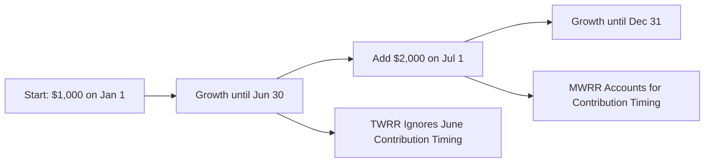

## 14.6 Time-Weighted vs. Money-Weighted Returns

Have you ever looked at a mutual fund’s published return and thought, “Hey, this number looks great, but my own account didn’t grow nearly that much”? Well, that discrepancy might be because you’re mixing up two different ways of measuring returns: the Time-Weighted Rate of Return (TWRR) and the Money-Weighted Rate of Return (MWRR). Don’t worry, you're not alone if you find these concepts a bit confusing. Let’s unpack them in a friendly, down-to-earth way.

Sometimes I'll chat with my neighbor, who invests in a few mutual funds. If I quote her a fund’s posted 10% annual return, she’ll shake her head and say something like, “My statements say I earned more like 7%.” That difference can result from different calculation methods. And yeah, it might sound technical, but once you grasp the basics, it's quite straightforward.

Below, we’ll dive into the nuances of TWRR and MWRR. We’ll see how each method tells a different story about performance, why you might use one versus the other, and how they show up in real life—especially in Canada, where we have specific regulatory frameworks (spoiler alert: regulators in Canada love TWRR for published data, whereas MWRR is golden for personal performance tracking).

Introduction  
We’ll start with the basics of each measure and then roll into practical examples. We’ll also talk about official Canadian regulations—like those from the Canadian Investment Regulatory Organization (CIRO)—that influence how mutual fund returns are published. Finally, there’ll be a quick mention of open-source tools like GNUCash that can do these calculations for you. So, let’s get right to it, shall we?

Understanding Time-Weighted Rate of Return (TWRR)  
Time-Weighted Rate of Return (TWRR) measures a fund manager’s performance, ignoring the impact of cash inflows and cash outflows during the measurement period. It’s like evaluating how the manager did purely on investment decisions, without factoring in how many units were bought or sold by investors at various times.

• Why We Use TWRR  
  – Manager Skill: TWRR is perfect for seeing how good a manager is. If a manager had $100 million in the fund, or $10 million, or even an extra $50 million show up halfway through, TWRR tries to neutralize the effect of those changing investment amounts.  
  – Comparable Across Funds: Since TWRR systematically excludes the effect of investor activity (such as deposits or withdrawals), it’s often used to compare different funds or different managers on a level playing field.

• How TWRR Works  
  – Sub-periods: TWRR splits the total investment horizon into sub-periods, each starting when cash flows occur (for instance, if investors add or remove money).  
  – Growth Factors: It calculates a growth rate for each sub-period separately, then multiplies them together.  
  – Simple Concept: Essentially, TWRR answers, “If $1 had been invested in the fund, ignoring every deposit or withdrawal from other people, how would it have grown over time?”

• Relationship with Regulations  
  – Canadian Fund Facts Document: If you read a mutual fund’s Fund Facts (and you should—seriously, it’s a gold mine of info), the performance numbers you see there are typically time-weighted.  
  – CIRO Standards: Because TWRR proves so useful in measuring manager performance, CIRO mandates TWRR-based disclosures for standardized performance reporting.  

Understanding Money-Weighted Rate of Return (MWRR or IRR)  
Money-Weighted Rate of Return is all about the actual investor experience, factoring in the exact size and timing of cash flows. Another word for MWRR is the Internal Rate of Return (IRR).

• Why We Use MWRR  
  – Real-World Perspective: If you put $10,000 in a mutual fund and then add another $2,000 six months later, that second contribution will affect your overall returns. TWRR won’t give you the big picture of how your personal money grew over time.  
  – Personal Performance: MWRR (or IRR) is invaluable for seeing how you, as an individual, fared—especially if you had multiple contributions or redemptions along the way.

• How MWRR Works  
  – The Discount Rate: MWRR is the rate at which the present value of all cash outflows (investments you made) equals the present value of all cash inflows (redemptions or ending balance).  
  – Trial and Error or Algorithms: Usually, you (or a software tool) solve an equation where the net present value (NPV) is zero.  
  – Ties to Real Dollars: Because it tracks your money going in and out, MWRR is the return that folks often care about when they want to know exactly how much they really earned.

• Relationship with Regulations  
  – Personal Rate of Return: Canadian regulations don’t typically require that MWRR be disclosed in official public documents, but many financial advisors use MWRR in client statements or individualized performance reports.  
  – CIRO Guidance: CIRO acknowledges the difference between published TWRR (for standard comparisons) and MWRR (for personal or ad-hoc statements).

Comparing TWRR and MWRR  
So which one do you actually need? The key is to recognize each measure’s strengths:

• TWRR is best when:  
  – You’re evaluating how skilled a fund manager is.  
  – You want to compare performance across different portfolios or funds without the “noise” of investor-driven deposits and redemptions.

• MWRR is best when:  
  – You’re gauging your personal return, especially when you’ve made several contributions.  
  – You want to see how your portfolio is performing in your unique situation.

Practical Examples and Calculations  
Nothing beats a concrete example. Let’s imagine you invest in a mutual fund over a year and see how TWRR and MWRR can yield different answers.

Example 1: TWRR in a Simple Scenario  

• Suppose you have $100 to invest in a mutual fund. You keep it there for exactly one year, ignoring deposits or withdrawals.  
• The manager grows that $100 to $110 at year-end. That’s a $10 gain on $100, or 10%. The time-weighted return is 10%.  
• Because there were no extra inflows or outflows, TWRR and MWRR happen to be the same (both 10%). Easy enough!

Example 2: MWRR in a Two-Investment Scenario  

• Let’s say you invest $1,000 in a fund on January 1. The fund does well in the first six months, and your balance grows to $1,100 by June 30.  
• You get excited and add another $2,000 on July 1 (so you have $3,100 total at that point).  
• Then, from July 1 to December 31, your combined $3,100 grows to $3,348 (a net growth of $248 over that period).  
• Let’s do a quick calculation:  
  – TWRR would measure the sub-period return from Jan 1 to Jun 30, then from Jul 1 to Dec 31, ignoring your big infusion at mid-year.  
  – MWRR, on the other hand, captures the fact that you added $2,000 halfway through the year.  

The final number for TWRR might still be something that looks like an annual rate (e.g., 15%), but your individual experience, after factoring in your mid-year deposit, might be just around, let’s say, 12%, because that $2,000 you added didn’t have a full year to grow.  

To visualize the difference, consider the following simplified timeline:

In this diagram, TWRR is focusing on B → D growth rates ignoring the grand total of your cash inflows, while MWRR specifically factors in the new $2,000 added in the middle.

Common Pitfalls and Best Practices  
When evaluating fund performance:

• Don’t Confuse TWRR with Your Actual Gains:  
  – TWRR is fantastic for seeing if the manager is doing a good job. But if you’re pouring in money every few months (or redeeming), it’s not going to reflect your own returns.  
• Avoid Overreliance on MWRR for Fund Comparisons:  
  – MWRR is influenced by cash flow timing. If you compare two managers using MWRR, you might be looking at differences that reflect deposit timing more than skill.  
• Keep Good Records of Cash Flows:  
  – For MWRR to be accurate, you need precise records—dates, amounts, etc. If you forget a mid-year deposit or withdrawal, your result can be way off.  
• Check Regulatory Requirements:  
  – Canada’s regulatory environment expects standard performance data to be TWRR-based, but watch your own statements to see if your personal performance might be MWRR.

Impact on Mutual Fund Performance in Canada  
Most Canadian mutual funds post their results as TWRR, and you’ll see these numbers in fact sheets, prospectuses, or Fund Facts documents. CIRO monitors these disclosures to ensure consistency across the industry. If you see a fund advertising “10% annual returns over the last three years,” that’s almost certainly time-weighted. Meanwhile, your personal statement from that same fund might read “Your personal rate of return is 8.5%,” because your money-weighted returns reflect when you actually invested or redeemed.

Tools and Resources  
Calculating TWRR manually isn’t too hard if you’re comfortable with dividing performance into sub-periods and multiplying growth factors. But MWRR can be more complicated, requiring algebra or financial calculators (like the ones in personal finance software).

• Open-Source Financial Tools: GNUCash  
  – This free solution can handle both TWRR and MWRR. You input your transactions and let the software do the heavy lifting.  
• Personal Planning Software: Some free online tools or spreadsheets also offer money-weighted calculations.  
• Regulatory Framework:  
  – CIRO: Canada’s national self-regulatory organization for investment dealers and mutual fund dealers. Learn more at https://www.ciro.ca.  
  – CIPF: The Canadian Investor Protection Fund. Not specifically about performance calculations, but CIPF is relevant if a member firm becomes insolvent, protecting your assets up to certain limits.  

Conclusion  
Alright, that was a mouthful, right? But it’s so important. TWRR and MWRR might sound like fancy acronyms, yet they’re at the heart of understanding what “return” really means. If you’re analyzing how a mutual fund manager has performed overall, you should stick with TWRR. If you want to check how much your personal portfolio has truly earned—accounting for your actual contribution dates and amounts—then MWRR is more appropriate.

There is no right or wrong answer about “which is better.” They’re measuring different things. Next time you see someone say, “This fund gave me 12% last year,” you can think to yourself, “Is that TWRR or MWRR?” or, “Is that the manager’s skill or the investor’s actual experience?” Because, quite frankly, that’s the million-dollar question.

And, yes, sometimes that difference can lead to confusion. But understanding it helps you interpret performance data the right way. So take a moment, do your own calculations (or let software do it), and figure out whether the number you’re looking at is time-weighted or money-weighted. This knowledge puts you in control, ensuring you see the big picture of how your money is really growing.

## Quiz: Time-Weighted vs. Money-Weighted Returns



### Which statement best describes the Time-Weighted Rate of Return (TWRR)?

- [x] It isolates the fund manager’s performance by excluding the impact of cash inflows and outflows.
- [ ] It directly incorporates the timing and amount of investor deposits and withdrawals.
- [ ] It is only used for personal portfolios.
- [ ] It is generally higher than the Money-Weighted Rate of Return.

> **Explanation:** The TWRR is calculated in a way that excludes cash flow timing, thereby measuring the manager’s performance over specific sub-periods.

### What is another name for the Money-Weighted Rate of Return (MWRR)?

- [ ] Arithmetic Mean
- [x] Internal Rate of Return
- [ ] Annual Percentage Yield
- [ ] Discounted Cash Flow

> **Explanation:** MWRR is often referred to as Internal Rate of Return (IRR) because it solves for the discount rate where net present value of cash flows equals zero.

### Why might published mutual fund performance data primarily use TWRR rather than MWRR?

- [x] TWRR allows for comparison of performance across funds without being affected by investor deposits or withdrawals.
- [ ] TWRR always yields higher returns than MWRR.
- [ ] MWRR cannot be accurately calculated by mutual funds.
- [ ] Regulations strictly prohibit MWRR for performance data.

> **Explanation:** TWRR is a standard approach that levels the playing field by removing the effects of differing cash flow patterns, thus allowing transparent fund-to-fund comparison.

### How does MWRR provide insight into an individual investor’s experience?

- [x] By incorporating the exact timing and amounts of all the investor's deposits and withdrawals.
- [ ] By averaging a fund’s quarterly returns.
- [ ] By ignoring the moments when the investor adds new money.
- [ ] By simply mirroring TWRR but subtracting management fees.

> **Explanation:** MWRR focuses on personal cash flow events, thus offering a clear view of the investor’s unique growth path.

### Which metrics are better matched with their correct use cases?

- [x] TWRR → Fund managers' performance; MWRR → Individual investor experience
- [ ] TWRR → Investor experience; MWRR → Fund managers’ performance
- [x] TWRR → Published mutual fund returns; MWRR → Client statements
- [ ] TWRR → Personal KYC (Know Your Client) data; MWRR → Tax filings

> **Explanation:** TWRR is typically used in official fund returns to reflect a manager’s performance fairly, while MWRR is typically used to assess personal investment outcomes.

### In a scenario where no money is deposited or withdrawn throughout the year, how do TWRR and MWRR compare?

- [x] They are usually the same.
- [ ] TWRR is always higher.
- [ ] MWRR is always higher.
- [ ] They can't be calculated.

> **Explanation:** When there are no external cash flows, TWRR and MWRR will match because both methods measure the same overall growth on the single initial investment.

### Why is MWRR often considered more “personal”?

- [x] It takes into account individual-specific contributions and withdrawals.
- [ ] It tracks the performance of the entire mutual fund industry.
- [x] It aligns closely with how much money you, personally, have gained or lost.
- [ ] It only uses the starting value of the fund’s assets.

> **Explanation:** MWRR tracks real cash flows for a specific investor, providing a “real-life” calculation of that person’s returns.  

### What is one potential drawback of relying on MWRR for comparing different funds?

- [x] It can be heavily influenced by the timing of cash flows, making fund-to-fund comparisons misleading.
- [ ] MWRR is never a valid return calculation.
- [ ] It’s legally prohibited in Canada.
- [ ] It produces the same outcome for all investors.

> **Explanation:** MWRR’s dependence on an individual investor’s deposits and withdrawals means the timing of money flows can artificially distort performance comparisons across multiple funds.

### How does CIRO generally require mutual funds to report their performance?

- [x] TWRR-based reporting is required for standardized performance presentation.
- [ ] MWRR-based reporting only, ignoring TWRR approaches.
- [ ] They don’t require any standardized performance disclosure.
- [ ] Reports must use both TWRR and MWRR at all times.

> **Explanation:** CIRO (the Canadian Investment Regulatory Organization) mandates that published mutual fund data be presented consistently using time-weighted returns, enabling fair comparisons.

### True or False: MWRR is sometimes referred to as the “Internal Rate of Return” because it solves for the discount rate that sets the net present value of cash flows to zero.

- [x] True
- [ ] False

> **Explanation:** MWRR and IRR are interchangeable terms describing the same calculation method that balances the present value of incoming and outgoing cash flows at zero.


