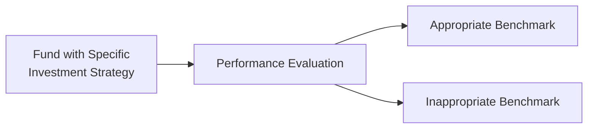
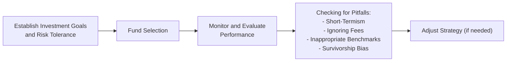

## 14.7 Common Pitfalls in Performance Evaluation

Investors often hear about a fund’s “stellar quarter” or a manager’s “winning streak,” but how often do we pause to see the bigger picture? In performance evaluation, especially for mutual funds, there are a few sneaky traps—misleading or incomplete approaches that can undermine good decision-making. Let’s explore these common pitfalls and see how you can steer clear of them.

Over the years, I’ve seen folks get overly excited about a mutual fund that soared for three months, only to be disillusioned when things took a turn in the subsequent quarter. And trust me, I’ve dabbled with that myself early on. It’s a bit like the thrill of a roller coaster ride: you’re pumped about the climb and forget the sudden drop around the corner. We’ll go through a number of typical pitfalls in evaluating performance, whether you’re guiding clients as a Mutual Fund Sales Representative or making personal investment decisions.

Before diving in, remember that references to your personal circumstances, such as time horizon or risk tolerance, matter just as much as the numbers on a performance chart. The Canadian Investment Regulatory Organization (CIRO) requires ongoing disclosure of fees and robust Know Your Client (KYC) procedures, all of which can help clients grasp the real meaning behind performance results. However, if you don’t know how to see beyond the headline returns or fail to compare apples to apples, you may form inaccurate expectations. So let’s walk through the pitfalls.

Short-Termism and Overreliance on Short-Term Results

It’s tempting to glance at a fund’s performance chart and zero in on the most recent numbers. Did it do well this quarter? Great, let’s hop on board! That might be the line of thinking. But short-term results can be heavily influenced by short-lived market events—like a one-time sector rebound, a market rotation into a certain industry, or unexpected monetary policy changes.

Short-term thinking, or “short-termism,” encourages knee-jerk decisions. You commit to a fund because it’s “hot,” but next quarter it could be “not.” By focusing on a broader time horizon—ideally, three to five years or more—you’re more likely to spot truly skilled portfolio management. There is an old saying: “Even a broken clock is right twice a day.” Consistent performance over the long term can highlight a manager’s actual ability to navigate various market conditions.

Not Adjusting for Risk

Sometimes, a fund that exhibits remarkable gains is taking on excessive volatility. Let’s say you have two funds: Fund A is up 15% over the past year, while Fund B is up 10%. At first glance, you might prefer Fund A because of its stronger performance. But what if, behind the scenes, Fund A invests in extremely volatile stocks, experiences wild price swings, or invests heavily in a single sector?

A client who is near retirement might not feel too comfy with a bumpy ride. If the risk level is high and the fund manager is swinging for the fences, it could catch up with them—and with you—when markets shift. By contrast, an investor in their 20s or 30s might tolerate more volatility. The bottom line is that you need to weigh returns in tandem with a fund’s risk profile. Maybe you’ve heard from friends who poured money into a high-flying technology fund in the late 1990s, only to see the bubble burst. It’s a classic cautionary tale. Balanced risk-return evaluation is crucial.

A quick way to measure risk is to look at standard deviation, Value at Risk (VaR), or Sharpe ratios. These indicators help you understand fluctuations relative to the reward earned. For instance, the Sharpe ratio tries to measure excess return (over a risk-free rate) per unit of risk. Sure, these metrics can sound technical, but they help you gauge how effectively a manager is converting risk into return.

Ignoring the Impact of Fees

Fees are a fact of life in mutual fund investing. Management Expense Ratios (MERs) or Total Expense Ratios (TERs) pay for management expertise, distribution costs, administration, marketing, and other operational expenses. But sometimes, a fund’s marketing materials emphasize “gross returns”—the return before these fees are deducted. If an investor only sees the gross returns, they might form unrealistic expectations.

CIRO’s rules ensure disclosure about fees, but it’s up to investors and their representatives to keep that cost front and center during each evaluation. A fund yielding a gross return of 10% may only produce a net return of 8% after fees. If you’re not paying close attention, you can be lulled into thinking you’re getting more than you actually are.

Sometimes, we don’t realize just how significant the fee difference can be in the long run. For instance:

If you invest $100,000 at a 6% gross annual return, and your fees are 2.5%, your net annual return might be closer to 3.5%. Over 20 or 30 years, that difference compounds dramatically. High fees erode returns step by step, especially in low-yield environments where every percentage point matters.

Remember: Even “small” fee differentials add up over decades. Encourage clients to read the Management Discussion of Fund Performance (MDFP) section in the fund’s annual or semi-annual reports. MDFP discusses the fund’s returns and the factors influencing them, along with how fees impact performance. This documentation is required by CIRO, ensuring that investors aren’t blindsided by hidden or overlooked fees.

Using Inappropriate Benchmarks

How do you measure the success of a small-cap growth fund? If you compare it to the S&P/TSX Composite Index—a broad market index with many large-cap companies—your reference point might not match the fund’s strategy. If the small-cap fund invests in niche technology startups, while the S&P/TSX includes huge banks and energy companies, you could be comparing apples to watermelons.

An appropriate benchmark will reflect the fund’s style, market capitalization range, and sector exposures. For instance, a small-cap growth fund might benchmark itself against a Canadian small-cap growth index or an index that better represents the specific type of assets. Bear in mind that if no perfect benchmark exists, the manager or the firm should explain how they chose the reference index.

Also keep watch for “benchmark hugging,” where a manager tracks an index so closely that the fund’s performance doesn’t diverge enough to justify active management fees. If you’re paying a premium for active management, are you getting truly active strategy or closet indexing?

Below is a simple Mermaid diagram illustrating the concept of comparing a fund to an appropriate benchmark:

In this diagram, the “Fund with Specific Investment Strategy” flows into “Performance Evaluation.” From there, “Performance Evaluation” can diverge into an “Appropriate Benchmark” (leading to more accurate insights) or an “Inappropriate Benchmark” (leading to misleading conclusions).

Survivorship Bias in Peer Groups

Sometimes, a peer group comparison helps gauge whether a fund manager is outperforming or underperforming relative to peers. However, when you look at historical returns in a database, funds that have closed, merged, or performed poorly often drop out of the data. This can artificially inflate the average performance of the surviving group.

Survivorship bias is especially sneaky; it’s easy to assume “all funds in this category returned 6.5% annually over the last decade.” But if half of them went bust or merged during that time, you might be missing the underperformers. This phenomenon can make the surviving group’s historical returns look more robust than they truly were.

If you’re looking at third-party data, find out whether they adjust for survivorship bias or not. Comprehensive databases should include all the funds that initially started in the period you’re examining, not just the ones that persisted long enough to make the final cut.

Glossary

Short-Termism: The common tendency to focus too much on recent (often quarterly or yearly) returns rather than looking at the manager’s long-term track record and strategy.

Survivorship Bias: A distortion that arises when funds that close or merge are excluded from performance data.

Excessive Volatility: Pronounced swings in investment returns, often beyond an investor’s comfort. This can trigger emotional selling or redemption at an inopportune time.

Gross Performance: The fund’s returns before subtracting fees, commissions, and operating costs—meaning actual returns to the investor are lower.

Practical Examples and Case Studies

• The Roller-Coaster Tech Fund: A technology-focused mutual fund soared 50% one year. Investors flocked in, excited by the triple-digit gains showcased in marketing materials. Six months later, the fund faced a sector downturn, losing 35%. Investors who entered at the peak felt misled, but they had overlooked the short-term nature of the initial rally. This highlights the short-termism mistake and the risk of ignoring volatility.  
• The Hidden-Fees Fund: Another fund boasted a gross annual return of 9%. Great, right? Not so fast. After factoring in a management fee of 2.5%, plus other expenses, the net return shrank to around 6%. The investor who only looked at the gross figure ended up with 3% less. Over 15 years, that difference cost them tens of thousands of dollars in lost potential growth.  
• The Misaligned Benchmark: An equity manager compared their small-cap fund to the broad S&P/TSX Composite Index. The composite index gained 4% in a year, while the smaller-cap index soared 10%. The fund manager posted an 8% return and touted it as “outperforming the S&P/TSX benchmark,” even though in reality, they trailed the more appropriate small-cap benchmark by 2%.  
• The Vanishing Funds: A study found that 20% of the small-cap equity funds in a certain category ceased to exist after a decade—either because they merged into a larger fund or shut down. Only the top-tier performers made it through. That 7% “average annual return” reflected just the survivors, missing all the funds that dropped out.

Further Guidance and Best Practices

1. Risk-Adjusted Measures: Use metrics like the Sharpe ratio, Sortino ratio, or standard deviation to see how volatile the fund’s returns are.  
2. Rolling Returns: Instead of looking at single-year snapshots, examine rolling returns (e.g., 3-year rolling returns over a 10-year span). This approach can identify consistency patterns and reduce the impact of random market anomalies.  
3. Closer Look at Fees: Read the fund’s Fund Facts document and all disclaimers about management fees, MER, distribution fees, and trailer fees. CIRO regulations require explicit fee disclosures to help investors understand net performance.  
4. Peer Group Comparisons: Check how performance is measured in peer group data. Are defunct or merged funds included? If not, how might that skew the results?  
5. Management Discussion of Fund Performance (MDFP): Pay attention to what the manager is saying about strategy, portfolio changes, macroeconomic conditions, and outlook. This segment can shed light on how the fund achieved its returns and whether those catalysts are sustainable.  

Real-World Regulatory Context

• CIRO oversees mutual fund dealers and investment dealers in Canada. Under CIRO, both large and small players must abide by disclosure rules around fees and performance reporting to clients.  
• The Canadian Investor Protection Fund (CIPF) is now the single investor protection fund. While CIPF does not protect you from market losses, it does protect clients’ accounts if a member firm becomes insolvent.  
• Dealerships are required to provide timely and accurate performance reports under CIRO guidelines, including specific mention of fees paid and net returns.  
• For official regulatory updates or to further investigate best practices for performance reporting, consider visiting https://www.ciro.ca.

Open-Source Financial Tools and Frameworks

If you want to do your own analysis, you can explore open-source tools:
• Python libraries like NumPy, pandas, and matplotlib for analyzing historical fund performance.  
• R packages such as PerformanceAnalytics for advanced risk metrics and time series analysis.  
• Free data sources like Yahoo! Finance or central bank websites (e.g., the Bank of Canada, or StatsCan—Statistics Canada) can help you map broader market indicators and economic variables to your fund performance analysis.  

You may also access the Federal Reserve Economic Data (FRED) if you want a global perspective or to compare how Canadian markets move relative to other major economies.

How This Connects to Other Chapters

• In Chapter 8, we discussed measuring risk, return, and concepts like variance and portfolio analysis. Understanding those risk measures is integral to realistically evaluating performance.  
• Chapter 15 explores how volatility might play a role in choosing a mutual fund. Tying that in with the pitfalls described here helps you avoid selecting the “flavor of the month” fund without seeing the big picture.  
• Chapter 17 and Chapter 18 address the legal responsibilities and ethical standards for mutual fund representatives. Ensuring transparent performance discussions with clients goes hand in hand with those ethical responsibilities.

Diagram: Integrating Performance Evaluation with Other Steps

In this simple flow, you establish investment goals, select a fund, then monitor performance. During evaluation, you check for potential pitfalls, and if they appear, you can adjust your strategy accordingly.

References for Further Exploration

• CIRO Website: https://www.ciro.ca  
• CFA Institute: Offers articles and resources on performance measurement and GIPS (Global Investment Performance Standards).  
• Morningstar: Provides fund datasheets, fee breakdowns, and rating systems that can highlight a fund’s performance relative to peers and benchmarks.  
• Python or R documentation on analyzing financial time series for those comfortable with coding.  
• “Management Discussion & Analysis (MD&A) sections” of annual reports: Great for understanding the backstory behind the numbers.  
• Academic Studies on Survivorship Bias: Articles from the Journal of Finance on “Mutual Fund Performance Persistence” that can provide deeper insights.

Wrapping Up

Performance evaluation is more nuanced than glancing at a single return figure or a star rating. By acknowledging common pitfalls such as short-termism, ignoring fees, mismatched benchmarks, not adjusting for risk, and failing to account for survivorship bias, you’ll be better equipped to interpret that performance data in an informed manner. Most importantly, performance analysis should be woven together with a broader conversation about goals, risk tolerance, and time horizon. That’s how you ensure you’re not just chasing yesterday’s headlines—but investing for tomorrow’s reality.

Anyway, investing is partly about numbers, but it’s also about human behavior—our inclinations toward chasing short-lived success or ignoring hidden costs. And no one wants to look back after a decade and realize we got seduced by the wrong data. Stay curious, keep learning, and make sure you’re evaluating performance with a wide lens!

---

## Common Pitfalls in Performance Evaluation Quiz: Avoiding Short-Termism and Survivorship Bias



### Overreliance on short-term results can cause investors to: 

- [x] Chase performance that may not be sustainable over time.
- [ ] Reduce the overall volatility of their portfolio.
- [ ] Properly adjust for long-term strategic goals.
- [ ] Automatically implement all recommended changes.

> **Explanation:** Short-term results can be misleading. Focusing only on the latest figures may cause investors to ignore a fund’s true long-term performance potential.

### Which is a direct result of not adjusting for risk in performance evaluation?

- [x] Investments may incur higher volatility than anticipated.
- [ ] Investors always outperform lower-risk portfolios.
- [x] Portfolios might suffer large drawdowns.
- [ ] Fees become less important to overall returns.

> **Explanation:** When risk isn’t factored in, a higher-volatility fund might look attractive based on returns alone, but it can expose investors to large drawdowns and higher uncertainty.

### Which best describes survivorship bias?

- [x] Only the surviving or successfully performing funds remain in the performance dataset.
- [ ] The tendency to focus purely on near-term results.
- [ ] An evaluation method that adjusts for risk.
- [ ] A form of systematic rebalancing implemented by dealers.

> **Explanation:** Survivorship bias arises because underperforming or closed funds are dropped from the sample, leading to inflated performance statistics for the remaining funds.

### Why is using an inappropriate benchmark potentially misleading when evaluating a fund?

- [x] You could incorrectly assess the manager’s skill relative to the fund’s actual strategy.
- [ ] It always lowers a fund’s reported performance.
- [ ] It eliminates risk considerations.
- [ ] It forces an investor to pay more transaction fees.

> **Explanation:** A fund should be compared to a benchmark that mirrors its investment style and risk profile. Using a misaligned reference gauges the manager’s success against irrelevant criteria.

### Ignoring fees can lead to:

- [x] Overestimation of returns.
- [ ] Consistent underestimation of performance.
- [x] A mistaken belief the fund is surpassing certain targets.
- [ ] Regulatory benefits from CIPF.

> **Explanation:** Paying attention to fees is vital. They reduce the investor’s actual return, so focusing solely on gross performance gains can give a distorted view of outcomes.

### How do you address the problem of short-termism in performance evaluation?

- [x] Assess longer time horizons (e.g., 3-5 years or more).
- [ ] Avoid all potential market-based investments.
- [ ] Only accept funds with monthly performance updates.
- [ ] Immediately reduce asset allocation in all funds.

> **Explanation:** Monitoring returns over multiple years provides a more reliable view of a fund’s ability to handle different market conditions.

### Which metric can help measure risk-adjusted performance?

- [x] Sharpe Ratio
- [ ] Fee Ratio
- [x] Standard Deviation
- [ ] Benchmark Turnover

> **Explanation:** The Sharpe Ratio and standard deviation measure risk-adjusted performance and volatility, respectively, giving more context to raw return numbers.

### What is a key piece of documentation for understanding forces behind a mutual fund’s performance?

- [x] Management Discussion of Fund Performance (MDFP)
- [ ] The CIPF fact sheet
- [ ] Personal blog posts from fund managers
- [ ] A defunct SRO update

> **Explanation:** The MDFP, usually in annual or semi-annual reports, provides insights on what influenced performance, how the portfolio is structured, and what fees apply.

### Where should Canadian investors look for official updates and resources on performance reporting standards?

- [x] CIRO’s official website
- [ ] A random investing forum
- [ ] The now-defunct MFDA site
- [ ] An unverified social media account

> **Explanation:** Investors can regularly visit https://www.ciro.ca for regulatory guidelines and up-to-date information on performance reporting standards in Canada.

### True or False: Survivorship bias can inflate the reported average performance of a peer group.

- [x] True
- [ ] False

> **Explanation:** By excluding defunct or merged funds, the average performance of the remaining group might appear higher than it truly is.


