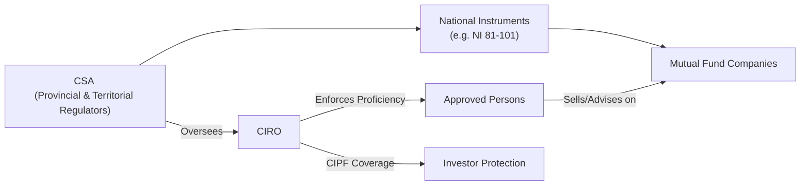
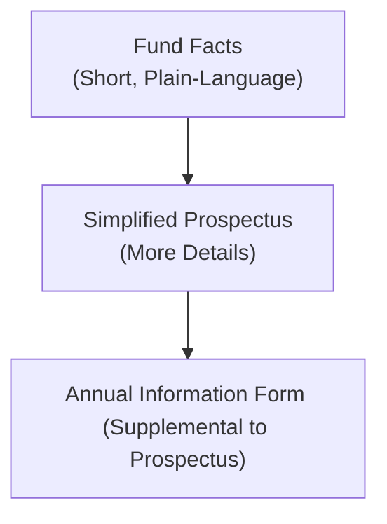
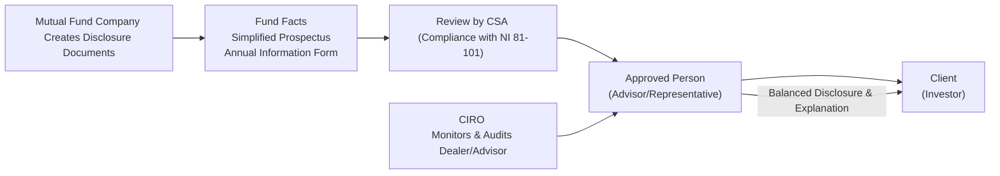

## 14.8 Regulatory Guidelines and Reporting Standards

Understanding how mutual fund performance is reported—and the guidelines behind it—is super important if you’re advising clients or investing yourself. Sometimes, though, it can feel like sorting through a giant box of puzzle pieces and trying to figure out which piece goes where. But don’t worry. In this section, we’ll put those puzzle pieces together so you (and your clients) can read performance documents with confidence and clarity.

So, let’s walk through the Canadian regulatory environment, focusing on the key rules that make performance reporting understandable, accurate, and fair. We’ll explore how to stay on the right side of those rules, including the role of the Canadian Securities Administrators (CSA), the implications of National Instrument 81-101, and the guidelines set out by the Canadian Investment Regulatory Organization (CIRO). We’ll also take a look at those fundamental documents like Fund Facts, the Simplified Prospectus, and the Annual Information Form—all designed to give investors a thorough understanding of how a mutual fund has performed and might perform in the future.

Along the way, I’ll share a couple of personal stories, examples, and diagrams to help break down the complexities. Let’s jump right in.

---

### The Regulatory Landscape in a Nutshell

Canada’s a bit unique—if you’ve already peeked at previous chapters, you may know we don’t have a single, central securities regulator like the U.S. does. Instead, we’ve got the Canadian Securities Administrators (CSA) as an umbrella for all provincial and territorial securities commissions. And then we have CIRO, our current (2025) national self-regulatory organization formed by the amalgamation of the old IIROC and MFDA. All these bodies help shape how mutual funds must disclose, measure, and present performance information.

• The CSA (http://www.securities-administrators.ca/) publishes National Instruments (NIs) that set baseline rules and frameworks.  
• CIRO (https://www.ciro.ca/) enforces compliance for investment and mutual fund dealers.  
• The Canadian Investor Protection Fund (CIPF) keeps client assets safe if a broker or dealer goes insolvent.  

And here’s a quick overview in diagram form, showing how these institutions fit together:

*Diagram Explanation:*  
1. The CSA creates and maintains instruments such as National Instrument 81-101.  
2. Mutual fund companies must follow these rules when creating disclosure materials.  
3. CIRO oversees dealers and Approved Persons, ensuring they comply with the rules.  
4. CIPF provides investor protection in cases of insolvency.  

---

### National Instrument 81-101: Setting the Standard for Mutual Fund Disclosure

National Instrument 81-101 (often abbreviated NI 81-101) is a CSA rule that spells out how mutual funds must produce and distribute simplified disclosure documents, like the Simplified Prospectus and Fund Facts. I once had a friend—just to share a quick anecdote—who tried to read a full prospectus late one night to understand a mutual fund’s strategy. They ended up calling me, bleary-eyed, telling me it was 100+ pages of legalese. This is exactly why NI 81-101 requires something more accessible.

#### Core Requirements of NI 81-101

• Mutual funds need to create a “Simplified Prospectus,” which is shorter and easier to digest than a long, exhaustive prospectus (though when the word “simplified” is used, it doesn’t mean it’s a light read for everyone).  
• They also must produce a Fund Facts document—a 2–4 page summary that quickly highlights a fund’s risk rating, performance data, fees, and holdings.  
• NI 81-101 outlines consistent rules for language, format, and distribution: everything is supposed to be in plain language and balanced. 

In other words, if you’re dealing with or advising on mutual funds in Canada, you’ll come across these two documents, both created under NI 81-101, just about every day.

---

### Key Regulatory Documents for Mutual Fund Performance

Let’s take a deeper look at the big three performance-related documents: Fund Facts, the Simplified Prospectus, and the Annual Information Form (AIF). Each is intended to inform investors about important aspects of a mutual fund’s performance, costs, and risks. They all have different levels of detail, so they come in handy at different stages of an investor’s research.

*Diagram Explanation:*  
• Fund Facts: The quick, plain-language summary.  
• Simplified Prospectus: More comprehensive than Fund Facts but still streamlined when compared to a traditional, full prospectus.  
• Annual Information Form (AIF): Not always read by everyone, but it offers additional historical performance details, portfolio turnover ratios, and more.  

Below is a quick comparative table to highlight what each document typically includes:

| Document                | Primary Purpose                                 | Key Sections Included                                  |
|-------------------------|------------------------------------------------|--------------------------------------------------------|
| Fund Facts             | Quick summary of critical info for investors    | • Fund objectives & strategies • Risk rating • Fees & expenses • Past performance (chart/table) • Top 10 holdings |
| Simplified Prospectus   | Broader view of the fund’s nature and strategy | • Detailed investment objectives • Distribution policy • Full risk disclosure • How the fund is managed • More in-depth cost disclosures |
| Annual Information Form | Extra info about fund operations & performance | • Historical performance • Portfolio turnover • Management details • Tax information for unitholders • Material contracts |

*Note:* These documents must be kept up to date and made available to both new and existing investors.  

---

### Fund Facts: The Go-To Snapshot

If you’re short on time—or your clients only have five minutes between soccer drop-off and evening dinner—it’s the Fund Facts they should be reading. Fund Facts documents give a snapshot of what to expect with a mutual fund. You’ll find:

1. **Risk Rating:** Usually indicated as Low, Low-to-Medium, Medium, Medium-to-High, or High.  
2. **Historical Performance:** A quick bar chart or table showing returns for a specified number of years.  
3. **Fees and Expenses:** The Management Expense Ratio (MER), trailing commissions, and other costs.  
4. **Top 10 Holdings:** So investors can quickly see if the fund invests in the type of securities they’re comfortable with.

The key is that it’s short, plain-language, and (most of the time) easier to digest. This is where the phrase “Balanced Disclosure” is often tested—meaning a fair representation of both the good and the bad. If a fund had a sharp drop last year, that should be right there in the bar chart, no sugar-coating. 

---

### Simplified Prospectus: Where Many Details Live

Next step up in detail? The Simplified Prospectus. It’s more thorough than the Fund Facts but still streamlined compared to a full-type prospectus that existed historically. If you want to know a fund’s investment objectives, distribution policy, and a more explicit breakdown of how the fund managers do their jobs day to day, the Simplified Prospectus is your document. 

From a compliance perspective, it’s crucial that the prospectus is regularly updated and distributed to new investors—or made available to them. As an Approved Person (i.e., anyone registered under a CIRO-regulated dealer and authorized to sell or advise on mutual funds), you must be aware of the content in the prospectus, so you can confidently explain it to clients and assure them that your sales conversations align with official disclosures.

---

### Annual Information Form: Extra Performance Intel

For performance geeks—and I’ll admit, I am one—there’s the Annual Information Form (AIF). Imagine the AIF as the extended features section on your favorite streaming service. It’s not always the first thing you watch, but if you’re obsessed, you’ll dive into it to get all the behind-the-scenes commentary.

The AIF includes things like historical performance, portfolio turnover ratios (which can affect costs), manager experience, material contracts, and so on. You may not reference the AIF with every client, but it’s there if you want a deeper understanding or need to resolve specific investor queries.

---

### CIRO’s Role in Performance Reporting

When the Mutual Fund Dealers Association (MFDA) and the Investment Industry Regulatory Organization of Canada (IIROC) merged in January 2023 (shortly after which the new self-regulatory body was renamed CIRO in June 2023), a single national body emerged to oversee dealers and their representatives. CIRO has rules and guidelines focusing on:

• **Proficiency:** Ensuring Advisors and Approved Persons are trained on performance measurement fundamentals.  
• **Sales Practices:** Ensuring that performance presentations aren’t misleading, manipulative, or overshadowing risk.  
• **Ongoing Compliance:** Through audits and reviews, dealers must demonstrate that the performance data and marketing materials line up with the statutory requirements (like NI 81-101).  

One big takeaway: you can’t just take a single year’s best-performing results, slap it on your website, and say, “Hey, look how great we are!” That’s a surefire way to get a compliance phone call. Balanced disclosure means an advisor should show a relevant trailing period (e.g., 1-year, 3-year, 5-year, 10-year returns), highlight the costs, and disclaim that past performance is not an indicator of future results.  

---

### Presenting Performance to Clients: Balancing Regulations & Clarity

#### Balanced Disclosure in Practice

Have you ever seen an ad that focused only on the “potential to double your money in a year”? Let’s be real: that can be pretty exciting. But it’s also incomplete. Balanced disclosure means referencing the realistic possibility of lower returns or even losses. For instance, if you’re preparing a marketing piece or a one-pager for investors, the rules generally say you must include:

1. **Historical Returns** over a standardized period (e.g., average annual returns for 1, 3, 5, or 10 years).  
2. **Applicable Fees** (like MER, redemption fees, etc.).  
3. **Risk** (e.g., using straightforward risk language and disclaimers).  
4. **Benchmarks** or relevant comparison indices, if appropriate and done fairly. 

Despite the red tape, the goal is to protect investors from being duped by hasty marketing claims. In my experience, being upfront about volatility can help build trust. Clients appreciate transparency more than hype.

#### Illustrative Case Example

Imagine you’re an Approved Person with CIRO. Your client, Jordan, is curious about a balanced fund that had a return of 15% in the last calendar year. If you only highlight the 15% and skip mentioning that the fund was down 10% a couple of years back—or that it has a “Medium-to-High” risk rating—Jordan might have unrealistic expectations. Next time the fund dips, Jordan could be more than just disappointed; they might file a complaint claiming they never understood the potential downside. Balanced disclosure is your friend here, ensuring Jordan goes into the investment with eyes wide open.

---

### Avoiding Common Pitfalls in Performance Reporting

Here are a few compliance traps to watch for:

• **Cherry-Picking Data:** Only showing results during “peak performance” periods. Regulators want standardized performance (e.g., 1, 3, 5, 10-year) so you don’t mislead folks.  
• **Inconsistent Calculation Methods:** Mixing up time-weighted returns (TWR) and money-weighted returns (MWR) without clarity. This can confuse clients about actual performance.  
• **Small Print Overload:** Burying important disclaimers in tiny fonts or footnotes no one reads. The regulators expect you to be forthright.  
• **Overhyping Potential Gains:** Using words like “guarantee,” “safe bet,” or “no-risk strategy” for mutual fund products is generally a huge no-no unless it is truly a guaranteed investment instrument (which typical mutual funds are not).  
• **Outdated Documents & Data:** Using old versions of the Simplified Prospectus or Fund Facts can lead to providing stale, inaccurate info.

---

### Advisor Obligations and Ethical Considerations

As we highlighted in earlier sections (see Chapter 18 for more on ethics), it’s not just about following the letter of the law—though that’s important. It’s also about meeting a high standard of care in guiding your clients. Keep the following in mind:

1. **Stay Current**: Always use up-to-date Fund Facts and prospectuses.  
2. **Explain, Don’t Just Hand Over**: Offer to walk clients through the performance charts and highlight volatility, costs, and risk.  
3. **Documentation**: Make notes in your client file about what you discussed (particularly risk and return scenarios).  
4. **Ongoing Training**: CIRO mandates continuing education so that you keep your knowledge fresh—markets and regulations evolve.  

---

### Tying It All Together with a Flow Example

Below is a simplified flowchart illustrating how information about a mutual fund’s performance typically moves from the fund company to an investor, under the watchful eye of CIRO and the CSA:

*Diagram Explanation:*  
1. Mutual fund companies draft essential documents in compliance with NI 81-101.  
2. The CSA ensures these documents meet baseline requirements.  
3. Approved Persons (under CIRO) present these documents and performance numbers to investors.  
4. CIRO monitors the dealers and Approved Persons to ensure compliance with ongoing regulations.  

---

### Additional Resources and Further Reading

• **CSA website (www.securities-administrators.ca)** – for up-to-date National Instruments like NI 81-101 and their respective companion policies.  
• **CIRO (www.ciro.ca)** – for the latest rule books, by-laws, and continuing education requirements.  
• **CIPF (www.cipf.ca)** – Canada’s sole investor protection fund for investment and mutual fund dealers.  
• **Open-Source Financial Tools** – Although not specifically required by regulators, using languages like R or Python can help you create transparent performance analyses (e.g., backtesting, charting, portfolio analytics).  

If you’re keen to dig deeper, the “CSA Staff Notices” posted on provincial commission websites often clarify the application of NI 81-101. CIRO bulletins or enforcement notices can also provide real-life cautionary tales, so you know which actions to avoid.  

---

### Final Thoughts

Regulatory guidelines may seem like they’re all about red tape, but they’re really about transparency, fairness, and protecting investors. Rules like National Instrument 81-101 ensure mutual funds communicate performance and risks clearly—so investors can make educated decisions. Meanwhile, CIRO ensures that the folks selling these products (Approved Persons) have the training and oversight needed to do it right.

If you’ve ever sat down with a new client and tried to decode a performance chart that leaps off the page one month and plunges the next, you know how important clarity can be. By following these regulatory guidelines, you’ll be in a better position to give your clients the full picture—good, bad, and sometimes ugly—while helping them see whether a mutual fund truly fits with their investment goals.

And that’s the real secret behind all these regulations: empower people to invest without being blindsided or swayed by hype. Sure, it takes a little more work and a bit more attention to detail. But trust me, the sense of security and confidence your clients feel is well worth the effort.

---

## Test Your Knowledge: Regulatory Guidelines and Reporting Standards Quiz



### Which Canadian regulatory rule primarily governs the disclosure requirements for mutual funds?

- [ ] National Instrument 31-103
- [x] National Instrument 81-101
- [ ] National Instrument 45-106
- [ ] National Instrument 81-102

> **Explanation:** National Instrument 81-101 outlines how mutual funds must create and distribute simplified disclosure, such as the Simplified Prospectus and Fund Facts.  

### Which document gives investors the most concise, plain-language snapshot of a mutual fund’s key features?

- [x] Fund Facts
- [ ] The Annual Report
- [ ] Annual Information Form
- [ ] A full-length prospectus

> **Explanation:** The Fund Facts is designed to be a short, accessible document summarizing the fund’s risk, fees, and performance.  

### According to Canadian regulations, what term describes the need to provide a fair representation of both positive and negative performance data?

- [x] Balanced Disclosure
- [ ] Oversight Disclosure
- [ ] Centralized Disclosure
- [ ] Precise Disclosure

> **Explanation:** Balanced disclosure refers to the requirement that advisors and mutual fund companies show a fair and complete picture, including past losses and risks, not just the “best” returns.  

### CIRO is the organization that oversees and regulates:

- [x] Mutual fund dealers, investment dealers, and market integrity
- [ ] Only portfolio managers
- [ ] Only segregated fund providers
- [ ] Non-financial corporations

> **Explanation:** After the amalgamation of MFDA and IIROC in 2023, CIRO is now Canada’s national self-regulatory body for mutual fund and investment dealers and monitors equity and debt market integrity.  

### What is the primary role of the Annual Information Form (AIF)?

- [x] To provide additional background, historical data, and operational details about a fund
- [ ] To replace the Simplified Prospectus entirely
- [x] To share details such as portfolio turnover ratios and material contracts
- [ ] None of the above

> **Explanation:** The AIF is an extension of the prospectus, offering further insight into historical performance, turnover ratios, contract details, and general operations.  

### When calculating and presenting performance, which time horizons are typically required to provide a fair overview?

- [x] 1-year, 3-year, 5-year, and 10-year
- [ ] Weekly and monthly only
- [ ] 6-month intervals only
- [ ] 20-year intervals only

> **Explanation:** Standard intervals of 1, 3, 5, and 10 years help ensure balanced and transparent reporting of mutual fund performance over a range of time frames.  

### When disclosing fees in Fund Facts or a Simplified Prospectus:

- [x] Advisors must clearly state all costs, including Management Expense Ratio (MER) and trailing commissions
- [ ] Advisors may omit trailing commissions if the MER is disclosed
- [x] Clients should be informed of redemption fees or short-term trading fees
- [ ] Fees only need to be disclosed if greater than 5%

> **Explanation:** In Canada, full fee disclosure is essential—particularly MER, trailing commissions, redemption fees, and other costs—so investors can make an informed choice.  

### If an Approved Person only advertises the fund’s best annual return in the past decade without showing negative years, which principle are they violating?

- [x] Balanced Disclosure
- [ ] Time-Weighted Return Standards
- [ ] Zero-Fee Guarantee
- [ ] Compounding Regulations

> **Explanation:** This would be an example of cherry-picking performance and failing to present a balanced view of the fund’s results.  

### What does “past performance is not necessarily indicative of future returns” imply?

- [x] Investors should understand that returns can change and are not guaranteed
- [ ] Performance will always remain the same
- [ ] Present performance results will continue into the future
- [ ] This statement is only legal boilerplate, ignoring real risks

> **Explanation:** This disclosure warns investors that a fund’s historical success doesn’t guarantee continued success under future market conditions.  

### The Canadian Investor Protection Fund (CIPF) provides coverage if a member firm becomes insolvent. This statement is:

- [x] True
- [ ] False

> **Explanation:** CIPF (formed by merging the MFDA IPC and the previous CIPF) is now the sole investor protection fund in Canada. It covers client assets held by a CIPF member that experiences insolvency.  


