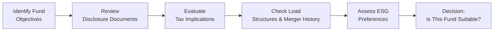

## 15.3 Other Elements to Consider When Analyzing and Selecting Mutual Funds

Selecting a mutual fund can sometimes feel a bit like choosing from a giant buffet. There are so many good options on the table—equity funds, fixed-income funds, balanced funds, specialty funds—and each one claims to have the perfect recipe for success. When you’re helping your client, friend, or perhaps even yourself decide which dish (fund!) to pick, there are several important elements to consider beyond simple returns. In this section, we’ll look closely at fund objectives and style, regulatory disclosure documents, tax implications, load structures, merger history, and ESG (Environment, Social, Governance) considerations.

But before diving into the details, I have to admit: I once got caught up in the excitement of a trendy fund that promised high returns with a newfangled “tech momentum” approach. I didn’t thoroughly check whether the fund’s style actually matched my objectives or risk tolerance. Let’s just say that experience taught me to slow down, read the details, and make sure the fundamentals align with my own (or my client’s) financial goals. So, let’s do this step by step.

---

### Fund Objectives and Style

When analyzing a mutual fund, start by understanding its primary goal. Does it aim for long-term capital appreciation, regular income distributions, or some balanced combination of the two? Also, check how the fund invests in order to reach those objectives. Is it a value fund seeking undervalued stocks? Is it a growth fund focusing on companies with high earnings potential? Or maybe a momentum fund that follows market trends? Here are some pointers:

• Alignment with Client Goals: Always match the fund’s approach to the client’s objectives, risk tolerance, and time horizon. If a client needs stable monthly income to cover living expenses, a high-volatility growth fund might not be the ideal choice.  
• Consistency: Look for a track record showing the fund manager’s adherence to the stated strategy. If it claims to be a “value” fund, its largest holdings shouldn’t be purely speculative growth stocks.  
• Manager Expertise: Check the tenure and experience of the portfolio manager. A manager with decades of experience might bring more consistent application of a strategy than a team that’s constantly changing.  

I recall a scenario where I recommended a supposed “dividend-income” fund to a friend. Later, we realized it was more of a hybrid between growth and dividend investing, toggling between small-cap growth stocks and high-yield bonds. It worked out, but it was riskier than expected. Taking the time to verify the actual holdings could have saved us that surprise.

---

### Regulatory Disclosure Documents

In Canada, mutual funds are required by regulators (coordinated through the Canadian Securities Administrators, or CSA) to publish specific documents that help investors make informed decisions. Here are some key ones:

• Simplified Prospectus: This document provides essential information about a mutual fund—what it invests in, relevant risk factors, fees, and its distribution policies. Make sure you consult the prospectus to gain a clear view of the fund’s rules and constraints.  
• Fund Facts: A streamlined disclosure document that highlights the fundamentals—like investment objectives, performance history, and costs—in a concise format. Fund Facts is often the most user-friendly tool in your kit.  
• Annual Information Form: Provides in-depth details about the fund, often including details about the management company, potential conflicts of interest, or any changes to investment policies.  

For example, maybe you see a line in the Simplified Prospectus that the fund can invest up to 10% in derivatives or that it engages in currency hedging if it invests globally. If your client isn’t comfortable with advanced strategies like writing options or using total return swaps, that might be a red flag. Alternatively, some clients might want exactly that level of sophistication. The idea is to ensure the objectives, strategies, and risk levels all match.

---

### Tax Implications

Taxes are sometimes the less glamorous part of picking a fund, but they’re definitely important. In Canada, different types of fund distributions—interest, dividends, and capital gains—are taxed differently in non-registered accounts.

• Interest Income: Typically taxed at your client’s marginal tax rate.  
• Dividend Income: Eligible dividends from Canadian corporations often come with a dividend tax credit, making them more tax-efficient.  
• Capital Gains: Taxed on only 50% of the gain, effectively lowering the income inclusion.

Furthermore, holding investments in registered plans (e.g., RRSPs, TFSAs, RRIFs) can reduce or defer tax liabilities. For many clients, placing more aggressively managed funds that tend to realize frequent gains inside a registered account helps maximize tax efficiency. Conversely, more tax-efficient funds—like those distributing primarily capital gains or Canadian dividends—may remain suitable for non-registered accounts.

If you’re dealing with global equity funds, keep in mind that foreign dividends typically don’t qualify for the Canadian dividend tax credit, so those distributions might incur a higher tax burden in non-registered accounts. It’s all about balancing the client’s entire tax situation with their investment strategy.

---

### Impact of Load Structures / Merger History

Ah, the dreaded “load fees.” This part can be confusing for newcomers, and even for veterans of the financial world, so let’s break it down carefully.

• Front-End Loads: Charges applied at the time of purchase. If you invest $10,000 in a fund with a 2% front-end load, only $9,800 actually goes into the fund.  
• Deferred Sales Charges (DSCs) or Back-End Loads: Applied when you sell shares within a certain time window (often 5–7 years). If you need quick liquidity, a DSC fund might put a damper on your plans, especially if you’re forced to liquidate early.  
• No-Load Funds: Typically have no upfront or deferred fees, but you’ll still pay management fees and operating costs built into the fund’s MER (Management Expense Ratio).

One of my colleagues once mentioned a case where a client locked themselves into a DSC fund for seven years without really knowing it. A year in, they needed cash and got hit with a larger-than-expected redemption penalty. Ouch! So make sure you weigh the pros and cons and confirm your client’s liquidity needs before committing to a particular load structure.

#### Merger History

Mutual funds can go through mergers or acquisitions. Maybe the management company decides to merge one underperforming fund into a more successful, larger fund. These organizational changes can impact fees, manager tenure, and historical performance records. If there’s a pending merger, it might be wise to hold off on investing until you understand the combined fund’s approach, fees, and strategy. The newly merged fund may also present capital gains distributions to existing unitholders if the portfolio is being rebalanced, which can result in unexpected taxable events for clients in non-registered accounts.

---

### Sustainability and ESG Considerations

More and more clients now want their investments to align with personal values, especially around climate change, social justice, diversity, fair governance, and so on. Environmental, Social, and Governance (ESG) considerations are front and center in these discussions. Some funds fully embed ESG in their process, while others purely claim to do so (so-called “greenwashing”).

• ESG-Focused or SRI Funds: Particularly suitable if your client wants to encourage positive social and environmental outcomes alongside reasonable returns.  
• Impact of ESG Screening: Funds that screen out certain industries—like fossil fuels or tobacco—may have different return profiles and risk exposures than their mainstream counterparts.  
• Global Standards: You can check resources like the Global Sustainable Investment Alliance (GSIA) at https://www.gsi-alliance.org for more insights. The CFA Institute also offers a helpful article, “SRI/ESG Investing: What You Need to Know,” diving deeper into the latest ESG developments.

If your client says, “I can’t stand the idea that my investments might contribute to pollution,” that’s a strong sign they want an ESG-focused fund. On the other hand, some folks only want to incorporate minor ESG factors and remain primarily return-focused. Either preference is valid—just make sure to identify it early.

---

### A Visual Overview of the Analysis Process

Below is a simple Mermaid.js flowchart you might find helpful in illustrating the step-by-step process of analyzing a mutual fund. Each step flows logically into the next, ensuring no stone is left unturned:

In practice, you’ll bounce between these steps, sometimes reevaluating objectives or reading additional documents. But the logical flow helps keep everything organized.

---

### Integrating CIRO and Other Regulatory Insights

As of January 1, 2023, the Mutual Fund Dealers Association of Canada (MFDA) and the Investment Industry Regulatory Organization of Canada (IIROC) merged into the Canadian Investment Regulatory Organization (CIRO). CIRO is now Canada’s single self-regulatory body overseeing investment dealers, mutual fund dealers, and marketplace activities. For the latest rules on how to advertise funds, handle commissions, or structure your practice, check https://www.ciro.ca. Also, the Canadian Investor Protection Fund (CIPF) is Canada’s sole investor protection fund, after merging with the MFDA IPC.

From a compliance perspective, when you’re recommending a fund with unique features, always ensure you stay aligned with CIRO rules regarding disclosures, sales communications, and marketing. For example, if the fund invests heavily in derivatives, your marketing materials better not mask that risk. The same goes for ESG or socially responsible investing claims; you must have evidence and robust data to back them up so they are not considered misleading to clients.

---

### Combining All Factors: A Quick Case Example

Imagine “Susan,” a 45-year-old professional with a moderate risk tolerance. She wants to retire by 65 and hopes to accumulate enough assets to travel the world. She’s environmentally conscious, open to growth-focused funds that incorporate sustainable investing, and invests in both registered (RRSP) and non-registered accounts. You might do the following:

• Step 1: Select an ESG Growth Fund that invests in mid- to large-cap Canadian and global companies. Check objective alignment.  
• Step 2: Read the Simplified Prospectus and Fund Facts to confirm they screen for environmental impacts and that there are no hidden hedging policies conflicting with her risk tolerance.  
• Step 3: Ensure the manager has at least a five-year track record with consistent returns compared to standard ESG equity benchmarks.  
• Step 4: Review tax implications: If the fund widely distributes foreign dividends, consider holding it in her RRSP for tax deferral.  
• Step 5: Confirm load structure is no-load or front-end load—Susan doesn’t like being locked in. Also, check for any pending mergers or management changes that might overshadow the current strategy.  

If everything checks out, the last step is to finalize the recommendation.

---

### Best Practices, Pitfalls, and Strategies

Below are a few quick tips to wrap up our discussion:

• Best Practice: Always triple-check that the fund’s actual holdings line up with its stated style and your client’s objectives.  
• Common Pitfall: Forgetting to weigh the effects of distribution type and timing on tax bills. I’ve seen high net-worth clients get an unexpected distribution in December that triggered a large tax liability come April.  
• Strategy to Overcome Pitfalls: Schedule regular check-ins, especially during year-end, to review tax obligations and “surprises” in distribution.  
• ESG Pitfall: Falling for “greenwashing” funds that label themselves as sustainable but have questionable investment screens. Investigate the holdings, not just the marketing.  
• Mitigating ESG Pitfalls: Look for external certifications or rating systems (e.g., MSCI’s ESG ratings) to gain confidence in the fund's methodology.

---

### Glossary

• **Fund Facts**: A concise regulatory disclosure document in Canada outlining key information—performance, fees, objectives—about a mutual fund.  
• **Simplified Prospectus**: A purposeful, shorter-form prospectus that provides essential details about a mutual fund, including how it invests and distributed potential risks.  
• **Load Structure**: A fee structure for purchasing or selling mutual fund units—can be front-end (purchase), deferred (redemption), or no-load (no sales fees). Even no-load funds will have ongoing management fees that contribute to the MER.  
• **Environmental, Social, and Governance (ESG)**: Criteria for evaluating a company’s ethical impact and sustainability practices. ESG funds incorporate these factors into their investment process.  

---

### Additional Resources

• **Canadian Securities Administrators (CSA)**: https://www.securities-administrators.ca — Offers guidance and regulations on disclosure, avoiding misleading sales practices, and compliance.  
• **CIRO**: https://www.ciro.ca — Canada’s current self-regulatory organization overseeing mutual fund dealers and investment dealers.  
• **Global Sustainable Investment Alliance (GSIA)**: https://www.gsi-alliance.org — Provides research and statistics on ESG and responsible investing around the world.  
• **CFA Institute Article**: “SRI/ESG Investing: What You Need to Know” — Helpful for a more advanced look at ESG screening, scoring, and regulatory developments.  
• **Online Courses**: “Sustainable and Impact Investment” on edX or specialized ESG modules from CSI.  
• **CIPF**: https://www.cipf.ca — Canada’s sole investor protection fund.  

Use these resources to stay up to speed on new developments and further refine your mutual fund selection strategy. After all, the market and regulations never stand still, so you shouldn’t either.

---

## Mastering Mutual Fund Selection Strategies: Key Elements Quiz



### Which document typically provides the most concise snapshot of a fund’s objectives, performance, and costs?

- [ ] Simplified Prospectus
- [x] Fund Facts
- [ ] Annual Information Form
- [ ] Financial Statements

> **Explanation:** Fund Facts is designed to offer essential information in a concise format, giving investors a quick overview of the fund’s objectives, performance, and costs.

### Which of the following distribution types usually receives the most favorable tax treatment for individual Canadian investors in a non-registered account?

- [ ] Foreign dividends
- [x] Capital gains
- [ ] Interest income
- [ ] RRSP disbursements

> **Explanation:** In Canada, only 50% of capital gains are included in taxable income, making them more tax-efficient than interest income or foreign dividends. RRSP disbursements are taxed as regular income.

### What is one possible advantage of placing a global equity fund in a registered account (e.g., RRSP) vs. a non-registered account?

- [ ] You cannot hold global equities outside a registered account.
- [x] It may reduce or defer taxation on foreign dividends.
- [ ] It automatically converts all foreign dividends into capital gains.
- [ ] It ensures foreign currency is always hedged.

> **Explanation:** Foreign dividends are typically taxed at the investor’s full marginal tax rate. Holding these assets in a registered plan like an RRSP defers taxes, often improving overall tax efficiency.

### Why should an investor consider a mutual fund’s merger history before investing?

- [ ] Mergers are always beneficial for investors.
- [x] Mergers can affect manager tenure, historical performance, and fees.
- [ ] Mergers permanently eliminate the need for ongoing management fees.
- [ ] Mergers have no effect on an investor’s tax obligations.

> **Explanation:** A merger may change fund objectives, manager continuity, and fee structures. It can also lead to unforeseen tax consequences for investors in non-registered accounts if the portfolio is rebalanced.

### Which best describes a “momentum” investing strategy?

- [ ] Focusing on undervalued stocks to buy them cheaply
- [ ] Targeting high-dividend-paying companies
- [x] Buying stocks that have been rising in price to ride the trend further
- [ ] Investing primarily in government bonds

> **Explanation:** Momentum investing involves purchasing stocks that have shown upward price trends, with the expectation that they will continue to climb.

### What is the role of the Canadian Investment Regulatory Organization (CIRO)?

- [x] It registers and oversees mutual fund dealers, investment dealers, and marketplace integrity.
- [ ] It is a global ESG standards board.
- [ ] It is an industry group that sets only best-practice guidelines.
- [ ] It insures investors against market losses.

> **Explanation:** CIRO is Canada’s self-regulatory organization that sets and enforces rules for investment dealers and mutual fund dealers. It does not cover market losses but ensures industry integrity and compliance.

### Which of the following statements is true about a load structure?

- [x] A front-end load is paid upfront and reduces the initial amount invested in the fund.
- [ ] A DSC is paid at the time of purchase.
- [x] A no-load fund has no sales commissions but can still have other fees like the MER.
- [ ] No-load funds have zero ongoing costs.

> **Explanation:** A front-end load is applied at purchase, and a no-load fund only avoids trading commissions but still carries management and operating expenses.

### How might ESG screening affect a mutual fund’s ultimate portfolio composition?

- [ ] It eliminates any need to analyze the financial fundamentals of companies.
- [x] It filters out companies based on environmental, social, or governance factors.
- [ ] It automatically guarantees higher returns than all non-ESG funds.
- [ ] It removes oversight from regulatory bodies.

> **Explanation:** ESG screening involves applying certain principles or thresholds relating to environmental, social, and governance metrics, which can exclude specific companies that do not meet these criteria.

### What is the main reason some clients prefer an ESG-focused fund?

- [ ] ESG-rated funds are always lower risk.
- [ ] ESG is mandatory under Canadian law.
- [x] They want to match their investments with personal values around sustainability and responsible corporate behavior.
- [ ] ESG guarantees higher returns.

> **Explanation:** Many investors choose ESG funds because these funds reflect their personal or moral convictions regarding environmental impact, social justice, and governance standards, rather than a guaranteed return advantage.

### True or False: The Canadian Investor Protection Fund (CIPF) protects client assets if a member firm becomes insolvent, not against market losses.

- [x] True
- [ ] False

> **Explanation:** CIPF safeguards investor assets in the event of a firm’s insolvency, but it does not cover any losses due to market fluctuations.


