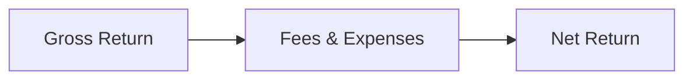

## 15.4 The Role of Fees and Expenses in Fund Selection

Selecting the right mutual fund can be a lot like picking the best car for a long road trip: you have to look under the hood, poke around a bit, and see what’s going on with all those little moving parts—especially the costs. Fees and expenses play a critical role in shaping your investment’s outcome. In the simplest of terms, the more you pay in fees, the less you keep in returns. But let’s get real: many of us, especially when first getting into finance, overlook the nitty-gritty of MER (Management Expense Ratio), loads, trailing commissions, and other charges. It’s like skipping the fine print on a phone contract, you know? A few paragraphs in, you find out you’ll be charged an arm and a leg for data roaming. 

I remember, in my earliest days dealing with mutual funds, I got excited by a fund’s flashy marketing brochure—colorful graphs, big promise of returns. Then I realized that they had some sneaky fees hidden behind the glitz. Ouch. So let’s dive in. We’ll breakdown all the key fees and expenses you could face, plus how to evaluate them and keep more of what you earn.

---

### Understanding the MER (Management Expense Ratio)

The Management Expense Ratio (MER) encapsulates most ongoing costs of running a mutual fund. It’s typically expressed as a percentage of the fund’s assets. Think of the MER as the “all-in” cost that’s automatically deducted from the fund before you even see the returns. A high MER can significantly erode potential gains over time, which is why it’s essential to watch this number carefully.

Key Components of the MER:
• Management Fee: The amount paid to the company or team that makes the investment decisions.  
• Operating Expenses: Administrative costs for daily fund operations, such as recordkeeping, legal fees, and audit expenses.  
• Taxes (such as GST/HST): Applicable in some provinces, these taxes add to a fund’s overhead.  
• Other Costs: Fees related to marketing, distribution, or ongoing investor communications.

**Quick Tip:** Compare MERs across funds in the same category (like comparing apples to apples). A bond fund with an MER of 0.85% might be considered more expensive if its peers average around 0.60%. While differences of 0.2% or 0.3% sound small, over a 10-year holding period, that difference can add up in a big way.

Let’s visualize how fees come out of your fund returns:

• A["Gross Return"] represents the return the fund earns before deducting fees.  
• B["Fees & Expenses"] is the combined pool of costs (like MER, sales charges, etc.).  
• C["Net Return"] is the portion that ultimately lands in your account.

#### Why the MER Matters
Say you invest CAD 10,000 in a mutual fund. The gross return is 7% for the year, but the MER is 2.5%. The net return you actually get might be just 4.5% or so, not counting any sales charges at purchase or redemption. That difference is the real pinch. And if your fund produces a modest return—let’s say 3%—but the MER is 2.5%, you’re only getting a net return of 0.5% (again, ignoring potential sales charges). Over time, that can drastically reduce the power of compounding in your portfolio.

---

### Performance (Incentive) Fees

Some actively managed funds—or specialty products such as hedge funds or certain alternative funds—charge a performance or incentive fee if their returns surpass a specific benchmark. The idea is to reward superior management skill, so the portfolio manager is compensated when they outperform a given index or threshold (for instance, a certain percentage of annual returns).

• **Pros:** Aligns the fund manager’s interest with that of investors. If they do well, both the manager and investor win.  
• **Cons:** Performance fees can be more expensive, and it’s crucial to confirm the goalposts. Is the hurdle rate fair? Is there a high-water mark (meaning the manager only gets a performance fee if the fund’s new gains are above the previous high)?

#### Evaluating Performance Fee Structures
Let’s pretend we have a hypothetical “BetterMax Fund” that charges a 1.5% management fee plus a 20% performance fee on any returns over 5% per year. If the fund returns 6% in a given year, 1% is subject to this 20% performance fee. So, 0.2% of your assets would be paid out as an incentive fee, in addition to the base management fee. It might sound small, but over a large investment or multiple years, it can stack up.

**Tip:** Always read the fund’s documentation (like the Fund Facts, which the Canadian Securities Administrators (CSA) requires to be disclosed clearly). Also, keep an eye on references from the Canadian Investment Regulatory Organization (CIRO) regarding performance fees. They ensure transparency and fairness in how these fees are presented to you.

---

### Sales Charges and Ongoing Charges

Sales charges are fees paid either when buying or redeeming fund units, or both. These can be confusing because different fund companies use different terms (and structures), so let’s break them down.

#### Front-End Loads
• Also called an “initial sales charge.”  
• You pay this fee when you buy, typically as a percentage of the amount you invest.  
• Example: If you invest CAD 10,000 in a fund with a 3% front-end load, you’d effectively pay CAD 300 in commission, leaving only CAD 9,700 actually invested.

#### Deferred Sales Charges (DSCs)
• Paid when you sell. DSCs start high (e.g., 5-6%) in the first year and decrease gradually until they hit 0% around year six or seven.  
• Good if you plan to hold the fund for a long time, but if you exit early, you might face a hefty redemption fee.  

#### Low-Load Fees
• A variation of a DSC but with a shorter redemption schedule and a slightly lower initial charge, typically around 2-3% if you cash out in the first couple of years.  

These structures were more common historically, and many investors and representatives prefer no-load funds today. No-load funds impose no commissions on purchase or redemption, although they can still have other fees such as short-term trading fees.

---

### Fee Impact on Net Returns

You might think, “Hey, if the fund’s performance is good enough, doesn’t it offset these fees?” Possibly. But it’s really about net returns. Even a fund that posts a slightly higher gross return could yield less to you if the fees are disproportionate. 

I sometimes compare it to being a small business owner. If you have a fantastic month of sales but your overhead expenses are huge, guess what? Your net profit might still be lower than a modestly selling competitor who runs a lean operation. Fees are your overhead expenses.

---

### Trailing Commissions

Trailing commissions, also called trailer fees, are ongoing payments a mutual fund company makes to the dealer or representative for “servicing” your account. Essentially, they come out of the MER. It’s meant to compensate your advisor for ongoing support—like answering your questions, providing account updates, and giving you general service.

But do trailing commissions truly align with your best interests? Today’s environment requires more transparency. According to CIRO rules, all charges and any potential conflicts of interest must be clearly disclosed. More advisors are transitioning to fee-based models or lower-cost, no-commission structures. Make sure you understand whether the fees your representative receives (like trailing commissions) affect the advice they give.

---

### Viewing Fee Structures Over Time

Let’s do a quick numeric example:

• You invest CAD 50,000 in two hypothetical mutual funds, both with a gross annual return of 6%.  
• Fund A has an MER of 2% and no additional sales charges.  
• Fund B has a slightly higher MER of 2.5% but also a 3% front-end load at purchase.

After 1 Year:  
• Fund A’s net return: 6% – 2% = 4%. Your investment grows to CAD 52,000 (i.e., 50,000 × 1.04).  
• Fund B’s initial investment after the front-end load: CAD 48,500 (since 3% of 50,000 is 1,500).  
  Then grows by net 3.5% (6% – 2.5%) to about CAD 50,198 (rounded).

That’s a little difference in the first year, but as you hold longer, these cost layers can compound. A difference of 0.5% in annual fees on a large sum of money really adds up over a decade.

---

### Best Practices for Evaluating Fees and Expenses

• **Compare Funds in the Same Category**  
  Looking at a bond fund’s fees vs. an equity fund’s fees is like apples to oranges. Instead, compare bond funds with bond funds, small-cap equity with small-cap equity, etc.

• **Watch for Hidden or Less Emphasized Costs**  
  Performance fees, short-term redemption fees, or currency conversion charges can spring up. Always read the prospectus or Fund Facts from the CSA.

• **Use Online Tools and Resources**  
  ✔ Fund Library: Offers comparison tables and cost summary tools.  
  ✔ Morningstar Canada: Provides extensive data on fees, returns, and fund history.  
  ✔ CIRO (https://www.ciro.ca): Has up-to-date regulations and guidelines, plus best practices on how fees should be disclosed.

• **Speak with Your Advisor**  
  If you see trailing commissions, ask how they impact the advice you’re receiving. Seek clarity on conflicts of interest.

• **Consider Fee-for-Service Models**  
  Fee-based advisors often charge a flat or asset-based fee for financial planning and investment management. This can reduce the conflicts that arise when compensation is tied to product sales.

---

### Pulling It All Together: Making the Right Choice for Your Portfolio

Ultimately, the goal of selecting a mutual fund is finding one that fits your risk tolerance, aligns with your long-term objectives, and doesn’t drain you with high fees. In Canada, the *Fund Facts* document mandated by the CSA clearly lays out all costs. CIRO’s compliance rules ensure you’re informed about any charges or potential conflicts so you can make a fair comparison. 

High fees are not always “bad,” provided you’re receiving commensurate value—like specialized management, unique investment strategies, or diversification benefits. But if you’re paying more in total costs, you should see evidence that the higher fee structure boosts your risk-adjusted returns over the long run.

**Practical Steps to Wrap Up:**

1. **Research Thoroughly:** Start by shortlisting funds that meet your risk profile.  
2. **Compare the MERs and Other Fees:** Use available online tools to analyze fund expense ratios side by side.  
3. **Understand Different Load Structures:** If your fund applies front-end loads, DSCs, or performance fees, figure out their impact on your holding period.  
4. **Check Trailing Commissions:** Ask yourself if these commissions are aligned with the ongoing services you’re getting.  
5. **Monitor Ongoing Costs:** Even after investing, keep an eye on how fees evolve, as some mutual funds can adjust expense ratios over time.  

In the end, every fraction of a percent you pay in fees must be justified by the results you get—both financially and in terms of your peace of mind. It’s perfectly okay to pay for expertise, but first be absolutely sure you’re getting value for what you pay.

---

### Glossary

• **Management Fee:** The fee charged by the fund manager for overseeing and investing the fund’s assets.  
• **Performance Fee (Incentive Fee):** An additional fee levied if the fund surpasses certain performance benchmarks, often expressed as a percentage above a hurdle rate.  
• **Trailing Commission:** Ongoing fees (usually embedded in the MER) that the mutual fund pays to the dealer for continuing support and service to the investor.

---

### References and Additional Resources

• [CIRO](https://www.ciro.ca) – Canada’s national self-regulatory organization overseeing investment and mutual fund dealers; check the site for rules regarding fee disclosures and investor protection guidelines.  

• [Canadian Securities Administrators (CSA)](https://www.securities-administrators.ca/) – Creator of the Fund Facts document, which outlines standardized mechanisms for showing costs and fees.  

• Fund Facts – Mandated by the CSA; a concise document showing you the crucial items about a mutual fund, including fees, historical returns, and risk rating.  

• Fund Library and Morningstar Canada – Platforms offering fund screening tools and fee comparison features.  

• CIRO Rulebook – For compliance details around how fees must be disclosed. A good read is “Sales Practices, Fees, and Commission Structures,” which provides deeper insight into fee regulations.  

• Other Reading: CSA Staff Notices on fee disclosure, plus websites, aggregator tools, and articles that guide you on how to evaluate or compare MERs across funds.

---

## Discover the Importance of Fees in Mutual Fund Selection: Quiz



### When analyzing mutual funds, which ratio provides a comprehensive overview of most operational costs?

- [ ] The Sharpe Ratio
- [x] The Management Expense Ratio (MER)
- [ ] The Price-to-Earnings (P/E) Ratio
- [ ] The Debt-to-Equity Ratio

> **Explanation:** The MER captures management fees, operating expenses, and taxes. It gives investors an overview of how much is deducted from a fund’s returns to cover ongoing expenses.

### Which of the following might be a disadvantage of a performance/incentive fee structure?

- [ ] It aligns manager and investor goals
- [x] It can become expensive if the fund outperforms
- [ ] It applies a constant flat fee regardless of performance
- [ ] It eliminates the need for a base management fee

> **Explanation:** Performance fees charge investors extra when the fund does better than a stated benchmark. This can become costly for investors when returns are high.

### Which statement about front-end load funds is most accurate?

- [x] Investors pay a commission at the time of purchase
- [ ] Investors always avoid commission when they purchase
- [ ] The commission is automatically refunded if the fund underperforms
- [ ] There is no effect on the initial investment amount

> **Explanation:** A front-end load is charged when you buy into the fund, reducing the money that actually goes to work in the market.

### Deferred Sales Charges (DSCs) typically:

- [ ] Apply a fee only when you transfer additional funds into the mutual fund
- [ ] Eliminate all future trailer fees
- [x] Decline over time and disappear after a certain holding period
- [ ] Remain the same throughout the entire holding period

> **Explanation:** DSCs begin with a higher redemption fee that decreases, usually to zero, after a set number of years.

### Trailing commissions are:

- [x] Ongoing payments to the dealer/representative from the fund’s MER
- [ ] One-time fees that only apply at fund redemption
- [x] Potentially a conflict of interest if undisclosed
- [ ] Illegal in Canada

> **Explanation:** Trailing commissions are embedded in the MER and paid to dealers or representatives over time. If there is insufficient disclosure, it can create a conflict of interest.

### Which fee would be most likely linked to a fund outperforming its set benchmark?

- [x] Performance or incentive fee
- [ ] Market-making fee
- [ ] Redemption fee
- [ ] Trailing commission

> **Explanation:** Funds that charge performance fees do so when they beat a specific benchmark or hurdle rate.

### Why is it important to compare MERs among funds in the same category?

- [x] Different categories have different average MER ranges, making cross-category comparisons less meaningful
- [ ] Equity funds never charge higher MERs than bond funds
- [x] Fund categories are standardized by performance and fees
- [ ] All funds in any category have the same MER

> **Explanation:** Each category (e.g., bond, equity, money market) has a typical range for fees and performance benchmarks, so within-category comparison is most relevant.

### Which statement best describes the relationship between net returns and fees?

- [x] Net return = Gross return – Fees
- [ ] Net return always includes a 2% management fee
- [ ] Net return is unaffected by sales charges
- [ ] Net return is always higher than the gross return if fees apply

> **Explanation:** Fees reduce what you actually earn, so net return is the remainder of your gross return after fees are deducted.

### How do front-end and deferred sales charges primarily differ?

- [x] Front-end loads apply at purchase; deferred sales charges apply at redemption
- [ ] Both only apply to segregated funds
- [ ] Deferred sales charges never apply a fee
- [ ] Front-end loads never involve a commission

> **Explanation:** Front-end loads are paid at the time of buying fund shares, whereas DSCs are charged if the investor redeems shares before a certain time elapses.

### True or False: A slightly higher gross return can still produce a lower net return if the fees are significantly higher.

- [x] True
- [ ] False

> **Explanation:** If Fund A has a better gross return but higher total fees, the net return could end up lower than a fund with a smaller gross return but lower fees.


