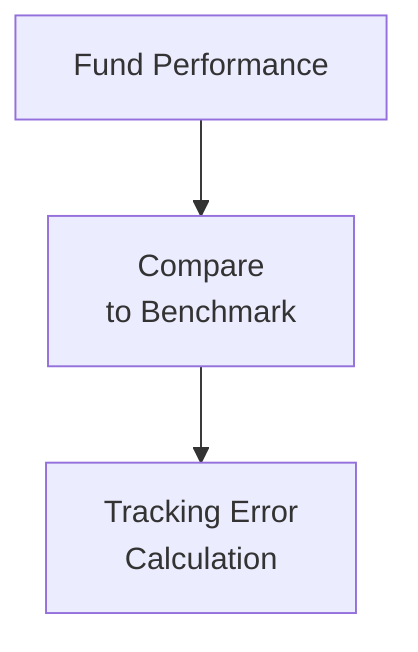

## 15.5 Understanding Fund Benchmarks and Performance Comparisons

It’s one thing to measure a mutual fund by looking at its returns in isolation, but how do you really know if those returns are competitive or justified? This question led many investors—myself included—to spend years sifting through stacks of fund fact sheets while trying to figure out if “10% growth” was actually impressive or not. As it turns out, you can’t decide this by looking at the fund alone. You have to compare it to something else—to a yardstick or “benchmark” that serves as a reference point for performance. In this section, we’ll explore the purpose of benchmarks and how they can help you gain deeper insight into a fund’s results. We’ll also look at the concept of tracking error, risk-adjusted returns, and how to make a balanced assessment when you’re comparing Apple Funds to Apple Indexes—or global equity funds to global equity benchmarks.

Remember that this entire discussion is grounded in the Canadian regulatory environment, guided by the Canadian Investment Regulatory Organization (CIRO) as the single self-regulatory body overseeing mutual fund and investment dealers under one roof. Although you may come across historical references to the Mutual Fund Dealers Association of Canada (MFDA) or the Investment Industry Regulatory Organization of Canada (IIROC), those separate bodies were amalgamated into CIRO as of January 1, 2023.

---

The Purpose of Benchmarks  
--------------------------------

Benchmarks are a critical part of evaluating any investment, including mutual funds. Many times, we just look at a fund’s absolute performance (“The fund returned 8% this year!”) and weigh that as good or bad based on our expectations. But if you don’t compare that 8% to a measure of what similar assets or the overall market returned, you won’t know whether you could have done better in a different vehicle (like a competitor’s fund or even a simple index).

• A Canadian equity mutual fund might use the S&P/TSX Composite Index as a benchmark because that index measures the performance of the broad Canadian stock market.  
• A more concentrated Canadian equity fund might choose the S&P/TSX 60 Index—comprised of 60 large, well-established companies in Canada—because it’s more aligned with what the fund invests in.  
• If you have a global equity fund, it makes sense that it would use a global benchmark like the MSCI World Index, rather than a Canadian-only index.  

Anyway, the main takeaway is that using the right benchmark helps you see if the fund manager’s decisions are adding value or just riding the rising tide of the broader market.  

Choosing the Right Benchmark  
----------------------------------

Choosing an appropriate benchmark is about matching the investment style, geographical focus, and asset class of the fund. If your fund invests, say, half in Canadian equities and half in U.S. equities, you might see a blended benchmark that includes both a Canadian index (like the S&P/TSX Composite) and a U.S. index (like the S&P 500), weighted in proportion to the fund’s average allocation. Conversely, using the wrong benchmark can mislead investors and potentially distort perceived fund under- or over-performance.

I remember a friend once felt super excited that his “global” fund was beating the S&P/TSX Composite by a large margin, but then discovered that fund was literally investing 80% in technology firms in the U.S. That made the “benchmark” comparison basically apples to oranges. It’s crucial to ensure the benchmark lines up with the fund’s actual holdings.  

Tracking Error and Why It Matters  
--------------------------------------

Tracking error is a statistical measure, describing how much a fund’s returns deviate from its benchmark returns. It’s typically expressed as the standard deviation of the difference between the two. This fairly technical definition boils down to: “How tightly does the fund hug its benchmark?”  

• Low tracking error: Usually indicates a fund sticks quite close to its benchmark. Index funds or passive ETFs aim to minimize tracking error and replicate the benchmark’s movement as faithfully as possible.  
• High tracking error: Often observed in actively managed funds, whose portfolio managers deliberately deviate from the benchmark to find some alpha or outperformance.  

High tracking error can work both ways—I mean, a manager might outperform big time or underperform just as drastically. So, a higher tracking error signals bigger bets compared to more benchmark-oriented funds.

Below is a simple visual diagram illustrating the concept of comparing fund performance to a benchmark and evaluating tracking error:

As you can see, the process starts with the fund’s returns, stacks them up against the benchmark, then calculates the variability (standard deviation) of that difference. If you’re curious about the math, it typically involves calculating daily or monthly differences between the two performances, then measuring the standard deviation of those differences over time.  

Absolute vs. Relative Performance  
--------------------------------------

When you analyze a fund, you’ll want to look at both absolute and relative performance:

• Absolute performance: The actual returns the fund generated over a period—like a year, three years, or five years. This is your “how many dollars did I make?” measure.  
• Relative performance: How the fund performs versus benchmarks or peer funds. You might ask, “Did it beat the S&P/TSX Composite Index?” or “Does it rank better than other large-cap Canadian equity funds on Morningstar?”  

Why does this matter? Because you can have a fund that delivers 10% while the overall market soared 15%, which might not be so great in relative terms. Or, in a market downturn, a fund might post a -2% return while the benchmark is down -5%. In absolute terms, you still lost money, but relatively speaking, you lost less than the market, so that might be considered decent performance in a tough period.

Looking at both absolute and relative returns helps you avoid the pitfall of judging whether a fund is “good” or “bad” purely on a single dimension.  

Risk-Adjusted Returns (Sharpe and Sortino Ratios)  
------------------------------------------------------

Not all returns are created equal because some strategies take on bigger risks to capture bigger returns. Risk-adjusted return metrics are essentially your guardrails, showing how effectively a fund converts risk into returns.

Popular measures include the Sharpe ratio and the Sortino ratio.

• **Sharpe Ratio**: Provides a metric of excess return (over a risk-free rate, like T-bills) per unit of total volatility (standard deviation). In formula form:

$$
\text{Sharpe Ratio} = \frac{R_p - R_f}{\sigma_p}
$$

Where:  
Rₚ = Return of the portfolio (or fund)  
R_f = Risk-free rate of return  
σₚ = Standard deviation of the portfolio’s excess returns  

A higher Sharpe ratio generally indicates more “bang for your buck” in terms of risk undertaken.  

• **Sortino Ratio**: A close cousin to the Sharpe ratio, but it zeroes in on downside risk by using downside deviation rather than standard deviation. This is really handy if you want to punish funds for negative volatility but not for positive volatility.  

In simpler terms, a high Sharpe or Sortino ratio says, “The fund manager is (hopefully) not taking lumps of unnecessary risk to generate returns, but skillfully navigating the market.” However, you should always interpret these ratios in the context of the fund’s style, time horizon, and the general market environment.  

Case Study: Analyzing a Balanced Fund  
------------------------------------------

Let’s imagine a hypothetical balanced fund called Maple Balanced Growth Fund. Maple invests about 60% in Canadian and global equities, and 40% in Canadian bonds.

• Benchmark: The manager uses 60% MSCI World Index + 40% FTSE Canada Universe Bond Index.  
• Fund Performance (last 3 years, annualized): 6.5%  
• Benchmark Performance (last 3 years, annualized): 6.2%  
• Tracking Error: 2.0% (i.e., the standard deviation of the difference between the fund returns vs. the benchmark over that period)  
• Sharpe Ratio: 0.80 (using a 2% risk-free rate)  
• Sortino Ratio: 1.05  

Interpretation: Maple Balanced Growth Fund beat its blended benchmark by about 0.3% on an annualized basis, which is a decent sign. The tracking error of 2.0% suggests the manager isn’t straying wildly from that benchmark. The Sharpe ratio of 0.80 with a 2% risk-free rate implies the manager is earning 0.80 units of return for every “unit” of total risk. The Sortino ratio is higher (1.05), indicating that the negative volatility was contained nicely, and the manager avoided dramatic dips.  

Now, imagine if you discovered Maple Balanced Growth Fund was being marketed as an aggressive growth fund, touting “high returns.” That context might lead to disappointment if you expected double-digit results. Always align the actual performance measures with the appropriate style and risk level.  

Table Example: Hypothetical Fund vs. Benchmark

|                        | Fund Returns | Benchmark Returns | Tracking Error | Sharpe Ratio | Sortino Ratio |
|------------------------|-------------:|------------------:|---------------:|-------------:|--------------:|
| 1-Year (Annualized)    |  7.0%        |  6.8%             | 2.2%           |     0.95     |     1.10      |
| 3-Year (Annualized)    |  6.5%        |  6.2%             | 2.0%           |     0.80     |     1.05      |
| 5-Year (Annualized)    |  6.8%        |  6.5%             | 2.1%           |     0.75     |     1.00      |

This table is a hypothetical snapshot. If Maple Balanced Growth Fund were real, you’d see these kinds of lines in the fund’s factsheet or from a data provider like Morningstar.  

Common Pitfalls in Performance Comparisons  
-----------------------------------------------

1. **Comparing Different Market Cycles**: People often compare performance in bull markets only, ignoring how the fund might behave in bear markets.  
2. **Misalignment of Benchmarks**: Assessing a global equity fund against a domestic equity benchmark can distort the findings.  
3. **Chasing High Sharpe/Sortino Ratios Without Context**: A huge Sharpe ratio could be an anomaly if measured over a short timeframe or in a narrowly focused market environment.  
4. **Obsession with Short-Term Results**: Great performance over a single quarter or year doesn’t guarantee consistent outperformance in the long run.  
5. **Ignoring Fees**: You might see a fund’s “gross return” posted but forget to account for management fees and expenses, which can heavily impact net returns.

How CIRO Guidelines Affect Comparative Performance  
-------------------------------------------------------

From a regulatory standpoint, CIRO expects dealers and their representatives to ensure fair and balanced treatment when presenting comparative performance (see Chapter 17: Mutual Fund Dealer Regulation for more details on compliance). Historically, when MFDA and IIROC existed separately, they each offered guidance on how to show performance comparisons responsibly. Today, those guidelines have been consolidated under the CIRO umbrella. The gist is you must:

• Compare apples to apples, i.e., a relevant, recognized benchmark.  
• Disclose the basis of comparison, time periods, and fees or charges.  
• Provide disclaimers so investors aren’t misled if the comparison might not be fully aligned with a fund’s strategy.  

While the exact wording changes over time, the principle remains constant: investor protection is paramount, so performance comparisons and benchmark references must be accurate and transparent.

Existing Tools and Resources for Further Exploration  
--------------------------------------------------------

If you want to dig deeper or run your own comparisons, take advantage of:

• **Morningstar**: Allows you to compare funds side by side against their peers and benchmarks.  
• **S&P Global**: Offers a treasure trove of index data, historical returns, and advanced analytics.  
• **Yahoo Finance**: Provides free historical price quotes and basic performance charts on thousands of funds and indexes.  
• **CIRO Resources**: Visit <https://www.ciro.ca> to stay updated with the latest regulations regarding fund performance disclosure and marketing.  
• **“Guide to Investment Strategy” by Peter Stanyer**: A thorough read on how benchmarks and risk-adjusted returns fit into the broader context of portfolio management.  
• **CSI’s “Advanced Investment Strategies”**: A specialized course delving into more advanced techniques for evaluating portfolio performance, multifactor analysis, and beyond.

Best Practices for Evaluating Benchmarks and Fund Performance  
-------------------------------------------------------------------

• **Ensure the Benchmark Fits the Mandate**: Verify that the geographical, sector, and style exposures match the fund’s actual holdings.  
• **Examine Both Short-Term and Long-Term Results**: A manager’s skill might not be evident in a single quarter. Look at multiple periods (1-year, 3-year, 5-year, etc.).  
• **Check Consistency of Tracking Error**: If you’re investing in an index fund, a larger-than-usual tracking error might hint at slippage or inconsistent execution. For active managers, see if their big bets pay off over time.  
• **Analyze Risk-Adjusted Metrics With a Grain of Salt**: Ratios like Sharpe and Sortino don’t always reveal the whole story, especially if the fund invests in illiquid or hard-to-value assets.  
• **Understand the Macro Environment**: Benchmark outperformance might be due to a favorable sector tilt or economic cycle, not necessarily manager expertise.  

Bringing It All Together  
---------------------------

When selecting a mutual fund (and as we mention throughout Chapter 15), you need more than raw returns to gauge whether it’s a winner in your lineup. Benchmarks provide an essential frame of reference, helping you compare how a fund stacks up against a relevant measure of market performance. Tracking error is particularly insightful for seeing how far a manager deviates from that benchmark, while absolute vs. relative returns can help you cut through short-term market noise. Finally, risk-adjusted return measures like Sharpe and Sortino ratios add color on how the fund balances risk versus reward.

By piecing together these different angles, you gain a more holistic view of the fund’s strengths (or weaknesses). This, in turn, allows you to make more informed decisions aligned with your objectives. After all, what good is a fund with a fancy marketing brochure if it doesn’t truly outperform its benchmarks or properly compensate you for the risks you’re taking?

This is the crux of “understanding fund benchmarks and performance comparisons.” And if you embrace these tools and metrics, you’ll be batting in a higher league of investing—knowing what to ask, how to read the data, and how to place performance in context.

---

## Quiz: Fund Benchmarks and Performance Comparisons



### Which of the following best describes the purpose of a benchmark in mutual fund investing?

- [ ] To guarantee a minimum annual return for the fund.
- [ ] To compare a fund only to funds in different asset classes.
- [x] To serve as a standard reference, helping investors gauge fund performance.
- [ ] To rank the fund based solely on short-term performance.

> **Explanation:** A benchmark is used as a standard or reference to measure how well a mutual fund performs relative to the market or a defined universe of securities with a similar focus.

### What is tracking error?

- [ ] The number of trades a fund manager makes in a given quarter.
- [x] The measure of how closely a fund’s returns follow its benchmark.
- [ ] The measure of the fund’s fixed management fees.
- [ ] The amount of capital gains the fund has incurred.

> **Explanation:** Tracking error is calculated as the standard deviation of the difference between a fund’s returns and its benchmark’s returns, indicating how tightly (or loosely) the fund is following the benchmark.

### In performance evaluation, the distinction between absolute and relative returns is important because:

- [ ] Only absolute returns can be used for regulatory comparisons.
- [ ] Only relative returns can be used for tax calculations.
- [ ] Absolute returns can be lower than peer funds but still show outperformance.
- [x] A fund’s performance can look impressive in absolute terms but underperform its benchmark or peers.

> **Explanation:** While absolute returns measure how much a fund makes or loses outright, relative returns place the fund in context, comparing it to a benchmark or peers, which is critical for meaningful evaluation.

### When is using the S&P/TSX Composite Index as a benchmark inappropriate?

- [ ] When the benchmark returns are higher than the fund’s performance.
- [ ] When the fund’s returns are negative.
- [ ] When the fund invests solely in Canadian equities.
- [x] When the fund’s investment universe is predominantly international equities.

> **Explanation:** The S&P/TSX Composite Index tracks Canadian equities. Using it for funds primarily focused outside Canada leads to a mismatched comparison.

### Which ratio predominantly focuses on downside risk?

- [ ] Sharpe Ratio
- [ ] Information Ratio
- [ ] Beta
- [x] Sortino Ratio

> **Explanation:** The Sortino Ratio is derived from the Sharpe Ratio but accounts only for downside volatility, making it a better measure for investors concerned about losses.

### Which guideline is crucial when comparing a mutual fund to its benchmark under CIRO regulations?

- [x] Ensuring the benchmark matches the fund’s asset class and investment style.
- [ ] Using metrics from only one time period for clarity.
- [ ] Including all the fund fees in the benchmark returns.
- [ ] Omitting disclaimers about differences in fund holdings.

> **Explanation:** CIRO (formerly MFDA/IIROC historically) mandates that performance comparisons be fair and relevant, which means using a consistent and appropriate benchmark that aligns closely with the fund’s investment style and makeup.

### A high tracking error generally indicates:

- [ ] The fund is not subject to market fluctuations.
- [ ] The fund’s returns are extremely stable.
- [x] The fund’s manager makes significant deviations from the benchmark.
- [ ] The fund invests in primarily risk-free instruments.

> **Explanation:** A high tracking error suggests that the active manager is taking bigger bets and straying significantly from the benchmark’s composition, resulting in a larger difference in returns.

### Why might an investor look at a fund’s quartile rankings among peer funds?

- [x] To see how the fund stands compared to similar funds in terms of performance.
- [ ] To identify funds that only invest in precious metals.
- [ ] To avoid investing in Canadian markets altogether.
- [ ] To determine the fund’s legal structure.

> **Explanation:** Quartile rankings categorize funds into performance groupings (e.g., top 25%, bottom 25%), allowing easy comparison of how the fund has performed relative to other funds with a similar mandate.

### What is a key advantage of evaluating both Sharpe and Sortino ratios?

- [ ] It provides insight into both historical and forward-looking returns.
- [x] It differentiates between total volatility and downside-specific volatility.
- [ ] It eliminates the impact of fees on performance.
- [ ] It ensures the fund’s returns never go negative.

> **Explanation:** The Sharpe ratio uses total risk (standard deviation), while the Sortino ratio focuses on downside risk. Evaluating both provides a more complete picture of a fund’s risk-adjusted performance.

### True or False: A mutual fund that has negative absolute returns can still outperform its benchmark.

- [x] True
- [ ] False

> **Explanation:** Even if a fund’s returns are negative in an overall declining market, it might still beat its benchmark if the market (or benchmark) is down more.


