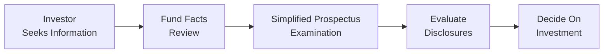

## 15.6 Leveraging Fund Fact Documents and Prospectuses

Sometimes, navigating mutual fund documents can feel like looking at a rocket science manual—tons of technical data, disclaimers, and big, fancy words. But hang on, it's actually not that scary once we break it down into clear, digestible steps. So, let's walk through the essential documents: Fund Facts, Simplified Prospectus, and the longer-form Prospectus. Each of these is designed to give you, as a mutual fund sales representative (or as an investor), a powerful toolkit for understanding a fund’s strategy, fees, risks, and other super-important details.

Fund Facts and prospectuses are fundamental for meeting your regulatory obligations under the Canadian framework. In Canada, these documents are standardized under rules such as CSA’s National Instrument 81-101, with oversight from the Canadian Investment Regulatory Organization (CIRO). If you’re looking to provide your clients with the relevant details or you’re personally investing, these documents are definitely your go-to. Let’s see how to make them really work for you.

### Why These Documents Matter
When you’re helping clients select a mutual fund or evaluating one for your own portfolio, you need quick, accurate information about fees, risk, and historical returns—without rummaging through hundreds of pages. The Fund Facts document is your streamlined solution. Meanwhile, the Simplified Prospectus offers deeper insights (though still less exhaustive than the long-form prospectus). And if you really want to geek out, you can also explore the long-form prospectus, though it's often used primarily for full-scale regulatory filings.

More than just compliance paperwork, these documents let you connect the dots between a fund’s investment objectives and your client’s (or your own) risk tolerance, time horizon, and return expectations. Trust me, it can be pretty satisfying to realize that something that looks so complicated can actually bolster your confidence and decision-making process.

### Fund Facts: Key Takeaways
Fund Facts documents are short—usually no more than a couple of pages—and are required by Canadian securities regulators to be delivered to investors at the point of sale or before purchase. They highlight:

• Investment Objectives: A plain-language summary of what the fund is trying to achieve.  
• Risk Rating: A standardized Low-to-High scale that indicates the level of volatility or potential loss you can expect under normal market conditions.  
• Fees and Expenses: A breakdown of management fees, operating expenses, and any sales charges or loads.  
• Past Performance: Historical returns often displayed in a bar chart, showing how the fund performed year by year.  
• Quick Disclaimers: Statements urging investors that past performance is not a guarantee of future returns, among other cautionary notes.  

Um, and let’s not forget one of the biggest benefits here: the Fund Facts document is user-friendly and legally mandated to be straightforward. So, always read it carefully to confirm that a fund meets your (or your client’s) overall investment strategy and risk tolerance.

### Simplified Prospectus: Going Deeper
Picture the Simplified Prospectus as a “Fund Facts Plus.” It’s still designed to be fairly easy to read, but it offers:

• Additional Risk Disclosures: Digging deeper into any derivatives usage, currency exposure, or specialized market segments the fund might invest in.  
• Detailed Investment Strategy: Specifying whether the fund invests in Canadian equity, foreign bonds, or alternative strategies.  
• Managerial and Organizational Info: Names of the portfolio manager(s), the fund’s track record, and corporate structure.  
• Fee Details and Operating Costs: More granular breakdown of the fees and how they are calculated, including performance fees if applicable.  

Even though the Simplified Prospectus isn’t as short as Fund Facts, it’s still more user-friendly than the full prospectus, which can be loaded with legalese and data tables that go on forever.

### Long-Form Prospectus: The Ultimate Deep Dive
The long-form prospectus is the most comprehensive disclosure document required under the regulations. Honestly, many investors never read it cover-to-cover because it’s often quite technical. But it’s there for those who want maximum information: nuances about the fund’s trust structure, extended historical data, complex risk considerations, and so on.

Per CSA’s National Instrument 81-101, this document is filed on the SEDAR+ platform. If you ever find yourself (or your curious client) in a position where you want to see absolutely everything from litigation history to full financial statements, the long-form prospectus is the place to go.

### How to Use These Documents Effectively
Let’s talk about how these documents come to life in practice. Suppose you’re evaluating a Balanced Fund that invests in both fixed-income and equity assets. Here’s a quick run-through:

• Start with Fund Facts: Check the fund’s stated objective (e.g., “Long-term capital appreciation with some income”), its risk rating (Medium, for instance), and the most recent annual returns. Also, pay close attention to the fees, because even minor differences can impact long-term performance.  
• Move on to the Simplified Prospectus: Explore the manager’s investment philosophy. Does the fund invest using a “top-down” macro approach or a “bottom-up” style focusing on company fundamentals? Also, read about potential conflicts of interest—like if the fund invests in companies affiliated with the management team.  
• Consult the Long-Form Prospectus if needed: If you or your client is particularly concerned about legal or structural aspects, or if it’s a specialized or complex fund with derivatives, real estate holdings, or short-selling strategies, you might want to dive deeper into the long-form prospectus.  

### Evaluating Disclaimers and Risk Levels
When you flip through these documents, disclaimers often appear in bold or italicized text, clarifying that returns are not guaranteed, and that the fund value might fluctuate. These disclaimers matter because:

• They provide a reality check about what the fund can and cannot guarantee—particularly for short-term or speculative investments.  
• They reveal if a fund frequently reorganizes its structure or merges with other funds. That might signify instability or changes in strategy.  
• They highlight if there have been manager changes (e.g., a shift from a star manager to a less experienced team) or if the fund has changed its investment objectives.  

Whenever you see disclaimers about “Frequent changes to investment philosophy” or “Management reorganization,” do a little digging. It might mean the fund is in flux, and that can increase its risk—even beyond the official “medium risk” rating.

### Potential Conflicts of Interest
Another reason to check disclaimers is to spot potential conflicts of interest. Maybe the fund invests heavily in related companies or has a performance bonus structure that might incentivize riskier bets. The prospectus might mention these relationships. If you see something fishy—like the portfolio manager receiving big commissions for trades with a particular broker—recommend that your client find out more before investing.

### Practical Example: The Maple Leaf Balanced Fund
Let’s say you’re considering the Maple Leaf Balanced Fund for a client who’s looking for moderate growth and some income. Here’s how you’d use your docs:

1. Fund Facts:  
   - Risk Rating: Medium.  
   - Past Performance: Up 8% last year, with a 10-year average of 6%.  
   - Fees: Management expense ratio (MER) around 2.2%.  
   - Quick Disclaimer: Not a guarantee of future results, and the fund invests in both Canadian and global equities.

2. Simplified Prospectus:  
   - Detailed Strategy: 60% equities, 40% bonds, with a focus on Canadian markets.  
   - Manager Info: Fund is led by a manager known for conservative equity picks.  
   - Conflict Disclosure: Some exposure to affiliate bond offerings under the same corporate group.  
   - Potential Risk Factors: Currency fluctuations on the global equity portion.

3. Long-Form Prospectus:  
   - Structural Details: Organized as a trust, with monthly distributions.  
   - Additional Disclaimers: Mentions possible short selling to hedge currency risk.  
   - Historical Reorganizations: Merged with another balanced fund five years ago to streamline operations.

Thanks to these documents, you immediately know if the Maple Leaf Balanced Fund aligns with your client’s moderate risk tolerance and if the manager’s style and track record are solid.

### Mermaid Diagram: Document Usage Flow

Below is a simple diagram to illustrate how these documents funnel the decision-making process:

1. The investor or representative needs information.  
2. They start by reviewing the Fund Facts for a snapshot.  
3. They proceed to the Simplified Prospectus for deeper analysis.  
4. They evaluate the disclaimers and potential conflicts.  
5. Finally, they decide if the fund is a proper fit.

### Common Pitfalls and How to Avoid Them
• Skipping the Fund Facts: Never assume you know everything about a fund’s risk and historical returns without scanning the Fund Facts.  
• Overlooking Fee Details: Some funds carry a higher MER, which can erode net returns over time. Always confirm fee structures.  
• Ignoring Fund Manager Changes: A shift in manager can significantly alter performance. Check disclaimers for any red flags.  
• Dismissing the Fine Print: Watch for disclaimers about short-term trading fees, redemption privileges, or lock-up periods.

### Best Practices
To keep yourself and your clients well-informed—and to remain aligned with CIRO guidelines:

• Make Sure to Deliver Fund Facts at the Point of Sale: This is a regulatory requirement in Canada for most mutual funds.  
• Encourage Questions: If anything in the Fund Facts or prospectus documents seems unclear, encourage clients to ask questions.  
• Compare Risk Levels: Don’t just rely on the fund’s self-assessed risk rating—compare it to other funds with similar objectives.  
• Stay Current: Prospectuses and Fund Facts are updated regularly, so be sure you have the latest version. Consult the SEDAR+ platform for the most recent filings.  

### CIRO and Canadian Regulatory Oversight
The Canadian Investment Regulatory Organization (CIRO)—formed in 2023 by amalgamating the MFDA and IIROC—sets the rules on how these documents must be distributed and what they should include. The reason you’re reading Fund Facts at the point of sale is largely because of CIRO’s guidelines to protect investors and ensure fair disclosure. If you need official updates or educational resources, check out the CIRO website at https://www.ciro.ca.

### Additional Resources
• CSA’s National Instrument 81-101 – Mutual Fund Prospectus Disclosure, setting out the rules for how these documents must be prepared and presented.  
• The SEDAR+ platform for public filings, including historical Fund Facts and prospectuses for countless Canadian-based funds.  
• Investopedia’s article “How to Read a Fund Fact Sheet” provides an at-a-glance guide.  
• For ongoing training, CIRO often publishes notices and guidelines about new disclosure requirements and best practices.

### Personal Anecdote
I remember when I first got my hands on a Simplified Prospectus. I was helping a family friend select a mutual fund. I had no idea how many disclaimers and footnotes there could be—talk about feeling a bit overwhelmed! But as I read it carefully, I realized how valuable it was to see the manager’s philosophy, fee structures, and performance track record all in one place. It was like being handed a roadmap: nothing is guaranteed, but at least you know where the fund has been and roughly where it’s trying to go.

### Conclusion
Fund Facts, the Simplified Prospectus, and the long-form prospectus each bring a unique layer of clarity to the task of choosing the right mutual fund. While Fund Facts give you a quick snapshot, the Simplified Prospectus allows deeper understanding, and the long-form prospectus can be a total deep dive. Together, they form a well-orchestrated system of regulatory documents designed to protect investors, enhance transparency, and guide mutual fund representatives in making suitable recommendations.

When used properly, these documents aren’t just boxes to check. They’re pivotal tools that help you gain a comprehensive picture of a fund’s goals, strategies, fees, risks, and performance. Integrate them into your daily advisory or personal investment process, stay updated with the latest regulatory guidelines, and you’ll be well on your way to confidently discussing or selecting mutual funds that truly align with an investor’s profile.

Remember, thoroughness and clarity are everything in this industry. If you keep referencing these documents, encourage your clients to read them, and explain them in plain language, you’ll foster trust and help ensure your clients make informed choices.

---

## Quiz: Mastering Fund Fact Documents and Prospectuses



### Which of the following is a key feature of Canadian Fund Facts documents?

- [x] They provide an easy-to-read summary of the fund’s fees, risk rating, and past performance.
- [ ] They replace the Simplified Prospectus entirely.
- [ ] They are only given to institutional investors.
- [ ] They focus on bond funds only.

> **Explanation:** Fund Facts are concise, consumer-friendly disclosures that summarize fees, risk, and historical returns. They must be given to retail investors at or before the time of purchase.

### What additional information can you find in a Simplified Prospectus that is not typically included in Fund Facts?

- [x] Detailed information on the fund’s investment strategies and potential conflicts of interest.
- [ ] The manager’s personal phone number.
- [ ] A guarantee of performance.
- [ ] A list of all the fund’s daily trades.

> **Explanation:** The Simplified Prospectus expands on Fund Facts by including more detailed intel on fund strategies, risk types, and management teams, but it does not guarantee performance nor provide the manager’s personal contact info.

### Why might a Frequent Merger or Reorganization noted in a prospectus raise a red flag?

- [x] It may indicate instability in the fund’s strategy or performance.
- [ ] It always ensures better returns going forward.
- [ ] It means the fund is closed to new investors.
- [ ] It suggests fewer regulatory requirements.

> **Explanation:** Frequent reorganizations or mergers might signal repeated attempts to correct underperformance or strategy issues, hinting that the fund could be under internal stress or changing direction too often.

### How do disclaimers in Fund Facts help investors make better decisions?

- [x] They clarify the absence of guarantees and highlight potential risks.
- [ ] They remove the need to read secondary documents.
- [ ] They legally promise a minimum return.
- [ ] They suggest that risk is irrelevant for long-term investors.

> **Explanation:** Disclaimers underscore that, for instance, past performance isn’t a guarantee of future results, encouraging investors to consider risks realistically instead of relying on assumptions.

### Which document is the most detailed and technical in describing a mutual fund’s structure?

- [x] The long-form prospectus
- [ ] The Fund Facts document
- [x] The Simplified Prospectus
- [ ] The monthly transaction report

> **Explanation:** While the Simplified Prospectus offers more information than Fund Facts, the long-form prospectus is the most comprehensive document. However, many investors rarely read it in its entirety.

### What is one best practice when advising a client using these documents?

- [x] Provide the Fund Facts at or before the point of sale and encourage questions.
- [ ] Always skip the prospectus to save time.
- [ ] Assume the risk rating is guaranteed to stay the same.
- [ ] Base your advice solely on a television commercial.

> **Explanation:** In Canada, providing the Fund Facts at or before the point of sale is a regulatory requirement, ensuring the client has basic information on fees, performance, and risk.

### Which regulatory authority in Canada oversees mutual fund disclosures now?

- [x] CIRO
- [ ] IIROC (still active)
- [x] MFDA (still active)
- [ ] NRD

> **Explanation:** Effective January 1, 2023, the Mutual Fund Dealers Association (MFDA) and the Investment Industry Regulatory Organization of Canada (IIROC) merged into the Canadian Investment Regulatory Organization (CIRO). IIROC and MFDA are now defunct, with CIRO as the current national self-regulatory body.

### What might an advisor learn from reading the manager’s biography in the Simplified Prospectus?

- [x] Their investment experience and management philosophy.
- [ ] Their personal net worth and private bank account details.
- [ ] The guaranteed returns they established in prior funds.
- [ ] The full list of any daily trades they executed.

> **Explanation:** The Simplified Prospectus can provide context on the portfolio manager’s track record, educational background, and general investment approach, useful for evaluating manager reliability and style.

### Why is the Simplified Prospectus more detailed than Fund Facts but still shorter than a long-form prospectus?

- [x] Fund Facts offer a basic summary, whereas the Simplified Prospectus expands on strategies, risks, and management, but omits the in-depth legal and structural details of the long-form prospectus.
- [ ] The Simplified Prospectus is just another name for a marketing brochure.
- [ ] It only exists to fulfill a minor CIRO requirement.
- [ ] It is never adjusted or updated.

> **Explanation:** The Simplified Prospectus is intended to offer greater detail than Fund Facts but remain more accessible than the exceedingly technical long-form prospectus.

### True or False: The disclaimers in mutual fund documents guarantee a minimum rate of return.

- [x] True
- [ ] False

> **Explanation:** This statement is false. Disclaimers explicitly warn that performance can vary and losses can occur; no guaranteed minimum rate of return exists.


