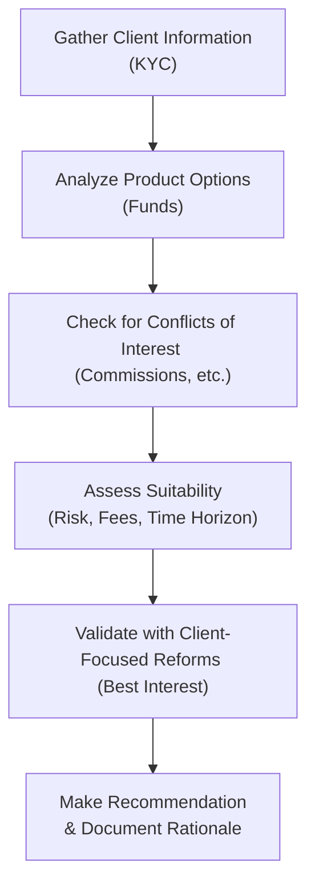

## 15.7 Ethical Considerations in Fund Selection

So, if you’ve ever found yourself wondering, “How do I make sure I’m truly acting in my client’s best interests?”—you’re in the right place. In this section, we’re going to explore the ethical obligations and regulations that guide mutual fund representatives (or “advisors”) in Canada, especially when selecting a mutual fund for clients.

You know, I once had a manager tell me, “You might be the only financial professional your client ever meets... so don’t break that trust.” And since then, I’ve tried to keep that statement in mind whenever I help someone choose a fund. It can be so easy to get swept up in product promotions or commissions, but at the end of the day, it’s the client’s future we’re dealing with.  

We’ll talk about how to navigate that responsibility by breaking down your duty of care and suitability obligations, how to avoid slipping into sales practice violations, the new(ish) client-focused reforms (CFRs), and the importance of privacy. We’ll also sprinkle in some case studies, because, well, it’s easy to talk theory but examples make it more real. Let’s jump in.

--------------------------------------------------------------------------------

### Duty of Care and Suitability

#### Overview of Duty of Care
In Canada, you’re legally bound to act with a duty of care—that is, you’re expected to behave prudently, honestly, and in the best interests of your client. That’s not just a friendly suggestion; it’s a professional standard, as well as a legal one. The concept of duty of care tells us that:

• You need to fully understand the products and services you offer.  
• You must know your client’s personal financial situation, context, risk tolerance, and objectives—this is often just called “KYC,” or Know Your Client.  
• You’re required to bring both these understandings together (your knowledge of the funds and your knowledge of the client) to recommend something that fits like a glove.

Now, if you’re reading references from older materials, you might see mention of the Mutual Fund Dealers Association (MFDA) and the Investment Industry Regulatory Organization of Canada (IIROC). As of January 1, 2023, these two self-regulatory organizations amalgamated to form the Canadian Investment Regulatory Organization, or CIRO. (But maybe you already heard that 50 times by now, right?) Today, CIRO is in charge of overseeing both mutual fund dealers and investment dealers.

It gets better: because of new client-focused reforms, that duty of care extends beyond just making “suitable” recommendations. You must think carefully about costs, conflicts of interest, and the ease of product features, among other items. In practical terms, you can’t just pitch a “Best Seller” fund that’s not really great for your client’s needs.

#### Suitability Considerations
When it comes to selecting a fund, suitability is key. You want to go beyond, “Does the client want an equity fund or a bond fund?” Instead, you ask:

• What’s their investing timeline?  
• How comfortable are they with potential losses or fluctuations?  
• Do they expect any major life events or expenses soon (such as retirement, buying a house, or sending a child to university)?  
• How do fees and expenses affect them?  

These questions help ensure you land on something truly aligned with your client’s profile. Inconsistent recommendations or only focusing on the “flavour of the month” fund can endanger your relationship with the client—and your registration, for that matter.

One approach that’s often used is the classic “Life-Cycle Hypothesis” (see Section 4.4) or risk profiling that tries to systematically gauge how defensive or aggressive a fund might be. But no matter which framework you use, the end goal is to confirm that each recommendation truly, sincerely, meets the client’s objectives.

--------------------------------------------------------------------------------

### Avoiding Sales Practice Violations

#### Common Pitfalls
Being a mutual fund representative can be tricky—there are all sorts of incentives and promotions that might tempt you. Maybe you’ve heard your colleague say, “Oh, they’re offering a sweet trip if you reach a certain sales target.” Or maybe you noticed a higher trailing commission if you sell a certain brand of funds. The main thing to remember is that you have to disclose any conflict of interest and avoid letting it cloud your judgment. After all, you want to recommend something because it’s right for X, Y, or Z client, not because you earn a higher commission.

Churning is another big no-no: that’s when you recommend trading (or switching between funds) too frequently to generate commissions or “trade fees.” And it’s quite possible to do this inadvertently, especially if you’re not paying attention to your client’s best interests or you try to time short-term movements in markets. But it’s not allowed. CIRO seriously monitors excessive mutual fund switching or transactions that appear to generate unnecessary fees without real benefits to the investor.

#### Staying on the Right Side of Regulation
What can you do to stay compliant? First, make sure you review your compliance team’s guidance or your firm’s policies and procedures. Usually, your firm will have specific standards about how often you can recommend switching from one fund to another and about documenting your rationale for each recommendation.

In addition:

• Double-check any promotions or referral offers. If you think they might compromise your impartiality, do not engage—that’s how you keep your name squeaky clean.
• Keep your records updated. If a regulator or your branch manager decides to do an audit, they’ll want to see the paper trail showing how you determined your recommendation was suitable.
• Provide the required disclosure. If there’s any arrangement that might be perceived as a conflict, mention it to the client in an understandable format. They need to know you’re objective—or at least have the chance to weigh the conflict for themselves.

--------------------------------------------------------------------------------

### Client-Focused Reforms (CFRs)

#### How CFRs Elevate the Standard
Client-Focused Reforms are something of a buzzword right now in Canadian securities regulation. If you’re not yet super familiar, these reforms basically mean that we’ve moved beyond a simple “Is it suitable?” test to a more robust “Is it in the client’s best interest?” test. And that touches on everything: disclosures, costs, conflicts, ongoing monitoring, and more.

Let’s illustrate with a hypothetical scenario: Suppose your client, Lisa, wants to invest in an equity mutual fund. Historically, you might have checked her risk tolerance, said, “Yes, moderate to high risk. Great, we can do an equity fund.” With CFRs, you’d be required to look at the costs of that equity fund, the fund manager’s track record, the potential conflicts (say you receive a trailing commission from that manager), and any other relevant factors. Then you have to weigh it alongside other options that might meet her needs. At the end of the process, you might indeed choose the same equity fund, but you’ll do so only after thorough analysis. Plus, you must document that you’ve considered the client’s best interest in the process.

#### The Role of Cost and Fees
One major impetus for CFRs was the problem of hidden or undisclosed fees. Canadian regulations have historically mandated disclosure of trailing commissions, front-end loads, back-end loads, or any other fees. But the new emphasis is not just about stating the fees; it’s also about ensuring that the fees are competitive and justify the value provided. If you have two basically identical funds—Fund A and Fund B—and one has an MER (Management Expense Ratio) that’s clearly lower, you should have a good reason for picking the more expensive one (maybe better management style, more stable returns, specialized sector expertise, etc.).

If you find yourself always recommending the same sponsor’s funds just because they have an attractive commission structure, that’s a red flag. Best to be mindful of that.

--------------------------------------------------------------------------------

### Respecting Confidentiality

#### Personal Info and PIPEDA
Now, let’s switch gears. While you’re collecting your client’s data—age, salary, net worth, maybe even health information that might factor into their investing horizon—do not forget privacy laws like the Personal Information Protection and Electronic Documents Act (PIPEDA).  
PIPEDA (and relevant provincial legislation) basically says:  
1. Collect the minimum personal information necessary for the stated purpose.  
2. Use that personal information only for the reasons you stated.  
3. Secure it properly and only keep it as long as needed.  

In a mutual fund transaction scenario, you might gather a fair amount of personal info, including tax identifications, investment statements, and so on. Ensuring all of that data is locked down, or encrypted, is essential. This is both an ethical and legal demand—nobody wants their personal details floating around.

#### Best Practices for Privacy  
• Always get your client’s consent for how you plan to use their information. This might be included in a new account form or separate disclosures.  
• Keep digital security measures up-to-date, like password protection, encryption, or two-factor authentication on your software platforms.  
• Avoid unauthorized sharing. If a third party is requesting information, get your client’s explicit consent first, unless you’re legally required to do otherwise.  
• If you notice a data breach or you suspect personal data might have been compromised, you must typically inform your firm’s compliance department as soon as possible, and follow legal notification procedures (depending on your jurisdiction).

Alright, that’s the serious privacy stuff. But it’s also just part of being a good human, you know?

--------------------------------------------------------------------------------

### Visualization: The Ethical Decision Path

Let’s throw in a quick diagram to show how the process of ethical decision-making might look when selecting a fund. This is a simple flowchart to illustrate the best approach:

From top to bottom, you see that we start by gathering relevant details about the client (A). Then we analyze the possible funds or product solutions (B), checking for conflicts of interest (C). Next, we assess suitability (D), ensure the recommendation aligns with client-focused reforms (E), and finally present our well-documented recommendation (F). It might look simple, but in practice, each step can be quite detailed.

--------------------------------------------------------------------------------

### Case Study: Potential Conflict of Interest

Let’s talk through a short scenario. Suppose you’re meeting with a new client, Ramona. She’s 55, wants to retire in 10 years, and is looking for a balanced growth strategy. Your proprietary firm, “XYZ Financial,” has launched a brand-new balanced mutual fund with a slightly higher MER but is offering extra marketing incentives for reps who sell it. Meanwhile, there’s an existing balanced fund on the market that’s somewhat cheaper and has a longer track record.

You might be tempted to sell that brand-new fund to meet your internal sales targets. But ethically (and to comply with regulations!), you should consider all relevant details. Perhaps the new fund does indeed have interesting sector diversification or an excellent portfolio manager. Even so, you need to weigh all the pros and cons, disclose your firm’s promotional arrangement, and show how this new product is in Ramona’s best interest. If it’s not truly on par or better for her needs, you should recommend a more appropriate fund, with full transparency.

Remember, the slightest appearance of impropriety can tarnish your reputation and undermine client trust. Document your decision-making process, show how you considered each product’s fees, risks, and performance, and keep Ramona in the loop at all times. That’s the gold standard for ethical practice.

--------------------------------------------------------------------------------

### Holding Yourself Accountable

#### Ongoing Education
Ethical standards aren’t static. Regulations evolve, new compliance bulletins come out from CIRO, and each province might add its own spin. One of the ways to keep up is by taking continuing education (CE) courses. For instance, the Canadian Securities Institute (CSI) offers modules like “Ethical and Professional Standards,” or you can browse updates from the Canadian Securities Administrators (CSA) or the CIRO website (https://www.ciro.ca).

#### Conduct Reviews and Self-Assessments
Not sure if your practice is up to standard? Many dealers have internal “Conduct Reviews” or “Ethics Checklists.” You can go line by line—for example, verifying you have no unaddressed conflicts, your client data is secure, your recommendations are documented, and so forth. Think of it as a personal or departmental audit that helps you spot potential weaknesses before a regulator or external auditor does.

--------------------------------------------------------------------------------

### Additional Resources

• **CIRO**  
  Canada’s current (2025) self-regulatory organization for investment dealers and mutual fund dealers. Check their website for standards, bulletins, and educational materials on ethical issues in fund selection.  
  → https://www.ciro.ca  

• **CSA Regulatory Notices**  
  The Canadian Securities Administrators often publish notices explaining how to implement new regulations, including Client-Focused Reforms. Reading these can offer a deeper insight into regulators’ expectations.  
  → https://www.securities-administrators.ca/  

• **Industry Publications**  
  The Investment Executive website frequently publishes articles on recent enforcement cases, best practices, or compliance tips, which can help you see real-life examples of ethical pitfalls.  
  → https://www.investmentexecutive.com  

• **Continuing Education**  
  CSI offers an array of online courses and designations. In particular, look for advanced CE modules focusing on ethics in financial services.  

• **Open-Source Financial Tools**  
  While not specifically about ethics, exploring open-source analytics platforms (like certain spreadsheet calculators or data visualization tools) can help you produce more transparent fund comparisons. Being transparent with data is part of ethical practice, right?  

--------------------------------------------------------------------------------

### Tools and Techniques for Ethical Decision-Making

Almost every day, as a rep, you make multiple micro-decisions that carry ethical weight. So how do you stay on track? Here are some approaches:

• **Structured Reflection:** Ask yourself, “Would I recommend this product to my grandmother?” or “Does this represent a conflict of interest I’d be uncomfortable disclosing?”  
• **Peer Consultation:** Sometimes, just discussing a tricky client situation with a colleague or supervisor can reveal a conflict you didn’t notice.  
• **Ethical Decision Trees or Checklists:** If your firm has a standard set of questions to run through, use them. They might seem formal, but they can save you from unintentional missteps.  
• **Continuous Reminders:** Keep a short “ethics cheat sheet” in your office. Listing the top five or six compliance obligations can act as a mental speed bump.

--------------------------------------------------------------------------------

### Practical Example: “Do the Math” on Fees

Let’s say you’re weighing two balanced funds for a client. Fund X has an MER of 1.80%, while Fund Y has an MER of 2.30%. Both have about the same track record and do similar things in the market. But Fund Y offers you a better trailing commission. Even though the difference in expense ratios (0.50%) might sound small, over 10 or 15 years, that difference can materially erode returns for a buy-and-hold investor.

Maybe you wonder, “Ah, is 0.50% that big of a deal?” Actually, yes! For a $100,000 investment, if we assume an average annual growth of 5% (before fees) over 10 years:

• The net growth with a 1.80% MER might be around (5% – 1.80% = 3.20%) on average.  
• The net growth with a 2.30% MER might be around (5% – 2.30% = 2.70%) on average.

We can do a quick compound interest check. With a net of 3.20%, $100,000 might grow to roughly $137,696 after 10 years. With 2.70%, it might come to around $130,236. That’s a difference of over $7,000—so it’s not small change.  

(Now, yes, this is a simplified illustration; real market conditions, taxes, and fees can vary. But it gives you a sense of the potential impact.)

When you weigh these differences, consider your client’s best interest. If you don’t have a compelling reason to choose the higher-fee option, you might want to think twice.  

--------------------------------------------------------------------------------

### Common Questions or Concerns

**Q: What if a client demands a product that’s obviously unsuitable?**  
A: Explicitly document that you’ve warned the client about the risks. You still have a suitability obligation, so if you think it’s truly harmful, you can reject the instruction. Or at least, disclaim and document carefully.

**Q: Can I switch a client from one mutual fund to another if there’s a slightly lower MER but with the same manager?**  
A: Possibly—if it’s in the client’s interest. But do a thorough review, factoring in any redemption fees or tax implications. And watch out for frequent switching patterns that might appear like churning.

**Q: How do I handle a conflict of interest if I’m related to the fund manager?**  
A: First, disclose it to your firm, and be sure to inform your client of the relationship. In some cases, your firm might require a second set of eyes or explicit disclaimers to ensure objectivity.

--------------------------------------------------------------------------------

### Best Practices Recap

Let’s highlight a few best practices at a glance:

1. **Always Perform KYC Thoroughly:** The more you know about your client, the better your recommendations can be.  
2. **Disclose Conflicts Promptly and Clearly:** If you earn a trailing commission or have a personal stake in the fund, be upfront.  
3. **Document Everything:** If it’s not documented, it’s as if it never happened. This protects both you and the client.  
4. **Stay Current with Regulations:** CIRO updates, client-focused reforms, and privacy laws aren’t optional. They evolve, so keep an ear out.  
5. **Keep the Big Picture in Mind:** This is about the client’s financial journey. Emphasize long-term value over short-term gains.  

--------------------------------------------------------------------------------

### Concluding Thoughts

Ethics in fund selection isn’t about ticking boxes or memorizing a script. It’s about truly putting the client’s needs first—while balancing regulatory demands and your professional responsibilities. These regulations, from duty of care to CFRs, serve as a safety net that keeps the industry honest. And, quite frankly, doing the right thing is also good for business in the long run. Clients appreciate transparency and trustworthiness, and that fosters loyalty.

If you ever catch yourself in a gray area, pause. That’s your cue to consult your compliance department, talk to a colleague, or review official guidelines. Maybe you’ll think back to that manager’s advice: You could be the only financial professional your client ever meets—so do well by them.

Now that we’ve walked through all these essential considerations—from analyzing your duty of care and suitability to navigating privacy laws—you’re better equipped to make ethically sound fund recommendations. It’s a process that will continue to evolve, but an open mind, a commitment to transparency, and a willingness to keep learning are the keys to success.  

--------------------------------------------------------------------------------

## Quiz: Ethical Fund Selection Best Practices



### What does “duty of care” require a mutual fund representative to do?

- [x] Always act in the best interests of the client.
- [ ] Always recommend the fund with the highest return.
- [ ] Recommend only funds with the largest management companies.
- [ ] Focus only on minimizing transaction fees.

> **Explanation:** Duty of care means the representative must act prudently, honestly, and in the best interest of the client, considering their objectives, risk tolerance, and overall situation.

### Which of the following scenarios best describes “churning”?

- [ ] Placing a client’s funds in fixed deposits for capital preservation.
- [x] Recommending frequent fund switches mainly to earn commissions.
- [ ] Selecting different funds for clients with different risk profiles.
- [ ] Working with another representative to find new clients.

> **Explanation:** Churning refers to recommending trades or switches simply to generate commissions rather than to benefit the client.

### Under Canada’s Client-Focused Reforms (CFRs), how should fees be handled?

- [ ] Disclosing fees is optional as long as the product is suitable.
- [x] Disclosing all fees and ensuring they are justified by the value provided.
- [ ] Only trailing commissions need to be disclosed.
- [ ] Representatives can recommend the most expensive product without explanation.

> **Explanation:** CFRs emphasize that advisors must disclose fees clearly and ensure the recommended product’s cost is justifiable and in the client’s best interest.

### When collecting personal information for fund selection, what is the primary obligation under PIPEDA?

- [x] Collect only the necessary information for the stated purpose and protect it.
- [ ] Collect as much data as possible for “just in case” scenarios.
- [ ] Share all information with third-party marketers.
- [ ] Post client information publicly for transparency.

> **Explanation:** PIPEDA requires limited collection, secure storage, and disclosure only as permitted or required by law, always respecting the client’s consent.

### Which of the following actions can help prevent conflicts of interest?

- [x] Disclosing commissions and incentives to clients.
- [ ] Switching a client’s portfolio every month.
- [x] Consulting a supervisor when unsure about an external promotional offer.
- [ ] Upholding only the dealer’s interests.

> **Explanation:** Transparency about incentives and consulting with compliance or a supervisor helps ensure the client’s best interests are maintained.

### Which regulatory body oversees mutual fund dealers and investment dealers in Canada as of 2025?

- [x] CIRO (Canadian Investment Regulatory Organization)
- [ ] MFDA (Mutual Fund Dealers Association)
- [ ] IIROC (Investment Industry Regulatory Organization of Canada)
- [ ] CIPF (Canadian Investor Protection Fund)

> **Explanation:** In 2023, the MFDA and IIROC amalgamated into CIRO, which now oversees both mutual fund and investment dealers in Canada.

### Which best practice helps avoid claims of excessive switching?

- [x] Keeping clear documentation of the reasons for each switch.
- [ ] Only recommending short-term trading strategies to all clients.
- [x] Reviewing funds’ performance daily and repeating trades frequently.
- [ ] Ignoring market fluctuations.

> **Explanation:** Documenting the rationale and ensuring that switching is in the best interest of the client are vital steps to demonstrate ethical conduct.

### What is a key point regarding “Client-Focused Reforms” in fund selection?

- [x] Representatives must consider costs, conflicts of interest, and suitability thoroughly.
- [ ] Representatives only need to consider risk tolerance.
- [ ] Representatives may hide trailing commissions if the return is higher than average.
- [ ] Representatives cannot recommend mutual funds anymore.

> **Explanation:** CFRs broaden the requirement to ensure products align with the client’s best interest, factoring in cost, conflicts, and other essential elements.

### How should you handle a family relationship with a fund manager when recommending that manager’s fund to a client?

- [x] Disclose the relationship to the client and the firm’s compliance department.
- [ ] Recommend the fund without mentioning the relationship.
- [ ] Avoid recommending the fund for any client.
- [ ] Encourage your colleagues to recommend only that fund.

> **Explanation:** A family relationship with a fund manager is a potential conflict of interest. Full disclosure is necessary, and further steps might be required depending on firm policy and the client’s interest.

### Under the ethical guidelines for mutual fund representatives, is it ever acceptable to recommend a product solely based on maximizing personal commission?

- [x] True
- [ ] False

> **Explanation:** It is never acceptable. Representatives have a duty of care to act in the best interests of the client and avoid conflicts of interest that compromise that duty.


