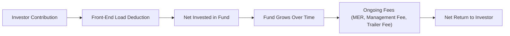
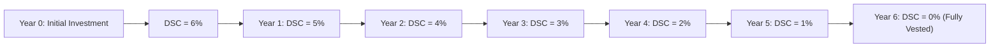

## 16.1 Fees and Charges of Mutual Funds

Imagine your friend Dave wants to invest in a mutual fund. He’s super excited—he’s heard mutual funds can help him achieve his long-term financial goals. But the first thing he notices is a blizzard of terms: front-end loads, deferred sales charges, management fees… and he’s like, “Wait, what does all this even mean?” If you’ve ever felt that same confusion, you’re definitely not alone. Fees can be daunting, but understanding them is crucial to making the most out of your investment.  

In this section, we’re going to dig deep into the key fees and charges associated with mutual funds. We’ll also explore where these fees come from (and why), highlight ways to minimize them, and provide real-world examples. You’ll see references to industry regulations (like National Instrument 81-101 and 81-102 under the Canadian Securities Administrators) that govern mutual funds, as well as how the Canadian Investment Regulatory Organization (CIRO) oversees dealer practices. By the end, you’ll be able to spot potential pitfalls, help your clients (or yourself) better assess costs, and feel way more confident about those acronyms and percentages that pop up on fund documents.

Before we get going, you may want to recall some of the previous content in this book:  
• Chapter 7 lays out different types of investment products.  
• Chapter 10 highlights how mutual funds are structured and regulated in Canada.  
• Chapter 17 dives deeper into mutual fund dealer regulation.  

All right, let’s jump in!

---

### The Importance of Understanding Fees

Remember how we said Dave was excited to invest? The truth is that fees and charges can directly influence the net returns an investor sees. A fund might produce 7% in gross returns, but if your total fees and expenses are around 2.5%, you’re only taking home 4.5%. Over time, that difference can knock a big dent in your portfolio’s growth potential.

Fees are how mutual funds—and the professionals behind them—cover costs such as:  
• Portfolio management (researching and selecting securities)  
• Day-to-day administration (legal, auditing, recordkeeping)  
• Distribution and marketing costs  
• Compensation for dealers and representatives who provide advice  

If you’re working with clients, it’s important to be transparent about fees and discuss them openly. Clients who understand how fees work are more likely to stay fully invested and reach their goals. Plus, it builds trust. And trust is everything in this business, right?

---

### Common Fees and Charges: A Comprehensive Overview

Below are some of the primary fees and charges you’ll encounter when dealing with mutual funds in Canada. Each type has its own quirks, benefits, and drawbacks.

#### Front-End Load (Initial Sales Charge)
• The front-end load is a commission paid by the investor at purchase.  
• It’s usually expressed as a percentage of the amount invested (say, 1%–5%).  
• If you invest \$10,000 and the front-end load is 2%, you pay \$200 right away, leaving \$9,800 actually invested in the fund.  

Some classes of funds might waive the front-end load, or you could negotiate a lower charge with the dealer. A front-end load can be advantageous if you plan to hold the fund for a long time because you won’t face a redemption fee later. However, for new investors, it might be off-putting to see a chunk of their money skimmed off the top.

#### Deferred Sales Charge (Back-End Load)
• The deferred sales charge (DSC) is paid upon redemption (i.e., when you sell your fund units).  
• Typically, this charge decreases each year you hold the fund. In the first year, it may be around 6%, declining to 0% after six or seven years.  
• The idea is to encourage investors to stay longer. But if you leave too soon, be prepared to pay for that early exit.  

When I started investing years ago, I was so excited to make a quick gain that I sold my mutual fund a year in—without realizing it came with a 5% DSC. That took a serious bite out of my returns. Lesson learned: always read the fine print and make sure you’re comfortable with the time horizon.

#### No-Load Funds
• These funds do not charge a front-end or back-end sales fee.  
• Their main advantage is that you can buy into or exit the fund without a commission attached.  
• No-load doesn’t mean free, though; these funds still charge a management fee, and it’s typically folded into the MER (Management Expense Ratio).  

Many folks like no-load funds because it feels simpler and more transparent. But again, the real cost might show up in the form of a higher management fee or other expenses.

#### Management Fee
• An ongoing fee paid to the fund manager for professional portfolio management.  
• Typically ranges from 0.5% to 2.5% or more, depending on the complexity of the mandate.  
• Actively managed equity funds might command a higher fee than, say, a passive bond index fund.  

Fund managers research companies, analyze market trends, and make adjustments to the portfolio. A portion of that management fee may also go toward administration or overhead. If you believe that a manager’s expertise justifies the cost, great—just remember that high management fees erode returns if the manager underperforms.

#### Management Expense Ratio (MER)
• The MER represents the total of all management fees, operating costs, and any other ongoing expenses. It’s expressed as a percentage of the fund’s average net asset value (NAV).  
• For instance, a fund with a 2.2% MER means for every \$1,000 invested, \$22 per year goes to fees and operating expenses.  
• The MER is deducted before the fund’s returns are reported to you, so you never directly “see” this fee on a bill.  

Your fund’s MER can significantly impact your investment over time. A 1% difference may sound small, but if you’re invested for 20 or 30 years, that 1% difference can mean thousands of dollars of lost compounding. That’s why comparing MERs across similar funds is crucial.

#### Operating Expenses
• These include the day-to-day costs for running the fund: audit fees, legal fees, recordkeeping, compliance, and other administrative tasks.  
• They’re frequently bundled within the MER.  
• In some cases, marketing and distribution costs (like trailer fees) are also included.  

Even though these are routine charges, they can still vary widely among funds. Some smaller specialty funds might have higher operating expenses due to lower economies of scale, while big index funds can often leverage their size to keep expenses relatively low.

#### Trailer Fees (Trailing Commissions)
• Trailer fees are ongoing commissions paid out of the fund’s assets to the dealer or representative for servicing the client’s account.  
• The trailer fee is embedded in the MER.  
• Sometimes these fees can influence the advice given if the representative is operating under a commission-based model.  

It’s one of those “behind the scenes” costs that can shape how advisors recommend certain funds. As an investor or an advisor, be mindful that trailer fees exist and may drive suggestions.

#### Short-Term Redemption Fee
• A fee charged when investors redeem (i.e., sell) their fund units within a short period after purchase—like 30, 60, or 90 days.  
• This is meant to discourage frequent trading or speculation in mutual funds, which generally are designed for longer holding periods.  

If you’re the kind of investor who jumps in and out of funds rapidly, you’ll want to watch out for these short-term redemption fees. They can nullify potential short-term gains.

#### Switching Fees (Transfer Fees)
• Charged when switching from one mutual fund to another within the same fund family.  
• These may be waived under certain circumstances, or with specific share classes.  

Switching fees can be an annoyance if you’re re-balancing a portfolio within the same fund family. It pays to ask: “Do you charge for switches?” Some fund families don’t, creating a more seamless reallocation process.

#### Performance Fees (Less Common in Traditional Mutual Funds)
• An extra fee charged by a fund that outperforms a specified benchmark or hurdle rate.  
• More typical in hedge funds or alternative investment products, but occasionally found in specialized mutual fund structures.  

Performance fees can align a manager’s interests with investor goals—if the fund does well, everyone earns more. However, it can also lead to riskier behavior in some cases. Look to see if there’s a “high-water mark” that prevents double-charging for repeated achievements.

---

### Visualizing the Fee Structure

Below is a simple flowchart depicting how money moves when you invest in a mutual fund and how fees come into play.

• A: You invest your money.  
• B: A potential front-end load is deducted immediately.  
• C: The remaining amount goes into the fund.  
• D: The fund invests in assets (stocks, bonds, etc.) and hopefully grows over time.  
• E: Ongoing fees such as the MER, management fees, and trailer fees are taken periodically.  
• F: You, the investor, receive the net returns after all those fees have been deducted.

---

### Real-World Example: Comparing Two Funds

Let’s say you have two funds you’re choosing from:

• Fund A: Front-end load of 2%, MER of 1.8%.  
• Fund B: No-load, MER of 2.3%.  

If you’re investing \$10,000 in Fund A, you pay \$200 immediately for the front-end load, leaving \$9,800 in the fund. Suppose the fund grows by 6% annually, before fees. After subtracting the MER over time, your investment might yield a net average return of, say, 4.2% annually (just as an example).

Meanwhile, with Fund B, you invest all \$10,000 right away, but the higher MER means the net return might be 3.7% annually (again, hypothetical). If you hold for many years, it’s not always obvious which one ends up better because you’re starting from different amounts and paying different ongoing fees. This is where it becomes super important to do some math, compare the total cost of ownership, and think about your time horizon.

---

### Short-Term Horizon vs. Long-Term Horizon

• Short-Term Investor: Someone who plans to withdraw within a year or two might prefer a no-load or front-end load option, to avoid being locked into a deferred sales charge schedule.  
• Long-Term Investor: If you predict holding for five-plus years, a slightly higher upfront load might make sense if the ongoing MER is relatively low. On the other hand, a DSC structure with an eventual 0% redemption fee might work too, as long as you’re comfortable committing for that length of time.  

Basically, it depends on your goals and the specifics of the situation. Dig into your plan (or your client’s plan) and tailor your decision.  

---

### Ways to Reduce Fee Impact

It’s easy to assume these fees are set in stone, but there are ways to minimize their bite:

• Opt for No-Load or Low-Load Share Classes: If you want flexibility in buying or redeeming, these share classes can help.  
• Compare MERs Within a Category: If you’re picking between large-cap Canadian equity funds, compare MERs among funds with similar objectives. Don’t compare a specialized biotech fund to a broad-based equity index fund—that’s apples to oranges.  
• Negotiate Front-End Loads: Some dealers will reduce the front-end load if you’re investing a larger amount or maintaining a long-term relationship.  
• Consider Fee-Based Accounts: Instead of paying individual commissions, you might pay a flat or percentage-based account fee. This can align advisory interests with client returns.  
• Stay Invested (for DSC Structures): If you end up with a DSC fund, try to hold through the full schedule to avoid an early redemption penalty.  
• Look for Special Promotions: Occasionally, fund families waive switching fees or short-term fees, especially if you’re transitioning within their product suite.  

These small steps can translate into serious long-term savings, especially if you’re investing for retirement or other major goals.

---

### Short-Term Redemption Fees and Frequent Trading

If you’ve ever been tempted to hop in and out of funds to ride market waves, be mindful of short-term redemption fees. Most funds want to discourage frequent trading because it can disrupt the fund’s strategy and cause additional administrative costs. So, if you’re more of a trader, consider exchange-traded funds (ETFs) instead, but remember that ETFs come with brokerage commissions each time you trade.

---

### The Regulatory Framework

Canada’s mutual fund industry is subject to specific regulations designed to protect investors and promote transparency:

• **National Instrument (NI) 81-101 & 81-102**: These set out guidelines on how funds are structured, governed, and how they must disclose fees.  
• **Canadian Investment Regulatory Organization (CIRO)**: Formed from the amalgamation of the former MFDA and IIROC. Responsible for overseeing investment dealers and mutual fund dealers. For updated rules, visit [CIRO’s website](https://www.ciro.ca).  
• **Fund Facts**: A simplified disclosure document that outlines key information, including fees. Required to be delivered to investors before or at the point of sale.  
• **Canadian Securities Administrators (CSA)** Sample Cost and Performance Reports: Offer guidelines on how fees should be reported so investors understand the impact of costs on performance.  
• **CIPF**: The Canadian Investor Protection Fund, which now protects client assets if a member firm becomes insolvent.  

If you want even more background, check out the references at the end of this chapter. Official regulatory documents can look intimidating, but they’re actually a treasure trove of information on fees, dealer obligations, and best practices for advisors.

---

### Sample Timeline for a Deferred Sales Charge (DSC) Schedule

Here’s a simple timeline example that illustrates how DSC fees might decrease over time:

• If you redeem in Year 0 or 1, you’ll face the highest rate.  
• By Year 6, the DSC has likely dropped to 0%.  
• Different funds may have different schedules, but the principle remains the same: the longer you stay, the lower the redemption fee.

---

### Common Pitfalls and Challenges

Even after reading about all these fees, people can fall into a few traps:

• **Ignoring the MER**: Some folks focus only on the sales charge, forgetting the MER can be the bigger long-term cost.  
• **Unplanned Early Redemption**: Investing in a DSC fund without a clear timeline can result in paying that big fee if life circumstances force a sale sooner than expected.  
• **Misunderstanding Trailer Fees**: Trailer fees may create conflicts of interest if advisors are incentivized to promote certain funds.  
• **Not Shopping Around**: Just because a favorite bank or dealer offers a suite of funds doesn’t mean they’re automatically the best fit. Cross-compare features, fees, and performance.  

Keep your eyes peeled for these pitfalls, and always do a full cost-benefit analysis.

---

### Best Practices for Advisors and Investors

• **Full Disclosure**: As a representative, always inform investors of all the fees. Show them how fees compare against potential returns.  
• **Regular Performance Reviews**: Evaluate whether the fee is justified by the fund’s performance and the service provided.  
• **Consider Fee-Based Models**: Some accounts charge a single annual fee based on assets, which can reduce potential conflicts of interest.  
• **Use Online Tools**: Websites like Morningstar Canada or FundLibrary offer side-by-side comparisons of MERs and historical performance.  
• **Leverage Fund Facts**: This document spells out fees in an easy-to-read format. Pair it with the Simplified Prospectus for deeper details.  

---

### Additional Resources and References

• **National Instrument 81-101 & 81-102** (Canadian Securities Administrators) – For the detailed legislation on mutual fund disclosure and operations.  
• **Canadian Investment Regulatory Organization (CIRO)** – [https://www.ciro.ca](https://www.ciro.ca) – Canada’s national self-regulatory body overseeing market and dealer activities.  
• **Fund Facts & Simplified Prospectus** – Key documents that highlight fees, investment objectives, and risks.  
• **CSA Sample Cost and Performance Reports** – Illustrate how fees must be reported to investors.  
• **Books**:  
  - “The Future of Investment Management” by CFA Institute Research Foundation  
  - “Common Sense on Mutual Funds” by John C. Bogle  
• **Online Tools**:  
  - Free investor education modules on the [CIRO](https://www.ciro.ca) and [CSA](https://www.securities-administrators.ca/) websites.  
  - Mutual fund screeners on Morningstar Canada, FundLibrary, and other third-party portals.

---

### Closing Thoughts

Fees can sometimes feel like that hidden monster under the bed—until you realize it’s just a matter of flipping on the light switch to see what’s there. Once you understand them, fees become part of the bigger picture in managing your or your clients’ investments effectively. Whether you’re picking a fund for a retirement portfolio or guiding someone else through their investment journey, being well-versed in fee structures is invaluable.

Remember:  
• Always check the fund’s MER.  
• Understand whether you face a front-end load, DSC, or no-load.  
• Know that trailer fees and ongoing operating expenses live inside the MER.  
• Don’t forget short-term redemption fees if you’re planning to exit early.  
• Make sure the fees you pay align with the value of the service you get.  

And hey, if you’re ever confused, that’s what professionals and regulatory documents are for. Keep asking questions. That’s the best way to grow as an investor and a mutual fund representative.

---

## Quiz: Mutual Fund Fees & Charges Quiz



### Which of the following best describes a Front-End Load?

- [x] A sales commission paid by the investor at the time of purchase.
- [ ] A fee deducted only upon redemption of the mutual fund.
- [ ] A penalty for short-term trading.
- [ ] A fee that decreases over time to encourage longer holds.

> **Explanation:** A front-end load is an amount paid immediately when purchasing mutual fund units, often portrayed as a percentage of the invested amount.

### What is the primary purpose of a Deferred Sales Charge (DSC)?

- [ ] To directly compensate fund managers for their expertise.
- [x] To incentivize investors to hold onto their investments for a longer period.
- [ ] To cover administrative and operating costs within the fund.
- [ ] To allow fee-free switching between funds in the same family.

> **Explanation:** A DSC usually applies when you exit the fund early, decreasing over a set schedule. It’s designed to reward longer holding periods.

### Which of the following are typically included in the Management Expense Ratio (MER)?

- [x] Management fees, operating expenses, and trailer fees.
- [ ] Only commission fees to the dealer or representative.
- [ ] Only performance-based fees.
- [ ] Only administrative costs and brokerage commissions.

> **Explanation:** The MER covers various ongoing expenses, including management fees, operating expenses, and trailer fees, providing a holistic view of a fund’s annual cost.

### What is the main difference between No-Load Funds and Front-End Load Funds?

- [x] No-load funds do not charge a commission at purchase or redemption; front-end load funds charge at purchase.
- [ ] No-load funds always have higher MERs than front-end load funds.
- [ ] Front-end load funds charge an immediate sales fee upon redemption.
- [ ] No-load funds do not pay any fees to fund managers.

> **Explanation:** No-load funds have no direct sales commission at purchase or redemption, whereas front-end load funds impose a commission upfront.

### Which fee arrangement may align the fund manager’s interest more directly with performance?

- [ ] Trailer fees.
- [ ] Switching fees.
- [x] Performance fees.
- [ ] Short-term redemption fees.

> **Explanation:** With performance fees, managers earn additional compensation only when the fund outperforms a set benchmark, potentially aligning manager and investor goals.

### Which of the following best describes a Short-Term Redemption Fee?

- [x] A penalty for redeeming fund units within a short timeframe.
- [ ] A portion of the manager’s compensation for research and analysis.
- [ ] A fee paid only if the fund underperforms a benchmark.
- [ ] A fee paid if switching to a different fund in the same family.

> **Explanation:** Short-term redemption fees penalize investors who withdraw funds within a set period, discouraging frequent trading.

### When comparing two funds with the same asset class, why is it essential to look at their MERs?

- [x] Even small differences in MER can significantly affect long-term returns.
- [x] Higher MERs always lead to better performance.
- [ ] MER only matters if a fund has a front-end load.
- [ ] MER is irrelevant if the investor is purchasing a DSC fund.

> **Explanation:** MER differences can add up over time and reduce overall returns. This is an important factor in fund selection, especially for long-term investing. (Note: “Higher MERs always lead to better performance” is incorrect; the relationship between MER and performance is not that simple.)

### Why might investors find a smiling face in No-Load Funds?

- [x] Because they can enter and exit the fund without sales charges or redemption fees.
- [ ] Because no-load funds guarantee higher returns.
- [ ] Because no-load funds eliminate all management fees.
- [ ] Because no-load funds only invest in fixed income products.

> **Explanation:** No-load funds don’t require an initial or deferred sales charge, which many investors find appealing for ease of entering or exiting.

### What role does CIRO (Canadian Investment Regulatory Organization) play in the context of mutual fund fees?

- [x] It oversees investment dealers and mutual fund dealers, ensuring fees and charges are disclosed properly and fairly.
- [ ] It sets the interest rates used by mutual funds.
- [ ] It handles only insurance regulation, not mutual funds.
- [ ] It offers its own mutual fund products with reduced fees.

> **Explanation:** CIRO is Canada’s national self-regulatory body responsible for overseeing and regulating the practices of investment dealers and mutual fund dealers, which includes enforcement of fee disclosure rules.

### A DSC (Deferred Sales Charge) typically decreases over how many years before reaching zero?

- [x] 6–7 years
- [ ] 2–3 years
- [ ] 10 years
- [ ] 1–2 years

> **Explanation:** Many DSC schedules start around 5–6% and drop to 0% after roughly 6 or 7 years, though exact schedules may vary by fund.


