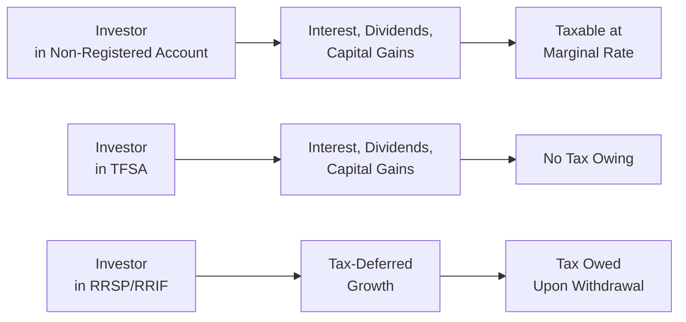

## 16.4 How Are Mutual Funds Taxed?

Picture this: You’ve just received a mutual fund distribution in your email notification—or snail mail if that’s still your style—and you’re staring at a piece of paper with numbers and tax slips that look kind of intimidating. Perhaps you’re even thinking, “Uh, do I need to do something with these now?” You’re not alone. Many Canadian investors feel a bit anxious when it comes to understanding how mutual funds are taxed. The good news is that with a bit of explanation and a few real-life examples, the process starts becoming clearer. So, let’s walk through the main points about how mutual funds are taxed in Canada, including the impact of different account types (registered or non-registered), the tax implications of various distributions, and how to track your adjusted cost base (ACB). By the end, you’ll feel more at ease navigating your next T3 or T5 slip.

Before we dig in, please note that tax legislation constantly evolves. Also, everyone’s personal tax situation is unique. For specific questions or tailored advice, it’s always a good idea to consult a qualified tax professional or your financial advisor, and keep an eye on official sources from the Canada Revenue Agency (CRA) for the latest updates.

Understanding how mutual funds are taxed goes hand in hand with topics covered elsewhere in this course, such as different mutual fund fees (Chapter 16) and the intricacies of KYC rules (Chapter 17). Plus, how taxes affect returns is a big piece of the overall puzzle when you’re constructing an efficient portfolio (Chapter 8). Let’s walk through this step by step.

Keeping the personal anecdote vibe: I remember the first time I had to report mutual fund distributions on my tax return—it was nerve-racking. I had a T3 slip that showed interest income, dividends, and capital gains, and I honestly wasn’t sure where to begin. Turns out, once you understand what’s on these slips, it’s actually fairly straightforward. Let’s get started.

Understanding Distributions (Interest, Dividends, Capital Gains, and Return of Capital)

Mutual funds earn different types of income (interest, dividends, capital gains, etc.), which they pass on to unit holders. If you’re holding these funds in a non-registered account, you’ll generally have some tax reporting responsibilities each year. The fund sends you—and the CRA—tax slips detailing distributions. Depending on your location and income level, these different distribution types can be taxed at different rates. Below is a quick summary:

• Interest Income: This typically comes from bonds, treasury bills, or other interest-bearing assets held in the mutual fund. If you receive interest distributions in a non-registered account, they’re fully taxable at your marginal tax rate in the year they are distributed. There’s no special credit or deduction for interest income.  
• Dividends: If you receive an eligible dividend from a Canadian company, you can claim the dividend tax credit, which essentially reduces the tax you owe. Under Canada’s integrated tax system, you’re credited for a portion of the corporate tax already paid by Canadian corporations.  
• Capital Gains Distributions: When the fund sells securities at a profit, those gains may be distributed to you as a unitholder. Only 50% of Canadian capital gains are currently subject to tax (the “inclusion rate”). This means you only pay tax on half of the realized capital gain at your marginal rate.  
• Return of Capital (ROC): A portion of a fund’s distribution can be ROC. This is not immediately included in your taxable income. Instead, it reduces your adjusted cost base (ACB). Then, when you redeem your mutual fund units, your gain (or loss) is calculated based on that reduced ACB, potentially leading to a higher capital gain later (or a lower capital loss).

It’s worth restating: If these distributions occur in a registered account (like an RRSP or TFSA), the immediate tax consequences can either be deferred or eliminated, depending on the type of account. We’ll talk about that shortly.

“ACB? What’s That?” – Tracking Adjusted Cost Base

The adjusted cost base is basically the “tax cost” of your investment. It starts with what you paid for the mutual fund units, and then it’s adjusted for things like reinvested distributions or capital returns.

ACB is crucial because it determines your capital gain or loss when you redeem (sell) your mutual fund units. And yes, you definitely want to be accurate. An error in calculating ACB can mean paying too much tax or risking a penalty if you under-report.

Here’s a little personal story: I once forgot to account for a reinvested distribution. That meant my ACB was calculated too low. I ended up listing a capital gain that was actually much bigger than it should have been. After a “lightbulb” moment reading about ACB, I realized the mistake, recalculated, and filed an adjustment with the CRA. Lesson learned: keep track of those distributions, especially if they’re reinvested automatically.

A simple representation of how ACB is calculated could be shown in a formula. In KaTeX form, you might see it like this:

 \text{ACB} = \text{Initial Purchase Cost} + \sum(\text{Reinvested Distributions}) - \sum(\text{Return of Capital}) 

This formula just means: start with what you paid, add in any distributions that got reinvested to buy more units, and subtract any return of capital. Of course, if you make multiple purchases, you sum these amounts from each purchase date. Also, you generally need to keep track of per-unit ACB if you buy mutual fund units at different times.

Reinvested Distributions: Paying Tax When You Haven’t Seen the Cash

Mutual fund investors often choose (or are automatically enrolled in) a distribution reinvestment plan, where distributions are used to buy more units of the same fund. It can seem funny because you might never see actual “cash” arrive in your bank account, but if you’re holding the fund in a non-registered account, you could still owe taxes on that distribution. So, in December, you might see that T3 slip with a capital gain distribution or interest distribution that you owe tax on—despite zero new money going into your bank. That’s the nature of how mutual fund distributions work.

From a big-picture perspective, reinvested distributions can amplify your returns over time because you’re essentially compounding your investment. But don’t forget that you need to add those reinvested amounts to your ACB so that you’re not double-paying taxes down the road.

Registered Accounts vs. Non-Registered Accounts

When we talk about mutual fund taxation, the single biggest factor is whether you hold the mutual fund in a non-registered account or within a registered plan, such as an RRSP, RRIF, or TFSA.

• RRSP and RRIF: Typically, any income or gains inside your RRSP or RRIF is tax-sheltered until you withdraw it. That’s the good news. The “other side of the coin” is that once you withdraw the funds, you’ll pay tax on the entire withdrawal amount at your marginal rate, not just the gains. So if your RRSP invests in a fund that throws off capital gains, you don’t pay tax on those gains immediately, but eventually, distributions and contributions—plus growth—are fully taxable upon withdrawal.  
• TFSA: The Tax-Free Savings Account is, well, tax-free, so you generally don’t owe any taxes on interest, dividends, or capital gains within it. And if you withdraw from your TFSA, you don’t pay tax on that withdrawal. This can be a key advantage for investors wanting a flexible, completely tax-sheltered pocket.  
• Non-Registered Account: Income distributions, dividends, and capital gains are taxed in the year they’re received. You also claim any capital losses in the year they’re realized. Because of this, non-registered accounts require the most ongoing tax attention. If you have a losing position, you might choose to redeem it to realize a capital loss that offsets your capital gains.  

The following diagram compares distribution flows and potential taxation across different account types.

In this chart, you can see that distributions to non-registered accounts are immediately taxable, while TFSAs remain tax-free, and RRSP/RRIF distributions allow deferral until withdrawal.

Tax Slips and Reporting Requirements

When tax season arrives, mutual fund dealers (now all regulated under CIRO—Canadian Investment Regulatory Organization—since the amalgamation of the MFDA and IIROC in 2023) are required to provide you with the relevant tax slips detailing any income or proceeds you received. These slips help ensure that the CRA receives the information they need to match against your personal tax return. Let’s look at the typical ones:

• T3 Slip: Details income from trusts (many mutual funds are structured as trusts), including interest, dividends, and capital gains distributions.  
• T5 Slip: Used for income like interest or dividends in some funds with corporate structures or certain fixed-income products.  
• T5008 Slip: Reflects proceeds of disposition (i.e., how much you received when you sold or redeemed your mutual fund units during the tax year). You can use this to calculate and report your capital gain or loss.  

Make sure you report the amounts accurately. If you see something on your T3 or T5 slip that doesn’t match your understanding, don’t panic—contact the mutual fund firm or your advisor to clarify. Sometimes mistakes happen, or the distribution classification might have changed mid-year.

Capital Losses and Offsetting Gains

No one likes to realize an investment loss, but capital losses can be used to offset capital gains for tax purposes. For instance, if you redeem a mutual fund at a price lower than your ACB, you’d have a capital loss. Meanwhile, if you have capital gains (from the same year or from the previous three years or future years), a capital loss can offset those gains, effectively reducing your overall tax burden either in the current year, carrying forward to future years, or carrying back to claim refunds on prior years when you realized capital gains.

Example: Suppose you sold Fund A at a $1,000 capital loss and sold Fund B at a $1,200 capital gain in the same year. You’re only taxed on the net capital gain of $200 ($1,200 - $1,000), and remember that only 50% of that $200 is actually taxed at your marginal rate. So, effectively $100 is included in your taxable income.

It’s also possible to realize a capital loss if the fund pays a return of capital over time and your ACB drops to near zero. When you redeem, you may still have a gain or a loss, depending on how the market price evolves.

Common Pitfalls and Tips

• Not keeping track of the ACB: The biggest source of confusion and potential errors is forgetting to adjust your ACB for reinvested distributions or returns of capital. Make sure you update it each time you receive or reinvest distributions in a non-registered account.  
• Overlooking return of capital: Return of capital distributions are not taxed right away, but they reduce your ACB. If you ignore that until several years later, your numbers might be way off.  
• Assuming distributions in a TFSA or RRSP are taxed: If you’re an investor who’s used to focusing on distribution tax, it can be easy to forget that inside TFSAs, you probably don’t worry about taxes; within RRSPs, you worry later at withdrawal.  
• Confusing book value on statements with ACB: The “book value” shown by some financial institutions might not properly account for adjustments to your ACB, especially if there’ve been many reinvested distributions. Always confirm exactly how your institution calculates book value.  
• Selling to realize a capital loss, then buying back right away in the same account: The “superficial loss” rule might disallow the capital loss. If you or your spouse re-buy the same security (or a substantially identical one) within 30 days, the CRA might disallow the loss.  
• Not seeking professional advice: It’s easy to get lost in the weeds, especially if you hold multiple funds with complicated distribution histories. Reaching out to a tax professional or using official CRA resources can keep you out of trouble.

A Quick Case Study

Say you purchase 1,000 units of a mutual fund at $10 each for a total cost of $10,000. During the year, the fund pays:

• Interest distribution of $150.  
• Capital gains distribution of $300 (reinvested).  
• ROC distribution of $100.  

If you’re in a non-registered account, you’ll receive tax slips for $150 of interest and $300 of capital gains. Meanwhile, the $300 is automatically used to purchase new units in your fund. The $100 ROC reduces your ACB. So, how does your ACB look now?

1. Start with $10,000.  
2. Add the $300 reinvested distribution (the capital gains reinvested).  
3. Subtract the $100 ROC.  

Your new total cost base is $10,200. If the $300 reinvested distribution buys 25 new units, you now have 1,025 total units. So, your revised per-unit ACB is $10,200 / 1,025 = $9.95. And you’ll pay tax in the current year on $150 of interest and 50% of the $300 capital gains distribution ($150 taxable amount).

Now, suppose you redeem all 1,025 units at $12 each. That means you receive $12,300. Your ACB is $10,200, so your total capital gain is $2,100, of which 50% ($1,050) is included in your taxable income. That’s how it all ties together.

Regulatory Environment and Useful Resources

Taxation, investor protection, and disclosure obligations for mutual funds are set out in Canadian securities legislation. CIRO—Canada’s recognized self-regulatory organization that oversees all investment dealers and mutual fund dealers—mandates that firms and representatives ensure clients understand the tax consequences of the products they purchase. While historical references may show the Mutual Fund Dealers Association (MFDA) and the Investment Industry Regulatory Organization of Canada (IIROC) as separate entities, remember that as of January 1, 2023, they have combined under CIRO, effectively simplifying the regulatory environment.

Key references:

• Canada Revenue Agency (CRA): The ultimate go-to for up-to-date guidelines. Check their website (https://www.canada.ca/en/revenue-agency.html) for instructions on T3, T5, T5008 slips, and for general rules on capital gains, losses, and filing procedures. Their My Account tool can be super handy to track your tax slips and file your returns electronically.  
• CIRO: https://www.ciro.ca. This is the national self-regulatory body overseeing investment dealers and mutual fund dealers. You can find guidelines on best practices for disclosure and updates on changes to regulations.  
• “Tax Tips for Canadians for Dummies” by Christie Henderson et al.: A friendly reference that covers everything from personal tax credits to small business filing, including handy sections on basic investment taxation in Canada.  
• Provincial Securities Regulator Websites: Offer guides on mutual fund basics and can provide additional investor education resources.  
• Online Courses/Tools: You can find free or low-cost tax courses on various platforms to deepen your understanding. Alternatively, open-source financial software can help you track distributions and recalculate your ACB.

Remember, the more you understand how your mutual funds are taxed—and how to optimize or manage those taxes—the better you can align your investment strategy with your financial goals.

Best Practices

• Keep thorough records of your purchases, redemptions, distributions, and ROC.  
• Periodically check your broker/dealer statements to ensure the reported book value is accurate, or update your own ACB spreadsheet if necessary.  
• Review your T3, T5, and T5008 slips for consistency with your expectations and contact your dealer if something seems off.  
• Make sure that your approach to buying or selling mutual funds near year-end factors in potential distributions that could be “passed along” to you even if you haven’t held the fund very long. It can be frustrating to buy a fund in late December and receive a big capital gain distribution the next day.  
• Factor in the interplay between tax and returns: A fund may yield higher pre-tax returns, but if it’s generating heavily taxed interest income, consider if a TFSA or RRSP is a better home for it.  
• Consult a professional or use software if you’re juggling multiple funds with frequent distributions. It’s worth the investment to avoid mistakes and missed opportunities.

Conclusion

Taxation of mutual funds in Canada might feel intimidating at first, but once you see how it all works—how distributions are taxed, how ACB is key, and how different accounts affect your liability—you’ll realize it’s just about being organized. Knowing how your returns are taxed can influence the types of funds you invest in, the way you structure your portfolio, and even the timing of your buys and sells. Or, to put it another way, being informed about tax matters isn’t just about being a “good citizen,” it’s also about crafting a better investment strategy for your future.

There’s always more to learn in the dynamic world of financial regulation and investment taxation. Keep an eye on new guidelines from the CRA and CIRO, stay curious, and keep building your knowledge base. If you do, you’ll feel more confident and prepared the next time distribution slips arrive in the mail—or your inbox.

Now that you’ve seen the nuts and bolts of how mutual funds are taxed, why not test your understanding with the quiz below?

## Comprehensive Mutual Fund Taxation Quiz: Maximize Your Returns



### Which type of mutual fund distribution is generally taxed at an investor's full marginal rate in a non-registered account?

- [ ] Capital gains distribution
- [ ] Return of capital
- [x] Interest income
- [ ] Dividend income

> **Explanation:** Interest income is fully taxable at your marginal rate, whereas capital gains are taxed at 50%, dividends are eligible for dividend tax credits, and return of capital isn't taxed immediately but rather lowers your ACB.

### Which statement best describes how the adjusted cost base (ACB) is calculated?

- [x] Initial purchase cost plus reinvested distributions minus return of capital 
- [ ] Initial purchase cost minus reinvested distributions plus return of capital
- [ ] Market price minus your original purchase price
- [ ] T3 slip cost plus T5 slip cost

> **Explanation:** ACB starts with the total purchase price, adds any reinvested distributions, and subtracts any return of capital. This ensures correct calculation of capital gains or losses upon redemption.

### Which of the following is a key advantage of holding mutual funds in a TFSA?

- [x] Any capital gains, interest, or dividends grow tax-free
- [ ] Distributions are taxed only when withdrawn
- [x] Withdrawals are generally tax-free
- [ ] You can claim capital gains refunds annually

> **Explanation:** The beauty of a TFSA is that any growth or income is tax-free, and withdrawals typically incur no tax. Unlike RRSPs, you do not get a deduction on contributions, but you also don’t owe tax upon withdrawal.

### When reinvested distributions occur in a non-registered account, what is the immediate tax consequence?

- [x] They are still taxable in that year, even though there is no cash received
- [ ] They are not taxable because no cash changes hands
- [ ] They are taxed only if withdrawn within 30 days
- [ ] They become taxable only upon final redemption

> **Explanation:** For a non-registered account, all distributions, including those reinvested to purchase more fund units, are taxable in the year they occur.

### Which tax slip in Canada typically details your proceeds of disposition for redeemed mutual fund units?

- [x] T5008
- [ ] T3
- [x] T5
- [ ] T4

> **Explanation:** You’ll receive a T5008 slip showing the proceeds from your redemption of mutual fund units. T3 and T5 slips primarily report income like dividends, interest, or capital gains distributions, but not the actual redemption proceeds.

### In a non-registered account, if you sell a mutual fund at a loss, how can the capital loss be used?

- [x] It can offset capital gains in the current, future, or previous three years
- [ ] It can offset any type of income immediately
- [ ] It cannot be used if the fund is repurchased within five years
- [ ] It is added to charitable contribution credits

> **Explanation:** Capital losses can be used to offset current and/or future capital gains. In certain situations, you can carry them back up to three years to offset previous capital gains.

### What is the primary benefit of a dividend tax credit for Canadian dividends?

- [x] It reduces the income tax owed on eligible dividends
- [ ] It eliminates the need to report dividends
- [x] It doubles the dividend value for reporting
- [ ] It changes dividends into interest income

> **Explanation:** The dividend tax credit is designed to avoid double-taxation on dividends from Canadian corporations. By applying the credit, the investor’s tax liability on dividends is reduced.

### When are mutual fund distributions derived from return of capital taxed?

- [x] When the mutual fund units are eventually redeemed, assuming the ROC has lowered the ACB
- [ ] Immediately upon distribution
- [ ] Within 60 days of distribution
- [ ] Never

> **Explanation:** Return of capital distributions reduce the adjusted cost base, meaning that you’ll effectively realize any tax consequence (capital gain) when you eventually redeem the mutual fund units at a higher capital gain.

### Which of the following is a potential pitfall in tracking ACB?

- [x] Relying solely on “book value” from your statements without adjusting for reinvested distributions and ROC
- [ ] Updating it for every taxable distribution
- [ ] Obtaining help from a professional accountant
- [ ] Using online open-source software to track it

> **Explanation:** Sometimes, the book value on monthly statements is not the same as your true ACB. You must factor in reinvested distributions and return of capital. Relying solely on a potentially unadjusted book value can lead to miscalculated capital gains or losses.

### True or False: Within an RRSP or RRIF, you pay tax on dividends and capital gains in the year they arise.

- [ ] True
- [x] False

> **Explanation:** Within an RRSP or RRIF, gains and income generally grow tax-deferred. You only pay tax when you withdraw funds from the account, at which point the withdrawal is taxed as income at your marginal tax rate.


