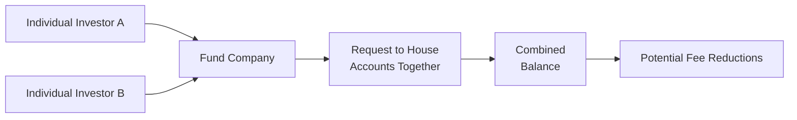

## 16.5 Additional Services and Considerations

So, you’ve probably heard all about the main fees, accumulation plans, systematic withdrawals, and taxation surrounding mutual funds—sounds like a lot, right? But wait, there’s more. In fact, the real fun begins when you dig into some of the additional services and considerations that can help Canadians manage their mutual fund portfolios more effectively. And by “fun,” I mean the stuff that can make your life much easier, keep you on track with your goals, and help ensure you’re always aligned with current regulations.

Let’s explore various services that mutual fund providers and their advisors offer beyond the usual buy-sell-hold trifecta. We’ll look at online portals, family account linking, automatic rebalancing, the ins and outs of switching, and, of course, maintaining healthy advisor-client communication. I’ll give you a few personal anecdotes along the way—because, honestly, who among us hasn’t mixed up a password or two while trying to manage our finances online?

I remember a time when I wanted to see how my portfolio was doing right before boarding a plane at 6 a.m., only to find out I had accidentally typed my password incorrectly three times and locked myself out. Trust me, if you’re traveling, you don’t want to be messing with customer service from a shaky Wi-Fi connection in an airport lounge. That’s precisely why it’s so valuable to set up these services in a user-friendly way from the get-go.

### Online Account Management

Online account management is like having a 24/7 personal finance window into your mutual fund portfolio. Most major providers—think RBC, TD Asset Management, Fidelity, and so on—offer web portals or mobile apps that allow you to log in, see your current holdings, transaction history, performance data, and even deeper analytics such as gains and losses over various periods. Nowadays, it’s common for providers to integrate financial calculators, portfolio rebalancing triggers, or even advanced charting tools.

• Convenience and Transparency:  
  - You don’t have to wait for a monthly or quarterly statement to see how your investments are doing.  
  - You get real-time snapshots of account balances, performance, and capital gains or losses.

• Accessibility:  
  - Mobile apps ensure you can check your growing nest egg whenever and wherever you fancy.  
  - Some providers support multi-factor authentication, which (while occasionally annoying) is a big plus for account security.

• Document and Statement Retrieval:  
  - A personal anecdote: I once lost a physical statement that I needed for my tax filing. Luckily, I had access to my provider’s online portal, so I could just log in, download the PDF, and breathe that sweet sigh of relief.

Even more importantly, online account management aligns with modern regulatory emphasis on transparency. CIRO (Canadian Investment Regulatory Organization)—the self-regulatory body that oversees mutual fund dealers, investment dealers, and market integrity—supports providing up-to-date, clear information to clients. Nothing is clearer than letting you see your fund performance in real time!

### Electronic Delivery of Statements and Documents (e-Delivery)

Paper statements, you say? Some folks still prefer them. But let’s face it: We live in a digital era, and e-delivery is both practical and eco-friendly. Many mutual fund companies (and third-party clearing platforms as well) offer electronic statements, trade confirmations, prospectuses, and even annual reports.

• Reduced Clutter:  
  - If you’re anything like me, you occasionally get overwhelmed by paper piling up on your desk. E-delivery helps you keep track of important documents digitally and reduces the need for big filing cabinets.

• Immediate Access:  
  - You can quickly search, archive, and retrieve documents whenever necessary instead of rummaging through a stack of paper statements.

• Regulatory Support:  
  - The Canadian Securities Administrators (CSA) and CIRO encourage giving investors consistent, accessible disclosure. Electronic statements keep you in the loop.  
  - E-delivery also ensures you don’t have to wait for the mail to bring news of a milestone or updated regulations.

Just keep an eye on your spam folder; sometimes these important documents may end up in the wrong place. And, consider saving PDF copies in a secure (and well-organized) folder. Once you get used to e-Delivery, trust me, you’ll feel a little lost when you see a paper statement show up in your mailbox!

### Account Linking and Family Grouping (Householding)

Now let’s talk about “householding,” which might sound like something your grandparents invented to keep the entire family’s finances squeaky clean. But in mutual fund terminology, it’s simply an arrangement that allows you to link several accounts (like within a family or household) together. Why is this so powerful? In many cases, mutual fund providers will use the total combined balance for fee breakpoints or management fee reductions.

• Potential Fee Savings:  
  - Imagine your spouse has $150,000 invested in the same fund family, and you have $200,000. Separately, you might both be subject to higher management expense ratios (MERs). Once combined (i.e., $350,000 in total), you might be eligible for a fee discount tier. That discount might kick in at, say, $250,000 or $300,000, saving your entire household some serious money over the years.

• Holistic Family Approach:  
  - It’s not just about fees: sometimes looking at the family unit as a whole can improve asset allocation strategies. Kids’ Registered Education Savings Plans (RESPs), spousal Registered Retirement Savings Plans (RRSPs), or even Tax-Free Savings Accounts (TFSAs) can all be viewed collectively to ensure consistent allocation and rebalancing.

• Implementation:  
  - Usually, your advisor or the fund provider’s customer service team can link the accounts. They’ll need proof that these linked accounts belong to the same family or household.

• Caveats:  
  - Everyone in the household should be on board, and remember that each individual’s risk profile might still differ. Householding does not erase the importance of personal KYC (Know Your Client) and suitability analysis.

Here’s a simple flowchart to illustrate the overall concept of account linking (a.k.a. householding):

When you choose to group your accounts, the fund company essentially takes all those balances, lumps them together, and calculates the fees at the new combined level. If that combined level hits the threshold that qualifies you for a discount, you’ve successfully lowered your costs—and you didn’t even have to dramatically change your investment choices. Easy, right?

### Automatic Rebalancing Services

You might have heard advisors say, “Don’t let your portfolio drift!” That’s because market conditions can quickly cause one part of your portfolio to balloon while another shrinks, possibly distorting your desired asset allocation. Automatic rebalancing helps you maintain the target ratio between equities, fixed income, and other assets by systematically buying or selling portions of your portfolio at set intervals or when triggered by certain thresholds.

• Maintaining Risk and Return Objectives:  
  - If equities soar, you might end up with a higher equity allocation than intended, increasing your overall risk. Rebalancing realigns your positions back to a lower equity percentage if that was your original goal.

• Discipline Without Emotional Decisions:  
  - Automatic rebalancing helps you avoid “market timing” mistakes driven by fear or greed.  
  - For example, some providers allow you to set a 5% or 10% threshold, so if your equity portion’s weight goes beyond that limit, it automatically sells off the excess equity and reinvests the proceeds into your underweighted fixed-income portion.

• Advisor Involvement:  
  - Some clients prefer to keep their advisor in the loop, so that major rebalancing decisions still require a conversation. Others appreciate the fully automated approach if they have a well-defined, stable, long-term plan.

Let’s illustrate the idea of portfolio rebalancing with a formula. Suppose wᵢ is the weight of each asset class i in your portfolio:


w_i = \frac{(\text{Number of Shares}_i) \times (\text{Price}_i)}{\text{Total Portfolio Value}}


If you initially planned for an equity weight of 60% (w_eq = 0.60) and it drifts to 70% (0.70), an automatic rebalancing service might sell some equity to bring it back down close to 60%, distributing the proceeds to other asset classes.

### Switching Between Funds in the Same Family

Let’s say you’re invested in a large Canadian bank’s suite of mutual funds. Over time, you decide you want to shift from a more aggressive equity fund to a more balanced or conservative fixed-income fund. Switching within the same family of funds often simplifies the process compared to redeeming one fund and buying another from an entirely new company.

• Efficiency:  
  - Switching can sometimes be done without incurring additional loads, although you might still face redemption fees if you’re within a deferred sales charge (DSC) schedule.  
  - Not all share classes or fund types are eligible for no-cost switching, so always read your fund agreement carefully or ask your advisor.

• Potential Tax Implications:  
  - Even when switching inside the same fund family, it is considered a disposition for tax purposes if it’s in a non-registered account in Canada. This may trigger capital gains or losses. In registered accounts (like RRSPs, TFSAs), you don’t pay taxes for switching because the growth is tax-sheltered.

• Products and MER Differences:  
  - Some providers might have multiple equity funds, each with different fee structures. Choose carefully to ensure you are comfortable with the expense ratio, risk profile, and investment mix of the newly selected fund.

### Advisor and Client Communication

Finally, no matter how many fancy online tools or automatic services you make use of, there’s no replacement for solid advisor-client communication. A single 15-minute check-in call can sometimes reveal changes in your life situation—a new job, a new child, or a newly discovered old painting worth thousands—that might drastically influence your asset allocation or liquidity needs.

• KYC and Suitability:  
  - CIRO requires that advisors conduct a suitability assessment regularly and whenever there’s a material change to your situation. This helps ensure the recommended portfolio continues to match your risk tolerance and time horizon.

• Annual or Semi-Annual Reviews:  
  - Many advisors schedule these, but if yours doesn’t, consider asking for them. You can discuss performance, rebalance strategies, and any personal life updates that might mandate portfolio changes.

• Communication Preferences:  
  - Advisors can communicate via phone, email, virtual meet-ups, or in-person visits—whatever suits your style. Just be sure you keep lines of communication open for urgent matters or big market swings.

• Historical Context—MFDA and IIROC:  
  - Historically, we had the Mutual Fund Dealers Association of Canada (MFDA) and the Investment Industry Regulatory Organization of Canada (IIROC) as separate self-regulatory organizations. On January 1, 2023, those two were amalgamated into the Canadian Investment Regulatory Organization (CIRO). Now, CIRO is your single SRO for both mutual fund dealers and investment dealers. If you see references to MFDA or IIROC in older fund documentation, remember that those references are defunct; CIRO is the recognized body today.

### Potential Pitfalls and Best Practices

Life’s rarely as simple as ticking a box, so watch out for the following:

• Overreliance on Automation:  
  - Automatic rebalancing is awesome, but occasionally you’ll want to review if it’s still using the correct target allocations. People change, goals shift, and markets do new and surprising things.

• Missed Fee Breakpoints:  
  - If you forget to link new family members’ accounts (or a newly inherited account) to your existing household, you could miss out on fee discounts.

• e-Delivery Overload:  
  - E-delivery can sometimes lead to “digital clutter.” Make sure you’re keeping track of your statements in a safe, well-organized manner and checking them regularly.

• Switch Considerations:  
  - Before you initiate a switch within the same provider, examine both funds’ MERs, investment strategies, performance, and manager track record. Ensure the switch suits your plan.

• Regulatory Evolutions:  
  - Keep up with any changes in CIRO or CSA regulations. The financial industry is dynamic and new guidelines or technologies emerge regularly, so stay informed.

### Additional Resources

• CIRO Website:  
  - https://www.ciro.ca  
  - Offers details on compliance, investor protection, registration requirements, and the CIPF (Canadian Investor Protection Fund). CIPF remains your safeguard if your dealer member becomes insolvent.

• Open-Source Tools:  
  - Some free portfolio trackers (e.g., certain budgeting apps or aggregator services) provide a consolidated look at your mutual funds across multiple institutions, though you’ll want to check they align with security and data privacy best practices.

• Fund Company Portals:  
  - RBC, TD Asset Management, Fidelity Canada, and others often have educational resources, webinars, and interactive tools that address everything from portfolio construction to risk tolerance quizzes.

• Industry Publications:  
  - The Canadian Securities Administrators (CSA) also releases bulletins and guides on client statements and disclosure.  These are publicly available and can help you stay up to date on regulatory expectations regarding account communication and recordkeeping.

In the end, don’t underestimate the power of “bonus” services when it comes to mutual fund investing. If your goal is to maintain a well-structured, continuously monitored, and cost-effective portfolio, these additional services—online portals, e-delivery, householding, automatic rebalancing, easy switching within the same fund family, and especially constructive advisor communication—can work wonders. They’re not just add-ons. They’re integral to building a smooth investing experience that’s aligned with your personal goals and the rules established by CIRO’s regulatory framework.

After all, the difference between a fulfilling investment plan and a chaotic one often boils down to how thoughtfully you use the tools at your disposal. And sometimes, all it takes is a quick click to sign up for e-delivery or a short conversation with your advisor about linking your spouse’s RRSP to your TFSA. That’s how real progress is made—one small improvement at a time.

So, good luck exploring these additional services and considerations. And remember, the more you understand these tools, the easier it becomes to cultivate a strong, adaptive financial life. It’s not about perfection—sometimes it’s just about being prepared and open to continuous learning. Now that we’ve rounded out the picture, let’s see how much you remember!

## Additional Services and Considerations in Mutual Fund Investing: Quiz



### Which of the following is a key benefit of online account management for mutual fund investors?

- [x] Real-time access to portfolio performance data.
- [ ] Frequent in-person meetings with an advisor.
- [ ] Higher MERs for more robust administration.
- [ ] Locking trading hours to reduce volatility.

> **Explanation:** Online account management gives investors anytime access to portfolio data and streamlined oversight, making it easier to track progress without waiting for a monthly statement.

### Which of the following statements about electronic document delivery (e-delivery) is correct?

- [x] E-delivery provides immediate access to statements and reduces paper clutter.
- [ ] E-delivery is mandatory and cannot be opted out of by clients.
- [ ] E-delivery always generates additional fees for clients.
- [ ] E-delivery applies only to trade confirmation slips, not to regular statements.

> **Explanation:** One major advantage of e-delivery is the immediate, paperless access to statements and documents. Clients generally choose whether to opt in.

### When households use account linking or householding, what is the main purpose?

- [x] Combining balances to possibly qualify for lower management fees.
- [ ] Hiding assets from tax authorities.
- [ ] Securing additional coverage through insurance providers.
- [ ] Freezing account balances until certain conditions are met.

> **Explanation:** Householding allows a fund provider to view multiple family or household member accounts as a single total balance, offering the potential for reduced fees or improved tier-based pricing.

### Which of the following best describes automatic rebalancing in a mutual fund context?

- [x] A systematic process that realigns a portfolio to its target asset allocation.
- [ ] A regulatory requirement that eliminates all equity exposure at retirement.
- [ ] A strategy that invests only in money market funds for the long term.
- [ ] A manual process performed only by the investor without any advisory input.

> **Explanation:** Automatic rebalancing is a scheduled or threshold-based mechanism to maintain a specific asset allocation, important for risk control and investing discipline.

### What should investors keep in mind regarding tax implications when switching between funds in the same family?

- [x] Switching in a non-registered account may trigger capital gains or losses.
- [ ] Switching in a TFSA always triggers an immediate capital gain.
- [x] Switching in an RRSP does not trigger taxes immediately.
- [ ] Switching automatically resets contribution room.

> **Explanation:** In non-registered accounts, switching is considered a taxable event. In registered accounts (RRSPs, for example), any gains are deferred until withdrawal. TFSAs also shelter gains, so no immediate taxes arise on a switch within a TFSA.

### Which of the following best encapsulates the term “Know Your Client” (KYC)?

- [x] An ongoing regulatory requirement for advisors to understand a client’s financial situation and investment objectives.
- [ ] A mandatory background check on the client’s personal life.
- [ ] A requirement that clients repeatedly fill out the same forms each month.
- [ ] A one-time form filled out at account opening with no updates required.

> **Explanation:** KYC is a foundational principle regulated by CIRO, which obliges advisors to gather and maintain up-to-date information on a client’s financial situation, goals, risk tolerance, and more to ensure recommendations remain suitable.

### Which of the following statements about advisor-client communication is true?

- [x] Regular reviews help keep mutual fund holdings aligned with changing client objectives.
- [ ] Communication is optional if the mutual fund is part of an RRSP plan.
- [x] Advisors must stay compliant with regulatory obligations like suitability.
- [ ] Advisors should only contact clients when markets crash.

> **Explanation:** Frequent, ongoing communication is key to ensuring that investment solutions remain appropriate under CIRO rules and reflect any changes in a client’s life situation or market conditions.

### Which service involves linking multiple family accounts under one umbrella for fee discounts or other benefits?

- [x] Householding
- [ ] E-delivery
- [ ] Automatic rebalancing
- [ ] Switching

> **Explanation:** Householding allows consolidation of balances from multiple family members, which may grant the household access to lower fee tiers or other benefits offered by the fund provider.

### In the current regulatory environment, which SRO is responsible for overseeing both mutual fund dealers and investment dealers in Canada?

- [x] CIRO
- [ ] MFDA
- [ ] IIROC
- [ ] CSA

> **Explanation:** Effective January 1, 2023, the Mutual Fund Dealers Association (MFDA) and the Investment Industry Regulatory Organization of Canada (IIROC) amalgamated into the Canadian Investment Regulatory Organization (CIRO), which oversees both mutual fund and investment dealers.

### True or False: Switching within the same mutual fund family in a non-registered account triggers a taxable event.

- [x] True
- [ ] False

> **Explanation:** A switch within the same provider in a non-registered account is generally considered a disposition in Canada, so any realized capital gains (or losses) are taxable events. However, registered accounts are an exception because gains are tax-sheltered.


