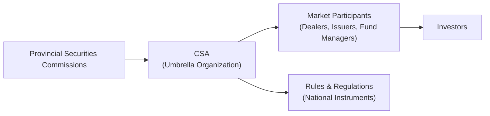

## 17.1 Mandate and Scope of Securities Administrators

Securities administrators fulfill a vital function in protecting investors, ensuring fair and efficient capital markets, and upholding confidence in the Canadian financial system. Collectively, these administrators and their respective provincial or territorial securities commissions are often referred to under an umbrella organization known as the Canadian Securities Administrators (CSA). In this section, we’ll explore what the CSA does, how various commissions work together to regulate Canada’s capital markets, and why these bodies are central to the mutual fund dealer ecosystem.

---

### Introduction

So, let me share a quick personal story that reminded me why securities regulators are so essential. Years ago—I think it was around the time I was first learning about mutual fund products—I attended a small investor education seminar. A relative of mine, who was coming with me, was completely puzzled by all the financial jargon, pamphlets, and disclaimers. About five minutes into the presentation, she leaned over to me and whispered, “Who’s actually making sure that all of this is legit?” That simple question struck me as the heart of the matter: behind the scenes, we have securities administrators and regulators who oversee these presentations, ensure the information is accurate, and protect folks issuing networks of capital from unscrupulous practices.

Investing in mutual funds or any security demands trust. You trust that the company or fund manager is being transparent about potential risks, that you can find relevant disclosures, and that no one’s swindling you out of your hard-earned savings. That’s where securities administrators step in, setting the ground rules for how securities are offered, monitored, and supervised. Without them, we’d probably have chaos on top of confusion.

---

### Understanding the Role of Securities Regulators in Canada

Unlike some countries with one central securities regulatory authority, Canada’s regulatory structure is organized at the provincial and territorial levels. Each jurisdiction has its own regulatory authority (commonly called a “securities commission”). The Ontario Securities Commission (OSC) in Ontario, the Autorité des marchés financiers (AMF) in Québec, and the British Columbia Securities Commission (BCSC) in British Columbia are among the most prominent examples.

These regulators operate locally but collaborate closely to harmonize rules across Canada. When we say “Canadian Securities Administrators” or “CSA,” we refer to this collective effort. Whether you live in Alberta or Nova Scotia, you’ll encounter local regulations that echo a national standard. And yes, there might be subtle differences in filing requirements or fees across jurisdictions, but the CSA’s objective is to minimize duplication, confusion, and contradictory rules.

If you’re curious (and you should be!) about the structure of the different players, here’s a simplified Mermaid diagram that illustrates how these securities regulators fit into the broader ecosystem:

In this diagram, each provincial or territorial securities commission (A) collaborates under the CSA (B). The CSA develops and harmonizes rules (E) that market participants (C), including mutual fund dealers, must follow to protect (D) investors.

---

### The Mandate of Canadian Securities Regulators

At their core, securities regulators in Canada exist to protect investors and foster fair capital markets. This broad mandate includes:

• Ensuring Investors Are Informed  
Securities administrators oversee prospectus requirements, continuous disclosure obligations, and other reporting standards. By reviewing and approving prospectuses for public offerings, regulators help confirm that potential investors receive essential details—like financial statements, management backgrounds, and risk factors—before putting their money into a security.

• Maintaining Fair and Efficient Markets  
No one wants to participate in a market plagued by inside trading, fraud, or clandestine schemes. Regulators set rules against all these illegal or unethical behaviors and investigate suspicious activities. When wrongdoing is found, they have the authority to impose sanctions, issue fines, and even ban individuals or firms from the market.

• Overseeing Registration and Compliance  
Market participants and professionals—be they dealers, advisors, or fund managers—are typically required to register with their provincial securities commission. Regulators administer rules regarding ongoing registration obligations. For example, if someone wants to become a mutual fund representative, they can’t just waltz into the industry; they must meet specific proficiency requirements, pass relevant exams, and uphold ethical standards.

• Championing Market Integrity  
Beyond the nuts and bolts of forms and disclosures, regulators promote market integrity by setting broad policy initiatives—for instance, clarifying rules around financial technology or formulating guidelines for environmental, social, and governance (ESG) disclosures. These measures aim to uphold confidence in the Canadian capital markets.

---

### Collaboration Through the CSA

The Canadian Securities Administrators coordinate policy development to minimize duplication across the provinces. They publish National Instruments (NIs)—which are sets of harmonized rules that apply to all jurisdictions—to streamline fundamental regulatory requirements. For instance:

• National Instrument 31-103: Registration Requirements, Exemptions and Ongoing Registrant Obligations.  
This one is pretty central if you’re dealing with the registration of mutual fund dealers, investment fund managers, or advisors. It outlines who needs to register, the conditions of registration, and ongoing compliance responsibilities.

• Other Notable Instruments  
You’ll see references to National Instrument 81-102 (Mutual Funds), which addresses mutual fund design, fee structure, and operations. There’s also National Instrument 81-101 for mutual fund prospectus disclosure, among many others.

What’s cool is how the CSA attempts to keep these rules consistent across Canada, so that if you’re operating entirely in British Columbia or you have a cross-border presence in Ontario or Québec, you’re still dealing with largely the same set of expectations.

---

### Provincial and Territorial Commissions: Spotlight on Few Examples

While they align under the CSA, the securities commissions are independent bodies responsible for enforcing local securities laws. Here are a few prominent ones:

• Ontario Securities Commission (OSC)  
Canada’s most populous province, Ontario, is home to significant capital market activities. The OSC not only registers dealers and advisors but also leads some national policy initiatives due to the volume of market participants based in Ontario.

• Autorité des marchés financiers (AMF)  
Québec’s securities regulator covers more than just securities—it regulates insurance and deposit institutions too. The AMF’s approach influences French-language resources and regulations within the province, making sure financial materials are available in English and French.

• British Columbia Securities Commission (BCSC)  
The BCSC is known for its emphasis on investor education. British Columbia also has a strong presence of venture capital and smaller firms, so the BCSC addresses issues around early-stage capital raising and innovative fintech solutions.

Though we’re only highlighting a few, remember every province and territory has such an agency, and each plays a significant role locally. Together, they manage the extensive task of safeguarding Canadian capital markets.

---

### Impact on Mutual Fund Dealers

From the perspective of a mutual fund dealer (and, of course, mutual fund dealing representatives), compliance with local securities legislation is non-negotiable. Key obligations include:

• Registration  
You must register with the securities authority in each jurisdiction where you conduct business. If you’re based in Alberta but have clients in Saskatchewan, you’ll likely need to register in both provinces unless an exemption applies.

• Disclosure  
Regulatory authorities require robust disclosure at account opening, including client relationship rules, risk disclosure, and fee transparency. Provincial and territorial authorities also require you to keep your clients updated on changes to their investment statements, ensuring they know what they’re paying for.

• Ongoing Obligations  
Even after you’re registered, the work doesn’t stop. Compliance is a day-to-day responsibility, addressing areas such as maintaining adequate capital levels, ensuring staff have the required proficiency, and continually updating client files to reflect accurate Know Your Client (KYC) information.

• Enforcement  
Securities commissions have the power to investigate suspected breaches of securities legislation. If a mutual fund dealer (or one of its representatives) is found to be in violation—say, unsuitable investment recommendations or misrepresentations—regulators can impose fines, suspend licenses, or even initiate criminal proceedings in severe cases.

---

### The New Self-Regulatory Organization: CIRO

Before 2023, you may have heard of the Mutual Fund Dealers Association of Canada (MFDA) or the Investment Industry Regulatory Organization of Canada (IIROC). Those bodies were standard references for self-regulatory oversight. However, as of January 1, 2023, the MFDA and IIROC merged to form a new self-regulatory organization. Effective June 1, 2023, this amalgamated entity was officially renamed the Canadian Investment Regulatory Organization (CIRO).

CIRO is now Canada’s national self-regulatory body overseeing investment dealers, mutual fund dealers, and market integrity for equity and debt marketplaces. While CIRO handles day-to-day oversight, it remains subject to overarching supervision from each province or territory’s securities administrator. This structure aims to reduce friction, unify rules for different channels, and ensure consistent enforcement across the country.

---

### CIPF: The Sole Protection Fund

On January 1, 2023, the Canadian Investor Protection Fund (CIPF) merged with the MFDA Investor Protection Corporation (MFDA IPC), creating a single investor protection fund for all CIRO-member firms’ clients. CIPF is independent of CIRO, but it works in tandem with securities commissions to offer coverage if a firm becomes insolvent. So, if a CIRO-registered mutual fund dealer went out of business, CIPF would provide protection (subject to coverage limits) for eligible client assets.

---

### National Instrument 31-103: A Closer Look

National Instrument 31-103 is one of the CSA’s key regulatory tools. It lays out:

• Who Needs to Register  
Any person or firm “in the business” of trading or advising in securities generally must register. This includes mutual fund dealers, investment fund managers, Exempt Market Dealers (EMDs), and portfolio managers.

• Proficiency Requirements  
Representatives should meet baseline educational and experiential standards. For instance, mutual fund dealing representatives must usually complete recognized courses (like the Canadian Securities Institute’s CPH®).

• Ongoing Obligations  
Things like maintaining appropriate capital levels, segregating client assets, having adequate systems of controls and supervision, and upholding best execution responsibilities.

• Relationship Disclosure Information (RDI)  
Dealers must provide clear info about how the account is handled, the costs and charges, and potential conflicts of interest.

These provisions collectively ensure that everyone playing in the securities space is qualified, well-supervised, and honest with their clientele.

---

### Real-World Scenarios and Personal Observations

Imagine a scenario where a new mutual fund is ready to launch. The fund manager prepares a prospectus filled with risk disclosures and financial statements. This must go through a review process by the relevant securities commission(s). If approved, the fund can be sold to the public, typically with additional distributor-level obligations handled by the mutual fund dealers. Without the regulatory green light, that fund couldn’t simply appear on the market.

Or suppose you, as a mutual fund representative, inadvertently recommend a complex product to someone clearly not suited for that risk level. The provincial authority can investigate, and if a breach of suitability rules is confirmed, disciplinary measures may follow. It might seem a bit nerve-wracking, but it’s all in the name of investor protection—making sure folks aren’t left holding the bag on inappropriate investments.

---

### Best Practices and Common Pitfalls

We all know it’s not enough to just read about the rules—you have to put them into practice. Here are a few suggestions and pitfalls to watch out for:

Best Practices:
• Keep Your Knowledge Fresh.  
Regulatory changes are frequent. CIRO, the CSA, and various commissions regularly publish updated notices, guidelines, and amendments to National Instruments. Subscribe to official newsletters or bulletins.

• Document, Document, Document.  
Whenever you have a client meeting or make a recommendation, take good notes. In the event of a dispute or regulatory audit, thorough documentation is your best friend.

• Be Transparent With Fees.  
Clients appreciate clear cost breakdowns. Research suggests that transparent fee discussions can build trust. So, don’t shy away from telling them about commissions, trailing fees, or account fees.

• Encourage Continuous KYC Updates.  
Whenever a client’s life circumstances or risk tolerance changes, you must update their profile promptly. This approach ensures you always have an accurate picture of their financial goals.

Common Pitfalls:
• Assuming One Rule Fits All.  
Canada’s system is somewhat unique in that each province or territory enacts securities legislation. Always verify whether you need to fulfill additional local requirements.

• Overlooking Conflicts of Interest.  
Failing to disclose or adequately address a conflict of interest can lead to severe reputational damage and regulatory consequences.

• Lax Supervision.  
Even if you have excellent policies on paper, a lack of real oversight—day-to-day supervision—undermines compliance. Regulators look for evidence that policies are actively enforced.

---

### Glossary

• **CSA (Canadian Securities Administrators):** An umbrella organization of provincial and territorial securities regulators working to coordinate and harmonize regulation of Canadian capital markets.  
• **Prospectus:** A legal document required for new securities issues, offering potential investors details on risks, financial statements, and the nature of the offering.  
• **Regulatory Authority:** A provincial or territorial body enforcing local securities laws. Examples include the OSC and the AMF.  
• **National Instrument (NI):** A set of rules adopted by multiple jurisdictions to establish uniform policies (e.g., NI 31-103).  
• **CIRO (Canadian Investment Regulatory Organization):** Canada’s national self-regulatory organization for investment dealers and mutual fund dealers, created by amalgamating the MFDA and IIROC.  
• **CIPF (Canadian Investor Protection Fund):** The sole investor protection fund covering client assets for insolvent CIRO-member firms.  

---

### References and Further Resources

• [Canadian Securities Administrators (CSA)](https://www.securities-administrators.ca/)  
• [Ontario Securities Commission (OSC)](https://www.osc.ca/)  
• [British Columbia Securities Commission (BCSC)](https://www.bcsc.bc.ca/)  
• [National Instrument 31-103: Registration Requirements, Exemptions and Ongoing Registrant Obligations](https://www.osc.ca/en/securities-law/instruments-rules-policies/3/31-103)  
• [CIRO – Canadian Investment Regulatory Organization](https://www.ciro.ca)  
• [CIPF – Canadian Investor Protection Fund](https://www.cipf.ca/)  

Feel free to browse these links for more in-depth information. You’ll find guidance notices, regulatory forms, and the text of various National Instruments that shape how we operate in the Canadian securities landscape.

---

So that’s an overview of how securities administrators operate and align under the CSA to create a fair, transparent, and efficient marketplace. They put essential frameworks in place, from registration rules in National Instruments to local compliance measures, ensuring the mutual fund dealer world remains both transparent and trustworthy.  

Below is a quiz to help you test your knowledge of the mandate and scope of securities administrators, along with some of the key concepts introduced in this section.

## Canadian Securities Administrators and Mutual Fund Regulation: Knowledge Assessment



### Which of the following best describes the primary mandate of Canadian Securities Administrators (CSA)?

- [x] Protect investors and foster fair, efficient capital markets
- [ ] Create profit-making opportunities for market participants
- [ ] Offer financial advice directly to investors
- [ ] Provide free insurance for any investment losses

> **Explanation:** The CSA primarily focuses on safeguarding investors and promoting confidence in the markets, not on providing profit-making opportunities or direct investment advice.

---

### What is the key focus of a prospectus review by provincial or territorial regulators?

- [x] Ensuring full and accurate disclosure of relevant investment information
- [ ] Maximizing the fund’s profits
- [ ] Confirming investor credit scores
- [ ] Offering regulatory “safe harbor” from lawsuits

> **Explanation:** Prospectus reviews emphasize transparent and fair disclosure so investors can make informed decisions. Maximizing profits and checking credit scores are not the duties of securities regulators.

---

### Which of the following is one of the main responsibilities of securities regulators?

- [x] Investigating and prosecuting breaches of securities laws
- [ ] Offering low-interest loans to mutual fund dealers
- [ ] Negotiating trade deals with foreign governments
- [ ] Valuing securities for private transactions

> **Explanation:** Regulators investigate and take enforcement action against violations of securities laws. They don’t provide loans, conduct trade negotiations, or assign valuations for private deals.

---

### What is the primary goal of National Instrument 31-103?

- [x] Standardizing registration requirements and ongoing obligations for market participants
- [ ] Setting the interest rates on government bonds
- [ ] Creating a unified species registry throughout Canada
- [ ] Overseeing foreign exchange rate policies in provincial markets

> **Explanation:** NI 31-103 standardizes registration requirements and guidance for ongoing compliance, particularly for mutual fund dealers, investment fund managers, and others.

---

### In Canada’s securities regulatory framework, which entity emerged after merging the MFDA and IIROC?

- [x] Canadian Investment Regulatory Organization (CIRO)
- [ ] National Instrument Commission (NIC)
- [ ] Provincial Enforcement Authority (PEA)
- [ ] Registered Securities Association (RSA)

> **Explanation:** The MFDA and IIROC amalgamated on January 1, 2023, and the new organization was officially renamed the Canadian Investment Regulatory Organization (CIRO) effective June 1, 2023.

---

### What role does the Canadian Investor Protection Fund (CIPF) play in relation to CIRO-member firms?

- [x] It protects client assets in the event that a member firm becomes insolvent
- [ ] It provides general business insurance for market participants
- [ ] It invests directly in distressed mutual funds
- [ ] It sets fee schedules for mutual fund purchases

> **Explanation:** CIPF covers client assets if a CIRO-member firm goes bankrupt. It does not set fees or act as an investment vehicle.

---

### Which of the following responsibilities underscores the importance of securities commissions for mutual fund dealers?

- [x] Enforcing continuous disclosure and compliance obligations
- [ ] Distributing government grants to new issuers
- [ ] Approving specific investment strategies for mutual fund managers
- [ ] Offering free marketing materials to dealers

> **Explanation:** Regulators enforce disclosure standards and compliance requirements that mutual fund dealers must follow. They do not directly provide grants, marketing materials, or preset investment strategies.

---

### What should a mutual fund dealer do if they plan to conduct business in multiple provinces?

- [x] Register in each relevant province or territory unless exempt
- [ ] Only register in the province of incorporation
- [ ] Obtain registration solely from the CSA as an umbrella organization
- [ ] Operate without registration, relying on common law principles

> **Explanation:** Dealers must register in each jurisdiction where they do business, though the process is typically aligned through CSA-coordinated instruments.

---

### What is one common pitfall related to investor disclosure?

- [x] Failing to disclose conflicts of interest to the client
- [ ] Incorporating disclaimers about risk levels
- [ ] Highlighting fee schedules upfront
- [ ] Encouraging investors to read the prospectus

> **Explanation:** Not disclosing conflicts of interest can result in significant regulatory action and harm the trust between representative and client.

---

### True or False: The CSA exists primarily to centralize Canada’s federal securities legislation into a single code.

- [x] True
- [ ] False

> **Explanation:** The CSA aligns and harmonizes securities regulation across Canada, though each province/territory still maintains its own legislation. The CSA helps centralize and coordinate, even if not via a single federal code.


