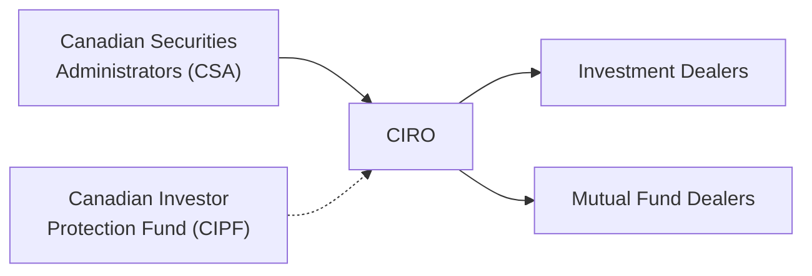

## 17.2 The Canadian Investment Regulatory Organization (CIRO)

Imagine you’re just getting comfortable with the idea that the financial services industry is regulated by a few separate organizations, each presumably doing its own thing. Then you find out that these organizations merge into a single self-regulatory body—and now you have to remember just one name instead of two. That’s (thankfully) the situation with CIRO, the Canadian Investment Regulatory Organization. It’s new, but it inherits deep expertise from its predecessor organizations and provides a unified, stronger approach to overseeing both mutual fund and investment dealers in Canada.

**Overview**

On January 1, 2023, the Mutual Fund Dealers Association of Canada (MFDA) and the Investment Industry Regulatory Organization of Canada (IIROC) joined forces, culminating on June 1 when the single self-regulatory organization became officially known as the Canadian Investment Regulatory Organization (CIRO). If you’ve been studying the Canadian regulatory scene for a while, you might remember references to the term “New SRO,” or you might still see references to the old IIROC and MFDA in historical documents. But, as of now, IIROC and MFDA no longer exist independently. CIRO is the one steering the ship, and trust me, it helps tidy up a lot of overlapping functions.

Before we dive deep, let’s highlight a major advantage of having CIRO: efficiency and convenience. Previously, a single firm that dealt with investment dealers and mutual fund dealers simultaneously might have had to engage with two separate regulators. That meant double the reporting, double the overhead, and sometimes double the confusion. Now, they just go to CIRO. This single point of contact helps streamline processes and reduces duplication of effort (and headaches).

Below, we’ll take a comprehensive look at CIRO—why it exists, what it does, and why any of it matters to mutual fund representatives, dealers, and investors. We’ll also share a few personal anecdotes, practical examples, a short case study, and a diagram to illustrate how CIRO fits into Canada’s broader financial regulatory framework.

**Historical Context: MFDA and IIROC**

For many years, Canadian mutual fund dealers were regulated by the MFDA, and investment dealers were regulated by IIROC. Each body had its own set of rules, compliance manuals, enforcement mechanisms, and membership requirements:

• The MFDA (Mutual Fund Dealers Association of Canada) oversaw dealers and representatives whose main business was dealing in mutual funds.  
• IIROC (Investment Industry Regulatory Organization of Canada) handled investment dealers (sometimes called broker-dealers) that engaged in broader capital markets activities, such as equity and fixed-income trading, underwriting, and more.

The existence of these two separate self-regulatory organizations (SROs) often made sense in the past. However, over time, as financial products and services converged, lines blurred. New players offered a combination of both mutual fund and investment-dealer services, or their product line-ups overlapped. That environment ultimately led to calls for a single SRO to reduce friction and confusion across the Canadian marketplace.

**The Emergence of CIRO**

CIRO was formed as a response to these demands for unification and efficiency. Though January 1, 2023 was the official date of amalgamation, the organization was renamed CIRO on June 1, 2023 to clearly define its new identity. Since that time, CIRO has taken on the full range of responsibilities that MFDA and IIROC individually handled:

• Overseeing market conduct standards and rules for both mutual fund dealers and investment dealers.  
• Setting and enforcing proficiency requirements for representatives.  
• Supervising trading conduct and operational practices to promote fairness, transparency, and compliance among markets and members alike.

If you’re curious, you can check out the official CIRO website at:  
[https://www.ciro.ca](https://www.ciro.ca)  
This is the single definitive resource for all rules, compliance notices, membership information, and bulletins that used to be scattered across (now defunct) MFDA and IIROC websites.

**Core Mandate and Objectives**

CIRO’s overarching mission is to protect investors by ensuring that Canadian financial markets operate with integrity and transparency. This mission is broken down into a few clear objectives:

• Ensuring investor protection and confidence in the market.  
• Setting uniform, consistent standards for all member firms—both the big, long-established investment dealers and the smaller mutual fund–focused shops.  
• Strengthening regulatory oversight and reducing duplication so that compliance doesn’t become a complex juggernaut.  
• Encouraging ongoing education and professional development among all representatives so that they can provide high-quality, up-to-date advice and service to clients.

**Why Does it Matter for Mutual Fund Representatives?**

If you sell mutual funds, you’re dealing with a product that inherently affects people’s precious savings and future security. CIRO ensures you have proper credentials and that your firm follows best practices. From an ethical standpoint, CIRO’s presence reminds professionals: “Hey, we have a responsibility to treat clients fairly, to know our products, and to ensure suitability.” And let’s be honest, having a single regulatory body helps avoid those awkward, confusing moments where you wonder if a certain set of rules belongs to the old MFDA or to something else.

More practically, CIRO’s consolidated approach can simplify your daily operational life as a mutual fund dealing representative. Your continuing education requirements, your compliance reporting, and your firm examinations get channeled under a single umbrella. Embracing this structure means spending less time toggling between parallel regulators or sets of guidelines, and more time doing what really counts: serving your clients well.

**Roles and Responsibilities Under CIRO**

When you think of a self-regulatory organization like CIRO, a few key roles and responsibilities come to mind:

• Developing and enforcing standards of practice: This includes establishing codes of conduct, proficiency requirements, operational guidelines, and market conduct rules.  
• Compliance oversight: CIRO monitors member firms in a variety of ways—through on-site and off-site reviews, periodic compliance sweeps, routine or special audits, and mandatory reporting obligations.  
• Enforcement: When there’s a breach, CIRO can discipline members or representatives. That discipline might include fines, suspensions, or even permanent bans if the misconduct is serious enough.  
• Policy-making: CIRO proposes new or revised rules and standards as needed. These proposals generally undergo stakeholder consultation and must also be approved by the Canadian Securities Administrators (CSA).  
• Investors’ best interests: CIRO’s entire reason for existence is, ultimately, to ensure that Canadian investors have confidence in the capital markets and can trust the professionals who serve them.  

**Compliance and Enforcement**

In day-to-day practice, CIRO’s compliance department is your best friend (or sometimes your stern teacher). Mutual fund dealers and their representatives must comply with numerous CIRO rules that aim to ensure fairness, transparency, and responsible behavior. Wondering how CIRO keeps everyone in check? Here’s a quick look:

• On-site compliance reviews: CIRO representatives might show up at your firm’s head office (or a branch office) to assess policies and procedures, client files, or how the firm supervises its representatives.  
• Off-site reviews: These are typically less invasive but might involve analyzing documents electronically or requesting written submissions from the firm.  
• Mandatory reporting: Member firms must promptly report certain events, such as a serious client complaint or internal disciplinary action taken against a representative.  
• Enforcement proceedings: If CIRO believes a standard or rule has been violated, an investigation may be launched. Cases can move to a formal hearing panel, which may impose sanctions if misconduct is proven.

**Proficiency Standards**

One of CIRO’s responsibilities is to make sure you know your stuff. The person assisting clients with mutual funds has to be competent—not just in terms of product knowledge, but also in understanding client objectives and applying ethical standards. That’s where proficiency standards step in. Representatives must meet certain educational and experience requirements, plus ongoing training obligations. CIRO’s rules in this area (subject to approval by the CSA) set the foundation for:

• Licensing-level education: Courses like the Canadian Securities Course (CSC®), the Conduct and Practices Handbook Course (CPH®), and other recognized educational pathways.  
• Experience: Some roles require specific years of relevant industry experience.  
• Continuing education: Maintaining your registration isn’t a one-and-done scenario. CIRO often mandates continuing education credits to keep your knowledge fresh.

**CIRO and the Canadian Securities Administrators (CSA)**

CIRO is overseen by the CSA, which is the umbrella organization of Canada’s provincial and territorial securities regulators. CIRO can propose new rules or changes to standards, but ultimately, the CSA has to sign off. This layered structure ensures that the SRO’s rules align with the broader goals of securities regulation in Canada—protecting investors, fostering fair and efficient markets, and reducing systemic risk.

**The Canadian Investor Protection Fund (CIPF)**

If you’ve been around the Canadian scene for a while, you’ve probably heard references to both the CIPF (Canadian Investor Protection Fund) and the MFDA IPC (Investor Protection Corporation). Perhaps you found it a bit confusing in the past, or maybe you just never dealt with claims so it didn’t come up. As of January 1, 2023, the MFDA IPC merged with CIPF, resulting in a single investor protection fund—CIPF—that covers customers of all CIRO member firms.

It’s important to know that CIPF is independent from CIRO. While CIPF works closely with CIRO, its role is to protect client assets (within specified limits) if a member firm becomes insolvent or otherwise fails. Although we all hope to never experience that scenario, CIPF’s existence helps strengthen confidence in Canada’s financial markets by reassuring investors that if a CIRO member firm were to fail, their assets are covered up to certain limits.

**Personal Anecdote: A Friend’s Relief**

I remember chatting with a friend who was a bit skeptical about investing. She asked, “What happens if the dealer I buy mutual funds from suddenly disappears? Do I lose my money?” When I shared that CIPF coverage would apply if it was a CIRO member firm that failed, she visibly breathed a sigh of relief. It’s surprising how many prospective investors worry about the doomsday scenario of their dealer vanishing, so letting them know there’s a protection fund in place can make all the difference.

**Practical Example: How CIRO Might Handle a Policy Breach**

Consider a hypothetical scenario where a member firm’s representative systematically fails to update client investment profiles. Now, ignoring or neglecting the Know Your Client (KYC) rule is a major no-no. In such a case, CIRO might:

• Investigate and gather details, requesting client files and internal memos.  
• If the violation is substantiated, lay charges under the relevant CIRO rules.  
• Proceed to a hearing, where the representative could face penalties. These might include a fine, an order for remedial training on KYC obligations, or even a suspension.  

This demonstrates how CIRO’s enforcement pipeline works to ensure clients’ interests come first and that anyone stepping out of line is held accountable.

**Case Study: A Mid-Sized Mutual Fund Dealer Adjusting to CIRO**

Let’s say a mid-sized mutual fund dealer who operates in multiple provinces used to incorporate MFDA guidelines, occasionally referencing IIROC’s bulletins for best practices in risk disclosure. When CIRO came into existence, that firm had to consolidate its compliance manuals, reconcile differences in references (e.g., updated forms and processes), and refile certain documents under the new name.

At first, it might have seemed overwhelming: “Now we have a single body, but we have to rewrite half of our compliance materials?” But ultimately, the result streamlined their approach and simplified training new representatives. Instead of having two sets of bulletins and references, everything points to CIRO’s resources, which actually reduced their administrative overhead. That’s the kind of efficiency synergy CIRO is aiming to foster.

**Diagram: Where CIRO Fits in the Wider Regulatory Picture**

Below is a simple Mermaid.js diagram showing the relationship between the CSA, CIRO, dealer members, and CIPF. Notice how CIPF stands apart but still interacts closely with CIRO:

• The CSA, representing all provincial and territorial regulators, oversees and approves CIRO’s major policies.  
• CIRO in turn supervises and regulates all approved member firms (both investment dealers and mutual fund dealers).  
• CIPF, while independent, works to protect clients of CIRO member firms if a firm becomes insolvent.

**Tips for Representatives Working Under CIRO**

• Keep your knowledge current: Stay up to date with CIRO bulletins, compliance notices, and educational materials.  
• Document thoroughly: Whether it’s compliance training, KYC updates, or trade supervision, good recordkeeping is crucial if you ever need to show regulators you followed protocol.  
• Embrace the streamlined approach: If you used to juggle both MFDA and IIROC references, be sure to unify them under the new CIRO guidelines (which may incorporate aspects of both).  
• Communicate effectively: When in doubt about a new rule or standard, ask compliance or check the official CIRO website. It’s better to clarify early than adjust after a misstep.

**Common Pitfalls and How to Avoid Them**

• Ignoring transitional notices: In the early phases of CIRO’s creation, it was easy to miss transitional bulletins that replaced old MFDA or IIROC references. Make sure to read all transitional and updated notices so your policies align with the new rules.  
• Overlooking continuing education requirements: Some mutual fund representatives occasionally forget about mandatory continuing education under the assumption it’s “just the same old MFDA stuff.” As CIRO updates proficiency requirements, you need to adapt.  
• Lax culture around investor protection: It’s tempting to assume the new single SRO means less scrutiny. Actually, because CIRO is single-minded in its oversight, the process may be even more thorough. Maintain a consistent culture of compliance and accountability.

**Additional Resources for Further Exploration**

• **CIRO Website**: [https://www.ciro.ca](https://www.ciro.ca) for the latest rules, membership advisories, and compliance resources.  
• **Canadian Securities Administrators (CSA)**: [https://www.securities-administrators.ca](https://www.securities-administrators.ca) to learn more about Canada’s umbrella regulatory structure.  
• **CIRO Compliance Manuals and Bulletins**: Check the “Members” or “Notices” sections on CIRO’s website for an up-to-date view of compliance requirements.  
• **Open-Source Financial Tools**: Platforms like the Canadian open data portal (e.g., [https://open.canada.ca](https://open.canada.ca)) occasionally provide insight into market statistics and data that can complement your compliance research.  

**Final Thoughts**

In the grand scheme of Canada’s financial universe, CIRO is a positive step forward, creating a single, more efficient SRO that can tackle market oversight holistically. For mutual fund dealers and representatives, this means consistent standards across the board, streamlined compliance, and enhanced investor protection. With CIPF standing by—ready to protect clients’ assets should a firm become insolvent—investors can trust that Canada’s regulatory scaffolding is comprehensive and robust.

That said, this new unified space also ensures that if you’re not following the rules, you can’t hide behind complexities and bureaucratic silos anymore. CIRO’s oversight is wide-ranging, so transparency and accountability are more critical than ever. But if you approach your practice with integrity, keep your knowledge sharp, and follow ethical best practices, you’ll find that working within CIRO’s framework is a significant plus for both you and your clients.

Anyway, the bottom line: The creation of CIRO marks an exciting evolution in Canada’s financial regulatory environment. It’s a development that encourages you to stay nimble, well-informed, and thoroughly committed to your clients’ financial well-being.

---

## Boost Your Mastery of CIRO: Mutual Fund Dealer Regulation Quiz



### CIRO was formed through the amalgamation of which two organizations?

- [x] The Mutual Fund Dealers Association (MFDA) and the Investment Industry Regulatory Organization of Canada (IIROC)
- [ ] The Canadian Investor Protection Fund (CIPF) and the MFDA
- [ ] The Canadian Securities Administrators (CSA) and CIPF
- [ ] The Financial Services Regulatory Authority (FSRA) and IIROC

> **Explanation:** CIRO resulted from merging the MFDA and IIROC. The new entity consolidates oversight of both mutual fund and investment dealers.

### What is one primary objective of CIRO as it relates to the Canadian financial marketplace?

- [ ] Eliminating all regulations for investment products
- [x] Ensuring investor protection and confidence
- [ ] Preventing companies from going public
- [ ] Promoting only mutual fund products

> **Explanation:** CIRO focuses heavily on investor protection, market integrity, and overall confidence in the financial system.

### Which entity ultimately approves any new or amended rules CIRO proposes?

- [ ] The Canadian Investor Protection Fund (CIPF)
- [ ] The former IIROC leadership
- [x] The Canadian Securities Administrators (CSA)
- [ ] The federal government

> **Explanation:** While CIRO crafts regulatory proposals, the CSA exercises final authority on whether these proposals become enforceable rules.

### In the context of CIRO, what does “enforcement” entail?

- [ ] Automatically suspending all new registrants
- [x] Investigating, charging, and penalizing firms or representatives for non-compliance
- [ ] Directly imprisoning representatives who make errors
- [ ] Taking over the management of member firms

> **Explanation:** Enforcement includes investigating breaches of rules and imposing discipline as necessary. Penalties can include fines, suspensions, or bans, but not criminal sentencing.

### Which description best fits the relationship between CIRO and CIPF?

- [x] CIPF is an independent fund protecting client assets of CIRO member firms in case of insolvency
- [ ] CIPF sets compliance standards for member firms
- [x] CIPF merged with the MFDA IPC, creating a single investor protection fund
- [ ] CIPF supervises the corporate governance of CIRO itself

> **Explanation:** CIPF covers client assets in case of insolvency and is separate from CIRO, although the two entities work closely. CIPF resulted from merging with the MFDA IPC.

### How does CIRO conduct compliance monitoring of its member firms?

- [x] Through on-site and off-site reviews, compliance sweeps, and mandatory reporting
- [ ] By delegating all monitoring to CIPF
- [ ] By only conducting investigations upon media requests
- [ ] By limiting reviews to firms with fewer than 50 employees

> **Explanation:** CIRO oversees members through various means, including scheduled reviews, spot checks, and required reporting to ensure continuous compliance.

### What happens if a CIRO member firm fails financially?

- [x] CIPF coverage may apply to protect client assets, subject to set limits
- [ ] CIRO automatically becomes the new asset manager
- [x] CIPF denies all claims from the firm’s clients
- [ ] CSA takes over the losses from its own funds

> **Explanation:** CIPF provides coverage for eligible client assets if a member firm dissolves or fails, protecting investors within defined limits.

### Which statement about CIRO’s proficiency standards is correct?

- [x] Representatives must meet certain educational and ongoing training requirements
- [ ] Rules are enforced without approval by the CSA
- [ ] Only a single exam is required without further upkeep
- [ ] Representatives cannot be disciplined for failing continuing education

> **Explanation:** CIRO sets proficiency standards, subject to CSA approval, and mandates continuing education to ensure that representatives remain competent over time.

### Why might a merged SRO framework—like CIRO—be more efficient for member firms?

- [x] It streamlines reporting, avoids overlapping processes, and simplifies compliance
- [ ] It focuses only on large firms with high revenue
- [ ] It reduces the rules that apply to investor protection
- [ ] It encourages the duplication of forms and references

> **Explanation:** Having a single SRO avoids duplication of efforts and confusion around differing rules, simplifying the compliance process for members.

### CIRO’s primary goal includes:

- [x] True
- [ ] False

> **Explanation:** Absolutely true. CIRO’s cornerstone is investor protection, which provides a stable environment for both markets and participants.


