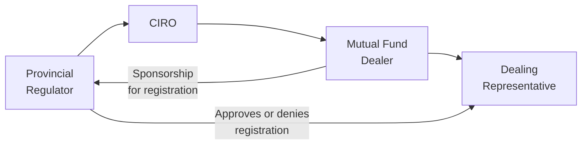

## 17.3 Registration Requirements

Picture one of your first days in a new job, maybe the ink on your certifications is still drying, and you realize there’s a mountain of requirements to satisfy just to start talking with clients. It can feel overwhelming: Which courses are mandatory? Where do I register first? Why so many rules? I remember going through that process, and, at times, it felt like a never-ending loop of paperwork. But the truth is—these requirements exist to protect your future clients, the stability of Canadian financial markets, and, yes, your own professional standing. So, let’s dive into the details.

Registration is a formal process that ensures only qualified individuals, who have met specific educational and ethical standards, can offer financial advice or products to the public. In Canada, mutual fund advisors and dealers must comply with both provincial or territorial securities commissions’ rules and the requirements of the Canadian Investment Regulatory Organization (CIRO). This synergy between government regulation and self-regulatory oversight helps maintain a trustworthy industry where investors can feel confident seeking advice.

---
  
### The Role of CIRO in Registration

If you're new to the Canadian securities scene, you may have heard older references to the Mutual Fund Dealers Association of Canada (MFDA) or the Investment Industry Regulatory Organization of Canada (IIROC). These were once two separate self-regulatory organizations. But since January 1, 2023, they've been amalgamated—poof!—turning into the Canadian Investment Regulatory Organization (CIRO). As of June 1, 2023, CIRO is the new national self-regulatory organization in Canada for investment dealers, mutual fund dealers, and markets oversight.

CIRO’s all-encompassing mandate means that mutual fund dealers have a single, unified self-regulatory body to work with. The same is true for you if you’re a mutual fund dealing representative (still often referred to as a “mutual fund salesperson”). Your membership with CIRO ensures you align with national standards. This single SRO model aims to simplify things, but it still requires adherence to the myriad registration requirements that keep everyone on the level.

---
  
### The Legal Framework and National Instrument 31-103

In Canada, the primary set of regulatory guidelines for registering individuals and firms is National Instrument (NI) 31-103, titled “Registration Requirements, Exemptions and Ongoing Registrant Obligations.” It’s enforced by the Canadian Securities Administrators (CSA), a coordinating body composed of provincial and territorial securities regulators (e.g., the Ontario Securities Commission (OSC), the Alberta Securities Commission (ASC), and so on).

So, whenever we talk about “registration,” we’re referencing these legal obligations:

• Minimum proficiency standards (i.e., you must complete certain industry courses to show you’re knowledgeable enough).  
• Financial solvency requirements (i.e., minimum capital levels for dealers).  
• Business conduct requirements (i.e., how you must treat clients, handle conflicts of interest, etc.).  

Since each province and territory is responsible for its own securities regulation, you might need to become familiar with local requirements as well. That said, NI 31-103 does a solid job of unifying the fundamentals across the country.

---
  
### Why Registration Matters

Some folks wonder, “Why do we need to fill out so many forms and prove so many things?” In short:

• Protecting Investors: Registration ensures that only qualified individuals can give advice or sell mutual funds.  
• Maintaining Integrity: By adhering to these rules, the industry cultivates trust among investors.  
• Enhancing Credibility: Registration is like having a professional stamp of approval. It shows you’re vetted and you adhere to high standards of conduct.

When you meet clients or prospective clients, you want them to feel at ease. If they ask, “Hey, are you actually allowed to do this?” you can proudly say, “Oh, absolutely. I’m registered with CIRO and the securities commissions.”

---
  
### Registration Categories for Mutual Fund Dealers

Under CIRO rules (supported by NI 31-103), mutual fund dealers and their representatives (often called “dealing representatives”) must be registered in the categories that reflect the duties they perform. In practice, you’ll see these common categories:

#### Dealing Representative (Mutual Funds)
This is the front-line license for someone looking to sell or provide advice on mutual funds. To register as a dealing representative, you typically must complete fundamental courses, such as the Investment Funds in Canada (IFC) course or an equivalent recognized by CIRO. You must also comply with any ongoing professional development or continuing education requirements.

To give you a real-world scenario: Let’s say you just finished the IFC exam and you want to join a mutual fund dealer firm. You’d apply to the securities commission(s), fulfill the proficiency and background checks, and then you’d be placed on the dealer’s registration. Once approved, you can legally advise clients and trade in mutual funds under that dealer’s banner.

#### Ultimate Designated Person (UDP)
We all know that in any company, especially one dealing with money, you need someone at the helm making sure everything runs ethically and responsibly. That’s the Ultimate Designated Person. This is typically the most senior officer of the dealer, such as the CEO. The UDP is directly responsible for promoting a culture of compliance within the firm, ensuring that everyone from top to bottom follows securities laws and CIRO rules.

#### Chief Compliance Officer (CCO)
While the UDP is the ultimate overseer, the Chief Compliance Officer is the technical compliance guru. The CCO maintains and monitors policies and procedures, ensuring each representative is up to date on compliance issues, product rules, advertising standards, and more. They’re also your go-to when you have any compliance-related questions or concerns. If you’re a dealing representative and you want to know if a certain practice is allowed, you’d typically check with your CCO.

---
  
### Fitness for Registration

One phrase you’ll hear from regulators is “fitness for registration.” It’s the notion that you must be suitable—both ethically and financially—to hold a registration. Fitness typically includes:

• **Good Character:** If you have a history of criminal activity, fraud, or serious compliance violations, that’s a problem.  
• **Reputation:** Past involvement with rogue firms or unsettled legal disputes can impede your path.  
• **Financial Solvency:** You should be financially stable. Excessive personal debt or bankruptcy might raise concerns with the regulator about your trustworthiness when handling client funds.  

Think of it this way: The regulators want to ensure no shady characters are out there dealing with investors’ money. This is all about nurturing public trust in the system.

---
  
### Capital Requirements for Dealers

Complying with capital requirements is a big factor for mutual fund dealers. The essence is that a dealer must maintain sufficient financial resources to meet its liabilities and potential regulatory costs. Regulators want to be confident that if something goes awry—move over, 2008 meltdown vibes—the firm can still honor its obligations. Insufficient capital risks potential defaults or insolvencies, which in turn jeopardize client assets.

If you’re a dealing representative opening your own firm or moving up the ranks to senior leadership, you’ll have to deal with these capital thresholds set out in securities legislation and supplemented by CIRO rules. This requirement also ties into the broader discussions of risk management and compliance responsibilities covered in earlier chapters of this book (see Chapter 17.2, “The Canadian Investment Regulatory Organization (CIRO)”).

---
  
### Insurance or Bonding Requirements

Similar to how you might carry auto insurance before hitting the road, mutual fund dealers must have fidelity bonds or insurance. This coverage protects against potential financial misdeeds like fraud, theft, or embezzlement by someone in the firm. It’s one more bulwark ensuring client funds remain secure, even if a worst-case scenario unfolds.

---
  
### Practical Walkthrough: Setting Up Your Registration

Let’s imagine you’ve just landed an offer at a mutual fund dealer in Ontario. Your to-do list might look like this:

1. Successfully pass your required licensing course (e.g., IFC).  
2. Submit supporting documents (like transcripts or certificates) and your personal information to the Ontario Securities Commission (OSC).  
3. Have your sponsoring firm (the mutual fund dealer) support your registration application, verifying your position and responsibilities.  
4. Undergo background checks. You usually need to disclose any past bankruptcies, criminal convictions, or regulatory actions.  
5. Wait for the all-clear. Once your application is approved, you’re legally authorized to conduct mutual fund business.  

A tip: If you plan to deal across multiple provinces—let’s say Ontario, Alberta, and British Columbia—your dealer will usually work with each of those provincial regulators to secure your registration in each jurisdiction. This is often done through the National Registration Database (NRD), a Canada-wide electronic system that helps keep track of who’s registered and where.

---
  
### Interplay with Know Your Client (KYC) and Suitability

One of the biggest reasons for these registration requirements is to ensure that when a mutual fund representative meets a client, they’ll do so with the knowledge and ethics needed to provide suitable advice. Chapter 17.4 goes into the KYC (Know Your Client) rule in detail, but in short, you can’t diligently advise on suitable investments if you haven’t first demonstrated your own qualification. This underpins the logic: stronger registration standards lead to better-informed advisors, which leads to better advice for clients.

---
  
### Additional Regulatory Considerations

Registration is not a one-and-done. Ongoing obligations keep you on top of your game:

1. **Continuing Education**: Regular courses, seminars, or updates to ensure you’re up-to-date on new products, regulatory changes, and best practices.  
2. **Annual Filings**: Firms and individuals must often file annual renewals or attestations to maintain registration.  
3. **Reporting Obligations**: If a big personal or professional change happens (like a bankruptcy proceeding or new directorship at a company), you usually need to let both CIRO and your provincial regulator know promptly.

---
  
### Real-World Case Example: Registration Failure

Let’s say Jane, a prospective dealing representative, had a minor theft conviction 10 years ago. She fails to disclose it on her registration application because she feels it was so long ago that nobody would notice. However, the securities commission spots it after running a background check. Because of this omission, they deny her application. Not necessarily because she had a record (although that can be an issue), but primarily because she didn’t disclose it. This example highlights the importance of transparency. The moral of the story? Be upfront; it’s better to have the regulator weigh the situation honestly than to risk your entire career with an omission.

---
  
### A Visual Overview of the Registration Process

Below is a simple Mermaid diagram that might help you visualize the flow of registration for mutual fund dealers and their representatives:

In this diagram:

• “Provincial Regulator” refers to organizations like the OSC, ASC, BCSC, etc.  
• “CIRO” is the self-regulatory organization that sets proficiency and conduct rules.  
• “Mutual Fund Dealer” is the firm you join, providing sponsorship for your application.  
• “Dealing Representative” is you, the individual obtaining registration to sell/advice on mutual funds.

---
  
### Glossary

Let’s restate some key terms:

• **Registration:** The formal authorization process, administered by securities regulators, allowing individuals or firms to carry on specific financial activities.  
• **Dealing Representative:** A licensed individual authorized to advise on and/or trade in mutual funds under a registered dealer.  
• **Ultimate Designated Person (UDP):** The top officer responsible for ensuring the entire firm’s compliance.  
• **Chief Compliance Officer (CCO):** The individual managing, monitoring, and educating firm representatives on compliance standards.  
• **National Instrument 31-103:** A unifying regulation that spells out core registration requirements and compliance obligations across all Canadian jurisdictions.  
• **Fitness for Registration:** The regulator’s assessment of an individual’s or firm’s good character, reputation, financial solvency, and overall suitability.  
• **Capital Requirements:** Minimum capital levels mutual fund dealers must maintain to ensure financial stability.  
• **Insurance/Bonding:** A protective measure to cover potential losses arising from fraud, theft, or error.  

---
  
### Best Practices and Common Pitfalls

• **Be Thorough and Honest**: Always disclose relevant past infractions or financial issues. Regulators value honesty, and the consequences of dishonesty are severe.  
• **Stay Current on Education**: Regulations evolve. Completing continuing education keeps you informed and can shield you from unintentional breaches.  
• **Build a Solid Relationship with Compliance Staff**: The CCO and compliance team aren’t there to police you; think of them as your safety net. They help you avoid mistakes that could derail your career.  
• **Keep an Eye on Provincial Variations**: Even though NI 31-103 is intended for national application, certain provinces might have unique twists or additional forms. Don’t assume everything is identical from one province to another.  

---
  
### References for Further Exploration

When you feel ready to dig deeper, consult these official resources:

• [National Instrument 31-103 (CSA)](https://www.osc.ca/en/securities-law/instruments-rules-policies/3/31-103)  
• [CIRO Proficiency Requirements and Registration FAQs](https://www.ciro.ca/)  
• [Canadian Securities Administrators (CSA) Registration Resources](https://www.securities-administrators.ca/)  

Additionally, keep an eye on your local securities commissions’ websites. They frequently publish notices, updates, and guidelines that can be crucial to your practice. You may also want to explore open-source financial tools or frameworks for compliance management—some dealers use specialized software to track continuing education, fee calculations, or changes to KYC information in real time.

---

You’ve made it through registration requirements without (hopefully) falling asleep! The process might sound unapologetically bureaucratic sometimes, but it’s vital for maintaining integrity and investor trust in the financial markets. By understanding these rules and following them, you set the stage for a successful, reputable career in mutual fund distribution.

Now, you’re all warmed up for deeper regulatory content and insights. Our next sections (e.g., 17.4 “How Representatives and Dealers Meet the Know Your Client (KYC) Rules”) will show just how essential your qualification and registration background is when tailoring suitable investment solutions for your clients.

Stay curious, keep asking questions, and remember—compliance isn’t just about checking boxes; it’s a key part of your professional identity.  

---

## Mutual Fund Dealer Registration Quiz: Test Your Knowledge



### 1. Which primary regulation sets out the minimum proficiency and business conduct standards for registration in Canada?

- [ ] National Instrument 81-102
- [x] National Instrument 31-103
- [ ] National Instrument 45-106
- [ ] National Policy 11-203

> **Explanation:** National Instrument 31-103 covers key registration requirements, exemptions, and continuous obligations.

### 2. CIRO (Canadian Investment Regulatory Organization) became effective on:

- [ ] January 1, 2022
- [ ] December 31, 2022
- [x] June 1, 2023
- [ ] January 1, 2025

> **Explanation:** CIRO replaced the MFDA and IIROC with its official naming effective June 1, 2023.

### 3. Who is typically responsible for promoting a culture of compliance within a mutual fund dealer?

- [ ] The Dealing Representative
- [x] The Ultimate Designated Person (UDP)
- [ ] The Branch Manager
- [ ] The Investor

> **Explanation:** The UDP, usually a high-ranking executive, ensures compliance culture is fostered across the firm.

### 4. Why is “fitness for registration” such an important concept?

- [ ] It’s primarily about maximizing sales quotas
- [ ] It allows dealing representatives to avoid paying taxes
- [ ] It’s only necessary for large dealers
- [x] It ensures applicants have good character and financial stability

> **Explanation:** Regulators assess good character, reputation, and solvency to protect the industry and the public.

### 5. Which of the following is a requirement for mutual fund dealers regarding capital?

- [x] They must meet minimum capital levels to ensure financial integrity.
- [ ] They only need to hold 1% of their investors’ funds in reserve.
- [x] They must also have insurance or bonding coverage.
- [ ] They are exempt from any capital requirement.

> **Explanation:** Mutual fund dealers must meet minimum capital requirements and maintain adequate insurance/bonding.

### 6. Which individual is tasked with setting up and monitoring compliance policies?

- [ ] The Head of Human Resources
- [ ] The Branch Manager
- [x] The Chief Compliance Officer (CCO)
- [ ] The Chief Financial Officer (CFO)

> **Explanation:** The CCO oversees day-to-day compliance, ensuring the firm meets all regulatory obligations.

### 7. True or False: Registration is a one-time requirement with no ongoing obligations.

- [ ] True
- [x] False
- [ ] It depends on which province you’re in
- [ ] Only applicable if you’re a sole proprietor

> **Explanation:** Registration is ongoing and requires continuous filings, renewals, and compliance checks.

### 8. What is the main reason for carrying insurance or bonding as a mutual fund dealer?

- [ ] To boost annual revenue
- [ ] To allow dealing representatives to trade in foreign markets
- [x] To protect client assets against fraudulent or negligent acts
- [ ] To satisfy only the marketing department’s requirements

> **Explanation:** Insurance or fidelity bonding covers potential losses from employee misconduct, fraud, or errors.

### 9. Which statement is TRUE about a dealing representative?

- [x] They must complete recognized courses like the IFC and have their registration sponsored by a dealer.
- [ ] They can operate independently without a sponsoring dealer.
- [ ] They are permitted to sell securities beyond mutual funds.
- [ ] They do not need to register with a provincial regulator.

> **Explanation:** A dealing representative in mutual funds must pass an accredited course and be sponsored by a registered dealer.

### 10. The acronym “KYC” in the financial services context stands for “Know Your Client.”

- [x] True
- [ ] False

> **Explanation:** KYC refers to the obligation to fully understand a client’s financial situation, investment knowledge, and objectives.


