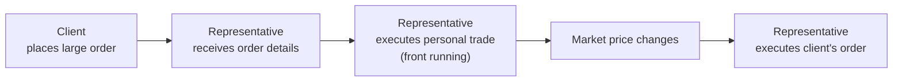

## 17.6 Prohibited Selling Practices

Picture this: A friend of mine, who worked at a small investment firm, told me about a colleague who would call clients incessantly, pushing them to trade every few weeks—sometimes even more frequently—just to rack up commissions. The friend suspected something fishy was going on, and guess what? They were right. The representative was eventually investigated for churning. Unfortunately, stories like these aren’t isolated incidents. They’re cautionary tales about why regulators pay close attention to certain harmful actions that can compromise investor protection and the broader integrity of the financial system.

Prohibited selling practices are not just arbitrary rules—they form the bedrock of ethical and legal standards in the Canadian securities industry. In this section, we’ll look at how these practices are defined, their real-world implications, and the consequences for those who cross the line. We’ll also explore ways to prevent these infractions from happening in the first place. By the end, you’ll hopefully have a solid sense of what to watch out for, how to maintain ethical practices, and why it all matters to both advisors and clients.

### The Importance of Prohibited Practices from a Regulatory Perspective
Whether you’re new to the industry or an experienced pro, you’ve probably heard plenty of cautionary advice about sticking to the rules. In Canada, the overarching regulatory environment is guided by several layers of oversight:

• Provincial securities commissions (e.g., Ontario Securities Commission, Autorité des marchés financiers in Quebec, British Columbia Securities Commission).  
• The Canadian Investment Regulatory Organization (CIRO), which as of June 1, 2023, oversees disciplines and rules that were historically handled by IIROC and the MFDA.  
• National Instruments such as NI 31-103, dealing with registration requirements, exemptions, and ongoing registrant obligations.  

It all boils down to safeguarding clients and promoting market integrity. The rationale behind prohibiting these practices is to ensure that people who entrust their life savings and future goals to financial professionals aren’t taken advantage of. After all, trust is the currency of the financial services industry.

### Key Prohibited Practices

#### Churning
Churning is essentially excessive trading in a client’s account for the sole purpose of generating commissions. It’s a blatant breach of both ethical and regulatory standards. Keep in mind that it’s not about the sheer number of trades alone. Instead, regulators usually look at whether the trades align with the client’s suitability profile, risk tolerance, investment objectives, and time horizon.

• Example: Imagine a retired client whose main goal is to preserve capital, yet their representative is buying and selling securities every couple of days. The commissions skyrocket, but the account performance stays flat or diminishes. This discrepancy often raises red flags for regulators.

• Why It’s Prohibited: Churning compromises the client’s best interests and enriches the representative or dealer instead. It can deplete an investor’s returns and damage faith in the financial system.

• Regulatory Basis: Under NI 31-103, registrants are expected to act fairly, honestly, and in good faith with clients. Churning runs directly counter to these principles.

#### Unauthorized Trading
This is when a representative executes trades in a client’s account without getting prior express consent or without having discretionary authority to do so. Sometimes it can stem from oversight or miscommunication, but it can also be a deliberate attempt to manage an account or place trades without the client’s knowledge.

• Example: Let’s say an advisor believes a particular stock is about to “pop,” but the client is on vacation, unreachable by phone or email. The advisor, convinced they know best, goes ahead and buys the stock on the client’s behalf. Even if the trade ends up being profitable, it’s still unauthorized trading and is strictly prohibited unless they had prior discretionary authority in writing.

• Why It’s Prohibited: Clients have autonomy over their investments. Representatives must get proper approval to proceed with a transaction. Doing otherwise undermines the trust in the advisor-client relationship and could lead to claims of negligence or fraud.

• Regulatory Basis: CIRO rules require that all trades must be appropriately authorized. Even historically under IIROC or the MFDA, unauthorized trading was one of the foremost triggers for disciplinary action.

#### Misrepresentation
Misrepresentation involves providing false or misleading information about an investment or omitting critical material facts. This can include understating risks, overstating potential returns, or failing to disclose hidden fees (among other sneaky tactics).

• Example: A representative might emphasize only the upside of a complex debt instrument, painting an overly rosy picture, while conveniently leaving out the product’s illiquidity or penalty fees. The client invests based on inaccurate information and faces unforeseen losses.

• Why It’s Prohibited: Clients rely on honest, full disclosure to make informed decisions. Misinformation can lead to ill-informed investment choices, often with damaging financial consequences.

• Regulatory Basis: Provincial Securities Acts mandate transparency. If a representative knowingly or recklessly misleads clients, severe disciplinary action can follow, including fines or suspension.

#### Tied Selling
Tied selling happens when the purchase of one financial product is made conditional on the purchase of another. Banks or other financial institutions might occasionally be tempted to blend offerings in a way that disadvantages clients.

• Example: A financial institution might say, “Sure, we can approve your mortgage, but only if you also invest a certain amount in this mutual fund we’re offering.” Unless there’s a recognized linked product arrangement (like certain insurance-banking bundles that are permitted under law), this practice is frowned upon and regulated heavily.

• Why It’s Prohibited: Clients should have the freedom to choose products separately. When tying them together, it can limit competition and push clients into products they don’t necessarily want or need.

• Regulatory Basis: Canadian regulators, including provincial regulators, clearly outline tied selling restrictions to ensure that clients are not coerced or forced into unwanted products. NI 31-103 includes provisions that restrict forcing one product as a condition for another.

#### Front Running
Front running occurs when a representative becomes aware of an upcoming large client order (one that might influence the market price of the security) and then trades that security in their personal account or for another favored account. After the client’s big order moves the market price, the representative can potentially reap personal gain.

• Example: Suppose a portfolio manager knows that a major institutional client is about to purchase a massive volume of shares in Company XYZ. The manager quickly snaps up shares in their personal account before the big trade hits the market. When the institution’s large purchase drives the share price up, the manager sells their shares at a profit.

• Why It’s Prohibited: It exploits privileged information about a client’s trading intentions and directly harms market integrity. Think about it: if people lose faith that trades are done fairly, or suspect the markets are rigged by insiders, the system fails at its core purpose.

• Regulatory Basis: Similar to insider trading, front running is severely penalized under both provincial laws and CIRO rules. Historically, IIROC enforcement and MFDA guidelines also condemned front running wholeheartedly.

### Real-World Regulatory Enforcement and Penalties
Violations of these rules can bring hefty consequences—financially and reputationally. CIRO has a track record (including decisions inherited from the MFDA and IIROC) of imposing:

• Fines that can range from thousands to millions of dollars, depending on severity.  
• Suspension of registration for months or even years.  
• Permanent bans from the industry if the misconduct is deemed severe enough.

Think about a scenario: The first time I heard about an advisor being banned for life, I was stunned. But then I realized that an advisor who repeatedly breaks client trust undermines the entire profession. Regulators, with public support, take these practices seriously to protect everyday investors.

Modern data analytics and reporting systems make it easier for compliance departments and regulators to detect suspicious activities such as churning or large-scale unauthorized trading. If irregularities appear, the subsequent investigations can be thorough and swift.

### Supervisory Systems and Prevention
Mutual fund dealers are required to maintain tight oversight. This means implementing robust supervisory systems, compliance training, and even automated trade surveillance solutions to detect anomalies in:

• Account turnover rates (helps identify potential churning).  
• Trading patterns that deviate from normal client behavior (possibly unauthorized trades).  
• Representative personal accounts which might indicate front-running.  
• Consistent, clear communication with clients about any material changes to product terms, fees, or risks (alleviating misrepresentation concerns).

Financial firms often require newly hired representatives to attend mandatory compliance sessions. These sessions typically detail a range of no-go scenarios, from forging signatures on a trade authorization to promising guaranteed returns on high-risk equity funds. The idea is always to educate and deter misconduct while reinforcing a client-first ethos.

### Case Study: A Hypothetical Look
Let’s walk through a hypothetical scenario that blends several prohibited practices:

Jordan is a newly licensed representative at a mid-sized dealer. He’s eager to impress his manager, so he aggressively cold-calls his existing client base. He persuades them to sell and buy new funds every month or so, boasting about “new opportunities” but never actually verifying suitability. Clients decide to trust him because he sounds knowledgeable on the phone. Unbeknownst to them, Jordan is raking in commissions on each trade—textbook churning.

One day, a major institutional client places a large buy order for an emerging markets fund. Jordan, seeing the potential for the fund to spike in value, quietly buys the same fund in his personal account before placing the client’s trade. That is front running.

Meanwhile, Jordan also starts telling prospective clients that the funds in question carry no fees beyond a simple management expense ratio, but conveniently fails to mention the deferred sales charges or short-term trading fees that can apply. That’s misrepresentation, amplifying his wrongdoing.

Eventually, the firm’s compliance department flags suspiciously frequent trades in Jordan’s clients’ accounts. They also notice an unusual pattern in Jordan’s personal trading. Investigations ensue, and Jordan is found to have committed churning, front running, and misrepresentation. This leads to a CIRO hearing, culminating in a significant fine, suspension, and possible permanent ban.

### Visualizing the Process of a Prohibited Trade

Below is a simplified flowchart using Mermaid.js to show how front running might occur. Notice how the representative first receives insider knowledge, then trades on it, and only afterward executes the client’s order.

From this visual, you can see how a representative might slip in a personal trade. That’s exactly the kind of practice regulators aim to detect and punish.

### Comparing the Key Prohibited Practices

Below is a quick reference table highlighting some of the main features of each prohibited practice:

| Prohibited Practice | Description                                       | Harm to Client                                    | Regulatory Action                           |
|---------------------|---------------------------------------------------|---------------------------------------------------|---------------------------------------------|
| Churning           | Excessive trading to earn commissions             | Erodes returns, undermines trust                 | Fines, suspensions, permanent ban possible  |
| Unauthorized Trading| Trading without client consent or discretion     | Loss of autonomy, potential financial loss        | Fines, suspensions, permanent ban possible  |
| Misrepresentation  | Providing false/inaccurate information            | Misleads client choices, possible losses         | Fines, suspensions, permanent ban possible  |
| Tied Selling       | Conditioning one product on another               | Limits competition, manipulates product choice    | Fines and regulatory enforcement            |
| Front Running      | Trading ahead of a client’s market-moving order   | Unethical personal gain, skewed market prices     | Significant fines, bans, possible criminal  |

### Best Practices for Representatives
• Always obtain clear and explicit instructions from clients before executing trades.  
• Maintain thorough records of client communication and approvals to avoid any misunderstanding.  
• Disclose all relevant fees, risks, and product details to ensure you’re never hiding key information.  
• Keep personal trading accounts and activities absolutely transparent, ideally monitored by compliance officials.  
• Proactively ask yourself, “Would this pass scrutiny if someone discovered it tomorrow?” If the answer is no, you shouldn’t be doing it.

### Best Practices for Firms
• Provide ongoing compliance and ethics training for all representatives.  
• Employ robust trade surveillance software for early detection of questionable trading patterns.  
• Encourage a whistleblower culture where employees can communicate suspicious activities without fear of reprisal.  
• Maintain thorough internal audits and oversight protocols, regularly reviewing all compliance operations.

### Additional Resources and References
• CIRO Enforcement Case Summaries:  
  Visit https://www.ciro.ca/ to learn about the latest enforcement cases, disciplinary decisions, and industry guidance.  
• Provincial Securities Acts:  
  Each province has its own securities legislation (e.g., Ontario Securities Commission [OSC], British Columbia Securities Commission [BCSC]). Check their websites for relevant acts and regulations.  
• National Instrument 31-103:  
  Specifically addresses registrant obligations, prohibited practices, and conduct rules.  
• Open-Source Financial Tools and Analytical Frameworks:  
  Tools like R or Python-based libraries can help compliance departments analyze massive datasets to detect potential churning or front running trends.  

When in doubt, consult with regulatory counsel or a seasoned compliance officer. They can interpret nuanced areas of the law and help safeguard you—and your clients—from these pitfalls.

### Conclusion
At the heart of it all, these prohibited practices can seem like a laundry list of “don’ts.” But if there’s one major takeaway, it’s that the financial industry thrives on trust and transparency. By conscientiously serving clients and diligently adhering to regulations, you’re not just ticking boxes for compliance. You’re earning the long-term confidence of your clients and preserving the reputation of the industry.

Yes, the rules can feel overwhelming, especially for those just starting out. But each rule, from the ban on churning to the clampdown on tied selling, was created with the investor’s best interest in mind. In the end, a well-informed representative who avoids these pitfalls is an industry asset—helping clients achieve their goals in a safe, ethical environment.

If you ever catch yourself hesitating over whether something might be considered a prohibited practice, take a step back and consult with compliance or a mentor. It’s always better to err on the side of caution than to risk fines, suspensions, or, worse, a permanent ban. It’s not worth sacrificing your career or your peace of mind.

Carry these lessons forward, apply them in your day-to-day tasks, and remember: the real measure of a professional is not just how well they do on the good days, but the integrity they maintain when tempted to bend the rules.  

---

## Prohibited Selling Practices Knowledge Check: Grow Your Understanding and Stay Compliant



### Which of the following best describes churning in a client’s account?
- [ ] Executing a single large trade on a client’s behalf.  
- [x] Conducting excessively frequent trades to increase commissions.  
- [ ] Making trades without client authorization.  
- [ ] Borrowing money from the client’s account without permission.

> **Explanation:** Churning refers to excessive trading with the goal of maximizing commissions. Even if the client’s account doesn’t suffer immediate major losses, it violates ethics and can undermine returns over time.

### What is the key regulatory reason unauthorized trading is prohibited?
- [x] It disregards the client’s autonomy and consent.  
- [ ] It increases the client’s overall returns.  
- [ ] It helps representatives bypass unnecessary paperwork.  
- [ ] It aligns trades with the representative’s investment strategy.

> **Explanation:** Representatives must act on explicit client instructions unless they have obtained discretionary authority. Unauthorized trading undermines trust and client control over their investments.

### Front running can be summarized as:
- [x] Trading a security in a personal account before executing a large client order.  
- [ ] Refusing to execute a large client order if the representative disagrees with it.  
- [ ] Combining various financial products into a single promotion.  
- [ ] Providing clients with promotional incentives to trade frequently.

> **Explanation:** Front running involves using privileged knowledge of a forthcoming client trade to profit personally, which is unethical and strictly prohibited by regulators.

### Which of the following describes an instance of misrepresentation?
- [ ] Providing a detailed, accurate description of an investment’s risks and fees.  
- [x] Omitting important details about fees and focusing only on possible upside.  
- [ ] Offering a transparent client statement after every transaction.  
- [ ] Seeking written client consent before trading on their behalf.

> **Explanation:** Misrepresentation or omission of material facts distorts a client’s understanding of an investment, leading them to make decisions based on incomplete or misleading information.

### Why is tied selling disallowed unless it is a recognized linked product arrangement?
- [x] It creates unfair pressure by forcing clients to purchase a product as a condition for another.  
- [ ] It ensures clients can buy exactly what they want.  
- [x] It can distort a client’s real financial needs and violate consumer protection laws.  
- [ ] It provides a discount on multiple financial products.

> **Explanation:** Tied selling constrains a client’s freedom of choice and can be used to push products they might not otherwise agree to purchase. Regulators allow linked product arrangements only under specific, tightly controlled circumstances.

### Which statement about supervisory systems is correct?
- [x] They help identify suspicious trading patterns such as churning or front running.  
- [ ] They are an optional feature for large financial institutions.  
- [ ] They replace the need for advisors to follow ethical guidelines.  
- [ ] They focus exclusively on marketing strategies for new products.

> **Explanation:** Proper supervisory systems are essential in detecting suspicious activity early, ensuring compliance, and protecting both clients and the firm.

### What is the most common consequence for a mutual fund representative found guilty of front running by CIRO?
- [x] They may face hefty fines and potential suspension or ban.  
- [ ] They must simply apologize to the client in writing.  
- [x] They are only required to pay back any profits made.  
- [ ] They take on fewer clients in the future.

> **Explanation:** Regulators impose strict disciplinary measures, which can include large monetary fines and suspensions or even permanent bans, depending on the severity and circumstances.

### Why is it vital to thoroughly document client communication and instructions?
- [x] To provide a clear paper trail that can validate authorization and suitability.  
- [ ] To reduce the likelihood of ever having to pay out clients’ returns.  
- [ ] To conceal any suspicious activities from regulators.  
- [ ] To speed up the trade execution process.

> **Explanation:** Proper documentation protects both the client and the representative by ensuring transactions are authorized and suitable, thus reducing the risk of compliance infractions.

### Which behavior might suggest churning in a client’s account?
- [x] Rapid turnover of investments without clear justification for the trades.  
- [ ] Long-term position holding with minimal trades.  
- [ ] Periodic portfolio rebalancing in line with a strategic plan.  
- [ ] Purchasing index funds that typically have low turnover.

> **Explanation:** Churning is characterized by high-frequency, often unnecessary transactions that increase commission costs for the client without offering a clear investment rationale.

### “Tied selling” specifically refers to making the purchase of one product conditional on purchasing another. True or False?
- [x] True  
- [ ] False  

> **Explanation:** By definition, “tied selling” is when a firm explicitly or implicitly requires a client to buy a secondary product in order to access a primary one, which is generally unlawful unless it meets recognized exceptions.


