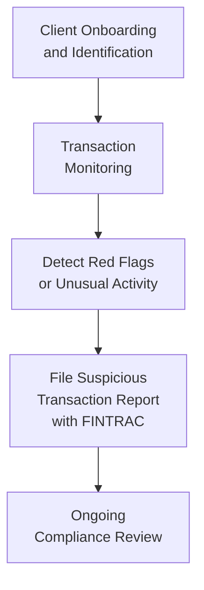
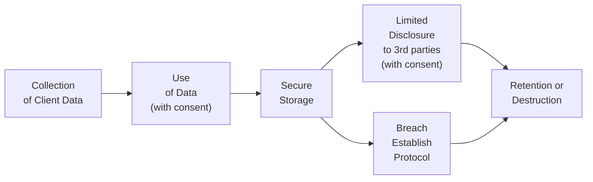
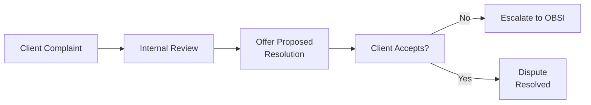
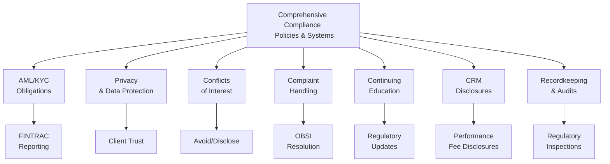

## 17.8 Other Legal Responsibilities

Welcome to this important section of Chapter 17. Let’s face it—compliance and legal responsibilities aren’t exactly thrilling topics for most people. You might even be tempted to say, “Ugh, do I really have to remember all these rules?” But trust me, they’re not just rules for the sake of rules. They exist to protect you, your firm, and, of course, your clients. In Canada’s regulatory environment, which is now unified under the Canadian Investment Regulatory Organization (CIRO), there are quite a few additional responsibilities and frameworks that mutual fund dealers and their representatives must follow. These have become more critical over time, especially given technology’s rapid advancements, globalization of financial markets, and increased awareness around client rights and data protection.

In this section, we’ll explore several key areas: Anti-Money Laundering (AML) obligations, privacy and data protection, conflicts of interest, complaint handling and dispute resolution, continuing education, the Client Relationship Model (CRM), and robust recordkeeping protocols. Each of these responsibilities plays a crucial role in maintaining trust and integrity in the financial services industry.

Before we dive in, I’ve got a personal story to set the stage. Not long ago, I worked with a fellow representative who accidentally stored sensitive client data on an unsecured laptop. Talk about a near miss! Fortunately, no actual breach occurred, but the entire situation underscores how vital it is to understand and respect all these legal responsibilities. It’s not just about checking boxes—it’s about protecting people’s hard-earned money, personal information, and overall well-being. So let’s jump right in.

---

## Why These Responsibilities Matter

It might be tempting to think of these legal responsibilities as just “regulatory overhead.” But consider: your clients entrust their financial futures to your care. They share their personal details, including sensitive identification documents, banking information, and sometimes health or family data. Any breach of these rules—whether it’s failing to monitor suspicious transactions for money laundering or simply not properly handling a client complaint—can result in loss of trust, legal penalties, and even permanent reputational damage.

Canada’s financial system has a stellar reputation internationally due to our strict and well-enforced regulations. That’s something we want to preserve. When you adhere to these responsibilities, you contribute to a stable, trustworthy system that benefits everyone.

---

## Anti-Money Laundering (AML) Obligations

### The Core AML Framework

In Canada, AML obligations primarily come from the Proceeds of Crime (Money Laundering) and Terrorist Financing Act (PCMLTFA) and the associated guidelines issued by FINTRAC (the Financial Transactions and Reports Analysis Centre of Canada). Under the PCMLTFA, mutual fund dealers must have robust internal compliance regimes that help detect, deter, and minimize money laundering and terrorist financing activities.

### Key AML Responsibilities

• Identify and Verify Clients  
• Maintain Detailed Records  
• Monitor and Report Suspicious Transactions  
• Conduct Ongoing Compliance Reviews

I’ll admit, monitoring suspicious transactions can feel a bit like detective work sometimes. Let’s say you spot a client making unusually large, round-number deposits every other Tuesday. That’s odd—people don’t usually operate their finances in neat lumps like that. Well, that’s exactly the kind of thing you’re supposed to pause and question.

### AML Compliance Diagram

Below is a simple Mermaid diagram that outlines the typical AML compliance flow within a mutual fund dealer:

As you can see, the process is cyclical. Ongoing compliance review is crucial; it’s not enough to just verify a client once and forget about it.  

### Practical Example

Imagine a client walks in claiming to be a consultant for small start-ups. Over six months, that client deposits multiple $9,999 checks just below the $10,000 threshold that triggers mandatory reporting. This is a typical “smurfing” or structuring approach used to avoid detection. Even if each transaction is below a reporting threshold, the pattern should raise a red flag once you notice repetitive, systematic behavior. You’d need to investigate and, if warranted, file a Suspicious Transaction Report (STR).

### Additional Resources

• [FINTRAC AML Compliance](https://www.fintrac-canafe.gc.ca/)  
• [CIRO Regulatory Pronouncements](https://www.ciro.ca)  

---

## Privacy and Data Protection

### Overview of PIPEDA

Privacy—doesn’t that topic seem more critical than ever these days? Canada’s federal privacy legislation, the Personal Information Protection and Electronic Documents Act (PIPEDA), enforces rules on how organizations collect, use, and disclose personal information in commercial activities. Several provinces have their own privacy laws that may also apply. But generally, PIPEDA sets a baseline. 

### Core Principles of Data Protection

1. Obtain explicit consent.  
2. Use personal information only for the purposes for which it was collected.  
3. Secure client data against unauthorized access.  
4. Develop and communicate a privacy policy to clients.  

### Privacy Protection Diagram

The general lifecycle of client data under PIPEDA can be illustrated using this Mermaid diagram:

### Real-World Scenario

I once heard about a dealer firm whose representative mistakenly sent a client’s account statement to the wrong email address. Yikes! Not only did that represent a breach of confidentiality, but it had to be reported, and remedial steps needed to be taken (e.g., getting the unintended recipient to delete it). Incidents like these highlight just how easy it is to slip up and why thorough procedures matter.

### Additional Resources

• [Office of the Privacy Commissioner of Canada](https://www.priv.gc.ca)  
• [PIPEDA Compliance Guidance](https://www.priv.gc.ca/en/privacy-topics/privacy-laws-in-canada/the-personal-information-protection-and-electronic-documents-act-pipeda/)  

---

## Conflicts of Interest Management

Think about conflicts of interest as a scenario where your personal or financial interests might get in the way of acting in your client’s best interest. Even the appearance of such a conflict can undermine trust faster than you can say “front-running.” This is why full disclosure—and in many cases, avoidance—of conflicts is so important.

### Common Conflict Situations

• Receiving referral fees or other forms of compensation from third parties.  
• Owning or having a financial interest in a product you recommend.  
• Having personal relationships that might bias your recommendations.  

If you can’t avoid the conflict, you must fully disclose it to your client. That way, your client can make an informed decision about whether to proceed.

### Practical Example

Let’s say you get a nice little commission for directing clients to an affiliated mortgage brokerage. That might be okay if your firm’s policies allow it, but you need to come clean about it: “Hey, just so you know, I’ll receive compensation if you proceed with this referral.” Transparency is critical.  

---

## Complaint Handling and Dispute Resolution

### Why Complaint Handling Matters

Nobody loves complaints, but robust complaint handling procedures position you as a trustworthy, client-focused representative. Under CIRO guidelines, all client complaints must be reviewed and addressed promptly, fairly, and thoroughly. In most cases, if the client remains unsatisfied, they can escalate to an independent dispute resolution body like the Ombudsman for Banking Services and Investments (OBSI).

### Complaint Handling Process Diagram

Here’s a quick visual:

### Real-Life Application

I recall a case where a client complained about not being advised about a material change in management fees. The representative’s notes were incomplete, and there was no documented evidence of discussing the changes. The firm had to accept responsibility, compensate the client to make them whole, and enhance their internal recordkeeping procedures. This story is a perfect example of how essential documentation is—something we’ll talk about soon!

### Additional Resources

• [OBSI](https://www.obsi.ca/)  
• [CIRO Complaints and Enforcement](https://www.ciro.ca)  

---

## Continuing Education (CE)

### The Importance of Staying Current

Financial markets evolve. Regulations shift. Products change. If you’re not learning, you’re falling behind. That might sound a bit dramatic, but it’s true in this industry. CIRO mandates continuing education (CE) to ensure that dealers and representatives remain competent, knowledgeable, and able to provide suitable advice.

### Types of CE Activities

• Regulatory updates and rule changes.  
• New product training.  
• Professional seminars and webinars.  
• Ethics training, including modules similar to those you’re reading here.  

Some reps find it a chore. But trust me, if you approach CE with curiosity, you’ll see it’s actually beneficial. Whether it’s a masterclass on digital asset funds or a refresher on risk management with fixed income, continuing education helps you do your job better and serve clients more effectively.

---

## Client Relationship Model (CRM)

### Enhanced Disclosure

CRM was introduced by Canadian regulators to make the investor-advisor relationship more transparent and client-focused. CRM2, for instance, mandates that dealers disclose detailed info on fees, charges, and performance in annual statements to clients. CRM3 guidelines will likely build on that foundation, adding more clarity and holistic reporting.

### Key Elements of CRM

• Upfront disclosure of fees and charges.  
• Ongoing performance reporting showing the impact of fees.  
• Full advisor compensation breakdown.  

It’s worth noting that clients often don’t read the fine print unless they experience unexpected charges or underperformance in their portfolios. So part of your job is to explain these disclosures in plain language.

### Practical Example

A brand-new client invests in a balanced mutual fund with a management expense ratio (MER) of 2%. Under CRM, you have to illustrate how that 2% and any trailing commission might affect their returns over time. This transparency allows clients to understand what they’re paying for advice and fund management—key to maintaining trust and setting realistic expectations.

### Additional Resources

• Check [CIRO’s Website](https://www.ciro.ca) for the most recent CRM Rules.  
• Visit the [Canadian Securities Administrators (CSA)](https://www.securities-administrators.ca/) website for CRM harmonization efforts.  

---

## Recordkeeping and Compliance Systems

When it comes to regulatory and legal responsibilities, good recordkeeping is like the unsung hero. Decent records make everything easier: proving you disclosed something, verifying your recommendations, and defending your firm in case of a regulatory audit. If you can’t find the relevant documentation when you need it, it’s almost as bad as not having it in the first place.

### Effective Recordkeeping Practices

• Maintain complete notes of all client meetings, phone calls, and emails.  
• Store records securely, preferably in both digital and hard-copy formats (as required).  
• Ensure easy retrieval for compliance reviews.  
• Implement retention schedules that align with regulatory requirements.  

### Compliance Systems

Strong compliance systems don’t just tick boxes; they actively prevent problems. This can include automated systems that generate alerts for suspicious transactions, or robust policies that enforce “two sets of eyes” for critical tasks like large transactions or account openings.

### Practical Insight

A friend once told me about a representative who didn’t record a critical conversation about risk tolerance changes before the 2008 financial meltdown. The client alleged they’d changed to a more conservative stance, the rep said they hadn’t, and—boom—a huge dispute followed. If that conversation had been documented, it would have been far simpler to sort out.

---

## Putting It All Together

Staying on top of all these legal responsibilities might sound overwhelming, but they’re not as disjointed as they appear. If we look at them as components of a holistic framework—focused on transparency, integrity, and client protection—they start to feel more unified and more manageable. Here’s a high-level illustration that ties everything together:

It’s a system with multiple moving parts, but each piece interacts with, complements, or reinforces the others, culminating in a culture of compliance and client-centric service.

---

## References and Additional Resources

• [FINTRAC AML Compliance](https://www.fintrac-canafe.gc.ca/)  
• [CIRO](https://www.ciro.ca) — Canada’s primary regulator for investment and mutual fund dealers (successor to IIROC and MFDA).  
• [Canadian Investor Protection Fund (CIPF)](https://www.cipf.ca/) — The single investor protection fund in Canada.  
• [PIPEDA Compliance Guidance](https://www.priv.gc.ca/en/)  
• [OBSI](https://www.obsi.ca/)  
• [Canadian Securities Administrators (CSA)](https://www.securities-administrators.ca/)  

Always remember that the guidelines and regulations can be updated frequently. Keeping track of policy amendments through official bulletins and continuing education is crucial. 

---

## Final Thoughts

These responsibilities might seem extensive, but they form the bedrock of a healthy advisor-client relationship. From safeguarding against financial crimes to being transparent about fees and swiftly handling complaints, your adherence to these rules is what sets you apart as a professional who puts clients first. And, you know, it can even be personally rewarding: you develop deeper trust with your clients and can proudly say you operate in one of the most respected financial systems in the world.

Stay proactive, keep records diligently, and never be afraid to ask questions when you’re unsure about a regulatory requirement. Yes, it may feel like a bit of an uphill climb at times—but in the grand scheme of things, these responsibilities ensure that when you say you’re acting in your client’s best interest, you’ve got the framework, the paperwork, and the moral high ground to back it up.  

Remember: If in doubt, disclose—if still in doubt, disclose again. In other words, transparency is your friend, and so is compliance.  

---

## Test Your Knowledge: Key Legal Responsibilities for Mutual Fund Representatives Quiz



### Building a robust compliance program to address money laundering mandates primarily stems from which legislation in Canada?

- [ ] Ombudsman for Banking Services and Investments (OBSI)
- [ ] PIPEDA
- [x] PCMLTFA
- [ ] CRM Rules

> **Explanation:** The Proceeds of Crime (Money Laundering) and Terrorist Financing Act (PCMLTFA) is the central federal legislation that sets out Canada's AML requirements, with FINTRAC providing the guidelines and oversight.

### Which entity provides a free and independent service for resolving disputes between small investors and financial services firms?

- [ ] FINTRAC
- [ ] CIPF
- [x] OBSI
- [ ] CIRO

> **Explanation:** The Ombudsman for Banking Services and Investments (OBSI) is an independent dispute resolution service for complaints that haven’t been resolved to the client’s satisfaction by the firm.

### Under PIPEDA, which of the following is a primary requirement for mutual fund dealers when handling client data?

- [x] Obtain client consent for collecting, using, or sharing personal information
- [ ] Store client data only in paper format
- [ ] Report to CIPF annually on data usage
- [ ] Provide conflict-of-interest disclosures

> **Explanation:** PIPEDA requires consent for collecting, using, and disclosing personal information and mandates that organizations limit use to the purposes identified and practice safe data handling.

### When a mutual fund representative has a personal interest in a product or transaction, what must they do first?

- [ ] Ignore the conflict
- [x] Fully disclose it to the client
- [ ] Ask the dealer to hide it
- [ ] Dismiss the client’s ownership or interest

> **Explanation:** Representatives must disclose any conflicts of interest to the client so the client can make an informed decision about the recommendation.

### What is the potential next step if a client rejects the resolution offered by a mutual fund dealer’s internal complaint handling process?

- [x] The client may escalate the complaint to OBSI
- [ ] The complaint is dismissed automatically
- [x] The complaint can be settled via arbitration if both parties agree
- [ ] There are no further recourses for the client

> **Explanation:** If a client is unhappy with the dealer’s resolution, they can escalate to the Ombudsman for Banking Services and Investments (OBSI) for a free, independent review. Alternatively, some disputes may go to arbitration depending on the firm’s policies and the client’s choices.

### Which of the following items are part of a representative’s ongoing Continuing Education (CE) responsibilities?

- [x] Keeping up with regulatory changes
- [ ] Encouraging clients to switch firms
- [ ] Submitting daily trade reports to CIPF
- [ ] Guaranteeing a certain rate of return

> **Explanation:** CE focuses on ensuring representatives remain current on regulatory changes, product knowledge, and ethical practices.

### CRM rules require mutual fund dealers to provide which kind of information to clients?

- [x] Detailed performance, fees, and advisor compensation disclosure
- [ ] Only cost information for non-registered accounts
- [x] Annual statements outlining the impact of fees on returns
- [ ] Weekly phone calls to clients summarizing market performance

> **Explanation:** The Client Relationship Model (CRM) framework mandates that dealers provide ongoing performance and fee transparency, including how much the client pays in fees and how the advisor is remunerated.

### Why is meticulous recordkeeping so vital in the event of a dispute or regulatory audit?

- [x] It substantiates the representative’s account of events
- [ ] It eradicates the need for AML procedures
- [ ] It allows immediate destruction of older client records
- [ ] It serves no purpose and is unnecessary

> **Explanation:** Proper records provide evidence of disclosures, suitability assessments, and advice given. They can make or break a case in a dispute or regulatory review.

### Which of the following best describes a situation when a representative repeatedly runs into “paperwork issues” and missing documentation?

- [x] They may face regulatory scrutiny or disciplinary action
- [ ] It improves client confidence
- [ ] There is no consequence if trades are good
- [ ] It allows them to bypass conflict-of-interest disclosure

> **Explanation:** Inadequate documentation invites scrutiny from regulators and can lead to sanctions, especially if it impedes the verification of compliance with KYC, suitability, or disclosure rules.

### True or False: CIRO replaced both IIROC and the MFDA as of January 1, 2023, forming a single self-regulatory organization.

- [x] True
- [ ] False

> **Explanation:** Effective January 1, 2023, the Mutual Fund Dealers Association of Canada (MFDA) and the Investment Industry Regulatory Organization of Canada (IIROC) combined to form the Canadian Investment Regulatory Organization (CIRO).


