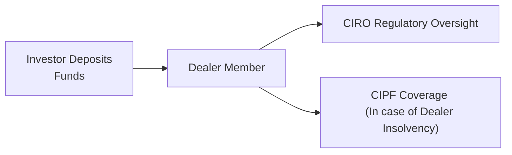

## 17.9 Other Considerations

Imagine this: you’re sitting down at the kitchen table, walking your best friend through the different policies that apply to mutual fund dealers—stuff like Know Your Client (KYC) requirements or prohibited selling practices—and then someone at the table goes, “Yeah, but what else do I need to know to feel fully protected?” That’s kind of what this section is all about. We’ve already covered the core regulatory requirements in previous sections of this chapter, but here we’ll dive into additional safeguards and considerations you should be aware of if you’re working in (or investing in) mutual funds. We’ll touch on investor protection coverage, online fraud prevention, and the importance of special guidance for senior and vulnerable clients. 

Think of it as those extra puzzle pieces that let you see the entire regulatory environment surrounding mutual fund dealers in Canada, under the watchful eye of the Canadian Investment Regulatory Organization (CIRO). By the way, if someone still mentions the MFDA or IIROC, just remember they are historical references—since they merged into CIRO. So let’s begin!

---

### Investor Protection Funds

Anytime we talk about mutual fund dealers or investment firms, there’s usually a question that pops up: “What happens if the firm holding my investment accounts goes bankrupt or vanishes?” It’s not a common scenario, but it has happened before—and it can create real panic among clients. That’s where the Canadian Investor Protection Fund (CIPF) steps in.

#### The Role of CIPF

CIPF is an independent organization that provides limited protection for clients of member firms, should a member firm become insolvent. As of 2023, CIPF became the sole investor protection fund in Canada for regulated investment dealers and mutual fund dealers, following the merger of the MFDA IPC with CIPF. So basically, CIPF coverage is that last-ditch safety net designed to ensure that if your dealer member fails, your accounted-for assets are safeguarded up to certain limits.

It’s important to realize that CIPF does NOT protect you from market losses. If the market value of your mutual funds goes down because your precious investment strategies flopped, CIPF won’t reimburse you. Instead, CIPF coverage is specifically intended to protect against the loss of client assets if the dealer goes belly-up. 

Check out the CIPF website (<https://www.cipf.ca>) to stay updated on coverage limits and policies—especially since things can change over time. Even if the fundamental structure remains stable, it’s always a good idea to read the fine print.

#### Coverage Scope and Limits

A common question is: “So, if I had a million dollars in my mutual fund account, am I just out of luck beyond that?” The precise coverage limit can vary, and CIPF doesn’t necessarily apply to each “account” in isolation but rather to account categories (like non-registered accounts, RRSP/RRIF accounts, etc.). The best practice is to review CIPF documents to confirm your coverage.

Always remember: CIPF coverage automatically applies if you hold assets with a dealer that participates in CIPF—there’s no separate application form you need to fill out or anything. However, your dealer must be a member in good standing with CIRO. If you want a visual snapshot, here’s a simple flowchart illustrating how you move from investor to CIPF coverage:

> In this diagram, the investor places funds with the Dealer Member (which must be regulated by CIRO). If the firm fails, CIPF coverage can be triggered, subject to specific terms and coverage limits.

#### Practical Example: Jane’s Dilemma

Let’s say Jane invests $200,000 in several mutual funds through a CIRO-regulated dealer. Then, as bizarre as it might sound, that dealer unexpectedly becomes insolvent. Jane’s first fear is that her $200,000 is gone. But CIPF steps in to ensure that she would be made whole up to their stated coverage limits, provided that her funds were indeed in custody with that dealer. While this might be stressful, having CIPF coverage can significantly mitigate the shock.

---

### Fraud Prevention Measures

Fraud is such an ugly word, right? Unfortunately, it’s a reality. With technology weaving its way into almost every aspect of our lives—particularly in how we invest and communicate—protecting yourself (and your clients) from potential scams is a big deal. In the mutual fund business, cybersecurity measures are critical not just for the dealers but for every individual who invests. 

#### Cybersecurity Basics

When we talk about cybersecurity, we mean all those technologies and processes that protect data integrity and prevent unauthorized access. It involves firewalls, encryption, secure login protocols, multi-factor authentication, and plain old good housekeeping (like never storing passwords on sticky notes—seriously!).

But remember, people can be the weakest link. So while your firm might have top-notch security software, you or your client might inadvertently click on a phishing email that reveals critical personal information. The consequences can escalate quickly: identity theft, financial manipulation, and unauthorized trading. For best practices:

• Use strong, unique passwords. (Yes, having “PASSWORD123” is a bad idea, but you already knew that, right?)  
• Enable multi-factor authentication wherever possible.  
• Train staff and clients to spot phishing attempts.  
• Regularly update software and security patches.  

A key resource for staying up to date is the RCMP’s Canadian Anti-Fraud Centre (<https://www.antifraudcentre-centreantifraude.ca/>). It provides helpful resources and bulletins about new types of scams filtering through the financial ecosystem.

#### Secure Client Communication

Ever gotten an email from a “client” that vaguely says, “Please send me a wire transfer ASAP”? The request might appear legitimate at first, but it can turn out to be fraudulent. Maintaining secure lines of communication is crucial. Encourage clients to confirm suspicious or unusual requests via phone calls or face-to-face visits, especially if it involves money movement.

What about file sharing? Some dealers offer secure online portals or encryption methods for sensitive documents, while others rely on standard email attachments (which are not always safe). If your firm doesn't have a robust system in place, push for it—or consider using external encrypted file-sharing platforms.  

#### Identity Theft and Verification

Mutual fund dealers must be vigilant about verifying client identities to comply with Anti-Money Laundering (AML) regulations—but it’s also about preventing someone from impersonating your client. Some typical identity verification measures include:

• Checking government-issued IDs.  
• Performing virtual identity verification (via online tools that compare ID images to live selfies).  
• Doing a “two-call” approach: if address changes, fund redemption requests, or sensitive instructions suddenly pop up, contact the client using the existing phone number on file to confirm authenticity.  

And a final note: remind clients that they should never share their account login credentials or personal info with third parties without thorough verification. This sounds obvious, but we’ve all seen well-intentioned individuals become victims of social engineering.

---

### Senior and Vulnerable Clients

We’re watching demographics shift: more Canadians are living longer. So it’s very common to have older clients with unique financial planning and investment needs. Sometimes, those clients might also have a reduced capacity to make complex financial decisions or face unfortunate situations like potential elder abuse.

#### Importance of Tailored Suitability

Suitability determinations can get more nuanced with seniors or vulnerable adults. For example, if a client might need easy access to funds due to medical or living expenses, it wouldn’t be appropriate to tie up their money for 15 years in illiquid investments. Additionally, older clients might be more sensitive to capital preservation than growth.

CIRO has released notices and guidelines on dealing with senior clients (<https://www.ciro.ca/>). This includes best practices like:

• Regularly updating KYC information to reflect changes in the client’s health status or living situation.  
• Exploring trusted contact persons—someone authorized to speak on behalf of the client under certain circumstances.  
• Being extra vigilant about suspicious activity that might indicate abuse or financial fraud from relatives or caregivers.

#### Spotting Red Flags

A few signs that might signal a senior or vulnerable client is at risk:

• Unusual activity or large withdrawals from accounts they never touched before.  
• Sudden changes to legal or financial documentation (e.g., giving power of attorney to someone unexpected).  
• Uncharacteristic confusion when discussing routine account details.  

Handling these scenarios can be delicate, and regulatory guidelines emphasize empathy, respect, and thorough compliance with privacy laws. Whenever in doubt, consult your compliance department, document your observations, and proceed with caution and care.

---

### Potential Pitfalls and Best Practices

Let’s talk about some common obstacles, so you’re prepared to avoid them (or solve them if they pop up).

• Overlooking CIPF Membership Verification: Don’t assume every firm is automatically covered by CIPF. Always confirm the dealer’s membership status.  
• Inadequate Client Education on Fraud Risks: Even if you have robust cybersecurity, a single client who doesn’t know how to spot a phishing attempt can create issues for everyone.  
• Failure to Document Conversations with Senior Clients: If a dispute arises later, having thorough notes can clarify that you complied with the client’s instructions and performed due diligence.  
• Not Keeping Up with Regulatory Updates: Laws evolve. The coverage amounts, CIPF membership requirements, or guidelines for dealing with vulnerable clients may shift. Regular training and compliance refreshers help you stay in the loop.

---

### Case Study: The “Over-Communicator” Firm

Imagine a mid-sized mutual fund dealer (“Over-Communicator Mutuals Inc.”) that invests heavily in staff training. They run monthly webinars about new cybersecurity threats, distribute easy-to-read pamphlets on fraud prevention, and engage external consultants to conduct “phishing tests” on employees. They also hold special workshops on challenges faced by seniors, teaching staff how to spot potential undue influence or suspicious transactions.  

Because of these proactive measures, Over-Communicator Mutuals Inc. sees fewer client complaints. Plus, when potential issues do arise, the staff know how to escalate promptly. Essentially, they’ve established a culture of transparency and vigilance that helps them reduce risk, cut costs associated with dealing with major fraud incidents, and maintain a solid reputation.

This approach might require a little more work on the front end (like scheduling training sessions, building that knowledge base, etc.), but in the long run, it saves you both time and headaches. It also preserves client trust, which can be priceless.

---

### Glossary

• **Canadian Investor Protection Fund (CIPF):** An independent organization offering limited protection for client assets in the event of a dealer’s insolvency. Completely separate from market-loss coverage.  
• **Cybersecurity:** The combination of technologies and processes that protect systems, networks, and data from cyber attacks or unauthorized access.

---

### Additional Resources

1. **CIPF Coverage Policies:**  
   Visit <https://www.cipf.ca> for the most current coverage information, policy updates, and FAQs on how CIPF protection works.  

2. **CIRO Notices on Dealing with Senior Clients:**  
   Head to <https://www.ciro.ca/> to examine guidelines, best practices, and official notices about addressing the needs and potential vulnerabilities of older clients.  

3. **RCMP Fraud Prevention Centre:**  
   The Canadian Anti-Fraud Centre is found at <https://www.antifraudcentre-centreantifraude.ca/>. A terrific place to educate yourself about emerging scams, identity theft prevention, and best reporting practices if you or your clients become victims of fraud.

4. **Provincial Securities Regulators:**  
   While CIRO acts as the national self-regulatory body, your provincial securities regulator (like the Ontario Securities Commission or the Autorité des marchés financiers) might issue bulletins or investor alerts that can provide valuable guidance on current or evolving issues.

5. **Elder Abuse Prevention Organizations:**  
   There are non-profit organizations dedicated to supporting and protecting seniors, such as Elder Abuse Prevention Ontario (<https://eapon.ca/>), which can strengthen your understanding of the emotional, financial, and legal issues that can arise.

---

### Putting It All Together

It can be overwhelming to keep track of everything: the CIPF coverage details, new threats from cyber criminals, changing guidelines on dealing with elder clients...the list goes on. But if you take a step back, you’ll see it all connects. This is about ensuring investor confidence and well-being—covering the rare but catastrophic scenario of dealer insolvency, making sure criminals can’t siphon funds or commit identity fraud, and protecting some of the most vulnerable investors among us (like seniors).

Stay curious, keep yourself updated with current regulatory notices, and never be afraid to talk openly with clients about these topics. Let them know about CIPF protection, highlight why strong passwords matter, or reassure them that it’s acceptable to ask extra questions before confirming a major withdrawal. Because if you create an environment that fosters trust, thorough communication, and ongoing education, you’ll keep clients safer—while reducing your own liability and stress. 

As we wrap up Chapter 17, look back at everything we’ve discussed: CIRO’s role following the amalgamation of MFDA and IIROC, registration requirements, KYC compliance, communications guidelines, and now these extra considerations. By layering this knowledge and applying it in your day-to-day practice, you’re on track to be a truly responsible and effective mutual fund representative.  

---

## Test Your Investor Protection and Fraud Prevention Knowledge



### Which organization in Canada provides limited protection for client assets in the event of a dealer’s insolvency?

- [ ] The Bank of Canada
- [x] The Canadian Investor Protection Fund (CIPF)
- [ ] The Mutual Fund Dealers Association (MFDA)
- [ ] The Investment Industry Regulatory Organization of Canada (IIROC)

> **Explanation:** CIPF (Canadian Investor Protection Fund) is the sole investor protection fund in Canada that covers client assets (subject to coverage limits) if a CIRO-regulated dealer becomes insolvent.

### Which of the following is NOT a common cybersecurity best practice?

- [ ] Using a strong, unique password
- [ ] Enabling multi-factor authentication
- [ ] Training staff and clients to spot phishing
- [x] Sharing login credentials publicly for “convenience”

> **Explanation:** Sharing credentials (e.g., on sticky notes or publicly) undermines security. All the other options support stronger cybersecurity measures.

### Why might seniors require additional regulatory safeguards?

- [x] They may be more vulnerable to financial abuse or have shifting financial priorities.
- [ ] They never need access to their funds.
- [ ] They have no experience investing.
- [ ] They are required by law to invest only in bonds.

> **Explanation:** Seniors are often at higher risk for exploitation and may have unique needs or health considerations affecting their investment decisions.

### Which of the following is true about CIPF coverage?

- [x] It does not protect investors against losses due to market fluctuations.
- [ ] It guarantees all investments will make a profit.
- [ ] It protects against any and all forms of fraud.
- [ ] It replaces private insurance on life events.

> **Explanation:** CIPF protects client assets if a dealer becomes insolvent, but it does not guarantee investment performance or protect against drops in market value.

### Which measure could help validate a client’s identity when there’s a suspicious transaction request?

- [x] Performing a follow-up call using the registered phone number on file
- [ ] Sending the password via unencrypted email
- [x] Requiring the client to verify identity with government-issued ID
- [ ] Contacting a random person from the client’s social media

> **Explanation:** Verifying suspicious requests often involves contacting the client via established communication channels or confirming government-issued identification. Random third-party contacts aren’t reliable sources of identity confirmation.

### What is a key red flag of potential elder abuse?

- [x] Sudden and unusual large withdrawals with no clear rationale
- [ ] Small Christmas gifts to family members
- [ ] The client acknowledges and approves all transactions openly
- [ ] Regularly scheduled withdrawals for living expenses

> **Explanation:** Uncharacteristic requests for large withdrawals or drastic account changes can signal undue influence or exploitation.

### Which of the following is a direct resource for fraud prevention information?

- [x] The RCMP's Canadian Anti-Fraud Centre
- [ ] The local Chamber of Commerce
- [x] The CIPF official website
- [ ] A personal finance blog without credentials

> **Explanation:** Official resources like the RCMP’s Anti-Fraud Centre and CIPF are trusted, factual sources. Personal finance blogs can be helpful, but they should not replace credible and official channels.

### When dealing with a senior client who appears confused about a major transaction, which action is most appropriate?

- [x] Pause the transaction and seek clarity or consult compliance
- [ ] Proceed immediately to avoid interfering with their personal decisions
- [ ] Ignore any external input and continue with the transaction
- [ ] Complete and record the order as a “special instruction”

> **Explanation:** If there’s confusion or potential incapacity, the best approach is to pause and consult compliance or engage a trusted contact. Protecting the client’s interests is essential.

### What is a recommended first step if you suspect a phishing attempt in your email?

- [x] Verify the sender and content by contacting them through another medium (phone, official website, etc.) 
- [ ] Immediately open the attachments to see if they’re harmful
- [ ] Provide your login information to confirm your identity
- [ ] Click any links to update your credentials

> **Explanation:** The best practice is to confirm the email’s authenticity through another channel (phone call, official contact info, etc.) without clicking or providing details.

### A robust cybersecurity strategy involves both technological measures and human vigilance.

- [x] True
- [ ] False

> **Explanation:** Even the strongest software cannot protect against human error (e.g., clicking on phishing links), so training and awareness are critical components of cybersecurity.


