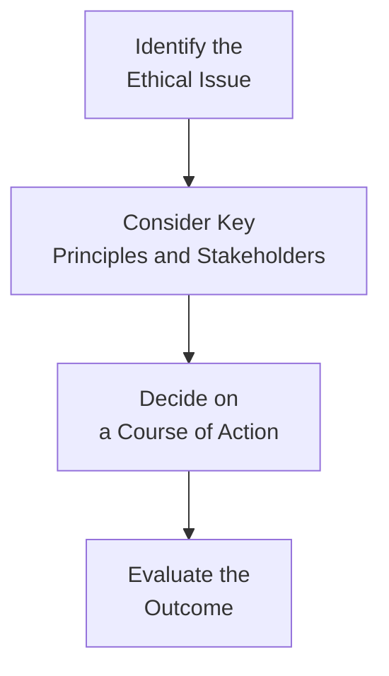

## 18.1 What Are Ethics and the Standard of Conduct?

Sometimes, when we think about “ethics,” we might imagine a neat list of do’s and don’ts—like a simple rulebook that magically resolves all moral dilemmas. But in real life, especially in financial services, ethical situations can be tricky. There can be conflicts that aren’t so obvious at first: maybe you want to recommend a product that looks profitable but may not truly meet a client’s needs. Or a colleague might nudge you to “quietly” overlook a small discrepancy in paperwork. So, how do we sort out right from wrong? Well, that’s exactly where ethics and standards of conduct step in.

Below, we’ll explore what ethical conduct looks like for mutual fund sales representatives, how standards of conduct underscore our daily professional actions, and why it all matters—not just for you, but for everyone working in financial services.

  
**Ethics in Financial Services**  
Ethics is about more than just following the rules—though you’ll see in a moment how rules also play a part. At its core, ethics in financial services means taking actions that genuinely serve clients and protect the integrity of the markets, instead of merely trying to stay out of trouble. We often hear that financial professionals must place clients’ interests ahead of their own. That can sound noble and maybe a little abstract, but it really boils down to everyday decisions:

• Do you recommend a higher-commission product that doesn’t quite fit a client’s risk tolerance?  
• Do you fully disclose all fees so your client truly understands the costs?  
• When a client asks, “Is this the right investment for someone in my situation?” do you consider not just the compliance checklists but also the client’s real-life circumstances, goals, and comfort level?

In Canadian financial services, upholding ethical standards is significant because trust is everything. If clients suspect that advisors are acting to line their own pockets or ignoring their best interests, the entire industry suffers. And over time, a breach of trust can cause very real damage, not just financially, but reputationally as well. It helps to remember: one unethical decision can snowball, affecting the client’s well-being, your career, and, by extension, the overall trustworthiness of the financial marketplace.

  
**Standard of Conduct**  
A standard of conduct typically refers to an official, codified set of guidelines that define the “proper” ways a professional should act. For Canadian mutual fund dealers and industry professionals, the Canadian Investment Regulatory Organization (CIRO) issues these measures. Historically, there were two separate self-regulatory organizations: the Mutual Fund Dealers Association of Canada (MFDA) and the Investment Industry Regulatory Organization of Canada (IIROC). As of January 1, 2023, these have amalgamated under the new name—CIRO. This consolidated self-regulatory organization ensures consistent and robust oversight across investment dealers, mutual fund dealers, and marketplace activities in Canada.

Standards of conduct typically cover:  
• Disclosure obligations—what, when, and how you must disclose fees, conflicts of interest, or product risks.  
• Recordkeeping—maintaining a clear paper trail of all recommendations, transactions, and advice.  
• Products and services—ensuring you only offer products suited to a client’s financial goals and risk profile.  
• Conflicts of interest—requiring priority of client interests when a conflict arises.  
• Personal conduct—enforcing honesty, integrity, and a genuine desire to help.  

When your firm’s compliance team reminds you of, say, new disclosure guidelines, it’s because these guidelines are fused into your standard of conduct. And maintaining that standard helps everyone: the firm, you, and—most importantly—your clients.

  
**Principle-Based vs. Rule-Based Ethics**  
In financial services, we talk a lot about two approaches to ethical compliance: principle-based and rule-based.

• Principle-Based Approach:  
  Think of it as “act with honesty and integrity” or “place your client’s interest first.” These are broad statements you can apply in many contexts. Principle-based ethics rely on professionals to interpret and apply these general moral foundations to each unique situation. It’s not about memorizing every possible scenario; it’s about having a solid moral compass.  

• Rule-Based Approach:  
  Here, you’ll find precise regulations with specific rules. For instance, “all advisors must update Know Your Client (KYC) forms at least annually or whenever there’s a material change.” It doesn’t matter if you think the change is small—you follow the rule or risk non-compliance and potential disciplinary actions.  

In practice, Canada’s regulatory frameworks blend both approaches. For example, CIRO outlines broad professional obligations (principles), coupled with explicit directives like how frequently you must contact clients, how soon you must disclose fees, or exactly how you must handle complaint procedures (rules).

  
**Fiduciary Duty vs. Suitability Obligation**  
If you’ve heard the term “fiduciary duty,” you might also be wondering if that applies to you. Many mutual fund representatives are subject to a stringent “suitability obligation”—meaning they must ensure that each recommendation matches the client’s risk tolerance, objectives, and overall financial situation. Fiduciary duty is a slightly higher standard often applied to portfolio managers who have full discretionary control over client assets.

However, in some situations, even a mutual fund dealing representative could be held to a fiduciary-like standard if, for instance, the nature of the relationship implies a very high degree of reliance and trust from the client. This is a bit of a gray area. Some courts interpret the relationship between an advisor and a client in very broad terms, potentially imposing higher ethical standards if the client is heavily dependent on the representative’s advice.

At minimum, you must meet your suitability requirements. That means:  
1) Understanding your client’s financial situation thoroughly (the reason behind those KYC forms).  
2) Recommending products that align with the client’s investment objectives, time horizon, and risk tolerance.  
3) Disclosing relevant facts and potential conflicts of interest.  

The best practice is to aim higher than the bare regulations. By considering each client’s unique perspective and truly listening, you’ll not only comply with your legal obligations but also build stronger relationships rooted in trust.

  
**The Role of Compliance and Supervision**  
Practically every firm in Canada has a compliance department (or, in smaller organizations, a compliance function) whose job is to ensure that both the firm and individual representatives adhere to all securities laws, CIRO rules, and internal policies. Have you ever felt like your compliance department was breathing down your neck with new forms, checklists, or mandatory training? Well, that might feel inconvenient, but it’s actually part of a system designed to protect you, your clients, and your firm from risks and violations.

Compliance teams often:  
• Review client files to ensure KYC documentation is correct.  
• Inspect trade patterns to catch any suspicious activity.  
• Monitor sales practices to confirm that advisors aren’t pushing inappropriate or overly speculative products.  
• Provide ongoing education about regulation changes, internal processes, and best practices.  

Firms also have designated supervisors who oversee daily trading activity, ensure correct documentation, and maintain oversight of communications with clients. This structure prevents ethical shortfalls before they even begin. If you ever face a moral gray zone—something that doesn’t clearly violate a rule but still feels questionable—your compliance department is a key resource. They’re there to interpret guidelines, give you feedback on potential conflicts of interest, and help you remain aligned with both the letter and the spirit of ethical standards.

  
**Ethics and Industry Reputation**  
It’s no dramatic exaggeration to say that one major scandal can tarnish an entire sector of the industry. Over the years, we’ve seen significant, high-profile cases involving insider trading, misrepresentation of products, or inappropriate sales to vulnerable clients. Each instance chips away at the public’s confidence in the financial system.

But flip that around. Upholding ethical conduct doesn’t just avoid negativity; it actively enhances the industry’s image. When clients see how diligently you work to recommend suitable investments, help them plan for retirement, or clarify complicated tax issues, they grow more confident. On a bigger scale, when firms avoid unethical sales practices—like churning accounts or pushing risky products that don’t match a client’s risk tolerance—clients feel better about the entire marketplace.

So it’s not purely about staying out of trouble. It’s also about creating a culture of ethics that fosters genuine relationships and trust. Happy clients become loyal clients and often refer friends and family. This positive reinforcement elevates the reputation of not only your firm but the entire financial infrastructure.

  
**Ethical Decision-Making Frameworks**  
Have you ever been stuck on a problem that you just can’t unravel, and then a friend says, “Let’s reframe the issue?” A decision-making framework does exactly that for ethics. It breaks down your thought process into concrete steps. One common framework is:

• Identify → Consider → Decide → Evaluate  

But how does that really work in, say, a day-to-day scenario?

1) Identify: Spot the ethical issue or potential conflict. For instance, your long-time client wants to move all her assets into a high-risk emerging markets fund, ignoring your caution that it might be too volatile.  
2) Consider: Think about potential consequences for you, your client, and your firm. Weigh the regulatory obligations, the client’s goals, and any relevant principle-based ethics.  
3) Decide: Maybe you conclude that refusing the trade is too extreme since the client insists. But you can structure a suitable compromise with a balanced approach or strongly emphasize the disclaimers about risk. Document your rationale thoroughly.  
4) Evaluate: After implementing the decision, reflect on whether it actually served the client’s best interest. Did you remain transparent? Are you comfortable with how you handled it?  

This framework ensures you take a systematic, thoughtful approach—rather than rushing to a quick decision based purely on emotions or short-term monetary gain.

Here’s a quick visual representation:

Every firm might have its own variation of this framework, but the essence remains: a structured thought process that keeps clients, regulations, and integrity at the center.

  
**Practical Illustrations and Case Study**  
Imagine this scenario: You have a client, Lucy, who is nearing retirement. She’s got a decent-sized portfolio and wants to “double it in five years.” You suspect that her goal is too aggressive, given that any significant market downturn could be disastrous for someone about to leave the workforce. Now, Lucy read an article about a hot new fund that has soared in the past year (but also has the potential for high volatility). She’s dead set on putting a large chunk of her savings into that fund.

From an ethical standpoint, you should politely but firmly remind Lucy of her risk tolerance, time horizon, and what a major loss would mean for her retirement. Yes, the potential returns might be huge, but if it backfires, there may not be enough time to recover. Disclosing all risks and ensuring Lucy truly grasps them is not just a nice thing to do—it’s your legal and ethical duty. You will want to document your discussion, possibly have Lucy sign off on disclaimers if she insists on pursuing the allocation, and confirm that the KYC information remains accurate.

This scenario highlights how the suitability obligation works in everyday practice. By taking an ethical stance—prioritizing Lucy’s well-being over a possible short-term commission from a risky product sale—you do your job properly and ethically.

  
**Glossary**  
• **Ethics**: Moral principles that distinguish right from wrong. In finance, these principles guide how professionals serve clients and maintain market integrity.  
• **Standard of Conduct**: A codified set of guidelines and regulations that define acceptable professional behavior. In Canada, CIRO is a key source for these standards.  
• **Principle-Based Regulation**: Broad guidelines (like fairness, honesty) that professionals apply in diverse contexts.  
• **Fiduciary Duty**: A legal duty often associated with portfolio managers to act in the client’s best interest by virtue of complete trust. Some aspects may apply to other representatives in specific circumstances.  
• **Suitability Obligation**: A regulatory requirement that advisors recommend investments aligned with a client’s objectives, risk tolerance, and personal situation.  
• **Compliance Department**: The arm of a financial firm that ensures adherence to securities law, CIRO rules, and internal policies.  
• **Regulatory Penalties**: Fines, suspensions, or revocations that follow from breaking rules or laws.  
• **CIRO (Canadian Investment Regulatory Organization)**: Canada’s national self-regulatory body overseeing investment dealers, mutual fund dealers, and market integrity. It replaced the defunct MFDA and IIROC.  

  
**References and Additional Resources**  
• CIRO (Canadian Investment Regulatory Organization) – https://www.ciro.ca/  
  - Offers codes of conduct, rulebooks, compliance guidance, and more.  
• Canadian Securities Administrators (CSA) – https://www.securities-administrators.ca/  
  - Coordinates and harmonizes securities legislation across Canada.  
• CFA Institute's “Code of Ethics & Standards of Professional Conduct” – https://www.cfainstitute.org/  
  - A global perspective on ethical behaviour in financial services.  
• Peck, Sarah. “Investment Ethics.” – An in-depth look at moral considerations and case studies in finance.  
• Investopedia – https://www.investopedia.com/  
  - Open-source articles and free resources on financial concepts.  
• Bogleheads Forum – An online community sharing free discussions on investment strategies and financial planning.  

Even after reading official resources or textbooks, if you’re unsure about any ethical dilemma, it’s a good idea to discuss it with your supervisor or compliance department. They can help interpret framework guidelines in real-world contexts and double-check you’re meeting (or exceeding) your obligations.

  
**Final Thoughts**  
Ethics and standards of conduct in Canadian financial services might feel like big, weighty topics—because, well, they are. But all that talk of codes and regulations boils down to a few core principles: honesty, transparency, fairness, and responsibility. Let’s not forget that your clients place tremendous faith in your judgment. It can feel daunting at times, but with consistent oversight from compliance, guidelines from CIRO, and a personal commitment to always do right by your clients, you’ll be well-positioned to navigate any challenging scenario with integrity.

Compliance guidelines or not, acting ethically is what keeps financial services meaningful and sustainable. And from personal experience, it’s far more rewarding to go home each day knowing that the advice you offered truly benefited someone’s financial future, rather than worrying about whether you crossed an ethical line. So, keep these principles at the forefront of your mind, and you’ll not only safeguard yourself and your clients, but also contribute to a stronger, more trustworthy financial community in Canada.

  
## Essential Ethics and Conduct in Canadian Finance: Quiz



### In the context of financial services, ethics primarily involves:
- [ ] Following every rule to avoid fines.
- [x] Making judgment calls that prioritize clients’ best interests and integrity.
- [ ] Maintaining a strictly profit-based approach.
- [ ] Advertising products with minimal disclosure.

> **Explanation:** Ethics in financial services goes beyond strict compliance. It involves using moral judgment to ensure client welfare, market integrity, and a commitment to honesty.

### A key difference between principle-based and rule-based ethics is:
- [x] Principle-based approaches require interpreting broad guidelines for each unique scenario.
- [ ] Rule-based systems do not need explicit guidelines.
- [ ] Principle-based approaches never mention honesty or integrity.
- [ ] Rule-based ethics is defined only by personal conscience.

> **Explanation:** Principle-based ethics focus on overarching guidelines like “act with integrity,” while rule-based approaches use precise, explicit regulations. Many regulatory frameworks use a combination of both.

### One primary responsibility of a mutual fund dealing representative under the suitability obligation is to:
- [x] Ensure that recommendations align with the client’s financial goals, risk tolerance, and situation.
- [ ] Prioritize the rep’s own commission structure.
- [ ] Keep track of minimal documentation to remain anonymous.
- [ ] Focus exclusively on compliance checklists and ignore client preferences.

> **Explanation:** Suitability means the representative’s recommendations must fit each client’s unique profile. Overemphasizing personal gain undermines ethical standards and breaches regulatory obligations.

### According to Canadian requirements, the role of the compliance department includes:
- [x] Monitoring activities to ensure adherence to securities laws and CIRO rules.
- [ ] Increasing internal bureaucracy to delay transactions.
- [ ] Preventing all trading activity above a certain threshold.
- [ ] Firing personnel with no explanation.

> **Explanation:** Compliance departments verify that regulations and internal policies are followed. This oversight minimizes unethical practices and promotes market integrity.

### When comparing fiduciary duty and suitability obligations:
- [x] Fiduciary duty is often a higher standard, sometimes required of certain portfolio managers.
- [ ] Suitability and fiduciary duty mean exactly the same thing.
- [x] Mutual fund representatives must still act in the client’s best interest, even if they’re not strict fiduciaries.
- [ ] Suitability obligation doesn’t require understanding the client’s objectives at all.

> **Explanation:** While fiduciary duty imposes the highest level of care often associated with discretionary portfolio managers, mutual fund dealing reps have clear suitability obligations that focus on meeting each client’s needs.  

### One likely consequence of non-compliance with CIRO standards of conduct is:
- [x] Regulatory penalties such as fines or suspensions.
- [ ] Permanent government subsidies.
- [ ] Promotion to a senior management role.
- [ ] Automatic conversion into a fiduciary-level advisor.

> **Explanation:** Violating regulations can lead to disciplinary measures such as fines, suspensions, or even bans from the industry, depending on the severity of the infraction.

### Ethics and industry reputation go hand in hand because:
- [x] Unethical behavior erodes trust and can harm the entire financial sector.
- [ ] Ethics has no impact on how clients perceive the industry.
- [x] Clients who trust their advisors tend to remain loyal and recommend others.
- [ ] A single unethical act has no significant consequences for the industry’s credibility.

> **Explanation:** Eroding trust impacts not just one firm but the overall sector. Conversely, ethical behaviour fosters credibility, drawing clients to the advisor and the broader financial market.

### A key benefit of using a structured ethical decision-making framework is:
- [x] It helps professionals systematically consider all aspects of a dilemma.
- [ ] It replaces the need for professional judgment.
- [ ] It ensures personal gain always comes first.
- [ ] It is optional and rarely applied in real practice.

> **Explanation:** Frameworks like “Identify → Consider → Decide → Evaluate” keep decisions logical and based on client welfare, regulatory guidelines, and ethical principles.

### Lucy, a near-retirement client who wants to invest aggressively, highlights the importance of:
- [x] Addressing suitability by understanding the client’s time horizon and risk tolerance.
- [ ] Ignoring client instructions if they don’t match your personal goals.
- [ ] Hiding risk details so the client continues with the trade.
- [ ] Immediately switching to a purely fiduciary model with no documentation.

> **Explanation:** Lucy’s scenario underscores how an advisor should manage risk tolerance, fully disclose investment risks, and ensure the investment recommendation is truly suitable.

### Ethics in financial services:
- [x] Reflects a commitment to honesty, client welfare, and fair market practices.
- [ ] Is entirely separate from regulations or compliance.
- [ ] Focuses solely on the advisor’s profitability.
- [ ] Doesn’t require transparency or disclosures.

> **Explanation:** Upholding ethics means going beyond technical rules to act with honesty, transparency, and a genuine focus on client interests.


