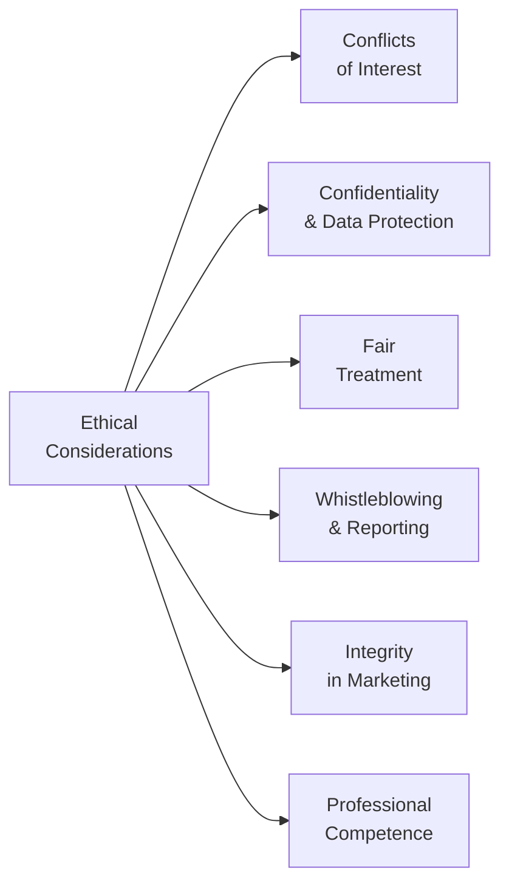

## 18.2 Additional Ethical Considerations

Have you ever had that moment of sudden hesitation—like you’re on a busy street and someone calls your name, offering a “fantastic deal,” but something just doesn’t feel right? That little red flag in your mind might well be your ethical compass pointing you toward caution. Similarly, in the world of mutual funds, there are countless scenarios where ethical dilemmas can pop up, and it’s often your gut feeling that tells you to pause and think. But beyond our instincts, we have formal guidelines, regulatory frameworks, and real-world examples that help us navigate these complex waters. Let’s walk through some of the most important ethical considerations for mutual fund representatives. 

Conflicts of Interest  
One of the biggest ethical minefields in financial services is the conflict of interest. Essentially, a conflict arises when your personal or financial interests might overshadow the client’s best interest. Maybe you’ve been offered a nice bonus for selling a particular fund, or you have a second job with an entity that could sway your professional judgment. These situations can be more subtle than you think. For instance, I remember a friend who worked as a mutual fund representative. He often joked about how a certain product practically “sold itself” because it offered him a higher commission. The next thing we knew, he had a backlog of clients in that fund—even those for whom it might not have been the best fit. Eventually, his branch manager caught wind of it, and it turned into a formal conflict-of-interest investigation. That tension between personal gain and client benefit is precisely why robust guidelines exist.

Managing or eliminating conflicts starts with honest acknowledgment. You might encounter various compliance measures—like filling out regular disclosure forms or adopting client-focused reforms mandated by the Canadian Securities Administrators (CSA)—to ensure you’re transparent about these potential conflicts. Disclosure isn’t just about sweeping statements or technical disclaimers. It should be clear, in plain language, so that your client truly grasps the situation. If a conflict can’t be properly managed through disclosure alone, you may need to recuse yourself or seek guidance from compliance to ensure the client’s interests are not compromised.

In the current regulatory environment, the Canadian Investment Regulatory Organization (CIRO) issues compliance bulletins and guidelines on how to handle conflicts. Historically, you might’ve heard about the Mutual Fund Dealers Association of Canada (MFDA) and the Investment Industry Regulatory Organization of Canada (IIROC). However, these two predecessor SROs amalgamated into CIRO on January 1, 2023 (renamed June 1, 2023). Reviewing CIRO’s bulletins on conflicts of interest and outside business activities is a great way to stay compliant and preserve your reputation as a trustworthy professional.

Confidentiality and Data Protection  
Picture this: you finish a fruitful discussion with a new client, go back to your desk, and open up all their personal details—bank statements, net worth, investment objectives, the works. Now, how would you feel if that information accidentally showed up on a coworker’s screen or if it ended up in the hands of the wrong person? It’s scary, right? That’s exactly why data protection is a central ethical concern in financial services. 

In Canada, we have privacy legislation such as the Personal Information Protection and Electronic Documents Act (PIPEDA), which governs how organizations collect, use, and disclose personal information. As a mutual fund representative, you must ensure that any information your client shares remains strictly confidential. This can include keeping physical documents locked away, using secure email systems, storing client data in encrypted electronic databases, and never discussing sensitive information in public spaces—even in the break room. 

There’s a real sense of trust at stake here. When your client shares personal financial data, they’re essentially giving you the keys to their most private affairs. Lose that trust by mishandling information, and it’s not just unethical—it could open you up to legal liabilities, disciplinary action by CIRO, and severe reputational damage you might never fully recover from. So, guard that information with the same care you’d expect if the roles were reversed.

Fair Treatment of Clients  
If you think about it, fairness is just decency in action: treat all clients with respect, consistency, and honesty, regardless of the size of their investment account or their background. Yet, it’s not uncommon for folks working in sales to lavish attention on clients with bigger wallets or bigger potential. But from an ethical standpoint, that’s a big no-no. Every client, no matter how large or small their account, deserves balanced, well-considered advice. 

In practice, you might have to juggle multiple client priorities. Someone with a million-dollar portfolio could come in for an annual review at the same time as a smaller but equally loyal client who’s nearing retirement. While, sure, you can’t be in two places at once, you don’t want to shortchange the smaller client. One way to stay equitable is to use standardized procedures—for instance, a uniform checklist or planning process that you apply to all clients, potentially with additional customization for those who really need it. As we discussed in Chapter 4 (Getting to Know the Client), thorough KYC (Know Your Client) processes often help ensure consistency because you use the same baseline approach for every consultation. 

Whistleblowing and Reporting Misconduct  
Nobody wants to be the person who “tattles” on a coworker, but let’s face it, sometimes you see something that’s just plain wrong. Maybe a colleague is recommending high-risk funds to elderly clients with minimal risk tolerance. Or perhaps you realize someone is tampering with documents. In these instances, it’s not only your ethical obligation but often a regulatory requirement to report misconduct. 

Whistleblowing can be stressful. You might worry about repercussions at work, losing a friend in the office, or being labeled “disloyal.” Thankfully, many firms have confidential hotlines or designated compliance officers who are there to support you. In fact, the whole system benefits when people speak up. It protects the public, safeguards the integrity of the financial system, and upholds the reputation of your firm. If you’re ever unsure about how to proceed, consult your compliance department for guidance. They’re your allies in these thorny situations.

Integrity in Sales Communications and Marketing  
You may recall from Chapter 17, part of the job in opening new accounts and servicing existing ones involves a fair bit of marketing—whether that’s brochures, product sheets, or even social media content. It’s super tempting to emphasize only the positive aspects of a product. After all, who wants to dwell on the downside? But misleading marketing materials can be a huge ethical sinkhole. 

Clients deserve balanced, accurate, and plain-language materials that clearly show not just the benefits but also the risks. If, for example, you’re championing a new equity mutual fund with high growth potential, you’d better make sure the disclaimers about volatility and potential losses are not tucked away in microscopic footnotes. Sometimes, the difference between a fair and an unfair presentation is as simple as using everyday language (instead of dense legalese) to describe potential downsides. Consult your firm’s marketing compliance guidelines and ensure your promotional materials comply with your local provincial securities commission’s rules.

While you might not craft marketing campaigns solely by yourself, your input can help shape the tone and authenticity of the message. If you notice that the commission-based payouts for a certain product are overshadowing a product’s genuine suitability for the client, speak up. Remember, the line between persuasive marketing and deceptive misrepresentation is thinner than we like to think.

Professional Competence  
Have you ever felt like you’re in a conversation where the other person is rattling off a bunch of technical jargon, and all you can do is nod politely? In finance, that might be your client’s experience if you’re not careful. Ensuring you’re up to date on the latest regulatory changes, product innovations, and industry best practices is key. A lack of professional competence can quickly turn into an ethical lapse: if you don’t truly understand the products you’re selling, how can you responsibly recommend them to your clients?

Continuous education goes hand in hand with ethics. By attending industry conferences, reading up on CIRO bulletins, or taking advanced courses in finance, you maintain a standard of care that benefits your clients. In Canada, client-focused reforms introduced by the CSA demand that representatives have the knowledge and credentials to properly advise on any recommended product. If you’re uncertain about a product or have never worked with it before, it’s better to do your homework or seek the help of a more knowledgeable colleague than to wing it and risk jeopardizing Trust 101 in your client relationships.

Relationship Diagram of Core Ethical Considerations

Below is a simple Mermaid diagram illustrating the interconnectedness of key ethical pillars for mutual fund representatives:

In this diagram, Ethical Considerations sit at the center, branching out to six core principles that reinforce one another. Once these are working together, you’ll be better positioned to provide exemplary service in a way that is aligned to both client interests and industry standards.

Case Study: The Overly Enthusiastic Representative  
Let’s pretend we have a scenario involving Alex, a newly licensed mutual fund representative. Alex is eager to succeed and wants to impress his branch manager by hitting his quarterly sales targets. He’s discovered that a certain sector fund pays a higher trailer fee. Without fully researching it, Alex starts recommending this sector fund to many of his clients, touting its “stellar performance” and “incredible potential.” One client is Anna, a 68-year-old retiree with a low risk tolerance. She’s uncomfortable with volatility in the equity markets, but Alex persuades her to invest because the short-term numbers look promising.

A few months later, the sector experiences a significant downturn, and Anna’s investment portfolio plummets in value. When Anna expresses concern, Alex initially brushes it off and blames “market conditions.” Nevertheless, Anna files a complaint, highlighting that she didn’t fully understand the fund’s risks and that her risk tolerance was never properly assessed. Compliance steps in and uncovers the fact that Alex had recommended this same fund indiscriminately for nearly every client because of the higher trailer fee. 

Here’s the ethical breakdown:
• Conflicts of Interest: Alex’s personal interest in higher trailer fees overshadowed his duty to align products with client needs.  
• Fair Treatment of Clients: He failed to consider Anna’s specific circumstances and risk tolerance.  
• Integrity in Marketing: His promotional “speech” exaggerated the fund’s potential and downplayed the risks.  
• Professional Competence: By not researching the fund’s volatility, Alex provided incomplete information to his clients.  

In real-world practice, Alex would face disciplinary action from his firm, possible penalties from CIRO, and a damaged reputation. This cautionary tale underscores why ethical practices and continuing education matter so much.

Glossary  
Conflict of Interest: A situation where personal or professional interests might compromise judgment or objectivity.  
Data Protection (Privacy): The safeguarding of personal client information from unauthorized access or disclosure.  
Whistleblowing: Reporting unethical or illegal behavior within an organization to appropriate authorities.  
Professional Competence: Maintaining the necessary skills, knowledge, and abilities to perform duties effectively and ethically.  
Integrity: Adherence to moral and ethical principles, demonstrating honesty and consistency in actions.  
Client-Focused Reforms: Regulatory reforms that place the client’s best interest at the forefront of investment advice (in Canada, mandated by the CSA).  

Practical Tips and Common Pitfalls  
• Be Transparent: If you ever suspect a conflict of interest—even if you’re unsure—bring it up with compliance. Transparency is the best policy.  
• Use Secure Channels: Whether it’s email encryption tools, secure cloud storage, or privacy-protected instant messaging, always follow your firm’s data-protection protocols.  
• Avoid Bias: Provide every client with the same standard of care and professionalism. If a client can’t reach you easily, set up a system ensuring they get timely responses.  
• Maintain Updated Knowledge: If you’re not sure about something—be it a new financial product or a revision to local provincial regulations—spend some time learning or consult a mentor before advising clients.  
• Document Everything: Keep thorough records of client interactions, product disclosures, and any potential red flags. Adequate documentation can protect both you and your client if disagreements arise later.  

Connecting with Other Chapters  
• Chapter 17 (Mutual Fund Dealer Regulation) offers more detail on the regulatory environment in Canada, including CIRO’s role and the registration requirements for representatives.  
• Chapter 15 (Selecting a Mutual Fund) discusses how to blend ethical considerations with accurate product-specific knowledge to ensure clients get the most appropriate investment.  
• Chapter 5 (Behavioural Finance) highlights common biases that can exacerbate ethical lapses—like confirmation bias or overconfidence bias—and ways to spot them.  

References and Additional Resources  
• CIRO: For the latest compliance bulletins and regulatory updates, visit https://www.ciro.ca.  
• PIPEDA: Federal privacy guidelines can be found at https://www.priv.gc.ca/.  
• Provincial Securities Commissions: Each province in Canada has its own securities commission offering guidelines on disclosure, registration, and marketing. Search for your province’s commission website for specifics.  
• “Financial Ethics: A Positivist Analysis” by George A. Aragon provides broad research-based insights into the pitfalls of conflicts of interest and various forms of misconduct.  
• For background on how the CSA’s client-focused reforms aim to enhance investor protection, you can look up related bulletins on the CSA’s official website.  

Above all, remember that ethical practice isn’t a single lesson you learn and tuck away—it’s a continuous element of your professional life. If you find yourself in a questionable situation, ask yourself: Is this in my client’s best interest? Would I be comfortable explaining this recommendation to compliance or in a regulatory audit? The more you root your everyday actions in these considerations, the better equipped you’ll be to uphold the robust tradition of trust that underpins Canada’s financial marketplace.

  
## Test Your Knowledge: Ethical Standards and Best Practices Quiz



### When a personal gain overshadows a client’s best interest, this situation is best described as:
- [ ] A marketing error
- [ ] Insider trading
- [x] A conflict of interest
- [ ] A breach of client confidentiality

> **Explanation:** A conflict of interest arises when personal or financial interests might compromise your duty to act in the client’s best interest.

### Which of the following best presents an example of data protection?
- [ ] Texting client information via your personal phone
- [x] Encrypting client records and storing them in a secure database
- [ ] Discussing client details in a public setting
- [ ] Sharing login credentials with colleagues for convenience

> **Explanation:** Encrypting and securely storing client records is a key measure ensuring sensitive information remains confidential.

### Which principle is primarily violated if a mutual fund representative heavily promotes a fund to all clients simply due to its high commission potential?
- [ ] Confidentiality
- [x] Fair treatment of clients
- [ ] Whistleblowing
- [ ] Professional competence

> **Explanation:** Promoting a single product uniformly based on commission, rather than client suitability, undermines the principle of fair client treatment.

### If you see a colleague forging client signatures on account documents, your ethical responsibility is:
- [ ] Ignore the issue to avoid tension
- [ ] Confront the colleague but remain silent otherwise
- [x] Report the misconduct through your firm’s confidential channels
- [ ] Move to another department to avoid responsibility

> **Explanation:** Whistleblowing or reporting the misconduct is crucial to protect both the client and the firm’s integrity.

### Which of the following factors underline the importance of integrity in sales communications? 
- [x] Accuracy of marketing materials
- [ ] Avoiding any mention of product risks
- [x] Use of plain language and balanced risk disclosure
- [ ] Offering overnight guarantees of returns

> **Explanation:** Integrity in marketing involves being transparent and clear, providing both benefits and risks to clients in an easily understandable format.

### When handling client information, mutual fund representatives must remain compliant with:
- [x] PIPEDA
- [ ] Local municipal laws regarding parking
- [ ] FINTRAC only
- [ ] The Competition Bureau

> **Explanation:** PIPEDA governs the collection, use, and disclosure of personal information in Canada’s private sector, including financial services.

### Which of the following steps should be taken if a mutual fund rep is unsure about the suitability of a new investment product for a certain client?
- [x] Seek additional education or consult an experienced colleague
- [ ] Recommend the product anyway to meet sales targets
- [x] Conduct in-depth research before making any recommendation
- [ ] Offer unrelated products instead

> **Explanation:** Professional competence requires staying informed on product details. If unsure, it’s ethically prudent to pause and get clarity before proceeding.

### Why is fair treatment important in mutual fund sales?
- [x] It builds trust and mitigates allegations of bias
- [ ] It only applies to large institutional clients
- [ ] It eliminates all risk of product underperformance
- [ ] It legalizes preferential treatment for senior clients

> **Explanation:** Treating all clients fairly fosters trust and avoids claims of discrimination or bias, ensuring an equitable service.

### In the context of conflicts of interest, the best approach for a mutual fund representative is to:
- [ ] Keep them hidden to avoid alarming the client
- [x] Disclose conflicts promptly and manage or eliminate them if possible
- [ ] Shift blame to the product manufacturer
- [ ] Deny their existence altogether

> **Explanation:** Prompt disclosure and proactive management of conflicts of interest help maintain transparency and trust.

### Whistleblowing is:
- [x] True
- [ ] False

> **Explanation:** Whistleblowing is a real mechanism where individuals report unethical or illegal behaviour, vital for maintaining integrity and client protection.


