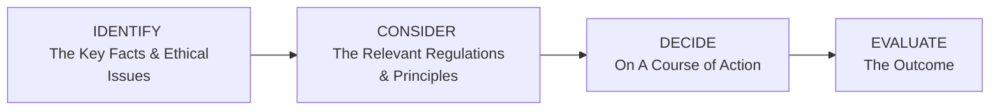

## 18.3 How to Apply What You’ve Learned to Case Studies

Have you ever faced one of those moments where you feel that little twinge in your gut that something might be off? In the world of mutual fund sales, it might be as simple as a client asking you to execute a trade that doesn’t sound like it aligns with their goals, or a more complicated scenario where your branch manager pushes a product that benefits the firm more than the client. Well, ethical dilemmas tend to creep up in ways both big and small. This section helps you apply everything you’ve learned in earlier chapters—particularly around regulations, KYC principles, and professional ethics—to real or simulated scenarios known as “case studies.”

Case studies serve as a bridge between the theoretical “dos and don’ts” we’ve discussed and the real-life decisions you’ll face as a mutual fund Sales Representative or Dealing Representative in Canada. We’ll walk through how to dissect these scenarios, interpret relevant regulations, and arrive at a solution that honors both the letter and the spirit of the rules. And yes, we’ll also talk about reflecting on your decisions to keep growing as a professional.

---

## The Purpose of Case Studies

Case studies might sound like stuffy academic exercises, but honestly, they’re one of the best ways to practice ethical decision-making without the real-world risk of damaging a client relationship or your professional reputation. They allow you to:

• Identify blind spots.  
• See where your strengths and weaknesses lie.  
• Practice analyzing regulations and applying them under hypothetical pressure.  
• Gain confidence in making ethical decisions that prioritize client well-being.  

They’re truly the “dress rehearsals” of the financial world. In a typical day at work, you won’t have time to consult an entire library of regulations—knowing how to spot issues on the fly matters. Case studies let you build up that skill in a focused setting.

---

## Steps to Analyze a Case Study

When you pick up a hypothetical scenario, it’s easy to get lost in all the details—names, financial products, regulatory references, or firm policies. To make this more straightforward, let’s walk through a step-by-step process:

1. Read the Facts:  
   • Identify who is involved.  
   • Pinpoint any conflicts of interest, contradictory instructions, or guidelines that might be at stake.  
   • Highlight key info about the client profile (risk tolerance, goals, product suitability) and relevant rules (like those from CIRO or the Canadian Securities Administrators (CSA)).

2. Determine Relevant Principles or Rules:  
   • Maybe you spot a potential “Know Your Client (KYC)” or “Suitability” issue (covered thoroughly in earlier chapters).  
   • Or you see a conflict with “Client Focused Reforms” (as mandated by CSA notices).  
   • Sometimes, internal firm policies might be stricter than the baseline regulations—focus on what’s directly applicable.

3. Consider Stakeholder Impact:  
   • Ask yourself: “Who wins and who loses if I do X?”  
   • Stakeholders include the client, the firm, yourself (as a representative), and even the broader market.  
   • If it’s beneficial for the firm at the expense of the client’s best interests, that’s a gigantic red flag.

4. Apply an Ethical Decision-Making Framework:  
   • One popular approach is: IDENTIFY → CONSIDER → DECIDE → EVALUATE.  
   • This ensures you go from diagnosing the ethical hiccup all the way to measuring the outcome.

5. Recommend a Course of Action:  
   • This step is where you provide a solution. It might be as simple as: “Decline the transaction and escalate to Compliance.” Or it might be more nuanced, like reorganizing a portfolio in a way that truly matches the client’s risk tolerance.  
   • The key is: propose a path that’s in the client’s best interest, aligns with regulatory obligations, and preserves professional integrity.

### Visualizing the Decision-Making Framework

Here’s a quick diagram to help you internalize this approach:

Use this flow in each case study scenario to keep things methodical. Even if you don’t literally write out each step in your day-to-day practice, having this mental model ensures you don’t miss anything important.

---

## Common Ethical Dilemmas in Case Studies

Ethical challenges often mirror real events. So, let’s highlight some common conundrums:

• Misrepresentation or Omission  
  – For instance, omitting key fee structures to secure a quick sale.  
  – Or giving an incomplete overview of a product’s risk level.  

• Overlooking Risk Tolerance  
  – Selling a high-yield, high-volatility product just because you know it pays a better commission.  
  – Pushing a product to meet that monthly sales target while ignoring your client’s anxious phone calls about market downturns.

• Conflicting Interests  
  – Your firm might be nudging you to push “in-house” funds because the fees come back to the firm. Meanwhile, there’s a competitor’s fund that could fit your client’s objectives better.  
  – Or maybe a friend or family member holds a senior position at a particular fund company. You might feel obligated to recommend their offerings—even though they might not be the best fit for the client.

• Unauthorized Trading or Forging Signatures  
  – This is quite serious but can happen under pressure. A rep might think: “The client won’t mind. I know they’d do this anyway, so I’ll just sign on their behalf.”  
  – It’s never acceptable. But case studies show how easily we can rationalize questionable acts when we’re time-pressed or sales figures are looming.

**Pro tip:** Check out Chapter 17 of this book, “Mutual Fund Dealer Regulation,” for a refresher on rules that specifically target prohibited practices, like unauthorized trades.

---

## Present vs. Spirit of the Regulation

Let’s talk about “the spirit” of the regulation. You’ll find that sometimes the rulebook is pretty explicit, but in certain scenarios, you have to read between the lines. A few bullet points to keep in mind:

• Regulations are designed to protect clients above all.  
• Fairness and transparency form the backbone of Canada’s regulatory framework.  
• CIRO sets out guidelines and standards that might not address every micro-scenario in black-and-white. But “doing the right thing” (like being transparent, ensuring suitability, etc.) remains paramount.

There can be a temptation to rely on literal interpretations or narrow technicalities. Maybe a rule says, “You can’t do X,” so you do something that is almost X. If it compromises the client’s interest or the market’s fairness, you risk bigger consequences. Usually, these rules were created because real people lost money or trust at some point, so abiding by the broader ethical principle is just as essential as meeting the letter of the law.

---

## Applying Ethical Judgment in Grey Areas

Ever felt that moment—“The regulation only says not to do X if Y happens, but Y hasn’t happened yet, so am I still okay?” This is precisely when you need to consider the spirit of the regulation.

• If it feels wrong or detrimental to the client, it probably is.  
• If you’d be uncomfortable explaining it to a compliance officer or reading about it in the newspaper tomorrow, stop.  
• If your manager is pressuring you, remember your obligations as a registrant with CIRO that override purely commercial interests.

And if you’re uncertain, consult your firm’s internal compliance team or official regulatory materials. That’s why they exist. I recall my early days as a new rep: I was once asked by a very senior colleague to “just fill out the client’s form; they told me it was fine.” I felt pressured—didn’t want to disappoint an experienced coworker. But I reached out to compliance because something felt off. Sure enough, compliance told me, “Absolutely not. Have the client sign in person or through authorized digital means.” I was relieved I did the right thing.

---

## Case Study Examples and Practice

Rather than just read about rules, let’s consider a mini-scenario:

### Scenario: The Overlooked Suitability

You have a client, Sarah, who’s 65 and depends on her investments for retirement income. She repeatedly expresses anxiety about market volatility. You’ve always recommended conservative balanced funds. But your firm is introducing a new high-yield, emerging-market equity fund that offers better trailer fees for you. Your manager hints that representatives who promote this fund might get an internal recognition bonus.

**Analysis:**  
• **Key Facts:** Sarah’s risk tolerance is moderate to low. She’s near retirement, depends on stable income, and is uneasy with market swings.  
• **Relevant Principles:** KYC, Suitability, CIRO’s guidelines about conflict of interest.  
• **Stakeholder Impact:** You might personally benefit due to higher fees or a bonus, but Sarah might lose big if the market dips.  
• **Course of Action:** Possibly decline to recommend the new fund. Or if it’s truly beneficial (though it doesn’t sound like it), thoroughly disclose the risks and get Sarah’s informed consent.  
• **Ethical Approach:** The right call likely is to stick with a lower-volatility product that meets her risk profile and needs.  

### Scenario: The Omitting-Fees Dilemma

John, a high net-worth client, is making a large lump-sum investment. You suspect he doesn’t fully understand how Deferred Sales Charges (DSC) or short-term trading fees might impact him if he withdraws early. You’re tempted not to mention it upfront because John seems in a hurry.

**Analysis:**  
• **Key Facts:** High net-worth client, large investment, potential DSC fees.  
• **Relevant Principles:** Full disclosure, fair dealing, client-first principle.  
• **Stakeholder Impact:** If John withdraws early and gets stuck with a steep DSC, he’ll feel blindsided, damaging trust in both you and your firm.  
• **Course of Action:** Disclose everything. Yes, it might slow the conversation, but it’s far more ethical than skipping those details.  

---

## Post-Analysis Reflection

Once you solve a scenario, it’s tempting to just move on. But reflection helps you grow as a professional.

Ask yourself:

• Did I consider all angles?  
• Did I let external pressures (like firm quotas, personal incentives, or client pushback) sway me improperly?  
• How would I handle a slightly different variation of the scenario?  

If there are multiple ethical paths, aim for the one that best aligns with your responsibilities under CIRO, the CSA, and your duty to the client. Sometimes you’ll have multiple “okay” options. That’s real life. Just ensure your choice remains consistent with the highest professional standards and the client’s well-being.

---

## Common Pitfalls and How to Overcome Them

• **Pitfall: Rationalizing forced compliance**  
  – You might think, “My manager said so,” or “The client is too busy to sign again.” Overcome it by reminding yourself of your regulatory and moral obligations.

• **Pitfall: Relying solely on your memory**  
  – Sometimes we “think” we know the rule, but the actual text might have changed, or we might’ve misread it. Overcome it by maintaining open lines of communication with compliance and referencing official materials (CIRO website, CSA Staff Notices, or your firm’s policy manuals).

• **Pitfall: “It’s a small action; it won’t matter.”**  
  – Little actions add up, especially if they harm your client’s interest. Overcome it by always aligning actions with best practices, no matter how “small” the matter seems.

---

## Practical Tips: Where to Seek Guidance

• **Senior Mentors or Colleagues:** They often have war stories about what went right and what went wrong.  
• **CIRO Resources (https://www.ciro.ca):** Contains enforcement proceedings, case studies, and real disciplinary actions to learn from.  
• **Canadian Securities Administrators (https://www.securities-administrators.ca/):** Offers Staff Notices and client-focused reform documentation that might clarify tricky situations.  
• **Firm’s Internal Compliance:** They’re your front line to interpret policies in context.  
• **Continuing Education:** Platforms like Coursera, edX, or YouTube channels featuring ethical finance courses can reinforce your knowledge.

---

## A Snapshot of Ethical Decision-Making

Here’s a quick table that summarizes potential issues, considerations, and solutions:

| Ethical Issue                 | Consideration                                                       | Possible Solution                                         |
|-------------------------------|---------------------------------------------------------------------|-----------------------------------------------------------|
| Misrepresentation/Omission    | Does the client have a full understanding of product risks & fees?  | Disclose fees explicitly, in writing if possible.         |
| Overlooking Suitability       | Does this product align with the client’s actual risk profile?       | Re-examine KYC data, confirm risk tolerance with client.  |
| Conflicts of Interest         | Are you prioritizing your commission over client outcomes?          | Disclose any conflict and recommend truly suitable funds. |
| Unauthorized Signatures       | Is there direct client authorization or are you forging?            | Obtain proper signatures or digital approvals.            |
| Pressure from Management      | Is this push harming the client’s best interest or ignoring policy? | Escalate concerns to compliance if necessary.            |

---

## Real-World Complexity: No Perfect Answers

In some grey areas, you might discover there are two or more “ethical” paths. You may see a scenario in which both clients and the firm benefit but in different ways. In those moments, choose the path that:

• Maintains transparency with the client.  
• Safeguards their interests.  
• Doesn’t breach any rule or create a hidden conflict.

Sure, you might think, “But what if I lose out on a big commission?” This is where your professional duty outweighs personal gain. Over the long term, building trust and credibility is far more beneficial—for you and your career—than chasing quick wins.

---

## Glossary

• **Case Study:** A scenario describing a potential situation or ethical dilemma that professionals might face in real life.  
• **Decision-Making Framework:** A structured approach to evaluating ethical dilemmas, ensuring consistent outcomes (e.g., IDENTIFY → CONSIDER → DECIDE → EVALUATE).  
• **Omission:** Failing to disclose relevant or necessary information.  
• **Misrepresentation:** Providing incomplete or false information that misleads the client or stakeholder.  
• **Stakeholder:** Any individual or group that could be affected by a decision (e.g., clients, the firm, other market participants).  
• **Spirit of the Regulation:** The underlying principle behind the rule, intended to promote fairness and integrity, rather than mere adherence to literal text.  

---

## References and Additional Resources

• **CIRO Enforcement Proceedings:**  
  Learn from real disciplinary cases at  
  https://www.ciro.ca

• **Canadian Securities Administrators:**  
  Find client-focused reform details and Staff Notices at  
  https://www.securities-administrators.ca/

• **Open Educational Resources:**  
  Platforms like Coursera or edX offer ethics modules in finance. Simply search for terms like “ethical finance course.”

• **CSI’s “Ethics and Professional Practice” Materials:**  
  If you want to dive deeper, see additional examples of how professionals handle everyday conflicts.  

By engaging with case studies—whether in a training session, a classroom, or your own reading—you’ll sharpen your decision-making skills. That ongoing effort helps foster a financial services environment where clients feel protected and confident, and where you align with the highest ethical standards. Real integrity is built case by case, choice by choice.

So the next time you read about a hypothetical scenario where someone is “just a little” unethical, or you actually face one in day-to-day practice, remember these steps. Make sure your decisions highlight the best professional standards and always aim to preserve not only compliance with the law but also the trust your clients place in you.

---

## Quiz: Ethical Decision-Making in Canadian Mutual Fund Practice



### Which of the following best describes the first step in analyzing an ethical case study?

- [x] Carefully reading the facts and identifying key elements such as parties involved and possible conflicts.  
- [ ] Documenting a recommendation based on your gut feeling.  
- [ ] Checking only the manager’s instructions.  
- [ ] Immediately looking up CIRO enforcement records.  

> **Explanation:** When analyzing a scenario, the most important first step is to thoroughly understand the facts: the players, potential conflicts, and relevant regulations. These details shape the rest of the analysis.

### In a case study where a client’s risk tolerance and the representative’s bonus structure conflict, which rule typically takes priority?

- [x] The client’s best interest, as mandated by CIRO and CSA client-focused reforms.  
- [ ] The representative’s bonus incentive, because higher sales benefit the firm.  
- [x] The duty to avoid conflicts of interest, ensuring client risk is respected.  
- [ ] The manager’s directive to promote proprietary funds at all costs.  

> **Explanation:** Regulatory frameworks in Canada emphasize the client’s best interest over sales incentives. Representatives must align with CIRO and CSA rules to avoid conflicts of interest and respect risk tolerance.

### What is a “stakeholder” in the context of an ethical dilemma?

- [x] Any individual or group that might be affected by the representative’s decision.  
- [ ] Only the client making the request.  
- [ ] The regulator overseeing the mutual fund industry.  
- [ ] The team that handles marketing for a new product.  

> **Explanation:** Stakeholders include the client, the firm, the representative, the market, and others potentially impacted by a financial decision. Understanding each stakeholder’s perspective is key to ethical judgments.

### One common ethical dilemma involves “omission.” Which statement best defines omission?

- [x] Failing to disclose relevant information that could affect client decision-making.  
- [ ] Filling out incorrect data on legal forms.  
- [ ] Stealing client information for personal gain.  
- [ ] Telling half-truths not intended to mislead.  

> **Explanation:** Omission is the act of leaving out necessary details, which can mislead a client as much as actively providing false information. Representatives must avoid such omissions.

### Consider a case study where a representative forges a client’s signature. Which approach is most aligned with the correct ethical framework?

- [x] Identifying it as unauthorized activity, consulting compliance, and refusing to proceed with any form of forgery.  
- [ ] Doing it if the client verbally gave permission.  
- [x] Reporting the issue, because forging a signature violates client consent and regulation.  
- [ ] Ignoring it if the manager says it’s fine.  

> **Explanation:** Forging a client signature undermines client protection, trust, and regulatory compliance. The correct ethical and legal standpoint is to refuse such a request and escalate to compliance if necessary.

### After analyzing a case study, why is reflection important?

- [x] It helps you consider alternative solutions and how they might affect outcomes.  
- [ ] It allows you to brag about your decision-making skills to peers.  
- [ ] It serves no real benefit because the decision is already made.  
- [ ] It only helps if the manager mandates a summary report.  

> **Explanation:** Reflection allows professionals to look back and see if there were other valid approaches or missed details. It fosters continuous learning and improves decision-making for future scenarios.

### If your firm’s guidelines are stricter than CIRO’s baseline requirements, how should you proceed?

- [x] Follow your firm’s more stringent guidelines to ensure compliance.  
- [ ] Use whichever guideline is more convenient.  
- [x] Combine both, but ensure you meet the stricter internal policy.  
- [ ] Ignore the internal guidelines.  

> **Explanation:** Firms often have internal policies stricter than baseline regulations to protect clients and the firm from legal and reputational risks. Representatives must comply with the higher standard.

### Which of the following is an example of a potential conflict of interest?

- [x] Recommending an in-house fund for higher commissions when a better external fund exists for the client’s needs.  
- [ ] Disclosing all fees necessary and ensuring suitability with the client’s risk tolerance.  
- [ ] Providing the client with an option between multiple suitable funds.  
- [ ] Consulting with a senior mentor before finalizing a recommendation.  

> **Explanation:** A conflict of interest arises when a representative’s motives—such as higher commissions—possibly undermine the client’s best interest. The scenario where in-house funds are pushed despite better external options illustrates such a conflict.

### When unsure about an ethical or regulatory matter, what is the recommended best practice?

- [x] Consult your firm’s compliance officer or official regulatory materials for clarification.  
- [ ] Decide on your own to show independence.  
- [ ] Ask only your colleagues for quick fixes.  
- [ ] Avoid the topic and proceed.  

> **Explanation:** Firms have compliance professionals specifically for guiding representatives through complex or uncertain regulatory scenarios. Official regulatory materials like CIRO’s site can also clarify best practices.

### True or False: Little omissions, such as failing to mention a small fee, are acceptable if they speed up a client meeting.

- [x] True  
- [ ] False  

> **Explanation:** While it might be tempting to gloss over minor details for convenience, full disclosure is a regulatory and ethical requirement. Even seemingly “small” omissions can harm client trust and create major issues later.


