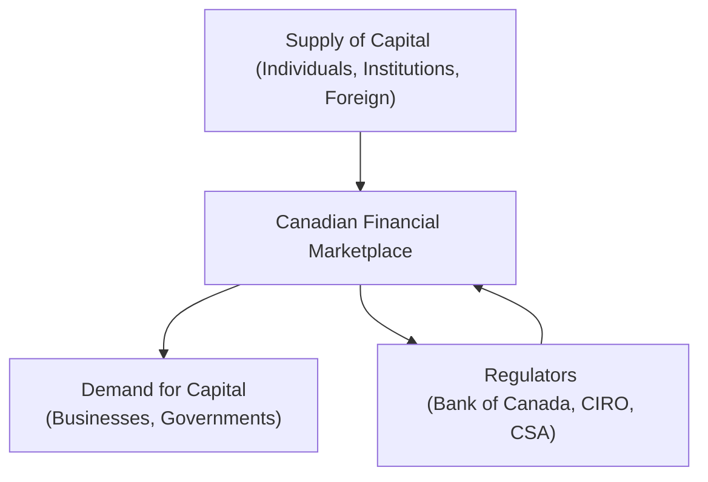

## 2.1 What is Investment Capital?

Investment capital. It’s such a fancy-sounding term, right? But let’s be honest: at its core, investment capital is just money put to use in a way that can potentially generate more money in the future. It’s the fuel that helps businesses launch new products, governments build roads, and individuals reach their financial goals. In the Canadian context—and, really, in most places around the world—it’s about putting idle cash to work.

Maybe you’ve heard friends or family talk about their “investment portfolio.” That portfolio, which might include mutual funds, stocks, or bonds, is essentially a pool of investment capital. And in Canada, our financial marketplace is specifically designed to help connect savers who have extra capital with those who need capital to grow. In other words, it’s a place where supply meets demand.

The rest of this section explores this big idea of investment capital: what it is, why it exists, how it moves, and why it’s so critical to the entire financial system. We’ll also look at a few real-life stories, examine the roles of major institutions such as the Canadian Investment Regulatory Organization (CIRO) and the Bank of Canada, and highlight the magic of supply and demand. Let’s get started.

### The Concept of Investment Capital

Um, so first things first: investment capital means funds available for investment. These funds can come from personal savings, institutional investors, or even from foreign sources. When you save money in a bank account or buy shares of a company, you’re effectively providing capital to other entities—like a business that needs cash to build a new factory or a local government that needs to improve public infrastructure.

Because we’re dealing with money (and a lot of it), investment capital occupies a central role in economic growth and financial stability. If companies can easily access capital, they can expand, hire more people, and innovate. If governments can access capital, they can build roads, hospitals, and schools, which benefits society at large. That’s why, in many ways, the availability of investment capital is often tied to the overall health of the economy.

### Sources of Investment Capital

Let’s explore the three main sources:

• Personal Savings: This is where most of us enter the fray. You earn money, set aside a portion for the future, and then invest it—perhaps in mutual funds, stocks, or bonds. I recall helping a close friend set up a Registered Retirement Savings Plan (RRSP) when he was first getting into financial planning. He didn’t think his $50 a month contribution could possibly make a difference. But over time, that money grew, and, well, that’s a perfect example of personal savings funneling into the broader marketplace to support business ventures or government bonds.

• Institutional Investments: Think about pension plans, insurance companies, and large portfolio managers. These institutions manage massive pools of money on behalf of many people. A pension plan, for example, invests the retirement savings of thousands or even millions of workers. Institutional investors are like those players in a board game who hold a bunch of properties and have a steady cash flow; they have a big influence on market dynamics. When a large pension fund decides to invest heavily in renewable energy, it can significantly boost that sector’s growth and innovation.

• Foreign Investment: Canada is known as a stable country with a well-regulated financial marketplace, so investors from all over the world funnel money into Canadian stocks, bonds, and other assets. These foreign investments help diversify our capital base. For instance, a European hedge fund might see Canada’s stable political climate—and comparatively resilient economy—as an attractive place to park their money. This flow can also influence the value of the Canadian dollar and impact interest rates.

### The Flow of Funds: Savers to Users

A key function of the financial marketplace is to connect savers (who have surplus funds) with users (who need funds to grow). Savers could be everyday folks, corporations, or governments with more cash on hand than they immediately need. Users are usually businesses, governments, or others with big ideas—like expanding an existing product line or building a new wing for a hospital. This flow can be visualized like a continuous circle of money, where savers deposit or invest their funds, and businesses or other entities borrow or issue shares to access that money.

Here’s a simple diagram to illustrate this flow:

• Savers place capital into the financial market (through mutual funds, online brokerages, banks, etc.).  
• The financial market provides avenues (like issuing bonds or stocks) for users to access that capital.

This seemingly simple process underpins the entire economy, allowing money to continuously move to where it’s needed most.

### Supply and Demand Dynamics

Ever notice how sometimes interest rates go down when there’s a glut of savings or personal savings rates go up during economic uncertainty? It’s all about supply and demand for capital. If there’s a ton of money hanging out in savings or big institutional funds, interest rates tend to be more competitive or sometimes even quite low, because businesses and governments can borrow relatively cheaply. If capital is scarce—maybe due to a recession or some global event—interest rates often rise, reflecting the increased cost of borrowing.

It’s not unlike any other market: when you have a huge supply of something (like extra money) and stable demand, prices (in this case, the price of borrowing, which is the interest rate) go down. On the flip side, if demand is high and supply is limited, interest rates rise because everyone is competing for a limited pool of funds.

This is partly why government monetary policy—especially decisions made by the Bank of Canada—can dramatically affect investment capital. When the Bank of Canada adjusts benchmark interest rates, it effectively makes borrowing more or less expensive. This directly impacts how easily businesses can secure investment capital for their projects.

#### A Quick Formulaic Glimpse

While we won’t dive too deeply into math here, consider a basic equation often invoked when we talk about interest rates:

$$
i = r + \pi
$$

Where:  
• \\(i\\) is the nominal interest rate.  
• \\(r\\) is the real rate of return (the interest rate after removing inflation).  
• \\(\pi\\) is inflation.  

If the Bank of Canada adjusts rates to tackle inflation, it changes \\(i\\). This, in turn, influences borrowing costs for companies, mortgage rates for homeowners, and interest earned by savers—ultimately shaping how much investment capital is in circulation.

### The Role of Government and Regulatory Influence

In Canada, we have multiple layers of regulation to ensure the system works effectively and to protect investors. At the national level:

• Bank of Canada sets or influences monetary policy, controlling benchmark interest rates, which in turn influence the supply of investment capital.  
• The Canadian Securities Administrators (CSA) coordinate regulation across provinces and territories, helping set the rules for how securities (like stocks and bonds) are issued and traded.  
• The Canadian Investment Regulatory Organization (CIRO) is Canada’s current self-regulatory organization overseeing investment dealers and mutual fund dealers. It’s important to note that the Investment Industry Regulatory Organization of Canada (IIROC) and the Mutual Fund Dealers Association of Canada (MFDA) no longer exist as separate entities. They were amalgamated into CIRO effective January 1, 2023 (and officially renamed on June 1, 2023), which streamlines oversight in the investment space.

#### Why This Matters for Mutual Fund Representatives

If you’re actively guiding clients about mutual funds, you’re part of that essential bridge that channels capital from individuals to the broader market. You help decide how these funds will be allocated, based on your client’s risk tolerance, time horizon, and financial goals. A thorough understanding of where this capital comes from and how it’s regulated can help you reassure clients about the safety and alignment of their investments. You’ll also be well-positioned to explain why interest rates matter or how foreign investment can influence the returns on their mutual funds.

### Real-World Scenario: Small Business Expansion

A local bakery and café in Toronto, let’s call it “Maple Delight,” wants to expand into a second location. The business needs, say, $500,000. Maple Delight could go to the bank for a loan (debt financing) or sell shares to private investors (equity financing). If interest rates are low—because the Bank of Canada set a low benchmark rate—borrowing is cheaper, and Maple Delight is more likely to get the financing it needs. The half-million dollars that eventually shows up in Maple Delight’s bank account likely originated from savers, pension funds, or other depositors who placed their capital in various accounts or investments. By borrowing it, Maple Delight invests in equipment, hires more staff, and—if all goes well—earns more profit, eventually repays the loan, and helps the local economy grow. You know, it’s basically the circle of life for finance.

### Foreign Capital Considerations

You might be surprised how often foreign investment influences our domestic activities. Foreign investors might find the Canadian economy appealing because of its relative stability, its strong banking tradition, or maybe the industry sector is particularly attractive—like natural resources or technology. That injection of external money can drive up stock prices, strengthen the currency, or even encourage more companies to go public. However, if foreign investors pull their money out (often due to global macroeconomic shifts), the opposite can happen. This ebb and flow can create volatility, but it also ensures the market remains dynamic and responsive to global trends.

### Government Bonds and Economic Projects

Another big piece of the puzzle: government borrowing. Canadian federal, provincial, and sometimes municipal governments issue bonds to fund projects like hospitals, highways, or municipal infrastructure. When you buy a government bond, you’re lending money to the government. They promise to pay you back with interest after a certain period. These stable investments are vital for both the investing public (because they’re relatively low-risk) and for governments (because it’s a dependable way to access investment capital). In times of economic stress, governments might issue more bonds to stimulate growth, often in tandem with monetary policy changes by the Bank of Canada.

### Putting It All Together in the Canadian Marketplace

Let’s piece this together step by step:

• Individuals (e.g., you and me) accumulate savings.  
• Those savings are invested in mutual funds, stocks, or other securities.  
• Institutions such as pension funds and insurance companies maintain large investment portfolios to meet their liabilities, like paying out future pensions or insurance claims.  
• Foreign investors also place capital in Canadian markets because they see opportunities for returns.  
• The combined pool of capital is available to businesses and governments to fund expansion, projects, and developments.  
• Government bodies like the Bank of Canada influence interest rates and credit conditions, affecting how easily capital flows from savers to investors.  
• CIRO oversees dealers, ensuring that the process remains fair, transparent, and aligned with regulatory obligations to protect investors.

Here’s another quick illustration:

In this diagram, the supply of capital and the demand for capital meet in the financial marketplace, with Canadian regulators (including the Bank of Canada, CIRO, and the CSA) setting the framework and rules that keep things running smoothly.

### Best Practices for Mutual Fund Representatives

• Stay Updated on Policy Changes: Monetary policy shifts, new regulations, or changes in CIRO guidelines can have immediate and notable effects on capital availability and thus on mutual fund performance.  
• Diversify Portfolios: Yes, it’s the age-old advice, but it’s still relevant. Because capital flows from various sources, having a diversified portfolio can help mitigate risks.  
• Understand Global Influences: Foreign investment can pour in or dry up depending on global politics or economic events. Being aware can help you anticipate potential market swings.  
• Educate Your Clients: The world of finance can feel complex. A simple, clear explanation of why interest rates move or why foreign capital matters can go a long way in building trust.

### Common Pitfalls and Challenges

• Underestimating Market Sentiment: Even with favorable interest rates, if market sentiment is sour, capital might not flow as expected.  
• Misallocating Resources: If capital is cheap and easy to source, some companies might over-leverage. As a mutual fund representative, it’s your job to be aware of these risks when recommending certain funds.  
• Overlooking Regulatory Updates: Canada’s financial regulations are robust, but they do evolve. Missing a big change—like updates to CIPF coverage or CIRO compliance rules—could put a client’s portfolio at unnecessary risk.

### References and Resources

If you’re keen to discover more about how capital is governed in Canada or want your clients to dig deeper, check out the following:

• The Bank of Canada (https://www.bankofcanada.ca/): Learn about the latest policy rates and financial system reviews.  
• Canadian Investment Regulatory Organization (CIRO) (https://www.ciro.ca/): Keep abreast of compliance requirements and regulatory updates related to investment dealers and marketplaces.  
• Canadian Securities Administrators (CSA) (https://www.securities-administrators.ca/): Find out about provincial and territorial securities regulations.  
• “Investment Science” by David G. Luenberger: For a more technical, mathematical approach to understanding returns, investment capital, and risk.  

Also, you might want to check out open-source financial tools like R or Python libraries for quantitative finance if you love number-crunching or want to model capital flows and investment returns. For instance, the [QuantLib](https://www.quantlib.org/) library is an open-source tool widely used for pricing instruments and managing risk—particularly handy if you want to develop advanced insights into how investment capital works under various scenarios.

Anyway, that about wraps up our deep dive into the concept of investment capital. It may seem like a simple idea—money in, money out—but the underlying ecosystem is vast, intricate, and deeply interwoven with Canada’s entire financial infrastructure. Understanding what it is, where it comes from, and how it’s regulated is a powerful way to help clients make informed investment decisions, all while ensuring the proper function of the broader market. After all, capital is the engine that keeps our economy chugging along—and you, as a mutual fund representative (or as an individual investor!), play a starring role in that engine’s performance.

----

## Test Your Knowledge of Investment Capital in Canada



### 1. Which of the following best describes “investment capital”?  
- [ ] Money that is used only for short-term trading activities.  
- [x] Funds put to work to generate potential future returns.  
- [ ] A reserve required by regulators for emergency purposes only.  
- [ ] An intangible asset that doesn’t involve actual cash flows.  

> **Explanation:** Investment capital generally refers to any funds leveraged for productive use, such as business expansion or project development, with the aim of generating onward returns.

### 2. Which of the following is considered one of the main sources of investment capital?  
- [x] Personal savings  
- [ ] Central bank reserves  
- [ ] Sales taxes  
- [ ] Non-profit grants  

> **Explanation:** Personal savings are typically one of the primary sources of investment capital, alongside institutional investments and foreign investments.

### 3. What is the primary role of the Canadian Investment Regulatory Organization (CIRO)?  
- [ ] To provide insurance on all capital investments directly.  
- [ ] To set world interest rates.  
- [x] To oversee investment dealers and mutual fund dealers in Canada.  
- [ ] To manage the federal budget.  

> **Explanation:** CIRO (established from the now-defunct IIROC and MFDA) is responsible for regulating investment dealers and mutual fund dealers, ensuring the integrity of the investment industry.

### 4. When the Bank of Canada increases benchmark interest rates, how does this generally affect borrowing?  
- [x] Increases the cost of borrowing, reducing the availability of cheap credit.  
- [ ] Lowers the cost of borrowing, making capital more abundant.  
- [ ] Has no effect on borrowing or the credit market.  
- [ ] Only affects foreign investment, not domestic.  

> **Explanation:** By raising benchmark rates, the Bank of Canada effectively makes borrowing more expensive, which can reduce the overall demand for new loans.

### 5. Foreign investment in Canada tends to:  
- [ ] Have no impact on domestic markets or currency.  
- [x] Contribute to market liquidity and can influence the value of the Canadian dollar.  
- [ ] Be completely insulated from global economic changes.  
- [x] Always reduce interest rates in domestic markets.  

> **Explanation:** Foreign capital can spur economic growth and add liquidity, but it can also create volatility. It can influence currency values, interest rates, and ultimately market conditions.

### 6. Which of the following best describes the relationship between supply and demand of capital and interest rates?  
- [x] Higher supply of capital generally leads to lower interest rates, and vice versa.  
- [ ] Higher demand for capital always forces interest rates to zero.  
- [ ] There is no direct relationship between capital supply and interest rates.  
- [ ] Interest rates are inversely related to economic growth only.  

> **Explanation:** In capital markets, if the supply of funds is abundant and demand is relatively steady, interest rates tend to decline. When capital is scarce, interest rates often rise.

### 7. A common pitfall when capital is easily accessible is:  
- [x] Companies over-leverage and take on too much debt.  
- [ ] Greater difficulty in repaying lower-interest-rate loans.  
- [x] Restriction of innovation due to limited capital.  
- [ ] Regulations become automatically obsolete.  

> **Explanation:** When borrowing is cheap, businesses might become overly leveraged, which can pose risks if market conditions suddenly deteriorate or rates climb again.

### 8. Which of the following entities sets monetary policy in Canada by influencing benchmark interest rates?  
- [ ] CIRO  
- [x] Bank of Canada  
- [ ] Canadian Securities Administrators (CSA)  
- [ ] CIPF  

> **Explanation:** The Bank of Canada sets monetary policy, including influencing the benchmark interest rate that affects borrowing costs across the economy.

### 9. Which industry participants are among the largest holders of institutional investment capital?  
- [x] Pension funds and insurance companies  
- [ ] Small family offices only  
- [ ] University student clubs  
- [ ] Local convenience stores  

> **Explanation:** Pension funds and insurance companies typically manage very large pools of capital, making them key institutional investors in Canadian markets.

### 10. True or False:  
When the MFDA and IIROC amalgamated into CIRO, it eliminated the need for any self-regulatory organization oversight in Canada.  
- [ ] True  
- [x] False  

> **Explanation:** Although MFDA and IIROC have merged into CIRO, Canada still requires self-regulatory oversight, which CIRO now provides for both investment dealers and mutual fund dealers.




