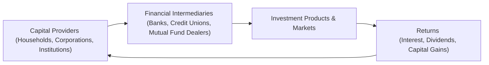

## 2.1 What is Investment Capital?

Sometimes I think back to my very first investment—a few shares of a local Canadian company I’d learned about from a friend. Truth be told, I had almost zero idea what it meant to “put capital to work.” All I saw was a chance to (hopefully) make some money. Over time, I realized that behind every stock purchase, every bond placement, and every mutual fund subscription sits a basic concept: investment capital.

Investment capital is the fuel that helps individuals, businesses, and even whole economies grow. Without it, entrepreneurs can’t hire staff, expand facilities, or develop new products. On a personal level, it’s what allows us to invest in our futures and, if all goes well, earn a return that helps us meet our financial goals—whether that’s buying a home, putting kids through college, or building a comfortable retirement.

Below, we explore what investment capital is, where it comes from, how it flows through Canadian markets, and why it matters to clients, especially in the context of mutual fund investing. By understanding these foundations, you can align your recommendations with real-world market conditions and help your clients make sound, informed decisions.

### The Essence of Investment Capital
Investment capital refers to the money that individuals, businesses, or institutions set aside to purchase assets with the expectation—though never a guarantee—of generating future returns (such as interest, dividends, or capital gains). These assets can be just about anything: stocks, bonds, mutual funds, exchange-traded funds (ETFs), real estate, or even intangible intellectual property. While the term might sound lofty, it basically boils down to, “Hey, I have some extra money I’m willing to invest and (hopefully) grow.”

### Where Does Investment Capital Come From?
Well, it can come from a lot of places. In the Canadian context, we often see:

• Personal Savings: Households setting money aside in bank accounts, registered accounts like TFSAs or RRSPs, or just stashing it under the proverbial mattress (not recommended, of course!).  
• Retained Corporate Earnings: Profitable companies might keep a portion of their income to reinvest in equipment, research, expansion, etc.  
• Borrowed Funds: Low interest rates sometimes encourage borrowing, making more cash available for companies to expand operations or for individuals to invest in real estate or other assets.  
• Equity Issuance: This is when companies sell shared ownership (i.e., stocks) to the public or private investors.  

In Canada, capital formation—basically the process of accumulating funds to invest—gets influenced by various factors, such as interest rates set by the Bank of Canada, government tax incentives, broader market confidence, and the level of foreign investment inflows.

### Why Investment Capital Matters to the Economy
When people pour their money into investments rather than leaving it idle, the entire economy can benefit. This injection of capital helps:

• Create Jobs: Companies can hire and expand.  
• Drive Innovation: More funds available for research and development.  
• Promote Competition: Capital helps businesses scale up and compete, often leading to more efficient markets.  
• Foster Economic Growth: Increases in investment typically lead to higher productivity and, in many cases, better living standards over time.  

And let’s be honest: without sufficient investment capital, many of the modern conveniences we enjoy (smartphones, advanced medical treatments, high-speed internet) might have remained mere dreams because no one had the money to develop them.

### Government Policies and the Flow of Capital
Now, the flow of capital doesn’t happen in a vacuum. In Canada, it’s heavily influenced by government policies—both monetary and fiscal.

• Monetary Policy: Controlled by the Bank of Canada, this involves regulating interest rates and influencing the money supply. Lower interest rates, for instance, typically encourage individuals and companies to borrow and invest more because the cost of borrowing is cheaper.  
• Fiscal Policy: Refers to how the federal government—via the Department of Finance—uses taxation and spending to shape economic activity. Tax incentives (like the benefits for saving in RRSPs, TFSAs, or RESPs) can motivate people to park their money in long-term investment vehicles.  

Additionally, the government sometimes steps in with targeted programs or credits (think programs for small businesses or green-energy incentives) that funnel capital toward specific sectors. As a result, your clients might spot opportunities or be motivated to invest in certain tax-advantaged products after learning that the government is effectively handing out “extra encouragement.”

### Investment Capital and Canadian Regulatory Considerations
Any discussion about Canadian capital would be incomplete without referencing the regulatory landscape. You have the Canadian Investment Regulatory Organization (CIRO), established after the amalgamation of the former MFDA and IIROC. CIRO ensures that dealers and industry professionals comply with rules designed to protect investors and maintain trust in the marketplace. Then there’s the Canadian Securities Administrators (CSA), a coordination body of provincial and territorial regulators, which helps harmonize core policies across different jurisdictions.

Why does any of this matter? Well, you need to know that there are specific standards and rules protecting investors' capital, ensuring that the flow of funds remains transparent and honest. If you’re working as a mutual fund sales representative, compliance with these regulations is non-negotiable. Plus, there’s the Canadian Investor Protection Fund (CIPF), which safeguards client assets (up to certain limits) if a CIRO member firm becomes insolvent.

If this piques your curiosity, check out official sources:  
• [CIRO (Canadian Investment Regulatory Organization)](https://www.ciro.ca/)  
• [Canadian Securities Administrators (CSA)](https://www.securities-administrators.ca/)  
• [Bank of Canada](https://www.bankofcanada.ca/)  
• [Government of Canada – Department of Finance](https://www.canada.ca/en/department-finance.html)

### Risk Tolerance and Time Horizons: Connecting Capital to Client Goals
Clients have many reasons to invest, from short-term savings goals to long-term retirement planning. But their comfort level with risk—often called “risk tolerance”—and their time horizon (how long they’re willing to keep their money invested) greatly affect how their capital is put to use. A client in their early 20s might have decades to recover from market downturns, while somebody nearing retirement may prefer steadier, conservative options to protect what they have.

Remember these points when discussing investment capital with your clients:

• Risk Tolerance: High-risk, high-reward assets like equities or certain alternative investments can see significant volatility. More conservative assets (e.g., government bonds, guaranteed investment certificates) typically fluctuate less but may offer lower returns.  
• Time Horizon: The longer someone can keep their money invested, the more risk they might be able to stomach. Short timelines often suggest focusing on more stable investments.  
• Diversification: Even risk-tolerant, long-term investors benefit from diversifying capital across multiple asset classes—equities, bonds, cash, and sometimes alternative investments—to manage risk effectively.

### Asset Classes: Where Does the Capital Go?
Investment capital is typically allocated among several broad asset classes:

• Equities (Stocks): Shares of ownership in corporations. Over the long run, equities have historically provided higher returns than many other asset classes, but they also come with higher volatility.  
• Fixed Income (Bonds, Debentures): Loans to governments or companies that pay interest, usually seen as less risky than equities (though not risk-free!).  
• Cash and Cash Equivalents (Money Market Instruments): Think of savings accounts, T-bills, money market mutual funds—low risk, low return, but helpful for liquidity or short-term needs.  
• Real Estate: Includes direct residential property ownership, commercial real estate, or real estate investment trusts (REITs).  
• Alternative Investments: Hedge funds, private equity, principal-protected notes (PPNs), liquid alternative funds, or other specialized vehicles. Some are riskier, but they can provide diversification benefits.  

For a deeper dive, you might want to consult the upcoming sections like “Overview of the Canadian Financial Marketplace” or “Types of Investment Products and How They Are Traded” in this course, as well as external references like the [“Canadian Securities Course”](https://www.csi.ca) or the “Investment Funds in Canada” program from CSI.

### Registered Accounts: Enhancing Investment Capital
In Canada, one of the coolest things about building and protecting investment capital is the ability to use various registered accounts. These can lower your taxes and help your money grow faster. If you’re a mutual fund representative, you’ll likely spend a lot of time advising people on these vehicles:

• RRSP (Registered Retirement Savings Plan): Contributions here reduce taxable income (within limits). Growth is tax-deferred, meaning you don’t pay taxes until you withdraw.  
• TFSA (Tax-Free Savings Account): Contributions aren’t tax-deductible, but growth is tax-free. Basically, you don’t pay tax on investment gains or withdrawals.  
• RESP (Registered Education Savings Plan): Encourages saving for education expenses. The government even kicks in grants (like the Canada Education Savings Grant).  
• RRIF (Registered Retirement Income Fund): The continuation of an RRSP after retirement. Mandatory withdrawals apply, giving you regular income in retirement.

Using these registered accounts effectively can expand the pool of investment capital by reducing the tax burden, effectively leaving more money to invest.

### Markets, Confidence, and the Psychological Factor
Investment capital doesn’t just show up because an equation says it should. It’s also about confidence and sentiment. People invest more when they feel optimistic about the economy and markets. I remember, years ago, feeling uneasy about investing after reading negative news headlines. My savings just sat in a low-interest bank account. Eventually, I realized that historically speaking, markets do recover from downturns most of the time—though, of course, they do so at their own pace and with varied results.

Clients might often have these same anxieties. Encouraging them to find a balanced perspective—through research, consultation, and an honest assessment of their risk tolerance—can go a long way. If a client feels more confident (and the economy is stable), there’s a higher likelihood they will put more capital into the market.

### A Simple Formula for Returns
When it comes to measuring the success of investment capital, a basic formula for total return can be useful. Suppose someone invests \\( C_0 \\) dollars initially, and after a period, the value of the investment is \\( C_1 \\). The total return \\( r \\) is:


r = \frac{C_1 - C_0}{C_0} \times 100\%


This is “gross” return. Net return would be adjusted for any fees, taxes, or inflation. While that might look straightforward, actual investment scenarios aren’t always so cut-and-dried. Nonetheless, it’s a good tool for explaining to clients how you might measure performance.

### How Capital Flows — A Visual Overview
To help illustrate how investment capital flows in the market ecosystem, here’s a simple Mermaid diagram:

Capital flows from providers (like you, me, businesses, or large institutions) into financial intermediaries. Those intermediaries channel the funds into various investment products and markets. Then, if all goes smoothly, returns (in the form of interest, dividends, or capital gains) cycle back to the capital providers. This loop keeps the economy humming, fosters wealth generation, and encourages continual reinvestment.

### Real-World Example: Using Investment Capital to Launch a Small Business
Let’s say your client, Sarah, wants to start a small artisanal coffee roasting business in Calgary. She invests $50,000 of her own savings (her personal investment capital) to lease equipment and secure inventory. She also obtains a $30,000 bank loan (borrowed investment capital). With that $80,000 total, she can get off the ground—hiring a small staff and purchasing raw coffee beans.

Assuming the business grows, Sarah might eventually seek more capital—maybe from private investors or by selling shares to friends. In time, if she’s extraordinarily successful, she could even look at tapping the public markets (issuing equity to the general public). That initial injection of investment capital sets the entire venture in motion.

### Continuous Evolution of Capital Markets
The Canadian financial landscape is far from static. New products—like alternative mutual funds, principal-protected notes, or even digital assets—appear regularly, some with the potential to attract significant investment inflows. As a mutual fund representative, you need to tune in to these trends, understanding how evolving product structures or new regulations can shift the ways clients allocate and grow their capital. For instance, the popularity of ETFs has soared over the past decade, in part because of lower fees and ease of trading.

### Common Pitfalls and Best Practices
Clients sometimes misunderstand what “investment capital” really is, which can lead them to invest money they can’t afford to lose or to chase short-term trends without strategy. Here are some pitfalls and how to avoid them:

• Overleveraging: Borrowing too much can magnify losses.  
• Lack of Diversification: Putting “all eggs in one basket” could be catastrophic if that basket goes south.  
• Ignoring Time Horizon: Investing in something highly volatile when you need quick access to funds can lead to forced selling at a loss.  
• Emotional Decision-Making: Fear and greed can overshadow rational analysis.  

Best practices for you and your clients:

• Encourage thorough planning: Budgets, emergency funds, and clearly defined financial goals come first.  
• Prioritize risk management: Teach the basics of diversification and ensure alignment with risk tolerance.  
• Stay informed: Use credible sources (Bank of Canada, CSA, CIRO) for updates on policies, rates, and regulations.  
• Emphasize long-term thinking: Investments can fluctuate. A long horizon can help weather the storms.  

### Connecting Investment Capital with Career Excellence
If you’re a prospective mutual fund sales representative, understanding where your clients’ money comes from and how it’s shaped by public policy and market forces is crucial. It allows you to tailor your advice, explain product choices, and help manage expectations. It also builds trust—clients tend to appreciate reps who see the bigger picture. So keep learning about how Canada’s financial marketplace operates. Cross-reference other sections of this course, like “Overview of the Canadian Financial Marketplace” or “Constructing Investment Portfolios,” to broaden your perspective.

### Next Steps and Further Resources
If you’d like to go deeper into the world of Canadian investing and capital formation:

• Consult the [Bank of Canada](https://www.bankofcanada.ca/) website for updates on monetary policy, interest rates, and economic trends.  
• Check [CIRO](https://www.ciro.ca/) for regulatory guidelines and compliance information.  
• Explore the [Canadian Securities Administrators (CSA)](https://www.securities-administrators.ca/) for a national perspective on securities regulation.  
• Delve into the [Canadian Securities Course](https://www.csi.ca) for a broader foundation in market fundamentals.  
• Look at CSI’s “Investment Funds in Canada” course for more in-depth knowledge about mutual funds and regulations.  

Ultimately, investment capital is the beating heart of financial growth, both for the economy and for individual Canadians. By grasping its sources, uses, and strategic importance, you’re setting yourself—and your future clients—on a path to more informed, confident, and effective investing.

---

## Step Up Your Knowledge: Investment Capital in Canada Quiz



### Which statement best describes investment capital?
- [ ] Money burnt as a tax penalty by the government.
- [ ] Funds allocated exclusively for real estate transactions.
- [x] Funds set aside to purchase assets with an expectation of future return.
- [ ] Capital used for buying only domestic equity in Canada.

> **Explanation:** Investment capital refers to funds that individuals or institutions set aside with the hope of earning future returns by placing them in various assets or ventures.

### Which of the following is a key government body shaping monetary policy in Canada?
- [x] Bank of Canada
- [ ] CIRO
- [ ] Department of Finance Canada
- [ ] CIPF

> **Explanation:** The Bank of Canada is responsible for shaping monetary policy (e.g., setting interest rates), while CIRO oversees dealer regulation, and the Department of Finance sets broader fiscal policy.

### Why do lower interest rates generally increase the amount of investment capital available?
- [ ] Because it forces everyone to invest in gold.
- [x] Because borrowing becomes cheaper, encouraging individuals and businesses to borrow and invest.
- [ ] Because TFSAs stop accumulating interest.
- [ ] Because banks stop lending altogether.

> **Explanation:** Lower interest rates incentivize additional borrowing and can free up funds for investment, expanding the pool of available capital.

### What is the primary goal of portfolio diversification?
- [x] Reduce overall investment risk by spreading capital across multiple asset classes.
- [ ] Guarantee a 100% return.
- [ ] Comply with government-imposed limits on investing.
- [ ] Create only specialized, sector-focused portfolios.

> **Explanation:** Diversification seeks to mitigate risk by avoiding concentrated exposure to any single asset class or sector.

### Which set of accounts provides specific tax advantages for Canadian investors?
- [x] RRSPs, TFSAs, RESPs
- [ ] High-interest checking accounts
- [x] RRSPs, RESPs, TFSAs
- [ ] Offshore hedge funds

> **Explanation:** Registered accounts such as RRSPs, RESPs, and TFSAs offer tax benefits or incentives, encouraging long-term savings and investments.

### Which of the following is NOT commonly considered part of investment capital?
- [x] Money needed for monthly household groceries.
- [ ] Retained earnings from a corporation.
- [ ] Personal savings.
- [ ] Borrowed funds for business expansion.

> **Explanation:** Investment capital doesn’t typically include funds reserved for immediate living expenses like groceries, which you need for day-to-day use.

### Why is understanding risk tolerance crucial when allocating investment capital?
- [x] It ensures investments align with the investor’s comfort level for potential losses.
- [ ] It guarantees returns on the portfolio.
- [x] It ensures investments align with the investor’s comfort level for potential losses.
- [ ] It eliminates the need for diversification.

> **Explanation:** Risk tolerance is about how much fluctuation or downturn an investor can psychologically and financially handle; aligning investments with this level is essential for long-term success.

### How can government tax policies influence the formation of investment capital in Canada?
- [x] By offering tax-advantaged accounts or credits, encouraging individuals and businesses to invest.
- [ ] By restricting all foreign investments.
- [ ] By completely removing the need for capital markets.
- [ ] By prohibiting new financial products from entering the market.

> **Explanation:** Governments often use tax incentives and deductions to encourage savings and investments, which can increase capital formation.

### Which organization is responsible for investor protection if a CIRO member firm becomes insolvent?
- [x] CIPF
- [ ] IIROC (now defunct)
- [ ] MFDA (now defunct)
- [ ] Bank of Canada

> **Explanation:** CIPF (Canadian Investor Protection Fund) protects clients if a CIRO member firm becomes insolvent, ensuring a certain level of asset security.

### True or False: Emotional decision-making often leads investors to make suboptimal asset allocation choices.
- [x] True
- [ ] False

> **Explanation:** Emotions like fear or greed can overshadow rational analysis, leading to impulsive decisions that might not align with a well-thought-out investment strategy.


