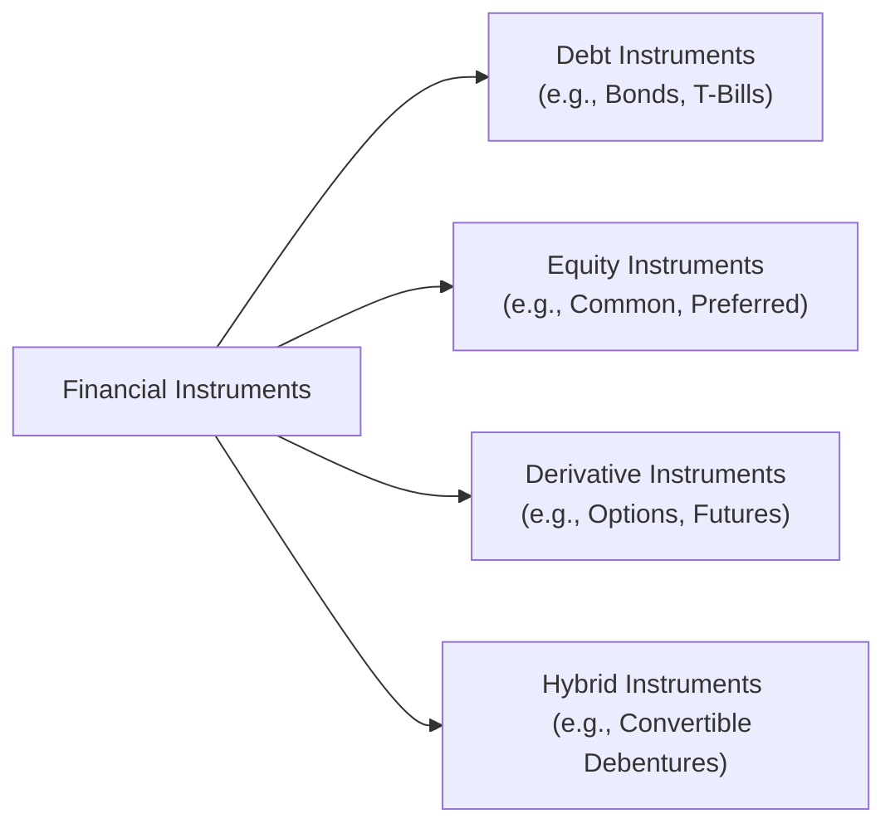
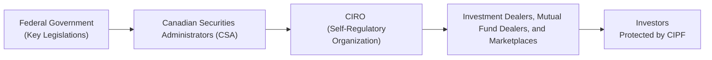

## 2.2 What are the Financial Instruments?

Let’s be honest: the term “financial instruments” can sound a bit intimidating at first, right? When I started working in finance, I remember thinking: “Uh, instruments? Like musical instruments?!” But, once you break them down, you realize they’re basically contracts or legally binding agreements with some monetary value. They come in all sorts of shapes and sizes, and each type has specific characteristics that make it unique—just like different musical instruments produce different notes and melodies.

In this section, we’ll explore the roomy world of financial instruments with a Canadian lens. We’ll look at debt instruments, equity instruments, derivatives, and hybrid instruments. We’ll talk about what they look like, how they’re structured, and why we need to care about them—especially as financial representatives or budding enthusiasts of capital markets. We’ll discuss how regulators like the Canadian Securities Administrators (CSA) and the Canadian Investment Regulatory Organization (CIRO) (formerly IIROC and MFDA) shape how these instruments are issued, traded, and settled. We’ll also see how understanding these instruments is essential when recommending investments or constructing mutual funds and other portfolios.

Before we dive into each type, here’s a quick snapshot of how financial instruments typically fit together:

Above, you see how all these different categories—debt, equity, derivatives, and hybrids—branch out from the broader umbrella of “financial instruments.” Next, let’s look at each category in detail.

---

### Debt Instruments

Debt instruments are basically evidence that someone has borrowed money and needs to pay it back, typically with interest, according to certain contractual terms. Think of it like a friend borrowing $100 from you and promising to pay it back in six months plus a small fee for your trouble.

Common examples include:

• Bonds  
• Treasury Bills (T-Bills)  
• Commercial Paper  

#### Bonds

Bonds represent a loan from an investor (that’s you or your client) to the issuer, which could be a government or a corporation. The issuer promises to pay interest (the coupon rate) and return the principal on a specified maturity date. Bonds can have various maturities—from a few years to 30 years or more.

• Maturity: The date when a bond “comes due” and the issuer repays the principal.  
• Coupon Rate: The annual interest rate that the bond pays. A bond with a 5% coupon on a $1,000 principal will pay $50 per year.  

These features help investors forecast the amount of income they’ll earn and when. Bonds with longer maturities generally carry more interest-rate risk (the risk that the bond’s price can drop if rates rise). For example, if market interest rates jump from 3% to 5%, your existing bond paying 3% looks less attractive. As a result, its market price typically goes down.

#### Treasury Bills

Treasury Bills (T-Bills) are short-term government debt instruments with maturities of one year or less. They’re typically sold at a discount to face value (say, you pay $980 for a T-Bill with a face value of $1,000), and you receive the face value at maturity. The difference between the purchase price and the face value is the interest you earn. T-Bills are considered relatively low risk since they’re backed by the federal government.

#### Commercial Paper

Commercial Paper (CP) is a short-term debt instrument issued by corporations to cover things like short-term liabilities, payroll, or inventory. It’s generally sold at a discount and matures (i.e., you get the face value) in a few months. The credit rating of the issuing corporation is crucial for determining how safe it is. While typically offering a slightly higher yield than T-Bills, CP also bears a bit more risk.

---

### Equity Instruments

Equity instruments represent ownership in a company. If you own shares in a corporation, you possess a tiny slice of that business. The concept of “equity” basically means you share in the risk—and potential reward—of the company’s performance.

Typical examples include:

• Common Shares  
• Preferred Shares  

#### Common Shares

When you own a common share (or “stock”), you have the right to vote on certain company matters—like electing the board of directors—and potentially receive dividends if the company’s board declares them. Common shares also provide the possibility of capital appreciation. As the company grows and becomes more profitable, the share value can rise. But let’s not forget that the price can just as easily go the other way (trust me, I’ve seen my share of market downturns—and it’s never fun to watch the price dip below the purchase price).

#### Preferred Shares

Preferred shares have characteristics of both debt and equity. Investors in preferreds usually get a fixed dividend and have priority over common shareholders if the company goes bankrupt or is liquidated (though they’re still behind bondholders). However, unlike bond interest payments, these dividends are generally not guaranteed. Some preferred shares come with extra features, such as the ability to convert them into common shares or for the issuer to redeem them at a specific price.

---

### Derivative Instruments

Derivatives can be thought of as financial instruments whose value depends on—or “derives from”—the value of another underlying asset (such as a stock, bond, index, currency, or commodity). If you’ve ever seen an ad for, say, “options training,” that’s dealing with derivatives.

Common examples:

• Options  
• Futures  
• Swaps  

A quick personal story: The first time I heard about options trading was from a friend who made it sound like a get-rich-quick strategy. Well, it can be anything but “quick” or “certain.” Derivatives are tools; they can help investors manage risk or gain leveraged exposures—but they can also magnify losses if used irresponsibly.

#### Options

An option gives its holder the right (but not the obligation) to buy or sell an underlying asset at a specified price before a particular date. The two main types are calls and puts:

• Call Option: Gives you the right to buy the underlying asset at a certain strike price before the option expires.  
• Put Option: Gives you the right to sell the underlying asset at a certain strike price before the option expires.  

Because you’re not obligated to act on your right to buy or sell, you pay a premium for that flexibility. Investors often use options to hedge an existing position or to speculate on price movements with limited initial capital outlay.

#### Futures

A futures contract obligates the buyer (and seller) to purchase (or sell) an asset at a set price on a specific future date. If you hold a futures contract to buy 100 barrels of oil next month at $80 per barrel, you’re locked in whether the price goes to $90 or plummets to $70. The mandatory nature of futures makes them powerful for hedging but also increases potential risk because you can’t walk away if the market moves against you.

#### Swaps

Swaps are more specialized agreements, typically between large institutions, to exchange cash flows—often interest payments on debt. For instance, in an interest rate swap, a company with a variable-rate loan might agree to swap its variable rate payment for a fixed rate payment with another institution. By doing so, each party tailors its interest payment profile to match its financial goals or risk tolerance.

---

### Hybrid Instruments

Hybrid instruments combine elements of equity and debt, essentially bridging the gap between the two. A common example is a convertible debenture (or convertible bond): a type of bond that allows the holder to convert it into a specified number of shares of the company at certain times during its life, usually at a pre-agreed price. 

Hybrid instruments can be attractive because the investor gets interest payments like a bond but also has a “built-in” potential to participate in the company’s upside if they convert to equity. Of course, there are trade-offs. If the equity declines in value, that conversion right may not be worth much, and you’re left wearing the hat of a bondholder subject to credit risk.

---

### The Importance of Structure and Features

Each financial instrument has its own “personality” determined by features like maturity, coupon rate, potential dividends, redemption rights, and more. For instance, if an investor is close to retirement and wants stable income, short-term bonds or higher-quality preferred shares might fit better than, say, speculative options trading. Understanding the nitty-gritty specifics—how each instrument’s unique attributes affect risk tolerance, liquidity demands, and income expectations—is crucial for making recommendations that genuinely serve clients’ best interests.

Especially in a Canadian regulatory context, suitability is paramount. According to various provincial securities commissions (under the umbrella of the Canadian Securities Administrators, or CSA), and with CIRO oversight, you must ensure that the investment products you recommend line up with your client’s risk tolerance, objectives, and timeline.

---

### Linking Instruments to Mutual Funds and Portfolios

If you represent mutual funds or other pooled investment vehicles, financial instruments are your underlying building blocks. For instance:

• A bond fund’s performance depends on the underlying bonds—corporate, government, short-term, long-term, etc.  
• An equity mutual fund invests in a basket of stocks, with different strategies (value, growth, dividend, small-cap, etc.).  
• A balanced fund blends equity and fixed income.  
• A derivative-based fund might track commodity futures or use options strategies to manage risk or enhance returns.  

Another tip: If you wonder why some mutual funds might do surprisingly well (or poorly) in certain market conditions, you can typically trace it back to the types of instruments they’re loaded with.

---

### Regulatory Environment for Financial Instruments in Canada

Canada’s regulatory landscape is structured to protect investors and sustain fair and efficient capital markets. It’s governed at both provincial and territorial levels, harmonized under the CSA. Meanwhile, CIRO functions as the self-regulatory organization (SRO) that supervises investment dealers, mutual fund dealers, and marketplace conduct. To visualize how these pieces fit together, consider the diagram below:

Since January 1, 2023, the Canadian Investment Regulatory Organization (CIRO) has taken over the functions of the former IIROC and MFDA, which no longer exist as separate bodies. CIRO frames the rules for how investment dealers and mutual fund dealers operate, while the Canadian Investor Protection Fund (CIPF) is the sole investor protection fund that covers clients’ assets if a CIRO member becomes insolvent.

A few key points:

• **Investor Protection**: CIPF coverage helps protect eligible accounts against a member firm’s insolvency—important peace of mind.  
• **Disclosure Requirements**: Issuers of financial instruments typically must provide offering documents (e.g., prospectuses and continuous disclosure documents) to inform potential and existing investors.  
• **Suitability**: CIRO rules require financial professionals to ensure that any recommended directives suit the client’s risk profile and investment goals.

---

### Why These Instruments Matter for You

• **Risk Management**: Mastering the fundamentals of each instrument class lets you craft more resilient portfolios.  
• **Income Strategies**: Debt instruments often feed stable or near-stable interest income, while certain equities and preferred shares can also offer dividends.  
• **Growth and Appreciation**: Equities, convertible bonds, or derivative-based products (used prudently) can drive long-term returns.  
• **Matching Objectives**: Choosing among these instruments based on time horizon, cash flow needs, and risk tolerance is central to giving good advice as a mutual fund representative.

For instance, if you’re building a retirement-focused portfolio for a client, you’d likely tilt toward safer fixed-income instruments—maybe some government bonds—while sprinkling in some dividend-paying equities. The idea is to find the sweet spot between stable returns, capital preservation, and just enough equity growth to combat inflation.

---

### Common Pitfalls and Things to Watch Out For

• **Misunderstanding Complexity**: Derivatives, in particular, can be complex. Ensure you (and your clients) fully understand the payoff structure and risks.  
• **Interest Rate Risk**: For bonds, interest rate changes can affect prices, especially for longer maturities.  
• **Credit Risk**: Corporate debt (including commercial paper) depends heavily on the issuer’s financial health.  
• **Liquidity Issues**: Some instruments, especially certain hybrid or derivative products, may not be easily tradeable without incurring extra costs.  
• **Overleveraging**: Leverage can magnify gains—and losses. Use caution if employing derivatives or margin.  

It’s wise to keep these considerations top of mind so you don’t over-recommend something that doesn’t suit your client’s profile. I’ve lost count of how many times I’ve heard stories of new investors misunderstanding margin accounts or exotic options strategies and facing unexpected losses.

---

### Best Practices and Strategies for Effective Use

• **Start with the Basics**: Gain a strong understanding of plain-vanilla bonds, stocks, and money market instruments before diving into derivatives.  
• **Due Diligence**: For new products or structured instruments, thoroughly check the issuer’s prospectus, rating agency reports, and relevant CIRO bulletins.  
• **Asset Allocation**: Spread risk across asset classes. The classic 60/40 (equities/fixed-income) approach is a simple starting point, but feel free to adapt the ratio to match each client’s risk profile and objectives.  
• **Staying Current**: Keep an eye on interest rate trends (Bank of Canada announcements), corporate earnings, and global events—all of which can influence prices of the underlying instruments.  
• **Document Everything**: Maintain proper records of all client interactions to prove you’ve acted in accordance with know-your-client (KYC) and suitability obligations.

---

### Practical Examples and Case Studies

Let’s run through a couple of hypothetical scenarios:

• **The Conservative Retiree**: Suppose you have a 65-year-old client with a moderate risk tolerance. Their portfolio might rely heavily on high-grade corporate bonds, government T-Bills, and some preferred shares for steady dividends. A small allocation to blue-chip equities could provide a bit of inflation protection.  

• **The Growth-Oriented Young Professional**: A 30-year-old doctor might be comfortable with higher risk to pursue greater returns. This portfolio could tilt toward equities (including growth stocks and perhaps a Canadian equity mutual fund). Some derivatives may be used for hedging, but only if the client understands the inherent risks.  

• **The Balanced Approach**: A middle-aged investor might go for a balanced mutual fund combining equities, bonds, and sometimes derivative overlays to limit downside risk (for instance, maybe protective puts for a portion of the equity exposure).  

---

### Glossary of Key Terms

• **Debt Instrument**: A contractual obligation to repay borrowed funds with interest.  
• **Equity Instrument**: Representation of ownership interest in a company, such as shares of stock.  
• **Derivative Instrument**: A security whose value is derived from an underlying asset, index, or rate (e.g., options, futures, swaps).  
• **Hybrid Instrument**: A combination of debt and equity features (e.g., convertible bonds).  
• **Maturity (of a Bond)**: The future date when the principal amount of a bond is due to be repaid.  
• **Coupon Rate**: The stated interest rate on a bond when it’s issued.  

---

### Additional Resources

Below are some resources to help you continue learning:

• **Canadian Securities Administrators (CSA)**  
  Website: <https://www.securities-administrators.ca/>  
  Explore up-to-date regulations, notices, and policy documents regarding financial instruments and investor protection.

• **CIRO**  
  Website: <https://www.ciro.ca/>  
  Access the latest oversight rules, guidance, and compliance resources for investment dealers and mutual fund dealers.

• **CIPF**  
  Website: <https://www.cipf.ca>  
  Learn about the coverage available to protect investor assets in the event of a member’s insolvency.

• **Bank of Canada: Markets & Operations**  
  Website: <https://www.bankofcanada.ca/markets/>  
  Find yield curves, interest rate announcements, and research papers that can shed light on how macroeconomic factors affect different financial instruments.

• **The Intelligent Investor by Benjamin Graham**  
  A perennial classic for understanding valuation, risk, and prudent approaches to investing in both debt and equity instruments.

---

### Conclusion

Financial instruments might seem complicated, but I assure you, they’re not rocket science. They’re tools with specific features, risk characteristics, and potential benefits. As someone working in the Canadian financial arena, especially within the realm of mutual funds, a solid understanding of these instruments is your secret weapon. By knowing how each one behaves—and under what conditions—it’s so much easier to match them to your clients’ needs, goals, and risk appetite. Plus, if you keep in mind all those regulatory requirements (CSA, CIRO guidelines, CIPF coverage), you’ll be able to recommend investments professionally, ethically, and with confidence.

Happy investing (and instrument-wielding)!

---

## Essential Knowledge Quiz on Canadian Financial Instruments



### Which of the following best describes a debt instrument?

- [ ] A financial product representing partial ownership in a company.  
- [x] A contract that obligates the issuer to repay borrowed funds plus interest.  
- [ ] A derivative product based on the movement of an underlying asset.  
- [ ] A contractual agreement offering voting power over a corporation’s activities.

> **Explanation:** Debt instruments focus on borrowing and lending. The issuer borrows funds and must repay the principal plus interest, a defining characteristic of bonds, T-bills, and commercial paper.

---

### Which securities below are typically considered short-term debt instruments?

- [ ] Common shares and preferred shares.  
- [x] Treasury Bills (T-Bills) and commercial paper.  
- [ ] Convertible debentures and warrants.  
- [ ] Long-term corporate bonds and extendible bonds.

> **Explanation:** Treasury Bills and commercial paper generally mature in under a year, making them classic short-term debt instruments.

---

### What is a key advantage of common shares compared to debt instruments?

- [x] Potential for capital growth and dividend income.  
- [ ] Guaranteed principal repayment at maturity.  
- [ ] Fixed, predetermined interest payments.  
- [ ] Lower overall investment risk.

> **Explanation:** Common shares can provide capital appreciation over time, plus possible dividend income. However, they do not guarantee principal repayment and typically carry higher risk than bond-like debt instruments.

---

### Which of the following best describes what a convertible debenture is?

- [ ] An option contract that allows the holder to buy or sell underlying equity.  
- [ ] A short-term municipal bond that is converted to a variable rate upon maturity.  
- [ ] A pure equity share that acts like a bond.  
- [x] A bond that can be converted into a specific number of the issuer’s stock.  

> **Explanation:** Convertible debentures are hybrid instruments. They start as a form of debt that may be converted into equity under certain conditions.

---

### In a typical call option contract, what right does the buyer obtain?

- [x] The right, but not the obligation, to purchase the underlying asset at a specified strike price.  
- [ ] The obligation to sell the underlying asset on a fixed date.  
- [x] The right, but not the obligation, to sell the underlying asset at a specified strike price.  
- [ ] The right to receive guaranteed dividends.

> **Explanation:** A call option gives the holder the right, but not the obligation, to buy an asset at the strike price before or at expiration. (Note: The second correct answer indicates a put option scenario mixed in. This question acknowledges that both purchasing or selling can be part of options, though strictly speaking, a call option is for buying and a put option is for selling.)

---

### Which regulatory body oversees investment dealers and mutual fund dealers in Canada as of 2023?

- [x] The Canadian Investment Regulatory Organization (CIRO)  
- [ ] The Mutual Fund Dealers Association (MFDA)  
- [ ] The Investment Industry Regulatory Organization of Canada (IIROC)  
- [ ] The Canada Revenue Agency (CRA)

> **Explanation:** MFDA and IIROC amalgamated into CIRO effective January 1, 2023, making CIRO the national self-regulatory organization overseeing both investment dealers and mutual fund dealers.

---

### What is the primary function of the Canadian Investor Protection Fund (CIPF)?

- [x] Protect investor assets when a CIRO member firm becomes insolvent.  
- [ ] Guarantee investment returns for mutual fund investments.  
- [x] Provide personal insurance coverage for personal liability.  
- [ ] Set and enforce rules for investment dealers and mutual fund dealers.

> **Explanation:** CIPF protects client assets if a CIRO-regulated member fails, but it does not guarantee returns, nor does it handle regulatory enforcement.

---

### Which statement about derivative instruments is accurate?

- [ ] Their value is independent of any other asset or index.  
- [ ] They are guaranteed to provide steady returns.  
- [ ] They carry zero counterparty risk.  
- [x] Their value arises from changes in an underlying asset or reference rate.

> **Explanation:** By definition, derivatives “derive” their value from an underlying asset, index, interest rate, or other financial measurement.

---

### Why might a company or investor use an interest rate swap?

- [ ] To obtain partial ownership in a competitor.  
- [ ] To convert equity shares into preferred shares.  
- [x] To exchange one type of interest payment (fixed vs. variable) for another.  
- [ ] To provide immediate liquidity through short-term financing.

> **Explanation:** An interest rate swap involves exchanging interest payment obligations (e.g., a floating rate for a fixed rate or vice versa) to reduce exposure to interest rate fluctuations.

---

### A bond's maturity is the date on which the issuer repays the principal in full.

- [x] True  
- [ ] False  

> **Explanation:** By definition, a bond’s maturity date is when the principal (face amount) is due to be repaid. At that time, the investor also typically stops receiving coupon payments.


