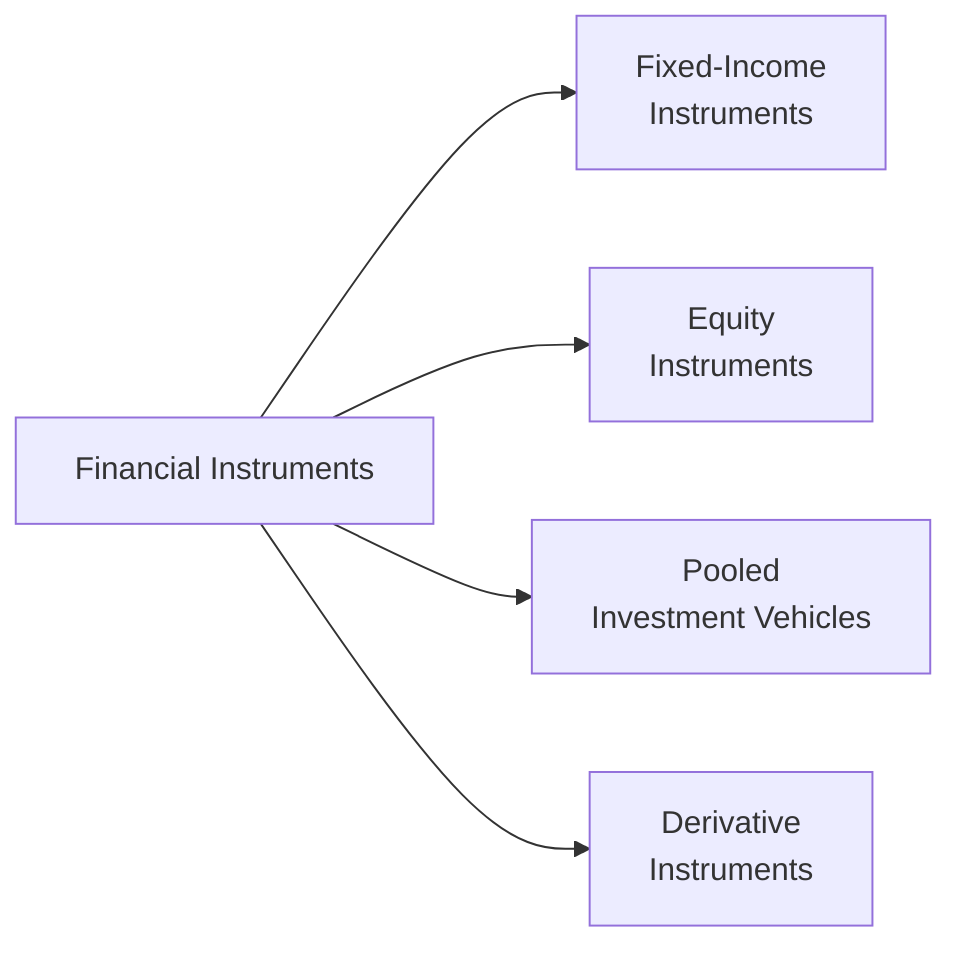

## 2.2 What are the Financial Instruments?

Sometimes we hear the term “financial instruments” and immediately think it’s going to be complicated—like something only a seasoned stockbroker on Bay Street would deal with. But, actually, they’re pretty straightforward once you see them as tools that help individuals, businesses, and governments exchange money, grow wealth, and manage risk. Whether you’re a new mutual fund sales representative or a curious investor, understanding financial instruments is essential to offering sound advice and making wise decisions.

Financial instruments in Canada fall into several categories, each with its own unique features, risks, and potential rewards. Among them, you’ll find fixed-income securities (like bonds or guaranteed investment certificates), equities (common and preferred shares), derivatives (options and futures), and packaged investments (mutual funds and ETFs). 

Understanding how each type of instrument works, how it can fit into an investor’s goals, and the regulatory standards that govern its sale is key to being a trusted representative in the Canadian financial marketplace. Below, we’ll break down the main types of financial instruments and highlight the essential details, from risk and return profiles to the regulatory environment (including the role of the Canadian Investment Regulatory Organization, or CIRO).

---

### Definition and Core Purpose

At the simplest level, a financial instrument is a contract that represents some form of monetary value. It could be a share of company stock that entitles the holder to a portion of the company’s profits (in the form of dividends), or a bond that promises fixed interest payments over time. For instance, imagine your cousin lends you money, and you give them an IOU stating you’ll pay interest at a certain rate— that’s basically a simple form of a financial instrument.

Financial instruments typically fulfill one or more of the following purposes:
• Raising capital  
• Transferring risk  
• Facilitating liquidity  
• Providing returns to investors  

Where do mutual funds fit in? They can be seen as baskets (or pools) of different financial instruments that someone manages on behalf of investors to meet specific objectives—like income, growth, or capital preservation. 

---

### Key Categories of Financial Instruments

While there are countless variations, most financial instruments fall into these broad groups:

• Fixed-Income Instruments  
• Equity Instruments  
• Pooled Investment Vehicles (Mutual Funds, ETFs, and other packaged products)  
• Derivative Instruments  

Within each category, there’s a spectrum of risk, return, and complexity. Let’s go through them in detail and see exactly how they differ.

In the diagram above, you can see how financial instruments are often grouped by their core characteristics. We’ll explore each node step by step.

---

### Fixed-Income Instruments

Fixed-income instruments, in a nutshell, represent loans or debt obligations. These instruments promise a specific rate of return, often referred to as the “coupon” or “interest rate.” They come in various forms, many of which you’ll likely encounter in client portfolios.

#### Bonds
Bonds are typically issued by corporations (corporate bonds) or governments (government bonds). It’s as if the investor is lending money to the issuer, who in turn promises to pay interest at predetermined intervals. Over time, the issuer repays the original loan (or principal) on a specified maturity date. 

• Government of Canada bonds, provincial bonds, and municipal bonds are generally viewed as lower-risk than corporate bonds, owing to the government’s stable credit standing.  
• Corporate bonds can offer higher yields but come with higher credit risk.  

In Canada, you can track government bond auctions, historical yields, and T-bill rates through the Bank of Canada site at:  
[https://www.bankofcanada.ca/rates/](https://www.bankofcanada.ca/rates/)

Bonds can be ideal for clients seeking predictable income. But keep in mind that “predictable” doesn’t mean risk-free. If interest rates rise, the value of older bonds (with lower coupons) generally falls, so markets can fluctuate. There’s also credit risk, which is the possibility the issuer might default.

#### Treasury Bills (T-Bills)
T-Bills are short-term government debt securities, typically with maturities of 3, 6, or 12 months. They’re sold at a discount and redeemed at face value at maturity. The difference between the purchase price and face value is an investor’s return. Being short-term, T-Bills are considered low-risk and are often used by investors to park funds for brief periods.

#### Guaranteed Investment Certificates (GICs)
A GIC is a deposit investment offered by Canadian financial institutions. It guarantees a fixed rate of return over a given period. Usually, GICs have minimal risk because they are often insured by the Canada Deposit Insurance Corporation (CDIC) up to certain limits, although the returns may be modest. I remember the first time I discovered GICs was when my grandmother insisted on something “safe” to lock away her savings—she wasn’t fond of stock market volatility and a GIC offered peace of mind.

---

### Equity Instruments

Equities provide ownership in a company. By purchasing a share, an investor essentially becomes a part-owner (shareholder) of that company. If the company grows and becomes more profitable, the shareholder can benefit from capital gains (the share price going up) and possibly dividends (distribution of corporate profits).

#### Common Shares
Common shares grant shareholders voting rights (for major corporate policies, board of directors, etc.) and typically pay dividends if declared by the company. However, dividends are never guaranteed. Over the long run, equities have historically delivered higher returns than bonds or GICs, but with greater market volatility.

Think about a friend of mine who started investing in tech stocks. She loved the adrenaline rush of potential double-digit gains, but it also came with sleepless nights whenever the market dipped. That’s the trade-off: higher potential returns often come with higher risk.

#### Preferred Shares
Preferred shares offer a slightly different structure: shareholders often do not have the same voting rights, but they have priority over common shareholders for dividend payments and in the event of liquidation. Preferred shares can behave somewhat like hybrid instruments—part equity, part fixed-income—due to their steady dividend payouts.

---

### Pooled Investment Vehicles

#### Mutual Funds
Mutual funds pool money from many investors to purchase a portfolio of securities—bonds, stocks, or both. A professional manager decides on the composition of the fund, buying and selling instruments in line with the fund’s stated objectives.

• They provide diversification, convenience, and professional management.  
• However, mutual funds also come with management fees, administration fees, and other expenses that can eat into returns.  

Details on mutual fund disclosure and regulations, including the Fund Facts document requirement, are guided by the Canadian Securities Administrators (CSA) under National Instrument 81-101. You can find more information at:  
[https://www.osc.ca/](https://www.osc.ca/)

From a regulatory standpoint, mutual fund dealers and their representatives are commonly overseen by CIRO (the Canadian Investment Regulatory Organization). Keeping in line with CIRO rules is essential, so definitely bookmark [https://www.ciro.ca/](https://www.ciro.ca/) for updates and guidance.

#### Exchange-Traded Funds (ETFs)
ETFs are like mutual funds in that they pool money to invest in a basket of securities. However, they trade on stock exchanges, making them highly liquid. Many ETFs track market indices (like the S&P/TSX Composite), aiming to replicate its performance with relatively low fees. Some ETFs are actively managed, while others are passively managed. 

A friend once compared an ETF to a “grab-and-go meal” from your favorite grocery store: it’s everything you need in one package, and you can purchase it quickly. That simplicity and efficiency appeal to many investors, especially those who enjoy a more hands-on approach.

---

### Derivative Instruments

Derivatives derive their value from an underlying asset—such as an equity, bond, currency, commodity, or market index. Common derivatives include:

• Options  
• Futures  
• Swaps  
• Forwards  

Derivatives can be used for:
1. Hedging risk (like an airline protecting itself against rising oil prices).  
2. Speculating on price movements (generating potential profits from directional bets on market fluctuations).  

In Canada, derivative markets are accessed through regulated exchanges or over-the-counter (OTC) agreements. Complexity and leverage are key characteristics of derivatives—both can magnify gains or losses. For a mutual fund sales representative, it’s crucial to understand how derivatives might be used (for example, in alternative funds or certain hedge strategies) and to ensure your client’s risk tolerance matches the product.

---

### Balancing Risk and Return

One of the golden rules in finance: higher potential returns generally come with higher risk. So, an investor who wants more predictable returns might opt for government bonds or GICs, while someone seeking growth may choose equities or equity-focused mutual funds/ETFs. Meanwhile, sophisticated investors with specific hedging objectives might incorporate derivatives.

Most people want some safety net alongside the possibility of gains. A diversified portfolio might wind up including a little bit of everything—some equities, a few bonds, maybe an ETF for broad market exposure, and a component of cash or cash equivalents for liquidity needs.

---

### Regulatory Oversight in Canada

Canada’s securities regulation primarily occurs at the provincial and territorial level, with additional coordination through national bodies such as the Canadian Securities Administrators (CSA). There is also CIRO, the Canadian Investment Regulatory Organization, which oversees the activities of registered investment and mutual fund dealers.

Points to remember:
• As of June 1, 2023, CIRO is now the consolidated SRO, replacing the defunct IIROC and MFDA.  
• All dealers must abide by CIRO’s rules for investor protection, sales practices, and disclosure.  
• The Canadian Investor Protection Fund (CIPF) protects client assets if a member firm becomes insolvent (though it doesn’t safeguard against market losses).  

When providing clients with advice on financial instruments, always remain mindful of the Know Your Client (KYC) and suitability requirements. This includes evaluating client goals, risk tolerance, investment horizon, and special circumstances.

---

### Real-World Examples and Case Studies

#### Example 1: Fixed-Income for Retirement Income
Suppose you have a client nearing retirement who prioritizes capital preservation and a steady stream of income. By combining government bonds and high-grade corporate bonds within a mutual fund, you can build a stable fixed-income portfolio that aims to protect capital while generating modest interest. Discuss with them the pros (predictable income) and cons (inflation risk and lower potential returns compared to equities).

#### Example 2: Growth-Seeking Millennial
Let’s say a 28-year-old software engineer wants to save aggressively for the long-term. They can handle more volatility because retirement is decades away. A portfolio tilted more toward equity instruments—like equity mutual funds, ETFs, or even select individual stocks—could harness long-term growth potential. They might also want to allocate a portion to safer instruments just in case they need emergency liquidity.

#### Example 3: Hedging with Derivatives
Imagine a small Canadian business that exports to the U.S. and worries about fluctuating currency exchange rates. If they anticipate receiving large amounts of U.S. dollars, they might buy currency futures to lock in an exchange rate. Mutual fund reps rarely engage directly in these transactions, but understanding how your client’s other exposures might be hedged is still beneficial knowledge.

---

### Common Pitfalls and Best Practices

1. Overconcentration  
   • Putting all your eggs in one basket can be dangerous. Diversification can help mitigate risk.  

2. Misunderstanding Complex Products  
   • Derivatives, hedge funds, and alternative products can be intricate. If you don’t understand it fully, make sure to do your homework or consult an expert before advising clients.  

3. Ignoring Fees and Expenses  
   • Management Expense Ratios (MERs), transaction costs, and other fees can significantly reduce returns over the long run. Transparency is key.  

4. Lack of Regulatory Compliance  
   • Always remember CIRO obligations, especially KYC requirements and suitability rules.  

5. Emotional Investing  
   • Many clients fall prey to panic selling and greed-based buying. Helping clients maintain a rational approach is part of your job as a sales representative.  

---

### Additional Resources

• CSA National Instrument 81-101 (Mutual Fund Prospectus Disclosure):  
  [https://www.osc.ca/](https://www.osc.ca/)  
• CIRO Rules and Guidance:  
  [https://www.ciro.ca/](https://www.ciro.ca/)  
• Government of Canada bond auctions and T-bill rates:  
  [https://www.bankofcanada.ca/rates/](https://www.bankofcanada.ca/rates/)  
• Book Recommendation: “The Intelligent Investor” by Benjamin Graham for fundamental investing insights.  
• Open-Source Tools: Platforms like “QuantLib” (a C++ library) can be used to delve deeper into valuation of complex financial instruments.  

If you ever feel stuck, brush up on these resources, chat with colleagues who specialize in certain product lines, or consult your firm’s compliance department. The financial world is dynamic, so continuous learning is part of the job.

---

### Wrapping Up

Well, there you have it. Financial instruments may seem daunting at first, but each category essentially represents different ways to lend, own, or speculate on monetary value. Whether a portfolio tilts heavily to bonds, equities, or more sophisticated derivatives all comes back to the specific investor’s risk tolerance, time horizon, and objectives.

For a Mutual Fund Sales Representative—or any financial professional—knowing the ins and outs of these instruments is critical. Your clients (and your future self) will thank you for the thoughtful, tailored guidance. And if you ever find yourself drifting into confusion, remember to circle back to the fundamentals: risk vs. reward, diversification, and a thorough understanding of the regulatory landscape. It really can be that simple—though maybe not always easy—to do right by your clients.

Keep in mind that each product has fees, potential benefits, and inherent risks, and clarity in explaining all these factors is one of the best ways to build trust and a long-term client relationship.

---

## Test Your Knowledge of Financial Instruments in Canada



### Which of the following best describes a financial instrument?

- [x] A contractual agreement representing a monetary value or claim
- [ ] A filing system for storing client data
- [ ] A non-financial, non-disclosure agreement
- [ ] A marketing strategy for mutual funds

> **Explanation:** A financial instrument is any contract that represents a monetary claim or value, such as stocks, bonds, or derivatives.

### Which of the following is an example of a low-risk, short-term fixed-income instrument often issued by the Canadian government?

- [x] Treasury bill (T-Bill)
- [ ] Common share
- [ ] Preferred share
- [ ] Convertible debenture

> **Explanation:** T-Bills are short-term government debt sold at a discount and redeemed at face value, making them lower in risk and commonly used for short-term liquidity.

### Which of these is true about common shares?

- [x] They represent equity ownership and often include voting rights.
- [ ] They represent debt with guaranteed interest repayments.
- [ ] They pay interest rather than dividends.
- [ ] They are insured by the Canada Deposit Insurance Corporation (CDIC).

> **Explanation:** Common shares give shareholders partial ownership of a company with voting rights and the potential to receive dividends, but no guaranteed returns.

### What is the main function of mutual funds?

- [x] Pooling money from investors and investing in a diversified portfolio
- [ ] Providing unlimited access to currency derivatives
- [ ] Guaranteeing returns above inflation
- [ ] Minimizing exposure to any type of risk

> **Explanation:** Mutual funds aggregate investor capital to benefit from professional management and diversification. They do not guarantee returns, and many involve market risk.

### In Canada, which entity now oversees mutual fund dealers after January 1, 2023?

- [x] The Canadian Investment Regulatory Organization (CIRO)
- [ ] The Mutual Fund Dealers Association (MFDA)
- [x] The defunct MFDA historically
- [ ] The Investment Industry Regulatory Organization of Canada (IIROC)

> **Explanation:** As of June 1, 2023, the MFDA and IIROC amalgamated into CIRO, which oversees mutual fund and investment dealers. MFDA and IIROC are defunct (historical references only).

### Which of the following statements about derivatives is accurate?

- [x] Derivatives derive value from an underlying asset and can be used for hedging or speculation.
- [ ] Derivatives carry no market risk.
- [ ] Derivatives are direct equity investments in a corporation.
- [ ] Derivatives guarantee principal repayment.

> **Explanation:** By definition, derivatives are contracts whose value depends on an underlying security or index, and they can be utilized for hedging or speculative purposes.

### What is one key advantage of investing in ETFs compared to traditional mutual funds?

- [x] They can be traded on an exchange throughout the trading day.
- [ ] They are immune to capital gains taxes.
- [x] They have immediate compliance with any recognized exchange.
- [ ] They require large initial investments and place minimum holding periods.

> **Explanation:** ETFs can be bought or sold at any time during market hours, unlike mutual funds which execute at the day’s closing NAV. They typically have no minimum required holding period.

### Why might a client choose government bonds over corporate bonds?

- [x] Lower credit risk
- [ ] Higher coupon rate
- [ ] Unlimited growth potential
- [ ] No risk from interest rate fluctuations

> **Explanation:** Government bonds typically present lower credit risk compared to corporate bonds. They can still fluctuate in price with interest rate changes, but the risk of default is generally lower than corporations.

### Which scenario best illustrates a client using derivatives for hedging purposes?

- [x] A wheat farmer using futures to lock in a selling price
- [ ] A day trader buying shares of an emerging tech company for growth
- [ ] A mutual fund rep recommending GICs to preserve capital
- [ ] An investor purchasing an index ETF for diversification

> **Explanation:** Hedging involves reducing risk by locking in a future price. This is exactly what a farmer might do by using wheat futures to guard against price drops.

### In Canada, which is TRUE about T-Bills?

- [x] True
- [ ] False

> **Explanation:** T-Bills are considered among the safest short-term investment categories in Canada. They are issued by the government, offered at a discount, and redeemed at par.


