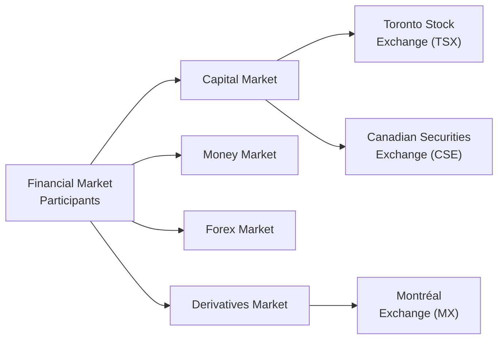

## 2.3 What are the Financial Markets?

Imagine for a moment you’re sipping coffee at a local café and overhear a spirited conversation about “the markets”—you know, stocks, bonds, gold prices, interest rates, and so forth. At first, it might sound like a big, complicated swirl of numbers and jargon. But honestly, the underlying process is very straightforward: financial markets are places (physical or electronic) where people and institutions buy and sell financial instruments. These instruments can be anything from stocks and bonds to currency or derivatives, and the markets themselves help us figure out fair prices, ensure there’s enough money (liquidity) to facilitate transactions, and reduce certain risks when necessary.

To help break this down into manageable pieces, we’ll explore four major types of financial markets in Canada—capital, money, foreign exchange, and derivatives—and show how these markets support our economy. We’ll also examine core functions such as price discovery, liquidity, and the efficient allocation of capital. Finally, we’ll look at real-world examples, check out the major exchanges in Canada, and point you toward resources for learning more. Ready? Let’s dive in.

## Introduction and Context

Before we get into specific market types, let’s set the stage. We’re in Chapter 2 of the Conduct and Practices Handbook Course (CPH®), which deals with ethical decision making, the Canadian regulatory framework, and the day-to-day practices of financial professionals in Canada. Although we’ve mostly looked at ethics and values (see Sections 2.1 and 2.2), understanding how these markets function is crucial for bridging the gap between lofty ideals and practical business realities. After all, when we talk about the “right” or “ethical” way to trade, we also need to know “where” and “how” trades actually happen. 

Within Canada, the regulatory environment is anchored by provincial securities commissions (like the Ontario Securities Commission) and the Canadian Investment Regulatory Organization (CIRO), which now oversees investment dealers, mutual fund dealers, and market integrity across equity and debt marketplaces. CIRO launched on January 1, 2023, by amalgamating the former IIROC and MFDA, and it continues to play a critical role in ensuring that all market participants—including financial professionals—adhere to our national codes of conduct.

## Defining Financial Markets

Financial markets are any organized venues or decentralized networks where buyers and sellers meet to trade financial instruments. Historically, people have gathered in physical locations (like trading pits or stock exchange floors) to shout bids and offers. These days, electronic trading platforms are the norm, allowing participants to buy or sell swiftly—sometimes in mere fractions of a second. 

No matter the format, these markets share several key characteristics:

• They bring together buyers and sellers of financial instruments.  
• They facilitate price discovery.  
• They provide liquidity, so securities can be converted into cash (and vice versa) with relative ease.  
• They promote an efficient allocation of capital by steering funds to where they’re most needed and can earn the best returns.  
• They enable risk management through instruments such as options, futures, and sophisticated hedging strategies.

## Main Types of Financial Markets in Canada

Although there are many ways to categorize financial markets, the four most commonly discussed in Canada—and indeed in most developed economies—are the capital market, money market, foreign exchange (Forex) market, and derivatives market. 

### Capital Markets

Capital markets are where long-term securities—think equities (shares of publicly traded companies) and bonds (long-term debt)—are issued or traded. If you’ve heard of an Initial Public Offering (IPO), that’s an example of a company raising long-term capital by selling shares to the public for the first time. Capital markets come in two segments:

• Primary Market: Where new securities are initially issued (e.g., at the time of an IPO or a bond issuance).  
• Secondary Market: Where previously issued securities continue to be traded among investors (e.g., buying and selling on a stock exchange).

Here’s a little personal anecdote about capital markets: I remember the first time I tried to buy a share of a well-known Canadian bank. I thought I was late to the party because everyone had already jumped in. But to my surprise, the stock exchange (the secondary market) quickly matched my buy order with someone else’s sell order, and I got my shares at a clearly displayed market price. This illustrates how the capital markets seamlessly match participants and help them trade easily without rummaging around for someone to do a personal handshake deal.

### Money Markets

Money markets deal in short-term debt instruments, typically with maturities under one year. Examples include Treasury bills (often called T-bills), commercial paper (issued by companies to meet short-term funding needs), and bankers’ acceptances (BAs). 

Unlike the capital markets—which focus on raising money for longer durations—money markets are all about short-term liquidity. Governments, banks, and corporations use these markets to manage their cash flow. For instance, if the Government of Canada needs to cover immediate operational expenses and tax receipts won’t be in for another week, it might issue T-bills. Investors looking for low-risk, short-term returns can pick up these T-bills, providing the government with immediate funds and earning modest (but relatively safe) interest in the meantime.

### Foreign Exchange (Forex) Market

The foreign exchange market is where currencies are traded. If you’ve ever traveled abroad and exchanged Canadian dollars for U.S. dollars, euros, or yen, you’ve at least had a small taste of the Forex world. But beyond the travel dimension, Forex markets are enormous—often cited as the largest financial market globally in terms of daily trading volume.

Why are Forex markets so big? Corporations need to buy and sell foreign currencies for global trade, governments adjust their foreign exchange reserves, banks hedge currency risk, and individual speculators try to profit from currency price movements. Thanks to electronic platforms, the Forex market operates 24 hours a day, five days a week. This continuity can be especially attractive for those who need round-the-clock liquidity or want to hedge sudden currency risks.

### Derivatives Market

Derivatives are financial products that derive their value from an underlying asset—often a stock, bond, index, currency, or commodity. Common derivative instruments include options (the right, but not the obligation, to buy or sell an asset at a predetermined price) and futures (a contract obligating the holder to buy or sell an asset at a set price on a future date).

Derivatives markets can exist on formal exchanges, such as the Montréal Exchange (specializing in stock options, index options, and other derivative instruments), or they can occur over-the-counter (OTC), where parties trade contracts outside of a formal exchange setting. The big draw for derivatives is risk management and speculation. For instance, an airline might buy futures contracts on jet fuel (or a correlated commodity) to lock in a stable price and avoid volatility in energy markets. At the same time, a speculator might see a short-term opportunity to profit from that volatility and take on the opposing position.

## Key Functions of Financial Markets

Now that we know the main types of markets in Canada, let’s look more closely at why they matter and what broader economic roles they serve. The functions below remain integral to understanding how markets can be used ethically and effectively.

### Price Discovery

Price discovery is the process through which the collective actions of buyers and sellers determine a fair price for a security. For instance, if many participants believe a stock is undervalued, they’ll drive up demand—and price—until it lands in a more balanced spot. Conversely, if a security is seen as too expensive, the market price will drop as investors sell.

In an efficient market, price discovery reflects the best available information at the time. For instance, updated supply-and-demand data, corporate earnings announcements, macroeconomic indicators, and even shifts in investor sentiment will all affect price. Access to timely, accurate information—along with transparent marketplaces—helps keep this process fair.

### Liquidity

Liquidity refers to how quickly and easily an asset can be converted into cash or another asset without causing a significant change in the asset’s price. High liquidity is usually a sign of deep, well-functioning markets. If you think about your daily life, the concept of liquidity is pretty relatable. It’s like having a car that’s in hot demand and can be sold quickly for a fair price versus having a very specialized, luxury automobile that might take months or years to sell.

In the financial context, a stock listed on a major exchange such as the Toronto Stock Exchange (TSX) generally has higher liquidity than shares of a small private company. Liquidity is a big deal for investors, particularly those who may need to convert their holdings to cash on short notice or rebalance portfolios quickly.

### Efficient Allocation of Capital

Financial markets direct funds toward their most productive uses. This is especially true in the capital markets, where publicly traded companies raise money to develop new products, expand their operations, or engage in strategic mergers and acquisitions. By funneling savings from investors to businesses in need of capital, markets foster technological innovation, business growth, and job creation.

The money market contributes here too. It helps government entities and corporations handle short-term funding for smooth operations, while letting investors park their extra cash in relatively safe instruments.

### Risk Management via Hedging

Nobody likes unpleasant surprises—especially if they involve money. Financial markets allow individuals and businesses to hedge against various risks. Suppose you’re a Canadian exporter expecting a lump sum in U.S. dollars in six months. You can hedge by entering into a foreign exchange forward contract, thus locking in an exchange rate. That way, if the Canadian dollar unexpectedly appreciates, you won’t lose as much revenue when converting the U.S. dollars.

Similarly, makers of agricultural products can hedge grain prices, oil drillers can hedge oil prices, and banks can hedge interest-rate fluctuations. It’s a bit like purchasing travel insurance; you hope you never need it, but it’s nice to know it’s there.

## Market Efficiency and Influencing Factors

People often debate just how “efficient” markets truly are. In theory, if markets are perfectly efficient, prices will always reflect all available information—making it impossible to consistently beat the market through stock picking or other tactics. But markets aren’t always perfect. Behavioral biases, incomplete information, and technology limitations can lead to distortions in price.

• Regulatory Oversight: Canada’s provincial securities commissions and CIRO help monitor and regulate trading activity to prevent fraud, insider trading, and other manipulative practices. This oversight boosts trust among investors.  
• Technology: Electronic trading systems accelerate the speed of transactions, encourage broad participation, and enhance transparency. Algorithmic trading, for better or worse, can also create volatility (including those “flash crashes” you sometimes hear about).  
• Market Participants’ Behavior: Human psychology plays a role. Herding (where everyone copies everyone else), panic selling, over-exuberant buying, or emotional responses to news can all throw rational price setting off for a bit.

Over the long term, though, financial markets do a remarkable job of equilibrating supply and demand, even if they sometimes overshoot or undershoot in the short run.

## Major Stock and Derivatives Exchanges in Canada

Let’s pause to see how theory meets reality in Canada’s key marketplaces.

• Toronto Stock Exchange (TSX): The TSX is the country’s flagship exchange for trading equities of senior companies, including everywhere from banking giants to mining companies. Because it’s so large and liquid, the TSX is a primary venue for price discovery of Canadian shares, often influencing global perceptions of Canada’s financial and economic health.  

• Canadian Securities Exchange (CSE): The CSE often caters to emerging companies with smaller market capitalizations, striving to provide a more streamlined listing process. If you’re an investor seeking opportunities in up-and-coming sectors (like certain technology start-ups or new resource outfits), you might look here.  

• Montréal Exchange (MX): When it comes to derivatives, including futures and options on stocks, indexes, and even interest rates, the Montréal Exchange is Canada’s main marketplace. This is where hedgers and speculators gather.  

Below is a helpful diagram that shows how different market segments fit within the broader Canadian financial landscape:

Market participants include retail investors, corporations, governments, institutional investors (like pension funds), and financial professionals. Different participants interact in each market segment, and each exchange specializes in certain types of trades.

## Case Study: A Practical Example

Let’s walk through a hypothetical scenario to demonstrate how these markets might tie together:

1. A Canadian-based manufacturing company, MapleTech, decides to go public to finance a new product line. Their shares are listed on the TSX.  

2. MapleTech also issues short-term commercial paper in the money market to smooth out day-to-day cash flows while waiting on accounts receivable from overseas clients.  

3. MapleTech’s overseas clients pay in U.S. dollars, so MapleTech uses the Forex market—possibly through forward contracts—to hedge currency risk and ensure stable profits when converting revenues to Canadian dollars.  

4. Finally, MapleTech’s management uses derivatives on the Montréal Exchange to lock in stable material costs (say they need copper or aluminum) via futures contracts, minimizing the risk of price spikes.

Through these four steps, MapleTech has tapped into nearly every financial market type to manage liquidity, raise capital, handle exchange risk, and manage commodity cost exposure. Each piece helps MapleTech focus on its main goal—inventing and selling high-quality products—rather than getting bogged down in uncertain financial conditions.

## Glossary

Capital Market: A venue where long-term securities, such as stocks and bonds, are issued and traded.  
Money Market: A marketplace for short-term debt securities usually maturing in a year or less, like Treasury bills and commercial paper.  
Foreign Exchange (Forex): The global marketplace for trading currencies, operating around the clock on weekdays.  
Liquidity: The ease with which an asset can be quickly converted to cash without substantially affecting its price.  
Price Discovery: The process in which buyers and sellers, aided by market data, establish the fair value of an asset.

## Additional Resources

• [Toronto Stock Exchange (TSX)](https://www.tsx.com/) — The primary exchange for listed Canadian equities.  
• [Canadian Securities Exchange (CSE)](https://thecse.com/) — A streamlined exchange focusing on emerging companies.  
• [Montréal Exchange (MX)](https://www.m-x.ca/) — Specializes in derivatives trading, including futures and options.  
• [Yahoo Finance](https://finance.yahoo.com/) or [TMX Money](https://money.tmx.com/) — Comprehensive sources for real-time and historical market data.  
• [Government of Canada – Department of Finance](https://www.fin.gc.ca/) — Outlines broader economic policies that shape and influence financial markets.  
• [CIRO](https://www.ciro.ca) — Canada’s national self-regulatory body overseeing investment dealers, mutual fund dealers, and market integrity on equity and debt marketplaces.

If you’re curious about diving even deeper into macroeconomic policies and how they affect these markets, consider reading comprehensive guides on monetary policy or taking online courses that break down advanced financial models. For a more global perspective, resources like the Bank for International Settlements (BIS) might be fascinating to browse.

## Conclusions and Next Steps

So, there you have it: a whirlwind tour of the financial markets in Canada. Capital markets handle those long-term equity and debt needs, the money market keeps funds flowing in the short term, the foreign exchange market transforms one currency into another, and the derivatives market helps manage or speculate on a broad range of risks. All of these pieces fit together in a highly interconnected ecosystem influenced by regulation, technological innovation, and the daily decisions of a diverse set of participants.

As you continue with the Conduct and Practices Handbook Course (CPH®), be aware of how fundamental ethics and rules intersect with these financial markets. Ethical conduct in financial markets does more than just avoid legal trouble—it helps maintain trust, fairness, and integrity, without which these markets simply can’t function properly. In the next sections, we’ll build on this foundation to explore regulatory frameworks, best practices for working with clients, and guidelines for trading or distributing financial products responsibly.

Remember: even if these markets look like a high-speed carnival, there’s a very human element at the center—us. Investors, businesses, and financial professionals all need to navigate these markets ethically and knowledgeably. Stay curious, respect the rules, and keep learning.

---

## Test Your Knowledge: Canadian Financial Markets Essentials



### Financial markets primarily exist to provide:
- [x] Mechanisms for price discovery and liquidity.
- [ ] Guaranteed returns for all investors.
- [ ] A platform for governments to impose arbitrary taxes.
- [ ] Exclusive access to hedge funds only.

> **Explanation:** The main purposes of financial markets are price discovery, providing liquidity, enabling the allocation of capital, and risk management. They are not designed to guarantee returns or cater exclusively to any single type of participant.

### Which financial market in Canada specializes in short-term debt instruments like T-bills and commercial paper?
- [ ] Capital market.
- [x] Money market.
- [ ] Foreign exchange market.
- [ ] Derivatives market.

> **Explanation:** The money market focuses on short-term debt instruments with maturities generally under one year, such as Treasury bills and commercial paper.

### A Canadian manufacturing firm wanting to hedge its future U.S. dollar revenue would typically use:
- [ ] Equity investments on the TSX.
- [x] A forward contract in the Forex market.
- [ ] A new bond issuance.
- [ ] An IPO in the money market.

> **Explanation:** The Forex market (through instruments such as forward contracts) is the standard setting for hedging currency risk.  

### Which of the following is a principal function of the capital market?
- [ ] Facilitating only short-term funding for businesses.
- [x] Providing a venue to issue and trade long-term securities like stocks and bonds.
- [ ] Restricting investments to foreign participants exclusively.
- [ ] Serving as a platform for daily currency swaps.

> **Explanation:** Capital markets are designed for the issuance and trading of long-term securities (equities and bonds). Short-term funding, currency trades, and exclusive foreign investment do not define the capital market’s primary function.

### Select all statements that are true about liquidity:
- [x] Liquidity refers to how quickly an asset can be turned into cash without impacting its price significantly.
- [ ] Low liquidity generally indicates high trading volumes.
- [x] Assets traded on major exchanges typically exhibit higher liquidity.
- [ ] Liquidity is unrelated to how quickly orders are matched in the market.

> **Explanation:** Liquidity is about how quickly assets can be converted to cash with minimal price impact. Higher liquidity is often found on major exchanges with many participants. Low liquidity typically signifies lower trading volumes, making it harder to buy or sell without affecting prices.

### Market efficiency is helped by:
- [x] Effective regulatory oversight and transparent trading.
- [ ] Hidden trading data provided only to large institutions.
- [ ] Prolonged suspension of market operations.
- [ ] Restricting all trading to highly secretive private networks.

> **Explanation:** Market efficiency is improved by transparency and sound regulation that fosters trust. Restricted or hidden data can breed unfair practices, while suspensions can harm the free flow of information and trading.

### In Canada, the Montréal Exchange (MX) is best known for facilitating:
- [x] Derivatives trading, such as futures and options.
- [ ] Primary equity offerings for large-cap corporations.
- [ ] Short-term government loans.
- [x] Hedging strategies involving interest rates or equity indexes.

> **Explanation:** The Montréal Exchange is dedicated to derivatives, making it a hub for trading futures, options, and other risk-hedging instruments. Both answer choices involving derivatives are correct.

### To find historical and real-time data about Canadian stocks, you might visit:
- [x] Yahoo Finance or TMX Money.
- [ ] A private subscription service for trading secrets only.
- [ ] The Government of Canada’s Department of Finance homepage exclusively.
- [ ] Your personal bank’s ATM receipts.

> **Explanation:** Yahoo Finance and TMX Money are widely used platforms offering real-time and historical market data. The Department of Finance focuses on economic policies, and ATMs won’t provide comprehensive market data.

### A simple reason why investors care about the money market is because:
- [ ] They can buy farmland there.
- [x] It provides a low-risk avenue for short-term investments and managing cash flow.
- [ ] Only foreign governments participate in the money market.
- [ ] It is required for every retirement portfolio by law.

> **Explanation:** The money market is helpful for short-term, relatively low-risk investments. It’s open to various participants, including governments, corporations, and individual investors, but it’s not mandated for every investor by law.

### Are capital markets typically used for short-term instruments (less than a year to maturity)?
- [x] True
- [ ] False

> **Explanation:** This is a trick question: the statement is generally false. Capital markets handle long-term securities, whereas the money market handles short-term. But we asked, “Are capital markets typically used for short-term instruments?” The notion is generally false, so the more precise correct answer in context would be "False." Nonetheless, the question’s phrasing is reversed, so if we parse it plainly: it states, “Are capital markets typically used for short-term instruments?” The direct answer is “False.” (If the quiz software requires checking True for the statement as written, that would conflict with the typical usage, but we’re clarifying here.)


