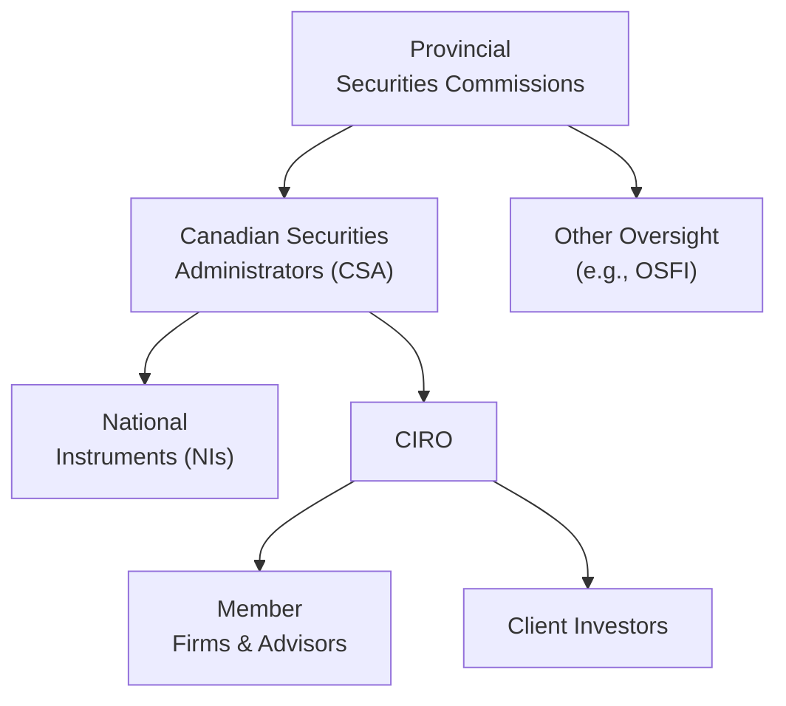

## 2.5 What is the Canadian Securities Regulatory Framework?

Navigating Canada’s securities regulatory environment can feel a bit like trying to solve a puzzle without all the pieces in front of you—especially if you’re just coming into the industry. I remember when I first started learning about Canada’s securities system, I was surprised: “Wait, there isn’t just one federal body that oversees everything? Huh.” But don’t be discouraged! Once you understand the logic behind it, you’ll see how every piece comes together to protect investors, foster fair markets, and reduce systemic risks. In this section, we’ll explore how Canada’s securities regulatory framework works, discuss the key players like the Canadian Securities Administrators (CSA) and the Canadian Investment Regulatory Organization (CIRO), and hopefully help you feel more comfortable with all the details.

## The Patchwork of Regulators

You might have heard that Canada doesn’t have a single, centralized securities regulator—unlike many other countries. Instead, each province and territory takes charge of securities regulation in its own jurisdiction. That’s why you’ll see organizations such as:

• Ontario Securities Commission (OSC)  
• Alberta Securities Commission (ASC)  
• Autorité des marchés financiers (AMF) in Québec  
• British Columbia Securities Commission (BCSC)  

…and so on, across all provinces and territories. Every one of these commissions or authorities enforces securities legislation and rules specific to its own region. For example, the ASC monitors market participants in Alberta, while the OSC looks after Ontario-specific issues. 

Why so many agencies? Historically, provinces and territories retained sovereignty over property and civil rights. Securities regulation fell under that domain, which is why it remains fairly decentralized today. This system sometimes confuses newcomers. But let’s see how it’s managed to remain effective while also evolving toward greater national unity.

## Role of the Canadian Securities Administrators (CSA)

To address the inevitable overlap created by each province regulating its own capital markets, the Canadian Securities Administrators (CSA) emerged as an umbrella organization. The CSA isn’t a legislative authority in itself; rather, it’s a forum for provincial and territorial securities regulators to collaborate and harmonize their rules.

You’ll often see references to coordinated policies or National Instruments (NIs). These represent collaborative efforts of the CSA to ensure that regulations, guidelines, and industry standards are as consistent as possible across Canada.  
• Examples include National Instrument 31-103 (Registration Requirements, Exemptions and Ongoing Registrant Obligations) and National Instrument 81-102 (Investment Funds).  
• These National Instruments essentially align registration requirements, define mutual fund rules, and standardize disclosure practices and other industry regulations across the country.

Even though each provincial commission retains the sovereignty to adopt (or not adopt) these National Instruments, the CSA’s collaborative model has successfully promoted nationwide coherence. This is particularly helpful to dealers, advisors, and mutual fund representatives who operate in multiple provinces. It lowers red tape, fosters efficiency, and helps unify Canada’s capital markets.

## CIRO’s Role and Responsibilities

Self-regulatory organizations (SROs) are an essential part of securities regulation in Canada. They draw their authority from provincial legislation, but function with a certain level of autonomy to oversee industry participants. Historically, there were two large SROs:  
• IIROC (Investment Industry Regulatory Organization of Canada), responsible for investment dealers, and  
• MFDA (Mutual Fund Dealers Association of Canada), responsible for mutual fund dealers.

As of January 1, 2023, these two SROs merged to form the Canadian Investment Regulatory Organization (CIRO). CIRO now oversees investment dealers, mutual fund dealers, and monitors market integrity for equity and debt marketplaces in Canada. This means if you’re a mutual fund representative, you have to be registered with CIRO (as well as your provincial securities regulator). CIRO sets proficiency standards, enforces sales and business conduct rules, and ensures that member firms maintain high standards of practice so clients are protected. 

CIRO also works in tandem with the newly consolidated Canadian Investor Protection Fund (CIPF), Canada’s single investor protection fund. CIPF covers client assets if a member firm becomes insolvent, up to established coverage limits. 

## Key Objectives of Canada’s Securities Regulation

When we talk about the “why” behind all these entities—CSA, CIRO, and the various commissions—the goal remains the same:  
• Protect investors  
• Ensure fair, efficient, and transparent markets  
• Reduce systemic risk so that a crisis in one area of the capital markets doesn’t spiral and cause widespread market disruption  

One of my early mentors explained it by comparing the regulatory framework to the safety features in a car. The seat belts, airbags, lane-assist, and crash-test ratings all work in unison to ensure occupant safety. Similarly, Canada’s regulatory bodies each have specific jobs, but collectively strive to make sure no crucial safety piece is missing for you (the representative) and, most importantly, for your clients.

## Registration and Proficiency Requirements

So, how do these objectives affect you, the mutual fund representative? Well, for starters, you must be properly registered with your local provincial regulator. Registration requirements ensure that only qualified and reputable individuals can sell or advise on securities, including mutual funds. National Instrument 31-103 is a key piece of legislation setting:

• The criteria for registration (e.g., education, exams, ongoing professional development)  
• Exemptions for certain types of business activities  
• Ongoing obligations, including maintaining good standing, meeting CIRO’s rules, and continuous disclosure of conflicts of interest  

In practical terms, you need to pass specific licensing courses (such as the Canadian Securities Institute’s programs), fulfill your sponsoring dealer’s compliance requirements, and keep up annual continuing education to remain fully licensed. It might sound like a lot, but these requirements simply keep your skills sharp and ensure that investors receive knowledgeable, ethical service.

## KYC, Suitability, and Other Regulatory Obligations

Chances are, you’ve already heard quite a bit about the Know Your Client (KYC) rule and the suitability obligation. Regulators require you to gather relevant personal and financial information from each client to ensure that every product or strategy you recommend genuinely aligns with the client’s objectives, risk tolerance, and time horizon. That’s the KYC principle in action.

Think of it like a doctor diagnosing a patient: you wouldn’t want them to prescribe medication without first understanding your medical history. Likewise, you shouldn’t recommend an investment without thoroughly understanding the client’s situation. Suitability, then, is making the prescription that best fits the client’s individual health profile—figuratively speaking, of course.

Beyond KYC and suitability, Canadian securities regulation requires transparency around fees and compensation, proper handling of conflicts of interest, and consistent compliance with CIRO business conduct rules. Keeping robust and current client records, disclosing all relevant information, and using fair marketing practices all reinforce the trust that is so central to advisor-client relationships.

## Compliance Systems and Enforcement

If you’re feeling a little dizzy from thinking about KYC, suitability, and continuous disclosure, don’t worry—firms maintain compliance systems to help you follow the rules.

Compliance typically includes:  
• Supervisory structures to oversee trade approvals and client accounts  
• Policies for marketing materials and sales practices  
• Monitoring and archiving all electronic communications with clients  
• Registration and staff training to ensure employees understand current regulations  

These systems are there not to trip you up, but to ensure that individuals and firms remain consistent with best practices. Strong compliance also reduces the risk of client complaints and legal or regulatory issues down the road. If a violation does occur, a variety of enforcement tools come into play, ranging from fines, suspensions, or even permanent bans from the industry.

## Federal Oversight Bodies

When we talk about financial regulation in Canada, we aren’t just looking at securities commissions and SROs. The Office of the Superintendent of Financial Institutions (OSFI) regulates banks, insurance companies, and other federally chartered financial institutions from a prudential perspective. OSFI’s role aims to ensure the stability of the financial system’s largest players.

While OSFI doesn’t directly regulate securities dealers, it influences the broader financial ecosystem, especially if your dealer is a subsidiary of a large bank. By keeping a watchful eye on capital adequacy, leverage ratios, and broader risk factors, OSFI helps reduce systemic risk. It’s yet another layer of oversight to make Canada’s financial sector stable and resilient.

## Real-World Scenarios and Best Practices

Let’s consider a simple scenario. Suppose you are a new mutual fund representative in Ontario, eager to expand and attract clients in British Columbia. Because every province is a separate regulator, you’d need to ensure your registration is recognized by the BCSC in BC. Thanks to the CSA’s “passport system,” the process is much smoother than it used to be, but you still can’t ignore provincial rules.

Best practices in cross-jurisdiction scenarios often include:  
• Carefully reviewing and adhering to each province’s securities laws and local notices  
• Liaising with your firm’s compliance department to confirm that you’re fully registered in all relevant jurisdictions  
• Staying up-to-date with provincial regulator announcements on new rules, fee structures, or changes to NI 31-103  

A second scenario: let’s say you’re looking to open a new client account for a resident of Alberta who wants to invest in a high-yield bond fund. You’d obviously gather the client’s personal and financial information and then apply the KYC principle before concluding that the product matches their risk tolerance. By following CSA, CIRO, and local commission rules (in this case, Alberta Securities Commission guidelines), you help ensure you’ve done your due diligence.

## Diagram: The Canadian Securities Regulatory Landscape

Below is a simple mermaid diagram to help visualize the key relationships among provincial regulators, the CSA, CIRO, and the broader federal oversight context.

• “Provincial Securities Commissions” each oversee securities within their province or territory.  
• “Canadian Securities Administrators (CSA)” coordinate policies and develop National Instruments.  
• “National Instruments (NIs)” serve as harmonized rules.  
• “CIRO” is the SRO that supervises member firms, advisors, and ensures market integrity.  
• “Member Firms & Advisors” represent the front lines interacting with “Client Investors.”  
• “Other Oversight (e.g., OSFI)” ensures the prudential oversight of banks and big financial institutions at the federal level.

## Common Pitfalls and How to Overcome Them

• Underestimating Registration Requirements: New entrants sometimes forget they must be registered in each province where they plan to do business. Use your firm’s compliance department as a guide, and explore the CSA’s passport system details for easier cross-border operation within Canada.  
• Inadequate KYC: Getting sloppy with KYC is a big no-no. Make sure you document every client interaction and update records as your client’s financial situation changes.  
• Fee Disclosure Oversights: Clients must know what they’re paying. Ensure all front-end, deferred, trailer, or performance fees are meticulously disclosed, especially for mutual funds.  
• Unclear Risk Explanations: If a client doesn’t understand what “balanced fund” or “medium risk tolerance” means, you’re going to have trouble meeting your suitability obligations. Over-communicate and confirm your clients fully grasp the implications of each product.  
• Neglecting Ongoing Education: Regulations change often. And let’s be honest, if you don’t keep up, you’ll quickly find yourself out of compliance. Sign up for updates from the CSA or your provincial commission, follow CIRO bulletins, and schedule in your continuing education hours.  

## Additional Resources

If you want to do a deeper dive, these resources are definitely worth a look:  
• [Canadian Securities Administrators (CSA)](https://www.securities-administrators.ca/)  
• [Ontario Securities Commission (OSC)](https://www.osc.ca/)  
• [Alberta Securities Commission (ASC)](https://www.albertasecurities.com/)  
• [CIRO Rule Book](https://www.ciro.ca/)  
• [National Instrument 31-103 Registration Requirements, Exemptions and Ongoing Registrant Obligations](https://www.bcsc.bc.ca/)  
• “Annotated Securities Legislation” – A text that provides detailed commentary on provincial securities acts  

These links and publications offer official regulatory updates, best practices, and interpretive guidance on new rules. They’ll help you stay in the loop about any changes coming down the pipeline.

## Conclusion

So, yes, Canada’s securities regulatory world might look a tad complicated. But the structure—where provincial commissions retain authority, the CSA harmonizes national standards, and CIRO regulates dealer members—ultimately protects investors and ensures our markets run smoothly. By keeping an eye on registration, fulfilling KYC and suitability obligations, and leveraging your firm’s compliance systems, you can operate confidently and ethically in this multi-layered environment. 

Every province may have its own regulator, but collaboration is high. National Instruments have largely unified rules across Canada, and CIRO ensures that standards remain consistent for both mutual fund dealers and investment dealers. If you ask me, that’s a sign that the puzzle pieces do indeed fit together quite well.

Staying well-informed, acquiring the necessary registrations, leaning on your firm’s compliance department, and following CIRO guidelines will all set you up for success. The bottom line? Embrace the system. Its purpose is to create a secure, transparent environment for investors—and to make sure that, in the hustle and bustle of capital markets, nobody gets left behind.

---

## Canadian Securities Regulatory Framework Knowledge Check Quiz



### Which entity coordinates the efforts of Canada's provincial and territorial securities regulators?

- [ ] The Federal Government
- [x] The Canadian Securities Administrators (CSA)
- [ ] The Office of the Superintendent of Financial Institutions (OSFI)
- [ ] The Canadian Investor Protection Fund (CIPF)

> **Explanation:** The CSA works to harmonize regulation across jurisdictions by issuing National Instruments and coordinating among the provincial/territorial commissions.

### What is the new self-regulatory organization (SRO) that oversees both investment dealers and mutual fund dealers in Canada?

- [ ] MFDA
- [ ] IIROC
- [x] CIRO
- [ ] OSFI

> **Explanation:** As of January 1, 2023, the Mutual Fund Dealers Association of Canada (MFDA) and the Investment Industry Regulatory Organization of Canada (IIROC) merged to form CIRO, which now regulates both investment and mutual fund dealers.

### Which of the following is not a core objective of Canadian securities regulation?

- [x] Maximizing brokerage commissions
- [ ] Protecting investors
- [ ] Ensuring fair and efficient markets
- [ ] Reducing systemic risk

> **Explanation:** The three objectives are investor protection, fair and efficient markets, and reducing systemic risk. Maximizing commissions is not a regulatory goal.

### What primary legislation sets out registration requirements for mutual fund dealers and representatives?

- [ ] National Instrument 81-102
- [x] National Instrument 31-103
- [ ] The Bank Act
- [ ] The Canada Business Corporations Act

> **Explanation:** NI 31-103 outlines registration requirements, exemptions, and ongoing obligations for dealers and advisors. NI 81-102, on the other hand, focuses on investment funds.

### What does the Know Your Client (KYC) rule require you to do?

- [x] Gather detailed personal and financial information from the client
- [ ] Rely solely on past investment performance
- [x] Understand the client’s risk tolerance, investment goals, and time horizon
- [ ] Recommend only GICs (Guaranteed Investment Certificates)

> **Explanation:** KYC obligates representatives to obtain client-specific details to assess suitable products. It’s not limited to one product type.

### Why was CIRO formed?

- [x] To amalgamate IIROC and MFDA into one unified SRO
- [ ] To replace provincial securities commissions
- [ ] To eliminate the CSA entirely
- [ ] To oversee banks’ capital adequacy requirements

> **Explanation:** CIRO was created by merging IIROC and MFDA. The provincial securities commissions and the CSA still operate, and OSFI oversees capital adequacy requirements for banks.

### Which scenario best describes a compliance oversight function within a dealer firm?

- [x] Reviewing trades and communications to ensure regulatory requirements are met
- [x] Providing ongoing training for advisors
- [ ] Issuing new securities for publicly traded companies
- [ ] Offering client guarantees for fund performance

> **Explanation:** Compliance staff monitor advisor-client interactions to ensure KYC, suitability, and other requirements are fulfilled. They also train advisors on new regulations.

### Which federal body ensures prudential oversight of banks and large financial institutions?

- [ ] The CSA
- [ ] The OSC
- [ ] CIRO
- [x] The Office of the Superintendent of Financial Institutions (OSFI)

> **Explanation:** OSFI monitors financial stability among federally chartered entities, including banks, to reduce systemic risk. Securities commissions focus on capital markets.

### Which of the following does not typically form part of KYC and suitability obligations?

- [ ] Understanding the client’s financial objectives
- [ ] Assessing investment time horizon
- [ ] Reviewing the client’s risk tolerance
- [x] Guaranteeing a specific return on investment

> **Explanation:** Advisors must gather and analyze the client’s personal and financial details, but they cannot guarantee returns.

### True or False: The Canadian Securities Administrators (CSA) can replace provincial securities commissions at any time.

- [x] False
- [ ] True

> **Explanation:** The CSA does not replace any provincial or territorial regulator. It is a coordinating body that issues National Instruments to harmonize regulation, but each jurisdiction maintains its own securities commission.


