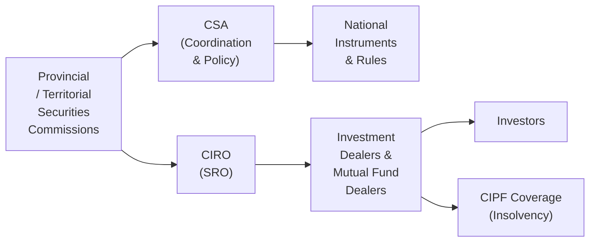

## 2.5 What is the Canadian Securities Regulatory Framework?

Sometimes, when I look back on my early days in the financial world, I remember being surprised—maybe even a little intimidated—by how decentralized Canada’s securities regulatory system is. Instead of just one big national regulator, we have a whole network of provincial and territorial commissions working together, plus self-regulatory oversight, plus investor protection entities. It seemed, at first, like a puzzle with many interconnected pieces. But once you get the hang of how those pieces fit, the Canadian regulatory framework begins to make a lot of sense. Let’s walk through the structure step by step and see how it all aims to protect investors, maintain fair and efficient markets, and keep everyone confident in the financial system.

### A Decentralized Regulatory System

It’s important to remember that in Canada, the Constitution divides powers between the federal government and the provinces. Securities regulation falls primarily under provincial and territorial jurisdiction. That means each province and territory has its own securities laws and its own securities commission (or equivalent authority).

So, for instance, you’ve got the Ontario Securities Commission (OSC) in Ontario, the Autorité des marchés financiers (AMF) in Quebec, the British Columbia Securities Commission (BCSC) in BC, and so on. While that might seem complicated, it allows each region to address local market concerns. And yet, there’s still a strong desire for national consistency, which is where the Canadian Securities Administrators (CSA) comes in.

### Coordination Through the Canadian Securities Administrators (CSA)

The CSA is not a separate legal entity that stands above the provinces and territories; it’s more like a collective forum or umbrella for coordinating policy development across the country. In other words, each provincial or territorial regulator participates in the CSA to align policies, streamline processes, and ensure harmonized regulation. Instead of every jurisdiction re-inventing the wheel, the CSA helps everyone share best practices and develop national instruments that can be adopted by each province. 

The CSA works on projects such as:
• Creating National Instruments – rules that each local regulator adopts in the same or a very similar manner.  
• Issuing Staff Notices and Guidance – clarifications on various aspects of securities rules or regulatory expectations.  
• Coordinating Public Consultations – scenarios in which the regulators want feedback from the industry and investors before finalizing new rules.

In practical terms, this collaboration reduces interprovincial inconsistencies and helps our markets operate more smoothly. It’s also intended to reduce the administrative burden for firms and investors who might otherwise have to navigate completely different sets of rules in each place.

### Provincial and Territorial Securities Commissions

Even though the CSA encourages national consistency, the unique local flavor of each commission or authority remains important. Let’s take a look at some of the major players you’ll see. This table provides a snapshot; you might find it helpful to reference these commissions if your clients or firms operate in multiple jurisdictions:

| Province/Territory     | Regulator/Commission   | Website                            |
|------------------------|------------------------|------------------------------------|
| Ontario                | Ontario Securities Commission (OSC)          | https://www.osc.ca/               |
| Quebec                 | Autorité des marchés financiers (AMF)        | https://lautorite.qc.ca/          |
| British Columbia       | British Columbia Securities Commission (BCSC)| https://www.bcsc.bc.ca/           |
| Alberta                | Alberta Securities Commission (ASC)          | https://www.albertasecurities.com/|
| Saskatchewan           | Financial and Consumer Affairs Authority (FCAA)| https://fcaa.gov.sk.ca/         |
| Manitoba               | Manitoba Securities Commission (MSC)         | https://www.msc.gov.mb.ca/        |
| Nova Scotia            | Nova Scotia Securities Commission (NSSC)     | https://nssc.novascotia.ca/       |
| New Brunswick          | Financial and Consumer Services Commission (FCNB)| https://www.fcnb.ca/         |
| Newfoundland & Labrador| Office of the Superintendent of Securities   | https://www.gov.nl.ca/dgsnpoc/    |
| ...                    | ...                                          | ...                                |

Although they share many similar rules (often derived from national instruments or national policies), each regulator might interpret or apply certain aspects slightly differently. If you’re actively working in the securities industry, you’ll want to keep track of any local notices or rules.

### The Role of CIRO (Canadian Investment Regulatory Organization)

In addition to the provincial and territorial commissions, the Canadian Investment Regulatory Organization (CIRO) has a vital function. CIRO formed when the Mutual Fund Dealers Association of Canada (MFDA) and the Investment Industry Regulatory Organization of Canada (IIROC) amalgamated in 2023. By 2025, CIRO has become the single self-regulatory organization responsible for:

• Overseeing investment dealers.  
• Overseeing mutual fund dealers.  
• Setting and enforcing industry standards.  
• Establishing proficiency requirements.  
• Supervising trading activity.  

If you’re a dealer or advisor in Canada, you’re probably working under CIRO’s watch. This includes business conduct rules, rules on capital adequacy, complaint handling, and continuing education requirements. The ultimate goal behind integrating these functions into one SRO is consistency—so no matter what type of securities (or mutual funds) a client is dealing with, the same high standards of professional conduct and investor protection will apply nationwide.

When MFDA and IIROC existed separately, sometimes you had to figure out if your activities reported to one or both. Now, CIRO is your main point of contact on the SRO side. You can find the latest guidelines, bulletins, and rulebooks on their official website: [https://www.ciro.ca/](https://www.ciro.ca/).

### Investor Protection Funds

Now, let’s say things go really wrong and a dealer becomes insolvent—maybe some major fraud or a massive market downturn that causes a firm to fail. What happens to client assets or cash then? Well, that’s where the Canadian Investor Protection Fund (CIPF) comes in.

CIPF is an independent organization providing coverage to eligible clients of member firms if the firm goes belly-up. As of January 1, 2023, CIPF became the sole protection fund when the MFDA’s investor protection fund merged into CIPF. This gives investors some reassurance that even in a worst-case scenario, their assets are likely to be covered up to certain limits. While this coverage doesn’t protect against market losses (i.e., losing money because a stock drops in value), it does protect you if, for instance, a dealer can’t return your property due to insolvency. This coverage is an important piece in maintaining public confidence in the securities markets.

### Key Securities Legislation and National Instruments

At the core of each province’s framework is its Securities Act—like the Securities Act (Ontario), which sets out the fundamental requirements for registration, disclosure, and enforcement. These acts often get supplemented by regulations and national instruments—like National Instrument 31-103, which deals with registration requirements and exemptions across jurisdictions. 

If you’re thinking, “Wow, that’s a lot,” you’re right. It can be a bit hefty. But these rules are all pointed at the same objectives:

• Protecting investors from unfair or fraudulent practices.  
• Promoting fair, efficient, and transparent markets.  
• Reducing systemic risks.  

If you work in the industry, you’ll frequently hear references to national instruments by number. They standardize specific aspects (e.g., dealing representative qualifications, know-your-client requirements, conflict-of-interest disclosure, and more). The CSA leads the development of these instruments, which each jurisdiction adopts into its local rules.

### Visual Overview of Canada’s Securities Regulatory Framework

Below is a simplified diagram to help visualize how the major entities fit together. Don’t worry if it still looks a bit busy—at least you can see the overarching relationships.

• The provincial/territorial commissions lead regulation in each jurisdiction.  
• They coordinate nationally through the CSA.  
• The CSA issues national instruments that standardize rules.  
• CIRO supervises dealers and representatives.  
• CIPF provides a safety net in cases of insolvency.

### Practical Examples in Action

Let’s say you’re a newly registered dealing representative at a firm in Alberta. You have to comply with the Alberta Securities Commission’s provincial rules and guidelines—but many of those are derived from national instruments that the ASC has adopted, thanks to the CSA’s harmonized approach. Your firm is also a CIRO member, so you’re subject to CIRO’s rules on proficiency, ethical standards, and continuing education. And guess what? If something goes terribly wrong and your firm collapses, CIPF coverage can help protect your clients' accounts up to the coverage limits. 

Meanwhile, if you move to Ontario to continue your career, you’ll find that the rules there are extremely similar—but now you’re dealing with the Ontario Securities Commission as your local regulator. Still, national instruments and CIRO oversight are consistent wherever you go in Canada. All these layers reinforce trust in the system so that clients feel confident their money is in good hands no matter where they reside.

### Common Challenges and Best Practices

Keeping track of multiple sets of rules:
• Even though the CSA has done a great job harmonizing regulations, each province might have unique local rules or bulletins. Staying informed on updates is crucial.  
• CIRO rules can add another layer, especially when changes to national instruments also result in changes to self-regulatory requirements.

Maintaining compliance across jurisdictions:
• If you or your firm do business in more than one province, you need to register with each relevant commission (unless an exemption exists).  
• Keep open lines of communication with your registration department or compliance officer if issues of cross-jurisdictional business arise.

Staying on top of ongoing changes:
• Securities regulation isn’t static—new rules come out, old ones get revised, and occasionally new frameworks (like the SRO merger into CIRO) can shift the landscape.  
• Subscribing to CSA, CIRO, and local commission bulletins and email updates can help you keep a finger on the pulse.

### Additional Resources and References

• Canadian Securities Administrators (CSA): [https://www.securities-administrators.ca/](https://www.securities-administrators.ca/) – This is an excellent starting point for national instruments, staff notices, and updates on harmonized rules.  
• Ontario Securities Commission (OSC): [https://www.osc.ca/](https://www.osc.ca/) – If you’re primarily in Ontario, the OSC site has comprehensive guides, registration portals, and rules.  
• Autorité des marchés financiers (AMF): [https://lautorite.qc.ca/](https://lautorite.qc.ca/) – Quebec’s regulator, particularly relevant for rules in that province.  
• British Columbia Securities Commission (BCSC): [https://www.bcsc.bc.ca/](https://www.bcsc.bc.ca/)  
• CIRO: [https://www.ciro.ca/](https://www.ciro.ca/) – Your central SRO for all dealer and advisor rules, guidelines, membership requirements, bulletins, and enforcement news.  
• Canadian Investor Protection Fund (CIPF): [https://www.cipf.ca/](https://www.cipf.ca/) – Learn more about coverage policies to safeguard client assets.  
• “Canadian Securities Regulation” by David Johnston – A deeper dive into laws and frameworks.  
• Provincial and Territorial Commission Sites – For local rules, compliance bulletins, and forms.

### Glossary

Securities Commission • A provincial or territorial authority that regulates the issuance, trading, and certain business aspects of securities within its jurisdiction.

Canadian Securities Administrators (CSA) • A coordinating body through which regulators develop common rules, facilitate consistent regulation, and exchange information to foster strong capital markets across Canada.

CIRO (Canadian Investment Regulatory Organization) • The single national self-regulatory organization for investment dealers and mutual fund dealers, formed by the amalgamation of the Mutual Fund Dealers Association of Canada (MFDA) and the Investment Industry Regulatory Organization of Canada (IIROC).

Investor Protection Fund (CIPF) • Canada’s sole investor protection fund after merging with the MFDA IPC in 2023. Covers investor assets if a member firm becomes insolvent, up to certain limits.

National Instruments • Regulatory measures that aim to standardize securities regulation and provide uniform rules in areas like registration, prospectus exemptions, ongoing disclosure, and more.

### Conclusion

Yes, it might feel like you have to juggle a lot: multiple commissions, a coordinating council, an SRO, and an investor protection entity. But together, these layers of oversight and coverage create a robust framework that aims to protect investors, promote fair markets, and inspire confidence in Canada’s financial system. It’s a testament to how, even with a decentralized structure, we can enjoy consistent standards that apply across the board. As you expand your knowledge in the securities industry, remember to stay curious, keep apprised of regulatory updates, and reach out to your compliance teams or provincial regulators whenever you have questions. After all, understanding these frameworks is one of the first steps toward thriving in Canada’s securities sector. 

If that sounds like a lot of moving parts—well, that’s because it is. But hey, don’t sweat it. With practice, these rules become second nature. And if you ever find yourself feeling lost, remember that the regulators’ websites, the CSA’s resources, and the CIRO bulletins are always there to guide you. By balancing thoughtful compliance and strong ethical standards, you’ll be doing your part to keep the Canadian securities industry safe, efficient, and trustworthy.

---

## Test Your Knowledge of the Canadian Securities Regulatory Framework



### Which statement best describes Canada’s approach to securities regulation?
- [x] It is decentralized, with each province and territory having its own securities commission or authority.
- [ ] It is centralized, with one national securities regulator.
- [ ] It is regulated by federal government departments alone.
- [ ] It is overseen exclusively by self-regulatory organizations, with no provincial involvement.

> **Explanation:** Canada’s regulatory framework is primarily governed by provincial/territorial commissions, although these regulators collaborate through the Canadian Securities Administrators (CSA).

### What is the main function of the Canadian Securities Administrators (CSA)?
- [x] To coordinate and harmonize policy across provincial and territorial regulators.
- [ ] To act as a federal securities regulatory body with full enforcement powers.
- [ ] To oversee mutual fund dealers only.
- [ ] To provide investor protection similar to an insurance fund.

> **Explanation:** The CSA is a collaborative body, not a federal regulator. Its primary role is coordinating policies and developing uniform rules, called national instruments, across Canada.

### How does CIRO differ from the provincial securities commissions?
- [x] CIRO is a national self-regulatory organization overseeing investment and mutual fund dealers, while provincial commissions enforce securities laws at the local level.
- [ ] CIRO exclusively focuses on issuing securities in the primary market.
- [ ] CIRO replaces the provincial securities commissions entirely.
- [ ] CIRO deals only with deposit-taking institutions and banks.

> **Explanation:** CIRO focuses on industry conduct and standard-setting for dealers. The provincial commissions have broader mandates, such as rulemaking, enforcement, and oversight of securities offerings.

### Which of the following is a key role of the Canadian Investor Protection Fund (CIPF)?
- [x] Protecting eligible client accounts if a member firm becomes insolvent.
- [ ] Guaranteeing investors’ market gains.
- [ ] Overseeing CIRO’s rulebook revisions.
- [ ] Setting maximum fees for brokerages.

> **Explanation:** CIPF coverage applies if a member dealer fails; it is not an insurance against market fluctuations or a regulatory body.

### Select the accurate statements about National Instruments:
- [x] They help standardize specific rules across Canadian jurisdictions.  
- [ ] They apply only in Ontario.  
- [x] They are adopted by each province and territory into local regulations.  
- [ ] They override all local securities acts.

> **Explanation:** National Instruments are developed by the CSA for consistency nationwide. They do not eliminate local securities acts but supplement them, providing a harmonized approach.

### If your firm is based in Alberta but also deals with clients in British Columbia, how should you handle securities regulation?
- [x] Comply with both Alberta’s and BC’s regulations, which often include harmonized rules from the CSA.
- [ ] Assume Alberta rules are sufficient across all provinces.
- [ ] Only register with the Ontario Securities Commission.
- [ ] Follow only federal guidelines, as provincial rules don’t apply cross-border.

> **Explanation:** A firm operating in multiple provinces needs to meet local requirements in each jurisdiction. CSA harmonized rules help, but provincial registrations are often needed.

### What was the primary reason behind the creation of CIRO by merging the MFDA and IIROC?
- [x] To unify and streamline oversight of investment dealers and mutual fund dealers.
- [ ] To replace all the provincial and territorial regulators.
- [x] To maintain national consistency in standards and enforcement.
- [ ] To guarantee investor returns during market downturns.

> **Explanation:** CIRO took over from two predecessor SROs (MFDA and IIROC) to provide a consistent set of rules, oversight, and enforcement for all dealer types.

### Which of the following is not a responsibility of a provincial securities commission?
- [x] Providing coverage to investors when a dealer becomes insolvent.
- [ ] Overseeing public offerings within its jurisdiction.
- [ ] Administering and enforcing local securities laws.
- [ ] Imposing penalties for violations of securities acts.

> **Explanation:** Investor coverage in an insolvency scenario is the role of CIPF, not the provincial commissions.

### What does it mean for a dealer or advisor to be a CIRO member?
- [x] They must adhere to CIRO’s rules, business conduct standards, and proficiency requirements.
- [ ] They are exempt from provincial securities laws.
- [ ] They automatically receive CIPF coverage for market losses.
- [ ] They can operate without any licensing from local regulators.

> **Explanation:** CIRO membership entails compliance with self-regulatory requirements. It doesn’t exempt a firm or individual from provincial laws, nor does it cover market losses.

### True or False: Provincial securities commissions, CIRO, and CIPF work together to strengthen investor protection in Canada’s securities marketplace.
- [x] True
- [ ] False

> **Explanation:** These organizations fulfill complementary roles, ensuring robust oversight, self-regulatory standards, and investor compensation in the event of dealer failures.


