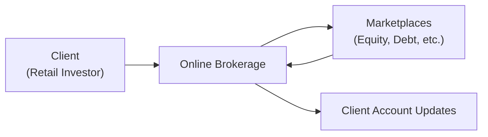
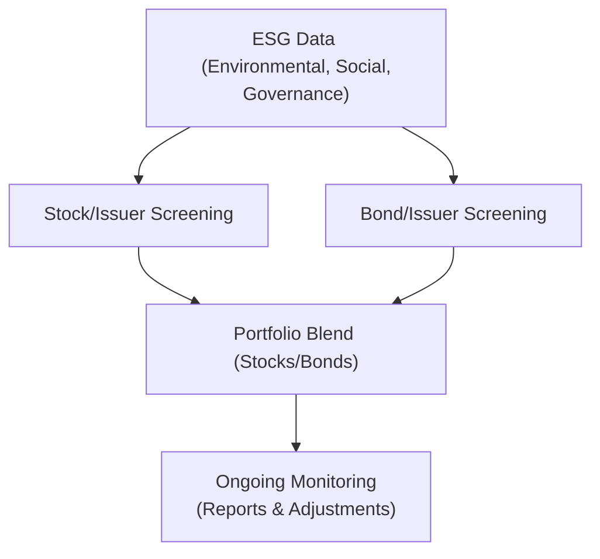

## 2.6 Emerging Trends in the Canadian Financial Marketplace (Additional Topic)

It’s pretty wild to think about how much our financial world has changed in just a few short years. A friend of mine once confessed that she didn’t even know what the word “Fintech” meant two years ago. Now, she toggles between multiple digital banking platforms each day and invests through an app that charges next to no fees. It’s that kind of rapid evolution that we’re dealing with in Canada these days. Let’s explore some of the most important emerging trends. These trends include breathtaking tech leaps, a growing focus on investing for the greater good, a surge in retail (individual) investor participation, fast-moving regulatory changes, and critical global economic factors that shape Canada’s financial markets.

Throughout this section, you’ll notice how these trends link back to principles laid out in other Chapters (like ethics in Chapter 1 or the regulatory framework you’ll see in Chapter 3). By understanding these developments, you’ll be better equipped to guide your clients with confidence and clarity.

---

### Rapid Advances in Technology

Sometimes I joke that I’m old enough to remember physically walking into a bank to deposit a paycheck. These days, you can deposit a check from your phone in seconds, thanks to increasingly sophisticated Fintech solutions. “Fintech” stands for financial technology—essentially, any technology-driven solution aimed at automating or enhancing financial services. In Canada, we’re seeing these solutions transform every corner of the industry:

• Automated Investment and Robo-Advisors  
• Blockchain and Cryptocurrencies  
• Digital-Only Banks  
• AI-Powered Risk Assessments  

#### Robo-Advisors
Robo-advisors use algorithms to deliver personalized investment services, often at significantly lower costs compared to traditional advisors. They can automate portfolio rebalancing, tax-loss harvesting, and provide asset allocation models. Robo-advisors have widened accessibility to investing, meaning even folks with small amounts of capital can now begin building a portfolio quickly and painlessly. 

Historically, smaller investors were often ignored by full-service brokerages because the fees weren’t worth the smaller investment amounts. That’s now shifting. If you check out some Canadian robo-advisors (e.g., Wealthsimple, CI Direct Investing), you’ll see a frictionless sign-up process, basic know-your-client (KYC) checks, and portfolio proposals—often within minutes.

#### Blockchain and Cryptocurrencies
Blockchain is basically a type of digital ledger technology that tries to make transactions more transparent and secure by distributing verification responsibilities across many nodes (computers). In Canada, blockchain-based applications extend beyond cryptocurrency speculation. We see pilot projects involving cross-border payments, supply chain tracking, and digital identity solutions.

Still, it’s important to note that cryptocurrencies—like Bitcoin or Ether—remain subject to market volatility. Canadian regulators, including the Canadian Securities Administrators (CSA), have been ramping up guidelines to ensure crypto-trading platforms follow clear standards. For instance, if these platforms qualify as “dealers,” they need to be registered with the relevant securities regulatory authorities or regulated by the Canadian Investment Regulatory Organization (CIRO). 

For your reference, the CSA website (https://www.securities-administrators.ca/) has Staff Notices on everything from Know-Your-Client rules in crypto to the complexities of stablecoins. Some provincial commissions even have Fintech sandbox programs, such as the Ontario Securities Commission’s OSC LaunchPad or the Autorité des marchés financiers (AMF) Fintech Lab, to encourage innovation while keeping an eye on consumer protection.

#### Digital-Only Banks and Open Banking
Digital-only banks have gained popularity due to their attractive fee structures and user-friendly interfaces. These “neo-banks” often have no physical branches—everything from account opening to troubleshooting occurs online or through mobile apps.

Open Banking is the broader framework that lets banks securely share data (with client consent) via standardized application programming interfaces (APIs). It fosters new financial products from third-party providers—like budgeting apps that can pull transaction data in real-time or integrated lending platforms that analyze a customer’s cash flow across multiple institutions. In Canada, open banking is still evolving, but there is a working group that aims to address consumer privacy, data security, and fairness.

---

### Sustainable and Responsible Investing

A few years ago, I listened to a story from a client who said, “I had no idea my mutual fund was investing in companies that pollute our oceans!” She ended up pulling her investments and searching for greener pastures. That’s where ESG (Environmental, Social, and Governance) considerations come in. ESG refers to a set of standards to gauge how a company manages environmental impact, social responsibility (like labor relations and community outreach), and governance (like board diversity and ethics).

Increasingly, investors—especially millennials—are picky about which industries they fund. They want their portfolios aligned with personal values such as ecological sustainability and social equality. This shift has created a surge in ESG-focused mutual funds, Exchange-Traded Funds (ETFs), and even green bonds.

#### Green Bonds
Green bonds are fixed-income instruments earmarked specifically for projects that have a positive environmental or climate benefit. Examples include funding for renewable energy projects, efficient buildings, or waste management infrastructure. Governments, corporations, and even financial institutions can issue these, and the global market for green bonds has expanded rapidly. 

In Canada, there’s a growing emphasis on transparency. Issuers typically share detailed reports on how the proceeds from green bonds are being used. Investors seeking stable, long-term returns and who care about environmental stewardship often find these bonds appealing.

#### ESG Mutual Funds and ETFs
It’s not unusual for providers to offer a wide range of ESG-labeled mutual funds and ETFs: from those excluding tobacco or firearms to those that track indices like the MSCI ESG Leaders Index (which includes companies with high ESG ratings relative to their sector peers). Investigate the underlying methodology to ensure “ESG” isn’t just a marketing tool. Look for funds that follow recognized frameworks, like the Global Reporting Initiative (GRI) or the Sustainability Accounting Standards Board (SASB).

---

### Increase in Retail Investor Participation

Five years ago, many Canadians rarely touched the stock market unless they had a substantial sum to invest or a well-heeled advisor guiding them. But times have changed—drastically. With the rise of online platforms (some of which charge zero commissions on trades) and new digital banks that allow you to open a trading account in no time at all, more people are taking investing into their own hands.

#### Retail Traders and Market Volatility
When large numbers of retail traders swarm particular stocks—or even entire sectors—price movements can become extreme. I recall a scenario not too long ago when a social-media-driven stock soared at breakneck speed. The influx of enthusiastic retail investors, armed with fractional share purchases, forced many financial professionals to re-examine how liquidity is provided. 

#### Lower Barriers to Entry
Low account minimums and user-friendly interfaces have contributed to the democratization of finance. Even those with a few hundred dollars can buy fractional shares of well-known companies—a feat nearly impossible a decade ago. This increased participation is generally a good thing, promoting financial literacy and broadening market access. But it also raises questions around investor education, “FOMO” (fear of missing out) investing, and ensuring robust compliance with Know-Your-Client (KYC) and suitability requirements (discussed more in Chapter 5 and Chapter 6).

---

### Regulatory Updates

Regulations move quickly to keep up with the market’s frenetic pace—though sometimes not quickly enough. In Canada, we have CIRO, the national self-regulatory body that oversees investment dealers, mutual fund dealers, and marketplace regulations. CIRO came into effect on June 1, 2023, superseding the historical IIROC and MFDA. 

Regulatory bodies continue to streamline guidelines for areas like cryptocurrency trading, crowdfunding, and open banking. For example:

• Crowdfunding rules were aligned across multiple provinces to open up capital-raising avenues for smaller enterprises.  
• Cryptocurrency exchanges are being asked to register as dealer platforms and comply with anti-money laundering (AML) protocols set by the Financial Transactions and Reports Analysis Centre of Canada (FINTRAC).  
• The CSA is also publishing staff notices clarifying how digital assets can be treated under securities law.  

Canadian regulators are mindful of balancing investor protection with innovation. Various sandbox initiatives let innovators test out new models without being fully bound by each legacy rule, provided they meet strict conditions aimed at safeguarding the public.

#### SRO Harmonization
With the new single SRO, CIRO’s mission is to ensure uniform standards of conduct across the investment industry. It’s also responsible for strengthening retail investor trust, facilitating dispute resolution, and overseeing compliance with rules related to equity and debt marketplaces. Meanwhile, the Canadian Investor Protection Fund (CIPF) provides protection for client assets if a member firm becomes insolvent.

---

### Global Economic Uncertainties

Canada’s economy is famously tied to commodities—think oil, natural gas, minerals, and agricultural products. Yet global influences can shift dramatically. Remember when trade tensions between major global powers made a splash on our precious metals and manufacturing industries? Or when sudden changes in supply-and-demand patterns for crude oil rattled currency exchange rates?

#### Impact on Canadian Markets
Global uncertainties, such as geopolitical events or climate disasters, can impact corporate earnings and, by extension, stock prices. Managers of Canadian-focused funds often look at how trade agreements, tariffs, or macroscale economic policies abroad affect our environment. The key takeaway here: for everyday investors, risk management is crucial. Considering geographic diversification is helpful; understanding currency risk is also vital.

Here’s a quick example of a risk management concept that many portfolio managers keep in mind:


\text{Expected Return of a Portfolio (E[R])} = \sum_{i=1}^{n} p_i \times R_i


Where \\(p_i\\) is the weighting of the \\(i\\)-th asset, and \\(R_i\\) is the expected return for that asset. When the environment is unpredictable, adjusting those weights to spread risk across industries or geographies becomes more important than ever.

---

### A Visual Overview of Modern Trading Channels

Below is a basic Mermaid.js flowchart showing how a typical Canadian investor might place an order through an online brokerage, which then interacts with the broader market for execution. This is intentionally simplified, but it highlights how technology streamlines the entire process.

• The retail investor places an order via an online or mobile interface.  
• The order is directed to a marketplace where trades are matched.  
• Post-trade, status and transaction details flow back to the client’s account in real-time.

---

### Practical Considerations for Advisors

• Continuous Education: Advisors need to stay current with new products (e.g., green bonds, robo-advisor services) and the evolving regulatory landscape to serve clients effectively.  
• Suitability and KYC Obligations: As more clients experiment with those “hot” sectors, advisors must carefully assess risk tolerance, time horizons, and the investor’s real understanding of the product.  
• Technology Tools: More advanced analytics tools are available today to help with portfolio rebalancing, performance reporting, and ESG screening. Being conversant with these can help gain client trust.  
• Ethical Imperatives: Technology is neutral, but its usage isn’t. Advisors should reflect on privacy, security, and fairness. Using client data responsibly is not only an ethical necessity but also a regulatory necessity.  

---

### More Illustrations: ESG-Driven Portfolio Construction

Here’s another diagram, this time illustrating how ESG factors might feed into a simplified portfolio construction approach using multiple data inputs. It’s a bit conceptual but helps visualize the layers of decision-making.

• Collect ESG data from recognized frameworks like SASB or GRI.  
• Screen stocks and bond issuers to exclude those with poor ESG performance or alignment.  
• Blend the approved stocks and bonds into an ESG-tilted portfolio.  
• Continuously monitor performance and adjust as new ESG ratings or policies emerge.

---

### Glossary

• **Fintech:** Technology-driven financial solutions, often aiming to automate and improve the delivery of financial services.  
• **ESG (Environmental, Social, Governance):** A set of standards for a company’s behavior and performance regarding sustainability and societal impact.  
• **Robo-advisor:** Automated platforms that use algorithms to provide investment management services with minimal human supervision.  
• **Open Banking:** A system allowing financial institutions to share data with authorized third-party developers (with client consent) so that new products and services can be seamlessly integrated into banking systems.

---

### References and Resources

• **Canadian Securities Administrators (CSA):**  
  – Official site containing Staff Notices on cryptocurrency, crowdfunding, and more:  
    https://www.securities-administrators.ca/  

• **Canadian Investment Regulatory Organization (CIRO):**  
  – Overarching self-regulatory body overseeing investment and mutual fund dealers:  
    https://www.ciro.ca  

• **Canadian Investor Protection Fund (CIPF):**  
  – Protects client assets if a member firm is insolvent:  
    https://www.cipf.ca/  

• **OSC LaunchPad:**  
  – Ontario Securities Commission’s initiative to support innovative Fintech proposals:  
    https://www.osc.ca/en  

• **AMF Fintech Lab:**  
  – Autorité des marchés financiers (Quebec) program for nurturing Fintech companies:  
    https://lautorite.qc.ca/  

• **World Bank Group – The Rise of Fintech:**  
  – A global perspective on technology’s impact on finance, which includes case studies relevant to advanced and emerging markets.  

• **IOSCO – International Organization of Securities Commissions:**  
  – Publishes research on ESG, cross-border finance, and Fintech trends at an international level.  

---

### Conclusion

The Canadian financial marketplace is in a state of continuous transformation. Technology is disrupting traditional processes, ESG investing is reshaping portfolios, retail investors have more power than ever, new regulatory frameworks (like CIRO) keep the industry on its toes, and global uncertainties affect Canadian markets in sometimes surprising ways. 

From personal experience, one of my biggest lessons has been to remain open-minded. Trends that initially seemed like passing fads—like robo-advisors—are now pretty mainstream, and ignoring them would be a disservice to clients. The best course of action is to learn, adapt, and maintain a strong ethical foundation. 

Advisors (and their clients) who keep up with these trends will find themselves better prepared for the constant evolution of financial products and services. And that’s the whole point of digging into the complexities: if you aim to provide truly valuable guidance, understanding how these emerging trends fit into the broader regulatory and ethical framework is non-negotiable. Keep learning, stay curious, and embrace the changes that keep our markets vibrant.

---

## Emerging Trends in the Canadian Financial Marketplace Quiz: Test Your Knowledge



### Which of the following best describes Fintech in the Canadian context?

- [ ] Traditional banking methods practiced by major financial institutions.
- [ ] Exclusive use of blockchain for international transactions.
- [x] Technology-driven financial solutions aimed at automating and improving service delivery.
- [ ] Any high-frequency trading method limited to hedge funds.

> **Explanation:** Fintech refers to a variety of technology-driven solutions that streamline and enhance financial services in Canada (and globally). It’s not limited to blockchain or high-frequency trading.

### Sustainable investing often focuses on ESG factors. What does ESG stand for?

- [ ] Energy, Social, Global
- [ ] Environmental, Stocks, Growth
- [x] Environmental, Social, Governance
- [ ] Equity, Sovereign, Grants

> **Explanation:** ESG uses three main criteria—Environmental, Social, and Governance—to evaluate a company’s overall impact on society and the planet.

### Robo-advisors primarily offer which of the following benefits to investors?

- [x] Automated investing with lower fees and minimal human supervision
- [ ] Free legal advice on securities regulation
- [x] Portfolio rebalancing and tax-loss harvesting
- [ ] Guaranteed returns irrespective of market conditions

> **Explanation:** Robo-advisors use algorithms to automate various aspects of the investment process, such as portfolio rebalancing and tax optimization. They don’t promise guaranteed returns or offer legal services.

### What is a key regulatory focus in Canada regarding cryptocurrency exchanges?

- [x] Registering with securities regulators and complying with AML requirements
- [ ] Ignoring KYC rules to facilitate faster trade
- [ ] Excluding retail investors from crypto transactions
- [ ] Allowing only foreign exchanges to operate

> **Explanation:** Canadian regulators require that crypto platforms register appropriately and follow Anti-Money Laundering (AML) and Know-Your-Client (KYC) standards to protect investors and ensure market integrity.

### Which of the following statements is true about retail investor participation in Canada?

- [x] Low account minimums and user-friendly platforms have increased market access.
- [ ] Retail investors are strictly barred from purchasing fractional shares.
- [x] Retail investors can occasionally create market volatility by crowd-investing.
- [ ] Strict regulations limit all retail trading to large banks only.

> **Explanation:** Retail trading in Canada has become more accessible through online brokerages with lower minimums, and significant retail participation can influence market prices—sometimes leading to volatility.

### Which best describes the mission of CIRO in the Canadian securities landscape?

- [x] Overseeing investment dealers, mutual fund dealers, and market integrity
- [ ] Replacing the Canadian Securities Administrators entirely
- [ ] Administering issuance of new government bonds
- [ ] Exclusively regulating bank lending rates

> **Explanation:** Formed on June 1, 2023, CIRO is the new self-regulatory organization overseeing investment dealers and mutual fund dealers. It replaced the former IIROC and MFDA but does not replace the CSA.

### ESG mutual funds and ETFs generally do which of the following?

- [x] Evaluate companies based on sustainability and social impact
- [ ] Eliminate any relationship with regulatory oversight
- [x] Align investments with specific value-based exclusions (e.g., tobacco, firearms)
- [ ] Guarantee higher returns than all non-ESG funds

> **Explanation:** ESG funds incorporate additional criteria focusing on sustainability and social responsibility or exclude certain sectors. They don’t guarantee higher returns, but they align with investors’ ethical preferences.

### How does open banking aim to transform the Canadian financial sector?

- [x] By enabling secure data sharing with client consent for new financial products
- [ ] By banning third-party providers from bank data
- [ ] By enforcing a single universal bank for all Canadians
- [ ] By restricting interoperability between different banks

> **Explanation:** Open banking allows banks to share data securely with authorized third parties, fostering innovation and better customer-focused products. 

### Which type of investment instrument uses proceeds specifically for environmentally beneficial projects?

- [x] Green bonds
- [ ] Common shares
- [ ] Preferred shares
- [ ] Closed-end funds

> **Explanation:** Green bonds direct funds toward projects that are designed to benefit the environment, such as renewable energy or efficient infrastructure.

### True or False: Canadian regulators have introduced crowdfunding rules to help smaller businesses raise capital more easily.

- [x] True
- [ ] False

> **Explanation:** Canadian regulators have indeed aligned regulations allowing startups or smaller enterprises to raise funds by pooling smaller amounts from a large number of investors through crowdfunding platforms.


