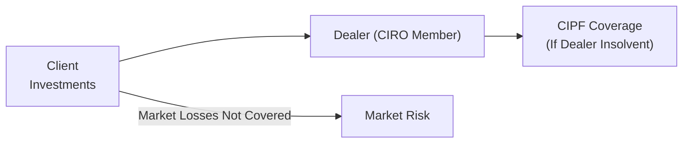

## 2.6 Other Key Concepts in the Canadian Financial Marketplace

In this section, we’ll take a closer look at important themes that might not be explicitly listed in the main course outline but are absolutely fundamental to understanding how Canadian financial markets operate. We’ll cover key regulations for preventing financial crime, privacy legislation, investor protection structures, the influence of global and national economic trends, the Bank of Canada’s role, and more. We’ll also explore how emerging technologies and shifting market psychology can reshape client behavior and the advisory process. Honestly, I think you’ll find these areas extremely relevant—both for day-to-day practice and for helping you become a trusted advisor.

Even if some of these topics feel a bit “extra,” they genuinely matter because clients and regulators expect mutual fund representatives to have a well-rounded perspective. You never know when a new regulation, a tech trend, or a shift in market psychology might land you in a conversation that requires precisely this broader context.

---

#### Understanding Anti-Money Laundering Regulations

You might have heard the phrase “follow the money” in a movie, but in the financial services world, we do exactly that—especially when it comes to anti-money laundering (AML). In Canada, the backbone of AML legislation is the Proceeds of Crime (Money Laundering) and Terrorist Financing Act (PCMLTFA). Essentially, we don’t want the financial system used by criminals to disguise illegally obtained funds or to fund terrorist activities.

• **FINTRAC Oversight**: The Financial Transactions and Reports Analysis Centre of Canada (FINTRAC) enforces AML rules. If you suspect an unusual or suspicious transaction—maybe a client depositing large sums of cash with no clear source of wealth—then reporting to FINTRAC could be required.  
• **Know Your Client (KYC) and Recordkeeping**: AML regulations overlap heavily with your typical KYC responsibilities. You’ll document identification details, transaction information, and keep records for at least five years. If you’re new to the practice, trust me: thorough recordkeeping might seem tedious, but it’s absolutely essential, not only for compliance but also for building trust with your clients.  
• **Red Flags**: Watch out for patterns like sudden, unexplained inflows of money, requests for wire transfers to high-risk jurisdictions, or clients who refuse to provide identification. These can indicate suspicious activity.  

##### Quick Anecdote:
I remember an instance when a colleague flagged a customer who claimed he was “in a hurry” to invest a large sum in cash, offering almost no background on where the funds came from. It was definitely a heart-racing moment! After gently probing, we discovered that the funds were from his legitimate small business but he’d never set up the right corporate account. The story had a happy ending, but it showed me how easy it is for these issues to arise.

AML best practices remain a cornerstone of our industry’s professionalism. It’s not just about checking a compliance box; it’s about being good citizens and safeguarding the integrity of the financial system.

---

#### Privacy Legislation (PIPEDA)

Privacy laws can sound like dull stuff—until a client starts asking questions about how you’re going to protect their data. Then it gets serious.

• **PIPEDA at a Glance**: The Personal Information Protection and Electronic Documents Act (PIPEDA) sets out the rules for how businesses in Canada collect, use, and disclose personal information. For a mutual fund sales representative, that often means explaining to clients why you need their social insurance number, how their details are stored, and who gets access.  
• **Consent and Safeguards**: Under PIPEDA, you need informed client consent to collect personal data. You must also implement security safeguards—like encryption, secure file storage, and restricted system access—to protect this data from breaches.  
• **Client Confidence**: Being transparent about privacy—like giving clients a heads-up on why you need certain info—builds trust. When clients trust that their data is safe, they are more likely to share accurate personal and financial details, which helps you advise them more effectively.

##### Practical Tip:
If you’re working in a small office, make sure that physical documents containing customers’ sensitive info aren’t left lying around. Also, use strong passwords and screen locks on your computer. Simple, yes—but big fails happen this way.

---

#### Investor Protection Mechanisms (CIPF)

When people entrust their life savings to a dealer or an advisor, they want to know their money is safe, even if the firm runs into trouble. That’s where the Canadian Investor Protection Fund (CIPF) steps up.

• **The Role of CIPF**: CIPF is now the single investor protection fund covering clients’ assets if a member firm becomes insolvent. Historically, there were separate protections (like the MFDA IPC for mutual fund dealers), but CIPF merged with MFDA IPC in 2023 to become Canada’s sole investor protection fund.  
• **Coverage**: CIPF generally covers up to prescribed limits if your dealer fails. It’s not there to protect against market losses—only insolvency of the dealer.  
• **Independence from CIRO**: Although CIPF works closely with the Canadian Investment Regulatory Organization (CIRO), it is independent. CIRO sets self-regulatory rules, while CIPF provides protection coverage.  

##### Best Practice:
Educate your clients about what CIPF covers. Sometimes, clients assume that everything is guaranteed, including market losses. Let them know that CIPF only kicks in if the dealer is insolvent—regulatory coverage is not a magic safety net for poor investment performance!

Here’s a quick visual depiction of how CIPF interacts with dealers and clients:

In this diagram, you can see that CIPF coverage is triggered only if the dealer fails financially. Market losses flow elsewhere entirely (i.e., they’re your normal investment risk).

---

#### Influence of National and Global Economic Trends

If you’ve ever watched the news and seen stock markets react to a Federal Reserve or European Central Bank interest rate decision, you know that global forces are real. Canada isn’t isolated from these big waves; our domestic market can pivot quickly due to events in Europe, the U.S., or Asia.

• **GDP Growth**: Gross Domestic Product is the sum of a country’s production of goods and services. If Canada’s GDP growth speeds up, it can boost corporate earnings, help job markets, and attract foreign capital. However, if the global economy weakens, it might depress demand for Canadian exports like oil or lumber, especially if commodity prices tumble.  
• **Global Interest Rates**: Think about it: If global rates are low, investors might plow more money into Canada chasing yields (like in bonds or GICs). Conversely, if rates outside Canada are higher, foreign investors might bail, leading to currency adjustments.  
• **Commodity Prices**: Oil, natural gas, metals, and agriculture products are key exports for Canada. Big swings in these markets can trickle down into all sorts of areas: from resource sector stocks to the value of the Canadian dollar.  

##### Resources for Economic Monitoring:

- **Bank of Canada – Financial System Hub**: (https://www.bankofcanada.ca/financial-system/) for stability reports, currency research.  
- **World Bank Open Data**: (https://data.worldbank.org/) for global macroeconomic indicators.  
- **OECD Economic Outlook for Canada**: (https://www.oecd.org/economy/canada-economic-snapshot/) for an international perspective.  

---

#### The Bank of Canada’s Role

The Bank of Canada is our country’s central bank, and it’s got a pretty big job: controlling inflation and maintaining currency stability to foster a healthy economic environment. How does it do that?

• **Monetary Policy & Policy Rate**: The Bank sets a “policy interest rate” (often just called the overnight rate). Changes to this rate influence borrowing costs, consumer spending, and business investment.  
• **Inflation Targeting**: The Bank’s sweet spot is usually around 2% inflation yearly. If inflation creeps too high, the Bank might raise rates to cool economic activity. If things are sluggish, it could lower rates to spur growth.  
• **Currency Influence**: Interest rate moves can drive the value of the Canadian dollar (CAD). A higher rate often attracts international investors seeking better returns, and that can push the CAD higher.  

Remember: these levers indirectly affect your clients. Higher interest rates can reduce bond prices but might help fixed-income investors earn more over time. Meanwhile, an appreciating CAD might make international equity funds slightly more expensive if that currency difference is locked in. Understanding these subtleties helps you talk about interest rate risk and currency exposure with clients.

---

#### Technological Advancements: Fintech and Digital Currencies

Now we get to a topic that is shaping the future—fintech. It’s basically a fancy word for leveraging technology to improve or disrupt financial services. And oh boy, is this changing our industry quickly.

• **Fintech Innovations**: Robo-advisors and algorithmic trading platforms can automate parts of the investment process. While you might worry that robo-advisors will replace the “human element,” many advisors find these tools free them up for more value-added tasks (like deeper financial planning conversations).  
• **Digital Currencies**: Cryptocurrencies such as Bitcoin and Ethereum have spurred an entirely new asset class. They operate on decentralized networks (blockchain). Some see it as a hedge against inflation or a store of value; others see it as speculative. Regardless, your client might ask you questions about “crypto.” Having a basic understanding can help you guide them responsibly.  
• **Regulatory Watch**: CIRO keeps an eye on how dealers handle digital assets, including compliance. You’ll want to check your firm’s policies around crypto before diving in.

##### Example of Tech Impact:
One time, a friend asked me about investing all her RRSP money in Bitcoin. I gave her the standard disclaimer that many mutual fund reps do: “We need to see whether it fits your risk tolerance, if our firm even permits it, and realize it’s still an emerging area of regulation.” Her eyebrows went up, but eventually, she appreciated that I wasn’t just rejecting the idea—it’s more about aligning investments with the client’s profile and the rules.

---

#### Market Psychology and Behavioral Finance

Ever heard the phrase “the market can stay irrational longer than you can stay solvent?” It’s a wink to how emotions and group psychology can override rational analysis. There’s an entire field called “behavioral finance” that examines how investors’ biases and mental shortcuts impact decision-making.

• **Common Biases**: Confirmation bias (favoring information that matches existing views), anchoring (relying heavily on an initial piece of info), and herding (following the crowd) can push asset prices above or below their intrinsic value.  
• **Investor Education**: As a mutual fund rep, a huge part of your job is educating clients. When markets get frothy, caution them about FOMO (fear of missing out). When markets crash, remind them about the dangers of panic selling.  
• **Holistic Suitability**: Knowing your client isn’t just about numbers. Behavioral elements—like how a client reacts under stress or how they interpret risk—are crucial.

By raising awareness about these biases, you help clients avoid knee-jerk decisions. Your guidance can keep them on track toward long-term goals.

---

#### Best Practices and Pitfalls

Let’s pinpoint a few best practices and watch-outs:

• **Best Practice #1: Stay Informed**  
  - Read Bank of Canada updates, skim FINTRAC bulletins, keep an ear out for new guidance from CIRO.  

• **Best Practice #2: Integrate KYC with AML**  
  - KYC is more than just a regulatory requirement. It’s also a protective measure against money laundering and terrorist financing. Use it to your advantage.  

• **Best Practice #3: Transparent Communication**  
  - Be honest with clients about coverage limits (CIPF), data collection (PIPEDA), and potential pitfalls (e.g., volatility in digital currencies).  

• **Pitfall #1: Complacency about Privacy**  
  - Don’t store client data on personal phones or laptops without encryption. Even a single breach can erode client trust and create legal headaches.  

• **Pitfall #2: Chasing Trends Blindly**  
  - If a client wants to jump into the hottest commodity or crypto because “everyone’s doing it,” take a pause. Evaluate suitability thoroughly.  

• **Pitfall #3: Ignoring Red Flags**  
  - If your gut says something is off with a client’s transaction, it’s better to investigate further. Failing to report suspicious activity can lead to major penalties.  

---

#### Staying Ahead of the Curve

1. **Ongoing Education**  
   - The financial industry changes fast. Attending webinars on fintech trends or new AML requirements can keep you relevant.  

2. **Leverage Technology**  
   - Use software to visualize client portfolios, track suspicious transaction patterns, and keep risk profiles updated.  

3. **Cultivate Mindful Relationships**  
   - The more you understand a client’s personal, professional, and emotional needs, the more effectively you can serve them.  

4. **Consult Regulatory Sites**  
   - Check out [CIRO’s website](https://www.ciro.ca) for official updates and resources.  

---

#### Additional Resources

• **FINTRAC**  
  - https://www.fintrac-canafe.gc.ca/  
  - Guidance on suspicious transaction reporting and AML responsibilities.  

• **Canadian Investor Protection Fund (CIPF)**  
  - https://www.cipf.ca/  
  - Information about coverage limits, investor education, and claim processes.  

• **Bank of Canada**  
  - https://www.bankofcanada.ca/financial-system/  
  - Research, monetary policy announcements, and market intelligence.  

• **World Bank Open Data**  
  - https://data.worldbank.org/  
  - Comprehensive global economic and social data sets for macro views.  

• **OECD Economic Outlook**  
  - https://www.oecd.org/economy/canada-economic-snapshot/  
  - Country snapshots and forward projections on Canada’s economy.  

---

#### Conclusion

Whew, that’s a lot to digest! But devoting time to these “other key concepts” pays off big. It’s not just about fulfilling legal or regulatory requirements—you’ll become a more informed, empathetic, and adaptable advisor. Whether you’re spotting a suspicious transaction, fielding questions about digital currencies, or explaining CIPF coverage in the face of a volatile market, this foundational knowledge is your ally.

Financial markets are complex, but understanding how regulations, global trends, technology, and investor psychology intersect gives you a critical edge. After all, your clients count on you to navigate these waters with confidence—and hopefully, a little bit of calmness and clarity rubbed off from reading about them here.

So keep learning, stay curious, and never be afraid to ask deeper questions. If you’re prepared, you’ll approach your practice with integrity and expertise, upholding professional standards under CIRO and benefiting the Canadian investing public along the way.

---

## Test Your Knowledge: Key Regulations and Trends in the Canadian Financial Marketplace



### Which legislation in Canada specifically addresses money laundering and terrorist financing activities?

- [ ] The Income Tax Act
- [x] The Proceeds of Crime (Money Laundering) and Terrorist Financing Act (PCMLTFA)
- [ ] The Canada Business Corporations Act
- [ ] The Financial Institutions Act

> **Explanation:** The Proceeds of Crime (Money Laundering) and Terrorist Financing Act (PCMLTFA) is Canada’s primary legislation aiming to detect and deter money laundering and terrorist financing activities.

### What is the main purpose of the Canadian Investor Protection Fund (CIPF)?

- [x] Protect client assets when a dealer becomes insolvent
- [ ] Compensate clients for stock market losses
- [ ] Regulate interest rates and monitor inflation
- [ ] Oversee international currency policies

> **Explanation:** CIPF protects clients if their member firm fails. It’s not designed to cushion losses from normal market volatility; its coverage focuses on insolvency-related scenarios.

### Under PIPEDA, what is a key requirement when collecting and using personal information?

- [ ] Informing your colleagues and friends
- [x] Obtaining informed consent from the individual
- [ ] Asking for consent only after sharing the data
- [ ] Providing incentives to clients for their data

> **Explanation:** PIPEDA stipulates that organizations must obtain valid and informed consent before collecting, using, or disclosing personal information in the course of commercial activities.

### Which Canadian body is responsible for enforcing anti-money laundering regulations and receiving suspicious transaction reports?

- [ ] Bank of Canada
- [ ] Canadian Investment Regulatory Organization (CIRO)
- [x] FINTRAC (Financial Transactions and Reports Analysis Centre of Canada)
- [ ] Canadian Securities Administrators (CSA)

> **Explanation:** FINTRAC analyzes reported financial transactions to detect and deter money laundering and terrorist financing, enforcing obligations under the PCMLTFA.

### Which factor is least likely to be influenced by the Bank of Canada’s policy interest rate?

- [x] Inheritance tax rates
- [ ] Consumer borrowing costs
- [x] The strength of the Canadian dollar
- [ ] Mortgage interest rates

> **Explanation:** Inheritance tax rates (a form of provincial or federal legislative policy) are not set by the Bank of Canada. The Bank’s policy rate influences borrowing costs, broader financial conditions, and currency valuation, but it does not set or regulate inheritance taxes.

### What is the primary reason that client data security is crucial under PIPEDA?

- [x] To protect individuals’ personal information from unauthorized disclosure
- [ ] To ensure compliance exclusively with AML regulations
- [ ] To free up more storage space for marketing data
- [ ] To streamline clients’ email marketing consent forms

> **Explanation:** PIPEDA’s main purpose is to ensure that organizations manage personal information responsibly and with proper safeguards, preventing unauthorized access or misuse.

### What could be a red flag indicating potential money laundering activity?

- [x] Large cash deposits with no clear explanation of origin
- [ ] Clients depositing funds from a well-known institution
- [x] Clients who frequently ask about RRSP limits
- [ ] Buying a top-rated bond with a standard interest rate

> **Explanation:** A series of large and unexplained cash deposits is a classic indicator, prompting further investigation to ensure compliance with AML legislation.

### How might global interest rates impact the Canadian financial market?

- [x] Higher rates abroad might draw capital away from Canada
- [ ] Global interest rates do not affect Canadian capital flows
- [ ] Global interest rates can only raise Canadian inflation
- [ ] A rise in global rates automatically raises Canadian interest rates

> **Explanation:** When global rates increase, investors may shift their money to jurisdictions offering higher returns, influencing investment flows into and out of Canada.

### Which of the following is an example of a fintech innovation?

- [ ] Traditional face-to-face brokerage
- [ ] Client newsletters covering only fundamental analysis
- [x] Robo-advisors using algorithms for portfolio management
- [ ] Paper-based forms for KYC documentation

> **Explanation:** Robo-advisors are a prime example of fintech—offering automated portfolio construction and management solutions via algorithms.

### True or False: CIPF coverage extends to protect investors from market losses in mutual funds.

- [x] True
- [ ] False

> **Explanation:** This statement is actually false. CIPF coverage does not protect against market losses. It only applies if a member dealer becomes insolvent and client assets are missing.


