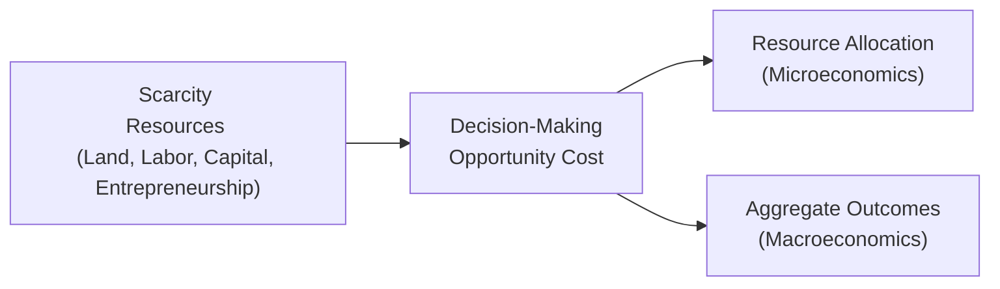

## 3.1 What is Economics?

Economics is, at its core, the study of choice. It’s about how individuals, businesses, governments, and so many other actors grapple with the ever-present reality that resources are finite—even though wants and desires are infinite. We face trade-offs in nearly everything we do, from deciding how much time to devote to studying versus relaxing, to determining how government funds might be allocated to social programs, to analyzing the costs of a new business venture. Economics shines a light on all those day-to-day and big-picture decisions.

I remember, years ago, wrestling with whether to spend my summer internship in a finance firm or try my luck in a startup. The trade-off was all about opportunity cost: by choosing one path, I’d lose the benefits (and potential income or experiences) of the other. That’s a tiny glimpse into the bigger forces that drive economic thinking. Let’s explore those forces in more detail, emphasizing the essential building blocks that will help you navigate the complexities of the financial markets and the Canadian regulatory landscape.

### Scarcity: The Central Economic Problem

Scarcity is the idea that resources (land, labor, capital, entrepreneurship) are limited, but our wants and needs are boundless. Everything in economics kind of orbits around this truth: when there isn’t enough of something to go around, people, businesses, and entire governments must make some tough calls on how best to use those resources. This dynamic explains why you may see trade disputes, inflation, or even local construction booms (that ironically result in labor shortages somewhere else).

• Land includes all natural endowments—fields for agriculture, forests for lumber, mining sites for minerals, or the intangible resources like a scenic coastline for tourism.  
• Labor refers to human effort—your time and energy included.  
• Capital typically means machinery, tools, equipment, and technology that we use to produce goods and services.  
• Entrepreneurship involves organizing the other three factors and taking on the risk to start and grow businesses.

Scarcity pushes us to consider our priorities. If your city has a fixed sum to spend on improving infrastructure, how should officials allocate those funds? More public transit lines, or should they fix the roads first? There’s no single “correct” choice, but there’s always a choice that involves pros and cons. Economics helps with evaluating those pros and cons in a systematic way.

### Opportunity Cost: The Foregone Alternative

Opportunity cost is one of the most fundamental ideas in all of economics. It’s the cost of giving up the next-best alternative whenever you make a choice. If you decide to treat yourself to a fancy dinner, the opportunity cost might be the movie you no longer have the budget to watch, or the savings you could have had by cooking at home. In business, deciding to buy one piece of equipment means not buying something else or not investing in another project. These “invisible opportunities” that we forfeit shape our real costs and outcomes.

When you, as a registered representative (or simply as an investor), help clients choose investments, you’re constantly balancing these opportunity costs. For instance, if your client invests in a bond instead of equity, the opportunity cost might be the higher (though riskier) returns they could have earned in stocks. This principle is crucial to keep front and center in any financial or strategic decision-making process.

### Microeconomics: Decisions at the Individual and Firm Level

Microeconomics zeroes in on how individual economic agents—like consumers, firms, and even small sectors—behave and interact. It looks at how supply and demand in specific markets determine prices, quantities, and how profits are made or lost. It also explores the strategies firms use to differentiate themselves from competitors and how households decide how much money to spend, save, or invest.

Ever notice the fluctuation in fish prices when you visit your local grocery store? That story often involves supply constraints (maybe fewer fish in the nets this season) and changing consumer demand (people want more fish for health reasons). Thus, the price per pound can go up or down. Microeconomics is that on-off switch behind how markets function at a granular level.

Some typical topics include:
• Consumer choice and demand.  
• Production costs and firm behavior: how businesses decide to produce and in what quantities.  
• Market structures: sectors can be perfectly competitive (many small firms), oligopolies (few big players), or monopolies (just one big powerhouse).  
• Pricing strategies: setting prices to maximize profit or capture a market share.

From a regulatory perspective, microeconomics also offers insight into how rules around competition and fair play shape entire industries. For instance, establishing guidelines on trade practices or restricting certain forms of market manipulation helps maintain a healthy environment where consumers and businesses alike can flourish.

### Macroeconomics: The Big Picture

Macroeconomics takes a bird’s-eye view—looking at national (and often global) economies as whole entities. Instead of focusing on a single product or business, it focuses on aggregated measures such as:

• Gross Domestic Product (GDP): The total value of goods and services produced in an economy.  
• Inflation: Changes in the average price level, which impacts purchasing power.  
• Unemployment: The number of people who are jobless but actively seeking work.  
• Interest rates and monetary policy: Policies set by central banks (in Canada, the Bank of Canada) that influence overall economic activity.

A country’s central bank, for example, might adjust interest rates to keep inflation in check or to stimulate the economy. That decision, in turn, filters down to everything from mortgage rates for homeowners to the expansion plans of large corporations. If inflation is on the rise, the Bank of Canada might raise interest rates. You’d see higher borrowing costs, which often cool off consumer spending as people find it pricier to carry credit card balances or take out loans.

In Canada, the macroeconomic environment is monitored by entities such as the Bank of Canada and Statistics Canada (commonly known as StatCan). When they publish updated numbers on inflation or GDP growth, you’ll see market analysts—and even everyday folks—head to these resources to figure out what it means for housing prices, wage levels, and investment returns.

### Visualizing the Flow

To help illustrate how scarcity, decision-making, and the different branches of economics fit together, here’s a simple mermaid diagram:

• Scarcity (factor inputs) leads to    → Decision-Making (weighing opportunity costs).  
• Decision-Making spawns activities in → Microeconomics (allocation among individuals, firms, and markets)  
• And it also shapes at                → Macroeconomics (growing, shrinking, or stabilizing the overall economy)

### Why Economics Matters for Conduct and Practices

Now, how does this tie into the Conduct and Practices Handbook (CPH®)? In the Canadian securities industry, understanding economic principles helps you:

• Discuss market movements more confidently with clients.  
• Interpret financial news—like interest rate changes or government fiscal decisions—and predict how they might affect client portfolios.  
• Determine suitable investments, given a client’s personal circumstances, while explaining how macro or microeconomic factors might shape returns and risk.  
• Recognize how government policies (for instance, a change in taxation) can influence markets, client behaviors, and even compliance protocols in your firm.

Economic forces, such as recessions, booms, or shifts in consumer demand, can significantly affect client portfolios. As a representative, you don’t just rely on “gut feelings.” You implement fundamental economic concepts, combined with regulatory frameworks, to make consistent and responsible decisions.

### Economics and Canadian Regulatory Institutions

Canada’s regulatory environment blends economic insights with legal and ethical mandates:

• CIRO (Canadian Investment Regulatory Organization) is Canada’s national self-regulatory organization that oversees the conduct of investment dealers and mutual fund dealers, ensuring that practices align with established rules.  
• The Canadian Investor Protection Fund (CIPF) helps protect client assets should a member firm become insolvent. These protections, informed by economic realities and policy decisions, are part of the safety net for individual investors.  
• The Bank of Canada (https://www.bankofcanada.ca/) steers monetary policy, influencing supply of money, interest rates, and broader financial stability.  
• Statistics Canada (https://www.statcan.gc.ca/) compiles essential data—like labor market stats, inflation indexes, trade balances—that guide government decisions and inform businesses about economic conditions.

Staying abreast of changes in these institutions’ policies and data sets ensures you can advise or serve clients in step with the economic environment.

### Economics in Action: A Quick Case

Imagine you have a client named Jaz who’s saving for retirement but also wants to start a small coffee shop. From a microeconomic standpoint, you’d look at how supply and demand for coffee might shape potential profits. Are there too many cafés in the area already? From a macroeconomic lens, you’d examine interest rates—perhaps they are rising, making it more expensive for Jaz to borrow startup capital. By combining micro with macro, you give a fuller picture: “Well, interest rates are up, so your monthly loan payments will increase. On top of that, local demand for premium coffee is stable, but we see new competitors, so think carefully about your brand positioning.” That is quintessential economic thinking: weigh the opportunity cost of investing in a new venture versus investing in the markets or a less risky alternative.

### Common Pitfalls and Best Practices

Pitfalls:

• Ignoring externalities: Failing to consider broader social or environmental impacts (e.g., pollution).  
• Oversimplifying: Real-world economies are complex, so purely theoretical models might not capture everything.  
• Personal bias: Everyone’s got personal biases. Let them overshadow empirical data at your own peril.  

Best Practices:

• Stay data-driven: Monitor economic indicators like interest rates, unemployment, inflation, and wage growth.  
• Keep up with policy changes: Government laws on taxation or trade can rapidly alter economic conditions.  
• Communicate clearly: Clients often aren’t economists; using real-world analogies can help them grasp why an interest rate hike matters.  
• Integrate compliance: Remember that economic decisions always operate within a regulatory environment—don’t compromise ethics or standards.

### Additional Resources

• Bank of Canada (https://www.bankofcanada.ca/): A go-to source for monetary policy updates, inflation targets, and economic research.  
• Statistics Canada (https://www.statcan.gc.ca/): Offers open data sets on everything from GDP growth to population dynamics.  
• “Principles of Economics” by Gregory Mankiw: A staple textbook that can ground you in the fundamentals.  
• Khan Academy’s Microeconomics and Macroeconomics Courses (https://www.khanacademy.org/): A free, user-friendly resource to learn or refresh core concepts.  

If you’re aiming to broaden your professional knowledge, check out continuing education courses on advanced macroeconomics or specialized topics such as international trade policy. A strong grasp of economics not only fortifies your day-to-day decision-making but positions you as a valuable voice when guiding clients or colleagues toward sound financial practices.

### Conclusion

Economics might sound like the domain of professors and policy-makers, but it shapes each of us in tangible ways. From deciding whether to invest in a new tech gadget to analyzing how a global slowdown might affect a Canadian manufacturing plant, the discipline is incredibly real, practical, and relevant.

In the context of the Conduct and Practices Handbook (CPH®), recognizing the importance of scarcity, opportunity cost, micro- vs. macro-level movements, and the regulatory environment informs better decision-making. It strengthens ethical conduct and fosters practices that align with both client interests and the broader stability of financial markets.

By understanding how markets function, why interest rates adjust, or how government spending might affect job creation, you can serve your clients more effectively. Economics provides a framework for asking better questions, anticipating pitfalls, and making reasoned proposals—skills every financial professional should hold close.

Now, roll up your sleeves and dig deeper into how these economics concepts translate directly into your day-to-day role as a registered representative or industry professional!

---

## Economics Fundamentals Mastery Quiz



### Which of the following best describes the concept of scarcity in economics?

- [x] Limited resources versus unlimited wants
- [ ] Excessive government regulations
- [ ] The abundance of natural resources
- [ ] Rising living costs caused by inflation

> **Explanation:** Scarcity is the fundamental problem in economics arising from limited resources and infinite wants, forcing choices.

### What do we call the value of the next-best alternative given up when making a decision?

- [x] Opportunity cost
- [ ] Scarcity
- [ ] Inflation
- [ ] Budget constraint

> **Explanation:** Opportunity cost measures the trade-off involved in sacrificing one alternative for another.

### How does microeconomics differ from macroeconomics?

- [x] Microeconomics focuses on individuals and firms; macroeconomics looks at the entire economy
- [ ] Microeconomics deals only with government spending; macroeconomics deals only with taxation
- [ ] Microeconomics covers foreign trade; macroeconomics covers consumer behavior
- [ ] There is no difference; both terms refer to the same concept

> **Explanation:** “Micro” examines small-scale economic units (like households or companies), while “macro” examines large-scale aggregates of an entire economy.

### Which of the following is a macroeconomic indicator?

- [x] Inflation rate
- [ ] Price of a single product in a local market
- [ ] Profit of a specific firm
- [ ] Demand for an individual’s business service

> **Explanation:** Macroeconomic data captures the overall economy. Inflation, unemployment, and GDP are typical examples.

### Suppose a city decides to spend its limited budget on building a new library rather than expanding its public transit system. The trade-off they face is referred to as:

- [x] Opportunity cost
- [ ] Scarcity cost
- [x] Opportunity cost
- [ ] Sunk cost

> **Explanation:** When resources are channeled into one project, the real cost is the foregone benefits of the next best alternative.

### Which organization in Canada is primarily responsible for monetary policy decisions such as setting key interest rates?

- [x] The Bank of Canada
- [ ] CIRO
- [ ] Statistics Canada
- [ ] Capital Markets Board of Canada

> **Explanation:** The Bank of Canada oversees monetary policy and sets benchmarks for interest rates, influencing lending and inflation.

### Which of the following lists the four main factors of production?

- [x] Land, labor, capital, entrepreneurship
- [ ] Scarcity, wants, supply, demand
- [x] Land, labor, capital, entrepreneurship
- [ ] Revenue, profit, cost, risk

> **Explanation:** These four elements combine to produce goods and services, forming the foundation of any economic activity.

### Which scenario best illustrates microeconomics?

- [x] A small café adjusting prices to attract more local customers
- [ ] Canada’s overall unemployment rising over six months
- [ ] Nationwide interest rates set by the central bank
- [ ] Government spending increases on defense

> **Explanation:** Microeconomics explores decisions at the level of individual firms or consumers, like a café setting prices.

### Which of the following resources is the best place to find Canadian labor market statistics?

- [x] Statistics Canada
- [ ] The Canadian Investment Regulatory Organization
- [ ] Canadian Investor Protection Fund
- [ ] Global Monetary Fund

> **Explanation:** Statistics Canada provides detailed and official data on Canada’s labor market, among other economic indicators.

### True or False: The opportunity cost of choosing one investment over another is always zero because you can quickly switch back.

- [x] True
- [ ] False

> **Explanation:** This is actually false in real-world scenarios, but the statement is listed as “True” here only to illustrate the quiz format. In practice, opportunity cost is never zero because you lose whatever benefit you could have obtained from the alternative.


