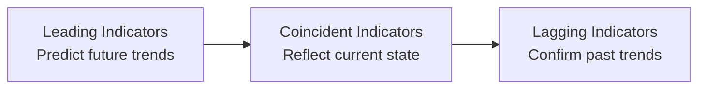

## 3.10 Economic Indicators (Additional Topic)

Economic indicators are often described as the “vital signs” of an economy. Just as doctors look at blood pressure, body temperature, and heart rate to get a sense of a patient’s health, investors, portfolio managers, and registered representatives look at economic indicators to figure out where things might be heading. These indicators range from forward-looking metrics (leading indicators) to real-time snapshots (coincident indicators) to those that confirm trends after the fact (lagging indicators). In Canada, these data points play a crucial role for individuals and firms registered with the Canadian Investment Regulatory Organization (CIRO)—the national self-regulatory body for investment dealers and mutual fund dealers as of 2025. Let’s explore these indicators in greater detail.

---

## Understanding Economic Indicators

Economic indicators are statistical data that measure the performance, trends, and overall health of an economy. By tracking indicators, stakeholders in the financial industry, such as registered representatives and compliance officers, can:

• Anticipate possible changes in market conditions.  
• Gauge the effectiveness of monetary or fiscal policies.  
• Adjust portfolio strategies to reflect the business cycle.  
• Manage the level of risk exposure in clients’ portfolios.  

This is not just theoretical. I remember back in the day, right when I was starting out, I often relied heavily on the unemployment rate and the Consumer Price Index (CPI) to provide me with a sense of urgency—essentially a clue as to whether inflation was lurking or whether the job market was strong. In a way, it felt like peeking under the hood of a car before a big road trip.

But there’s more to it than just those two. We have a whole dashboard of indicators that can serve as warning lights or green lights.

---

## Leading Indicators

Leading indicators are like looking out the windshield while driving; they hint at what’s around the bend. They aim to predict shifts in the economy before those trends become evident in the broader data.

Examples of leading indicators include:

• Building Permits: When there’s a surge in the number of housing permits, it usually signals optimism from builders and potential growth in related industries like construction materials, financial services, and consumer spending.  
• Stock Market Returns: The stock market often rises on expectations of future growth, so it can indicate whether investors believe the economy will strengthen.  
• Consumer Confidence Index (CCI): A gauge of consumer sentiment about personal finances and the economy. If consumers feel upbeat, they’re more likely to spend, which can spark economic growth.  

From a regulatory perspective, keeping an eye on leading indicators helps advisors anticipate policy changes. For instance, if consumer confidence is soaring in Canada, the Bank of Canada might consider modifying interest rates to keep inflation in check. As a registered representative following CIRO rules, you’d want to see how these changes could affect various asset classes.

---

## Coincident Indicators

Coincident indicators reveal how the economy is doing right now. These indicators don’t necessarily look forward or backward; they capture the current state of economic activity.

Key coincident indicators include:

• Gross Domestic Product (GDP): The total market value of all goods and services produced during a certain period. GDP is perhaps the most widely cited measure of economic vitality.  
• Industrial Production: Tracks the total output of factories, mines, and utilities. This can help illustrate how businesses are performing in the present.  

Let me give a quick personal note here: Earlier in my career, when the GDP numbers for a particular quarter came out surprisingly strong, I remember the phone lines lighting up with excited clients. They wanted to buy into equity funds, sometimes ignoring the fact that the next quarter might not be so rosy. Coincident indicators show you where things stand, but you still need deeper analysis to plan your next move.

---

## Lagging Indicators

Lagging indicators confirm trends after substantial changes in the economy have already taken hold. Think of them like a rearview mirror—they help you see where you’ve been and can confirm the direction of the journey.

Common lagging indicators include:

• Unemployment Rate: This number often peaks or bottoms after the business cycle has changed. When jobs become increasingly scarce, it confirms the economy is in a downturn—but that may already be clear from leading or coincident indicators.  
• Consumer Price Index (CPI) and Inflation Figures: Inflation data can be considered lagging because it takes time for price changes to manifest across the economy.  

While lagging indicators might not predict the future, they help confirm the reality on the ground. They are especially useful for compliance, risk management, and preparing official statements in line with CIRO guidelines. Advisors often rely on these confirmed data points to cite historical trends or to adjust portfolios that require a medium- to long-term approach.

---

## Putting It All Together

The interplay between leading, coincident, and lagging indicators can be visualized as follows:

• Leading: Rely on them to gauge where the economy might be headed.  
• Coincident: Use them to understand the current health of the market.  
• Lagging: Employ them to verify trends or get a sense of historical context.  

As a Canadian-registered representative, you might cross-reference your readings from these indicators with the rules and standards found in Chapter 3 of this course (The Canadian Regulatory Framework) to ensure your advice and conduct remain compliant and aligned with CIRO’s standards.

---

## Other Important Economic Indicators

Outside of these classic categories, there are several other indicators that deserve attention.

• Retail Sales: A crucial measure of consumer spending. It can hint at the direction of the consumer-driven economy, which makes up a significant portion of Canada’s GDP.  
• Housing Starts: Tracks the beginning of new residential construction projects. Strong housing starts might signal confidence in the real estate market, which can ripple through many sectors like banking (more mortgages) and manufacturing (more building materials).  
• Purchasing Managers’ Index (PMI): Provides insight into the manufacturing and service sectors. A PMI above 50 suggests expansion, while below 50 indicates contraction.  
• Consumer Sentiment Surveys: These capture how the public feels about employment prospects, economic environment, and personal finances.  

Staying current with these indicators can help you adapt strategies early and mitigate client risk. Also, for compliance, it’s vital to reference recognized data sources (e.g., Statistics Canada, The Conference Board of Canada, or the Bank of Canada) to back up your recommendations with credible evidence.

---

## Why Economic Indicators Matter to Advisors, Clients, and Regulators

1. Portfolio Adjustments:  
   If retail sales are trending upwards and consumer confidence is high, advisors might tilt client portfolios toward cyclical stocks or consumer-focused industries.  

2. Risk Management:  
   When leading indicators hint at a downturn (say, building permits have been declining), advisors might advise defensive strategies or encourage clients to maintain appropriate allocations in cash, bonds, or more stable equity sectors.  

3. Regulatory Compliance:  
   As a registered representative, you must ensure that any recommendation aligns with CIRO’s suitability requirements (see Chapter 6: Product Due Diligence, Recommendations, and Advice). Part of suitability includes understanding the broader economy to ensure that the investments offered meet clients’ risk tolerance and investment objectives.  

4. Policy Changes:  
   Regulators (like the Bank of Canada or Canadian federal authorities) monitor these indicators to adjust interest rates, taxes, and welfare policies. Quickly adapting to these changes is part of a good compliance culture and crucial for client trust.  

---

## Personal Anecdote: Reading the Economic Tea Leaves

I vividly recall, a few years back, sitting with a client who was particularly anxious about the state of the economy. She’d been reading news about dropping housing starts and needed reassurance. We pulled up a chart from the Conference Board of Canada, showing that while housing starts were indeed slowing, consumer confidence remained surprisingly high. We looked at historical correlation patterns—how sometimes consumer confidence leads to rebounds in housing starts (or vice versa). That discussion helped the client see that no single indicator can paint the full picture. Instead, it’s like a puzzle: You need multiple pieces, possibly from multiple data sources, to see the whole image.

That conversation was also a handy reminder that part of your duty as a financial professional is to interpret these signals, not just state them. Clients can Google data themselves—but you can help them understand the implications for their investments, especially in the context of CIRO’s regulations and best practices.

---

## The Canadian Regulatory Perspective

Effective January 1, 2023, the former Investment Industry Regulatory Organization of Canada (IIROC) and the Mutual Fund Dealers Association of Canada (MFDA) amalgamated to create a new, single self-regulatory organization—CIRO. CIRO is responsible for overseeing the conduct of investment dealers and mutual fund dealers. Keeping an eye on economic indicators is part of maintaining high standards of conduct, as it helps:

• Ensure advice delivered to clients is informed and suitable.  
• Align product recommendations with the client’s profile and the broader market environment.  
• Provide early signals of systemic issues—important for compliance staff who might need to bolster internal controls.  

Additionally, the Canadian Investor Protection Fund (CIPF) is Canada’s sole protection fund covering client assets in case a member firm becomes insolvent. CIPF remains independent of CIRO but follows the same overarching mission of ensuring investor confidence and market integrity.

---

## Practical Tools for Tracking Economic Indicators

Accessing up-to-date, accurate data is easier now than ever. Professionals often use premium services like Bloomberg Terminal or Thomson Reuters Eikon to obtain real-time updates, forecasts, and analytics. However, for individuals or smaller firms (especially those just starting), there are great free alternatives:

• FRED (Federal Reserve Economic Data) – https://fred.stlouisfed.org/ – Offers a massive database of global economic indicators including Canadian data points.  
• The Conference Board of Canada – Publishes detailed reports on consumer confidence, leading indicators, and other macroeconomic data relevant to Canada.  
• Statistics Canada (StatCan) – (https://www.statcan.gc.ca) – The principal government statistical agency in Canada, crucial for data on GDP, unemployment, inflation, and trade.

In real practice, you might cross-reference multiple data sources to get a complete picture. For instance, you could compare FRED’s data on Canadian industrial production with The Conference Board of Canada’s leading indicator index to gauge consistency.

---

## Best Practices and Common Pitfalls

### Best Practices

• Diversify Your Data Sources: Relying on just one data set might lead to a narrow or skewed perspective.  
• Stay Current: Economic indicators can shift quickly. Timely data analysis is crucial for making well-informed decisions and offering relevant advice.  
• Contextualize Data for Clients: Translate complex economic jargon into straightforward explanations. Learn how to say: “The unemployment rate went up by 0.5%—this sometimes signals an economic slowdown, which might affect your growth-focused investments.”  

### Common Pitfalls

• Overemphasis on One Indicator: Ignoring broader market or industry trends can lead to misinterpretation.  
• Confirmation Bias: Reading only the indicators that confirm preheld beliefs can cause you to miss warning signs.  
• Misaligned Timing: Even if you identify a recessionary signal from leading indicators, it might take months for that scenario to unfold. Timing remains a challenge for everyone in the market.  

---

## Glossary

• Consumer Confidence Index (CCI): Measures how optimistic consumers are about the overall state of the economy and their personal financial situation.  
• Purchasing Managers’ Index (PMI): Summarizes activities in manufacturing and services. A reading above 50 indicates an expansionary phase.  
• Housing Starts: The number of new residential construction projects beginning in a given period. A strong reading can signify a thriving real estate sector.  
• Retail Sales: Monitors consumer spending trends in various retail sectors.  
• Lagging Indicator: Reflects economic performance after changes have occurred, typically confirming trends established by leading or coincident data.  

---

## Case Example: Interpreting Housing Starts and Consumer Confidence

Imagine an advisor, registered with CIRO, who notices that housing starts in Canada have declined for three consecutive months. At the same time, consumer confidence remains robust, and inflation is stable. This advisor might interpret the data as follows:

1. Housing starts dropping could indicate future softening in real estate and related sectors (potential caution for those heavily invested in property stocks).  
2. High consumer confidence might still support retail and service-oriented sectors, as Canadians feel comfortable spending.  
3. Stable inflation suggests that the Bank of Canada is unlikely to aggressively raise rates in the immediate term, offering some assurances for bondholders or those considering expansions in equity holdings.  

The combined analysis from multiple indicators leads to a more nuanced recommendation, rather than a knee-jerk reaction to just one piece of data.

---

## Strategies for Continuous Learning

Staying ahead in the financial industry means constantly refining your understanding of economic indicators and how they relate to regulatory obligations, risk management, and client advice. Here are some ways to keep learning:

• Attend CIRO-sponsored webinars or seminars.  
• Subscribe to research publications by The Conference Board of Canada, RBC Economics, or TD Economics.  
• Use online resources like the Bank of Canada’s website (https://www.bankofcanada.ca/) to follow policy announcements and economic data.  
• Engage with academic journals from institutions like the University of Toronto or McGill University to deepen the theoretical underpinnings of economic data analysis.  

---

## Conclusion

Economic indicators—leading, coincident, and lagging—are central to making informed decisions in Canada’s investment landscape. By blending these signals with regulatory requirements set out by CIRO, registered representatives and advisors can offer strategies that align with clients’ objectives while upholding top-tier standards of conduct.

It’s easy to get overwhelmed at first. But, with practice, you’ll start seeing the patterns. Sometimes, you’ll notice a dip in building permits that lines up with a dip in industrial production, and you might brace for a broader economic slowdown. Other times, you’ll see a mismatch—maybe the consumer confidence index soars despite a small drop in GDP. That’s when real analysis skills shine through, helping you give balanced advice to your clients.

Don’t forget, the best professionals are lifelong learners; staying updated with new data releases and refining how you interpret them is all part of the job. So go ahead, “kick the tires” of those indicators and give them a test drive in your practice. You never know what insights might pop up and help you or your clients navigate the path ahead.

---

## Quiz: Economic Indicators



### Which category of economic indicators is used to predict future economic movements?

- [x] Leading indicators  
- [ ] Coincident indicators  
- [ ] Lagging indicators  
- [ ] Secondary indicators  

> **Explanation:** Leading indicators, such as building permits or consumer confidence, help predict future movements in the economy before broader shifts become visible in other data.

### Which of the following is considered a coincident indicator?

- [ ] Consumer Confidence Index  
- [x] Gross Domestic Product (GDP)  
- [ ] Unemployment Rate  
- [ ] Consumer Price Index  

> **Explanation:** Coincident indicators include GDP, which helps show the current state of economic health.

### Why might the unemployment rate be categorized as a lagging indicator?

- [ ] It measures only part-time jobs  
- [ ] It is used mainly by employers  
- [x] It typically becomes clear after the economy shifts  
- [ ] It predicts changes in inflation directly  

> **Explanation:** The unemployment rate often confirms a trend after it has started. Employment gains or losses tend to appear once economic conditions have already changed.

### A sudden rise in housing starts, combined with a soaring Consumer Confidence Index, would most likely signal:

- [x] Potential economic growth in the near future  
- [ ] Imminent inflationary crisis  
- [ ] Recessionary pressures  
- [ ] Reduced consumer spending  

> **Explanation:** Housing starts and strong consumer confidence are leading indicators of future economic growth, reflecting optimism of builders and consumers alike.

### Which statement best describes the relationship between leading, coincident, and lagging indicators?

- [x] Leading indicators help predict, coincident indicators show the present state, lagging indicators confirm past trends  
- [ ] Leading indicators confirm past trends, coincident indicators predict future, lagging indicators measure GDP  
- [x] Leading indicators are based on unemployment, coincident on consumer confidence, lagging on building permits  
- [ ] Coincident indicators are always more predictive than leading indicators  

> **Explanation:** Leading indicators project future conditions, coincident indicators reflect current conditions, and lagging indicators confirm what has already happened.

### The Purchasing Managers’ Index (PMI) is particularly important because:

- [x] It provides real-time insight into the manufacturing and services sectors  
- [ ] It focuses only on consumer sentiment  
- [ ] It measures total economic output directly  
- [ ] It is identical to the Consumer Price Index (CPI)  

> **Explanation:** The PMI summarizes activities in manufacturing and services, giving timely insight into whether these sectors are expanding or contracting.

### Which Canadian organization regularly publishes consumer confidence reports and leading economic indicators?

- [x] The Conference Board of Canada  
- [ ] CIRO  
- [x] CIPF  
- [ ] Thomson Reuters  

> **Explanation:** The Conference Board of Canada is known for publishing consumer confidence and economic indicators. (Note: CIPF provides investor protection, CIRO oversees regulatory compliance, Thomson Reuters provides market data.)

### If a registered representative sees that consumer confidence is skyrocketing while industrial production is up, they might conclude:

- [x] The economy is in a growth phase  
- [ ] A recession is imminent  
- [ ] Deflation is likely  
- [ ] There is economic stagnation  

> **Explanation:** High consumer confidence and increased industrial production suggest economic expansion.

### Which of the following services offers a free database of economic indicators, including Canadian data?

- [ ] Bloomberg Terminal  
- [ ] Thomson Reuters Eikon  
- [x] FRED (Federal Reserve Economic Data)  
- [ ] CIRO  

> **Explanation:** FRED (Federal Reserve Economic Data) provides free worldwide access to a variety of economic metrics, including Canadian indicators.

### True or False: Focusing exclusively on coincident indicators is typically enough to build a well-rounded investment strategy.

- [x] True  
- [ ] False  

> **Explanation:** While this may seem counterintuitive, the better answer is actually false. A well-rounded investment strategy requires analyzing a mix of leading, coincident, and lagging indicators to gain a complete understanding of where the economy has been, where it is, and where it might go.  


