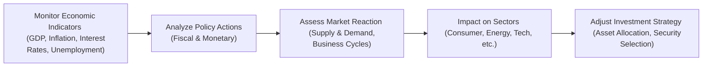

## 3.11 Conclusion

Have you ever wondered why market conditions sometimes feel like a roller coaster ride? One moment the economy’s booming, clients are thrilled, and everyone seems to be making money; the next, markets sputter or contract, and folks hold their breath, maybe even panic. Well, economics is the magic lens through which we can begin to see how and why these shifts happen. Throughout this chapter, we have walked through the essential building blocks of economics—from macroeconomic indicators to policy influences—and how they affect mutual fund representatives, their clients, and the broader financial landscape in Canada and beyond.

This conclusion ties it all together, so consider this your “checklist” of key economic takeaways. Understanding these principles will help you remain adaptable and ready to offer sound advice, no matter the market cycles. More importantly, you’ll be able to align your insights with prevailing regulatory guidelines in Canada, including policies upheld by the Canadian Investment Regulatory Organization (CIRO). That’s critical to ensure you’re fully informed about best practices and protocols when guiding your clients.

Below, we will revisit the highlights—macroeconomic policy tools, the economic environment, indicators, market structures, and the art of asset allocation—and offer a few personal insights, practical tips, and resources you can turn to for ongoing learning.

---

## Revisiting the Core Economic Concepts

### The Foundations of Economics

Economics, at its core, is all about how scarce resources are distributed, produced, and consumed within a society. We can talk in-depth about supply-and-demand curves and how prices are set—and we did—but the main takeaway is that these fundamental forces drive everyday market conditions. For instance, if a new technology drastically cuts the cost of producing electric cars, supply will increase, prices will typically fall, and more consumers may flood the market. In turn, opportunities might open up for new industry players to enter the sector. 

As a mutual fund representative, these seemingly abstract economics theories matter because your recommended funds hold equities and bonds tied to these industries or governments. Understanding how supply and demand plays out can hint at the direction of future earnings, price movements, and overall market sentiment.

### Macroeconomic Policy Tools

Now, let’s talk about governments and central banks. Sometimes, it feels like these institutions have a giant lever they can pull on the economy. While that’s an oversimplification, there’s some truth to it. The Bank of Canada adjusts interest rates to keep inflation in check and ensure financial stability. Federal and provincial governments tweak tax rates or public spending to influence economic growth. We call these levers “macroeconomic policy tools,” and they include:

• Monetary policy: Setting interest rates, controlling the money supply, and influencing the cost of borrowing. This is typically where the Bank of Canada figures in.  
• Fiscal policy: Adjusting government revenues through taxation and expenditures (spending on infrastructure, benefits programs, etc.). These policies can directly impact GDP growth, unemployment, and the business environment.

Picture it like this: If the government wants to stimulate the economy during a downturn, they might spend more on public projects (roads, health infrastructure, tech initiatives). This injection of funds can bolster employment, put more money in consumers’ pockets, and drive consumption. In turn, businesses see increased demand, which can raise corporate earnings and potentially boost stock prices. So, as an advisor, paying attention to these cues helps you anticipate how certain sectors—or even the entire market—might respond to policy changes.

### The Economic Environment

When we mention the “economic environment,” we’re talking about all the external factors shaping the performance and stability of an economy, from global trade tensions to technological disruptions. Demand in the U.S., Europe, or China can impact Canadian exports; currency exchange rates can influence costs and profits for domestic businesses. Shifts in consumer sentiment, resource shortages, or new regulations can also shape the landscape. Even a health crisis (as the world witnessed) can upend entire supply chains and consumer spending habits.

A healthy economic environment typically features manageable inflation levels, stable growth in GDP, low unemployment, and an environment conducive to innovation. As a mutual fund representative, it’s helpful to stay updated on changes in these big-picture forces. For instance, if inflation is rising rapidly, it can erode purchasing power and dampen consumer confidence. Conversely, stable inflation often indicates a more predictable investment climate, giving clients greater confidence in long-term investing.

### Key Economic Indicators

• GDP Growth: Often the star of headline news, GDP offers a snapshot of economic performance. Rapid GDP growth can point to rising corporate earnings and increasing asset values, while contracting GDP might signal trouble on the horizon.  
• Unemployment Rate: This reflects the health of the labor market. When unemployment is low, consumers typically have more disposable income, boosting spending and corporate revenues.  
• Inflation: It measures the increase in price levels over time. Moderate inflation can signal a healthy economy, but high inflation can eat into profits and degrade consumer purchasing power.  
• Interest Rates: Set by central banks to manage economic activity and control inflation. Lower rates generally encourage borrowing and risk-taking, possibly driving up equity markets. Higher rates, however, can make borrowing expensive, slowing down growth and impacting certain industries like real estate.  
• Business Cycles: The ebbs and flows of expansion and contraction. It’s crucial to gauge where we are in the cycle—peak, contraction, trough, or expansion—when making investment recommendations.  

If you find yourself discussing interest rates with a client who’s undecided about fixed income vs. equity-heavy portfolios, referencing these indicators can illustrate how your advice fits the big-picture economic climate.

### Demand and Supply Dynamics

We all know the basics: demand goes up, price tends to go up; supply goes up, price tends to go down. But what does that mean for your client’s portfolio? Let’s say we see a major shift toward green energy, and the supply of solar panels has recently soared, driving down costs. This might spark consumer interest (higher demand), fueling the growth of solar-related stocks. In fact, various mutual funds or ETFs might overweight these companies anticipating that trend. 

Therefore, by understanding supply and demand, not just in product markets but also in labor markets, currency exchange, and commodities, you can glean insights on where potential investment gems might be or where overvalued fads could end.

### Market Structures

We covered various types of market structures—perfect competition, monopolistic competition, oligopoly, and monopoly. Now, how exactly does that help you in your role? For instance, if a client asks, “Should I invest in Company X?” you might assess the firm’s competitive position. Is it in a fiercely competitive environment (perfect or monopolistic competition), or is it among a few major players (oligopoly)? Could it be that the company forms a near-monopoly in a niche? Market structure influences profit margins, pricing power, and innovation capacity, thus shaping long-term potential for an equity investment.

---

## Harnessing These Economic Insights for Investment Decisions

### Asset Allocation and Economic Outlook

Sometimes, the biggest question your client will ask is, “How do I diversify my portfolio?” The concept of asset allocation—dividing investment into equities, bonds, and cash—depends heavily on our read of the economic landscape. If the central bank is hiking interest rates, you might fine-tune the defensive positions in a client’s portfolio or pivot to companies expected to weather higher rates well (e.g., consumer staples or utilities). If you anticipate an economic upturn, you might move into growth-oriented equities or cyclical sectors like manufacturing and construction.

So, the important bit here is: the more you understand the current economic environment and likely future trends, the smarter your asset allocations become.

### Regulatory Considerations in Canada

Ah, the “red tape” side of things. It can be a bit dull sometimes, but it’s absolutely critical. As you keep track of economic developments, don’t forget the guidelines put forth by organizations like the Canadian Investment Regulatory Organization (CIRO). Historically, we had IIROC and the MFDA, but those consolidated into CIRO as of January 1, 2023, to form a overarching self-regulatory organization that covers both investment dealers and mutual fund dealers. CIRO frequently updates best practices and compliance protocols, especially if there are significant economic changes that might affect how you disclose risk, manage client accounts, or communicate product offerings.

By staying updated through CIRO bulletins, their official website ([https://www.ciro.ca/](https://www.ciro.ca/)), and continuing education programs, you ensure your economic advice and investment strategies meet all necessary legal and ethical standards. This is critical for establishing trust with your clients and for preserving the integrity of the industry.

### Practical Example: The Value of Monitoring Indicators

Let’s craft a quick scenario. Suppose you have a client named Sandra who is about to retire and wants to move some of her equity-heavy portfolio into something more stable. Recently, the Bank of Canada signaled it might raise interest rates to combat inflation. You watch Stats Canada data indicating that unemployment is rising slightly, GDP growth is modest, and inflation is indeed on an upward trend.

Given that environment, you might recommend Sandra shift more funds into fixed-income products, anticipating yields might become more attractive if rates keep edging up. Or you might consider funds that emphasize sectors known for resilience in times of rising rates, such as utilities or consumer staples. In short, by merging macroeconomic analysis with knowledge of her risk tolerance, you tailor an approach that is both compliant with regulatory guidelines and aligned with her personal goals.

---

## Personal Anecdotes on Economic Vigilance

Over my career, I’ve seen advisors miss sharp turns in the economy because they tuned out macroeconomic data. True story: a colleague once assumed that interest rates would stay low indefinitely and advised his clients to stick with highly leveraged investments in the real estate sector. When rates eventually rose faster than expected, many of those clients faced steep portfolio declines and near loan defaults. It was a tough lesson—a reminder that ignoring macro trends can be as risky as ignoring fundamental company data.

On the flip side, I’ve watched advisors help clients retire comfortably by simply staying aware of unemployment trends and commodity cycles. One memorable instance involved a client with significant investments in resource-heavy mutual funds. Because the advisor had been monitoring the cyclical nature of resource prices and the possibility of an upcoming economic downturn, he proposed a rebalancing plan. The result? The client avoided the worst of a resource-sector slump—and it was all made possible by paying attention to macroeconomic signals.

---

## Mermaid Diagram: The Flow of Economic Indicators to Investment Decisions

It might be helpful to visualize how macroeconomic indicators feed into the recommendation process. Here’s a simple flowchart:

• A: You watch for GDP growth, inflation rates, interest-rate decisions, and job reports.  
• B: You interpret potential government fiscal policies (like infrastructure spending) and central-bank monetary policies (like rate hikes).  
• C: You see market sentiment and behavior shift, shaping supply and demand dynamics.  
• D: You figure out which sectors might gain or lose. Maybe utilities shine in a high-rate environment, or tech thrives in an expansionary period.  
• E: You recommend rebalancing portfolios, maybe shifting from cyclical to defensive stocks or adjusting the duration of bond holdings.

---

## Best Practices and Common Pitfalls

• Stay Curious: New data points or regulatory announcements can change market sentiment quickly. Keep an open mind.  
• Don’t Overreact: Not all economic data is equally significant. Sometimes the market experiences “noise” that you can safely tune out, unless you see a consistent trend.  
• Diversify Wisely: Even if your economic outlook is strong, never put all your eggs in one basket.  
• Practice Patience: Economic forces often move gradually. Jumping in and out of positions aggressively can do more harm than good if the data is ambiguous.  
• Regulatory Alignment: Always cross-check that any strategies or products align with CIRO-compliant guidelines and best practices.  

### Pitfall Example: Herd Mentality

In my early years, I saw a wave of investors pile into a certain commodity (no names here, but you can guess) simply because “everyone else was doing it.” Price soared, inflation was reading high that season, and folks assumed the commodity was a safe hedge. But suddenly, policy changes were announced—interest rates spiked. People flocked to safer instruments, commodities demand plummeted, and the latecomers faced brutal losses. That’s why I always say, “Do your homework!”

---

## Using Tools and Resources

Staying on top of economic trends might feel daunting, but there are plenty of resources:

• CIRO [https://www.ciro.ca/](https://www.ciro.ca/): Check for the latest regulatory updates and guidelines.  
• Statistics Canada [https://www.statcan.gc.ca/](https://www.statcan.gc.ca/): Your go-to source for GDP, inflation, labor market numbers, and trade data.  
• Bank of Canada [https://www.bankofcanada.ca/](https://www.bankofcanada.ca/): Keep tabs on interest-rate announcements, monetary policy reports, and economic research.  
• International Monetary Fund (IMF) [https://www.imf.org/](https://www.imf.org/): Provides global economic outlooks—a good resource if your clients have international exposure.  
• Open-Source Financial Tools: Websites like GitHub host free python libraries (pandas, NumPy, scikit-learn) that can help you crunch large economic data sets. If you or your firm have the capabilities, these can be real game-changers in analyzing historical trends.

For deeper intellectual dives, you might consider reading John Maynard Keynes’ “The General Theory of Employment, Interest and Money.” It’s a classic but still resonates with modern debates on government intervention and market dynamics. 

---

## Summing It Up: Economic Knowledge as a Competitive Advantage

Walking through macroeconomic fundamentals might not sound glamorous at first. Yet, weaving these insights into your advisory approach sets you apart. When a client asks, “Is now the right time to invest in resource sectors?” you won’t just say “yes” or “no.” Instead, you’ll inform them about the current stage of the business cycle, show them how interest rates might affect commodity demand, and illustrate how shifts in global trade patterns might influence Canada’s resource exports. That’s real value.

Economics is not just about dusty old theories—it’s about helping you stay nimble, read the market’s pulse, and confidently offer advice aligned with the best interests of your clients. Mastering these principles and pairing them with a strong compliance framework ensures that you’re well-prepared for the uncertain twists and turns of the modern financial landscape.

---

## Looking Ahead

This chapter set a foundation for how broader economic conditions influence the Canadian marketplace, your role as a mutual fund representative, and the financial outcomes of your clients. Understanding fiscal and monetary policy, analyzing market cycles, and staying informed about current economic indicators are all part of an ongoing journey.

And guess what? The journey continues. In the upcoming chapters, you’ll learn even more about the specific regulatory frameworks in Canada, best practices for working with clients, and how to implement product due diligence. You’ll see how these big-picture economic realities intersect with day-to-day activities—from completing new account applications to formulating tailored investment strategies. 

Economics is the bedrock on which much of the financial industry is built. Armed with these concepts, you’re poised to craft strategies that align with both your clients’ ambitions and the macroeconomic environment. Stay curious, stay informed, and keep translating macro trends into prudent portfolio decisions. That way, you’ll stand out as the advisor who consistently adds real value—one who is well-versed not only in product knowledge but also in the forces shaping our markets, day after day.

---

## Glossary Recap

• **Macroeconomic Policy Tools:** Instruments like interest rates, open market operations, and government budgets that shape economic performance.  
• **Economic Environment:** The web of internal and external factors (both domestic and global) affecting economic growth, stability, and resource distribution.  
• **Asset Allocation:** Dividing investments among major asset classes—equities, fixed income, cash—based on factors like the outlook for inflation, interest rates, and general market stability.

---

## References and Further Reading

• CIRO: [https://www.ciro.ca/](https://www.ciro.ca/) for regulatory updates, compliance guidelines, and helpful investor resources.  
• Statistics Canada: [https://www.statcan.gc.ca/](https://www.statcan.gc.ca/) for real-time data and analytics on Canadian GDP, unemployment, and inflation.  
• Bank of Canada: [https://www.bankofcanada.ca/](https://www.bankofcanada.ca/) for the latest interest rate decisions, monetary policy reports, and market analysis.  
• John Maynard Keynes, “The General Theory of Employment, Interest and Money” – A foundational text in modern macroeconomic thought.  
• IMF: [https://www.imf.org/](https://www.imf.org/) for global economic outlooks and research.  
• Open-Source Financial Tools on GitHub and other platforms (for advanced analytics and modeling).

Dive into these resources and continue to enhance your economic and market awareness. By doing so, you’ll set yourself apart as an advisor who keeps a close eye on the big picture, while never losing sight of your clients’ best interests.

---

## Test Your Understanding of Economics through an Interactive Quiz

Below is a short quiz to help you gauge your mastery of these essential economic concepts. Take your time, consider each question carefully, and remember: applying real-world logic is often just as important as memorizing theory!

## Key Economic Insights and Market Dynamics Quiz



### Which of the following best describes the primary function of macroeconomic policy tools?

- [ ] To increase personal savings rates
- [x] To influence overall economic performance through government and central bank interventions
- [ ] To reduce the national debt instantaneously
- [ ] To eliminate fluctuations in stock market valuations

> **Explanation:** Macroeconomic policy tools, including interest rate adjustments and fiscal stimulus, aim to influence factors like inflation, unemployment, and GDP growth. They do not operate on individual financial goals (like personal savings directly), nor can they instantly reduce national debt or fully control stock market movement.

### When the Bank of Canada lowers interest rates, what immediate effect typically occurs?

- [ ] Currency appreciation
- [x] Lower borrowing costs, stimulating economic activity
- [ ] A sudden drop in government spending
- [ ] A guaranteed increase in unemployment

> **Explanation:** When interest rates go down, it becomes cheaper for businesses and consumers to borrow, prompting more investment and spending. This may lead to higher growth (though other factors also come into play). Currency appreciation or a guaranteed change in unemployment can’t be immediately assumed, as they depend on broader market responses.

### Which economic indicator is most directly tied to the labor market’s health and consumer purchasing power?

- [ ] Interest rates
- [ ] GDP growth
- [x] Unemployment rate
- [ ] Inflation

> **Explanation:** The unemployment rate reflects how many people in the labor force are without jobs. High unemployment can reduce consumer spending and purchasing power, whereas low unemployment typically indicates stronger consumer confidence.

### Suppose a mutual fund representative notices that inflation is rising rapidly. Which of the following strategies might they consider recommending?

- [ ] Investing heavily in a single tech startup
- [ ] Keeping all funds in local currency with no diversification
- [ ] Liquidating all assets immediately
- [x] Shifting more portfolio weight to assets that historically hold value during inflationary periods

> **Explanation:** In times of higher inflation, investors often look to positions such as real assets, certain commodities, or inflation-indexed securities. Concentrating in a single startup, staying entirely in local currency, or liquidating all assets are extreme positions that won’t typically insulate against inflation risk.

### Which factor is NOT a key economic indicator generally discussed in macroeconomic analysis?

- [ ] GDP
- [ ] Inflation
- [x] Marketing budget of a specific private company
- [ ] Unemployment rate

> **Explanation:** Key economic indicators include GDP, inflation, and unemployment. A single corporation’s marketing budget does not constitute a macroeconomic indicator, as it only applies to that particular business.

### When the Canadian government decides to cut taxes while increasing infrastructure spending, what type of policy is being implemented?

- [x] Fiscal policy
- [ ] Monetary policy
- [ ] Interest rate targeting
- [ ] Micro economic stimulus

> **Explanation:** Reducing taxes and increasing government spending is classic fiscal policy. Monetary policy is executed by a central bank (Bank of Canada), focusing on interest rates and money supply.

### In which market structure does a single company dominate an entire industry, significantly influencing price and output?

- [ ] Perfect competition
- [ ] Monopolistic competition
- [ ] Oligopoly
- [x] Monopoly

> **Explanation:** A monopoly exists when there’s only one firm controlling the entire market, limiting consumer choices and competition.

### You notice that the Bank of Canada is expected to raise rates next quarter. Which of the following is a likely effect on the bond market?

- [ ] Bond prices will surge indefinitely
- [x] Bond prices may fall as yields rise
- [ ] Bond demand automatically disappears
- [ ] Inflation becomes irrelevant

> **Explanation:** When interest rates rise, bond yields tend to rise as well, which conversely affects bond prices, typically causing them to decrease. This dynamic is a fundamental principle in fixed-income investing.

### How might a sudden boom in consumer demand and spending influence GDP?

- [x] It may lead to an increase in GDP growth
- [ ] It is guaranteed to reduce GDP
- [ ] It has no effect on GDP
- [ ] It causes unemployment to rise significantly

> **Explanation:** Rising consumer demand usually spurs business revenues, which can stimulate production and further investment, leading to overall GDP growth—although external factors also matter.

### True or False: Asset allocation decisions should be completely independent of macroeconomic indicators.

- [ ] True
- [x] False

> **Explanation:** Macroeconomic indicators like GDP growth, inflation, and interest rates inform how you balance equities, bonds, and other asset classes. Ignoring these indicators can lead to inappropriate or untimely portfolio decisions.



Feel free to circulate these questions among your peers or revisit them regularly to keep your skills sharp. And remember: economics is dynamic, so the best advisors stay engaged with ongoing data updates, policy announcements, and global events. By doing so, you’ll keep refining your ability to spot opportunities early and navigate challenges confidently—skills that are invaluable to your clients’ long-term success.
