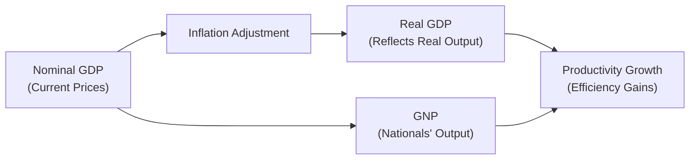

## 3.2 How is Economic Growth Measured?

Measuring economic growth is really about figuring out how well a country’s economy is doing over time. Are we producing more stuff—goods and services—this year than last year? Are Canadians better off overall compared to, say, five or ten years ago? These questions often come up when governments plan budgets, businesses consider investments, or investors weigh different countries’ markets. It can feel a bit abstract, but it boils down to something quite tangible: people’s day-to-day lives can be significantly influenced by economic growth (or the lack thereof).

In this section, we’ll explore what economic growth is, why Real GDP is considered the go-to measure, how other metrics like GNP (Gross National Product) and GDI (Gross Domestic Income) fit into the picture, and why “productivity” is a big deal if you’re keeping an eye on living standards. We’ll also discuss how Canada tracks its economic growth data—mainly through Statistics Canada—and how regulatory bodies such as the Bank of Canada interpret these measurements when guiding policy. In the end, we’ll cover potential pitfalls (like inflation or misreading nominal GDP) and best practices for using growth data in your professional conduct.

(And by the way, if some of this sounds theoretical, you’re definitely not alone in thinking that. Trust me, I once spent three hours just trying to figure out how Real GDP factored in inflation, and I still had to re-read the definitions a few times. So let’s take it step by step.)

### Defining Economic Growth

Economic growth is formally defined as an increase in a country’s production of goods and services from one period to another. It’s generally expressed as a percentage rate of growth in real GDP. If you’re in a hurry, you might see an economist say something like, “Real GDP grew by 2.3% last quarter.” The key word there? “Real.” We’ll get to why “real” matters in a bit (spoiler: it’s about inflation).

Without going into overly formal territory, growth matters because:

• It indicates that businesses are producing more and possibly hiring more people.  
• It suggests consumers may have higher incomes (in aggregate) and can spend more.  
• It provides governments more tax revenue, potentially allowing for improved public services.  
• It affects investor sentiment, often impacting stock market performance and investment flows.

If you’re working in any aspect of finance or investing in Canada, you’ll want to keep tabs on these indicators. Even if your focus is narrower—say you’re in a niche area like bond trading—knowing the broader trend in growth can help you anticipate interest rate changes, government policy adjustments, or shifts in consumer demand.

### Why Real GDP is the Go-To Metric

So, what is GDP, anyway? Gross Domestic Product measures the total dollar value of all final goods and services produced within a country’s borders in a given time period. Let’s break it down:

• “Gross” means we’re not subtracting anything like depreciation.  
• “Domestic” indicates it’s happening within the country’s borders.  
• “Product” references the actual goods and services.

#### Nominal GDP vs. Real GDP

Nominal GDP is just GDP measured in current market prices, without adjusting for inflation. This is a bit like saying: “Hey, we produced $2 trillion worth of goods and services this year at current prices.” But if the price of everything went up significantly (i.e., inflation was high), that $2 trillion might simply reflect higher prices for the same amount of goods and services as last year. So it could look like the economy grew, but maybe we’re only paying more for our usual basket of items.

That’s where Real GDP swoops in to the rescue. Real GDP strips out the effect of inflation using a price index so that growth figures better reflect changes in the actual volume of production rather than price fluctuations. It’s calculated roughly like this:


\text{Real GDP} = \frac{\text{Nominal GDP}}{\text{Price Index}} \times 100


where the Price Index is often something like the GDP deflator. This way, if last year’s GDP was, let’s say, $1.95 trillion and this year’s is $2.00 trillion, but we adjust for inflation at 3%, we can see how much of that $50 billion increase is “real” growth in production.

#### Per Capita GDP

Per Capita GDP is also worth keeping on your radar. All it does is divide GDP by the total population to get an average economic output per person. So if Real GDP grows, but your population also grows at a similar pace, then on a per-person basis, living standards might not actually improve. Hence, when analyzing living standards, many economists and policy experts pay closer attention to Real GDP per capita. It offers an approximate gauge of how well-off people are, though it’s still an average and doesn’t reveal inequalities.

### Beyond GDP: GNP, GDI, and Productivity

Sometimes, you’ll hear about alternative (or supplementary) ways to measure economic growth or economic well-being.

#### GNP (Gross National Product)

GNP measures output produced by a nation’s citizens, regardless of where they are. In other words, it includes Canadians working abroad but excludes foreign nationals working in Canada. It’s not used as frequently in Canada’s policy discussions as GDP, but it’s still a common figure globally. For instance, GNP can matter more if you have a strong diaspora population generating economic value abroad.

#### GDI (Gross Domestic Income)

GDI is basically the flip side of the GDP coin in an income sense. GDP is production-based, whereas GDI measures the total income earned by everyone (individuals, businesses, and government) in the country. In theory, GDP and GDI should match up (production of goods and services eventually translates into income for someone), though data collection quirks can create small discrepancies.

#### The Productivity Factor

Productivity is often the unsung hero in discussions of long-term growth. If an economy’s productivity improves—say, a company finds a way to produce more units per worker hour or harnesses technology to automate tasks—then that economy tends to grow faster. Higher productivity means you can get more output from the same input (like labor or capital). Over years and decades, productivity gains are a major driver of improvements in living standards.

For example, if a Canadian firm invests in advanced robotics, it might make more cars, computers, or electronics without necessarily hiring more workers. As a result, total output jumps—so do profits, wages (hopefully), and GDP. That’s why governments and global organizations emphasize research and development, innovation, and education—to keep that productivity engine humming.

### A Quick Look at Measuring Growth in Canada

In Canada, economic growth data typically comes from Statistics Canada. Quarterly and annual GDP reports are widely followed by policymakers, business leaders, and the finance industry. The data grind might look like a sea of endless spreadsheets—trust me, I’ve spent entire afternoons poring over tables from Statistics Canada (and occasionally losing track of which line I was on). But it’s an essential measure for:

• Determining how the economy is performing relative to previous quarters and years.  
• Offering investors insights into sectors that might be growing more rapidly than others.  
• Guiding the Bank of Canada’s decisions on interest rates and monetary policy.  
• Providing government officials with a sense of how policies are impacting growth.  

If you ever want to see the raw Stats Canada data, you can check out [Statistics Canada](https://www.statcan.gc.ca/). It’s user-friendly enough once you get the hang of it, and you’ll find breakdowns by province, by industrial sector, and by expenditure components. Economists then glean insights about whether consumer spending, government spending, trade, or inventory changes are driving growth.

### The Role of the Bank of Canada

The Bank of Canada, for its part, tracks these metrics to plan monetary policy—a fancy way of saying how they influence interest rates and the money supply. If growth is strong and inflation is heating up, the Bank might raise interest rates to cool things off. On the flip side, if growth is sluggish, they might lower interest rates to stimulate borrowing and investing.

They publish the [Monetary Policy Report](https://www.bankofcanada.ca/publications/) several times a year, which is basically a deep-dive on Canada’s economic outlook, growth forecasts, inflation trends, and what the Bank plans to do about interest rates. For Conduct and Practices Handbook (CPH®) readers, it’s a good resource for staying updated on how macroeconomic data ties into the regulatory environment for securities and investment businesses.

### The Link Between Growth and Prices: Inflation Considerations

Economic growth is great—but what happens if an economy grows too quickly? Often, inflation picks up as demand for goods and services outstrips supply. Too much inflation can erode purchasing power, meaning your clients’ money doesn’t go as far as it used to.

For instance, if Real GDP is rising 3% annually but inflation is at 4%, the net “real” benefit to consumers might be negative in certain contexts because high inflation could overshadow nominal gains. That’s why the concept of “capacity” matters—if an economy nears its production capacity (like factories operating 24/7, labor fully employed), additional demand might just push up prices instead of output.

### A Simple Mermaid Diagram

Let’s visualize the relationship among Nominal GDP, Real GDP, GNP, and Productivity using a simple flowchart. This might help you see how these concepts connect:

• Nominal GDP includes everything at current prices.  
• We adjust for inflation to get Real GDP, which shows genuine changes in quantity, not just price.  
• GNP measures output from citizens of a country (as opposed to the production within geographic borders).  
• Productivity growth feeds into both Real GDP and GNP figures over time, indicating how efficiently resources are utilized.

### Case Study: A Manufacturing Startup in Ontario

Let’s bring this to life with a quick case. Suppose you have a manufacturing startup in Ontario specializing in eco-friendly packaging. In your first year (Year 1), you produce 10,000 units and sell them for $5 each, so your total output is $50,000. That year, Canada’s economy sees low inflation (1%), so your Real GDP for that product category is not much different from nominal.

In Year 2, you ramp up production to 15,000 units. Maybe you raise your prices slightly to $5.10, but inflation in the rest of Canada’s economy is up to 3%. After accounting for that inflation, your Real GDP contribution goes up by something close to 1,500 units times last year’s price, netted out by the economy’s price index. Because you grew your production output by 50% in nominal terms, but inflation is 3%, your Real GDP measure might be somewhere around a 47% boost (the math can get more complex with chained indexes, but you get the idea).

The Canadian government sees that your startup’s sector—manufacturing of eco-friendly packaging—is growing quickly. Investors might then decide that manufacturing is a potentially lucrative sector, because it’s not just a price effect, it’s real volume growth (which implies new hires and actual economic impact). Meanwhile, the Bank of Canada might keep an eye on whether overall manufacturing is contributing to significant inflation or not, helping them gauge interest rate decisions.

### Common Pitfalls and Best Practices

• **Pitfall: Confusing Nominal with Real Measures.** As we mentioned, always clarify whether you’re looking at nominal or real data. If you see big numbers but they’re not inflation-adjusted, you might overestimate growth.  
• **Avoid Overreliance on a Single Quarter.** Growth can fluctuate quarter to quarter. Sometimes external shocks (like natural disasters or major policy changes) can skew a single quarter’s data. Look at the longer-term trend.  
• **Watch Out for Per Capita Trends.** A country’s GDP might be growing, but if the population grows faster, individual well-being might stagnate or even decline.  
• **Unbalanced Growth.** If growth is driven solely by one sector—maybe just oil and gas or technology—this can be risky for investors. Diversified growth is usually more stable.  
• **Misreading Productivity Gains.** Productivity improvements are great but if they result in widespread layoffs (because fewer workers are needed), it can create short-term labor market challenges. So, think long-term vs. short-term.  
• **Not Accounting for Distribution of Growth.** GDP is an average. If the top 1% captures most of the gains, average Canadians might not actually feel the positive effects.  

### Why It All Matters for Financial Professionals

As a registered representative, you’ll want to track economic growth because your clients’ portfolio strategies, risk tolerances, and return expectations are often shaped by where the economy is headed. For instance:

• During periods of **robust growth**, equities could offer more upside, but central banks might tighten monetary policy to combat inflation, impacting bond yields.  
• During **slower growth** or a recession, clients might shift toward safer, fixed-income assets or other “defensive” sectors (like utilities, consumer staples, etc.).  
• If growth is concentrated in certain regions (e.g., Western Canada might benefit from oil prices, while Ontario might benefit from manufacturing), this can inform geographic asset allocations in a client’s portfolio.  

### Regulatory Considerations and Resources

Given this is the Conduct and Practices Handbook (CPH®), keep in mind that honest, accurate, and transparent communication with clients about economic trends is part of professional conduct. If Real GDP data suggests a slowdown, for instance, advisors should explain how it might affect investment strategies, not simply brush it off.

• In Canada, CIRO (the Canadian Investment Regulatory Organization) oversees investment dealers and mutual fund dealers. It sets standards around ethical conduct, disclosure, and more.  
• CIPF (Canadian Investor Protection Fund) protects client assets if a member firm becomes insolvent, but it doesn’t guarantee returns or shield investors from poor economic conditions.  
• CIRO and CIPF rely on thorough economic data to understand market conditions and potential firm vulnerabilities.  
• For historical data references, you might see the now-defunct IIROC or MFDA in old materials—just be aware that as of January 1, 2023, they merged into CIRO and are no longer separate entities.

### Open-Source Tools and Further Exploration

• [Statistics Canada](https://www.statcan.gc.ca/): The go-to for GDP data, productivity stats, and population metrics.  
• [Bank of Canada’s Monetary Policy Report](https://www.bankofcanada.ca/publications/): Regular updates on the Canadian economy, growth forecasts, and policy moves.  
• [The World Bank’s DataBank](https://databank.worldbank.org/): Compare Canada’s GDP growth to other countries if you or your clients are looking at international diversification.  
• [OECD Statistics](https://stats.oecd.org/): Great resource for cross-country comparisons on productivity, GDP per capita, and more detailed economic indicators.

### Bringing It All Together

Economic growth may sound like a buzzword, but it’s really just about how much stuff a nation creates and consumes—and how this changes over time. Real GDP is the linchpin, but if you’re being thorough, you’ll also glance at GNP, GDI, and measures of productivity. In Canada, official numbers from Statistics Canada guide policymakers, businesses, and, of course, the Bank of Canada. As a financial professional, keep an eye on these indicators to inform client advice. And, hey, if you call your client up one afternoon to recommend rebalancing a portfolio, it never hurts to add something like, “With Real GDP growth slowing down, we might want to reconsider our sector allocations.”

When done right, understanding economic growth measures helps keep you on the ethical high ground—providing transparent and well-informed guidance in line with CIRO’s expectations of good conduct. So next time you see that headline about “3% Real GDP Growth,” you’ll know exactly what it means and how it might shape your day-to-day practice.

--------------------------------------

## Test Your Knowledge of Measuring Economic Growth



### Real versus Nominal GDP
- [x] Real GDP adjusts for inflation, while Nominal GDP does not.
- [ ] Nominal GDP adjusts for inflation, while Real GDP does not.
- [ ] Both Real and Nominal GDP account for inflation in the same way.
- [ ] Neither Real nor Nominal GDP considers inflation.

> **Explanation:** Nominal GDP uses current prices and doesn't account for inflation, whereas Real GDP strips out inflation using a price index, providing a clearer picture of actual economic output.

### Importance of Real GDP Calculation
- [x] Real GDP reveals whether production volume has actually increased.
- [ ] Real GDP focuses exclusively on wages, ignoring production totals.
- [x] Real GDP can be a better measure of living standards than Nominal GDP.
- [ ] Real GDP only matters in deflationary environments.

> **Explanation:** Real GDP adjusts for price changes, clarifying if there’s genuine growth in production. Its focus on actual output can provide insight into living standards, especially when compared to Nominal GDP, which might overstate growth due to inflation.

### Measuring Growth in Canada
- [x] Statistics Canada is responsible for collecting and publishing GDP data.
- [ ] Bank of Canada publishes official GDP data each month.
- [ ] CIPF calculates Canada’s economic growth rate.
- [ ] Only provincial governments measure GDP.

> **Explanation:** Statistics Canada handles official GDP data; the Bank of Canada relies on these figures for monetary policy decisions. CIPF is an investor protection fund and does not calculate GDP.

### The Role of Productivity
- [x] Higher productivity often leads to long-term improvements in living standards.
- [ ] Productivity has no direct impact on GDP.
- [ ] Productivity gains always lead to higher employment.
- [ ] Productivity is only relevant to technology companies.

> **Explanation:** Productivity measures output per unit of input and is key for sustainable, long-term economic growth. It doesn’t guarantee higher employment right away, but over time it can positively affect wages, production, and living standards.  

### GNP vs GDP
- [x] GNP measures production by a nation’s citizens globally.
- [ ] GNP ignores production of services, focusing only on goods.
- [x] GDP measures production within a country’s borders.
- [ ] GDP only tracks data related to government spending.

> **Explanation:** GNP captures output by a country’s citizens, wherever they are. GDP focuses on production within a specific geographic region, regardless of who owns the resources.

### Per Capita GDP Significance
- [x] It helps assess standard of living by dividing GDP by population.
- [ ] It ignores population size entirely.
- [ ] It is only useful in developed countries.
- [ ] It measures total inflation in an economy.

> **Explanation:** Per capita GDP offers a rough measure of how much economic output is generated per person, providing a macro-level gauge of living standards.

### Inflation and Economic Growth
- [x] High growth can sometimes lead to inflation if demand outstrips supply.
- [ ] High growth automatically reduces inflation.
- [x] When inflation is measured, we often look at changes in price levels.
- [ ] Inflation rates are irrelevant to monetary policy decisions.

> **Explanation:** If an economy grows faster than its capacity, it may face inflationary pressures. The Bank of Canada and other central banks monitor inflation to adjust policy tools accordingly.

### Monetary Policy Considerations
- [x] The Bank of Canada uses growth trends to guide interest rate decisions.
- [ ] Interest rate policies in Canada are determined solely by CIRO.
- [ ] Lower interest rates are always used to combat high inflation.
- [ ] GDP data has no connection to monetary policy.

> **Explanation:** The Bank of Canada sets monetary policy and closely tracks GDP numbers alongside inflation indicators to make decisions on raising or lowering interest rates.

### Pitfalls in Measuring Growth
- [x] Focusing too heavily on a single quarter can be misleading.
- [ ] Real GDP always provides a fully accurate economic picture with no adjustments needed.
- [ ] Productivity gains and employment rates are always proportionate.
- [ ] Per Capita GDP never needs to be considered if overall GDP is rising.

> **Explanation:** Economic data can fluctuate, so a single quarter’s growth may not represent the underlying trend. Also, Per Capita GDP, productivity effects, and employment shifts must all be viewed together to get a complete picture.

### True or False: Productivity Gains Always Result in More Jobs
- [x] True
- [ ] False

> **Explanation:** Often, improved productivity can, in the long run, lead to more jobs by growing the overall size of the economy. However, in the short term, it can reduce the need for certain types of labor. Over time, the economy adjusts, new industries emerge, and employment can still rise. The statement is nuanced—some might argue it's not always the case, but in broad, long-term macroeconomic trends, productivity can pave the way for job creation through expanded economic capacity.


