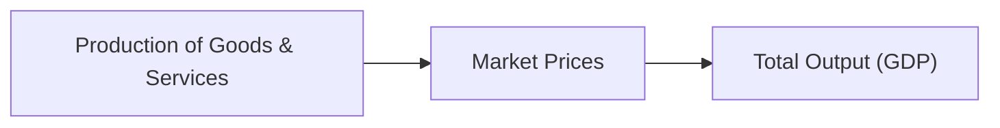

## 3.2 How is Economic Growth Measured?

Sometimes, when people talk about the economy, it's easy to get swept up in terms like “GDP,” “growth rate,” or “output.” You might remember hearing these words during the evening news or from your colleagues, often with an air of obsession—“Did GDP go up? Did it go down?” To be honest, I used to find these terms super confusing. I mean, how do we really know whether an economy is growing or shrinking just from a couple of acronyms and percentages, right?

In this section, we’ll clarify what exactly economists mean by economic growth, how we measure it, and why it matters—especially if you’re working in investments and trying to help clients make smart decisions about their mutual fund portfolios. Let’s dive in.

## Understanding Economic Growth

Economic growth, at its core, is about a nation’s increase in the production of goods and services over time. “Production” refers to all the stuff that gets made and all the services that are delivered—everything from cars being assembled in factories to IT consultants tinkering with computer networks. If a country is producing more stuff this year than it did last year, that generally indicates growth. But it’s not always so straightforward—prices change, inflation happens, populations shift, and sometimes the numbers can mean different things if we aren’t paying close attention.

### The Role of GDP

Gross Domestic Product (GDP) is probably the most famous measure of economic growth. It’s the total monetary value of all finished goods and services produced within a country’s borders in a specific period, typically quarterly or annually. Whether you’re tracking the manufacturing of maple syrup in Ontario or the number of website designers building e-commerce sites in Vancouver, all this activity funnels into GDP.

Below is a simple flow diagram illustrating the high-level concept of how national production aggregates into GDP:

#### Measuring GDP in Different Ways

• Production approach: Sums the value added at each stage of production.  
• Expenditure approach: Sums total spending on finished goods and services (C + I + G + (X – M), if you remember that from basic macroeconomics: Consumption, Investment, Government Spending, and Net Exports).  
• Income approach: Sums all the income earned—wages, profits, interest, and rents—by production factors.

But really, these are all just different roads (approaches) leading to the same destination (GDP total).

## Nominal vs. Real GDP

When economists say “nominal GDP,” that’s just the total value of goods and services measured using current prices. So if you compare nominal GDP from one year to the next, you might see an increase—yay, growth!—but that increase might be partly because prices rose (a.k.a. inflation), not necessarily because we produced more stuff.

To solve that distortion, economists use “real GDP,” which strips out the effect of inflation to reflect *actual* changes in volume of production. This is why real GDP is so valuable for accurate historical comparisons. If you see real GDP growth of 2% from last year, you know that increase is real in terms of total output, rather than just prices going up.

### Why Adjust for Inflation?

Let’s imagine you’re running a little coffee cart. One year, you sell 100 cups of coffee at $1 each, so your total “coffee GDP” is $100. The following year, you sell the exact same 100 cups, but you raise the price to $2 per cup. Nominally, your coffee GDP has doubled to $200—but you produced the same number of cups! Real GDP, after adjusting for that price hike, would remain at $100 in year-one dollars, reflecting zero growth in quantity. This difference helps measure actual economic progress instead of just inflated numbers.

## GDP Per Capita

GDP per capita is basically GDP divided by the total population. This measure tries to capture the idea of how much output “on average” each person is generating (or how much is available to them, in monetary terms). It’s often used as a quick proxy for standard of living. A high GDP per capita typically implies (though not always guarantees) better infrastructure, higher average income, and access to more resources.

That being said, GDP per capita is just an average—there can be wide disparities within a country. Large inequalities might mean that only a small segment of the population benefits from increased production, while others do not.

## Alternative Measures

### Gross National Product (GNP)

Gross National Product (GNP) is closely related to GDP but adds net income from abroad. If many citizens of Country A are working internationally and sending that income back home, GNP might exceed GDP because it begins to account for resident earnings outside the national borders. Practically, for most countries, GDP is the more commonly cited figure, but GNP can be useful if a nation has substantial business or workforce activity overseas.

### Human Development Index (HDI)

Sometimes, the conversation around measuring well-being extends beyond just dollars and cents. The Human Development Index (HDI) steps in to measure quality of life factors, like health and education. For instance, it looks at life expectancy, education levels, and per capita income. In many policy conversations, HDI can be more insightful than GDP because it includes a broader definition of development. Canada typically ranks pretty high on the HDI scale, reflecting our strong education and healthcare systems, among other things.

### Genuine Progress Indicator (GPI)

The Genuine Progress Indicator (GPI) is another—and more complex—measure that adjusts for factors like income distribution, environmental costs, and the value of household or volunteer work. Maybe you’ve heard someone complain, “Why doesn’t the economy take into account the negative impact of pollution or the positive effect of volunteer work?” GPI tries to incorporate those aspects. While less common in official government reports, it gives a fuller picture of societal progress.

## Why Economic Growth Trends Matter to Mutual Fund Representatives

Okay, so you might be thinking, “Sounds good, but what do these big macro measures have to do with my day-to-day job as a mutual fund sales representative?” Honestly, quite a bit.

1. Corporate Earnings: When the economy grows, companies tend to sell more products, earn higher revenues, and (hopefully) deliver stronger earnings. This can lead to growth in stock prices and, by extension, many equity mutual funds.  
2. Consumer Spending: Economic growth typically means rising incomes, which can spur increased consumer spending. Funds that invest in consumer-driven sectors—like retail or tech—can see a boost.  
3. Government Policy: In periods of strong growth, governments might raise interest rates (through the central bank) to prevent excessive inflation. If the economy contracts, they might do the opposite. All these actions influence bond yields—and thus can affect the performance of fixed-income mutual funds.

In short, staying up to date on GDP trends may help you anticipate which sectors are poised to perform well. It’s not a magic crystal ball, but it’s a vital component of a broader economic outlook that helps direct sound investment strategies.

## Practical Examples and Case Studies

### Example 1: Tech Boom in a Growing Economy

Suppose Canada’s real GDP grows at an annual rate of 3%, buoyed largely by a surge in the tech sector. A growth-oriented equity mutual fund investing heavily in Canadian technology companies might see above-average returns, primarily because there’s this overall tailwind from the macro environment. 

### Example 2: Manufacturing Decline in a Slowing Economy

Now imagine that Canada experiences a year of flat or slightly negative real GDP growth (recession territory). The manufacturing sector suffers a slowdown due to lower exports and reduced consumer demand. Funds heavily weighted in that sector may underperform. On the bright side, some defensive funds, such as bond funds or certain diversified funds, might still do okay (or at least not lose as much).

These scenarios underscore the importance of understanding the link between GDP trends and sector performance. A well-informed mutual fund professional can guide clients in choosing funds that align with where the economic winds are blowing.

## Best Practices and Common Pitfalls

• Stay Updated: Regularly review official data from reliable sources, such as Statistics Canada. GDP updates usually come out quarterly, so keep them on your radar.  
• Look at Trends, Not Just One Quarter: One quarter of data can be noisy. It could be influenced by seasonal factors, a natural disaster, or an unexpected global event. Look at 2-to-4-quarter trends to form a more stable view.  
• Real vs. Nominal: Always distinguish between real and nominal GDP. If someone tosses out a big nominal growth figure without mentioning inflation, be sure to dig deeper.  
• Consider Per Capita Measures: Calibrate your understanding of economic well-being using per capita data. A large overall GDP might mask the fact that much of that wealth is concentrated among a small portion of the population.  
• Diversify: Even with positive GDP data, some sectors or regions could face headwinds. Diversification remains paramount in mutual fund investing.  

## Tips for Mutual Fund Clients

Sometimes, retail investors get spooked or overexcited about macroeconomic headlines—“GDP soared to 5% growth!” or “GDP shrank 2% this quarter!” While it’s tempting to rush into or out of funds based on these headlines, it’s often better to have a measured view. Clients should be guided to:

• Assess Long-Term Goals: In many cases, short-term dips or spikes in GDP don’t derail a 10- or 20-year investment objective.  
• Watch for Sector Impacts: Encourage them to consider how economic news affects certain sectors differently.  
• Look for Opportunities in a Downturn: Sometimes, a slowing economy presents good buying opportunities in undervalued sectors or funds.

## Regulatory and Canadian Context

In Canada, mutual fund representatives operate under the national self-regulatory organization known today as CIRO (Canadian Investment Regulatory Organization). Maintaining knowledge of economic indicators like GDP growth is essential for giving suitable advice and adhering to Know Your Client (KYC) and suitability guidelines. Representatives can put GDP trends in context to help determine whether an investment is fitting for a particular risk profile or time horizon.

Additionally, the Bank of Canada keeps a close eye on GDP trends to decide on monetary policy. When growth is robust, they might raise interest rates to cool inflation. When growth slows, they might reduce rates to stimulate the economy. All these changes trickle back into bond yields, currency values, and overall market confidence. Keeping track helps you be a better resource for your clients.

## Expanded Learning and References

• Statistics Canada’s GDP reports:  
  www.statcan.gc.ca/eng/subjects-start/economy  
• Bank of Canada’s Monetary Policy Reports for insights on GDP, inflation, and outlook:  
  www.bankofcanada.ca/publications/mpr  
• The Organisation for Economic Co-operation and Development (OECD) regularly publishes GDP comparisons:  
  www.oecd.org  
• For an academic deep dive, see “Macroeconomics” by Andrew B. Abel and Ben S. Bernanke.  
• CIRO (formerly MFDA and IIROC) has up-to-date regulatory guidelines:  
  https://www.ciro.ca  

## Putting It All Together

Economic growth measurement might sound like something only economists or policy wonks care about, but really, it’s the scaffolding holding up all those investment decisions you help clients make every day. In my own early career, I remember being baffled by macro headlines. I’d hear about a “skyrocketing GDP,” wonder if I should jump into certain funds, and worry about missing out. But over time, I realized the best approach is measured, well-informed, and balanced with a long-term perspective.

As you continue offering guidance on mutual fund products, keep the big picture of GDP (and other indicators) in mind. You’ll be better equipped to explain to your clients why certain funds are doing well or poorly and whether that might continue. After all, understanding economic growth is a critical underpinning of successful investing strategies—something that sets a strong representative apart.

----

## Quiz: Economic Growth and GDP Insights



### Which metric is the most widely used indicator of a country’s total value of production?

- [x] Gross Domestic Product (GDP)
- [ ] Gross National Product (GNP)
- [ ] Per Capita Income
- [ ] Genuine Progress Indicator (GPI)

> **Explanation:** GDP measures the total monetary value of all finished goods and services produced within a country’s borders in a specific period, making it the most commonly referenced benchmark of economic activity.

### Why do economists often prefer real GDP over nominal GDP?

- [x] It removes the effect of inflation
- [ ] It always presents higher growth rates
- [ ] It excludes services
- [ ] It measures only the manufacturing sector

> **Explanation:** Real GDP is adjusted for price changes (inflation or deflation), which gives a clearer picture of actual increases in production volume.

### GDP per capita is most closely associated with which concept?

- [x] Average economic output per person
- [ ] Total sum of personal savings and investments
- [ ] The cost of living index
- [ ] Aggregate measures of inflation and deflation

> **Explanation:** GDP per capita is simply the GDP divided by a country’s population, indicating the average economic output available to each person.

### Which of the following can reflect the net income of a country’s residents from overseas activities?

- [x] Gross National Product (GNP)
- [ ] Nominal GDP
- [ ] Real GDP
- [ ] GDP per capita

> **Explanation:** GNP includes the value of all goods and services produced by a country’s residents (both domestically and abroad), adding income from overseas activities.

### Which indicator integrates non-economic factors like health, education, and standard of living?

- [x] Human Development Index (HDI)
- [ ] Nominal GDP
- [x] Genuine Progress Indicator (GPI)
- [ ] Gross National Product (GNP)

> **Explanation:** Both HDI and GPI look beyond pure economic output to consider elements like health, education, income inequality, and environmental impact.

### Why is tracking GDP trends crucial for mutual fund representatives?

- [x] It helps anticipate potential performance shifts in different sectors
- [ ] It ensures compliance with tax legislation
- [ ] It eliminates the risk of market volatility
- [ ] It prevents central bank policy changes

> **Explanation:** By understanding GDP trends, mutual fund representatives can better gauge which sectors or funds may benefit from strong economic growth or face challenges during slowdowns.

### In an economy experiencing persistent inflation, which GDP measure presents a more accurate view of output changes over time?

- [x] Real GDP
- [ ] Nominal GDP
- [x] Both Real GDP and GNP
- [ ] GDP per capita

> **Explanation:** Real GDP accounts for inflation by using constant prices, thus showing the true change in quantity of goods and services produced.

### A high GDP per capita can signal:

- [x] A potentially higher standard of living
- [ ] Guaranteed equal income distribution
- [ ] Lower productivity levels
- [ ] Automatic increases in government spending

> **Explanation:** Higher GDP per capita may indicate better averages of goods, services, income, and resources, though it does not guarantee equitable distribution.

### If Canada’s real GDP declines for two consecutive quarters, it’s commonly referred to as:

- [x] A recession
- [ ] A slowdown
- [ ] A depression
- [ ] A stagnation

> **Explanation:** When real GDP contracts for at least two quarters in a row, it typically meets the technical definition of a recession.

### True or False: Understanding GDP growth trends can help representatives propose investments that align with broader economic cycles.

- [x] True
- [ ] False

> **Explanation:** GDP growth trends do inform how different sectors or fund categories might perform. By staying updated on these trends, representatives can align clients’ portfolios with economic realities.


