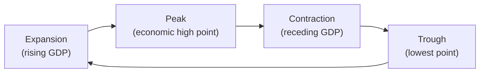

## 3.3 What are the Phases of the Business Cycle?

Picture this: You’re chatting with a friend who just started a small business selling custom phone cases. One year, their sales are through the roof, profits are strong, and they’re hiring new staff. But the following year, you notice they’re now hesitant to expand, worried about rising costs, and scrambling to keep up with changing consumer demand. These ups and downs in a single business can sometimes mirror the broader movements in the entire economy—periods of overall growth, followed by slowdowns or recessions, before rebounding again. Economists call this the “business cycle.” 

In this section, we’ll explore the four key phases of the business cycle: expansion, peak, contraction, and trough. We’ll look at each phase, examine why it matters for our economy, and discuss how mutual fund representatives can use cycles to inform their strategies. We’ll also see how these concepts tie into the broader topics covered in this chapter on economics (e.g., interest rates, economic indicators) and how they can be applied in real-world scenarios.

--------------------------------------------------------------------------------

## Understanding the Business Cycle
The business cycle refers to fluctuations in economic activity, typically measured by changes in real Gross Domestic Product (GDP), employment rates, consumer spending, and other macroeconomic indicators. When we say “cycle,” we’re talking about a repeating pattern. However, it’s crucial to note that no two business cycles are exactly the same, and the length and severity of each phase can vary significantly depending on everything from government policies to consumer confidence and global shocks.

Before diving into any number-crunching or theoretical models, let’s briefly define the four commonly recognized phases of the business cycle:

1. Expansion (sometimes called Recovery or Boom)  
2. Peak  
3. Contraction (often associated with Recession)  
4. Trough  

Understanding where we are and where we might be headed can help us (as investors or financial professionals) decide whether to deploy more capital in certain types of assets or to play it safer in others.

--------------------------------------------------------------------------------

## Phase 1: Expansion
In an expansion phase, the economy starts growing. You know this stage is underway when you see real GDP rising, businesses hiring more employees, and consumer confidence picking up. People feel more secure in their jobs, so they’re likely to spend more on goods and services. Firms react by producing more, hiring additional staff, and often investing in new equipment or technology to meet rising demand.

### Key Characteristics of an Expansion
• Rising GDP: Economic output (GDP) increases steadily.  
• Growing Employment: Unemployment rates typically decline because businesses need more workers.  
• Increasing Consumer and Business Confidence: Households feel more optimistic, and firms often plan for growth.  
• Possible Rise in Inflation: If the expansion is robust, inflation can creep up as demand for goods and services outstrips supply.  
• Supportive Monetary Policies: The central bank, such as the Bank of Canada, might have lowered interest rates earlier to stimulate spending and investment.

If you recall from Chapter 3.1 (What is Economics?), an essential aspect of economics is understanding supply and demand. In an expansion, increased demand for products and services is the driving force, and supply tries to keep up. Also, from Chapter 3.2 (How is Economic Growth Measured?), you’ll remember that GDP growth is a key barometer of overall economic performance.

### Example: Mutual Fund Strategies in an Expansion
During an expansion, mutual fund representatives might look to overweight cyclical or growth-oriented sectors. These might include technology, consumer discretionary, or industrials—areas that typically thrive when consumers and businesses have more money to spend. Suppose a Canadian-based mutual fund invests heavily in consumer technology stocks. During a sustained expansion, that fund might see strong returns as people have extra disposable income to buy new gadgets.  

--------------------------------------------------------------------------------

## Phase 2: Peak
Eventually, the expansion phase can’t go on forever—at least not at the same pace. The economy hits a peak when it’s at or near its highest level of activity. At this point, GDP might still be high, but its rate of growth starts to slow. Resource use is at or near full capacity, and inflationary pressures might build up, prompting the central bank or regulators to step in with policy measures.

### Key Characteristics of a Peak
• High Economic Output: Real GDP is often at or near a maximum level.  
• Tight Labour Market: Unemployment is low, and businesses might find it hard (and expensive) to hire new talent.  
• Rising Interest Rates: Central banks may increase interest rates to control inflation as economic activity and consumer demand heat up.  
• Slowing Growth: Although the economy is strong, the speed of growth may start to decelerate.

### Example: Shifting Tactics
At a peak, some savvy mutual fund managers begin to rebalance portfolios. If the manager believes a slowdown is imminent, they might start rotating out of highly cyclical stocks and into more defensive sectors like utilities or consumer staples. If the Bank of Canada signals tighter monetary policy, interest-rate-sensitive sectors such as real estate could begin to underperform.

--------------------------------------------------------------------------------

## Phase 3: Contraction (Recession)
After the peak, the economy moves into the contraction phase. This could be a mild period of economic cooling, or it could be a full-blown recession. The key indicator is a sustained decline in real GDP over time (often defined as two consecutive quarters of negative GDP growth). 

### Key Characteristics of a Contraction
• Falling GDP: Economic output declines and consumer spending drops.  
• Rising Unemployment: Businesses may cut costs by laying off employees.  
• Decreased Inflation or Possible Deflation: As demand weakens, prices may stabilize or even fall.  
• Lower Consumer Confidence: People are less likely to make big purchases if they’re worried about job security or if they’ve lost income.

In Chapter 3.5 (What Role do Interest Rates Play?), we talk about how central banks can try to control the business cycle using monetary policy. During a contraction, the Bank of Canada might reduce interest rates to encourage borrowing and investment, aiming to spark new business activity and consumer spending.

### Contraction Example: A Hypothetical Scenario
Let’s say you’ve got a friend—call him Mark—who owns a chain of coffee shops. During an expansion, Mark added new locations almost every quarter. But now he’s noticing foot traffic is down, and monthly expenses (like wages and rent) are eating into his profits. Mark might decide to close underperforming locations or reduce staff. Multiply Mark’s situation by the thousands of similar businesses across the country, and it becomes clear how this contraction theme can ripple through the entire economy.

### Mutual Fund Approach in a Contraction
During the slowdown, mutual fund representatives may suggest shifting investments to more conservative sectors such as utilities, healthcare, or consumer staples—areas that typically remain stable even when consumer spending falls. Holding a bit more cash or short-term fixed-income instruments can also help hedge against market volatility.

--------------------------------------------------------------------------------

## Phase 4: Trough
Finally, the economy reaches a trough: the point where economic activity is at its lowest. It may feel like there’s nowhere to go but up—or at least that’s the hope at this stage. From the trough, the economy typically enters a new expansion phase, starting the cycle anew.

### Key Characteristics of a Trough
• Minimum GDP Levels: Real GDP is at or near its lowest point in the cycle.  
• High Unemployment: The labour market might still be feeling the effects of the downturn.  
• Potential for Recovery: Often, signals from forward-looking economic indicators start to turn positive.  
• Stimulative Policies: Governments may introduce economic stimulus packages or lower taxes, and the central bank may keep interest rates down to encourage borrowing.

### Mutual Fund Strategy at the Trough
For a mutual fund representative, identifying an approaching trough can be incredibly valuable. This might be the time to increase exposure to riskier assets before the recovery sets in. If you anticipate an upturn, you could start to reallocate funds toward growth sectors, especially if you believe a rebound is imminent.

--------------------------------------------------------------------------------

## Visualizing the Business Cycle

Below is a simple Mermaid diagram illustrating the typical four phases of the business cycle. The vertical axis represents the level of economic output (like GDP), and the horizontal axis shows time.

The cycle moves in a loop: after the trough, a new expansion begins. Of course, in reality, these transitions aren’t as smooth or predictable as a simple diagram. Nonetheless, this model provides helpful insight into how economies generally ebb and flow over time.

--------------------------------------------------------------------------------

## How Long Do Business Cycles Last?
Business cycles don’t come with an expiration date. They can last anywhere from a few months of mild fluctuation to several years of boom or bust. Why do business cycles vary so much? Factors include:

• Consumer and Business Confidence Shifts.  
• Technological Innovations (or disruptions).  
• Government Policy (fiscal stimulus or tightening).  
• Central Bank Policy (interest rate changes, quantitative easing).  
• Geopolitical and Global Market Events (wars, pandemics, trade disputes).

In Chapter 3.6 (What is the Nature of Money and Inflation?), we’ll explore how inflation expectations also shape the length and depth of business cycles. Meanwhile, Chapter 3.7 (How do Fiscal and Monetary Policies and International Economics Impact the Economy?) shows how government decisions and global trade flows can either extend expansions or accelerate contractions.

--------------------------------------------------------------------------------

## Why the Business Cycle Matters to Mutual Fund Representatives
If you’re helping a client decide between a high-risk growth fund and a conservative bond fund, having a solid grasp on the business cycle can guide your recommendations. For instance:

• During expansions, you might allocate more to growth-oriented or cyclical funds.  
• Approaching a peak, you might diversify into quality bonds or defensive equity funds.  
• In a contraction, you’d focus on wealth preservation strategies or sectors less sensitive to economic downturns.  
• Closer to the trough, you’d consider pivoting back to more aggressive investments to capture the next wave of growth.

From Chapter 4 (Getting to Know the Client) and Chapter 5 (Behavioural Finance), we know that investment decisions also depend on individual risk tolerance, time horizon, and personal biases. But layering macroeconomic context on top of personal risk profiles helps ensure that the recommended portfolio is both suitable and well-positioned for broader market conditions.

--------------------------------------------------------------------------------

## A Practical Case Study: Lisa’s Portfolio Allocation
Let’s consider Lisa, a hypothetical investor in her mid-30s, who is building her retirement portfolio. She wants to make sure she’s ready for both the good times and the bad.

• During an Expansion: Lisa holds a higher percentage of equity funds, particularly in growth sectors like tech and consumer discretionary. She’s comfortable taking on more risk since her time horizon is long, and the economy supports rising corporate earnings.  
• Approaching the Peak: Her mutual fund representative sees indicators such as rising inflation and overheated valuations. Together, they decide to gradually shift some of Lisa’s portfolio into more stable sectors—like utilities—and include some conservative bond funds.  
• In a Contraction: With layoffs in the news and GDP forecasts declining, Lisa leans more heavily on fixed-income funds and looks at money market instruments. She’s also mindful of staying the course, because her time horizon is still years away.  
• Near the Trough: Economic signals hint that some leading indicators (e.g., new orders, manufacturing indices) are turning positive. Lisa and her representative start gradually moving back into cyclical equities, anticipating an upturn.

By aligning Lisa’s portfolio with the stages of the business cycle—while also respecting her risk tolerance and long-term goals—the mutual fund representative helps Lisa remain calm and intentional through market upheavals.

--------------------------------------------------------------------------------

## The Canadian Context and Regulatory Considerations
Although the main concepts of the business cycle apply globally, the specific drivers and dynamics can differ from one country to another. In Canada, the business cycle is strongly influenced by commodity prices (especially oil), international trade (particularly with the U.S.), and internal policy changes by the Bank of Canada.

When it comes to the regulatory environment, remember the changes:  
• On January 1, 2023, the Mutual Fund Dealers Association of Canada (MFDA) and the Investment Industry Regulatory Organization of Canada (IIROC) amalgamated to form the Canadian Investment Regulatory Organization (CIRO).  
• CIRO oversees both mutual fund dealers and investment dealers, as well as marketplace integrity.  
• The Canadian Investor Protection Fund (CIPF) now acts as the sole investor protection fund in the country, safeguarding client assets if a member firm becomes insolvent.

From a macroeconomic standpoint, the Bank of Canada’s “Business Outlook Survey” (www.bankofcanada.ca/publications/bos) is a critical tool you can use to glean insight into economic turning points relevant to our local environment. For broader North American trends, the National Bureau of Economic Research (NBER) (www.nber.org) in the U.S. regularly discusses economic cycles and recessions. And if you’re curious about forecasts and leading indicators, the Conference Board of Canada (www.conferenceboard.ca) offers specialized research and analysis on the Canadian business cycle.

--------------------------------------------------------------------------------

## Tools and Indicators to Track the Business Cycle

### 1. GDP Growth Rate
One of the simplest ways to gauge the business cycle is by looking at GDP growth from quarter to quarter. A common formula for the quarterly growth rate of real GDP is:


\text{GDP Growth Rate} = \frac{\text{GDP}_{t} - \text{GDP}_{t-1}}{\text{GDP}_{t-1}} \times 100\%


• GDP\\(_{t}\\) is the real GDP in the current period.  
• GDP\\(_{t-1}\\) is the real GDP in the previous period.

### 2. Unemployment Rate
The unemployment rate is a key lagging indicator. In expansions, unemployment typically declines, while in contractions it rises. Even after GDP turns positive, unemployment can remain high for a while because businesses often wait for a confirmed upswing before hiring again.

### 3. Leading Economic Indicators
Agencies like the Conference Board (in both the U.S. and Canada) track composite indexes that sum up variables believed to predict future economic trends (e.g., manufacturers’ new orders, housing permits, and consumer expectations).

### 4. Inflation and Interest Rates
Tracking changes in the Consumer Price Index (CPI) can help gauge inflationary pressures. Higher inflation may prompt the Bank of Canada to tighten monetary policy—a move that can bring an expansion phase closer to a peak. Conversely, if inflation is too low and the economy is slowing, the central bank may apply stimulative policy measures.

--------------------------------------------------------------------------------

## Common Pitfalls and Challenges
• Timing the Market: Accurately predicting when a new phase of the business cycle will begin is extremely difficult. Emotional investing or attempts at perfect market timing can lead to missed opportunities or greater losses.  
• Overreliance on a Single Indicator: GDP growth, unemployment, and inflation all matter. Looking at just one factor can provide incomplete information.  
• Global Influences: Canada’s economy is deeply intertwined with global supply chains, raw material prices, and U.S. consumer demand. Ignoring external factors can lead to flawed assumptions about where we stand in the cycle.  
• Policy Shocks: Fiscal or monetary policy actions can quickly alter economic momentum. For instance, an abrupt tightening of interest rates can hasten a slowdown, while a swift fiscal stimulus can accelerate or prolong an expansion.

--------------------------------------------------------------------------------

## Best Practices for Mutual Fund Representatives
1. Stay Informed: Keep an eye on monthly and quarterly economic releases, including Bank of Canada updates.  
2. Diversify: Even if you foresee an expansion, you’ll want to ensure clients have a balanced portfolio that can weather unexpected disruptions.  
3. Communicate Regularly: Clients appreciate transparency, especially as economic conditions shift. Discuss how macroeconomic signals might affect their portfolio strategy.  
4. Adhere to KYC and Suitability: Regardless of where we are in the business cycle, you must tailor recommendations to your client’s risk profile, objectives, and personal circumstances.  
5. Avoid Knee-Jerk Reactions: While it’s important to adapt, try not to make overly drastic moves based solely on short-term market noise.

--------------------------------------------------------------------------------

## Frequently Referenced Resources for Further Exploration
• Bank of Canada’s Business Outlook Survey:  
  https://www.bankofcanada.ca/publications/bos  
• Conference Board of Canada:  
  https://www.conferenceboard.ca  
• National Bureau of Economic Research (NBER), Business Cycle Dating:  
  https://www.nber.org  
• CIRO Resources for Regulatory Guidance:  
  https://www.ciro.ca  

--------------------------------------------------------------------------------

## Conclusion
The business cycle tells us a compelling story about how economies expand, peak, contract, and then recover. Recognizing these cycles is crucial for mutual fund representatives who aim to guide their clients through different market environments. A thorough understanding of expansions, peaks, contractions, and troughs—combined with effective communication, regular portfolio reviews, and a strict adherence to “Know Your Client” (KYC) principles—can make a significant difference in investment success over the long haul.

In the next sections of this chapter, we’ll expand on the economic indicators (e.g., interest rates, inflation, and money) that help shape and define these cycles. We’ll also explore how governments and central banks use fiscal and monetary policies to moderate the extremes of the business cycle. Until then, remember: no matter where we stand in the cycle, a cautious and informed approach will serve you and your clients well.

--------------------------------------------------------------------------------

## Test Your Knowledge: Understanding the Business Cycle Quiz



### Which of the following phases is typically associated with rising GDP, falling unemployment, and increasing consumer confidence?

- [ ] Peak
- [ ] Trough
- [x] Expansion
- [ ] Contraction

> **Explanation:** During an expansion, real GDP grows, businesses hire more workers, and consumers feel more confident about spending.

### What hallmark often occurs at the peak of the business cycle?

- [ ] Lower resource use
- [x] Slowing GDP growth and possibly rising inflation
- [ ] Increasing unemployment
- [ ] Declining wages

> **Explanation:** At the peak, economic output may be at (or near) its maximum, but the rate of growth starts to slow, and inflationary pressures often peak.

### When two consecutive quarters of negative GDP growth occur, the economy is most likely entering which phase?

- [ ] Expansion
- [x] Contraction (Recession)
- [ ] Peak
- [ ] Trough

> **Explanation:** A common definition of a recession is two consecutive quarters of negative GDP growth, which aligns with the contraction phase.

### Which of the following is a characteristic of the trough phase?

- [x] Economic output is at its lowest point
- [ ] Businesses are hiring aggressively
- [ ] Consumer spending is at an all-time high
- [ ] Real GDP is at record levels

> **Explanation:** The trough is the lowest point of economic activity before the recovery begins anew.

### How might inflation behave during a contraction?

- [ ] It typically skyrockets
- [x] It often stabilizes or even decreases
- [ ] It becomes a non-factor
- [x] It can vary if there are supply shocks or policy changes

> **Explanation:** As demand drops, inflation usually stabilizes or falls. However, special circumstances, such as supply shocks, can cause unexpected changes.

### Which statement best describes the Bank of Canada’s role in the business cycle?

- [x] It uses monetary policy tools (e.g., interest rates) to try to stabilize economic fluctuations
- [ ] It sets all corporate tax rates
- [ ] It has no influence on economic activity
- [ ] It only manages the TSX (Toronto Stock Exchange)

> **Explanation:** The Bank of Canada sets monetary policy (e.g., adjusting the overnight rate) to help manage inflation and influence economic activity.

### Which type of mutual fund might typically be favored in a late-expansion or peak phase?

- [x] Defensive funds (e.g., utilities, consumer staples)
- [ ] Highly speculative technology funds
- [x] Mixed strategies with some protective allocations
- [ ] Short-term money market funds only

> **Explanation:** As you near a peak, defensive or stable funds are often used to limit potential downside, though some portfolio mix might include other strategies.

### In a recession, why might unemployment remain high even after GDP starts to pick up?

- [ ] Wages automatically skyrocket
- [x] Businesses often wait for confirmed growth before rehiring
- [ ] Consumer confidence disappears for good
- [ ] The government stops all spending

> **Explanation:** Companies tend to be cautious and want to see sustained signs of improvement before making hiring commitments.

### According to the chapter, how could a mutual fund representative position a client’s portfolio near the trough of a business cycle?

- [ ] Stick exclusively to fixed-income funds
- [x] Strategically add growth-oriented or cyclical sectors
- [ ] Remove all diversification
- [ ] Avoid equity investments entirely

> **Explanation:** Near the trough, the economy may be poised to recover. Gradually adding growth or cyclical sectors can capture the upside as conditions improve.

### The Canadian economy is highly influenced by commodity prices and global trade. True or False?

- [x] True
- [ ] False

> **Explanation:** Canada’s economy, especially in terms of exports and trade, is highly dependent on commodity markets and global trading partners, such as the U.S.


