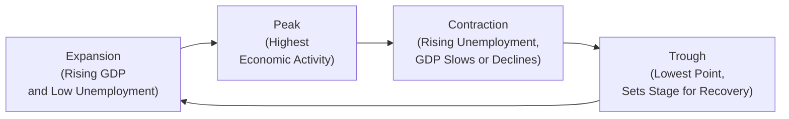

## 3.3 The Phases of the Business Cycle

Have you ever noticed how sometimes the economy feels unstoppable—everyone’s hiring, folks are excited to spend, and businesses seem to be popping up everywhere—while at other times things feel kinda slow, layoffs increase, and entrepreneurs get a bit quieter? These ups and downs are not just random occurrences. They’re part of what we call the “business cycle.” More formally, the business cycle describes recurring periods of expansion (growth) and contraction (recession) in the economy.

In this section, we’ll break down the essential phases—Expansion, Peak, Contraction, and Trough—and discuss the indicators that help us anticipate and navigate them. We’ll also touch on how it all ties back to the Canadian Securities Institute (CSI) context, and why a good understanding of the business cycle is crucial for anyone involved in financial services or policy making. By the end, you’ll appreciate how these ebbs and flows can shape everything from stock prices to government policy (and, well, your mood when you read that next economic forecast!).

--------------------------------------------------------------------------------

## Why the Business Cycle Matters

Imagine you’re a Registered Representative who needs to guide clients through their investment decisions. Knowing if the economy is in a boom or sliding into a recession can drive your choice of investment products, the advice you give on asset allocation, and maybe even how urgent you feel about cautioning clients to plan for a downturn. Corporate CFOs use this information to plan expansion or cost-cutting. Governments and regulators, like the Canadian Investment Regulatory Organization (CIRO), monitor economic data to set or adjust policies to stabilize markets and protect investors.

Business cycles are not unique to Canada, of course. They’re observed practically everywhere—though their duration, magnitude, and intensity differ across countries and time. In Canada, institutions such as CIRO (https://www.ciro.ca/) and the Bank of Canada keep a close watch on economic indicators, from interest rates to employment data. Understanding these fluctuations isn’t some esoteric academic exercise; it’s deeply practical in helping everyone from individual investors to large-scale policymakers anticipate what’s coming next.

--------------------------------------------------------------------------------

## Overview of the Four Phases

Let’s be clear: the phases of the business cycle don’t always follow a perfectly predictable path. Still, most economists generally accept four major phases:

1) Expansion  
2) Peak  
3) Contraction (or Recession)  
4) Trough  

Below, we’ll delve into each phase individually.

--------------------------------------------------------------------------------

### 1) Expansion

**Key Traits:**  
• Positive and rising Gross Domestic Product (GDP) growth.  
• Lower unemployment rates.  
• Increasing consumer spending and business investment.  
• Generally rising stock market and property values.  
• Growing optimism and confidence among consumers and businesses.

“Expansion” is that feel-good phase of the cycle where the economy grows, businesses expand production, and unemployment is nice and low. Back in, say, 2010–2012, many industries were recovering from the global financial crisis, and you’d see job postings increasingly on the rise.

During this phase, consumer demand typically rises; people see a (slight) bump in their disposable incomes and feel more comfortable spending on goods and services. Meanwhile, businesses often invest in new equipment, launch new product lines, or hire more employees to handle higher demand.

In Canada, expansions can be amplified by global demand for natural resources such as oil, lumber, and minerals—exports that boost the nation’s overall economic performance. But expansions often come with an asterisk: the risk of inflation. When the economy’s growing and too much cash is chasing limited goods, prices can creep up. The Bank of Canada and other policymakers keep a close eye on indicators like the Consumer Price Index (CPI), adjusting interest rates if things get too hot.

--------------------------------------------------------------------------------

### 2) Peak

**Key Traits:**  
• GDP growth is at or near its maximum.  
• Employment hits its highest practical levels.  
• Stock values may plateau or start showing volatility.  
• Sentiment indicators peak—everyone’s feeling at their most confident.

It’s basically that moment when the carnival’s at full swing, the lines are the longest, and the vibe is pure excitement—right before things start to slow down. The “Peak” is the highest point in the economic cycle. Indicators like GDP, corporate earnings, and employment typically look their best. It might feel like the economy will keep going up forever, but experienced analysts know better. The peak phase can sneak up on us because it often looks a lot like late-stage expansion: confidence is strong, but some signals (like inflation or overextended consumer credit) might hint that the good times are about to crest.

Policymakers often watch for inflationary pressures during this stage. If inflation is high, the central bank may decide to raise interest rates to cool things off. These rate hikes can then cascade to borrowing costs for businesses and consumers, tempering new spending and slowing growth, which eventually can push the economy off its peak and into the next phase.

--------------------------------------------------------------------------------

### 3) Contraction (Recession)

**Key Traits:**  
• Slowing economic growth; GDP might be flat or decline.  
• Unemployment starts to rise.  
• Consumer demand declines as people become more cautious.  
• Investments and expansions are delayed or reduced by businesses.  
• Possible decline in stock market valuations.

Ever felt that collective sense of “hold on—things aren’t looking so great anymore”? That’s typically the contraction or recession phase. On a personal note, I distinctly remember a time when a friend’s small business had to cut back on hiring and even freeze some salaries because consumer spending in their niche market began dropping. That’s so characteristic of the contraction phase.

During a contraction, people save more money (or are forced to) due to increased uncertainty about the future and job security. This heightened caution leads to further declines in consumption, which in turn dampens corporate earnings. The result is often a downward spiral of weaker spending, weaker profits, and layoffs or reduced investments.

In Canada, contraction phases vary in severity depending on global commodity prices, interest rates, and trade relations. A major global recession can heavily strain export-driven sectors, which then ripple into other parts of the economy. Sometimes, governments use fiscal stimulus (like increased government spending or tax breaks) to try to soften the blow, and the Bank of Canada might cut interest rates to make borrowing more affordable in hopes of encouraging business investment and consumer spending.

--------------------------------------------------------------------------------

### 4) Trough

**Key Traits:**  
• GDP growth is at or near its lowest point.  
• Unemployment is high (often the last indicator to fully reflect a downturn).  
• Consumer confidence is at its lowest.  
• Bankruptcies and business closures can peak.  
• Sets the stage for the next expansion.

The trough is that point when you feel like the economy can’t possibly sink any lower. In truth, it’s also where we often see glimmers of hope. It’s the part of the cycle that lays the foundation for the next expansion. Government policies, central bank interventions, and shifting global market conditions frequently combine to nudge the economy out of the trough.

From a Registered Representative’s perspective, the trough can be an intriguing time because certain investment opportunities might be undervalued. However, it’s also a period of significant risk—sometimes the bottom is even lower than we first predict, and not every investment “bargain” emerges as a winner. Gauging the pace of the next recovery is not easy, and that’s where understanding leading indicators can be valuable.

--------------------------------------------------------------------------------

## Indicators: Peeking Around the Corner

Professionals don’t just wait around until the economy obviously enters a contraction to brace for impact; they rely on indicators:

• **Leading Indicators**: These give hints about future performance. Examples include building permits, new housing starts, money supply, or the stock market. If housing starts are trending upward, it could signal future construction jobs and consumer spending on home-related goods. If they’re trending downward, it could point to a potential slowdown.  
• **Coincident Indicators**: These move in step with the economy—like retail sales and industrial production. They help confirm that what we’re seeing in GDP data aligns with actual economic activity on the ground.  
• **Lagging Indicators**: These typically confirm what has already happened. Unemployment rates often lag behind real-time shifts; by the time you see the unemployment rate spike, the economy may have already been contracting for a while.

Quick note: Don’t treat any indicator as infallible. They can send false signals, especially in times of great uncertainty (like a global pandemic). However, paying attention to a combination of these—the so-called “dashboard approach”—offers a broader view.

--------------------------------------------------------------------------------

## The Role of Policy and Regulation

Why do regulators, like the Canadian Investment Regulatory Organization (CIRO), keep such a keen eye on the business cycle? When expansions or contractions become extreme, we can get speculative bubbles or severe recessions. To keep markets fair and orderly, regulators often:

• Update or adjust margin requirements (the portion of a security’s purchase price that must be paid in cash).  
• Recommend or enforce certain disclosures, especially when market volatility is high.  
• Oversee risk management practices at institutions to ensure they can handle economic shocks.

Similarly, the government (through fiscal policy) and the Bank of Canada (through monetary policy) can take measures to moderate huge swings:

• **Fiscal policy**: Changing government spending and taxation to stimulate or cool the economy.  
• **Monetary policy**: Adjusting the overnight rate, which influences interest rates across the economy.

These efforts aim to soften the worst extremes of the cycle. They don’t eliminate it—business cycles are, after all, cyclical—but they can make recessions less severe (or expansions less inflationary).

--------------------------------------------------------------------------------

## Practical Examples and Case Studies

Let’s consider a hypothetical (but quite typical) storyline:

1. **Expansion**: A new technology boom leads to increased consumer gadget demand. Large tech companies expand, local manufacturers add new shifts, people earn more, real estate prices rise because folks can afford bigger mortgages, and consumer confidence soars.  
2. **Peak**: Demand for gadgets saturates, new competition floods in, inflation creeps up, and the Bank of Canada raises interest rates to curb price increases. Consumer and business borrowing gets more expensive.  
3. **Contraction**: People cut spending, the technology sector starts shedding jobs, local businesses see reduced demand, and some overleveraged companies can’t manage their debt obligations. Stock markets reflect this negative sentiment with declining prices.  
4. **Trough**: Demand hits rock bottom, bankruptcies spike, but eventually, supply chains adjust, new savings and capital become available at favorable terms, and subtle economic improvements start to show. A new technology wave or different sector picks up, fueling early signs of recovery.

This storyline might be reminiscent of actual historical patterns. For instance, the dot-com era followed a similar arc from the mid-1990s expansion, a peak around 2000, contraction in 2001–2002, and a trough that laid the groundwork for the next upswing.

--------------------------------------------------------------------------------

## Business Cycles and Your Practice

In the context of the Conduct and Practices Handbook Course (CPH®), understanding the business cycle is a fundamental piece of the puzzle. Yes, it’s about ethics, regulatory requirements, and client relationships, but those relationships happen in real economies that rise and fall with these cycles. Whether you’re advising clients on suitable investments (see Chapter 6.1, “Suitability of Investments and Investment Strategies”), opening new accounts (Chapter 5, “Client Discovery and Account Opening”), or responding to evolving regulatory guidelines (Chapter 4, “Working with Clients”), your knowledge of the broader economic environment helps shape your decisions.

• **Investor Suitability**: In an expansion, riskier assets might do well, but if a peak or recession is looming, a more conservative allocation might be appropriate.  
• **Regulatory Changes**: During periods of market stress, regulators often introduce or tighten specific rules—like restrictions on short selling or stress-testing for leveraged accounts.  
• **Client Communications**: Clarity and transparency about risks become even more critical when markets are unpredictable. Let your clients know the reasoning behind certain recommendations, especially if you suspect a contraction is near.

--------------------------------------------------------------------------------

## Visualizing the Business Cycle

Sometimes, a picture speaks louder than words. Here’s a simple Mermaid.js flow diagram illustrating the four phases:

As you can see, we transition from Expansion to Peak, from Peak to Contraction, then from Contraction to Trough, and eventually cycle back to Expansion.

--------------------------------------------------------------------------------

## Spotlight on Leading Economic Indicators

Leading indicators are vital if you’re an investment advisor trying to position your clients effectively. Let’s look at a few:

1. **Stock Market Performance**: The stock market often peaks before the rest of the economy does and tends to decline in anticipation of a recession.  
2. **Housing Starts**: New home construction can reveal how confident builders are about selling homes at profitable prices.  
3. **Consumer Sentiment**: Surveys measure how confident people are about their economic future—if this plunges, it usually signals a slump in spending.

In Canada, you can refer to publications from Statistics Canada (https://www.statcan.gc.ca/en/start) for data on these key indicators. Internationally, the Organisation for Economic Co-operation and Development (OECD) (https://www.oecd.org/) provides regular reports on global economic outlooks and leading indices.

--------------------------------------------------------------------------------

## Glossary

• **Business Cycle**: Recurring fluctuations in economic activity, typically involving phases of expansion and contraction.  
• **Expansion**: A period of economic growth, falling unemployment, and rising aggregate demand.  
• **Peak**: The highest point of economic activity in the cycle before a downturn.  
• **Contraction (Recession)**: A period when economic activity declines, unemployment rises, and GDP may contract.  
• **Trough**: The low point in the economic cycle, often signaling a transition to recovery.  
• **Leading Indicators**: Economic data points used to predict future trends (e.g., consumer confidence, building permits, stock prices).  
• **Lagging Indicators**: Indicators that confirm developments after they occur (e.g., the unemployment rate, inflation rate).

--------------------------------------------------------------------------------

## Additional Resources

1. **CIRO** – Canada’s national self-regulatory organization that oversees investment dealers, mutual fund dealers, and marketplace integrity (https://www.ciro.ca/).  
2. **Bank of Canada** – Offers monetary policy reports and economic projections (https://www.bankofcanada.ca/).  
3. **OECD** – Provides business cycle analysis for member countries and global economic outlooks (https://www.oecd.org/).  
4. **Statistics Canada** – Official source for Canadian economic data, including GDP, unemployment, and housing starts (https://www.statcan.gc.ca/en/start).

If you’d like to experiment with open-source tools to analyze economic data yourself, you can use Python libraries like “pandas” or “statsmodels,” both widely available on platforms like GitHub. For charting or more advanced analytics, R with the “tidyverse” library can also help visualize historical business cycle trends.

--------------------------------------------------------------------------------

## Final Thoughts

The business cycle is not some abstract concept that only economists or policy wonks need. It’s embedded in our everyday decisions—whether you’re running a business, managing personal finances, or advising clients on their investment portfolios. Recognizing signs of expansion, peak, contraction, and trough can help you proactively adapt strategies to protect yourself or your clients from the natural ebbs and flows of the economy.

As we saw, expansions bring energy and opportunity, while contractions can force us to tighten our belts and rethink budgets. Peaks can blind us with overly optimistic expectations, and troughs can test our resilience. But every trough paves a road to a new expansion. And that’s the beauty of it—understanding the pattern helps us keep perspective, prepare, and sometimes even profit.

Happy analyzing, and remember: if you ever feel overwhelmed by swirling economic data, the fundamentals of the business cycle are always there to help cut through the noise!

--------------------------------------------------------------------------------

## Quiz: Test Your Knowledge of the Business Cycle



### 1. Which phase is typically characterized by rising GDP, low unemployment, and increasing consumer confidence?

- [x] Expansion
- [ ] Peak
- [ ] Contraction
- [ ] Trough

> **Explanation:** Expansion is the phase where the economy grows robustly, joblessness is low, and overall consumer confidence is rising.

### 2. At which stage of the business cycle do we often see the highest output levels and employment before a downturn?

- [ ] Contraction
- [ ] Trough
- [ ] Expansion
- [x] Peak

> **Explanation:** The peak represents the highest point of economic activity before a downturn begins.

### 3. Which of the following is most likely to occur during a contraction?

- [x] Unemployment rises
- [ ] Consumer spending increases significantly
- [ ] Central bank tends to raise interest rates aggressively
- [ ] Corporate investment always expands

> **Explanation:** During a contraction, unemployment typically increases as businesses slow production and reduce staffing.

### 4. Where in the cycle would a government most likely introduce fiscal stimulus to kickstart economic recovery?

- [ ] Peak
- [ ] Expansion
- [x] Trough
- [ ] None of the above

> **Explanation:** Governments commonly act at or near the trough, employing stimulus measures to encourage economic growth after a significant slowdown.

### 5. Which of the following describes leading indicators?

- [x] Economic data that predict future trends
- [ ] Data that confirm past trends
- [x] Examples include stock market performance and housing starts
- [ ] They are never useful in practice

> **Explanation:** Leading indicators help anticipate economic activity; examples include stock market trends and building permits.

### 6. Why might the peak be hard to identify in real-time?

- [x] It often resembles the late stages of expansion
- [ ] GDP is typically in steep decline
- [ ] Consumers completely stop spending
- [ ] Interest rates are always at zero

> **Explanation:** The peak can be tricky to confirm because many indicators remain strong right up until the downturn begins.

### 7. Which of the following actions might central banks take when inflation is rising during long expansions?

- [x] Increase interest rates
- [ ] Cease all regulatory oversight
- [x] Tighten the money supply
- [ ] Stop reporting economic data

> **Explanation:** Central banks often raise interest rates or tighten monetary policy to address rising inflation during prolonged expansions.

### 8. Which phase is associated with the highest risk of bankruptcies and business closures?

- [ ] Expansion
- [ ] Peak
- [x] Contraction or Trough
- [ ] None of the above

> **Explanation:** During severe contractions or at the trough of the business cycle, you often see increased bankruptcies due to weak demand and tighter credit conditions.

### 9. Why is it essential for Registered Representatives to understand business cycles?

- [x] To make informed investment recommendations
- [ ] They have no impact on client portfolios
- [ ] CIRO prohibits discussion of economic cycles
- [ ] Only economists need to know about business cycles

> **Explanation:** Registered Representatives need to adapt advice based on economic conditions and provide suitable recommendations to clients.

### 10. In Canada, which of the following organizations provides self-regulatory oversight for investment dealers, mutual fund dealers, and market integrity?

- [x] CIRO
- [ ] The defunct IIROC
- [ ] The defunct MFDA
- [ ] OECD

> **Explanation:** As of 2023, the Canadian Investment Regulatory Organization (CIRO) is Canada’s national self-regulatory organization for investment dealers, mutual fund dealers, and market integrity.


