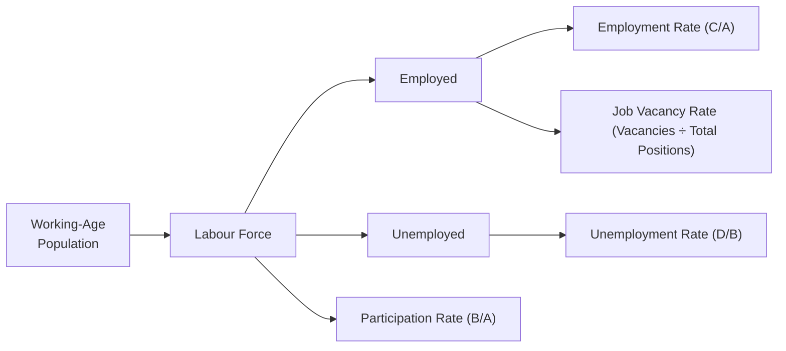

## 3.4 Key Labour Market Indicators

Understanding the labour market is a big deal for anyone engaged in the Canadian securities industry—whether you’re a new Registered Representative or a seasoned professional managing client portfolios. After all, the labour market underpins consumer confidence, spending power, and overall economic health. And let’s be honest: if folks don’t have jobs or they’re not out there actively seeking them, it can change the entire mood of the market. Sounds dramatic, right? But trust me, it’s real.

In this section, we’ll walk through key indicators like the unemployment rate, the participation rate, the employment rate, and the job vacancy rate. We’ll see how these stats fit together in Canada’s dynamic economic landscape. I’ll also weave in some personal insights, short anecdotes, and a couple of (really cool) diagrams to make things a bit more tangible.

Anyway, let’s roll up our sleeves and dive in.

--------------------------------------------------------------------------------

### Why Labour Market Indicators Matter

When you analyze the labour market, you’re essentially peering into a country’s overall productive capacity. A robust labour market usually signals economic growth—people are employed, they have disposable income, and they’re likely to invest in homes and other assets. Conversely, high unemployment can spell trouble. There’s less consumer spending, which can hurt corporate earnings, which in turn can drag down stock prices. On the regulatory side, if unemployment rises sharply, you might see changes in government policy or central bank interventions to stimulate economic activity.

From the vantage point of a Registered Representative (RR) or other industry professional operating under the Canadian Investment Regulatory Organization (CIRO), staying on top of labour market conditions is crucial. For example, if you sense rising unemployment, you might chat with your clients about the potential impacts on certain equity sectors—like discretionary retail or housing. This is not just theoretical: it can inform how you advise clients on asset allocation or risk management strategies. And as we highlight in earlier chapters (see Chapters 5 and 6 on client discovery, product due diligence, and recommendations), a deeper grasp of the macroeconomic backdrop can help you and your team navigate compliance requirements and offer better service.

Below are the key labour market indicators that help shape our understanding of Canada’s (and, by extension, North America’s) economic environment.

--------------------------------------------------------------------------------

### Unemployment Rate: Definition and Implications

The unemployment rate is the percentage of the labour force that is jobless but actively seeking employment. Let’s define some terms first:

• Labour Force: The total number of people employed plus those who are unemployed and actively seeking work.  
• Unemployment Rate: (Number of Unemployed ÷ Labour Force) × 100  

If you think about it, the unemployment rate only captures people who are actively looking for jobs. So, if interest rates rise and certain industries scale back hiring, unemployment might spike because laid-off workers are now actively searching for new roles.

Here’s a bit of a personal anecdote. I remember the 2008 financial crisis vividly. A friend of mine in Vancouver worked in construction, and when the market turned, he found himself out of work. The local unemployment rate shot up, and it took him about six months to find a stable job again. That single statistic—the unemployment rate—told a larger story of panic and uncertainty in the broader economy.

Now, from an investment standpoint, consistently high unemployment can signal a recession. Why? Because people without jobs reduce their spending. They might avoid big-ticket purchases like cars or homes, which can slow overall economic momentum. For Canada, Statistics Canada tracks monthly unemployment data in its Labour Force Survey (LFS). This real-time snapshot is like your monthly “health check” on the economy.

#### Types of Unemployment

• **Frictional Unemployment**: Short-term unemployment due to the time it takes to find a new job (e.g., a software developer resigning to look for a better position).  
• **Structural Unemployment**: Occurs when workers’ skills don’t match job requirements, or when jobs move to a different region. For instance, if manufacturing relocates from Ontario to lower-cost countries, local workers may face structural unemployment.  
• **Cyclical Unemployment**: Tied directly to the business cycle. When the economy contracts, layoffs increase; when it expands, workers get rehired.  

Understanding these distinctions helps a lot when analyzing trends. For example, cyclical unemployment might respond relatively quickly to policy changes, whereas structural unemployment demands longer-term solutions like retraining programs.

--------------------------------------------------------------------------------

### Participation Rate: Who’s in and Who’s Out?

The **participation rate** measures the share of working-age people who are either employed or actively seeking employment. Expressed as a percentage, it answers the question: “Out of everyone of working age (typically ages 15 and up in Canada), how many are either working or trying to find work?” 

A high participation rate means a larger portion of eligible workers are in the labour force. This can be both a good thing (more folks are engaged in productive economic activity) and sometimes a sign that more people are forced to look for work in a tight economy. On the flip side, a declining participation rate can be driven by retirements or discouraged workers dropping out of the job search altogether.

For finance professionals, the movement in the participation rate is a critical context setter. Even if the unemployment rate remains stable, a shrinking participation rate might mask underlying economic fragility. For example, you might have fewer people actively looking for work, artificially deflating the unemployment figure. Meanwhile, an increase in participation among retirees or youth can signal rising optimism in the job market.

--------------------------------------------------------------------------------

### Employment Rate: How Many People Are Actually Working?

The employment rate is the proportion of the working-age population that is employed. It’s calculated as:

Employment Rate = (Number of Employed People ÷ Working-Age Population) × 100

Some folks get a bit confused between the employment rate and the unemployment rate. Think of the employment rate as the share of everyone who is old enough to work (whether they want to or not) who actually has a job. It’s a direct measure of how well the economy is generating opportunities. 

High employment rates often correspond to healthy economic activity, because if more people are working, more household income is generated, which typically leads to higher consumer spending. This is especially valuable for investment professionals who keep an eye on corporate earnings: more employed people means more potential customers for goods and services, and that can translate to stronger balance sheets for companies.

--------------------------------------------------------------------------------

### Job Vacancy Rate: Open Positions vs. Filled Positions

The job vacancy rate shows the share of vacant positions compared to the total number of positions (both filled and vacant) in the labour market. In formula terms:

Job Vacancy Rate = (Number of Vacant Positions ÷ (Number of Filled Positions + Number of Vacant Positions)) × 100

This indicator can provide insight into labour shortages or skill mismatches. For example, a high vacancy rate might suggest employers are having trouble finding qualified candidates, which can push wages higher (classic supply and demand). Conversely, a low vacancy rate might mean the market is saturated with qualified candidates, or that businesses aren’t expanding due to economic uncertainty.

As a financial professional, you might interpret a spike in the job vacancy rate as a sign that certain industries—like tech—are in growth mode. If those industries can’t fill roles, you might expect wage inflation, which could affect overall company profitability. Meanwhile, a high vacancy rate in manufacturing could mean a skill gap is looming, or that demand is outpacing supply, potentially boosting certain stock performance in that sector if they manage to scale effectively.

--------------------------------------------------------------------------------

### Putting It All Together: Labour Market in Action

So how do these indicators connect in a practical sense? For clarity, let’s visualize the relationships in a simple Mermaid diagram:

• **Working-Age Population (A):** Everyone old enough to work (15+ in Canada).  
• **Labour Force (B):** Employed (C) + Unemployed (D).  
• **Unemployment Rate (F):** (Unemployed ÷ Labour Force).  
• **Participation Rate (G):** (Labour Force ÷ Working-Age Population).  
• **Employment Rate (E):** (Employed ÷ Working-Age Population).  
• **Job Vacancy Rate (H):** (Vacancies ÷ (Vacancies + Filled Positions)).  

By focusing on these variables, you can interpret what’s going on under the hood of the economy. High job vacancies and steady participation rates might imply skill gaps and wage pressures. A falling unemployment rate might look great, but if it’s paired with a dropping participation rate, that signals potential weakness—people giving up on job searches.

--------------------------------------------------------------------------------

### Labour Market Indicators and Economic Cycles

Labour market indicators aren’t static. They interact with business cycles:

• **Expansion Phase:** Employment grows, job vacancies can rise, unemployment falls.  
• **Peak Phase:** The economy is at high capacity, wages may rise faster as employers compete for talent.  
• **Contraction Phase:** Layoffs increase, unemployment rate climbs, job vacancy rate decreases, potentially fueling cyclical unemployment.  
• **Trough/Recovery Phase:** Renewed hiring, slower wage growth at first, improving job vacancy rates, more robust participation.

If you’re advising clients on investment strategies, it’s important to watch for turning points. Let’s say cyclical unemployment starts to increase: you might see central banks like the Bank of Canada stepping in with interest-rate adjustments or easing measures. Government fiscal policies—like infrastructure spending or job-training programs—might also come into play. All these policy changes can influence market sentiment.

--------------------------------------------------------------------------------

### Labour Market, Consumer Spending, and Beyond

One of the biggest reasons labour market data matters in the Canadian securities field is how it ties directly to consumer spending. If unemployment is rising, your typical consumer might rein in spending on things like retail goods or new homes. This can dampen revenue growth for publicly listed corporations. In turn, as an RR or portfolio manager, you might become cautious about certain equity sectors, or you might advise more conservative or defensive allocations until conditions improve.

Also remember that labour market data is a key input into larger macroeconomic forecasts our regulators watch. The Bank of Canada, for instance, examines job market conditions when setting monetary policy. A robust labour market, coupled with rising wages, might spark inflationary pressures and lead to a rate hike. That’s especially relevant for those in the fixed-income side of the industry, since bond prices are inversely affected by interest rate shifts. Meanwhile, a persistently high unemployment rate could prompt stimulus measures to boost employment and spur growth.

From a compliance angle (see Chapter 7 on prohibited activities and Chapter 8 on client accounts), advisors must be careful about making blanket recommendations without proper context. You need to ensure that any advice is suitable for a particular client’s risk profile and objectives. Changes in the labour market can alter a client’s personal financial situation—particularly if they or their spouse are at risk of losing a job. Consequently, an RR might have to revisit Know Your Client (KYC) information (Chapters 4 and 5) to ensure that the investment strategy remains aligned with the client’s capacity for risk.

--------------------------------------------------------------------------------

### Potential Challenges and Pitfalls

1. **Discouraged Workers:** Traditional unemployment statistics only include those actively seeking work. People who give up looking aren’t counted, which can understate economic challenges.  
2. **Hidden Underemployment:** Part-timers who can’t find full-time work are considered “employed,” which can mask deeper labour market inefficiencies.  
3. **Regional Discrepancies:** A national statistic might not capture local booms or busts. For example, certain resource-dependent provinces may see drastically different rates compared to central Canada.  
4. **Lagging Indicators:** Some labour market data lags economic changes. Firms might not cut jobs right away in a slow economy, so the unemployment rate might remain stable for a short period before climbing.  
5. **Data Revisions:** Statistics Canada and other agencies sometimes revise their figures. Relying on initial data releases can lead to misinformed decisions if you don’t track subsequent data updates.  

--------------------------------------------------------------------------------

### Strategies to Overcome Common Issues

• **Use Complementary Indicators**: Don’t just look at unemployment figures—pull data on participation rates, job vacancies, and average wages to get a fuller picture.  
• **Study Trends, Not Just Snapshots**: Track monthly changes to see if a trend is forming. One month of data doesn’t always represent a significant shift.  
• **Analyze Industry-Specific Data**: Different sectors follow different cyclical patterns. Mining in Alberta might boom while manufacturing in Ontario stalls, and vice versa.  
• **Reference Official Data**: Always rely on credible sources like Statistics Canada (https://www.statcan.gc.ca/) and the Bank of Canada (https://www.bankofcanada.ca/) for accurate, up-to-date labour market reports. The Conference Board of Canada (https://www.conferenceboard.ca/) can also provide in-depth research on workforce trends.  
• **Stay informed on Policy**: Keep an eye on federal or provincial policy changes that can directly impact the labour market—like changes in immigration laws or job training incentives.  

--------------------------------------------------------------------------------

### Canadian Regulatory Context and Labour Data

While labour market indicators aren’t typically the first thing that springs to mind when you hear about CIRO or the Canadian Investor Protection Fund (CIPF), they do influence the broader financial ecosystem that these organizations safeguard. 

• **CIRO (Canadian Investment Regulatory Organization)**: Oversees investment dealers and helps maintain market integrity. If there’s a shift in labour market conditions leading to higher personal bankruptcies or financial stress, compliance teams might see an uptick in client complaints or fraudulent schemes. Keeping an eye on employment trends can help shape effective compliance policies or strategies for investor protection.  
• **CIPF (Canadian Investor Protection Fund)**: Provides coverage for client assets if a member firm becomes insolvent. While CIPF is not directly tied to unemployment rates, an economic downturn with mass job losses can increase the risk of industry consolidation or firm closures, inadvertently raising CIPF’s role in protecting investors.  

By linking labour market indicators to these regulatory bodies, we see that everything is connected—labour data is part of the broad tapestry of economic signals that keeps our financial markets functioning smoothly.

--------------------------------------------------------------------------------

### Real-World Scenario: Labour Market Fluctuations and Portfolio Decisions

Imagine you’re advising a client with a moderate risk tolerance who is heavily weighted in consumer discretionary stocks. Suddenly, Canada’s unemployment rate jumps over 1% from one month to the next, while the job vacancy rate remains relatively flat. During your next check-in with the client, you might say something like, “Well, the latest data suggests more people are out of work, and it doesn’t look like there’s an increase in new job postings to accommodate them.” This could be a red flag for consumer spending, especially for non-essential items.

Based on that insight, you might discuss rebalancing the portfolio toward more defensive sectors (like consumer staples or utilities) or consider alternative assets with lower correlation to the economic cycle.  

--------------------------------------------------------------------------------

### Glossary of Labour Market Terms

• **Labour Force:** The total number of people employed plus those seeking employment.  
• **Unemployment Rate:** The proportion of the labour force that is jobless but actively looking for work.  
• **Participation Rate:** The share of the working-age population that is part of the labour force.  
• **Discouraged Workers:** Individuals who have stopped looking for work after failing to find a job repeatedly.  
• **Frictional Unemployment:** Short-term unemployment arising from job-search processes.  
• **Structural Unemployment:** Unemployment caused by mismatches in skills or geographic factors.  
• **Cyclical Unemployment:** Unemployment caused by swings in the business cycle.  
• **Labour Productivity:** The amount of goods or services produced per unit of labour input.  

All these definitions might come in handy when reading official labour market reports or discussing macro trends with clients.

--------------------------------------------------------------------------------

### Best Practices and Encouragement

1. **Stay Curious**: Labour market data can feel a little dry, but it’s one of the most telling economic indicators out there—cling to your curiosity, and you’ll discover fascinating trends.  
2. **Use Technology**: Tools like Statistics Canada’s real-time data dashboards or even basic spreadsheet software can help you parse big data sets.  
3. **Educate Clients**: A quick explanation of the unemployment rate versus the participation rate can help clients feel more confident in the advice you give them, boosting trust and loyalty.  
4. **Continuous Learning**: As we discussed in Chapter 2 (Ethical Decision Making), part of ethical conduct is staying informed. Understanding shifts in the labour market is essential for providing responsible and timely advice.

--------------------------------------------------------------------------------

### Additional Resources

• **Statistics Canada Labour Force Survey**: https://www.statcan.gc.ca  
• **Bank of Canada**: https://www.bankofcanada.ca (economic projections often include labour market analysis)  
• **The Conference Board of Canada**: https://www.conferenceboard.ca (for research on workforce trends and productivity)  
• **CIRO**: https://www.ciro.ca (for the latest regulatory updates)  
• **BoC Monetary Policy Reports**: Explores monetary policy decisions that often reference employment metrics.

Putting these resources into action can shed light on how labour market shifts might impact investments, compliance obligations, or even the strategic operations of financial institutions themselves.

--------------------------------------------------------------------------------

## Test Your Knowledge: Key Labour Market Indicators in Canada



### Which term best describes the total number of people employed plus those seeking employment?
- [ ] Working-age population
- [x] Labour force 
- [ ] Unemployment rate
- [ ] Participation rate

> **Explanation:** The labour force consists of employed individuals plus those who are actively seeking employment.

### In Canada, which organization is primarily responsible for publishing the monthly Labour Force Survey?
- [ ] CIRO
- [ ] Bank of Canada
- [x] Statistics Canada
- [ ] CIPF

> **Explanation:** Statistics Canada compiles and releases the Labour Force Survey, which tracks key employment metrics like unemployment and job vacancy rates.

### A person who quits their job to look for a better position is most likely experiencing what type of unemployment?
- [ ] Structural
- [x] Frictional
- [ ] Cyclical
- [ ] Long-term

> **Explanation:** Frictional unemployment arises from normal job-search processes, including those who voluntarily leave a job to find a better fit.

### If the unemployment rate falls but the participation rate also declines, what might be happening?
- [x] More discouraged workers are dropping out of the labour force.
- [ ] There is strong economic growth.
- [ ] Wages are rising rapidly.
- [ ] Job vacancy rates are skyrocketing.

> **Explanation:** A falling participation rate can make the unemployment rate look lower than it would be if more people were actively searching for work.

### Which of the following statements about the job vacancy rate is correct? 
- [x] It compares vacant positions to total positions (filled + vacant).
- [ ] It indicates the proportion of the labour force currently unemployed.
- [x] A high job vacancy rate may imply skill shortages.
- [ ] It calculates the ratio of working-age individuals to total employment.

> **Explanation:** The job vacancy rate is the number of vacant positions divided by total positions; when this rate is high, it often points to skill gaps or insufficient labor supply.

### A key difference between the employment rate and the unemployment rate is:
- [x] The employment rate measures employed people as a percentage of the working-age population.
- [ ] The employment rate measures those not seeking work.
- [ ] The unemployment rate includes only part-time workers.
- [ ] They both exclude anyone over age 65.

> **Explanation:** The employment rate is (Employed ÷ Working-Age Population) × 100, whereas the unemployment rate is (Unemployed ÷ Labour Force) × 100.

### Which best reflects "structural" unemployment?
- [x] Workers in a region lack the skills needed for new tech-based jobs.
- [ ] Seasonal layoffs, like those after holiday sales.
- [x] Economic recessions causing widespread layoffs.
- [ ] Workers transitioning between jobs.

> **Explanation:** Structural unemployment occurs when there’s a mismatch between workers’ skills and the jobs available, or geographic factors make certain positions inaccessible.

### Why might a high job vacancy rate push wages upward? 
- [x] Employers compete by offering higher wages in a market with fewer qualified candidates.
- [ ] It usually indicates an economic contraction.
- [ ] Because the government mandates wage increases in times of high vacancies.
- [ ] It doesn’t affect wages at all.

> **Explanation:** A high vacancy rate often indicates demand for labor outstrips supply, prompting employers to offer more competitive wages.

### Which organization replaced the MFDA and IIROC as the Canadian national self-regulatory body in 2023?
- [x] CIRO
- [ ] CIPF 
- [ ] CSA
- [ ] GIC

> **Explanation:** CIRO (Canadian Investment Regulatory Organization) is the new self-regulatory entity formed by amalgamating the MFDA and IIROC.

### True or False: A growing number of discouraged workers will generally reduce the official unemployment rate.
- [x] True
- [ ] False

> **Explanation:** Discouraged workers are not included in the unemployment rate because they are no longer actively seeking work, thus artificially lowering the measured rate.


