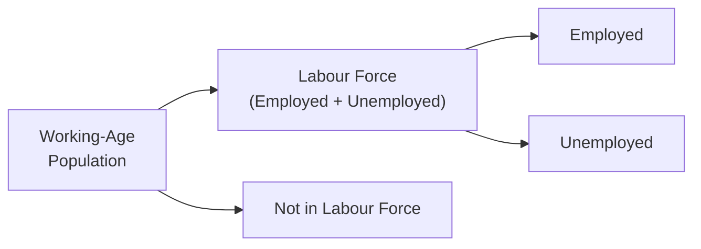

## 3.4 What are the Key Labour Market Indicators?

Sometimes, it’s easy to forget how deeply the world of finance—especially the investment world—relies on the humble concept of “jobs.” But let’s be honest: whether we’re talking about mortgage payments, consumer confidence, or your neighbourhood coffee shop’s bustling morning rush, employment is what drives day-to-day economic activity. In this section, we’ll explore the most common labour market indicators. We’ll see how these metrics can signal shifts or cycles in economic growth and what mutual fund representatives should look out for as they advise clients.

Unlike some technical economic terms, labour market indicators have a shocking level of influence on everyday life: when unemployment ticks up, consumer spending often dips, central bankers might adjust interest rates, and companies could scale back expansion. On the other hand, if more people are employed and wages are rising, consumers might splurge on cars, homes, or that once-a-year dream vacation. In turn, mutual fund flows may move into or out of different asset classes based on how investors feel about the economy. So let’s dig in.

---

### Why Labour Market Indicators Matter

If my own personal experiences as a mutual fund representative have taught me anything, it’s that labour market data is closely watched by everyone—from policymakers at the Bank of Canada to small business owners who rely on local foot traffic. These figures directly influence:

• Monetary Policy Decisions: A healthy labour market can push central banks to raise interest rates, fearing inflation. Conversely, high unemployment can prompt rate cuts to stimulate the economy.  
• Consumer Spending: People with steady jobs (and hopefully reasonable wages) tend to spend more on goods and services.  
• Corporate Earnings: Businesses thrive in strong labour markets when sales volumes usually go up.  
• Investment Flows: Labour trends can influence whether investors bound into equities with optimism or retreat to fixed-income products for safety.  

Labour market indicators essentially measure how efficiently a country’s workforce is being used and how that affects the broader economy. These indicators help us gauge consumer confidence, interpret wage growth, and understand potential changes in inflationary pressures.

---

### Core Terminologies: Employment, Unemployment, and Participation

Before getting technical, let’s set the stage with some key terms that often pop up in labour market discussions.  

• Employment Rate: The proportion of the working-age population that currently holds a job.  
• Unemployment Rate: The percentage of the labour force (those working or looking for work) that is jobless but actively seeking employment.  
• Labour Force Participation Rate: The share of the working-age population that is either employed or actively seeking work.  
• Job Vacancy / Unfilled Positions: Measures the demand for labour—the higher this figure, the more employers are looking for new employees.  
• Underemployment: Refers to workers who are working fewer hours than they’d prefer, or employed in positions below their skill level or education.  

Let’s visualize these relationships with a simple diagram. This helps clarify how each group is organized:

From a policy perspective, these definitions matter because governments and central banks monitor these buckets to gauge the health of the economy. From an investment perspective, the relative sizes of these segments can signal potential changes in consumer spending, production, wages, and corporate profits.

---

### Employment Rate

The employment rate measures the ratio of employed individuals to the total population of working age. If we let:

• E = Number of employed people  
• P = Working-age population  

then:

$$
\text{Employment Rate} = \frac{E}{P} \times 100\%
$$

This indicator tells us the proportion of potential workers who actually hold jobs. When the employment rate goes up, it usually implies that companies are hiring, production capacity may be rising, and consumers might feel more financially secure. During periods of high employment, you might observe:

• Higher consumer confidence and spending levels.  
• Potential wage growth pressure as employers compete for workers.  
• A possibility that the central bank (like the Bank of Canada) could intervene to stabilize inflation if it becomes too strong.

#### Practical Example

Imagine you’re advising a client who loves to invest in consumer discretionary funds—think leisure, travel, and entertainment stocks. A rising employment rate in Canada often suggests more people have paycheques to spend on non-essential goods. This might show a potential upswing for stocks in travel companies or restaurant chains. In short, a rising employment rate can be a signal that the “fun stuff” in people’s budgets won’t get cut so quickly.

---

### Unemployment Rate

No labour market indicator is more widely cited in the evening news than the unemployment rate—that percentage of the labour force that is jobless yet actively searching for work. Typically, it’s computed as:

$$
\text{Unemployment Rate} = \frac{\text{Number of Unemployed}}{\text{Labour Force}} \times 100\%
$$

If you ever hear a headline like “Unemployment has ticked up to 6.2% from 5.9%,” that might sound like a small difference. But such a jump could be huge for the economy—particularly if it suggests an ongoing trend.

#### Interpretations and Implications

• Rising Unemployment Rate: Can indicate a cooling economy. Consumers with less disposable income might cut back on spending, which in turn can reduce business profits. Central banks might respond with interest rate cuts or other stimulus measures.  
• Falling Unemployment Rate: Often points to economic growth. More jobs usually mean increased spending and potentially upward pressure on wages.

For mutual fund representatives, a growing unemployment rate over consecutive months might signal caution for clients who have high allocations to growth stocks, as consumer demand could soften. On the other hand, cyclical sectors might be hurt, but defensive sectors (like utilities or consumer staples) might hold up better.

#### Personal Anecdote

When I first started working in the investment business, I vividly recall overhearing how a small 0.3% rise in unemployment rattled equity markets. At the time, I thought, “Seriously, 0.3% is no big deal, right?” I quickly learned markets are forward-looking and often react to the direction of economic shifts rather than the absolute numbers. That minor jump signaled a potential downward trend, igniting fears that consumer spending might contract.

---

### Labour Force Participation Rate

The labour force participation rate captures people who are working or actively looking for work. It is calculated by dividing the labour force (employed plus unemployed) by the total working-age population. Symbolically:

$$
\text{Participation Rate} = \frac{\text{Labour Force}}{\text{Working-Age Population}} \times 100\%
$$

When the participation rate rises, it can mean that more individuals believe jobs are available or worthwhile to seek. This rate can sometimes be more revealing than just the unemployment rate alone. For instance, the unemployment rate can decrease simply because people become discouraged and stop looking for work, which would also lower the labour force. In that scenario, the drop in unemployment isn’t necessarily a sign of a healthier economy—people aren’t finding jobs; they’re just leaving the labour force altogether.

#### Why It Matters

• A rising participation rate may mean that the economy is perceived as offering good opportunities.  
• A declining participation rate might indicate an aging population, more people in full-time education, or discouragement among job-seekers.

From an investment perspective, a growing participation rate could mean a future expansion in household incomes and spending. This might signal optimism for sectors that rely on consumer demand—retail, technology, or even real estate, as newly employed individuals often spend more on housing needs.

---

### Job Vacancy (Unfilled Positions)

While the employment rate tells us how many are working, job vacancy data tells us how many job openings remain unfilled. It highlights the demand side of the labour market. For instance, if companies across multiple industries report thousands of unfilled positions, that could imply:

• Strong labour demand, possibly outpacing supply.  
• Higher potential for wage growth due to competition for qualified workers.  

In Canada, this data is often published by agencies such as Statistics Canada through job vacancy and wage survey reports. You might see job vacancy metrics broken down by sector—something especially useful if you’re analyzing cyclical vs. non-cyclical sectors or if you have clients heavily invested in technology or healthcare funds. A high vacancy number in tech could mean wage pressures in that domain but also strong growth potential for the sector.

---

### The Concept of Underemployment

Underemployment isn’t always showcased on the nightly news, but it’s crucial. Underemployment captures situations where people are working in roles below their skill or education level, or working part-time when they really want full-time hours. In times of economic difficulty, underemployment can rise even if official unemployment remains relatively stable.

• If many individuals hold part-time jobs while seeking full-time employment, they probably have less disposable income than they would prefer.  
• A workforce with a high rate of underemployment could signal hidden slack in the economy, potentially muting wage growth and consumer confidence.

From a mutual fund perspective, if underemployment is high, the market could have a disguised softness. In other words, while official unemployment numbers seem all right, actual spending power might not be as strong as it appears. This can be especially relevant when analyzing consumer discretionary sectors, or if you’re considering the timing of certain cyclical sector investments.

---

### Labour Market Indicators and Monetary Policy

You probably know how crucial interest rates are. Well, guess what? Central banks, particularly the Bank of Canada, watch these labour market indicators like hawks. Why?

1. **Inflation Control**: If employment is running hot and wages are soaring, inflation concerns might push the Bank of Canada to raise rates.  
2. **Stimulating Growth**: If unemployment is persistent and the economy isn’t generating enough jobs, the Bank might cut rates to encourage borrowing and spending.  
3. **Policy Signaling**: Announcements related to the overnight rate or bond-buying programs can be triggered by labour market changes.  

#### Impact on Mutual Fund Investors

• Fixed-Income Investments: Rising interest rates can depress bond prices, but can also signal a robust economy that eventually benefits equities.  
• Equity Investments: A stronger labour market might boost corporate earnings in sectors reliant on consumer demand, but if rates rise too fast, it can weigh on valuations (especially growth stocks).  
• Sector Rotation: Labour market shifts can hint at cyclical vs. defensive sector rotations.  

In short, labour market data can move markets. Even small changes in unemployment or wage growth might shift expectations about interest rates, hitting bond yields and equity prices simultaneously.

---

### Putting the Indicators Together

It’s rarely wise to look at one labour market indicator in isolation. Instead, consider how they paint a collective picture:

• **High Employment + High Participation**: The economy is likely in expansion mode.  
• **Increasing Job Vacancies + Falling Unemployment**: Labour might be scarce, pushing wages upward.  
• **Falling Participation + Mild Decline in Unemployment**: Could signal discouragement or an aging workforce rather than a boost in job creation.  

Here’s a quick reference table summarizing how each major indicator is calculated and what it signifies:

| Indicator                         | Formula /
 Calculation                                          | What It Reveals                                              |
|-----------------------------------|--------------------------------------------------------------|----------------------------------------------------------------|
| Employment Rate                   | (Employed ÷ Working-Age Population) × 100%                   | How many working-age individuals actually hold jobs            |
| Unemployment Rate                 | (Unemployed ÷ Labour Force) × 100%                           | The share of people in the labour force who are jobless        |
| Labour Force Participation Rate   | (Labour Force ÷ Working-Age Population) × 100%               | Proportion of working-age individuals working or seeking work  |
| Job Vacancy / Unfilled Positions  | N/A (Reported as open/unfilled positions)                    | The demand for labour; how many unfilled jobs exist            |
| Underemployment                   | N/A (Measured in specialized surveys)                        | Potential slack beyond what unemployment data shows            |

---

### Real-World Scenario: Canadian Labour Market Shifts and Mutual Fund Strategy

Let’s say we’re in a situation where Statistics Canada announces higher-than-expected employment growth for three consecutive months, accompanied by a drop in the unemployment rate from 6.0% to 5.5%. Meanwhile, job vacancies remain elevated. The Bank of Canada issues a statement hinting that if labour markets remain tight, interest rates might need to rise to keep inflation in check.  

As a mutual fund representative, how might you respond?

• **Short-Term Bonds**: Rising interest rates typically drive bond prices down; short-term bonds may offer less duration risk.  
• **Equity Funds in Cyclical Sectors**: If jobs are strong, consumer confidence may rise—good news for discretionary, retail, and travel sectors.  
• **Defensive Allocation**: However, if rate hikes become aggressive, growth stocks might falter. Being balanced with defensive sectors or lower-volatility ETFs could mitigate risk.  

In practice, of course, the best approach is to consider each client’s individual risk tolerance, time horizon, and objectives (as you’ll recall from Chapter 4 on getting to know the client).  

---

### Common Pitfalls and Strategies

1. **Overemphasizing One Indicator**  
   Many new market watchers focus solely on unemployment rates. But ignoring the participation rate or underemployment might lead to a distorted view.

2. **Misinterpreting Short-Term Volatility**  
   Labour market data can fluctuate month-to-month. Looking at longer trends (3-6 months or even year-over-year changes) can provide more stable insights.

3. **Ignoring Regional Differences**  
   Canada has sizable regional economic differences; the national unemployment picture might miss local trends.

4. **Reacting Emotionally**  
   It’s easy to panic or become overconfident based on headlines. A better strategy is to take a balanced, data-driven approach—something your clients will respect.

5. **Failing to Track Wage Growth**  
   Wages can impact inflation and consumer spending. Rising wages can lift consumer demand, but also pressure corporate profit margins.

---

### Additional Resources

• **Statistics Canada** publishes monthly Labour Force Survey data, job vacancy data, and wage surveys:  
  [www.statcan.gc.ca/eng/survey/household/3701](https://www.statcan.gc.ca/eng/survey/household/3701)  

• **Bank of Canada** issues Monetary Policy Reports analyzing the labour market’s impact on inflation and interest rates:  
  [www.bankofcanada.ca](https://www.bankofcanada.ca)  

• **International Labour Organization (ILO)** provides global standards, trends, and detailed technical papers on labour market dynamics:  
  [www.ilo.org](https://www.ilo.org)  

• **Canadian Investment Regulatory Organization (CIRO)** is Canada’s self-regulatory body overseeing mutual fund and investment dealers. For up-to-date regulatory information, see:  
  [www.ciro.ca](https://www.ciro.ca)  

---

### Best Practices for Mutual Fund Representatives

• **Stay Current**: Set a reminder to check monthly labour statistics. Focus on trend data, not just single-month fluctuations.  
• **Anticipate Policy Shifts**: Remember that labour market trends heavily influence the Bank of Canada’s interest rate decisions.  
• **Align with the KYC and Suitability**: If your clients depend on stable income or prefer low volatility, interpret labour data conservatively. Conversely, if they’re comfortable with risk, a robust labour market might mean more tolerance for equity exposure.  
• **Think Sector-Specific**: If you see strong job vacancy reports in technology or healthcare, it might indicate future growth in those sectors, driving mutual fund performance.  
• **Observe the Big Picture**: Combine labour data with other economic indicators (e.g., GDP growth, inflation figures) to formulate a comprehensive market perspective.

---

### Final Thoughts

Labour market indicators aren’t just for economists or policy wonks—they’re vital tools for anyone involved in financial markets, especially mutual fund representatives who want to guide clients more effectively. High employment rates generally signal the potential for increased consumer spending (and possibly higher corporate earnings), whereas rising unemployment often leads to lower consumer demand. Interestingly, changes in the labour force participation rate or job vacancy trends can provide a more nuanced story, revealing mismatches between supply and demand or indicating an economy in transition.

So whether you learn of a slight uptick in the unemployment rate or see a big spike in job vacancies, remember that these numbers can reflect major shifts in how people earn, spend, and invest. By staying informed and understanding each indicator’s place in the economic puzzle, you’ll be equipped to help clients navigate the constantly evolving financial landscape.

---

## Test Your Knowledge: Key Labour Market Indicators Quiz



### Which indicator measures the proportion of working-age individuals who are currently employed?
- [ ] Unemployment Rate
- [x] Employment Rate
- [ ] Labour Force Participation Rate
- [ ] Job Vacancy Rate

> **Explanation:** The employment rate is the ratio of employed individuals to the total population of working age, giving us the share of that population currently holding jobs.

### A rise in the unemployment rate accompanied by a slight decrease in the labour force participation rate could indicate:
- [x] Workers leaving the labour force due to discouragement
- [ ] An overall increase in consumption patterns
- [x] Some workers cannot find suitable jobs and have stopped looking
- [ ] A guaranteed upcoming rate hike by the Bank of Canada

> **Explanation:** A rise in unemployment with a decline in participation often points to discouraged workers who stop looking for work, so they are no longer counted as unemployed.

### Job vacancy data is especially useful for understanding:
- [ ] Only wage growth patterns
- [x] Employer demand for workers
- [ ] Government budget deficits
- [ ] Household debt levels

> **Explanation:** Job vacancy measures unfilled positions, which reveals how much demand there is for labour in the market.

### A falling unemployment rate, but also a falling labour force participation rate, can sometimes be:
- [x] Misleading, because people may have stopped job searching
- [ ] A robust sign of economic expansion
- [ ] Clearly indicative of higher consumer spending
- [ ] Irrelevant to labour market analysis

> **Explanation:** If the unemployment rate drops, but fewer people are participating in the labour force, the drop may be due to discouraged workers exiting the labour pool.

### Which of the following might you recommend to a client if labour data shows a tightening job market and potential interest rate hikes?
- [x] Short-term bond funds
- [ ] Long-term bond funds
- [x] Balanced equity and defensive funds
- [ ] Only high-risk speculative stocks

> **Explanation:** In a tightening job market, rising interest rates can lower bond prices, so shorter-duration bonds and balanced approaches with some defensive equity exposure can be prudent.

### One possible outcome of sustained increases in job vacancies is:
- [x] Employers may raise wages to attract talent
- [ ] Immediate removal of all hiring requirements
- [ ] A downward shift in inflation expectations
- [ ] Less flexibility for workers seeking new roles

> **Explanation:** When the number of vacancies is consistently high, competition for workers intensifies, often leading to upward pressure on wages.

### A high level of underemployment suggests:
- [x] Workers might be in part-time roles but desiring full-time work
- [ ] Full alignment of job skills and roles
- [x] Disguised slack in the labour market
- [ ] Zero impact on consumer spending

> **Explanation:** Underemployment indicates that workers are not fully utilized, which can mask deeper issues in the labour force, leading to potentially weaker consumer spending than the official employment rate might suggest.

### Why might a central bank like the Bank of Canada raise interest rates in response to strong employment data?
- [x] To prevent the economy from overheating and to contain inflation
- [ ] To curb the purchasing power of unemployed individuals
- [ ] To boost the labour force participation rate
- [ ] To automatically lower wages

> **Explanation:** Central banks often raise rates if the economy is running hot and wages/inflation are climbing, in order to moderate growth and inflationary pressures.

### What is a key advantage of looking at trends in job vacancy and unfilled positions data?
- [x] It provides insights into the demand side of the labour market
- [ ] It directly measures global supply chain issues
- [ ] It reflects changes in corporate tax policy
- [ ] It has no predictive power in investment decision-making

> **Explanation:** Job vacancy numbers indicate how many positions employers are trying to fill, shedding light on which sectors are growing and where labour shortages may exist.

### Is underemployment included in the official unemployment rate?
- [x] True
- [ ] False

> **Explanation:** Underemployment is not typically reflected in the official unemployment rate, but it’s still a critical measure for understanding broader labour market health.


