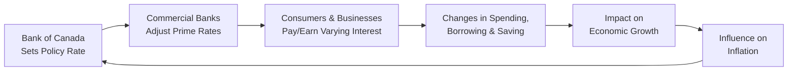

## 3.5 What Role do Interest Rates Play?

Interest rates. They might sound a little dry at first—and maybe a bit intimidating if you’re just learning how the financial world works—but trust me, I'm excited to share how these figures truly influence so many aspects of our lives, from what we pay on mortgages to how stocks and bonds move in the markets. I remember the first time I applied for a loan in college, thinking: “So why do I have to pay x% more on top of the amount I borrowed? Is it just extra money for the bank?” It wasn't until I took a deeper dive into economics that I realized interest rates are basically a price. More specifically, they're the price of borrowing money if you’re a borrower, or the price you receive if you’re a lender or saver. 

Below, we’ll walk through how interest rates are set in Canada (primarily by the Bank of Canada), how they influence inflation, borrowing patterns, investment, and, of course, mutual fund portfolios. We’ll also cover some best practices for staying on top of interest rate shifts as a mutual fund sales representative and ways to help your clients navigate the complexities of rates. And don’t worry if this topic feels a bit heavy—together, we’ll break it down step by step in an easy-to-follow manner.

---

### The Basics: Defining Interest Rates

In the simplest terms, an interest rate is the cost (or price) applied to a sum of money that is borrowed or saved. If you’re borrowing money (like getting a mortgage or a car loan), you pay interest to the lender. If you’re saving money (like putting funds into a savings account), you earn interest. These rates effectively compensate the lender (or saver) for the opportunity cost of parting with their cash and taking on risk—like the risk that the borrower won’t pay it back in full.

In Canada, the central bank (called the Bank of Canada) is the key institution that influences the level of interest rates throughout the economy. If the Bank of Canada decides to push interest rates up, it becomes more expensive for individuals and businesses to borrow. Conversely, if rates are lowered, borrowing gets cheaper. 

---

### The Role of the Bank of Canada (and a Few Personal Observations)

The Bank of Canada sets a benchmark rate known as the “policy interest rate.” This is the interest rate at which major financial institutions borrow and lend money to each other for very short periods (often overnight). The Bank of Canada adjusts this policy rate, usually in increments of 0.25%, to keep inflation near a target range of around 2%. 

Years ago, I remember reading a Bank of Canada announcement on my phone while I was still in line at the grocery store. They said they were lowering the policy rate due to slower economic growth prospects. Suddenly, the media started talking about cheaper mortgages, and I could practically hear the realtors in my circle telling prospective buyers, “Now’s the time to lock in a rate!” That moment really showed me how quickly interest rate changes trickle into the broader psyche of consumers and businesses.

For updated information on the policy rate, you can check the Bank of Canada’s website:  
• [Bank of Canada Key Interest Rate](https://www.bankofcanada.ca/core-functions/monetary-policy/key-interest-rate/)

This direct setting of the policy rate influences the “prime rate,” which is what commercial banks charge their most creditworthy customers. When the central bank changes its policy rate, commercial banks quickly follow by changing their prime rates. 

---

### Why Do We Even Care About Policy Rates?

Well, interest rates aren’t just some abstract financial figure. They affect almost every component of the economy:

• Consumer Spending: When interest rates are high, credit card balances and personal loans become more expensive to carry. People tend to spend less, which slows economic growth. Conversely, lower interest rates often entice people to spend more now rather than later.

• Corporate Borrowing: Businesses that want to expand—maybe open a new location or invest in new machinery—often need loans. If the interest expense becomes higher, expansion plans can stall. Conversely, lower rates can boost corporate borrowing, fueling expansion and sometimes even stock price growth.

• Housing Market: Mortgage interest rates heavily influence how “affordable” housing is. When mortgage rates drop, monthly payments go down, so more people can qualify for larger mortgages, which can boost house prices.

• Exchange Rates: If interest rates are high in Canada compared to other countries, global investors may flock to Canadian bonds for higher returns. This demand often boosts the Canadian dollar’s exchange rate. If rates fall, the reverse can happen, and the Canadian dollar may weaken against other currencies.

From an economist’s standpoint, interest rates are one of the biggest levers a central bank can use to regulate the pace of growth and inflation. Inflation targeting—trying to keep inflation around 2%—means the Bank of Canada adjusts interest rates to push inflation to that sweet spot. If inflation rises above the target, the Bank hikes rates to curb spending. If inflation is too low, the Bank lowers rates to encourage growth.

---

### Low vs. High Interest Rates: Two Different Worlds

We often hear sweeping statements like “interest rates are at historical lows” or “the central bank is keeping rates high.” It’s important to understand how each scenario plays out in a real economy:

Low Interest Rates:  
• Stimulate borrowing, as businesses and consumers find loans cheaper.  
• Promote consumer consumption. For example, lower mortgage rates in Canada, historically around 2–3% for fixed-rate mortgages in some years, made housing more accessible (though ironically this often drives house prices up).  
• May lead to inflationary pressures if the economy overheats (demand grows faster than supply).  

High Interest Rates:  
• Discourage borrowing, making it more expensive for companies to raise capital and for households to take out loans.  
• Slow down consumer spending. People might keep their money in error-proof savings or buy Guaranteed Investment Certificates (GICs) to earn higher interest.  
• Can cool an overheated economy and control rising inflation.  

Finding that balance is an ongoing dance for the Bank of Canada. And as a mutual fund sales rep or someone soon to be licensed, it’s worth watching those announcements closely. When you see a sudden change in direction—say, a pivot from low rates to higher rates—it’s often a signal about economic momentum or mounting inflationary concerns.

---

### Interest Rates and Bond Prices: That Famous Inverse Relationship

Bond prices and interest rates have a teeter-totter relationship—when one goes up, the other tends to go down. Why? Think of it this way: if you hold a bond that pays a fixed coupon of 3% per year, and suddenly the rates in the market rise such that new bonds now pay 4%, then your 3% bond isn’t quite as attractive. To compensate, the price of your 3% bond will likely drop in secondary markets so that the yield effectively matches new bonds. 

For mutual fund investors, understanding the interest rate/bond price connection is crucial. If interest rates head north, bond-heavy funds could see their net asset values (NAV) dip. Historically, longer-term bonds are more sensitive (in terms of price) to interest rate changes because investors are locked into a certain coupon for a longer time. This is commonly measured through a bond’s “duration,” which helps approximate how much a bond’s price might move in response to changes in rates.

A classic formula for bond pricing is:

$$
\text{Bond Price} = \sum_{t=1}^{T} \frac{C_t}{(1 + i)^t} + \frac{F}{(1 + i)^T}
$$

Here:  
• \\( C_t \\) represents coupon payments at different time periods.  
• \\( i \\) is the market interest rate (or yield).  
• \\( F \\) is the face value (principal) paid at maturity.  
• \\( T \\) is the total number of periods to maturity.  

If \\( i \\) increases, the denominator in each term gets bigger, lowering the bond’s price. That’s the inverse relationship in a nutshell.

---

### The Yield Curve as a Financial Crystal Ball

An important tool that often appears in market commentary is the yield curve. It plots yields (interest rates) on government bonds of the same credit quality but different maturities—such as 3-month, 2-year, 5-year, and 10-year government securities. 

• Normal (Upward-Sloping) Yield Curve: Long-term rates are higher than short-term rates, suggesting investors want more return for taking on longer time horizons. This is typically seen when the economy is in a normal growth phase.  
• Inverted Yield Curve: Short-term rates are higher than long-term rates. Historically, this has been a predictor of economic downturns or recessions, because it means the market expects lower growth (and likely lower rates) in the future.  
• Flat Yield Curve: Short- and long-term rates are similar. This often indicates economic uncertainty.  

Tracking the yield curve can give you insights into the general economic outlook. If you see a dramatic shift in yield-curve shape, it might be time to have a conversation with clients about adjusting portfolios. 

---

### Practical Impact on Mutual Funds

Mutual funds often hold a variety of assets—stocks, bonds, or a mix. So shifts in interest rates can trigger the following:

• Equity Prices: When rates go up, companies that relied on cheap debt might see profit margins shrink. Investors might become more selective about growth-oriented stocks, especially if those growth projections relied heavily on favorable borrowing terms.  
• Bond Funds: As already noted, bond funds typically face price drops if rates rise. Funds with longer maturities/durations feel this effect more strongly, while short-term bond funds can be more resilient.  
• Money Market Funds: These funds invest in short-term debt and thus can quickly adapt to changing rates, often adjusting their yields to reflect new interest rate environments.  

When you’re selecting or recommending a fund, consider the sensitivity to interest rates, also known as “interest rate risk.” The fund’s manager typically outlines these details in the risk disclosure sections.

---

### Tracking Interest Rates and Economic Data

Keeping up with interest rates can feel like a never-ending chore, but it’s pretty darn important if you want to give good advice or stay ahead of big market swings. Some top sources:

• [Bank of Canada](https://www.bankofcanada.ca): Provides the official policy rate and frequent news about upcoming announcements and rationale. Also publishes the “Financial System Review” that covers interest rate impacts on financial stability.  
• [CIRO](https://www.ciro.ca): The Canadian Investment Regulatory Organization, which has replaced the earlier MFDA and IIROC since 2023. Check to see if there are any new guidance documents or educational resources around interest rate changes and best practices in investor communication.  
• News wires and data terminals (e.g., Reuters, Bloomberg): Provide live updates on interest rate futures and projections.  

---

### Best Practices for Dealing with Changing Interest Rates as a Mutual Fund Representative

Keep Communication Channels Open  
When you sense interest rates might shift, it’s good practice to give your clients a quick heads-up. They’ll appreciate knowing why their bond fund might decrease in value or why their floating-rate investments might perform better. Keeping clients informed reinforces trust and helps them understand the big picture.

Diversify Portfolios  
One moment rates might be historically low, a few months later, things can change. By ensuring your clients' portfolios contain a balanced mix of instruments—like equity funds, fixed-income funds (with varying maturities), cash or cash equivalents, and perhaps alternative strategies—you can help cushion the impact of rate swings.

Focus on Long-Term Goals  
It’s easy to get caught up in the headlines. “The Bank of Canada just hiked rates again!” But remember, investing is a long-term endeavor. While interest rate changes can cause short-term volatility, especially in bonds, many mutual fund investments remain aligned with an investor’s life goals—like retirement or long-term wealth accumulation.

Stress Test for Rising and Falling Rates  
Encourage your clients to understand what might happen if rates climb by another 1% (or drop by 1%). This is often done through scenario planning, which many financial planning tools support. You can show them, for example, how a hypothetical interest rate jump would impact their bond holdings, mortgage burden, or monthly cash flow.

---

### A Quick Mermaid Diagram of the Interest Rate Influence Chain

Here’s a visual representation of how changes in the Bank of Canada’s policy rate ripple through the financial system and into the broader economy:

Notice the feedback loop at the end: inflation influences the central bank’s decision, potentially causing the cycle to repeat with a new policy rate adjustment.

---

### Pitfalls and Challenges

Timing the Market  
Some investors might think, “Oh, I’ll wait for interest rates to peak (or bottom out) before I invest.” But no one can perfectly predict when that will happen. Trying to time the market often leads to missed opportunities or unnecessary risks.

Ignoring the Yield Curve  
Sometimes people focus only on short-term rates and ignore signals from the yield curve. If the yield curve is flashing a potential recession sign (an inverted curve) or rapid growth sign (steep upward slope), that might significantly influence long-term positioning in mutual funds, especially fixed-income products.

Overextending Credit in a Low-Rate Environment  
Clients might borrow aggressively when rates are very low, only to find themselves in financial stress if rates rise unexpectedly. As a mutual fund representative, it can help to gently remind them to consider potential rate hikes when taking on new debt (like margin loans or lines of credit) to invest in mutual funds.

---

### Ethical Considerations

Your primary goal is to act in the client’s best interests. If you see that a client’s investment goals, time horizon, or risk tolerance won’t jive with a product that’s heavily exposed to interest rate risk, you should advise them accordingly—even if a trend suggests that product might do well in the short term. Maintaining this standard is part of adhering to the overarching ethical guidelines under CIRO’s regulatory framework.

---

### Further Resources

• [Bank of Canada Monetary Policy](https://www.bankofcanada.ca/core-functions/monetary-policy/)  
• “Monetary Theory and Policy,” Carl E. Walsh  
• [CIRO](https://www.ciro.ca) for updates on regulatory requirements  
• Bank of Canada’s “Financial System Review,” which discusses economic vulnerabilities and how interest rates can mitigate or exacerbate these risks  

---

### Final Thoughts

So, you might be thinking, “Okay, so interest rates can be low, they can be high, and that basically changes the world.” In a sense, yes! Interest rates are that powerful. They tilt the balance between saving and spending, between risk-taking and caution. They shape corporate growth strategies, homeownership trends, and even the strength of the Canadian dollar. 

As a mutual fund sales representative, you’ll want to keep an eye on interest rate trends—not to try timing them but to understand how these shifts might affect different components of a client’s portfolio. You’ll also want to communicate clearly with clients about the reasons behind market fluctuations, especially if bond-heavy funds decline in a rising rate environment. Remember, a well-informed client is more likely to remain committed to their long-term plan without panic selling when faced with short-term volatility.

Stay open to learning more. Keep reading those Bank of Canada announcements. Dive into the yield curve if it intrigues you (and it should!). And remain curious about how interest rates fit into the broader economic landscape. Because, let’s face it, the more you appreciate these rhythms, the better you’ll guide your clients through Canada’s dynamic financial marketplace.

---

## Quiz: How Interest Rates Shape the Canadian Financial Landscape



### When the Bank of Canada lowers its policy interest rate, which of the following effects is most likely?

- [x] It typically encourages more borrowing by consumers and businesses.  
- [ ] It usually makes saving more attractive than borrowing.  
- [ ] It has no effect on the cost of loans or credit.  
- [ ] It permanently fixes the prime rate for the next five years.

> **Explanation:** Lowering the policy rate lowers borrowing costs throughout the economy, encouraging consumers and businesses to take on loans for spending, expansion, or investment.

---

### Which term describes how the Bank of Canada tries to keep inflation near 2%?

- [x] Inflation Targeting  
- [ ] Yield Curve Analysis  
- [ ] Prime Rate Strategy  
- [ ] Currency Pegging

> **Explanation:** The Bank of Canada uses inflation targeting to maintain price stability. This approach allows them to adjust the policy rate to keep inflation around a specific target range.

---

### What is the primary reason bond prices tend to decrease when interest rates rise?

- [x] Older bonds paying lower coupons become less attractive, causing their price to drop to adjust yields.  
- [ ] The government automatically recalls outstanding bonds when rates go up.  
- [ ] Investors ignore yield on older bonds.  
- [ ] The coupon rate on existing bonds instantly increases, causing confusion among investors.

> **Explanation:** When new bonds offer higher rates, existing bonds paying lower coupons must sell at a discount to provide a similar yield for buyers.

---

### A “normal” or upward-sloping yield curve generally indicates:

- [x] The market expects a continuing, healthy economic expansion.  
- [ ] Short-term interest rates are higher than long-term rates.  
- [ ] An immediate onset of recession.  
- [ ] There is negligible demand for longer-term bonds.

> **Explanation:** A normal yield curve shows higher long-term rates than short-term rates, suggesting optimism about future economic conditions.

---

### Which of the following statements is correct regarding mutual funds in a rising interest rate environment?

- [x] Long-term bond funds are likely to decline more in price compared to short-term bond funds.  
- [ ] Equity funds have zero correlation with interest rates.  
- [x] Short-term bond funds are typically less sensitive to rate increases.  
- [ ] Money market funds will always lose value sharply.

> **Explanation:** Bond funds with longer maturities generally suffer larger losses when rates rise. Meanwhile, short-term bond funds are less affected, and money market funds can quickly adjust their yields.

---

### Why do central banks typically raise interest rates?

- [x] To slow inflation and moderate an overheating economy.  
- [ ] To encourage consumers to spend more and borrow more.  
- [ ] To give investors guaranteed high returns on savings.  
- [ ] To ensure the value of older bonds never changes.

> **Explanation:** Central banks hike rates primarily to cool spending and investment, which can help check inflationary pressures.

---

### Which factor explains why the Canadian dollar might strengthen when interest rates in Canada rise?

- [x] Foreign investors seeking higher returns move funds into Canadian-denominated assets.  
- [ ] The Bank of Canada prints more money to match higher rates.  
- [x] Rapid capital inflows boost demand for the currency.  
- [ ] There is no correlation between interest rates and currency strength.

> **Explanation:** Higher domestic rates attract foreign capital looking for better yields, driving up demand for (and thus the value of) the Canadian dollar.

---

### In which market environment would you expect a mortgage to be the cheapest for a first-time homebuyer?

- [x] Low interest rate environment.  
- [ ] Rapidly rising interest rate environment.  
- [ ] High interest rate environment with strict lending.  
- [ ] Inverted yield curve with high inflation.

> **Explanation:** A low interest rate environment reduces the cost of borrowing, making monthly mortgage payments more affordable.

---

### What is one potential pitfall of “timing the market” based on interest rate forecasts?

- [x] You might miss out on gains if the forecast is incorrect or if rates don’t move as expected.  
- [ ] You are guaranteed higher returns by waiting for rates to peak.  
- [ ] The government restricts market access during rate announcements.  
- [ ] It eliminates all risk from your investment decisions.

> **Explanation:** Predicting interest rate moves precisely is very difficult, and trying to time it can lead to missed opportunities or excessive risk-taking.

---

### A central bank’s decision to raise interest rates is most closely related to which statement?

- [x] True  
- [ ] False  

> **Explanation:** While the question text here is cut short, it implies that raising rates is connected to reducing inflation, which in context is a true statement. Central banks raise rates primarily to curb inflation and cool excessive economic activity.




