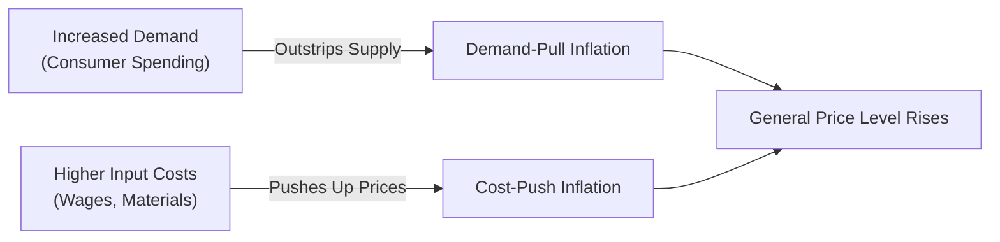
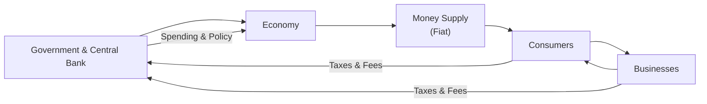

## 3.6 What is the Nature of Money and Inflation?

Money is often described as the lifeblood of a modern economy, and inflation is the subtle force that can erode its purchasing power over time. But how exactly do money and inflation shape the economic environment in which we all live and invest? In earlier sections of this chapter, we looked at broader economic concepts such as business cycles, interest rates, and spending. Now, let’s dig into the nitty-gritty of where it all begins—money. We’ll also examine how inflation transforms the value of that money over time, especially within the Canadian context.

Whether you're a complete newbie to the finance world or you’ve been investing for decades, it helps to understand the very nature of what we carry in our wallets, store in our bank accounts, and invest in capital markets. I clearly remember when I switched from using mostly cash to (almost) entirely credit cards—one day, I did a mental double-take about how intangible “money” had become. Yet intangible or not, money remains the essential tool that allows us to obtain goods and services, measure wealth, and plan for the future.

This section ties in closely with:  
• 3.2 How is Economic Growth Measured?  
• 3.7 How do Fiscal and Monetary Policies and International Economics Impact the Economy?

Our goal is to show how money serves multiple roles within an economy, and how inflation can affect our daily lives (and mutual fund portfolios) in both subtle and significant ways.

---

### The Essence of Money

Sure, we use money to buy groceries or pay our bills, but what is it really? Money is, at its core, anything commonly accepted as a means for exchange or settlement of debts. Historically, people might have used shells, precious metals like gold or silver, or even livestock. In our modern world—including Canada—we typically rely on fiat money. Fiat money is declared legal tender by the government but isn’t backed by a physical commodity such as gold. Instead, it’s backed by the trust and authority of the issuing central authority, like the Bank of Canada.

From an economic perspective, money fulfills three main functions:

• Medium of Exchange  
• Unit of Account  
• Store of Value  

Here’s a quick look at these key roles.

#### Medium of Exchange

Money is a facilitator. Rather than bartering (swapping one item directly for another item), money allows you to buy and sell without needing the other person to accept your specific goods or services. For instance, imagine you’re a carpenter. You repair someone’s bedroom cabinets; they pay you with Canadian dollars. You then take that cash to the grocery store to buy bread. The cashier at the store doesn’t need or want new cabinets, but they do accept your money.

#### Unit of Account

Because we’re all used to pricing items in a consistent way, money helps us measure the value of goods and services. If you see a pair of sneakers priced at $120, you have an immediate sense of how it compares to a $300 pair, or to basically anything else, like a $30 lunch. By providing a standard unit, money effectively becomes the yardstick for measuring and comparing value.

#### Store of Value

Money can be kept (or stored) for future use. However, this function works only as long as money generally retains its worth. If inflation runs too high—or, in an extreme scenario, hyperinflation—money’s purchasing power erodes rapidly. The $20 in your wallet today might buy less next year if prices rise significantly. That’s why a key aspect of money as a store of value is how well it holds up against the relentless force of inflation.

---

### The Evolution from Commodity to Fiat

Throughout history, money has continually transformed. Barter systems dominated ancient times, but they were unwieldy—if you raise cattle and need shoes, you’d have to find a shoemaker who wants cattle in trade. Then came commodity money, typically gold or silver coins deemed valuable because the metal itself had value. Over time, governments introduced paper banknotes redeemable for gold (or silver) reserves. Eventually, we arrived at fiat money—banknotes and coins not backed by a commodity. It’s indeed a fascinating story of trust and power shifts.

Anyway, does that mean you can’t invest in gold anymore? Not at all. People still invest in gold as a hedge against inflation or as a “safe haven.” But these days, our main medium of exchange—Canadian dollars—gets its value not from gold in a vault but from the faith that Canada will remain economically prosperous, stable, and politically secure. That trust (and some robust monetary policy by the Bank of Canada) is what supports the Canadian dollar.

---

### Introducing Inflation

Inflation is the sustained increase in the general price level of goods and services in an economy. It isn’t about one or two random items becoming more expensive; it’s a broad price movement across sectors. When the general price level rises, each unit of currency (say, one Canadian dollar) purchases fewer goods and services. That decrease in purchasing power is what we mean when we say your dollars “don’t go as far” as they used to.

A minor irony about inflation is that moderate, predictable inflation is often seen as a sign of a healthy, growing economy—and the Bank of Canada actually aims to maintain inflation around 2% to achieve stable prices. However, too much inflation can destabilize financial markets, while too little may indicate a stagnating economy (or even lead to deflation).

To illustrate inflation’s effect, let’s consider a simplified formula for calculating Real Rate of Return (RRR) on an investment (like a mutual fund):


\text{Real Rate of Return} = \text{Nominal Rate of Return} - \text{Inflation Rate}


In more complex models, compounding effects can adjust that formula, but the essence remains: inflation quietly chips away at your gains.

---

### Types of Inflation

Inflation can originate from a couple of broad economic forces. Here are two primary types that economists often highlight:

• Demand-Pull Inflation  
• Cost-Push Inflation  

Let’s explore these in more detail.

#### Demand-Pull Inflation

Demand-pull inflation occurs when aggregate (total) demand for goods and services outstrips an economy’s capacity to produce them. If everyone suddenly wants to buy more cars, more smartphones, and more fancy dinners, and companies can’t produce enough to meet that surge in demand, prices are driven up. This scenario can arise from factors like rising consumer confidence, increases in government spending, or credit expansion that gives people more money to spend.  

A personal anecdote: right after I landed my first full-time job, I truly felt unstoppable and spent a bit too freely on eating out. Multiply that sense among thousands (or millions) of earners, and soon the economy is booming—but so might inflation.

#### Cost-Push Inflation

Cost-push inflation happens when the costs of inputs (wages, raw materials, energy) suddenly rise, forcing producers to push prices higher to maintain profit margins. Imagine an abrupt spike in oil prices that raises transportation costs. When nearly everything you buy has to be shipped somewhere, a big jump in shipping costs eventually makes its way into the price tags on store shelves. Or consider a new wage law that increases labor costs significantly—companies might raise prices to offset these new labor expenses.

---

### A Quick Visual of Inflationary Pressures

Below is a simple mermaid diagram that captures how changes in supply, demand, or costs can lead to inflationary pressures:

Money supply policies, global events, and consumer/investor sentiment can contribute to either or both of these inflationary forces. In the diagram above, notice how the result of both demand-pull and cost-push inflation is a rise in the general price level.

---

### Impact of Inflation on the Economy

Inflation influences nearly every aspect of economic life:

• If inflation is sluggish or even negative (deflation), it might signify weakening demand.  
• If inflation is excessively high, it poses risks like eroding real wages, decreasing consumer confidence, and prompting drastic monetary policy measures.  
• If inflation grows in an uncontrolled way (hyperinflation), it can undermine trust in the currency (just imagine paying $12,000 for a loaf of bread—yes, it’s happened in extreme situations historically).

As a mutual fund representative in Canada, it’s important to remember that inflation risk can significantly alter investment returns and strategies. For example, if inflation outpaces the nominal return on your clients’ bond fund, their actual purchasing power declines even if they see a positive number on paper.

---

### The Role of Central Banks

Central banks like the Bank of Canada chase a delicate balancing act. Their objective often includes maintaining stable prices—which means keeping inflation in check—while supporting sustainable economic growth. The Bank of Canada sets key interest rates and employs various monetary policy tools (like open-market operations) to influence the money supply and credit conditions.

When inflation stands above the target rate, the Bank of Canada might raise interest rates, making borrowing more expensive, tempering demand, and easing inflationary pressures. Conversely, if the economy is slowing and inflation is too low, the Bank might cut interest rates to encourage borrowing and spending.

---

### Real-World Examples and Case Studies

1. The Oil Price Shock: Suppose global crude oil prices unexpectedly surge. Transportation and manufacturing costs jump, leading to higher retail prices for almost everything. This phenomenon is a classic example of cost-push inflation.

2. Post-War Economic Boom: After WWII, consumer demand soared as people had saved money during the war, and production was trying to ramp back up. That mismatch between demand and supply often fuels demand-pull inflationary pressures.

---

### Why Inflation Matters for Mutual Fund Representatives

For clients planning their financial futures, a nominal annual return of 5% is far different from a real annual return of 5%. If inflation is running at 3%, then the real return is only 2%. Over a multi-year period, that difference adds up. Higher inflation effectively reduces the time value of money. As a representative, your role often includes helping your clients understand these factors:

• Evaluating Real Return: Emphasize that real returns (adjusted for inflation) matter at the end of the day.  
• Inflation-Protected Products: Tools like Real Return Bonds or inflation-indexed securities can provide a hedge against rising prices.  
• Asset Allocations: Assets such as equities and real assets (e.g., real estate, commodities) may better hold or increase their value during moderate inflation, but might underperform if inflation surges unpredictably.  
• Managing Client Expectations: Helping clients grasp that a 5% reported return might only translate to a smaller actual purchasing power gain after applying inflation.

---

### Deflation, Disinflation, and Hyperinflation

Inflation isn’t the only scenario that concerns central bankers and investors. Other price-level trends can also play significant roles.

• Deflation: This is a broad-based decline in prices, which sometimes triggers a downward economic spiral. Consumers postpone purchases expecting prices to drop further, so companies lower prices more, etc.  
• Disinflation: This occurs when the inflation rate is positive but declining. For instance, inflation might go from 3% to 2% to 1%.  
• Hyperinflation: This is an extreme scenario where prices skyrocket dramatically within a short timeframe. It usually collapses confidence in the currency.

If you’ve heard stories of people needing a wheelbarrow full of banknotes to buy groceries (e.g., 1920s Germany), or using currency notes like scrap paper (e.g., Zimbabwe in the 2000s), that’s hyperinflation.

---

### Practical Approaches to Managing Inflation Risk

Let’s pivot for a moment to some practical considerations for mutual fund representatives in Canada. Because inflation directly affects a fund’s performance in real terms, here are some strategies many investors consider:

• Bond Laddering: By holding different maturities, investors can lessen the impact of changing interest rates sparked by shifting inflation.  
• Inflation-Indexed Bonds (e.g., Real Return Bonds): The principal or interest payments adjust based on inflation, offering a built-in hedge.  
• Diversification into Equities: While equities aren’t always a magic bullet, certain sectors (like consumer staples, utilities, or companies with pricing power) can perform decently amid moderate inflation.  
• Commodities & Real Assets: Some investors might put a small chunk of their portfolio in assets like gold, real estate, or broader commodities to hedge against high inflation periods.

The key is to maintain a balanced approach. Having everything in a single asset class—bonds, for instance—exposes the investor to a specific type of inflation risk.

---

### Inflation in the Canadian Context

1. The Bank of Canada’s Target: The Bank of Canada aims to keep inflation within a 1% to 3% range, with 2% as the midpoint goal. At times, they adjust interest rates more frequently if inflationary pressures (or deflationary threats) become a concern.

2. Monitoring CPI: Statistics Canada’s Consumer Price Index (CPI) is a key gauge that tracks the price evolution of a “basket” of goods and services commonly purchased by Canadians. The CPI is a reference for many wage and pension adjustments.

3. Historical Fluctuations: Canada has had different inflationary periods—high in the 1970s and early 1980s, more stable in recent decades. Being aware of these shifts helps in painting a clearer picture for clients about possible future scenarios.

---

### Common Pitfalls and Mistakes

• Ignoring Inflation: Focusing on nominal returns without considering inflation can lead to inaccurate projections.  
• Overreacting to Short-Term Fluctuations: Central banks usually aim for stable long-term inflation targets, so knee-jerk responses to minor data points might cause unproductive trading.  
• Failing to Diversify: Overreliance on any single investment vehicle can leave portfolios vulnerable to inflation surprises.  
• Misinterpreting CPI: The CPI might not always fully reflect individual spending patterns. Some goods inflame more or less quickly than others, so clients can experience different “personal inflation” rates.

---

### Glossary

Fiat Money  
Currency declared by a government to be legal tender but not backed by a physical commodity like gold or silver.

Purchasing Power  
The quantity of goods or services one unit of currency can purchase. Inflation decreases purchasing power over time.

Inflation  
A general rise in prices across an economy, decreasing money’s purchasing power.

Deflation  
A sustained decrease in the general price level of goods and services. Often indicates weak demand.

Hyperinflation  
Extremely rapid, out-of-control inflation that can erode confidence in the currency entirely.

---

### Diagram: The Money Flow in an Economy

Below is a simplified view of how money circulates in a modern economy. Government and central banks play a role by issuing fiat money and managing monetary policy, consumers and businesses use that money for transactions, and all these flows can be influenced by inflationary or deflationary pressures.

In this diagram, the circular arrows between Consumers (C) and Businesses (B) represent the exchange of goods and services for money, while the Government & Central Bank (G) influences the overall flow through taxation, spending, and monetary policy. Inflation can be viewed as a factor that gradually reduces the value of the money flowing through these channels, compelling policymakers and market participants to adapt.

---

### References and Further Exploration

• Bank of Canada’s Inflation Calculator  
  (https://www.bankofcanada.ca/rates/related/inflation-calculator)  
  A popular tool to see how inflation affects purchasing power.

• Consumer Price Index (CPI) by Statistics Canada  
  (https://www.statcan.gc.ca)  
  Monitor official inflation data, economic indicators, and more.

• CIRO (Canadian Investment Regulatory Organization)  
  (https://www.ciro.ca)  
  The self-regulatory body overseeing investment dealers and mutual fund dealers in Canada, among other roles.

• The Ascent of Money by Niall Ferguson  
  A fascinating historical view of financial systems and how money has evolved.

• For background on how inflation might intersect with investment returns, look ahead to “8.1 What is Risk and Return?” in Chapter 8.

---

### Best Practices

• Educate Clients on Real vs. Nominal Returns: Clearly differentiate between the “headline” return rate shown on statements and what portion of that return represents real purchasing power after inflation.  
• Monitor Macroeconomic Indicators: Keep an eye on the Bank of Canada announcements, interest rate decisions, and CPI data to offer timely guidance to clients.  
• Use Technology: Plenty of open-source or free online tools exist—like the Bank of Canada’s Inflation Calculator—that can help in projecting how inflation might affect a portfolio.  
• Maintain Diversification: Spread client assets across different asset classes to reduce vulnerability to unexpected inflation scenarios.

---

### Encouragement to Continue Learning

Understanding money and inflation is the bedrock for everything else you’ll do as a mutual fund representative. We all want our money to hold (and hopefully grow) its value, but ignoring inflation risks can lead to nasty surprises later. Keep in mind that inflation isn’t inherently “bad”—it’s more a sign of shifting dynamics within the economy. By staying informed and guiding clients through real return concepts, you can help build resilient investment portfolios that stand the test of time.

Now that you have this foundational knowledge, the next steps involve diving deeper into how monetary policy and international economics can move prices. Jump over to other sections of this book, like 3.7 (Fiscal and Monetary Policies), to see how governments and central banks fine-tune inflationary pressures. And for an in-depth discussion on measuring the performance of assets in real (inflation-adjusted) terms, look ahead to chapters on Portfolio Analysis and Understanding Mutual Fund Performance.

Thanks for letting me share this personal passion for economic fundamentals. I’ve seen how a firm grip on inflation and money transforms my clients’ confidence—and sometimes it transforms mine, too, every time I revisit these core topics.  

---

## Quiz: Money and Inflation Concepts



### 1. Which of the following is NOT one of the classic functions of money?

- [ ] Medium of Exchange
- [ ] Unit of Account
- [x] Means of Enhancing Trade Barriers
- [ ] Store of Value

> **Explanation:** The three main functions of money are medium of exchange, unit of account, and store of value. Money does not serve to enhance trade barriers.

### 2. What best describes fiat money?

- [x] Currency established by government regulation but not backed by a physical commodity
- [ ] Coins minted from precious metals like gold or silver
- [ ] Any commodity used as a medium of exchange
- [ ] Currency backed fully by gold reserves

> **Explanation:** Fiat money is declared legal tender by the government and not backed by a physical commodity such as gold.

### 3. Which type of inflation arises when aggregate demand in an economy outstrips its capacity to produce?

- [ ] Cost-Push Inflation
- [x] Demand-Pull Inflation
- [ ] Hyperinflation
- [ ] Deflation

> **Explanation:** Demand-pull inflation happens when overall demand for goods and services outpaces available supply, raising prices.

### 4. Which statement is most accurate regarding the role of the Bank of Canada?

- [x] It sets monetary policy, including interest rates, to help maintain price stability.
- [ ] It immediately responds to rising prices by removing legal tender.
- [ ] It directly adjusts the tax rates on individuals.
- [ ] It is not concerned with inflation targets.

> **Explanation:** The Bank of Canada’s primary duty is to maintain price stability and support economic growth, partly by setting key interest rates and guiding monetary policy.

### 5. When the cost of raw materials rises and causes overall prices to increase, what type of inflation is this?

- [x] Cost-Push Inflation
- [ ] Demand-Pull Inflation
- [ ] Disinflation
- [ ] Deflation

> **Explanation:** Cost-push inflation occurs when higher production costs drive up prices.

### 6. Select the scenario that best demonstrates deflation:

- [x] A broad decline in prices over time, prompting consumers to delay purchases
- [ ] A temporary dip in gas prices caused by seasonal factors
- [ ] An increase in producer wages that leads to cost-push inflation
- [ ] A rise in general price levels with stable interest rates

> **Explanation:** Deflation is characterized by a sustained drop in general price levels, which often leads consumers to postpone spending.

### 7. Why is understanding inflation crucial when calculating an investment’s real rate of return?

- [x] Because inflation erodes the purchasing power of returns
- [ ] Because inflation guarantees higher economic growth
- [x] Because a high nominal return may still be low once adjusted for inflation
- [ ] Because nominal returns can’t be computed accurately

> **Explanation:** Inflation diminishes purchasing power, so an investor’s true gain must account for inflation. A nominal 5% return might only be 2% after accounting for 3% inflation.

### 8. How might investors best protect themselves against inflation risk?

- [x] By diversifying with inflation-protected securities, equities, and potentially commodities
- [ ] By never investing in Canadian securities
- [ ] By focusing solely on short-term savings and checking accounts
- [ ] By avoiding all currency transactions

> **Explanation:** A mixture of inflation-protected instruments and broad asset classes can help hedge against rising prices.

### 9. Which of the following is an example of hyperinflation?

- [x] Prices doubling day by day, leading people to spend currency as quickly as possible
- [ ] A modest rise in prices that remains within the government’s target
- [ ] A steady decrease in prices over several years
- [ ] A stable currency with low, controlled inflation

> **Explanation:** Hyperinflation is extremely rapid, out-of-control price escalation that can cause a collapse of confidence in the currency.

### 10. True or False: When inflation is high, nominal returns on an investment may appear attractive, but the real returns could be quite low or even negative.

- [x] True
- [ ] False

> **Explanation:** High inflation could erode the purchasing power of any returns. Thus, even if nominal returns look sizeable, adjusted for inflation, real gains might be minimal or negative.


