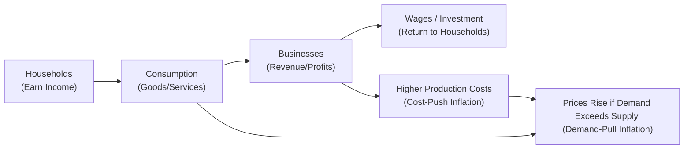

## 3.6 The Nature of Money and Inflation

It’s always fascinating, isn’t it, how a small piece of paper or a simple swipe of a credit card can result in us walking away with groceries, electronics, or even a new vacation booking? Money can sometimes feel like magic—yet behind the scenes, there’s a complex system of trust, regulation, and economics. In this section, we’ll explore what money really is, how it functions in our economy, and why inflation has such a powerful influence on the long-term value of our cash.

### Why Understanding Money and Inflation Matters

If you’re working in the financial industry—whether you’re a Registered Representative, an advisor, or someone who aspires to guide others in making investment decisions—you’ll soon realize how pivotal it is to grasp the concepts of money and inflation. After all, building and maintaining a client’s financial well-being often boils down to preserving and growing their purchasing power in the face of rising prices.

By understanding inflation and the role of money, you not only help your clients navigate the financial markets more effectively, but you also become better equipped to comply with regulations aimed at protecting investors. This is especially important in the Canadian context, where the Bank of Canada (our central bank) and various regulatory bodies like CIRO set rules that keep the economy balanced and consumers protected.

---

### The Functions of Money

Money isn’t only the coins jingling in your pocket or the digital numbers in your banking app. Regardless of whether it’s physical or electronic, money generally has three core functions:

• Medium of Exchange  
• Unit of Account  
• Store of Value  

Let’s briefly explore each.

#### Medium of Exchange

Money is widely accepted by sellers in exchange for goods and services. Before money, people had to barter: “I’ll trade you three chickens for that pair of shoes.” That was messy, slow, and often unfair. Today, a quick tap of a debit or credit card at a store is made possible because both sides trust and accept the official currency.

#### Unit of Account

Money helps us measure and compare the value of different goods and services. Without a common “measuring stick,” you’d never be sure if you’re paying a fair price for that chocolate bar or monthly gym membership. Because we use standard currency (e.g., Canadian dollars), we can easily compare how much different products cost relative to each other.

#### Store of Value

Money holds value over time—assuming inflation isn’t too high, of course. You can save your dollars in a bank account for a few months (or years) and still expect to use them to buy goods and services in the future. In a stable economy, money remains a dependable store of value.

---

### A Brief Look at the Canadian Money Supply

If you’ve heard terms like M1, M2, or M3, you might have wondered what they mean. In Canada, the money supply is broken down into various “M” categories based on the liquidity of the assets included.

• M1: The most liquid form of money. This typically includes physical currency (coins and bills) in circulation plus demand deposits (i.e., checking accounts or chequing accounts that can be accessed on demand).  
• M2: This adds slightly less liquid forms, such as savings accounts, term deposits under a certain amount, and non-personal notice deposits.  
• M3: Broader still, M3 can include large term deposits and non-personal deposits over a certain threshold.  

The Bank of Canada tracks these aggregates to gauge how much money is circulating in the economy. The more money out there, the greater the potential for inflation if it chases the same amount of goods and services. But it’s not always that straightforward—economic growth, consumer confidence, government policies, and global factors play huge roles as well.

---

### The Concept of Inflation

Have you ever heard an older friend or relative say something like, “I remember when a loaf of bread cost 20 cents”? That’s inflation in action. Inflation is the general increase in the price level of goods and services over time. With inflation, each dollar buys you a little bit less than it used to. It’s like slowly letting air out of a balloon—your dollar’s purchasing power shrinks, even if the actual number of dollars in your wallet remains the same.

#### How Inflation Is Measured

The most common measure of inflation in Canada is the Consumer Price Index (CPI). Statistics Canada tracks the prices of a “basket” of goods and services—things like groceries, housing costs, clothing, transportation, and so on—and calculates how these prices change each month. Then it aggregates these changes into the CPI.

• Bank of Canada’s Inflation Dashboard:  
  (https://www.bankofcanada.ca/core-functions/monetary-policy/inflation/)

• Statistics Canada’s CPI Data:  
  (https://www.statcan.gc.ca/)

These resources provide real-time snapshots of how inflation is behaving. For instance, if CPI goes up by 2% in a year, it implies that, on average, prices have risen by 2%.

#### Canada’s Inflation Target

The Bank of Canada generally aims for an inflation target of about 2% (with a range around that figure). You might wonder: “Why 2%? Why not 0%?” A small level of inflation is actually considered healthy. It encourages spending and investing, which helps the economy grow. If inflation is too high or erratic, people lose confidence in their currency and may start hoarding real assets. If inflation is too low or if it slides into negative territory, that can trigger deflationary cycles that discourage spending.

---

### Demand-Pull Vs. Cost-Push Inflation

Economists talk about two major types of inflationary pressure: demand-pull and cost-push. Let’s break those down with a few everyday examples.

#### Demand-Pull Inflation

Think of demand-pull inflation as “too many dollars chasing too few goods.” This occurs when consumer spending grows faster than the supply of goods and services. For instance, if job markets are booming and wages are rising, people might spend more freely on, say, electronics or new homes. If manufacturers and builders can’t keep up, prices start to climb.

#### Cost-Push Inflation

Cost-push inflation happens when the cost of producing goods and services rises, forcing producers to pass those higher costs on to consumers in the form of price hikes. Let’s say global oil prices skyrocket. Transporting goods gets expensive, and so do those next-day delivery fees you love. Companies, in turn, raise their prices to maintain profit margins, feeding the inflation cycle.

Both demand-pull and cost-push can occur simultaneously. It can get complicated when external factors like global commodity prices, exchange rates, and government policies all mingle together.

---

### Deflation—The Opposite of Inflation

Deflation is a drop in the average price level over time. Initially, it might sound great—lower prices, right? Well, the tricky part is that if people expect prices to keep falling, they may delay purchases, hoping goods and services will be cheaper tomorrow. This can reduce demand, slow economic growth, and even lead to higher unemployment as businesses scale back production. You might recall that major economies typically go to great lengths to avoid deflationary spirals. That’s one key reason Canada and many other countries set a positive inflation target: they want to keep the economy chugging along, not skidding to a halt.

---

### A Quick Note on Real Interest Rates

If you’ve ever felt perplexed that a 4% return on your investment doesn’t always seem to feel like a 4% gain in the real world, inflation is the culprit. The real interest rate is basically your inflation-adjusted return.

Here’s the simple formula in KaTeX:


\text{Real interest rate} = \text{Nominal interest rate} - \text{Inflation rate}


So, if your client is earning 5% interest on a bond, but inflation is 2.5%, the real interest rate is 2.5%. That’s the actual increase in purchasing power. Keeping an eye on real returns is crucial—especially if your investments are intended to fund long-term goals like retirement.

---

### The Role of Central Banks and Monetary Policy

Across the globe, central banks (like the Bank of Canada) operate monetary policy with a key goal: achieving price stability and supporting economic growth. How do they do it? Typically, by adjusting interest rates and influencing credit conditions. If inflation rises too fast, central banks may raise interest rates to cool off demand and vice versa.

In Canada, the Bank of Canada uses tools like the overnight lending rate, open market operations, and forward guidance. While these details can get a bit technical, it’s enough to know that these moves are aimed at keeping inflation near its sweet spot of around 2%.

---

### Why This Matters for Advisors

1. Preserving Purchasing Power:  
   When constructing a portfolio, consider how inflation can eat away at returns. For clients with very low risk tolerance who prefer holding large cash positions, it’s essential to remind them that a 1% return on cash in the face of 2% inflation is actually a net loss in real terms.

2. Long-Term Planning:  
   Suppose your client is saving for retirement or planning for their kids’ education. Factoring in inflation assumptions can mean the difference between meeting their goals or falling short. This is why many financial plans incorporate an expected inflation rate for “future value” calculations.

3. Asset Allocation:  
   Some assets, such as equities in companies with pricing power, or “real assets” like real estate or commodities, may offer better inflation hedges. And while no single approach is perfect, diversifying into inflation-protected securities (like Real Return Bonds in Canada) can also help.

4. Regulatory Expectations:  
   In line with CIRO’s guidelines (and historically speaking, the predecessor SROs—now retired—would also have expected this), advisors should be making suitable recommendations. Part of “suitability” is ensuring investments align with the reality of inflation risk, markets, and the client’s specific objectives.

---

### Common Pitfalls and How to Avoid Them

• Ignoring Inflation in Projections:  
  It’s easy to overlook how inflation accumulates over time. A $10,000-yearly expense grows to $12,191 in 10 years at a modest 2% annual inflation.

• Overestimating Returns:  
  Some advisors get starry-eyed with historical average returns but forget to adjust those returns for inflation. Always keep your eyes on the real rate of return for a more accurate picture.

• Relying on a Single Benchmark:  
  One index or one measure of inflation might not tell the whole story. For instance, certain items like health care or education might inflate faster than the general CPI.

• Overconcentration in “Safe” Assets:  
  Holding only low-yield bonds or piles of cash might keep nominal values stable, but inflation can erode value over time. Balance is key.

---

### Real-World Scenarios

1. Commodity Price Spike:  
   Imagine oil prices double in a year—like we’ve occasionally seen during global events. Transportation costs soar, boosting shipping rates and raising grocery prices. This can feed cost-push inflation and ripple through the entire economy.

2. Sudden Surge in Consumer Confidence:  
   Suppose consumers start spending windfalls from a government stimulus or experience a surge in job growth. Retail outlets see bigger crowds, and the housing market heats up. Demand grows faster than supply, triggering demand-pull inflation. The Bank of Canada might respond by nudging interest rates upward to bring inflation back under control.

3. Technology and “Good” Deflation:  
   In some industries (think consumer electronics), prices often drop over time due to innovation and competition. For instance, you might notice your smartphone is far more powerful than the one you owned five years ago, and the inflation-adjusted price might even be lower. That’s not the dangerous kind of deflation; it’s productivity-driven cost reductions.

4. Advisor’s Client Portfolio Adjustments:  
   Let’s say your client is mainly in fixed-income investments that yield around 2.5%. If inflation creeps up to 3%, that’s a negative real return. You might consider adjusting their portfolio to include inflation-sensitive assets so they can maintain or improve purchasing power.

---

### Visualizing Money Flows and Inflation Pressures

Below is a simplified Mermaid diagram to illustrate how money flows in the economy and how inflationary pressures might build up. Follow the text labels in the square brackets, which are in quotes:

Explanation:  
• Households earn income and use it to purchase goods and services.  
• Businesses receive that money as revenue.  
• Businesses pay wages and provide returns on investments back to households.  
• If consumer demand grows faster than production, we get demand-pull inflation.  
• If production costs spike, we get cost-push inflation which is often passed on in the form of higher prices.

---

### Best Practices for Advisors Regarding Inflation

• Stay Informed:  
  Regularly review official Bank of Canada publications, Stats Canada CPI data, and global inflation forecasts from bodies like the International Monetary Fund (IMF).  

• Diversify Strategies:  
  Consider a mix of stocks, bonds, and potentially alternative investments. Real Return Bonds (RRBs) in Canada can be especially beneficial to hedge inflation risk.  

• Educate Clients:  
  Encourage your clients to understand that a seemingly small inflation rate (say 2%) can significantly erode purchasing power over the years.  

• Use Reliable Tools:  
  Run sensitivity analyses in financial planning software to see how changes in inflation assumptions might affect retirement or other long-term goals.  

• Compliance and Suitability:  
  Keep in mind CIRO’s standards (as well as the historical expectations from defunct SROs like IIROC and MFDA). Ensure your recommendations regarding inflation-hedging strategies align with your client’s risk tolerance, objectives, and time horizon.

---

### Canadian Institutions and Resources

Below are some go-to resources for advisors and investors looking to stay up-to-date on inflation data and monetary policy:

• Bank of Canada’s Inflation Dashboard  
  (https://www.bankofcanada.ca/core-functions/monetary-policy/inflation/)  
  Offers insights into how inflation is trending and what factors are driving it.

• Statistics Canada  
  (https://www.statcan.gc.ca/)  
  Primary source for monthly CPI releases and data on various economic indicators.

• International Monetary Fund (IMF)  
  (https://www.imf.org/)  
  Provides global economic forecasts, including inflation rates by country.

• Canadian Investment Regulatory Organization (CIRO)  
  (https://www.ciro.ca)  
  Canada’s national self-regulatory organization that oversees investment dealers and mutual fund dealers. Updated regulations and guidelines for advisors, ensuring consumer protection in the face of economic shifts.

• Canadian Investor Protection Fund (CIPF)  
  (https://www.cipf.ca/)  
  Protects client assets if a member firm becomes insolvent. While not directly involved in inflation control, it safeguards your clients’ accounts when the unexpected happens.

---

### Encouraging Continuous Learning

Maybe you’re thinking, “Sure, I get the basics. But how do I keep up as markets and economies evolve?” The best approach is to keep yourself in a loop of continuous learning: attend webinars, follow economic reports, engage with professional development courses, and research new financial products. Inflation might stay near the 2% target most of the time, but world events can send it veering off course. Being prepared—and helping your clients prepare—will make you a more resilient advisor and a more trusted ally in their financial journey.

You’ll also find more insights on how these macroeconomic factors tie into Canadian regulations in earlier sections of the Conduct and Practices Handbook (particularly “The Canadian Regulatory Framework” sections). By weaving regulatory knowledge with economic awareness, you’re better positioned to meet both compliance standards and your clients’ best interests.

So, that’s the big picture: money is a tool that simplifies commerce (thankfully, we’re no longer trading three chickens for a pair of shoes), while inflation is the ever-present force gently eroding your client’s purchasing power—unless you plan ahead. As you move forward, keep these foundational ideas close at hand. They’ll guide you in selecting suitable investments, offering well-rounded advice, and ultimately ensuring that your clients’ financial goals aren’t derailed by the invisible toll of rising prices.

---

## Money & Inflation: Test Your Knowledge



### 1. Which of the following BEST describes the role of money as a medium of exchange?

- [ ] It ensures constant value over time.  
- [x] It facilitates transactions of goods and services without the need for barter.  
- [ ] It automatically adjusts for inflationary pressures.  
- [ ] It sets interest rates in the economy.  

> **Explanation:** Money as a medium of exchange means it is widely accepted as payment for goods and services, unlike a barter system which requires a direct exchange of goods.

### 2. What is the main purpose of the Consumer Price Index (CPI) in Canada?

- [ ] It measures total economic output.  
- [ ] It tracks the average wages across different sectors.  
- [x] It measures changes in the price level of a “basket” of goods and services.  
- [ ] It calculates total tax revenue for the government.  

> **Explanation:** Statistics Canada’s CPI tracks how the prices of a representative basket of goods and services change over time, helping to measure inflation.

### 3. Which of the following is an example of demand-pull inflation?

- [x] An economic boom where consumer purchases surge beyond supply.  
- [ ] A sudden increase in oil prices that raises manufacturing costs.  
- [ ] A decline in consumer spending due to higher taxes.  
- [ ] A government policy that reduces the money supply.  

> **Explanation:** Demand-pull inflation occurs when demand exceeds supply, pushing prices upward.

### 4. How does cost-push inflation typically begin?

- [ ] Central banks reducing interest rates.  
- [x] Increasing production costs passed on to consumers.  
- [ ] A surge in consumer demand for luxury goods.  
- [ ] Government reducing consumer taxes.  

> **Explanation:** Cost-push inflation is driven by rising input costs (e.g., raw materials, wages), forcing producers to raise prices.

### 5. Which statement is TRUE about deflation?

- [ ] Deflation always stimulates consumer spending.  
- [x] Deflation might cause consumers to delay purchases in anticipation of lower prices.  
- [ ] Deflation leads to high government debt, in all cases.  
- [ ] Deflation is encouraged by most central banks.  

> **Explanation:** Deflation can be harmful because people may postpone spending, which can slow economic growth.

### 6. According to the formula, Real Interest Rate = Nominal Interest Rate – Inflation Rate, if your investment earns 4% nominally and inflation is 2%, what is your real interest rate?

- [ ] 6%  
- [ ] 2%  
- [ ] 4%  
- [x] 2%  

> **Explanation:** Substituting the numbers: 4% – 2% = 2% real rate of return.

### 7. What is one argument for why a small degree of inflation (e.g., around 2%) is considered beneficial?

- [ ] It weakens consumer confidence.  
- [x] It encourages spending and fosters economic growth.  
- [ ] It keeps prices static.  
- [ ] It guarantees higher taxes.  

> **Explanation:** A moderate level of inflation can motivate consumers to spend sooner rather than wait, thereby supporting economic growth.

### 8. Why is it important for an advisor to consider real returns instead of just nominal returns?

- [ ] Real returns usually appear in monthly CPI reports.  
- [ ] Traditionally, nominal rates are the only valuable metric.  
- [x] Inflation erodes the purchasing power of the nominal return.  
- [ ] Regulators only allow real returns to be reported to clients.  

> **Explanation:** Real returns account for inflation’s effect on purchasing power—critical for accurate portfolio planning.

### 9. Which resource offers regular updates on Canada’s inflation levels?

- [x] The Bank of Canada’s Inflation Dashboard.  
- [ ] The IMF’s foreign currency reserves database.  
- [ ] CIRO’s rulebook on client interactions.  
- [ ] CIPF’s investor protection guidelines.  

> **Explanation:** The Bank of Canada’s Inflation Dashboard is specifically designed to track and analyze inflationary trends in Canada.

### 10. True or False: Holding large amounts of cash without earning interest during a period of inflation leads to a loss of purchasing power.

- [x] True  
- [ ] False  

> **Explanation:** Inflation erodes the value of idle cash over time, resulting in reduced purchasing power.


