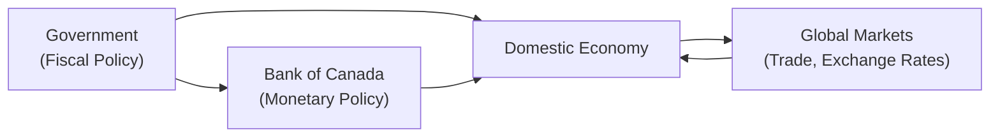

## 3.7 How do Fiscal and Monetary Policies and International Economics Impact the Economy?

Have you ever wondered why sometimes governments announce big tax breaks, or why the Bank of Canada suddenly hikes interest rates, making borrowing more expensive? Or maybe you’ve found yourself scratching your head when the Canadian dollar dips, then rebounds, then dips again—perhaps right before your vacation to the U.S. or overseas? Well, these moments are connected to fiscal policy, monetary policy, and international economics. In this section, we’ll talk about how government decisions, central bank actions, and global economic conditions interact to shape our everyday financial landscape—sometimes more than we might expect. 

Even if you’re brand new to these topics, hang in there. I remember feeling like my head was spinning the first time I heard about “interest rate targeting” as a new economics student. But trust me, once you start connecting the dots, it becomes clearer why these big-picture policies matter for your clients’ portfolios, or even your own personal finances. The opportunities to connect these concepts to mutual fund performance abound—especially in a place like Canada, which is so integrated with the global economy.

---

### The Power of Fiscal Policy

Fiscal policy refers to how governments tax and spend to influence the economy. It’s kind of like that time your friend decided to “treat” everyone to dinner, boosting the group’s mood and spending power for that evening. Except on a much bigger, national scale.

• Expansionary Fiscal Policy  
  – This is when the government lowers taxes or ramps up spending to stimulate economic growth, usually during a slowdown or recession. As the government injects money into the economy—think infrastructure investments like roads, bridges, or public transit projects—overall demand can rise.  
  – Lower taxes mean people have more disposable income and businesses face fewer tax burdens, encouraging them to spend, invest, and create jobs.  

• Contractionary Fiscal Policy  
  – This is basically the government stepping on the brakes when the economy is overheated or running large deficits. It looks like higher taxes, reduced public spending, or both.  
  – I know, I know—nobody typically loves the idea of higher taxes. But sometimes it’s necessary to keep inflation in check or to ensure the government’s finances remain sustainable.  

#### Practical Impact on Markets

From a mutual fund representative’s perspective, it’s crucial to watch for signals of changes in fiscal policy. For instance, if the government increases spending on infrastructure, industries tied to construction or materials might see higher demand. That could give a lift to equity funds focusing on those sectors. On the flip side, if taxes are increased on certain luxury goods, companies that make those products might experience a dip in sales, potentially impacting earnings—and equity mutual funds holding those companies could see fluctuations. 

Meanwhile, government deficits or surpluses can influence bond markets. Large deficits can lead to increased government borrowing, which can affect bond supply, prices, and yields over time. As noted in Chapter 7 (Types of Investment Products and How They Are Traded) and Chapter 11 (Conservative Mutual Fund Products), bond mutual funds are sensitive to interest rate and supply-demand dynamics in government securities.

---

### The Role of Monetary Policy

If fiscal policy sets the stage, monetary policy writes the script on money supply and the cost of borrowing (interest rates). In Canada, the Bank of Canada is the central bank, and it holds the steering wheel when it comes to controlling inflation, stabilizing the currency, and supporting economic growth.

• Managing Interest Rates  
  – The Bank of Canada’s main objective is price stability, which it interprets as maintaining about a 2% inflation target over the medium term.  
  – Let’s say you’re watching the news, and you hear the Bank of Canada might raise interest rates. That often means borrowing becomes more expensive. Individuals may slow their spending, and businesses might hesitate to expand. The economy cools off, which helps contain inflation.  
  – Conversely, if the Bank of Canada lowers interest rates, it’s cheaper to borrow money—spending often goes up, businesses expand more readily, and the economy can heat up a bit.  

• Open Market Operations  
  – This fancy term basically means the Bank of Canada buying or selling government securities (like bonds) in the open market. When it buys securities, it pumps more money into the financial system. When it sells them, it drains money out of the system.  
  – These transactions indirectly impact interest rates and the overall liquidity in the banking system.  

#### Influence on Mutual Funds

Interest rate changes can cascade across many types of mutual funds. Let’s suppose the Bank of Canada signals it might raise rates in the coming months. You might observe:  
  – Bond prices generally go down when interest rates go up (as explained in Chapter 7.3, The Fundamentals of Bond Pricing and Properties). Hence, bond mutual funds could dip in value if they hold longer-term bonds.  
  – Equity markets might also react because higher rates can slow company expansions and reduce expected profits. But certain sectors, like banks or insurance companies, can benefit from higher interest rates.  

For mutual fund representatives, it’s often beneficial to keep an eye on the central bank’s announcements and inflation data. That’s because your advice regarding suitable product recommendations might shift if you believe interest rates will trend higher or lower for a sustained period. Chapters 8 (Constructing Investment Portfolios) and 14 (Understanding Mutual Fund Performance) can help you delve deeper into how these macroeconomic factors affect portfolio returns.

---

### Connecting with International Economics

Now, imagine Canada as a small open economy—like a busy, bustling port city. Goods and services are constantly flowing in and out, and we have travelers (capital flows) always arriving or departing. International economics plays a huge role here, and ignoring it would be like not checking the weather before launching a boat trip. Overlooking those winds and waves can lead to some choppy sailing.

• Trade Policies and Agreements  
  – Canada has multiple trade deals (e.g., the USMCA with the United States and Mexico). These agreements stipulate rules on how goods get traded and can shape the competitiveness of certain sectors, such as automotive, agriculture, or technology.  
  – If a new agreement lowers tariffs on Canadian lumber, we might see that industry surge. Conversely, if foreign buyers slap tariffs on Canadian steel, local producers might struggle. Those changes in competitiveness can impact the profitability of certain equity mutual funds focusing on those sectors.  

• Exchange Rates  
  – Exchange rates can rise or fall as global investors buy or sell Canadian dollars, or as the Bank of Canada changes interest rates. A stronger Canadian dollar makes imports cheaper but can make Canadian exports more expensive abroad.  
  – If you’re investing in a global mutual fund or a U.S. equity fund, exchange rate movements affect your returns when these foreign assets are converted back to Canadian dollars. That’s why many fund managers use currency hedging strategies to limit that volatility (see Chapter 5, Behavioural Finance, for some discussion on emotional biases around currency fluctuations).  

• Balance of Payments and Current Account  
  – This is sort of like your personal cash flow statement with the rest of the world. If Canada sells more goods and services abroad than it imports, we enjoy a trade surplus. If the opposite is true, we have a trade deficit.  
  – The current account also includes net earnings from abroad (like investment income) and direct transfers. Large deficits or surpluses can influence exchange rates, foreign confidence in the Canadian economy, and equity/bond markets.  

#### A Real-World Anecdote

I recall a time when one of my friends was super excited about an international vacation plan—only to find that the Canadian dollar had weakened significantly right before her trip. The result? The run-of-the-mill sightseeing turned extra expensive in local currency terms. On a broader scale, that same currency movement can make foreign equity investments more or less valuable once converted back to CAD. So, for mutual fund reps, a changing exchange rate is not just an academic concept; it translates into real returns.

---

### Why Mutual Fund Representatives Should Care

You may be thinking: “But wait, I’m not the Finance Minister, nor am I the Governor of the Bank of Canada, so why should I care about all these macro-level decisions?” The short answer: because your clients (and you) operate within the markets these decisions affect. 

• Systematic Shifts in Market Conditions  
  – Changes in interest rates can reshape bond yields, affecting bond funds and other conservative investment vehicles (see Chapter 11 and Chapter 12 for more on conservative vs. riskier mutual fund products).  
  – Major fiscal expansions can trigger inflationary pressures or spur economic growth, altering both equity and fixed-income returns.  
  – Currency fluctuations can transform the performance of internationally invested mutual funds—sometimes dramatically.  

• Client Conversations  
  – You might find that a client asks, “Why is my global equity fund struggling when the underlying companies seem to be doing well?” Well, maybe the loonie has appreciated significantly, reducing returns when converted from a foreign currency back to CAD.  
  – Another client may wonder why their bond fund is dipping in price. Perhaps interest rates are on an upward swing because the Bank of Canada is fighting inflation. Being able to connect these dots solidifies your role as a confident, knowledgeable advisor.  

---

### Common Pitfalls and Strategies

• Overlooking Policy Shifts  
  – Some mutual fund representatives ignore large-scale macroeconomic shifts, focusing solely on historical returns. But past performance may not reflect how a fund will do if there’s a pending interest rate hike or a big change in government spending.  

• Timing the Market Based on Policy Speculation  
  – There’s a temptation to try to outsmart the market by guessing what the Bank of Canada will do next. But this can lead to risky strategies, like overly aggressive short-selling or day trading. Instead, it’s often more prudent to stay balanced and diversified.  

• Blindness to Currency Effects  
  – If you or your clients hold foreign mutual funds, ignoring exchange rate movements can be costly. Consider whether currency-hedged products or partial hedges might fit your client’s risk tolerance.  

• Ignoring Global Indicators  
  – Trade wars, ongoing tensions, or new trade agreements can impact certain funds significantly. Don’t forget to stay attuned to global indicators, especially for equity and bond funds with international exposure.  

#### Strategies to Overcome These Pitfalls

1. Stay Informed: Follow credible sources, such as the Bank of Canada’s website (https://www.bankofcanada.ca/core-functions/monetary-policy) for monetary policy announcements or the Government of Canada’s Department of Finance (https://www.canada.ca/en/department-finance) for budget updates.  
2. Incorporate a Broader Perspective: Take advantage of open-source platforms like FRED (https://fred.stlouisfed.org) to compare historical data on interest rates, inflation, and exchange rates.  
3. Diversify Client Portfolios: As emphasized in Chapter 8 (Constructing Investment Portfolios), diversification can help cushion against macro-level shocks—be they fiscal, monetary, or global in nature.  
4. Professional Development: If you want a deeper dive, consider reading notable works like “International Economics: Theory and Policy” by Paul Krugman and Maurice Obstfeld, or even specialized courses on global macroeconomics.  

---

### Visualizing the Interplay of Fiscal Policy, Monetary Policy, and Global Markets

Below is a simplified diagram to help you picture how government decisions, central bank actions, and international dynamics all converge to shape the domestic economy.

• Government influences the Domestic Economy through its tax and spending decisions (fiscal policy).  
• The Bank of Canada, tasked with monetary policy, also directly impacts the Domestic Economy—largely through changes in interest rates and money supply.  
• Global Markets interact with the Domestic Economy via trade flows, exchange rate movements, and capital inflows/outflows.  
• Government decisions (tariffs, trade agreements) can also interact with Bank of Canada policies (open market operations, interest rates), magnifying or dampening their combined effect.

---

### Case Study: A Hypothetical Scenario

Picture the following: The Canadian government decides to implement expansionary fiscal measures to boost economic growth—spending more on infrastructure, offering tax incentives to small businesses, and providing tax credits for energy-efficient home upgrades. Around the same time, inflation starts ticking above the Bank of Canada’s 2% target due to rising consumer demand.

• Monetary Policy Response  
  – The Bank of Canada sees inflation creeping up and decides to increase interest rates to “cool” the economy slightly. Borrowing becomes more expensive.  
  – Bond prices might fall, affecting bond mutual funds. Certain equity funds, especially in cyclical sectors, might experience volatility as the cost of capital rises.  

• International Interplay  
  – Canada’s currency might strengthen if the interest rate goes up (as global investors can get a higher return on Canadian debt instruments), which can reduce the competitiveness of Canadian exports—impacting certain exporters and the funds that invest in them.  
  – Meanwhile, foreign capital might pour in because Canada is offering relatively attractive interest rates.  

• Outcome for Mutual Fund Portfolios  
  – Equity funds concentrating on infrastructure or energy-efficient technologies might flourish from government spending.  
  – Global funds or U.S. equity funds might see a lower (CAD) return if the Canadian dollar appreciates compared to the U.S. dollar.  
  – Phenomena like “crowding out” can occur if higher interest rates lead to less private investment—affecting overall economic growth in the long run.  

---

### References and Additional Resources

• Government of Canada’s Budget and Fiscal Policy Guidelines:  
  https://www.canada.ca/en/department-finance  
• Bank of Canada’s Website on Monetary Policy:  
  https://www.bankofcanada.ca/core-functions/monetary-policy  
• Access Global Macroeconomic Data via FRED (Federal Reserve Economic Data):  
  https://fred.stlouisfed.org  
• “International Economics: Theory and Policy” by Paul Krugman and Maurice Obstfeld  
• CIRO (Canadian Investment Regulatory Organization) Resources (2025 regulatory environment):  
  https://www.ciro.ca  

If you’re operating as a mutual fund representative in Canada, remember that CIRO (the Canadian Investment Regulatory Organization) is now your main self-regulatory organization, consolidating what were historically the MFDA and IIROC. While these organizations no longer exist as separate bodies, their historical regulatory frameworks continue to inform Canada’s current standards for ethical and compliant investment advice.

---

### Conclusion and Encouragement

So, fiscal policies are about government spending and taxes, monetary policies are about central bank decisions and interest rates, and international economics is about how we all dance together in the global marketplace. If you’re feeling somewhat overwhelmed, don’t worry. The more you practice connecting events in the news to market movements and portfolio performance, the more natural it becomes. 

In my experience, the lightbulb moment often comes when you tie a seemingly abstract concept—like open market operations—to something tangible, like the price of groceries or the value of your currency when you travel abroad. It’s truly all intertwined.

If you stay curious, keep an eye on major policy announcements, and apply these insights to your mutual fund recommendations, you’ll be providing more holistic, high-value guidance. Not only that, but your clients will thank you for helping them understand why their portfolios behave the way they do when interest rates, government spending, or trade conditions shift.

Remember, economics is a framework that helps us see how everything is connected. It’s just as relevant to your daily coffee budget as it is to national policy. Embrace it, keep learning, and have fun explaining it to those you help. When your clients see that you understand these big forces—and can break them down in ways they get—your credibility goes through the roof.

---

## Test Your Knowledge: Fiscal, Monetary & Global Market Dynamics



### Which of the following actions exemplifies expansionary fiscal policy?

- [ ] Increasing interest rates to curb inflation.
- [x] Lowering taxes and boosting government spending.
- [ ] Selling government securities to reduce the money supply.
- [ ] Introducing tariffs on imported goods to raise revenue.

> **Explanation:** Expansionary fiscal policy generally involves lowering taxes or raising government spending. This stimulates economic activity by increasing disposable incomes and boosting consumer and business spending.

### Which statement best describes the Bank of Canada’s primary monetary policy goal?

- [ ] Achieving zero unemployment at all times.
- [ ] Stabilizing the currency within a fixed exchange rate.
- [x] Targeting inflation around 2%.
- [ ] Controlling government budgets through fiscal measures.

> **Explanation:** The Bank of Canada’s main monetary policy objective is to keep inflation around 2%. It uses tools like interest rate adjustments and open market operations to maintain price stability.

### How might an increase in Canadian interest rates affect the value of the Canadian dollar against other currencies?

- [x] It may cause the Canadian dollar to appreciate.
- [ ] It universally guarantees a depreciation of the Canadian dollar.
- [ ] It has no direct impact on the Canadian dollar’s value.
- [ ] It automatically leads to higher inflation.

> **Explanation:** Higher interest rates typically attract foreign capital looking for a better return, which can lead to an appreciation of the currency.

### What is a common effect of contractionary fiscal policy?

- [ ] Consumer demand and inflation usually rise.
- [ ] Bond prices always soar due to higher interest rates.
- [x] Government spending decreases or taxes rise to slow economic activity.
- [ ] Exchange rates become fixed.

> **Explanation:** Contractionary fiscal policy involves higher taxes or reduced spending to temper inflationary pressures or reduce deficits, which usually constrains economic activity.

### Which of the following might be a result of Canada signing a new trade agreement that reduces tariffs on Canadian lumber exports?

- [x] Canadian lumber producers may see higher demand and increased profits.
- [ ] The Canadian dollar always loses value.
- [x] Equity mutual funds focusing on the lumber sector could benefit.
- [ ] Bond prices never change in response to tariff adjustments.

> **Explanation:** Reduced tariffs often boost export demand. Consequently, the profitability of lumber producers could rise, which may enhance the performance of equity funds with holdings in that sector.

### How do open market operations influence the money supply?

- [x] By buying or selling government securities, central banks inject or withdraw money from the financial system.
- [ ] By setting tax laws for corporations.
- [ ] By controlling international trade flows directly.
- [ ] By mandating foreign exchange rates.

> **Explanation:** Open market operations involve a central bank’s purchase or sale of government securities to influence the money supply and interest rates.

### If the Bank of Canada unexpectedly raises interest rates, which of the following outcomes is likely?

- [ ] Bond prices immediately rise due to cheaper borrowing costs.
- [x] Bond prices decline as yields rise.
- [x] Stock markets might become more volatile.
- [ ] The cost of borrowing remains unchanged for consumers and businesses.

> **Explanation:** An interest rate hike typically reduces bond prices and may make stock markets more volatile, as companies face higher borrowing costs and investors re-price risk.

### A strengthening Canadian dollar can negatively affect which of the following?

- [x] Export-oriented companies.
- [ ] Fixed-income investors with no exposure to foreign currency.
- [ ] Companies purely selling goods and services in Canada.
- [ ] The Bank of Canada’s interest rate decisions are unrelated to currency strength.

> **Explanation:** A stronger loonie makes Canadian exports more expensive abroad, potentially eroding competitiveness and profitability for export-oriented firms.

### When a country’s current account is in surplus, it generally implies:

- [x] It exports more goods, services, and capital income than it imports.
- [ ] It is experiencing a budget surplus in government finances.
- [ ] It is imposing trade restrictions and tariffs on all imports.
- [ ] It has higher interest rates than all other nations.

> **Explanation:** A current account surplus indicates that exports of goods, services, and earnings from abroad exceed imports and payments.

### The best description of how fiscal and monetary policies interrelate is:

- [x] They often move in opposite directions to balance inflation and growth.
- [ ] They are completely disconnected policies with unrelated goals.
- [ ] The Bank of Canada directly determines government spending targets.
- [ ] Fiscal policy is only used during trade deficits.

> **Explanation:** Fiscal (tax and spending) and monetary (interest rates and money supply) policies often aim to achieve inflation control, employment, and stable growth, sometimes working in tandem or in opposite directions to maintain macroeconomic balance.


